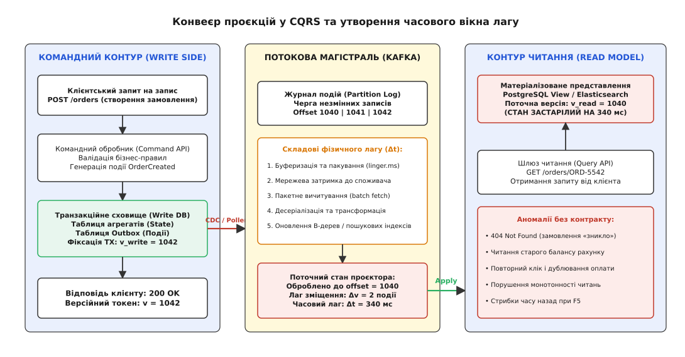
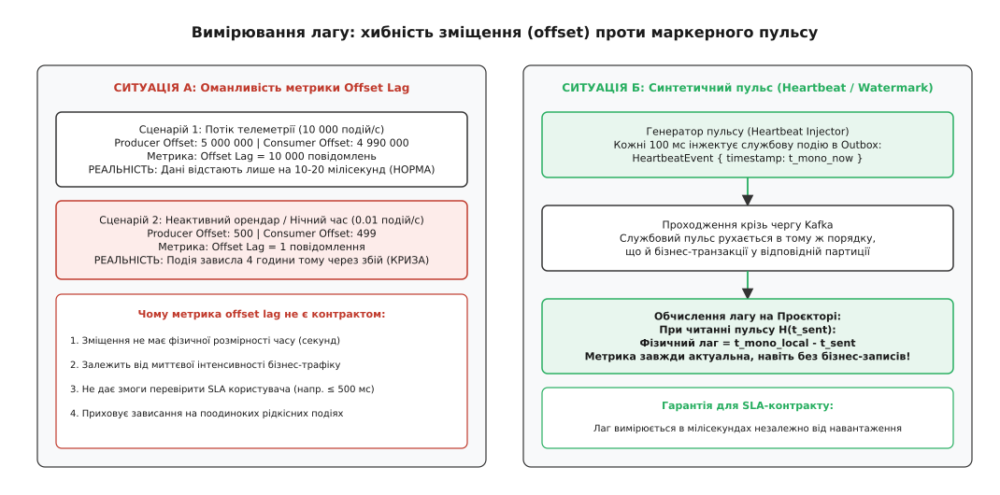
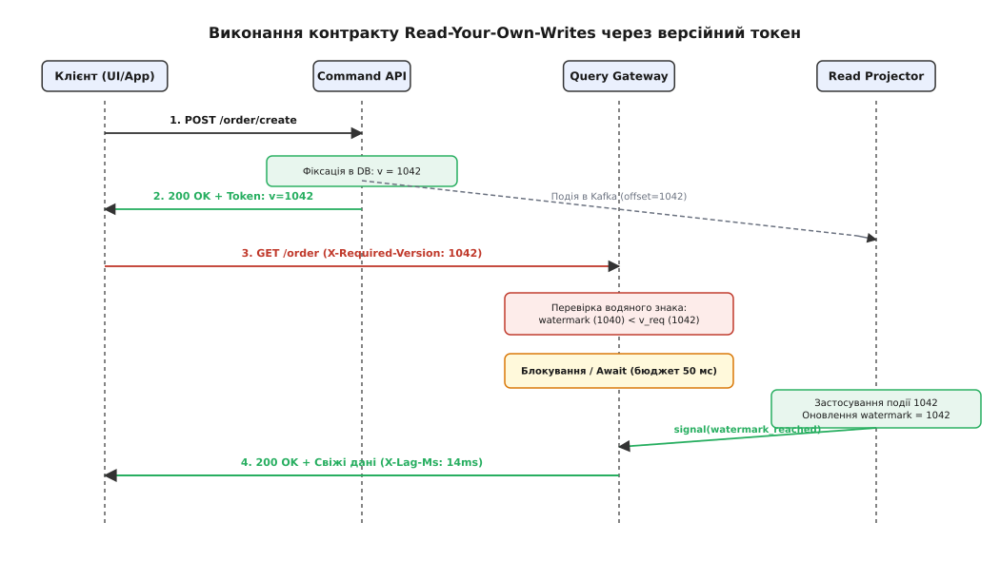

# Лаг read-model як контракт

<preknowlist>
- [Кінцева узгодженість на практиці](topic:programming/eventual-consistency) — модель узгодженості, за якої стан реплік збігається лише за відсутності нових записів.
- [Transactional outbox](topic:programming/outbox-pattern) — патерн надійного збереження подій у тій самій транзакції, що й стан агрегату.
- [Журнал подій (Kafka-модель)](topic:programming/event-log) — впорядкований незмінний потік повідомлень із фіксацією зміщень (offsets).
- [Реплікаційний лаг і сесійні гарантії](topic:programming/replication-lag) — фізичні затримки поширення змін у розподілених базах даних.
- [Таймаути і бюджет часу](topic:programming/timeouts-deadlines) — обмеження часу очікування та поширення дедлайнів між сервісами.
</preknowlist>

Покупець оформлює замовлення в інтернет-магазині: вибирає товар, застосовує подарунковий сертифікат на 500 гривень і натискає кнопку «Оплатити». Серверний командний обробник перевіряє залишок товару, списує кошти, фіксує транзакцію в реляційній базі даних і повертає відповідь `200 OK` з ідентифікатором замовлення `ORD-9142`. Браузер негайно перенаправляє користувача на сторінку особистого кабінету `/orders/ORD-9142`, щоб відобразити статус доставки та оновлений баланс.

Запит на читання потрапляє на пошуковий сервіс або денормалізоване сховище представлень (Read Model), але на екрані з'являється повідомлення `404 Not Found`, а баланс сертифіката показує попередні 500 гривень.

Користувач припускає, що оплата зірвалася, повертається до кошика й натискає «Оплатити» вдруге, що призводить до подвійного списання або блокування рахунку службою безпеки. Сервери не втрачали даних і не виходили з ладу. Система реалізувала архітектурний патерн розділення відповідальності команд і запитів (CQRS), де контур запису зафіксував зміну за 12 мілісекунд, але фоновий обробник проєкцій у цей момент відставав від потоку подій на 480 мілісекунд.

Часову та версійну різницю між миттю фіксації стану в первинному джерелі правди та миттю її відображення в денормалізованому читанні називають **лагом моделі читання** (англ. *read-model lag*, від англ. *read* — «читати», *model* — «модель», від лат. *modulus* — «міра, зразок», та середньоангл. *laggen* — «відставати»). Коли цей лаг залишається некерованим і невимірюваним, система руйнує базові користувацькі очікування. Перетворення лагу з непередбачуваного побічного ефекту на явний програмний контракт — єдиний спосіб зберегти масштабованість читань без втрати логічної цілісності бізнес-процесів.

## Чому виникає модель читання: межі нормалізованого запису

У реляційних системах транзакційний запис оптимізовано під нормалізацію (третя нормальна форма), атомарність та ізоляцію транзакцій. Щоб зберегти замовлення, система блокує мінімальну кількість рядків у таблицях `orders`, `order_items`, `wallets` та `inventory`.

Проте запити на читання мають протилежну природу: клієнтському інтерфейсу, аналітичним дашбордам та мобільним застосункам потрібен єдиний складений документ. Їм необхідно відобразити ім'я покупця, перелік із двадцяти товарів з їхніми актуальними фотографіями, статус доставки з логістичного сервісу, суму знижки та історію попередніх звернень.

Якщо виконувати такий запит до нормалізованої транзакційної бази, виникають три фундаментальні проблеми:
1. **Ресурсне виснаження через операції з'єднання (JOIN).** Об'єднання 8–12 таблиць на кожному перегляді сторінки змушує рушій бази сканувати численні індекси й утримувати блокування розділюваного читання (Shared Locks), сповільнюючи паралельні транзакції запису.
2. **Неможливість оптимізації під різні типи пошуку.** Реляційні B-дерева ефективні для точкових вибірок за первинним ключем, але неефективні для повнотекстового нечіткого пошуку (Elasticsearch/OpenSearch), геопросторових радіальних запитів чи побудови графів зв'язків.
3. **Конкуренція за ресурси вводу-виводу (I/O).** Масові читання звітів та каталогів забирають сторінковий кеш і дискову смугу пропускання в критичних транзакцій оформлення замовлень.

Щоб подолати ці обмеження, архітектура розділяє систему на два незалежні контури:
- **Командний контур (Command Side / Write Model):** приймає бізнес-команди, валідує інваріанти агрегатів, змінює стан і публікує незмінні події про те, що сталося (наприклад, `OrderCreated`, `PaymentDeducted`).
- **Контур читання (Query Side / Read Model):** асинхронно вичитує потік подій і формує спеціалізовані, наперед розраховані та денормалізовані представлення — матеріалізовані таблиці, документи в документних сховищах або індекси в пошукових рушіях.

Цей процес перетворення потоку подій на оптимізовану структуру читання називають **проєкцією** (англ. *projection*, від лат. *proicere* — «викидати вперед, виставляти»).


*Конвеєр реплікації подій між командним контуром та моделлю читання: затримки буферизації, мережі та індексації формують вікно неактуальності даних.*

## Анатомія конвеєра проєкцій: де накопичується затримка

Лаг моделі читання `Δt` — це сумарний час, який потрібен події, щоб пройти шлях від моменту фіксації локальної транзакції на вузлі запису до моменту, коли змінений стан стає видимим для запиту користувача в сховищі читання.

Цей конвеєр складається з шести послідовних фізичних фаз:

```
t_lag = t_outbox + t_transport + t_broker_queue + t_consumer_fetch + t_projection_compute + t_index_refresh
```

Розглянемо механіку кожної ланки:

1. **Екстракція з первинного сховища (`t_outbox`):**
   Командний сервіс зберігає подію в таблиці `outbox` у межах тієї ж транзакції, що й бізнес-сутності. Процес захоплення змін (CDC — Change Data Capture на основі Debezium або опитування таблиці) вичитує журнал транзакцій (WAL у PostgreSQL або binlog у MySQL). Затримка виникає через інтервал опитування або частоту скидання буферів реплікаційного слота (типово 5–50 мс).
2. **Мережева передача до брокера (`t_transport`):**
   Відправник пакує події в TCP-пакети та надсилає їх до кластера брокера повідомлень (Apache Kafka, RabbitMQ або NATS). Затримка визначається фізичною відстанню між дата-центрами та розміром мережевих буферів (типово 1–15 мс).
3. **Буферизація та реплікація в брокері (`t_broker_queue`):**
   Брокер записує подію в журнал партиції та чекає підтвердження від кворуму реплік (`acks=all` у Kafka). Якщо продюсер використовує групування (`linger.ms = 20`, `batch.size = 64KB`), подія очікує заповнення пакета (типово 5–30 мс).
4. **Отримання споживачем проєкції (`t_consumer_fetch`):**
   Фоновий процес побудови проєкції (Projector Worker) вичитує події з брокера пачками (`max.poll.records = 500`). Якщо споживач зайнятий обробкою попередньої важкої пачки, нова подія стоїть у черзі партиції (типово 10–200 мс, але за сплесків навантаження — до кількох секунд).
5. **Обчислення та запис стану проєкції (`t_projection_compute`):**
   Проєктор десеріалізує повідомлення з JSON або Protobuf, знаходить потрібний документ у сховищі читання, застосовує зміни до структури даних і виконує операцію оновлення (`UPSERT`). Якщо документ містить масив вкладених об'єктів або вимагає блокування рядка в базі читання, ця фаза забирає 5–50 мс на транзакцію.
6. **Оновлення пошукових сегментів та видимість (`t_index_refresh`):**
   У таких сховищах, як Elasticsearch чи Apache Lucene, операція запису не робить документ доступним для пошуку негайно. Документ потрапляє в буфер оперативної пам'яті (In-memory Index Buffer). Він стає доступним для операцій пошуку лише після операції `refresh`, яка скидає буфер у новий сегмент файлової системи. За замовчуванням `refresh_interval` становить 1000 мс (1 секунда). Отже, навіть якщо процесор завершив обчислення за 1 мілісекунду, пошуковий запит не побачить документ ще до 1000 мс.

Сумарний фізичний лаг у стабільному стані системи становить від 50 до 1200 мілісекунд. Проте під час збоїв мережі, перебалансування партицій або сплесків трафіку лаг може зростати до десятків секунд або хвилин.

## Пастка «кінцевої узгодженості»: чому відсутність контракту руйнує систему

Тривалий час в інженерній спільноті панувала спрощена теза: «CQRS означає кінцеву узгодженість (eventual consistency), тому система колись зійдеться, а клієнтський інтерфейс має просто показувати анімацію завантаження (spinner) або блокувати інтерфейс на секунду».

Такий підхід є антипатерном, оскільки абстрактна «кінцева узгодженість» без кількісних меж і протоколів поведінки призводить до трьох критичних аномалій:

### 1. Порушення читання власних записів (Read-Your-Own-Writes Violation)
Користувач здійснює дію (створює коментар, змінює пароль, поповнює рахунок) і очікує, що його наступний крок опиратиметься на результат цієї дії. Якщо після збереження профілю користувач відкриває налаштування й бачить старі дані, він не знає: чи збереження не спрацювало, чи треба заповнити форму знову, чи сталася системна помилка.

### 2. Порушення монотонності читань (Monotonic Read Violation)
Контур читання масштабується горизонтально: клієнтські запити балансуються між кількома інстансами сховища читання (наприклад, трьома репліками Elasticsearch або Read-репліками PostgreSQL).

Якщо Репліка А відстає від журналу подій на 100 мс, а Репліка Б — на 800 мс, користувач стикається з ефектом «подорожі в часі назад»:
1. Перший GET-запит потрапляє на Репліку А: користувач бачить баланс 1000 грн (свіжий стан).
2. Користувач оновлює сторінку через 2 секунди, запит потрапляє на Репліку Б: баланс раптово повертається до 500 грн (старий стан).
3. Користувач оновлює сторінку втретє, запит знову потрапляє на Репліку А: баланс знову стає 1000 грн.

З погляду користувача або зовнішньої інтеграційної системи база даних поводиться хаотично, демонструючи спонтанне зникнення і появу транзакцій.

### 3. Руйнування причинно-наслідкових ланцюгів (Causal Inconsistency)
Користувач А публікує запитання у корпоративному чаті. Користувач Б бачить це запитання та публікує відповідь. Проєкція, яка будує стрічку повідомлень, обробляє події через дві різні партиції без збереження глобального причинного порядку.

У результаті Користувач В відкриває чат і бачить відповідь Користувача Б вище за запитання Користувача А, або бачить відповідь на запитання, якого взагалі ще немає у списку. Порушується інваріант: «наслідок не може бути видимим раніше за причину».

Історію того, як індустрія перейшла від ейфорії безконтрольної кінцевої узгодженості до усвідомлення необхідності строгих гарантій, описано у вставці [еволюція CQRS та відкриття ціни лагу](topic:programming/read-model-lag/hist-cqrs-consistency.md).

## Вимірювання лагу: різниця між зміщенням та фізичним часом

Щоб керувати лагом як контрактом, його необхідно точно вимірювати в реальному часі. Існує дві принципово різні метрики лагу, які часто плутають:

1. **Лаг зміщення (Offset Lag):** кількість повідомлень у черзі брокера між останнім записаним продюсером зміщенням (`High Watermark`) та зміщенням, яке зараз обробляє споживач (`Current Offset`):
```
Lag_offset = Offset_producer - Offset_consumer
```
2. **Фізичний часовий лаг (Temporal / Wall-Clock Lag):** різниця між поточним часом та фізичною міткою часу створення події:
```
Lag_time = t_current - t_event_created
```

Покладання виключно на `Offset Lag` створює небезпечну ілюзію стабільності або навпаки — хибну паніку.


*Метрика зміщення (Offset Lag) залежить від щільності потоку подій, тоді як синтетичний пульс (Watermark) гарантує точне вимірювання фізичного часу відставання.*

Розглянемо два протилежні сценарії:
- **Високонавантажений потік телеметрії (10 000 подій/с):** `Offset Lag = 5 000` повідомлень. Метрика виглядає загрозливо великою, проте за швидкості обробки 10 000 подій/с цей лаг долається за `5000 / 10000 = 0.5` секунди (500 мс). Система працює в межах нормального SLA.
- **Низьконавантажений фінансовий контур уночі (1 подія на 10 хвилин):** `Offset Lag = 1` повідомлення. Метрика показує одиницю, що виглядає як ідеальний стан. Але якщо обробник проєкцій завис через взаємне блокування (deadlock) три години тому, це єдине повідомлення чекає в черзі вже 180 хвилин. Реальний фізичний лаг становить 3 години, а моніторинг мовчить, бо зміщення дорівнює одиниці.

### Проблема розходження годинників (Clock Skew) та синтетичний пульс
Обчислення фізичного лагу через різницю настінних годинників `t_now - t_event` стикається з фізичною проблемою: годинники на вузлі продюсера (Command Service) та вузлі споживача (Projector) ніколи не бувають ідеально синхронізованими. Навіть із протоколом NTP розходження між серверами може становити від 5 до 100 мілісекунд, а у разі стрибків віртуалізації (VM pause) або коригування секунд координації (leap seconds) різниця годинників може давати від'ємні значення лагу.

Щоб вирішити цю проблему, застосовують **синтетичний маркерний пульс (Synthetic Heartbeat / Watermark Ingestion)**:
1. Окремий фоновий таймер на командному контурі щосекунди (або кожні 100 мс) записує у потік подій службове повідомлення: `HeartbeatEvent { emitter_id: "cmd-1", sequence_id: 88412, mono_time: 149204128 }`.
2. Службова подія проходить той самий шлях через базу даних, outbox, брокер повідомлень та черги партицій, що й звичайні бізнес-події.
3. Коли проєктор вичитує `HeartbeatEvent`, він порівнює локальний час отримання з міткою відправника (або за монотонним таймером того самого процесу, якщо контури працюють на спільному хості) та публікує метрику фактичного наскрізного запізнення конвеєра.

Якщо потік бізнес-подій повністю затихає, синтетичний пульс продовжує рухатися конвеєром, дозволяючи системі моніторингу миттєво зафіксувати деградацію проєктора навіть за нульового трафіку.

## Три класи контрактів лагу

Перетворення лагу на контракт означає, що клієнт і сервер домовляються про семантику читання заздалегідь. Залежно від вимог домену, контур читання може надавати один із трьох контрактів узгодженості:

| Клас контракту | Семантика для клієнта | Механізм забезпечення | Типовий сценарій |
| :--- | :--- | :--- | :--- |
| **Обмежене відставання (Bounded Staleness)** | Стан гарантовано не старіший за `T_max` мілісекунд або `K` версій | Моніторинг ватерлінії + автоматичний circuit breaker | Каталог товарів, біржові котирування, аналітика |
| **Причинна узгодженість сесії (Read-Your-Own-Writes)** | Читання гарантовано містить усі зміни, зафіксовані в поточній сесії | Токен причинності (`VersionToken` / `LSN`) + очікування | Оформлення замовлення, налаштування профілю |
| **Монотонне читання (Monotonic Reads)** | Кожне наступне читання повертає стан не старіший за попереднє | Клієнтський курсор версії (Watermark Cursor) | Стрічка новин, коментарі, лічильники переглядів |

Повну формальну специфікацію HTTP-заголовків, статус-кодів помилок та gRPC-контрактів наведено у вставці [специфікація контракту лагу read-model](topic:programming/read-model-lag/api-lag-contract.md).

## Архітектурні стратегії забезпечення контракту в шлюзі читання

Коли клієнт надсилає запит на читання із зазначенням вимог до свіжості даних, шлюз читання (Query Gateway) повинен перевірити відповідність стану моделі читання цим вимогам.

Розглянемо механіку реалізації трьох основних стратегій:

### Стратегія 1: Очікування наздоганяння (Wait-for-Version / Await Catch-up)
Найбільш елегантний патерн для реалізації контракту «Read-Your-Own-Writes»:


*Клієнт надсилає токен версії останнього запису; шлюз запитів блокує виконання до моменту, поки проєктор не підтвердить застосування цієї версії.*

1. Клієнт виконує команду запису `POST /orders`.
2. Командний сервіс фіксує запис, генерує монотонний номер версії агрегату або зміщення в журналі (наприклад, `version = 1042`) і повертає цей номер клієнту у відповіді:
```http
HTTP/1.1 200 OK
Content-Type: application/json
X-Causal-Token: 1042

{"order_id": "ORD-9142", "status": "created"}
```
3. Клієнт зберігає цей токен у пам'яті сесії та додає його до наступного GET-запиту:
```http
GET /orders/ORD-9142 HTTP/1.1
X-Required-Version: 1042
X-Max-Wait-Ms: 150
```
4. Шлюз запитів (Query Gateway) звертається до інстансу Read Model і перевіряє його поточний водяний знак обробки (`Watermark`).
5. Якщо `Watermark >= 1042`, шлюз негайно зчитує денормалізований документ і повертає відповідь.
6. Якщо `Watermark < 1042` (наприклад, зараз оброблено лише `1040`), потік шлюзу реєструє умовну змінну очікування (Condition Variable або Future) на системній шині повідомлень проєктора та призупиняє виконання на час до `X-Max-Wait-Ms` (наприклад, до 150 мс).
7. Щойно проєктор вичитує подію `1042`, застосовує її до бази читання та оновлює `Watermark = 1042`, він посилає сигнал умовній змінній.
8. Потік шлюзу миттєво прокидається, зчитує вже гарантовано актуальний стан і повертає `200 OK` клієнту. Загальний додатковий час очікування для користувача становить лише 15–30 мс, але система гарантує абсолютну узгодженість без помилок `404`.

### Стратегія 2: Спрямування запиту на первинне сховище (Primary Bypass / Fallback)
Якщо проєктор перевантажений або заблокований, і час очікування `X-Max-Wait-Ms` вичерпується, шлюз читання має запасний вихід — пряме читання з командного джерела правди (Write Model Primary DB).

Шлюз читання містить аварійний адаптер, який у разі порушення контракту лагу:
- Виконує прямий SQL-запит до реляційної бази даних за первинним ключем: `SELECT * FROM orders WHERE id = 'ORD-9142'`.
- Збирає мінімально необхідне представлення в пам'яті сервісу.
- Повертає клієнту відповідь зі службовим заголовком деградації:
```http
HTTP/1.1 200 OK
X-Read-Source: primary-write-store
X-Lag-Breach: true
X-Current-Lag-Ms: 850
```

Цей підхід гарантує, що жоден клієнт не побачить застарілих даних під час своїх критичних дій, але захищає первинну базу даних від масового навантаження, оскільки туди потрапляють лише одиничні запити, що не вклалися в бюджет очікування проєкції.

### Стратегія 3: Явна відмова з кодом стану 412 (Precondition Failed)
Для сценаріїв автоматичної машинної взаємодії між мікросервісами (M2M / B2B API), де застарілі дані можуть призвести до фінансових втрат (наприклад, перевірка лімітів кредитування чи автоматичне списання складських залишків), шлюз не повинен вгадувати чи повертати старий стан.

Якщо стан моделі читання відстає більше, ніж дозволено контрактом (`Lag > Max_Staleness`), шлюз негайно відхиляє запит:
```http
HTTP/1.1 412 Precondition Failed
Content-Type: application/problem+json

{
  "type": "https://errors.example.com/read-model-lag-exceeded",
  "title": "Модель читання відстає від вимог контракту",
  "status": 412,
  "detail": "Поточний лаг становить 1240 мс, що перевищує дозволені контрактом 200 мс",
  "current_version": 1040,
  "required_version": 1042,
  "retry_after_ms": 150
}
```
Клієнтський SDK, отримавши таку відповідь, не намагається парсити помилкові дані, а виконує повторний запит через зазначений інтервал (`Retry-After`) або перемикається на резервний контур.

Практичну програмну реалізацію шлюзу з неблокувальним очікуванням версійного токена мовами C++ та C наведено у вставці [реалізація причинного шлюзу read-model з очікуванням версії](topic:programming/read-model-lag/proj-causal-read-model.md).

## Крайові випадки та руйнівні сценарії

Проєктування контрактів лагу вимагає врахування нештатних ситуацій, які виникають у розподілених чергах і базах даних:

### 1. Отруйне повідомлення (Poison Pill Event)
Подія з пошкодженою структурою або неочікуваними даними потрапляє в партицію брокера. Проєктор намагається обробити її, викидає виняток і перезапускається або зупиняє споживання партиції.
- **Наслідок без контракту:** Споживання партиції блокується. Усі наступні події для сотень інших користувачів у цій самій партиції перестають оброблятися. Лаг починає лінійно зростати: 10 секунд, 1 хвилина, 1 година.
- **Рішення з контрактом:** Проєктор реалізує обмежену кількість повторів (наприклад, 3 спроби з експоненційним відступом), після чого відправляє пошкоджену подію в чергу мертвих листів (Dead Letter Queue — DLQ), фіксує зміщення і продовжує рух чергою, публікуючи аварійний сигнал на платформу спостережливості.

### 2. Порушення черговості при паралельній обробці (Out-of-Order Projection)
Для підвищення продуктивності інженери запускають обробку подій у кілька паралельних потоків усередині одного інстансу споживача.
Якщо транзакція `T₁ (v=1, адреса="Київ")` і транзакція `T₂ (v=2, адреса="Львів")` для одного й того ж користувача потрапляють у різні потоки, потік `T₂` може виконатися швидше за `T₁`.
- **Наслідок:** База читання запише спочатку львівську адресу, а потім перезапише її старішою київською адресою з `T₁`. Стан моделі читання назавжди залишиться пошкодженим.
- **Рішення:** Запис у модель читання повинен бути умовним (Conditional Upsert / Optimistic Lock):
```sql
UPDATE user_read_model 
SET address = 'Львів', version = 2 
WHERE user_id = 'U-100' AND version < 2;
```
Якщо в базі вже зафіксовано версію 2, старіша подія з версією 1 ігнорується без оновлення даних.

### 3. Холодна перебудова проєкції (Full Projection Rebuild / Replay Storm)
При зміні бізнес-логіки представлення або додаванні нових полів виникає потреба перечитати всю історію подій від початку (`Offset = 0`).
Під час вичитування мільйонів історичних подій споживач перебудови відстає від реального часу на години.
- **Рішення:** Метод синьо-зеленого розгортання проєкцій (Blue-Green Projections). Створюється нова версія таблиці або індексу `read_model_v2`, яку наповнює окремий незалежний споживач. Шлюз читання продовжує обслуговувати клієнтські контракти з активної таблиці `read_model_v1`. Перемикання маршрутизації на версію `v2` відбувається лише тоді, коли новий споживач повністю наздоганяє живий потік (`Lag < 100 мс`).

## Бюджет затримок та економіка рішень

Вибір контракту лагу — це завжди компроміс між латентністю, навантаженням на інфраструктуру та складністю клієнтського коду.

Розрахуємо наскрізний бюджет часу для операції створення сутності з гарантією «Read-Your-Own-Writes»:

```
T_total = T_command_write (12 мс) + T_network (4 мс) + T_broker_ack (8 мс) + T_projector_apply (15 мс)
= 39 мс
```

Якщо клієнтський браузер виконує перехід на сторінку замовлення за 60 мс (час на рендеринг DOM та ініціалізацію нового HTTP-запиту), то на момент надходження GET-запиту на шлюз модель читання вже встигає застосувати зміни (`39 мс < 60 мс`), і запит виконується з латентністю 2–5 мс без жодного блокування.

Якщо ж на сервері стався короткочасний сплеск і час застосування зріс до 80 мс, шлюз призупинить відповідь лише на `80 - 60 = 20 мс`. Користувач сприйме затримку у 20 мс як миттєву відповідь, але система гарантує 100% точність відображення стану.

> 🔧 **Навіщо це в реальній розробці.**
> Усунення непередбачуваного лагу через версійні контракти дозволяє використовувати переваги CQRS — нескінченне горизонтальне масштабування читань через кеші та пошукові індекси — без ризику зруйнувати цілісність користувацького інтерфейсу. Замість ненадійних клієнтських таймерів (`setTimeout(fetch, 1000)`) та складних маніпуляцій з локальним станом фронтенду, система спирається на математично вивірений протокол версійних ватерліній.
