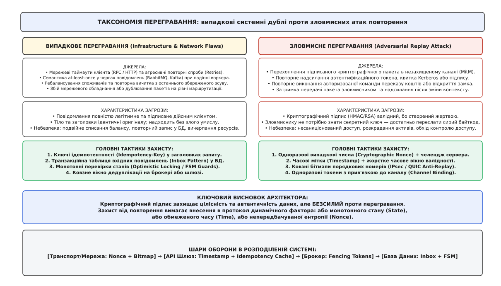
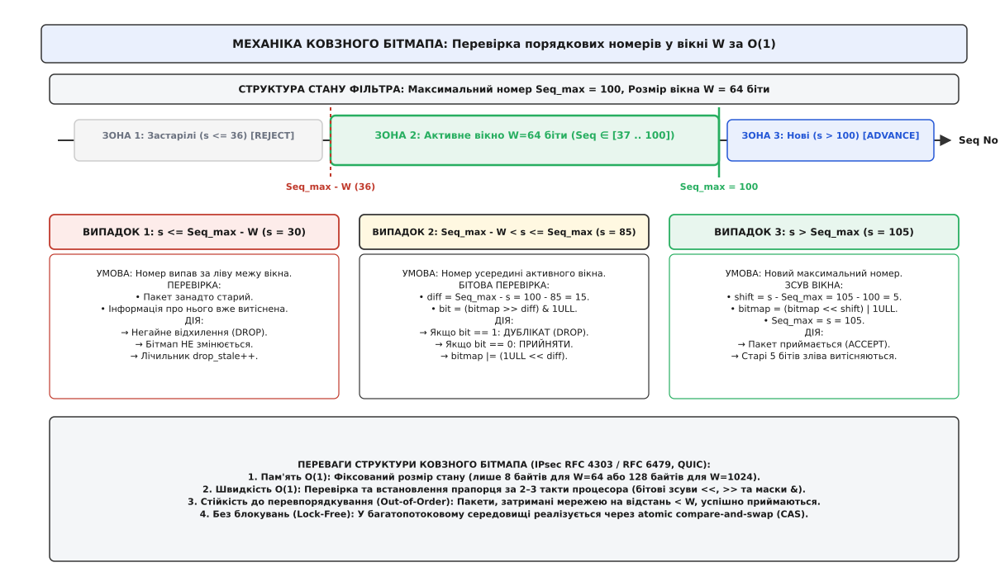
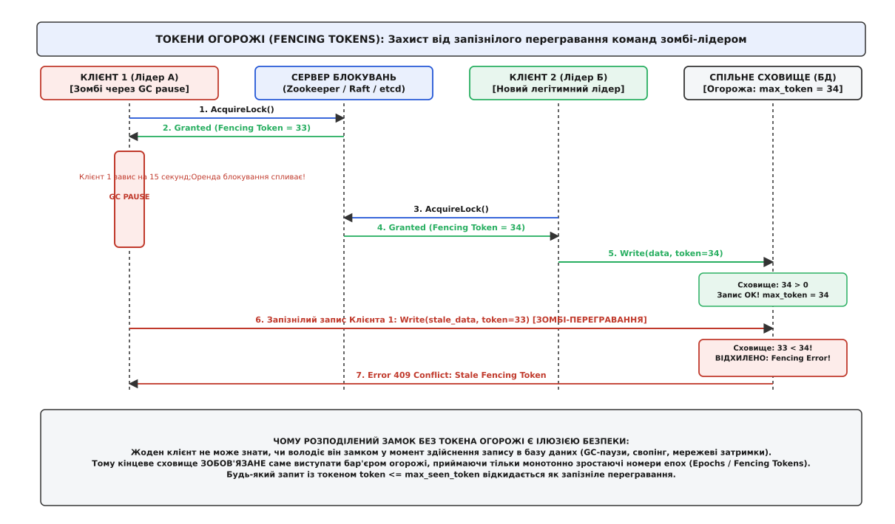
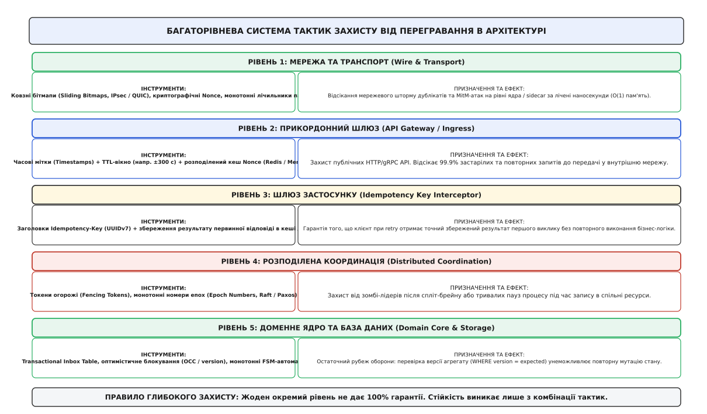

# Захист від переграних повідомлень як тактика

<preknowlist>
- [Ідемпотентність](topic:programming/idempotency) — алгебраїчна властивість операції зберігати однаковий кінцевий стан системи при довільній кількості повторних викликів.
- [Гарантії доставки](topic:programming/delivery-guarantees) — семантика «щонайменше один раз» (at-least-once) у розподілених чергах і журналах подій та неминучість дублювання пакетів.
- [Повторні спроби та експоненційне відкладення](topic:programming/retries-backoff) — алгоритми повторного надсилання запитів з експоненційним відкладенням і випадковим джитером.
- [Вхідна скринька (inbox)](topic:programming/inbox-pattern) — патерн атомарного збереження ідентифікатора вхідного повідомлення та бізнес-змін у межах однієї локальної транзакції бази даних.
- [Таймаути й бюджет часу](topic:programming/timeouts-deadlines) — невизначеність результату мережевого запиту при спливанні граничного часу очікування відповіді.
- [Розподілені замки](topic:programming/distributed-locks) — координація монопольного доступу до спільних ресурсів та вразливість до пауз збирача сміття.
- [Журнал подій](topic:programming/event-log) — незмінний упорядкований потік фактів як єдине джерело істини в розподіленій системі.
</preknowlist>

У системі міжбанківських розрахунків мікросервіс обробки платежів отримує авторизовану команду `TransferFunds` на суму 50 000 доларів США з рахунку інвестиційного фонду. Воркер успішно надсилає мережевий запит до клірингової палати, фіксує списання в ядрі транзакцій і готується відправити підтвердження клієнту. У цей момент на транзитному комутаторі дата-центру стається скидання пакетів через переповнення буфера черги (Bufferbloat). Клієнтська програма не отримує відповіді протягом 3000 мілісекунд, фіксує мережевий таймаут і згідно з політикою повторних спроб надсилає точно такий самий підписаний бінарний пакет вдруге. Якщо обробник сприйме цей пакет як нову команду, з рахунку клієнта буде списано вже 100 000 доларів.

Аналогічна катастрофа трапляється й без технічних збоїв: якщо зловмисник перехоплює легітимний зашифрований пакет керування промисловим контролером або HTTP-запит відкриття банківського сейфа, йому взагалі не потрібно зламувати криптографічний ключ. Достатньо зберегти байтовий масив і надіслати його в мережу через 10 хвилин або наступного дня. Оскільки цифровий підпис математично валідний, наївний сервер повторно виконає небезпечну дію.

Ці інциденти оголюють ключову істину розподілених систем: криптографічний підпис та шифрування гарантують лише цілісність та автентичність даних, але принципово безсилі проти повторного використання валідного повідомлення. **Захист від перегравання** (від англійського *Replay Protection*) — це не окремий криптографічний алгоритм, а наскрізна архітектурна тактика, яка вносить у статичні дані динамічний контекст часу, монотонного стану або непередбачуваної ентропії.

## Анатомія перегравання: випадкові системні збої проти цілеспрямованих атак

У розподіленій архітектурі повідомлення дублюються з двох принципово різних причин: через фізичну ненадійність асинхронних мереж або через вороже втручання.


*Таксономія перегравання: випадкові дублі породжуються таймаутами та ребалансуванням черг, тоді як ворожі атаки використовують перехоплені легітимні байти. Обидва вектори вимагають динамічного захисту на всіх рівнях стека.*

Перший клас явищ — **випадкове системне перегравання** (Accidental Infrastructure Replay). В асинхронній мережі діє теорема про неможливість гарантії доставки рівно один раз без збереження стану. Якщо клієнт не дочекався відповіді через затримку сигналу і виконав retry, або якщо споживчий воркер Apache Kafka впав до фіксації зміщення (offset commit), брокер неминуче відправить те саме повідомлення іншому споживачу. Повідомлення надходить із чистими намірами, але вдруге.

Другий клас явищ — **зловмисна атака повторення** (Adversarial Replay Attack). Зловмисник, що контролює проміжний маршрутизатор або Wi-Fi-точку доступу (Man-in-the-Middle), записує трафік жертви. Навіть якщо канал зашифровано протоколом TLS, атакуючий може спробувати повторно надіслати пакети рукостискання, сесійні квитки або підписані API-запити в незахищені внутрішні сервіси. Детальна хронологія боротьби з цим вектором — від зламів раннього TCP до сучасних стандартів — наведена в [історичному нарисі атак перегравання](topic:programming/replay-protection-tactics/hist-replay-attacks-and-tcp.md).

Щоб побудувати непробивний захист, інженер зобов'язаний послідовно розгорнути спектр тактик від прикордонної мережі до ядра бази даних.

## Тактичний рівень 1: Одноразові випадкові числа (Nonce) та челендж-відповідь

Найпростіший спосіб гарантувати свіжість повідомлення — змусити відправника додавати до кожного запиту унікальне випадкове число, яке використовується рівно один раз (англ. *nonce*, від виразу *for the nonce* — на один конкретний випадок).

Існує дві фундаментальні моделі використання Nonce:

1. **Серверний челендж (Server-Issued Challenge):**
   Клієнт звертається до сервера із запитом «дай мені випадковий токен». Сервер генерує 128-бітне криптографічно стійке псевдовипадкове число (CSPRNG), зберігає його в пам'яті зі статусом «очікує» і віддає клієнту. Клієнт підписує цим токеном своє тіло запиту і повертає назад. Сервер перевіряє наявність токена в базі, виконує мутацію і негайно знищує токен.
   * *Обмеження:* вимагає двох послідовних мережевих викликів (Round-Trip Time, RTT) на кожну транзакцію, що подвоює затримку.

2. **Клієнтський випадковий токен (Client-Generated Nonce):**
   Клієнт сам генерує 128-бітний випадковий UUIDv4 або масив із 16 криптографічних байтів, вкладає його в заголовок `X-Signature-Nonce` та підписує спільним секретним ключем (HMAC). Сервер перевіряє, чи не бачив він такий токен раніше.

```
+---------+                                   +---------+
| Клієнт  | --- [POST /transfer + Nonce=A8F1] --->| Сервер  |
|         |                                   | (Inbox) |
|         | <-------- [200 OK: Успіх] --------|         |
|         |                                   +---------+
|         |                                        |
|  Збій   |                                   Збережено:
| мережі  |                                   Nonce: A8F1
|         |                                        |
|         |                                   +---------+
| Клієнт  | --- [POST /transfer + Nonce=A8F1] --->| Сервер  |
| (Retry) |                                   | ЗНАЙДЕНО|
|         | <--- [409 Conflict / Дублікат] ---| ВІДХИЛИТИ|
+---------+                                   +---------+
```

### Пастка нескінченної пам'яті

Головна архітектурна вразливість наївного підходу з Nonce — це неможливість вічного зберігання ключів. Якщо сервіс обробляє 20 000 запитів на секунду, за рік накопичується понад 630 мільярдів ключів. Жодна база даних не здатна утримувати таку таблицю без деградації індексів.

Якщо ж старі ключі видаляти через деякий час, виникає **прорив дедуплікації**: зловмисник чекає очищення бази і надсилає перехоплений запит знову, а сервер сприймає його як абсолютно новий.

Тому ізольований Nonce без часового обмеження непридатний для відкритих розподілених систем.

## Тактичний рівень 2: Часові мітки та обмежене вікно валідності

Щоб обмежити розмір пам'яті, до повідомлення додають монотонну часову мітку створення `t_msg` (Timestamp).

Сервер визначає допустиме часове вікно прийому `Δ_t` (наприклад, ±120 секунд). При отриманні пакета сервер порівнює мітку відправника зі своїм поточним системним часом `t_server`. Запит приймається до розгляду лише за виконання умови:

```
|t_server - t_msg| ≤ Δ_t
```

Якщо запит надійшов із запізненням понад `Δ_t` (застарілий пакет) або з майбутнього (аномалія чи підробка), він негайно відхиляється.

```
Часова шкала сервера (t_server):
[--- Застарілі ---|====== ВІКНО ВАЛІДНОСТІ (±Δ_t) ======|--- Майбутні ---]
       DROP       t_server - Δ_t     t_server     t_server + Δ_t   DROP
```

### Синтез: Часова мітка + Кеш Nonce (Комбінована тактика)

Сама по собі часова мітка не рятує від перегравання: якщо зловмисник перехопить запит і надішле його через 3 секунди, він легко вкладеться у вікно `Δ_t = 120` секунд.

Справжня сила виникає при **гібридному поєднанні часової мітки та короткоживучого кешу Nonce**:

1. Сервер перевіряє часову мітку: `|t_server - t_msg| ≤ Δ_t`. Якщо ні — відхиляє.
2. Якщо мітка свіжа, сервер перевіряє унікальність `nonce` в оперативній пам'яті (Redis або локальний фільтр).
3. Якщо `nonce` знайдено — це перегравання (відхилити).
4. Якщо `nonce` відсутній — зберегти його в кеші з часом життя `TTL = 2 · Δ_t` і виконати запит.

Завдяки цьому синтезу пам'ять кешу більше не зростає до нескінченності: будь-який запис гарантовано видаляється через `2 · Δ_t` секунд. А спроба переграти повідомлення після закінчення TTL гарантовано розіб'ється об перше правило, оскільки часова мітка стане застарілою.

Строгі формули розрахунку розміру вікна з урахуванням розсинхронізації мережевих годинників NTP та джитеру наведено у [математичному аналізі часових вікон](topic:programming/replay-protection-tactics/math-replay-window-and-clocks.md).

## Тактичний рівень 3: Ковзні бітмапи порядкових номерів (Wire Anti-Replay)

На рівні високошвидкісного мережевого транспорту (IPsec, WireGuard, протоколи реального часу) додавання UUID і звернення до Redis є неприпустимо повільними. Тут використовують монотонно зростаючі 64-бітні порядкові номери (`seq = 1, 2, 3...`), упаковані в **ковзний бітмап** (Sliding Bitmap Window).


*Механіка ковзного бітмапа: номери, старші за ліву межу, скидаються. Номери всередині вікна перевіряються бітовою маскою за O(1), а нові максимуми просувають вікно вперед.*

Фільтр зберігає всього два значення:
* `max_seq`: найбільший успішно прийнятий номер пакета.
* `bitmap`: одне 64-бітне беззнакове число `uint64_t` (або масив із 16 слів для вікна 1024 біти), де `k`-й біт вказує, чи було отримано пакет із номером `max_seq - k`.

Алгоритм обробки номера `s` виконується за лічені наносекунди:

1. **Якщо `s > max_seq` (новий лідер):**
   Вікно зсувається вліво на різницю `diff = s - max_seq`.
   ```
   bitmap = (bitmap << diff) | 1ULL;
   max_seq = s;
   ```
   Пакет приймається.

2. **Якщо `max_seq - W < s ≤ max_seq` (потрапляння у вікно):**
   Обчислюється бітове зміщення `diff = max_seq - s`.
   * Якщо `(bitmap & (1ULL << diff)) != 0` — біт уже виставлений: це повторний пакет (REJECT).
   * Якщо біт нульовий — пакет приймається вперше, і біт виставляється: `bitmap |= (1ULL << diff)` (ACCEPT).

3. **Якщо `s ≤ max_seq - W` (застарілий пакет):**
   Пакет відстав від лідера більше ніж на ширину вікна `W`. Його статус невідомий, тому він безумовно відкидається (DROP).

Цей механізм витримує перевпорядкування пакетів через затримки маршрутизації, витрачає лише 8 байтів пам'яті на з'єднання і виконується взагалі без системних викликів. Повна реалізація цього алгоритму мовами C та C++ представлена у [практичному проекті ковзного бітмапа](topic:programming/replay-protection-tactics/proj-sliding-bitmap-defense.md).

## Тактичний рівень 4: Токени огорожі та епохи поколінь (Захист від зомбі-лідерів)

У розподілених системах існує підступний вид перегравання, спричинений не зловмисниками, а затримками всередині самої інфраструктури: **зомбі-перегравання запізнілих команд** (Zombie Worker Replay).

Уявімо розподілений кластер із координатором блокувань (Zookeeper, Raft або etcd).


*Токени огорожі: пауза збирача сміття у старого лідера призводить до втрати оренди. Коли він прокидається, сховище відхиляє його запізнілий запис через застарілий номер епохи.*

Послідовність розгортання аварії:
1. Вузол А отримує статус лідера (Lock) на запис у файл сховища терміном на 10 секунд.
2. У процесі Вузла А стається тривала пауза збирача сміття (Full GC Pause) або блокування дискового введення-виведення на 15 секунд.
3. Сервер блокувань фіксує втрату серцебиття від Вузла А, відкликає замок через таймаут і обирає новим лідером Вузол Б.
4. Вузол Б бере замок і записує актуальні дані у сховище.
5. Вузол А прокидається від сплячки. Він перебуває в стані ілюзії, що все ще володіє замком, і відправляє свій старий підготовлений запит у сховище.
6. Старий запит Вузла А перетирає свіжі дані Вузла Б, спричиняючи тихе пошкодження бази даних.

### Рішення: Токени огорожі (Fencing Tokens)

Звичайний розподілений замок не захищає від запізнілого перегравання, тому що клієнт не може знати, чи не спливла його оренда в момент виконання фізичного запису на диск.

Єдиним надійним захистом є **токен огорожі** (Fencing Token / Generation Epoch):
* При кожній успішній видачі блокування координатор генерує суворо монотонно зростаюче число: `epoch = 1, 2, 3...`.
* Кожен запит до цільового сховища супроводжується поточним номером епохи клієнта.
* Кінцеве сховище зберігає максимальний побачений номер епохи `max_fencing_token`.
* Якщо запит приходить із токеном `token ≤ max_fencing_token`, сховище безумовно відхиляє транзакцію з помилкою `Stale Fencing Token`.

Коли запізнілий Вузол А надсилає команду з епохою 33, сховище бачить, що воно вже зафіксувало запис Вузла Б з епохою 34. Запит Вузла А відхиляється, і цілісність даних зберігається.

## Тактичний рівень 5: Доменні запобіжники та скінченні автомати станів

Останній і найглибший рубіж оборони знаходиться безпосередньо всередині бізнес-моделі та транзакційної бази даних.

Якщо всі зовнішні мережеві фільтри, шлюзи та кеші пропустили дублікат, схема збереження даних зобов'язана зробити повторну дію абсолютно безпечною (No-Op).

### 1. Транзакційний Inbox (Transactional Inbox Table)
У межах однієї ACID-транзакції бази даних виконуються дві дії: збереження бізнес-змін та запис ідентифікатора повідомлення в таблицю `inbox_messages`.
Якщо при спробі вставки спрацьовує обмеження унікальності первинного ключа (`UNIQUE constraint violation`), транзакція автоматично відкочується без змін.

### 2. Оптимістичне блокування версій (Optimistic Concurrency Control, OCC)
Кожен агрегат у базі містить поле `version`. Будь-яке оновлення стану вимагає точного збігу версії:

```sql
UPDATE user_accounts 
SET balance = balance - 500.00, version = version + 1 
WHERE account_id = 1042 AND version = 7;
```

Якщо перегране повідомлення намагається виконати мутацію поверх версії 7, коли баланс уже перейшов на версію 8, база повертає 0 оновлених рядків, і повторна дія нейтралізується.

### 3. Монотонні переходи скінченного автомата (FSM Terminal Guards)
У бізнес-логіці замовлення переходи між станами є односпрямованими. Замовлення може перейти зі стану `CREATED` у стан `PAID`, але не може перейти з `CANCELLED` або `PAID` назад у `CREATED`.

Будь-яка команда, що вимагає недопустимого переходу у поточному стані агрегату, безпечно ігнорується, перетворюючи повторне повідомлення на безпечний холостий виклик.

Повні сигнатури інтерфейсів перехоплювачів та готові SQL-схеми таблиць наведено у [довіднику контрактів та інтерфейсів](topic:programming/replay-protection-tactics/api-replay-defense-contracts.md).

## Тактичний рівень 6: Кероване перегравання як інструмент відновлення проти сайд-ефектів

Перегравання повідомлень — це не лише загроза, якої треба уникати, але й найпотужніший інструмент відновлення працездатності розподілених систем після аварій.

Існує три легітимні сценарії навмисного перегравання:
1. **Повторне програвання черги мертвих листів (DLQ Replay):** після виправлення програмного бага інженери повторно вичитують тисячі збійних повідомлень.
2. **Відновлення стану в Event Sourcing:** повне перезавантаження агрегату шляхом вичитування всіх історичних подій від початку створення системи.
3. **Побудова нової проєкції або аналітичного сховища:** вичитування всього журналу подій Kafka новим мікросервісом звітності.

```
+-------------------------------------------------------------+
| Журнал подій (Kafka / Event Log)                           |
| [Подія 1] -> [Подія 2] -> [Подія 3] -> ... -> [Подія N]     |
+-------------------------------------------------------------+
                               |
                   ПЕРЕГРАВАННЯ ІСТОРІЇ (REPLAY)
                               |
               +---------------+---------------+
               |                               |
               v                               v
    [Внутрішній стан БД]            [Зовнішні сервіси]
    (Агрегати, Проєкції)           (Email, SMS, Stripe)
               |                               |
         МУТАЦІЯ СТАНУ                  БЛОКУВАННЯ / DRY-RUN
     - Баланс рахунку                 - Реальні гроші НЕ списувати!
     - Статус замовлення              - Листи клієнтам НЕ шматити!
     - Звітні таблиці                 - Шлюзи НЕ смикати!
```

### Ізоляція незворотних зовнішніх побічних ефектів

Головний конфлікт легітимного перегравання полягає в тому, що відновлення внутрішнього стану бази даних є **безпечним**, тоді як повторний виклик зовнішніх систем (відправка SMS-повідомлення клієнту, списання коштів у банку, фізичний запуск верстата) є **катастрофічним**.

Для безпечного перегравання історії застосовують такі правила:
* **Відокремлення подій від сайд-ефектів через Transactional Outbox:** споживач під час перегравання подій відновлює локальні реляційні таблиці, але вимикає прапорець публікації вихідних повідомлень (`Outbox publisher`).
* **Прапорець режиму симуляції (Dry-Run Replay Mode):** заголовки повідомлень під час відновлення позначаються міткою `X-Replay-Mode: true`. Обробники зовнішніх інтеграцій перехоплюють цей заголовок і логують намір замість виконання реального мережевого HTTP-виклику.
* **Передача первинних ключів ідемпотентності назовні:** якщо виклик стороннього платіжного шлюзу неминучий, воркер використовує детермінований ідентифікатор первинної події як `Idempotency-Key` для зовнішнього API, перекладаючи захист від дублювання на сторону партнера.

## Архітектурний вибір: Матриця тактик та інженерні компроміси

Жодна окрема тактика не є універсальною: вибір інструменту залежить від рівня абстракції, вимог до швидкодії та допустимих витрат пам'яті.


*Багаторівнева система захисту: кожен шар стека перекриває вразливості сусідніх рівнів, формуючи ешелоновану оборону.*

У таблиці нижче наведено порівняльну характеристику всіх тактик:

| Тактика захисту | Рівень застосування | Накладні витрати часу | Витрати оперативної пам'яті | Залежність від годинників | Стійкість до перевпорядкування | Головна сфера застосування |
|---|---|---|---|---|---|---|
| **Ковзний бітмап (Sliding Bitmap)** | Транспорт / L4 / Мережа | Наносекунди (`O(1)`) | Мінімальні (8–128 байтів/сесія) | Відсутня | Висока (у межах вікна `W`) | Мережеві тунелі, UDP-стримінг, протоколи ядра (IPsec, QUIC). |
| **Часова мітка + Кеш Nonce** | API Gateway / L7 Ingress | Мікросекунди | Середні (~100–300 МБ у Redis) | Висока (потрібен NTP) | Повна | Публічні веб-інтерфейси, мобільні додатки, платіжні REST API. |
| **Токени огорожі (Fencing Tokens)** | Розподілена координація | Мілісекунди | Мінімальні (один лічильник) | Відсутня | Не застосовується | Контролери кластерів, лідери реплікації, розподілені блокування. |
| **Transactional Inbox** | Доменні воркери / База даних | Мілісекунди (IO бази) | Середні (дискові секції БД) | Низька | Повна | Асинхронні черги (Kafka, RabbitMQ), обробка фінансових транзакцій. |
| **FSM Guards / OCC Версії** | Доменне ядро | Нульові (у межах бізнес-логіки) | Нульові (поля сутностей) | Відсутня | Повна | Збереження агрегатів, стан замовлень, внутрішній баланс користувачів. |

> 🔧 **Навіщо це.**
> 
> У реальних проектах найбільшою помилкою є спроба захиститися лише на одному рівні: наприклад, покластися тільки на `Idempotency-Key` у веб-контролері або тільки на TLS-шифрування каналу.
> 
> Якщо збійний клієнт згенерує шторм із 100 000 дублікатів на секунду, без ковзного бітмапа або Redis-кешу цей потік дійде прямо до реляційної бази даних і покладе пул з'єднань PostgreSQL, паралізувавши весь бізнес.
> 
> І навпаки: якщо розробник обмежиться лише Redis-кешем, аварійне перезавантаження інстансу Redis зробить систему повністю беззахисною перед повторними списаннями коштів.
> 
> Справжня стійкість досягається **ешелонованою обороною** (Defense in Depth): швидкий фільтр на шлюзі відсікає 99.9% випадкових і шкідливих повторів за частки мілісекунди, а транзакційний Inbox та версійні запобіжники в базі даних гарантують стовідсоткову математичну цілісність бізнес-стану навіть у момент катастрофічних аварій інфраструктури.
