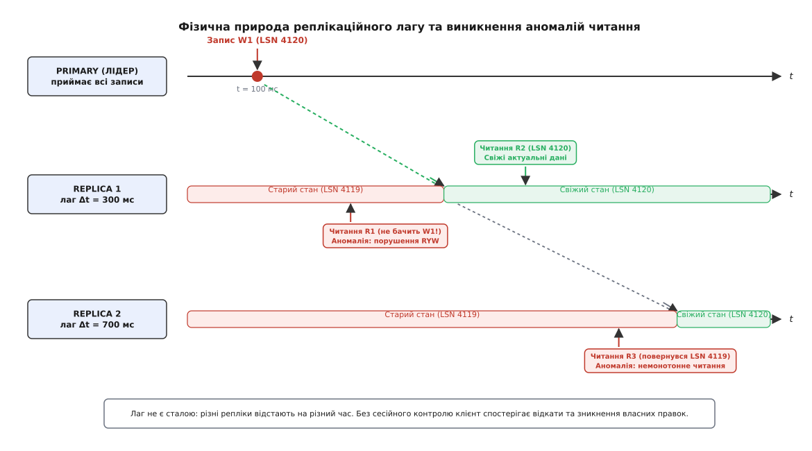
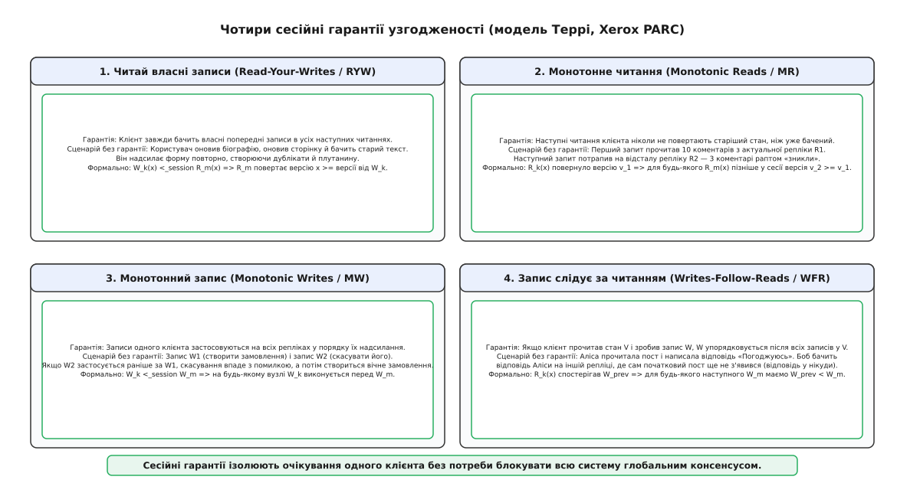
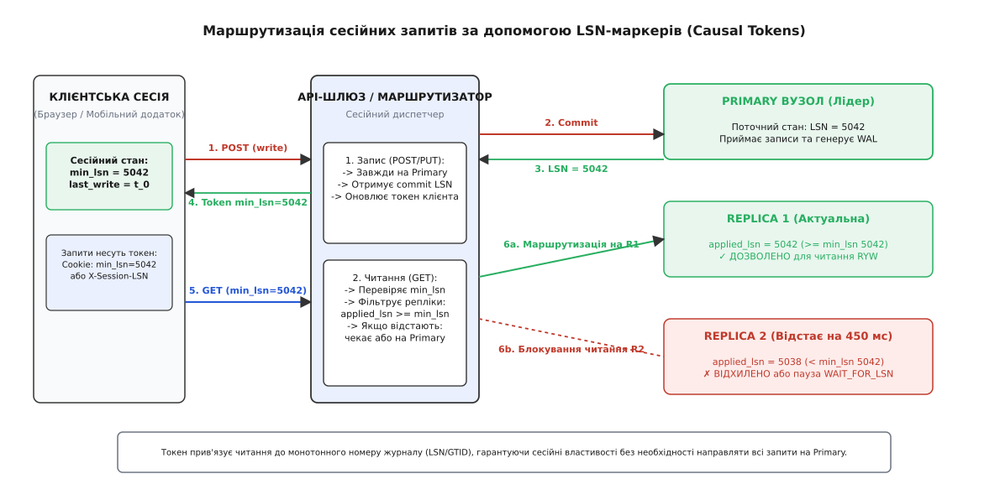

# Реплікаційний лаг і сесійні гарантії

<preknowlist>
- [Лідер-фоловерна реплікація](book:programming/replication-leader-follower) — архітектура з одним активним вузлом для записів та асинхронним поширенням журналу на підлеглі репліки.
- [Омани розподілених обчислень](book:programming/distributed-fallacies) — фізична мережа вносить затримки, втрачає пакети та змінює порядок доставки повідомлень.
- [Таймаути і бюджет часу](book:programming/timeouts-deadlines) — обмеження часу очікування відповідей від віддалених сервісів та баз даних.
- [Монотонний проти настінного часу](book:programming/monotonic-vs-wall-time) — чому фізичні годинники розходяться між вузлами і чому для вимірювання затримок потрібні монотонні лічильники.
- [Кінцева узгодженість на практиці](book:programming/eventual-consistency) — модель узгодженості, за якої стан реплік збігається лише за відсутності нових записів.
</preknowlist>

Користувач соціальної мережі або корпоративної CRM відкриває налаштування свого облікового запису, змінює контактну адресу електронної пошти та натискає «Зберегти». Форма надсилає HTTP POST-запит, сервер обробляє його за 45 мілісекунд і повертає відповідь зі статусом `200 OK`. Браузер миттєво перезавантажує сторінку за допомогою GET-запиту, щоб відобразити оновлені дані.

На екрані знову з'являється стара електронна адреса.

Користувач вирішує, що сталася помилка, вводить нову адресу ще раз і повторно натискає «Зберегти». За секунду він оновлює сторінку вручну: нова адреса нарешті з'являється. Але коли він оновлює сторінку вдруге через три секунди, адреса раптово знову змінюється на стару. Система не втрачала даних і не давала збоїв. Вона просто розділила потоки читання та запису: запис було зафіксовано на вузлі-лідері, а читання було спрямовано на асинхронну репліку, яка в цей момент відставала від лідера на 380 мілісекунд.

Часову різницю між миттю фіксації транзакції на вузлі-лідері та миттю, коли ця зміна стає видимою для читачів на підлеглій репліці, називають **реплікаційним лагом** (англ. *replication lag*, від лат. *replicare* — «відповідати, повторювати» та середньоангл. *laggen* — «відставати»).

## Відмова від синхронності: ціна масштабування читань

Щоб зрозуміти, чому реплікаційний лаг є фундаментальною фізичною властивістю більшості сучасних сховищ, розглянемо альтернативу — повністю синхронну реплікацію.

У синхронній моделі вузол-лідер, отримавши операцію запису, зобов'язаний надіслати копію запису всім реплікам і дочекатися від кожної з них підтвердження успішного запису на локальний диск, перш ніж відповісти клієнту про успіх.

Така схема гарантує нульовий лаг: будь-яка репліка в будь-яку мить містить точно такий самий стан, як і лідер. Однак плата за це виявляється непомірно високою:
1. **Латентність кожного запису зростає до швидкості найповільнішої репліки.** Якщо в кластері з десяти реплік дев'ять відповідають за 2 мілісекунди, а одна репліка переживає сплеск збирання сміття (GC pause) або перевантаження диска й відповідає за 800 мілісекунд, кожен запис у системі триватиме 800 мілісекунд.
2. **Доступність на запис падає експоненційно.** Якщо доступність одного вузла становить 99.9%, то доступність кластера з десяти синхронних реплік падає до `(0.999)¹⁰ ≈ 99.0%`. Падіння або перезавантаження хоча б однієї репліки повністю блокує всі операції запису в усій системі.

Щоб зберегти високу швидкість обробки записів та забезпечити масштабування читань на десятки вузлів, інженери переходять до **асинхронної реплікації** (англ. *asynchronous replication*). Лідер фіксує транзакцію локально, негайно підтверджує її клієнту, а потік змін розсилає реплікам у фоновому режимі.

Як наслідок, у будь-який фізичний момент часу `t` стан репліки є точним знімком стану лідера в минулому: `S_replica(t) = S_leader(t - Δt)`, де `Δt ≥ 0` — поточний реплікаційний лаг.

## Анатомія реплікаційного конвеєра: чому лаг є випадковим процесом

Реплікаційний лаг не є фіксованою величиною на зразок затримки мережевого кабелю. Це динамічний випадковий процес, що формується проходженням транзакції крізь п'ять послідовних етапів:

1. **Фіксація на лідері:** транзакція записує свої дані в журнал випереджального запису (WAL — Write-Ahead Log у PostgreSQL або Binlog у MySQL) та скидає буфери на диск (`fsync`).
2. **Мережева передача:** процес передачі журналу (Sender process) зчитує байти з диска лідера, пакує їх у TCP-пакети та відправляє через сокет. Будь-які мережеві втрати, переповнення буферів комутаторів або міжрегіональні затримки безпосередньо збільшують цей інтервал.
3. **Прийом на репліці:** мережевий потік репліки (Receiver process) приймає байти з сокета та записує їх у проміжний буфер (Relay Log).
4. **Парсинг та планування:** потік відтворення розбирає бінарний формат журналу, перевіряє цілісність контрольних сум та визначає, чи є транзакція незалежною від інших.
5. **Застосування до сховища (WAL Apply):** потік відтворення відкриває сторінки даних у пам'яті (Buffer Pool), захоплює блокування рядків, модифікує B-дерева індексів і фіксує змінений стан на диск репліки.

Ключова причина стрибків лагу полягає в **асиметрії обчислень між лідером та реплікою**:
- На лідері сотні клієнтських з'єднань виконують записи паралельно на багатьох процесорних ядрах, захоплюючи блокування лише окремих рядків.
- На репліці процес відтворення журналу історично був однопотоковим (Single-Threaded Replay), тобто мусив застосовувати транзакції суворо послідовно. Навіть у сучасних багатопотокових рушіях реплікації паралелізм обмежений транзакціями, що не мають спільних ключів.
- Важкі аналітичні операції читання (великі агрегаційні SELECT або генерація звітів), які адміністратори скеровують на репліки, блокують системні каталоги або забивають дисковий пул пам'яті, змушуючи потік відтворення чекати звільнення сторінок.
- Операції зміни схеми даних (DDL на зразок `ALTER TABLE`), які виконуються на лідері, вимагають ексклюзивного блокування всієї таблиці на репліці, повністю заморожуючи конвеєр застосування реплікації на секунди чи хвилини.

Кількісне математичне моделювання конвеєра реплікації як системи масового обслуговування з виведенням функції розподілу лагу наведено у вставці [математична оцінка реплікаційного лагу та ймовірності застарілих читань](book:programming/distributed-systems/replication-lag/math-lag-bounds.md).

## Фізика паралельного відтворення: чому репліка не встигає за лідером

Головне вузьке місце асинхронного конвеєра полягає в тому, що лідер виконує транзакції паралельно, а репліка повинна зберігати коректний причинний порядок змін.

На лідері працюють сотні клієнтських з'єднань. Якщо транзакція `T₁` змінює баланс користувача №1, а транзакція `T₂` змінює адресу користувача №2, вони виконуються одночасно на різних процесорних ядрах, не конфліктуючи між собою. Обидві транзакції записують свої зміни в спільний буфер WAL і паралельно фіксуються.

Коли потік журналу надходить на репліку, виникає дилема паралелізму:
- Якщо застосовувати всі транзакції одним потоком строго по черзі (Single-Threaded Apply), репліка ніколи не наздожене лідер за умов високого навантаження, оскільки одне процесорне ядро репліки намагається повторити роботу 64 або 128 ядер лідера.
- Якщо застосовувати транзакції кількома паралельними потоками навмання, порушиться порядок: транзакція зняття коштів може застосуватися раніше за транзакцію поповнення, або оновлення рядка виконається раніше за його створення.

Сучасні СКБД вирішують цю проблему через **групову фіксацію та графи залежностей (Commit Groups & Dependency Tracking)**:
1. **Групова фіксація на лідері (Group Commit):** транзакції, які очікували скидання журналу на диск в один і той самий момент часу, гарантовано не конфліктували за блокуваннями рядків (інакше одна з них чекала б на іншу). Лідер маркує їх спільним номером батьківської транзакції (`last_committed` або `commit_parent`).
2. **Багатопотоковий диспетчер репліки (Worker Threads Pool):** потік-координатор на репліці розбирає журнал і розподіляє всі транзакції з однаковим батьківським номером між пулом із `M` робочих потоків.
3. **Бар'єри синхронізації:** наступна група транзакцій не може розпочати виконання, доки всі транзакції попередньої групи повністю не завершать фіксацію.

Якщо в навантаженні з'являється «гарячий рядок» (наприклад, глобальний лічильник або рядок інвентарю популярного товару), усі транзакції в системі починають залежати одна від одної. Паралелізм на репліці вироджується в послідовне виконання одного потоку, і реплікаційний лаг починає лавиноподібно зростати.

## Конфлікти читання та реплікації (Replication Conflicts & Vacuum Delay)

Особливий клас деградацій виникає, коли на репліках виконуються тривалі операції читання (наприклад, аналітичні звіти, фонова вибірка даних або складні агрегації).

У реляційних базах даних із багатоверсійним керуванням паралелізмом (MVCC, наприклад PostgreSQL):
- Коли рядок оновлюється або видаляється на лідері, старе значення не видаляється з диска фізично — воно позначається як застаріле для обслуговування старих відкритих транзакцій.
- Періодичний фоновий процес (Vacuum у PostgreSQL або Purge Threads у InnoDB) очищає мертві версії рядків на лідері та записує операцію очищення (Cleanup Record) у журнал WAL.
- Коли операція очищення приходить на репліку, вона вимагає негайного фізичного видалення старих сторінок з пам'яті.
- Але якщо в цей самий момент на репліці відкритий довгий `SELECT`, якому для коректного знімка все ще потрібні ці старі рядки, виникає **конфлікт відновлення (Recovery Conflict)**.

У цій ситуації репліка має лише два взаємовиключні виходи:
1. **Призупинити відтворення журналу:** чекати, поки тривалий запит користувача завершиться (параметр `max_standby_streaming_delay`). Протягом усього часу очікування потік реплікації повністю стоїть, а реплікаційний лаг зростає секунда за секундою.
2. **Примусово перервати клієнтський запит:** відтворення продовжується без затримок, але активний аналітичний запит користувача падає з фатальною помилкою `ERROR: canceling statement due to conflict with recovery`.

Для пом'якшення цієї дилеми використовують параметр `hot_standby_feedback`: репліка повідомляє лідеру про найстарішу активну транзакцію читання, і лідер відкладає фізичне очищення мертвих рядків на своєму боці. Це захищає репліку від конфліктів, але призводить до іншої небезпеки — роздування таблиць (Table Bloat) на лідері, коли розмір бази даних на диску починає неконтрольовано зростати.

## Чому вимірювання лагу за настінним годинником обманює

У багатьох інструментах моніторингу затримку реплікації традиційно показують як «секунди відставання» (наприклад, показник `Seconds_Behind_Master` у MySQL). Ця метрика обчислюється шляхом віднімання часової мітки поточної транзакції в журналі від поточного системного годинника репліки.

Такий підхід містить три небезпечні підводні камені:
1. **Розходження годинників (Clock Drift):** якщо системні годинники на серверах розійшлися хоча б на 500 мілісекунд через похибку протоколу NTP, метрика лагу буде систематично брехати на пів секунди в той чи інший бік.
2. **Ілюзія нульового лагу при простої:** якщо на лідері протягом години не відбувалося жодних операцій запису, репліка не отримує нових транзакцій і вважає, що її лаг дорівнює нулю. Але якщо в цей час мережевий кабель між серверами перебито, репліка продовжить звітувати про `0 seconds behind master`, хоча насправді вона повністю відрізана від джерела правди.
3. **Стрибки при пакетному відтворенні:** велика транзакція, що змінювала мільйон рядків, записується на лідері за секунду, але відтворюється на репліці сорок секунд. Протягом цих сорока секунд метрика лагу раптово підскакує від нуля до сорока, а потім миттєво скидається назад до нуля.

### Надійні методи моніторингу: Heartbeat-таблиці та LSN

Для точного та правдивого контролю лагу використовують комбінацію двох механізмів:

1. **Моніторинг байтового відставання LSN:**
   ```
   Лаг у байтах = pg_current_wal_lsn() - pg_last_wal_replay_lsn()
   ```
   Різниця між цими 64-бітними лічильниками показує точний об'єм невідтвореного журналу в байтах незалежно від настінних годинників серверів.

2. **Службові таблиці пульсу (Heartbeat Mechanism, наприклад pt-heartbeat):**
   - На лідері працює фоновий демон, який щосекунди оновлює один службовий рядок у спеціальній таблиці:
     ```sql
     UPDATE system_heartbeat SET last_heartbeat = CLOCK_TIMESTAMP() WHERE id = 1;
     ```
   - Запис потрапляє у стандартний потік WAL і реплікується на всі вузли.
   - Демон моніторингу на репліці зчитує цей рядок і порівнює записану часову мітку з часом прибуття. Якщо мережу обірвано або репліка зависла, значення `last_heartbeat` перестає оновлюватися, і система негайно піднімає тривогу, виключаючи «сліпу зону» під час відсутності користувацьких записів.

## Чотири аномалії реплікаційного лагу

Коли застосунок спрямовує запити читання на асинхронні репліки без додаткового контролю, реплікаційний лаг породжує чотири фундаментальні аномалії узгодженості даних.


*Часова шкала розходження стану між Primary та репліками: запити клієнта потрапляють у вікно відставання реплікаційного журналу, спричиняючи втрату видимості власних змін та спостереження відкату часу назад.*

### 1. Порушення «читай власні записи» (Read-Your-Writes Anomaly)

Клієнт виконує операцію запису `W`, отримує підтвердження від лідера, але наступна операція читання `R` того самого клієнта потрапляє на репліку, яка ще не встигла застосувати `W`.

- **Симптом:** користувач залишив коментар на форумі, сторінка оновилася, а коментаря немає; користувач змінив пароль, спробував увійти через нову вкладку й отримав повідомлення про неправильний пароль; покупець додав товар у кошик, перейшов до оформлення, а кошик порожній.
- **Наслідок:** користувач вважає, що система втратила дані, і повторює операцію. Це генерує дублікати записів, подвійні списання грошей та додаткове паразитне навантаження на базу даних.

### 2. Порушення монотонного читання / відкіт часу назад (Monotonic Reads Anomaly)

Клієнт виконує послідовність операцій читання `R₁` та `R₂` (`R₂` виконується після `R₁`). Перший запит потрапляє на свіжу репліку із затримкою 20 мс, а другий запит балансувальник скеровує на відсталу репліку із затримкою 600 мс.

- **Симптом:** користувач читає стрічку повідомлень у чаті й бачить 10 повідомлень. Натиснувши кнопку оновлення, він бачить лише 6 повідомлень. Натиснувши оновлення втретє — знову бачить 10.
- **Наслідок:** порушення суб'єктивної неперервності часу. Користувач спостерігає, як система рухається назад у часі, що руйнує довіру до інтерфейсу.

### 3. Порушення монотонного запису (Monotonic Writes Anomaly)

Клієнт відправляє дві операції запису: `W₁` (створення сутності, наприклад завантаження фотографії) та `W₂` (модифікація сутності, наприклад встановлення її як аватара профілю).

Якщо в системі існує кілька шляхів доставки змін або асинхронні черги обробки без гарантії порядку, репліка може отримати та спробувати виконати операцію `W₂` раніше, ніж завершиться операція `W₁`.

- **Симптом:** операція оновлення завершується помилкою «Сутність не знайдена», оскільки запис про створення ще не застосований, а потім застосовується створення — залишаючи об'єкт у некоректному проміжному стані назавжди.

### 4. Порушення причинного слідування (Writes-Follow-Reads / Causal Inversion)

Аліса публікує повідомлення `W₁` («У когось є зайвий квиток на концерт?»). Боб читає повідомлення Аліси на репліці `A` та надсилає відповідь `W₂` («Так, забирай мій!»).

Транзакція Боба `W₂` надходить на лідер і реплікується на репліку `B` швидше, ніж туди доходить початкове повідомлення Аліси `W₁` (наприклад, через шардинг за користувачами або різні канали передачі).

Третій користувач, Чарлі, читає дані з репліки `B` і бачить відповідь Боба, але не бачить запитання Аліси. З погляду Чарлі, Боб написав беззмістовну фразу в порожнечу. Причина та наслідок помінялися місцями у часі.

Історію відкриття цих аномалій та їх математичну формалізацію командою Xerox PARC викладено у вставці [як народилися сесійні гарантії у проєкті Bayou](book:programming/distributed-systems/replication-lag/hist-session-guarantees.md).

## Сесійні гарантії як міст між хаосом та лінеаризовністю

Традиційна теорія баз даних пропонувала боротися з аномаліями реплікації шляхом переходу до повної глобальної лінеаризовності (англ. *linearizability*). Проте лінеаризовність вимагає, щоб кожен запит на читання від будь-якого клієнта на планеті бачив найостанніший запис, зроблений будь-яким іншим клієнтом. Це вимагає координації через консенсус (Raft, Paxos), що знищує масштабованість читань і різко збільшує затримки.

Вихід із цієї дилеми полягає в концепції **сесійних гарантій** (англ. *session guarantees*).


*Класифікація чотирьох сесійних гарантій за Дугласом Террі: кожна гарантія ізолює окремий причинний зв'язок усередині сесії користувача без необхідності глобального консенсусу.*

Сесійна модель ізолює гарантії узгодженості в межах одного користувацького контексту — **сесії** (англ. *session*):
- Окремому користувачеві байдуже, чи бачить він зміну статусу іншого користувача в Австралії з затримкою в одну секунду.
- Але користувачеві принципово важливо, щоб його власні дії підпорядковувалися причинній послідовності.

Террі та його співавтори виділили чотири формальні сесійні гарантії:

1. **Read-Your-Writes (RYW — Читай власні записи):**
   Усі читання всередині сесії гарантовано відображають усі попередні записи, здійснені в цій самій сесії:
   ```
   W_k <_session R_m  ⇒  стан у R_m містить ефект від W_k
   ```

2. **Monotonic Reads (MR — Монотонне читання):**
   Якщо сесія спостерігала стан даних версії `v₁`, жодне наступне читання в цій самій сесії не може повернути версію `v₂ < v₁`:
   ```
   R_k спостерігало v₁ ∧ R_k <_session R_m  ⇒  R_m спостерігає v₂ ≥ v₁
   ```

3. **Monotonic Writes (MW — Монотонний запис):**
   Операції запису однієї сесії застосовуються базою даних на всіх репліках у порядку їх генерації клієнтом:
   ```
   W_k <_session W_m  ⇒  на будь-якому вузлі W_k застосовується перед W_m
   ```

4. **Writes-Follow-Reads (WFR — Запис слідує за читанням / причинний запис):**
   Якщо сесія виконала читання версії `v`, а потім зробила запис `W`, цей запис логічно впорядковується після всіх транзакцій, що сформували версію `v`:
   ```
   R_k бачило W_prev ∧ R_k <_session W_m  ⇒  W_prev < W_m
   ```

Сесійні гарантії створюють для користувача ілюзію абсолютно узгодженої системи, дозволяючи системі залишатися на 99% асинхронною та високоефективною.

## Інженерні механізми реалізації сесійних гарантій

Як саме API-шлюз або клієнтська бібліотека може технічно забезпечити сесійні гарантії над пулом звичайних асинхронних реплік? Розглянемо чотири інженерні підходи.


*Схема проходження LSN-маркерів між клієнтом, шлюзом та базою даних: запити на читання спрямовуються лише на репліки, які вже застосували необхідний фрагмент журналу транзакцій.*

### Метод 1: Прив'язка сесії до репліки (Sticky Sessions / Replica Affinity)

Балансувальник навантаження хешує ідентифікатор сесії або cookie користувача і завжди направляє всі операції читання цього користувача на одну й ту саму фізичну репліку `R_i`.

- **Плюси:** надзвичайно просто реалізувати на рівні Nginx або HAProxy; автоматично вирішує проблему Monotonic Reads (на одному вузлі стан рухається лише вперед).
- **Мінуси:**
  - **Не вирішує проблему Read-Your-Writes:** оскільки записи йдуть на Primary, а читання — на репліку `R_i`, користувач все одно бачить лаг репліки `R_i`.
  - **Руйнується при відмовах:** якщо репліка `R_i` падає, балансувальник перемикає клієнта на репліку `R_j`, яка має інший лаг, що викликає раптовий стрибок у минуле.

### Метод 2: Часове вікно повернення до лідера (Time-Based Primary Fallback)

Після виконання будь-якої операції запису шлюз записує в сесію часову мітку `last_write_time = now()`. Протягом наступних `T` секунд (наприклад, 5 секунд) усі операції читання цього клієнта примусово направляються на вузол Primary. Після завершення вікна `T` читання повертаються на репліки.

- **Плюси:** легко реалізувати; забезпечує захист від найпоширеніших аномалій читання одразу після форми відправлення.
- **Мінуси:**
  - **Евристика, а не гарантія:** якщо реплікаційний лаг підскочить до 8 секунд (наприклад, через довгий запит), на шостій секунді клієнт перемкнеться на репліку й отримає старі дані.
  - **Перевантаження лідера:** у сервісах із високою активністю записів лідер отримує величезну частку читань, що позбавляє сенсу використання реплік.

### Метод 3: Маршрутизація за причинними маркерами (Causal Tokens / LSN Routing)

Це найбільш надійний і детермінований промисловий метод.

1. Коли Primary фіксує операцію запису, він повертає монотонний номер транзакційного журналу (LSN у PostgreSQL, GTID у MySQL, `operationTime` у MongoDB).
2. Шлюз додає цей LSN до HTTP-відповіді у вигляді cookie або заголовка `X-Session-Min-LSN: 5042`. Клієнт зберігає `session.min_lsn = max(session.min_lsn, commit_lsn)`.
3. Коли клієнт надсилає GET-запит на читання, він передає свій поточний `min_lsn`.
4. Шлюз аналізує поточний стан пулу реплік:
   - Якщо в пулі є репліка з `applied_lsn ≥ min_lsn`, запит негайно виконується на ній.
   - Якщо всі репліки відстають, шлюз виконує процедуру блокування на репліці `wait_for_lsn(min_lsn, timeout = 50ms)` (наприклад, через функцію `WAIT_FOR_EXECUTED_GTID_SET` або очікування на condition variable).
   - Якщо репліка встигла наздогнати LSN за час таймауту — запит виконується на ній.
   - Якщо таймаут вичерпано — запит скеровується на Primary як аварійний резерв.
5. У відповіді на читання репліка повертає свій фактичний `applied_lsn`, і клієнт оновлює свій токен, що гарантує збереження **Monotonic Reads** навіть при перемиканні між різними репліками.

Повний вихідний код промислового сесійного маршрутизатора на C++, Go та TypeScript наведено у вставці [реалізація маршрутизатора сесійної узгодженості з LSN-маркерами](book:programming/distributed-systems/replication-lag/proj-session-consistency.md).

### Метод 4: Оптимістичні оновлення інтерфейсу та явний стан свіжості (UI-Level Tactics)

На рівні фронтенд-архітектури використовуються оптимістичні оновлення (Optimistic UI):
- Після відправлення коментаря клієнтський JavaScript негайно вставляє коментар у локальне DOM-дерево, не чекаючи підтвердження від сервера.
- Якщо наступний GET-запит зі списком коментарів приходить зі застарілої репліки, клієнтський стан об'єднує локальні оптимістичні елементи із серверними даними.
- Для аналітичних панелей, де допускається застарілість (Bounded Staleness), інтерфейс відкрито інформує користувача: *«Дані оновлено 30 секунд тому»*.

## Експлуатаційні пастки: каскадне перевантаження та захист системи

У промисловій експлуатації найнебезпечнішим явищем, пов'язаним із реплікаційним лагом, є **реплікаційна спіраль смерті (Replication Death Spiral)**.

Механізм розвитку аварії:
1. Через раптовий сплеск навантаження або блокування реплікаційний лаг на всіх підлеглих вузлах збільшується з 5 мілісекунд до 500 мілісекунд.
2. Маршрутизатори бачать, що репліки не задовольняють `min_lsn` клієнтів, і таймаути очікування вичерпуються.
3. Потік читань, який раніше обслуговувався репліками, масово перенаправляється на Primary.
4. Процесор і дискова підсистема Primary перевантажуються читаннями. Через це швидкість фіксації та запису WAL на лідері падає.
5. Репліки отримують журнал повільніше, їхній лаг зростає ще сильніше.
6. 100% читань перенаправляються на Primary — настає повна відмова всієї системи.

### Захисні архітектурні бар'єри

Щоб розірвати це замкнене коло, застосовують три захисні тактики:

1. **Автоматичний розмикач ланцюга для Fallback (Fallback Circuit Breaker):**
   Шлюз жорстко обмежує частку запитів читання, які дозволено перенаправляти на Primary (наприклад, не більше 5% від загального трафіку). Якщо ліміт вичерпано, шлюз відмовляється навантажувати лідер і виконує читання на найсвіжішій репліці, додаючи заголовок попередження `X-Data-Stale: true`.

2. **Захисне скидання навантаження (Load Shedding):**
   Якщо черга запитів до реплік перевищує поріг таймауту клієнтського SLA, репліка негайно повертає помилку `HTTP 429 Too Many Requests` або скорочує глибину пошуку, замість того щоб накопичувати чергу, яка призведе до повного паралічу.

3. **Розділення аналітичних і транзакційних реплік:**
   Важкі звіти, BI-запити та фонові задачі експорту направляються на окремий пул виділених реплік, які не беруть участі в обслуговуванні користувацьких сесійних запитів і не можуть заблокувати потік відтворення для онлайн-трафіку.

## Синтез

Реплікаційний лаг — це не прикра помилка конфігурації, а неминуча фізична плата за горизонтальне масштабування читань, стійкість до відмов та низьку затримку записів у розподілених системах.

Спроба замаскувати лаг за допомогою глобальної лінеаризовності знищує продуктивність системи, тоді як ігнорування лагу руйнує користувацький досвід аномаліями зникнення даних та відкату часу.

Сесійні гарантії на основі LSN-маркерів розв'язують цей конфлікт: вони дають кожному окремому клієнту детерміновану причинну послідовність дій над його власними даними, зберігаючи повну свободу асинхронної реплікації для решти системи.
