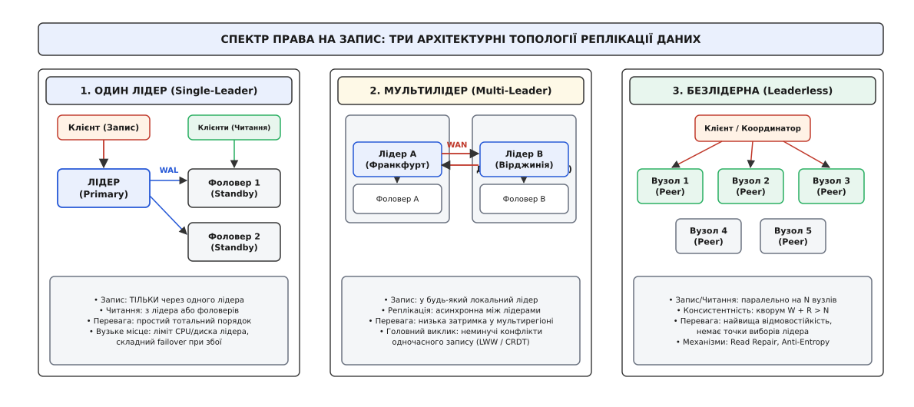
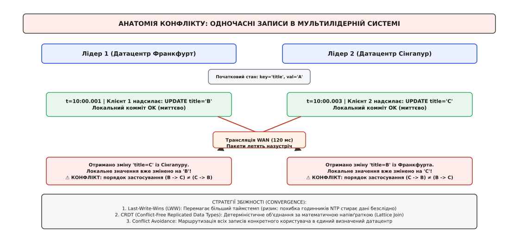
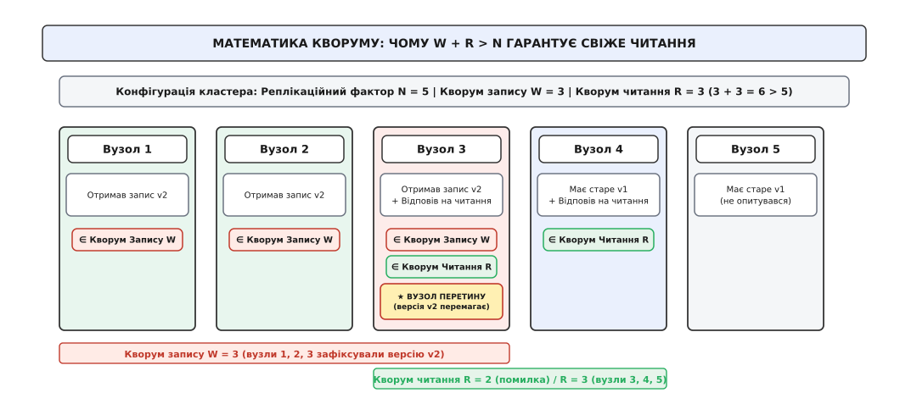
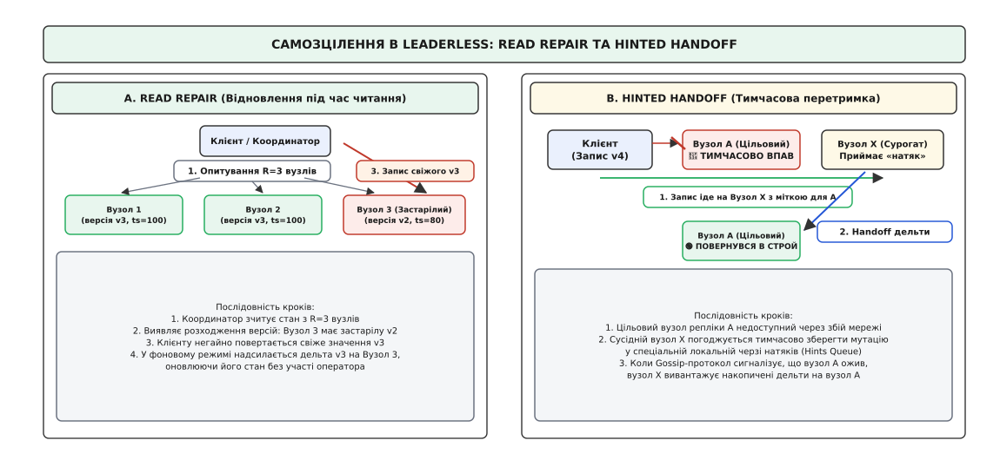

# Лідер-фоловер, мультилідер і безлідерна реплікація

<preknowlist>
- [Журнал попереднього запису (WAL)](book:programming/write-ahead-log) — послідовна фіксація мутацій на диску до модифікації сторінок у пам'яті.
- [Реплікаційний лаг і сесійні гарантії](book:programming/replication-lag) — природа часового відставання вторинних вузлів та аномалії читання.
- [CAP-теорема й PACELC](book:programming/cap-theorem) — фундаментальний компроміс між доступністю та узгодженістю під час мережевого розділення.
- [Монотонний проти настінного часу](book:programming/monotonic-vs-wall-time) — фізичний дрейф годинників NTP і неможливість тотального хронологічного впорядкування за настінним часом.
</preknowlist>

У п'ятницю о 18:42 під час пікового навантаження в 42 000 транзакцій на секунду у магістральному комутаторі датацентру стався збій прошивки: порт підключення єдиного виділеного сервера бази даних перейшов у стан циклічного перезавантаження. Сервер обробляв усі фінансові операції платіжного шлюзу. За 14 хвилин повної ізоляції вузла пул із 800 клієнтських з'єднань вичерпався за 4 секунди, буфери черг веб-серверів переповнилися, а 580 000 користувацьких платежів завершилися помилками таймауту. Прямі збитки компанії склали 1.2 мільйона доларів.

Цей інцидент викриває базове обмеження одиничного комп'ютера: будь-яке апаратне забезпечення рано чи пізно виходить із ладу, а його пропускна здатність на запис обмежена фізичною швидкістю одного процесорного сокета й дискового контролера.

**Реплікація (від лат. *replicatio* — повторення, відбиток)** розв'язує цю проблему шляхом збереження копій тих самих даних на кількох фізично ізольованих вузлах, з'єднаних мережею. Проте розміщення даних на кількох серверах миттєво породжує центральне питання розподілених систем: **кому належить право приймати нові записи і як узгоджувати зміни між вузлами через асинхронну, ненадійну мережу?**

Відповіддю на це питання є три фундаментальні архітектурні топології розподілу прав і потоків даних:
1. **Однолідерна (Single-Leader / Leader-Follower / Primary-Secondary)** — усі зміни проходять виключно через один призначений вузол.
2. **Мультилідерна (Multi-Leader / Active-Active / Multi-Primary)** — кілька виділених лідерів приймають записи одночасно й обмінюються ними.
3. **Безлідерна (Leaderless / Dynamo-style / Quorum-based)** — будь-який вузол кластера може прийняти запис, а узгодженість гарантується математичним перетином кворумів.

Глибокий історичний шлях виникнення цих трьох моделей, включно з математичним попередженням Джима Ґрея про колапс реплікації та відповіддю інженерів Amazon, розкрито в історичному нарисі: [Історія розколу реплікаційних моделей: від фатального прогнозу Джима Ґрея до тріумфу Dynamo](book:programming/replication-leader-follower/hist-replication-taxonomies.md).


*Спектр права на запис: три архітектурні топології реплікації даних — від суворої централізації до повністю децентралізованих кворумів*

---

## Топологія 1: Single-Leader (Лідер-Фоловер)

Найпростіший спосіб уникнути конфліктів між одночасними мутаціями даних — призначити **рівно один вузол**, який володіє монопольним правом на зміну стану.

### Анатомія потоку даних

В однолідерній архітектурі вузли діляться на дві строго розмежовані ролі:
- **Лідер (Primary / Master / Source; від грец. *archon* — керманич)** — єдиний сервер, який приймає операції запису (`INSERT`, `UPDATE`, `DELETE`, зміну схеми даних). Лідер виконує валідацію, перевіряє обмеження цілісності (Unique Constraints, Foreign Keys), впорядковує транзакції в строго монотонну послідовність і фіксує їх у локальному журналі попереднього запису (WAL).
- **Фоловер (Follower / Secondary / Replica / Standby; від англ. *follow* — слідувати)** — вузли, які працюють у режимі «лише для читання» (Read-Only). Вони підключаються до лідера через мережевий сокет, безперервно вичитують потік записів журналу і застосовують його дельти до власного сховища в тому самому порядку.

Клієнтські запити на читання можуть надсилатися як до лідера, так і до будь-якого фоловера. Це дає змогу масштабувати навантаження на читання, додаючи нові сервери без зміни коду додатків, що детально розглянуто у [Репліки читання та реплікація](book:programming/read-replicas-replication).

```
Клієнт (Запис) ──────> [ ЛІДЕР (Primary) ] ──(WAL-потік)──> [ Фоловер 1 ]
                             │                                     │
                             └──────────(WAL-потік)──> [ Фоловер 2 ]
                                                             │
Клієнти (Читання) ───────────────────────────────────────────┴── (SELECT)
```

### Механізми передачі журналу змін

Реплікація між лідером і фоловерами спирається на передачу потоку журналу, який може транслюватися на різних рівнях абстракції:

1. **Фізичний бінарний стримінг (Physical WAL Streaming):**
   Лідер транслює точні побайтові дельти дискових сторінок разом із монотонними номерами зміщення журналу (Log Sequence Number, LSN). Фоловери безпосередньо перезаписують відповідні байти сторінок у пам'яті та на диску. Це найшвидший метод, оскільки він оминає SQL-парсер та оптимізатор, проте вимагає суворої побітової ідентичності версій СКБД та апаратної архітектури процесорів між усіма вузлами.

2. **Рядкова логічна реплікація (Logical Row-Based Replication):**
   Лідер декодує свій журнал у потік абстрактних подій рівня кортежів (наприклад, `INSERT table_name (pk=1, col='val')` або пари `BEFORE-IMAGE` та `AFTER-IMAGE`). Фоловери самостійно застосовують зміни до локальних таблиць. Логічний підхід дозволяє реплікувати дані між різними мажорними версіями СКБД (наприклад, PostgreSQL 14 у PostgreSQL 16) або фільтрувати окремі схеми та таблиці для аналітичних підсистем.

### Спектр синхронності: ціна комміту проти ризику втрати даних

Коли клієнт надсилає лідеру запит на зміну даних, момент підтвердження успіху (Commit ACK) залежить від обраного режиму реплікації.

#### 1. Повністю синхронна реплікація (Synchronous)
Лідер записує транзакцію у свій WAL, паралельно відправляє байти всім фоловерам і чекає від **кожного** з них підтвердження запису на диск (`fsync`). Лише після збору всіх підтверджень лідер повертає успіх клієнту.
- **Гарантія:** RPO = 0 (Recovery Point Objective). Якщо лідер згорить, будь-який фоловер містить 100% останніх транзакцій.
- **Ціна:** Затримка запису дорівнює затримці найповільнішого вузла в кластері: `Latency = max(RTT_node_i) + max(DiskFlush_node_i)`. Якщо бодай один фоловер зависне через збій диска або мережевий спайк, **усі операції запису в усій системі блокуються**.

#### 2. Асинхронна реплікація (Asynchronous)
Лідер фіксує транзакцію локально на власному диску й негайно повертає успіх клієнту. Відправка журналу фоловерам відбувається фоновим процесом без блокування основного потоку.
- **Гарантія:** Мінімальна затримка запису (обмежена лише локальним диском лідера), висока пропускна здатність.
- **Ціна:** RPO > 0. Якщо лідер зазнає апаратного збою до того, як буфери сокета будуть передані мережею, непідтверджені транзакції зникають назавжди. При призначенні нового лідера виникає конфлікт розбіжності історій.

#### 3. Напівсинхронна реплікація (Semi-Synchronous)
Компромісний інженерний стандарт (дефолт у PostgreSQL зі `synchronous_commit = on` та MySQL Semi-Sync): лідер чекає підтвердження рівно від **одного** фоловера, тоді як решта реплік отримують дані асинхронно. Це гарантує наявність актуальної копії даних щонайменше на двох фізичних машинах, захищаючи систему від падіння всього кластера при затримці однієї другорядної машини.

### Відмова лідера, епохи та загроза Split-Brain

Головна слабкість однолідерної топології — **висока ціна відмови лідера (Failover)**:
1. **Виявлення збою (Failure Detection):** Вузли обмінюються пульсовими повідомленнями (Heartbeats) кожні `T` мілісекунд. Якщо лідер не відповідає впродовж таймауту (наприклад, 10 секунд), кластер оголошує лідера мертвим.
2. **Вибори нового лідера (Leader Election):** Залишок фоловерів повинен узгодити між собою, хто з них володіє найновішим зміщенням журналу (Log Sequence Number, LSN). Для цього використовують консенсусні протоколи (Raft, Paxos) або зовнішні координатори (etcd, Consul, ZooKeeper).
3. **Переконфігурація маршрутизації:** Балансувальники трафіку та клієнтські пули підключень мають переспрямувати потік записів на нову IP-адресу.

У цій точці виникає найнебезпечніша аномалія розподілених систем — **розщеплення мозку (Split-Brain)**. Якщо старий лідер не помер, а лише потрапив у тимчасову мережеву ізоляцію (GC-пауза, флап комутатора), він продовжує вважати себе єдиним джерелом правди й приймати записи. Одночасно кластер обрав нового лідера, який також приймає записи. База даних розколюється на дві несумісні гілки історії, що призводить до невідновної втрати фінансової та користувацької інформації.

Для запобігання розщепленню мозку розподілені системи застосовують монотонні **номери епох / поколінь (Epoch Number / Term / Generation Number)** та **токени огорожі (Fencing Tokens)**:
- Кожні нові вибори лідера інкрементують глобальний лічильник епохи `e = e + 1`.
- Будь-яка команда запису до сховища або зовнішнього сховища блокувань супроводжується поточним номером епохи.
- Якщо старий лідер виходить із GC-паузи і намагається виконати запис з епохою `e = 1`, сховище відкидає операцію, оскільки вже зареєстровано епоху `e = 2`.

Механізми жорсткої ізоляції вузлів (STONITH — Shoot The Other Node In The Head) та консенсусні гарантії детально розглядаються у темі [Failover і розщеплення мозку](book:programming/split-brain).

---

## Топологія 2: Multi-Leader (Мультилідер / Активний-Активний)

Однолідерна схема не здатна подолати два фізичні бар'єри:
- **Швидкість світла у скловолокні:** Пакет між Франкфуртом і Сінгапуром летить ~120 мс в один бік. Якщо єдиний лідер розташований у Франкфурті, кожен клієнтський запис із Південно-Східної Азії змушений чекати щонайменше 240 мс лише на мережевий RTT.
- **Вузьке місце одного вузла:** Усі записи планети мають пройти через один процесор.

**Мультилідерна топологія (Active-Active / Master-Master)** розширює архітектуру, дозволяючи **кільком вузлам** одночасно приймати операції запису. Зазвичай у кожному географічному датацентрі розміщують одного локального лідера.

### Механізм роботи

Кожен лідер обробляє операції запису від локальних клієнтів із мінімальною затримкою локальної мережі (LAN Latency < 1 мс). Після фіксації транзакції у своєму WAL лідер асинхронно транслює потік змін через глобальну мережу (WAN) лідерам в інших датацентрах.

```
[ Клієнти ЄС ] ──> [ Лідер 1 (Франкфурт) ] <═══(WAN-міст)═══> [ Лідер 2 (Вірджинія) ] <── [ Клієнти США ]
                          │                                             │
                          ▼                                             ▼
                   [ Фоловер ЄС ]                                [ Фоловер США ]
```

### Топології передачі дельт між лідерами

Спосіб організації зв'язків між лідерами визначає стійкість системи до розривів окремих лінків:

1. **Кільцева топологія (Circular / Ring Topology):**
   Кожен вузол отримує записи від свого попередника та передає їх наступнику по колу. Для запобігання нескінченним циклам кожна мутація маркується списком ідентифікаторів вузлів, які вона вже пройшла; коли вузол бачить у списку власний ID, він зупиняє ретрансляцію.
   *Вразливість:* Вихід із ладу бодай одного вузла розриває все кільце і блокує поширення оновлень між рештою лідерів.

2. **Зіркоподібна топологія (Star Topology):**
   Один центральний вузол-координатор приймає зміни від усіх лідерів і розсилає їх іншим.
   *Вразливість:* Центральний вузол є єдиною точкою відмови (Single Point of Failure).

3. **Повнозв'язна топологія (All-to-All / Mesh Topology):**
   Кожен лідер відправляє свої зміни безпосередньо всім іншим лідерам. Це найнадійніша топологія, проте вона наражається на проблему **порушення причинного порядку через різну швидкість мережевих шляхів**. Запит `INSERT parent_row` може полетіти довшим шляхом і прибути пізніше, ніж запит `INSERT child_row (fk=parent_id)`, спричинивши помилку цілісності. Для відновлення причинності в таких мережах використовують векторні годинники (Vector Clocks).

### Неминучість конфліктів запису (Write Conflicts)

Головна архітектурна ціна мультилідера — **конкурентні конфлікти запису**. Оскільки реплікація між датацентрами є асинхронною, два клієнти можуть одночасно змінити один і той самий рядок на різних лідерах.


*Анатомія конфлікту: одночасні записи в мультилідерній системі — зміна назви товару на 'B' у Франкфурті та на 'C' у Сінгапурі спричиняє розходження стану при зустрічі дельт*

Розглянемо послідовність подій:
1. Початковий стан: `title = "A"`.
2. О 10:00:00.001 користувач у Франкфурті оновлює запис: `title = "B"`. Лідер 1 фіксує зміну.
3. О 10:00:00.003 користувач у Сінгапурі оновлює той самий запис: `title = "C"`. Лідер 2 фіксує зміну.
4. Через 120 мс зміна `title = "B"` долітає до Сінгапуру, а `title = "C"` — до Франкфурта.

Якби лідери просто застосували отримані зміни поверх свого стану, на Лідері 1 фінальним значенням стало б `"C"` (історія: `A -> B -> C`), а на Лідері 2 — `"B"` (історія: `A -> C -> B`). Кластер назавжди розійшовся б у стані (Silent Data Divergence).

### Стратегії збіжності та подолання конфліктів

Розподілена система зобов'язана гарантувати **збіжність (Convergence)**: усі репліки після доставки всіх повідомлень повинні прийти до абсолютно ідентичного фінального стану.

#### 1. Уникнення конфліктів (Conflict Avoidance)
Найпоширеніше практичне рішення: архітектура гарантує, що всі операції запису над конкретним сутнісним об'єктом (наприклад, конкретним користувачем) завжди маршрутизуються до **одного й того самого датацентру**. Якщо користувач закріплений за європейським регіоном, його запити завжди йдуть у Франкфурт, і для нього система поводиться як Single-Leader.
- *Де ламається:* Коли користувач змінює геолокацію (переліт до США) або коли цілий датацентр виходить із ладу і трафік аварійно перенаправляється в інший регіон. У цей момент накопичений реплікаційний лаг породжує спалах конфліктів.

#### 2. Last-Write-Wins (LWW) на основі настінного часу
Кожній операції присвоюється мітка часу (Timestamp) за годинником відправника. При виявленні конфлікту виграє запис із найбільшим таймстемпом; решта мутацій безповоротно стираються.
- *Де ламається:* Годинники реального часу на різних серверах фізично неможливо ідеально синхронізувати через мережевий джиттер протоколу NTP. Дрейф навіть у 10 мілісекунд призводить до того, що старіший за реальною причинністю запис знищує новіший, порушуючи причинно-наслідковий зв'язок (Causality Violation).

#### 3. Безумовні структури даних без конфліктів (CRDT)
Математично строгий підхід: дані моделюються як **Conflict-free Replicated Data Types** (напівґратки з операцією об'єднання join, яка задовольняє закони комутативності `A ∨ B = B ∨ A`, асоціативності `(A ∨ B) ∨ C = A ∨ (B ∨ C)` та ідемпотентності `A ∨ A = A`).
- Приклади: лічильники збільшення/зменшення (PN-Counter), множини додавання й видалення елементів (Observed-Remove Set / OR-Set), колаборативне редагування тексту (RGA, Fugue). Завдяки алгебраїчним властивостям порядок прибуття повідомлень не має значення: фінальний стан завжди однаковий.

Детальний аналіз конфліктних сценаріїв та алгоритмів злиття наведено у статті [Мультилідерна реплікація](book:programming/multi-leader-replication).

---

## Топологія 3: Leaderless (Безлідерна / Dynamo-style)

Третій підхід повністю відмовляється від поняття лідера як виділеної ролі. У безлідерній системі (популяризованій архітектурою Amazon Dynamo, Apache Cassandra, ScyllaDB, Riak) **будь-який вузол кластера є одноранговим (Peer)** і має право обробляти як читання, так і запис.

### Кворумна математика: N, W, R

Клієнт (або безстановий вузол-координатор від імені клієнта) надсилає операцію паралельно на пул із кількох реплік. Узгодженість регулюється трьома параметрами:
- **`N` (Replication Factor)** — кількість вузлів, на яких має зберігатися копія даного ключа (наприклад, `N = 3` або `N = 5`).
- **`W` (Write Quorum)** — кількість успішних підтверджень від вузлів, необхідна для визнання запису успішним.
- **`R` (Read Quorum)** — кількість вузлів, які опитуються паралельно під час виконання операції читання.


*Математика кворуму: принцип Діріхле в кластері з N=5, W=3, R=3 — множини запису та читання гарантовано перетинаються щонайменше на одному вузлі*

За **принципом Діріхле (англ. *Pigeonhole Principle*)**, якщо сума кворумів запису та читання строго перевищує реплікаційний фактор:

```
W + R > N
```

множина вузлів, які зафіксували останній запис (`|W|`), і множина вузлів, опитаних при читанні (`|R|`), **гарантовано перетинаються щонайменше по одному вузлу**:

```
|W ∩ R| ≥ (W + R) - N ≥ 1
```

Опитавши `R` вузлів, клієнт отримує кілька версій значення разом із їхніми номерами версій (або векторними годинниками). Вузол перетину повертає найновішу версію, тому клієнт гарантовано бачить актуальний стан, навіть якщо решта `R - 1` вузлів повернули застарілі дані через мережеву затримку.

Математичне доведення перетину та формули розрахунку ймовірності застарілого читання при послаблених кворумах наведено у розділі: [Математичний апарат кворумних перетинів та ймовірність застарілого читання](book:programming/replication-leader-follower/math-quorum-intersection.md).

### Крайові випадки та межі гарантій кворуму

Хоча формула `W + R > N` виглядає простою, на практиці існують тонкі крайові випадки, коли кворум може повернути застарілі дані або призвести до фантомних читань:

1. **Одночасні конкурентні записи:** Якщо два клієнти одночасно пишуть різні значення під одним ключем, обидва записи можуть успішно отримати по `W` відповідей від різних комбінацій вузлів. Навіть якщо обидва записи формально зафіксовані, порядок їх застосування невизначений без детерміністичного правила розв'язання (наприклад, LWW або версійних векторів).
2. **Невдалий запис, що частково встиг змінити стан:** Якщо запис встиг записатися на 1 вузол із 3, але на інших 2 впав за таймаутом, координатор повертає клієнту помилку `WriteTimeout`. Проте значення на 1-му вузлі вже збережене. Наступне читання з `R=2` може зачепити цей вузол і несподівано повернути «скасоване» значення.
3. **Видалення та надгробні плити (Tombstones):** Фізично видалити запис із диска на окремому вузлі не можна, оскільки при наступному Read Repair застарілий вузол знову «відновить» стертий запис як відсутній. Замість цього система записує спеціальний маркер видалення — **надгробок (Tombstone)** з новою міткою часу. Лише після того, як спливе гарантований час життя надгробка (`gc_grace_seconds`, зазвичай 10 днів), фоновий процес компактизації фізично видаляє байти з диска.

### Самозцілення та анти-ентропія

Оскільки операція запису вважається успішною вже після `W` відповідей, залишок із `N - W` вузлів законно залишається зі старими даними. Якщо вузол був тимчасово вимкнений, він пропускає мутації. Для запобігання деградації даних безлідерні системи застосовують три автоматичні механізми відновлення.


*Самозцілення в Leaderless: механізм відновлення під час читання (Read Repair) та збереження дельт на сурогатних вузлах (Hinted Handoff)*

#### 1. Відновлення під час читання (Read Repair)
Коли клієнт виконує читання з кворумом `R` (наприклад, опитує 3 вузли) і виявляє, що Вузол 1 та Вузол 2 повернули версію `v3`, а Вузол 3 — застарілу версію `v2`:
1. Клієнту негайно віддається свіже значення `v3`.
2. Координатор у фоновому асинхронному режимі відправляє на Вузол 3 команду запису версії `v3`.
3. Вузол 3 оновлюється без простою системи та без втручання адміністратора.

Повний працюючий код координатора з підтримкою кворумів, виявлення версійного розходження та асинхронного Read Repair на C та C++ подано у проєкті: [Реалізація кворумного координатора з Read Repair та версіонуванням на C і C++](book:programming/replication-leader-follower/proj-quorum-replication.md).

#### 2. Недбалі кворуми та передача натяків (Sloppy Quorums & Hinted Handoff)
Якщо під час мережевого розділення частина з призначених `N` вузлів стає недоступною, класичний кворум `W` зібрав би помилку таймауту. Безлідерна система може увімкнути режим **недбалого кворуму (Sloppy Quorum)**:
- Запис приймають будь-які `W` доступних вузлів кластера, навіть якщо вони не входять до домашнього списку реплік для цього ключа.
- Вузол-сурогат зберігає значення в окремій черзі **натяків (Hints Queue)** з метаданими: «це значення призначене для Вузла A».
- Щойно фоновий протокол пліток (Gossip) сигналізує, що Вузол A повернувся в мережу, сурогат вивантажує накопичені дані (**Hinted Handoff**).

*Ціна компромісу:* Поки діє Hinted Handoff, суворе правило `W + R > N` тимчасово порушується, і клієнти можуть зчитувати старі дані, доки натяки не буде передано адресату.

#### 3. Фонова анти-ентропія з деревами Меркла (Anti-Entropy with Merkle Trees)
Якщо ключ оновлюється рідко і не потрапляє під операції читання (тому Read Repair не спрацьовує), а сурогатний вузол згорів до передачі натяку, репліка залишиться застарілою.

**Анти-ентропія (від грец. *anti* — проти + *trope* — поворот)** — це фоновий процес, який безперервно порівнює стан даних між репліками. Щоб не ганяти гігабайти сирих даних мережею, вузли будують **дерева Меркла (Merkle Trees)** — ієрархічні хеш-дерева діапазонів ключів:
1. Листки дерева містять хеші окремих ключів.
2. Батьківські вузли є хешами конкатенації своїх дочірніх хешів.
3. Вузли обмінюються лише кореневими хешами дерев. Якщо кореневі хеші збігаються — мільйони записів ідентичні (1 порівняння).
4. Якщо хеші відрізняються, вузли спускаються деревом униз, локалізуючи точний невідповідний діапазон ключів за `O(log K)` кроків і передаючи мережею лише відсутні дельти.

Конфігураційні параметри, контракти API та формати запитів для всіх трьох топологій зведено у довіднику: [Специфікація конфігурації топологій та інтерфейси обробки конфліктів](book:programming/replication-leader-follower/api-replication-topology-config.md).

---

## Порівняльна матриця трьох топологій

Вибір архітектури реплікації — це завжди компроміс між складністю розробки, моделлю консистентності, латентністю мережі та стійкістю до апаратних катастроф.

| Архітектурна вісь | Single-Leader (Один лідер) | Multi-Leader (Мультилідер) | Leaderless (Безлідерна) |
| :--- | :--- | :--- | :--- |
| **Точка прийому запису** | Рівно 1 виділений вузол на весь кластер | 1 лідер на датацентр / клієнт | Будь-який із `N` вузлів або координатор |
| **Затримка запису (LAN / WAN)** | Мінімальна в LAN лідера; висока WAN-затримка для віддалених регіонів | Мінімальна локальна в кожному ДЦ (локальний комміт без очікування WAN) | Затримка паралельного звернення до `W` найшвидших вузлів |
| **Масштабованість запису** | Вертикальна (обмежена одним сервером) | Горизонтальна за кількістю датацентрів/лідерів | Горизонтальна (розподіл ключів по кільцю хешування) |
| **Конфлікти одночасного запису** | Не виникають (лідер серіалізує всі мутації в єдиний монотонний лог) | **Неминучі**; вимагають LWW, CRDT або прикладних правил злиття | Відсутні у строгому сенсі; розв'язуються версіонуванням / останнім таймстемпом |
| **Поведінка при розриві мережі** | Якщо лідер ізольований — записи зупиняються до завершення виборів | Кожен сегмент мережі продовжує приймати записи (ризик розходження) | Доступна на запис, якщо доступні бодай `W` вузлів (або через Sloppy Quorum) |
| **Гарантії порядку транзакцій** | Тотальний строгий порядок (Total Order Broadcast) | Частковий причинний порядок (Causal Order) | Подієва узгодженість (Eventual Consistency) |
| **Операційна складність** | Середня (автоматизація failover, split-brain fencing) | **Дуже висока** (конфлікти злиття, циклічні топології реплікації) | Висока (налаштування N/W/R, моніторинг Merkle-антиентропії, tombstone-очищення) |
| **Типові представники** | PostgreSQL, MySQL, Redis, MongoDB | CouchDB, Oracle GoldenGate, DynamoDB Global Tables | Apache Cassandra, ScyllaDB, Amazon Dynamo, Riak |

---

> 🔧 **Навіщо це.**
> Розуміння природи трьох топологій захищає архітектора від двох фатальних помилок проектування:
> 1. **Спроба натягнути Single-Leader на глобальний мультирегіон.** Якщо ваші користувачі розподілені між Токіо, Франкфуртом і Сан-Паулу, спроба змусити їх писати в один центральний лідер у Вірджинії призведе до деградації p99 латентності до 300–600 мс на кожну транзакцію та зупинки бізнесу при аварії трансокеанського кабелю.
> 2. **Наївне впровадження Leaderless / Multi-Leader без готовності до втрати ACID.** Вибір Cassandra чи DynamoDB заради «нескінченного масштабування» у фінансовому білінгу або складському обліку без глибокої реалізації ідемпотентності та CRDT призведе до того, що через асинхронні перекриття та LWW-таймстеми з балансів клієнтів безслідно зникатимуть гроші, а залишки товарів на складі ставатимуть від'ємними.

Топологія реплікації обирається під бізнес-інваріанти предметної області:
- Потрібна сувора фінансова транзакційність, блокування та складні реляційні зв'язки — обирайте **Single-Leader** із напівсинхронною реплікацією.
- Потрібна автономна робота регіональних філій або офлайн-додатків на мобільних пристроях із періодичною синхронізацією — проектуйте **Multi-Leader** на основі CRDT.
- Потрібен безперервний запис гігантських потоків телеметрії, кошиків інтернет-магазину чи чатів із нульовим простоєм і толерантністю до відмови третини серверів — розгортайте **Leaderless** із конфігурацією `N=3, W=2, R=2`.
