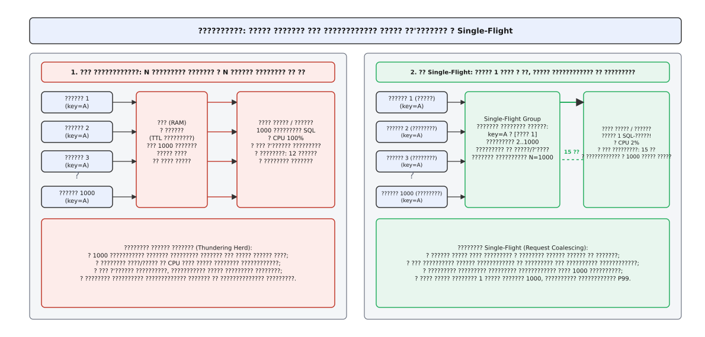
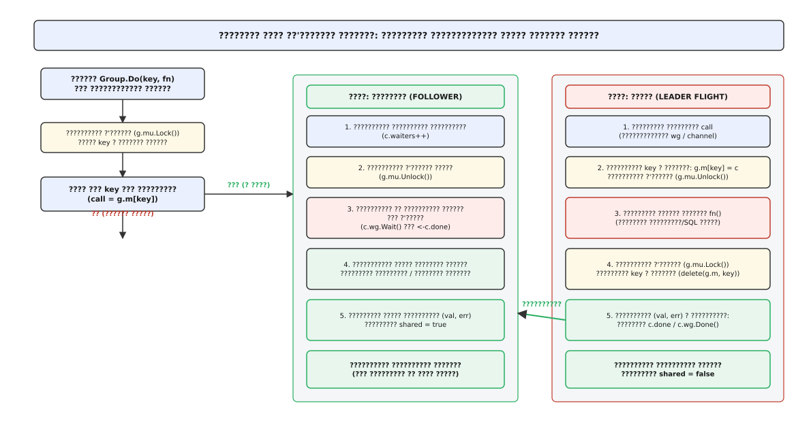
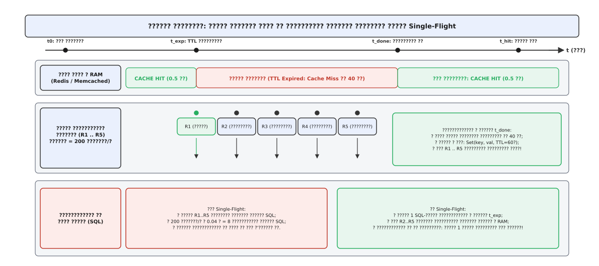
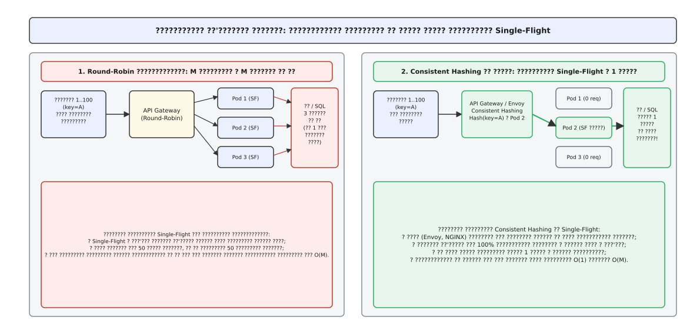

# Об'єднання однакових запитів: подолання шторму промахів кешу та Single-Flight

<preknowlist>
- [Стратегії кешування](book:programming/caching-strategies) — шаблони Cache-Aside, Read-Through та ціна промаху повз оперативну пам'ять.
- [Інвалідація кешу](book:programming/cache-invalidation-intro) — вичерпання TTL та механізми витіснення ключів під час зміни даних.
- [Таймаути і бюджет часу](book:programming/timeouts-deadlines) — наскрізні дедлайни та ризик накопичення завислих запитів у чергах.
- [Хеджовані запити](book:programming/hedged-requests) — боротьба з повільними хвостами затримок на бекенді.
- [Ізоляція відсіками](book:programming/bulkhead-isolation) — обмеження пулів потоків і з'єднань для запобігання каскадним збоям.
</preknowlist>

Користувачі масово відкривають картку акційного товару в перші секунди святкового розпродажу. Протягом ста мілісекунд шлюз API отримує п'ять тисяч паралельних запитів на отримання опису та актуальних залишків за ключем `product:4192`. Рівно в цю мить шістдесятисекундний термін життя запису в кеші Redis вичерпується. 

Усі п'ять тисяч потоків одночасно перевіряють кеш, фіксують промах і спрямовують п'ять тисяч однакових важких SQL-запитів із об'єднаннями таблиць та агрегацією до основної реляційної бази даних.

Пул з'єднань бази даних, розрахований на максимум сто одночасних сесій, миттєво вичерпується. Черга очікування нових з'єднань переповнюється, дисковий контролер фіксує вибухове зростання черги вводу/виводу, а процесор сервера баз даних завантажується на 100%. Затримка обробки запиту зростає з десяти мілісекунд до п'ятнадцяти секунд. 

Клієнти, не дочекавшись відповіді через спрацьовування таймауту у дві секунди, починають повторювати виклики, що породжує лавиноподібне перевантаження та призводить до повної відмови всіх сусідніх сервісів системи.

Традиційне кешування виявляється безсилим у момент вичерпання терміну дії даних. Між миттю, коли перший запит фіксує промах, і миттю, коли він отримає відповідь від бази даних та оновить кеш, виникає часове вікно вразливості. Усі запити, що надходять у це вікно, дублюють одне й те саме важке обчислення. 

Щоб закрити це вікно, у систему впроваджують механізм синхронізації паралельних звернень — **об'єднання запитів** (від англ. *request coalescing*, де лат. *coalescere* — «зростатися, зливатися в одне») або патерн **single-flight** (від англ. *single flight* — «один спільний рейс»).

*Архітектурне порівняння: шторм запитів із перевантаженням бази даних проти дедуплікації викликів через групу Single-Flight.*

Детальний контекст того, як ця проблема виникала на різних етапах розвитку індустрії — від пробудження сокетів у BSD UNIX до розподіленого кешування у LiveJournal та появи Go — викладено в нарисі про [історію виникнення проблеми шторму запитів](book:programming/request-coalescing/hist-thundering-herd.md).

## Ланцюг каскадного збою під час промаху кешу

Щоб зрозуміти необхідність синхронізації викликів, простежимо поетапний розвиток збою в розподіленій системі:

1. **Вичерпання пулу потоків застосунку:** Коли 5000 запитів одночасно блокуються в очікуванні відповіді від бази даних, пул потоків вебсервера (Tomcat, Uvicorn, Puma або пули горутин) миттєво заповнюється. Нові вхідні TCP-з'єднання починають відкидатися на рівні операційної системи (`SYN backlog overflow`).
2. **Конкуренція за блокування в СУБД:** Усередині бази даних сотні паралельних однакових SQL-запитів конкурують за сторінкові блокування в буферному пулі (Buffer Pool latches) та створюють черги на журналі транзакцій (WAL). Процесор витрачає більшість часу не на виконання корисної роботи, а на перемикання контекстів ядра між конкуруючими процесами.
3. **Хвиля повторних запитів (Retry Storm):** Мережеві балансувальники та мобільні клієнти, зафіксувавши таймаут відповіді, надсилають повторні спроби (retries). Замість зниження навантаження система отримує множення вхідного трафіку у 2–3 рази, переходячи в стан незворотного колапсу (англ. *metastable failure*).

## Анатомія та внутрішній механізм Single-Flight

Сутність патерна Single-Flight полягає у створенні реєстру активних викликів безпосередньо перед зверненням до ресурсомісткого джерела даних. Реєстр являє собою таблицю відображення ключа операції на структуру стану активного рейсу (`map[Key]*Call`), захищену м'ютексом або неблокуючими атомарними примітивами.

Кожен запис `Call` містить примітив очікування (наприклад, `sync.WaitGroup` у Go або `std::shared_future` у C++), буфер для збереження отриманого результату або об'єкта помилки та лічильник підписаних клієнтів.

Коли потік ініціює виклик `Group.Do(key, fn)`:
1. Потік захоплює м'ютекс групи та перевіряє наявність `key` у таблиці активних рейсів.
2. Якщо ключ знайдено в таблиці, це означає, що запит на отримання цих даних **уже виконується** іншим потоком. Поточний потік збільшує лічильник очікувачів, відпускає м'ютекс і блокується на очікуванні сигналу завершення (каналу в Go, `std::shared_future` у C++ або `Promise` у JavaScript).
3. Якщо ключа в таблиці немає, поточний потік стає **лідером рейсу** (англ. *leader flight*). Він створює новий об'єкт рейсу з примітивом синхронізації, записує його в таблицю під ключем `key`, відпускає м'ютекс і самостійно викликає функцію `fn()` для звернення до бази даних чи мікросервісу.
4. Після завершення обчислення лідер знову захоплює м'ютекс, видаляє `key` із таблиці активних рейсів, зберігає результат і помилку, після чого надсилає сигнал завершення (закриває канал або сповіщає змінну умови).
5. Усі потоки-очікувачі одночасно розблоковуються, зчитують отриманий результат і повертають його клієнтам із позначкою спільного використання (`shared = true`).

*Покрокова синхронізація запитів: перший потік реєструє рейс і звертається до бекенду, решта потоків підписуються на отримання результату без дублювання запиту.*

Завдяки цьому механізму база даних або зовнішній сервіс отримує рівно одне звернення незалежно від того, чи одночасно надійшло десять запитів, чи десять тисяч.

## Підводні камені та крайові випадки об'єднання запитів

Попри простоту концепції, неправильна реалізація або сліпе застосування Single-Flight у високонавантажених сервісах створює специфічні вразливості та архітектурні пастки.

### Отруйна пігулка та спільне зависання (Poison Pill)

Якщо єдиний рейс, надісланий лідером до бекенду, потрапляє на повільну або несправну репліку бази даних (наприклад, під час тривалої паузи збирача сміття), він зависає на тривалий час.

Оскільки всі інші паралельні клієнти прив'язані до цього єдиного виклику, **усі клієнти зависають разом із лідером**. Замість локального сповільнення одного користувача система отримує колективне очікування сотень запитів.

Щоб запобігти цьому, застосовують суворі наскрізні таймаути, обмеження максимальної кількості очікувачів на один рейс або комбінацію Single-Flight із хеджованими запитами, коли після досягнення 95-го перцентиля затримки лідер паралельно ініціює резервний рейс на іншу репліку.

### Скасування контексту та відключення лідера

Типова помилка полягає у використанні контексту викликача (HTTP-запиту першого клієнта) для виконання спільного виклику до бази даних.

Якщо перший клієнт закриває вкладку браузера або обриває TCP-з'єднання, його HTTP-контекст сигналізує про скасування (`ctx.Done()`). Якщо драйвер бази даних перерве виконання SQL-запиту через це скасування, **усі дев'яносто дев'ять очікувачів отримають помилку `context canceled`**, хоча їхні клієнтські з'єднання були цілком активними.

Правильна реалізація вимагає відв'язування контексту виконання від контексту першого викликача (англ. *detached context*). Лідер виконує виклик із власним незалежним таймером дедлайну, а кожен окремий очікувач слухає як завершення спільного рейсу, так і свій власний контекст. Якщо окремий очікувач відпадає за власним таймаутом, це не впливає на завершення фонової операції для решти клієнтів.

### Перегони даних при мутації спільного результату

Коли лідер завершує роботу, він роздає всім очікувачам посилання на отриманий об'єкт. Якщо тип результату є вказівником на структуру чи масив у пам'яті процесу, виникає небезпека стану перегонів (англ. *data race*).

Якщо один із мікросервісних обробників, отримавши спільний об'єкт, спробує відфільтрувати список або змінити поле (наприклад, додати локальний прапорець `is_cached = true`), ця зміна одночасно спотворить стан у пам'яті інших паралельних потоків, які читають той самий об'єкт. 

Виходом є проєктування результатів як незмінних об'єктів (англ. *immutable DTO*), використання глибокого копіювання (англ. *deep copy*) перед передачею викликачу або серіалізація/десеріалізація байтів відповіді.

### Аварійне очищення та захист від панік

Якщо функція звернення до бази даних генерує паніку або неперехоплений виняток, рейс зобов'язаний гарантовано видалити запис із таблиці активних викликів через блок `defer` у Go або деструктор об'єкта RAII у C++. 

Якщо цього не зробити, ключ назавжди залишиться у внутрішній таблиці групи, і всі наступні звернення до цього ресурсу будуть вічно чекати завершення рейсу, який уже давно впав, унеможливлюючи подальше читання даних до повного перезавантаження процесу.

Повний аналіз цих небезпек та готовий виробничий код для C++, Go, Rust і TypeScript зібрано в [практичній реалізації надійного рушія Single-Flight](book:programming/request-coalescing/proj-singleflight-engine.md).

## Кількісна динаміка промаху та порівняння з раннім оновленням

Навантаження на базу даних під час промаху прямо пропорційне інтенсивності вхідного потоку `λ` та тривалості обчислення `δ`. У системі без об'єднання математичне сподівання кількості дублюючих викликів дорівнює `E[N] = λ · δ`.

*Часова діаграма: вікно вразливості при вичерпанні TTL та скорочення навантаження на базу даних до константного рівня.*

Математичне виведення ймовірності виникнення шторму запитів та порівняння Single-Flight із алгоритмом імовірнісного завчасного оновлення кешу XFetch детально розглянуто в [математичному моделюванні навантаження при промаху кешу](book:programming/request-coalescing/math-stampede-prob.md).

## Локальне та розподілене об'єднання запитів

Single-Flight у пам'яті процесу працює бездоганно в межах одного екземпляра програми (пода або сервера). Проте в сучасних кластерах бекенд зазвичай масштабують горизонтально на десятки або сотні вузлів.

Якщо кластер налічує п'ятдесят подів, а вхідний балансувальник навантаження розподіляє запити між ними за алгоритмом випадкового чергування (Round-Robin), то під час промаху кешу кожен із п'ятдесяти подів отримає свою частку клієнтських запитів. 

У результаті кожен окремий под виконає свій локальний Single-Flight і надішле один запит до бази даних. До бази даних прилетить не один запит, а п'ятдесят однакових запитів — по одному від кожної ноди кластера. Зі зростанням кількості реплік навантаження на базу під час промаху зростає як `O(M)`, де `M` — кількість інстансів.

*Маршрутизація на рівні шлюзу API: узгоджене хешування скеровує однакові запити на один інстанс для досягнення кластерного Single-Flight.*

Для досягнення справжнього єдиного рейсу на рівні всього розподіленого кластера застосовують дві стратегії:

1. **Узгоджена маршрутизація на шлюзі (Consistent Hashing):** Шлюз API або проксі-сервер (Envoy, NGINX) обчислює хеш від кеш-ключа або URL запиту та скеровує всі однакові запити виключно на один конкретний інстанс бекенду. Тоді локальний Single-Flight на цьому інстансі об'єднує 100% запитів усього кластера, і база даних отримує рівно один запит `O(1)`.
2. **Розподілені блокування або кеш-проксі:** Використання шару кешування з підтримкою блокувань (Redis з алгоритмом Redlock або проміжний шар Varnish / Envoy з увімкненою дедуплікацією).

Специфікацію інтерфейсів та готові директиви конфігурації для NGINX, Envoy, Go та GraphQL DataLoader викладено в [довіднику інтерфейсів Go, Envoy, NGINX та DataLoader](book:programming/request-coalescing/api-singleflight-contract.md).

## Синтез

Об'єднання однакових паралельних запитів перетворює найбільш вразливий момент життєвого циклу кешу — мить інвалідації або вичерпання TTL — з потенційної аварії на штатну операцію. Завдяки синхронізації очікувачів у пам'яті база даних ізолюється від піків клієнтського трафіку, забезпечуючи передбачувану затримку системи навіть за екстремальних умов роботи.
