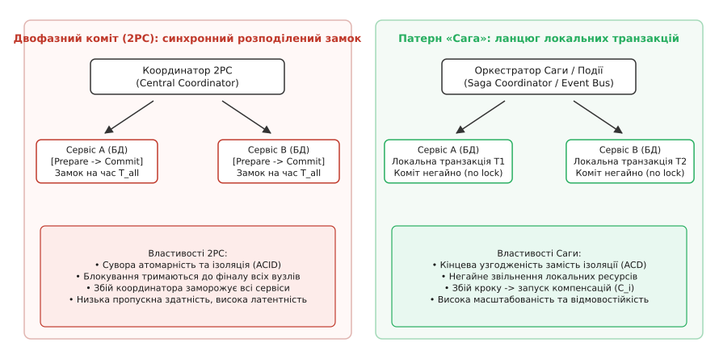
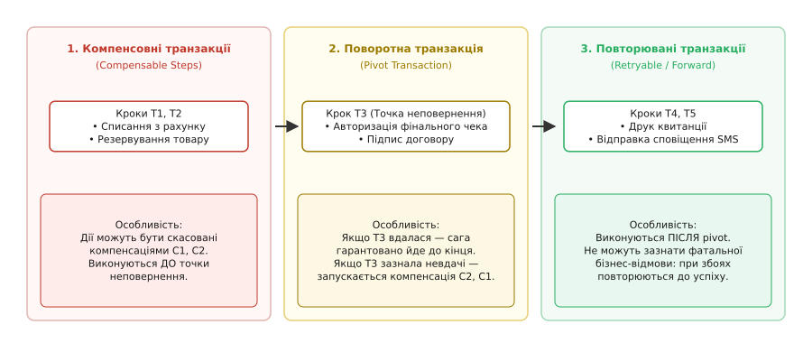
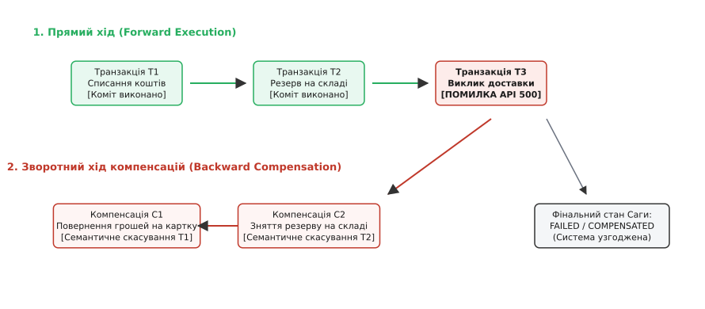
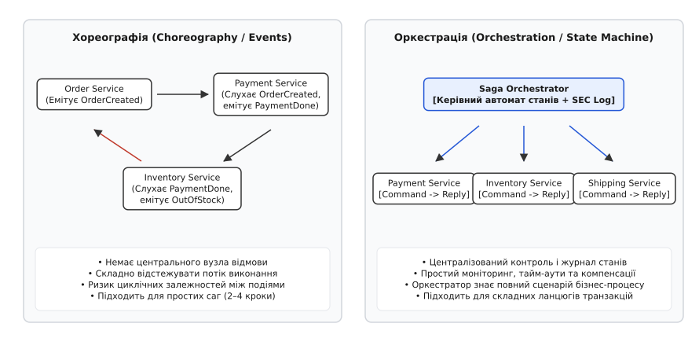
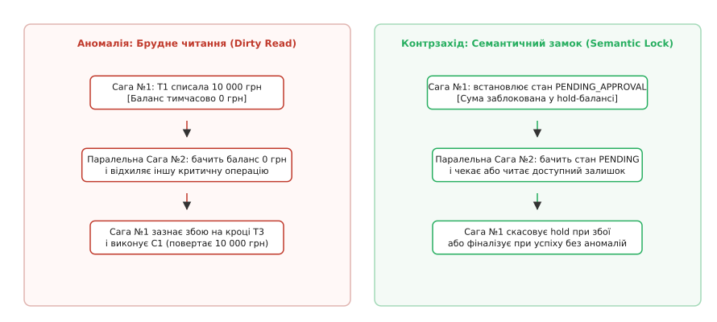

# Патерн «Сага»: координація розподілених транзакцій через ланцюг локальних дій та компенсацій

<preknowlist>
- [Омани розподілених обчислень](topic:programming/distributed-fallacies) — чому мережа ненадійна, пакети губляться, а розподілені вузли зазнають незалежних відмов.
- [Двофазний коміт (2PC)](topic:algorithms/two-phase-commit) — блокуючий протокол атомарного комбінування та його ціна для доступності й латентності.
- [Ідемпотентність](topic:programming/idempotency) — властивість повторного виконання запиту без повторної мутації стану.
- [Кінцева узгодженість на практиці](topic:programming/eventual-consistency) — тимчасова розбіжність реплік та сходження до єдиного узгодженого стану.
- [Transactional outbox](topic:programming/outbox-pattern) — надійне публікування повідомлень під час локальної транзакції бази даних.
</preknowlist>

Інтернет-магазин побутової техніки оформлює замовлення покупця на суму 24 000 гривень. Операція охоплює чотири автономні сервіси, кожен із яких володіє власною ізольованою базою даних: сервіс платежів списує кошти з банківської картки, сервіс складу резервує останню одиницю товару на полиці, логістична служба створює накладну в кур'єрській системі, а сервіс лояльності нараховує клієнту 480 бонусних балів. Перші дві дії успішно завершуються за 95 мілісекунд. Але на третьому кроці зовнішній API кур'єрської компанії повертає помилку: адреса доставки тимчасово заблокована через дорожні роботи. Клієнт бачить у браузері повідомлення про збій оформлення, проте гроші з його банківського рахунку вже списано, а товар заблоковано на складі без можливості продажу іншим покупцям.

У класичній монолітній системі з єдиною реляційною базою даних таку аварію ліквідує механізм транзакцій: команда `ROLLBACK` за частку мілісекунди повертає стан таблиць до вихідної точки за журналом випереджального запису (*Write-Ahead Log*). Але коли моноліт розділено на незалежні мікросервіси з відокремленими базами даних (*Database-per-Service*), єдиної бази даних більше немає. Спроба об'єднати сервіси протоколом двофазного коміту (англ. *Two-Phase Commit*, 2PC) вимагає утримання глобальних розподілених блокувань на всіх вузлах протягом усього часу виконання бізнес-процесу. Якщо хоча б один вузол або мережевий канал зазнає затримки, усі інші сервіси блокують рядки у своїх таблицях, черга підключень до бази вичерпується, і пропускна здатність системи стрімко падає до нуля.

Патерн «Сага» розв'язує цю кризу шляхом відмови від глобальних розподілених блокувань та ілюзії миттєвої атомарності. Бізнес-процес розбивається на впорядкований ланцюг незалежних локальних транзакцій. Кожен сервіс виконує свою частину роботи, негайно фіксує зміни у власній базі даних і звільняє системні ресурси. Якщо на будь-якому кроці виникає бізнес-відмова або невідновний збій, система ініціює зворотний каскад так званих **компенсаційних транзакцій** (англ. *compensating transactions*), які семантично скасовують наслідки раніше зафіксованих дій: повертають гроші на рахунок, знімають резерв зі складу та анулюють нараховані бонуси.



*Двофазний коміт блокує всі ресурси до повного підтвердження всіма учасниками; Сага фіксує локальні транзакції негайно, спираючись на компенсаційні дії при збоях.*

## Еволюція концепції: від довгих транзакцій СУБД до мікросервісів

Назва патерну походить від давньоскандинавського слова *saga* (оповідь, переказ про послідовні подвиги та випробування кількох поколінь героїв). В інформатику цей термін увели 1987 року дослідники Прінстонського університету Гектор Гарсія-Моліна (англ. *Hector Garcia-Molina*) та Кеннет Салем (англ. *Kenneth Salem*).

У своїй класичній праці автори шукали спосіб оптимізації довготривалих транзакцій (англ. *Long-Lived Transactions*, LLT) усередині централізованих баз даних (наприклад, пакетних банківських розрахунків, що тривали годинами). Їхня головна ідея полягала в усвідомленому розслабленні моделі ACID: **відмові від повної ізоляції (літери I) заради збереження загальної продуктивності**. Замість утримання замків на таблицях база даних дозволяла стороннім транзакціям бачити проміжні результати кроків саги, а у разі збою застосовувала компенсаційні SQL-процедури.

З появою мікросервісної архітектури на початку 2010-х років та популяризацією патерну Крісом Річардсоном Сага трансформувалася з низькорівневої оптимізації дискових СУБД на наріжний архітектурний патерн розподілених транзакцій у хмарних системах. Детальний аналіз історичного шляху від академічної статті 1987 року до сучасних рушіїв оркестрації викладено в [історичному нарисі еволюції саг](topic:programming/saga-pattern/hist-garcia-molina-sagas.md).

> 🔧 **Навіщо це.** Коли проєктуєш взаємодію між мікросервісами, ніколи не намагайся натягнути двофазний коміт (XA-транзакції) через REST чи gRPC. У розподіленій мережі будь-який синхронний блокуючий замок перетворює частковий збій на повну відмову системи. Сага дає змогу будувати відмовостійкі процеси над автономними базами даних ціною переходу до моделі кінцевої узгодженості.

## Анатомія Саги: класифікація транзакцій та точка неповернення

Помилково вважати, що кожен крок саги потребує власної компенсації або може бути скасований у будь-який момент. У реальному світі існують дії, які неможливо скасувати за своєю фізичною природою (наприклад, надсилання SMS-повідомлення клієнту чи друк чека фіскальним реєстратором).

Тому всі транзакції всередині саги строго поділяються на три функціональні категорії відносно так званої **поворотної точки** (*Pivot Transaction*):



*Три зони саги: компенсовні кроки виконуються до поворотної точки; успіх поворотної дії гарантує фінал; наступні повторювані кроки не потребують компенсацій.*

### 1. Компенсовні транзакції (Compensable Transactions)

Це кроки, які виконуються на початку саги і мають обов'язкові парні компенсаційні процедури. Якщо будь-який наступний крок завершиться збоєм, ефекти компенсовних транзакцій гарантовано можна нівелювати.

Властивості:
* Можуть завершитися як технічною помилкою (таймаут мережі), так і логічною бізнес-відмовою (недостатньо коштів на балансі, товар знято з виробництва).
* Завжди мають визначену функцію компенсації `C[i]`.
* Виконуються строго **до** поворотної транзакції.

### 2. Поворотна транзакція (Pivot Transaction)

Це критичний крок саги, який розділяє бізнес-процес на дві незворотні фази: фазу можливого скасування та фазу гарантованого завершення. Це **точка неповернення**.

Властивості:
* Якщо поворотна транзакція завершується **успіхом**, сага гарантовано виконується до кінця. З цього моменту скасування бізнес-процесу стає неможливим.
* Якщо поворотна транзакція завершується **відмовою**, сага зупиняє прямий рух і розгортає зворотний каскад компенсацій для всіх попередніх компенсовних кроків.
* Поворотна дія може не мати власної компенсації, оскільки після її успішного коміту відкат більше ніколи не запускається.

У нашому прикладі поворотною транзакцією є фінальна авторизація замовлення або списання коштів у безповоротному платіжному шлюзі.

### 3. Повторювані транзакції (Retryable / Forward Transactions)

Це кроки, які виконуються **після** поворотної точки. Оскільки точка неповернення вже пройдена, ці транзакції за визначенням не можуть отримати бізнес-відмову.

Властивості:
* Не потребують компенсаційних транзакцій, оскільки сага вже не буде відкочуватися.
* При виникненні тимчасових технічних збоїв (мережевий розрив, падіння сервісу, недоступність черги) вони повторюються за стратегією експоненційного відкладення з джитером ([retries with exponential backoff and jitter](topic:programming/retries-backoff)) до гарантованого успішного виконання.
* Обов'язково проєктуються як строго [ідемпотентні](topic:programming/idempotency), щоб багаторазові повтори запитів не спричинили дублювання дій (наприклад, повторного друку фіскального чека).

### Як правильно знайти поворотну точку в домені

Найпоширеніша помилка проєктування саги — хибне визначення поворотної точки. Розглянемо приклад бронювання міжнародної подорожі:
1. **Крок 1 (Готель):** резервування номера (компенсовний — можна скасувати без штрафу).
2. **Крок 2 (Оренда авто):** блокування машини в прокаті (компенсовний — скасування безкоштовне).
3. **Крок 3 (Авіаквиток у лоукостера):** викуп неповоротного квитка на літак за спеціальним тарифом. **Це поворотна точка (Pivot)**: після списання коштів авіакомпанія не повертає гроші за жодних умов.
4. **Крок 4 (Страховка):** оформлення обов'язкового медичного поліса (повторюваний — API страхової компанії викликається до успіху).
5. **Крок 5 (SMS-сповіщення):** надсилання маршрутної квитанції клієнту (повторюваний).

Якщо розмістити покупку неповоротного квитка на кроці 1, а бронювання готелю на кроці 3, то при відсутності вільних номерів у готелі сага спробує скасувати авіаквиток. Але компенсація `C[1]` зазнає краху, оскільки квиток поверненню не підлягає. Бізнес зазнає прямих фінансових збитків.

**Золоте правило архітектора:** розміщуй найбільш ризиковані та незворотні операції якомога ближче до кінця ланцюга компенсовних дій, роблячи їх поворотною транзакцією.

## Механіка компенсації: семантичне скасування проти фізичного Rollback

Найважливіший концептуальний бар'єр при освоєнні патерну полягає у розумінні природи компенсації.

**Компенсація — це не відкат на рівні байтів пам'яті чи диска.** У реляційній базі даних команда `ROLLBACK` просто знищує тимчасові зміни з транзакційного журналу так, ніби їх ніколи не існувало. Жодна інша транзакція за цей час не бачила змінених рядків.

У сазі транзакція `T[1]` вже виконала `COMMIT`. Її результат став доступним усьому світу: гроші знято, запис потрапив у банківську виписку, баланс змінився.



*Траєкторія виконання: прямий ланцюг T1 і T2 фіксує зміни; збій на T3 ініціює послідовне виконання компенсацій C2 і C1 у зворотному порядку.*

Компенсаційна транзакція `C[1]` — це **нова самостійна пряма транзакція**, яка створює новий бізнес-факт, що семантично нейтралізує попередню дію:
* Для списання коштів компенсацією є операція повернення грошей (англ. *refund* або сторно).
* Для резерву товару компенсацією є додавання зарезервованої кількості назад до вільного залишку.
* Для створення запису бронювання компенсацією є переведення статусу запису в `CANCELLED`.

З цього випливають два фундаментальні інженерні правила:
1. **Зворотний порядок виконання:** компенсації завжди запускаються у порядку, строго зворотному до виконання прямих транзакцій:
   ```
   Прямий хід:        T[1]  ->  T[2]  ->  T[3] (FAIL)
   Зворотний хід:     C[2]  ->  C[1]
   ```
   Якщо склад було зарезервовано після списання коштів, спочатку необхідно зняти резерв зі складу (`C[2]`), а лише потім повертати кошти клієнту (`C[1]`). Це запобігає ситуаціям, коли клієнт отримує гроші назад, але все ще утримує за собою дефіцитний товар.
2. **Невідмовність компенсацій:** компенсаційна дія не має права повертати бізнес-помилку «не можу компенсувати». Якщо компенсація падає через мережеву помилку, оркестратор зобов'язаний повторювати її до успіху.

## Дві моделі координації: Хореографія проти Оркестрації

Існує два принципово різні способи організації взаємодії сервісів усередині саги: децентралізована хореографія та централізована оркестрація.



*Хореографія покладається на реакцію сервісів на доменні події у брокері; Оркестрація використовує виділений координатор із журналом станів.*

### 1. Хореографія (Choreography)

У моделі хореографії немає єдиного центру управління. Сервіси спілкуються між собою за принципом [подієвої архітектури](topic:programming/event-driven-architecture-distributed) через брокер повідомлень (наприклад, Apache Kafka або RabbitMQ):
1. Сервіс замовлень створює запис у стані `PENDING` і публікує подію `OrderCreated`.
2. Сервіс платежів підписаний на `OrderCreated`, списує гроші й публікує `PaymentSuccess` (або `PaymentFailed`).
3. Сервіс складу слухає `PaymentSuccess`, резервує товар і публікує `InventoryReserved`.
4. Якщо склад виявляє відсутність товару, він публікує подію `InventoryFailed`. Сервіс платежів, почувши цю подію, запускає власну компенсацію повернення грошей.

**Переваги хореографії:**
* Проста концепція для невеликих процесів (2–3 кроки).
* Слабке зв'язування на рівні коду: сервіси не знають про існування один одного, а підписуються лише на події брокера.
* Відсутність виділеного компонента координатора.

**Недоліки та приховані пастки хореографії:**
* **Заплутаність бізнес-логіки (Spaghetti Events):** щоб зрозуміти повний сценарій саги, інженер змушений вивчати вихідний код усіх сервісів, які слухають та генерують десятки подій.
* **Циклічні залежності:** сервіси неминуче підписуються на події один одного, створюючи циклічні графи залежностей у брокері.
* **Катастрофічна складність налагодження та моніторингу:** майже неможливо з одного місця відповісти на питання, на якому саме кроці зараз перебуває замовлення № 5821.
* **Ризик нескінченного відлуння подій (*Infinite Event Bounce*):** якщо сервіс А генерує подію помилки, яка змушує сервіс Б генерувати подію скасування, яка, своєю чергою, знову тригерить сервіс А через неточний фільтр повідомлень, система входить у самопідтримуваний шторм повідомлень.
* **Вимога до наскрізного трасування:** хореографія змушує прокидати крізь усі повідомлення три обов'язкові заголовки: `Correlation-ID` (ідентифікатор саги), `Causation-ID` (ідентифікатор повідомлення-причини) та стандартний W3C `traceparent` для систем на кшталт Jaeger чи OpenTelemetry. Втрата будь-якого з них робить розслідування збоїв неможливим.

### 2. Оркестрація (Orchestration)

У моделі оркестрації за виконання саги відповідає окремий сервіс — **Оркестратор Саги** (*Saga Orchestrator*), який реалізує детермінований автомат станів (*State Machine*).

Оркестратор централізовано надсилає асинхронні команди підлеглим сервісам (у форматі «зроби дію X») і чекає на відповіді («дію X успішно виконано» або «виникла помилка Y»):
1. Оркестратор записує у свій журнал стан `PAYMENT_REQUESTED` і шле команду сервісу платежів.
2. Отримавши відповідь `PAYMENT_SUCCESS`, оркестратор переводить автомат у стан `INVENTORY_REQUESTED` і шле команду складу.
3. Якщо склад відповідає `OUT_OF_STOCK`, оркестратор фіксує стан `COMPENSATING` і послідовно надсилає команду `REFUND_PAYMENT` сервісу платежів.

**Порівняльна таблиця архітектурних стилів:**

| Критерій оцінки | Хореографія (Choreography) | Оркестрація (Orchestration) |
| :--- | :--- | :--- |
| **Складність бізнес-процесу** | Добре для простих саг (2–4 кроки) | Ідеально для складних саг (4+ кроків) |
| **Прозорість та моніторинг** | Низька (розмазана по системі) | Висока (єдине джерело правди про стан) |
| **Зв'язність сервісів (Coupling)** | Низька на рівні сервісів, висока на подіях | Сервіси виконують чисті команди |
| **Тестування та налагодження** | Складне (вимагає підняття всього кластера) | Просте (тестується логіка автомата оркестратора) |
| **Керування таймаутами** | Складне (кожен сервіс має власні таймери) | Централізоване у координаторі |
| **Точка відмови** | Розподілена | Оркестратор вимагає реплікації та журналу |

> 🔧 **Навіщо це.** Практичне правило: якщо бізнес-процес містить більше трьох сервісів або має нелінійні розгалуження (наприклад, різні сценарії для фізичних та цифрових товарів), обирай **оркестрацію**. Витрати на створення оркестратора окупляться у перші ж тижні експлуатації завдяки простому моніторингу та централізованому журналюванню.

## Втрата ізоляції (ACD замість ACID) та розподілені аномалії

У класичній реляційній базі даних транзакції повністю ізольовані одна від одної: жоден сторонній користувач не побачить зміненого рядка, доки транзакція не виконає `COMMIT`.

У Сазі ізоляція відсутня за визначенням: локальні транзакції фіксують зміни негайно. Це означає, що система підтримує гарантії **ACD** замість ACID:
* **Атомарність (Atomicity):** забезпечується компенсаціями (все завершується успіхом або все компенсується).
* **Узгодженість (Consistency):** досягається в кінцевому підсумку ([eventual consistency](topic:programming/eventual-consistency)).
* **Довговічність (Durability):** гарантується локальними базами даних сервісів.
* **Ізоляція (Isolation):** **ВІДСУТНЯ**.

Відсутність ізоляції породжує три небезпечні аномалії паралельного виконання:



*Брудне читання виникає, коли паралельний процес зчитує нефінальний стан; Семантичний замок нейтралізує аномалію через явні прапорці резервування.*

### 1. Брудне читання (Dirty Read)

Виникає, коли Сага №1 змінює дані (наприклад, списує залишок на складі), а паралельна Сага №2 зчитує цей проміжний стан і ухвалює бізнес-рішення. Згодом Сага №1 зазнає збою на наступному кроці й компенсує свою дію (повертає залишок назад). Але Сага №2 уже вчинила незворотну дію на основі даних, які були скасовані.

### 2. Втрачене оновлення (Lost Update)

Виникає, коли Сага №1 читає значення ресурсу (наприклад, баланс рахунку 10 000 грн) і віднімає 2 000 грн (баланс стає 8 000 грн). У цей самий момент паралельна Сага №2 нараховує відсотки у розмірі 500 грн (баланс стає 8 500 грн). Потім Сага №1 зазнає збою й виконує наївну компенсацію, просто записуючи початкове значення 10 000 грн. Нарахування 500 грн Саги №2 безповоротно втрачено.

### 3. Неповторюване (розмите) читання (Fuzzy Read)

Сага читає стан на першому кроці, але коли повертається до читання того самого об'єкта на третьому кроці, дані вже змінені сторонньою паралельною транзакцією.

### Семантичні контрзаходи (Countermeasures)

Щоб захистити бізнес від наслідків відсутності ізоляції, архітектура саг спирається на п'ять фундаментальних інженерних контрзаходів (докладно виведених у [формальній моделі аномалій та напівґраток](topic:programming/saga-pattern/math-saga-isolation-anomalies.md)):

1. **Семантичний замок (Semantic Lock / Tentative State):**
   Замість безпосередньої фінальної зміни об'єкт переводиться у стан очікування (наприклад, `ORDER_PENDING`, `BALANCE_HELD`, `STOCK_RESERVED`). Сторонні саги бачать цей прапорець і знають: ресурс тимчасово зайнятий, його не можна використовувати до завершення блокування.
   Коли Сага №1 резервує 2 000 грн на банківському рахунку, вона не змінює поле `available_balance` напряму, а збільшує `held_amount`. Будь-яка паралельна транзакція обчислює доступні кошти як `available_balance - held_amount`. Якщо Сага №1 завершується успіхом, сума остаточно списується (`available_balance -= 2000; held_amount -= 2000`); якщо зазнає аварії — hold-блокування просто знімається (`held_amount -= 2000`).
2. **Комутативні операції (Commutative Updates):**
   Проєктування операцій оновлення як відносних змін (дельт), а не абсолютних значень. Операції додавання й віднімання чисел `balance = balance - 100` є комутативними: порядок їхнього виконання не впливає на кінцевий результат, що усуває проблему втраченого оновлення.
3. **Песимістичний погляд (Pessimistic View):**
   Перевпорядкування кроків саги для мінімізації бізнес-ризиків. Якщо операція списання грошей несе фінансовий ризик, її виконують якомога пізніше (безпосередньо перед поворотною точкою), щоб зменшити часове вікно вразливості для брудного читання іншими процесами.
4. **Перечитування значення (Reread Value / Optimistic Guard):**
   Перед здійсненням фінальної безповоротної мутації сервіс повторно перевіряє, чи не змінилися вихідні дані з моменту первинного читання (через версіонування рядків `WHERE version = 5`).
5. **Захист за значенням / Ліміт ризику (By-Value / Risk Reserve):**
   Розділення операцій на низькоризикові (які виконуються за оптимістичною сагою без блокувань) та високоризикові (понад певний фінансовий ліміт, наприклад, 500 000 грн), які вимагають попереднього суворого резервування, ручного підтвердження оператором або виділення гарантійного депозиту.

## Надійність координатора: SEC Log, Crash Recovery та гарантії доставки

Найслабше місце оркестратора — сам вузол координатора. Що станеться, якщо процес оркестратора зазнає аварійного падіння (або знеструмлення сервера) в ту саму мілісекунду, коли він відправив команду на склад, але ще не отримав відповіді?

Щоб бути стійким до катастроф, оркестратор будується як **транзакційний виконавець журналу** (*Saga Execution Coordinator*, SEC).

```
┌─────────────────────────────────────────────────────────┐
│                    Saga Orchestrator                    │
│                                                         │
│   ┌─────────────────────────────────────────────────┐   │
│   │            Saga Log (Write-Ahead Log)           │   │
│   │  [SagaID | Step | State | Payload | UpdatedAt]  │   │
│   └────────────────────────┬────────────────────────┘   │
│                            │                            │
│                  State Transition Event                 │
│                            │                            │
│                            ▼                            │
│   ┌─────────────────────────────────────────────────┐   │
│   │               Transactional Outbox              │   │
│   │      [OutboxID | Destination | MessageBody]     │   │
│   └────────────────────────┬────────────────────────┘   │
└────────────────────────────┼────────────────────────────┘
                             │
                      Message Broker
                             │
                             ▼
                    Payment / Warehouse
```

### 1. Журнал випереджального запису саги (SEC Log)

Перед тим як відправити мережеву команду до будь-якого сервісу, оркестратор записує новий стан у надійне транзакційне сховище (PostgreSQL або репліковане сховище ключ-значення):
* `SAGA_STARTED` (разом з вхідними параметрами бізнес-процесу).
* `STEP_EXECUTING` (назва кроку, номер спроби).
* `STEP_COMPLETED` (або `STEP_FAILED` з кодом помилки).
* `COMPENSATION_STARTED`.
* `SAGA_COMPLETED` / `SAGA_COMPENSATED`.

### 2. Процедура відновлення після краху (Crash Recovery)

Коли впалий екземпляр оркестратора підіймається після перезавантаження (або сусідній вузол кластера перебирає навантаження через вибори лідера чи [розподілені замки з лізами](topic:programming/distributed-locks)):
1. Фоновий менеджер відновлення зчитує з бази всі незавершені записи саг.
2. Для саг у стані `STEP_EXECUTING` перевіряється час останнього оновлення. Якщо минув ліміт часу ([timeouts and deadlines](topic:programming/timeouts-deadlines)), оркестратор повторює виклик або запитує статус операції у сервісу за `saga_id`.
3. Для саг у стані `COMPENSATING` оркестратор відновлює розгортання компенсацій строго з того кроку, який не встиг завершитися до аварії.

### 3. Зв'язок із Outbox-патерном та Inbox-дедуплікацією

Координатор не може одночасно атомарно записати стан у базу даних і надіслати повідомлення у брокер Apache Kafka — це класична проблема дуального запису (*dual-write hazard*).

Тому оркестратор інтегрується з патерном [Transactional outbox](topic:programming/outbox-pattern):
1. Запис про зміну стану саги в таблицю `saga_log` та збереження вихідного повідомлення в таблицю `outbox` виконуються в **єдиній локальній ACID-транзакції** бази даних оркестратора.
2. Окремий процес-транслятор гарантовано вичитує записи з `outbox` та відправляє їх у брокер повідомлень із семантикою доставки [at-least-once](topic:programming/delivery-guarantees).
3. Сервіс-отримувач на іншому кінці застосовує [Inbox-патерн](topic:programming/inbox-pattern), зберігаючи ідентифікатор обробленого повідомлення у власній базі даних, щоб надійно відсікати можливі дублікати мережевих пакетів.

Повну реалізацію такого оркестратора з журналом станів та підтримкою ідемпотентності наведено в [практичному проєкті побудови рушія саг](topic:programming/saga-pattern/proj-saga-orchestrator.md).

## Що робити, коли падає сама компенсація?

Найскладніший крайовий випадок у розподілених системах — **збій під час виконання компенсаційної транзакції**.

Уявімо: сервіс доставки повідомив про відмову, оркестратор запустив компенсацію зняття резерву зі складу `C[2]`, але сервіс складу повертає `HTTP 500 Internal Server Error` або таймаут.

У цій точці система опиняється перед загрозою зависання в напівскомпенсованому стані. Вихід забезпечується трьома ешелонами захисту:
1. **Експоненційні повтори до перемоги:** компенсації за визначенням проектуються як повторювані. Якщо збій спричинений мережею чи тимчасовим падінням бази, повтори з паузами 1s, 2s, 4s, 8s зрештою досягнуть успіху.
2. **Мертва черга (Dead Letter Queue):** якщо компенсація вичерпала ліміт повторів (наприклад, 10 спроб) і продовжує падати (через зміну формату API чи логічну помилку в коді), сага маркується статусом `MANUAL_RECONCILIATION_REQUIRED`, а повний контекст збою відправляється у [чергу мертвих повідомлень (DLQ)](topic:programming/dead-letter-queue).
3. **Регулярна звірка (Reconciliation Loop):** фоновий процес аудиту періодично звіряє баланси та статуси між базами сервісів, виявляє розбіжності та сигналізує черговим інженерам або автоматично генерує сторнувальні проведення.

## Тестування саг та хаос-інженерія

Тестування розподілених саг принципово відрізняється від тестування монолітних транзакцій. Якщо звичайний юніт-тест перевіряє лише прямий успішний шлях (*happy path*) та базовий викид винятків, то для саги головна складність криється у фазі компенсацій та часткових збоїв.

Обов'язковий набір тестів для кожної саги:
* **Ін'єкція збоїв на кожному кроці (Step-by-Step Fault Injection):** тест послідовно симулює відмову на кроці 1, кроці 2, кроці 3... і перевіряє, що всі попередні кроки скомпенсовані у строго зворотному порядку, а стан результуючих баз даних тотожний початковому за бізнес-інваріантами.
* **Тест на подвійне виконання компенсації (Idempotency Audit):** симуляція ситуації, коли компенсація `C[i]` викликається тричі поспіль через мережевий таймаут. Тест має довести, що баланс клієнта збільшився рівно один раз, а не тричі.
* **Тест на перезапуск координатора під час компенсації (Crash-Recovery Simulation):** штучне примусове завершення процесу оркестратора (`kill -9`) посеред розгортання зворотного стека компенсацій із подальшим рестартом та перевіркою коректного підхоплення незавершеного кроку з `SEC-LOG`.

## Сучасний розвиток: платформи стійких робочих процесів (Durable Workflows)

Складання та підтримка ручних автоматів станів оркестрації вимагає значного обсягу коду інфраструктурного журналування. Тому сучасна індустрія розподілених обчислень переходить до концепції стійких робочих процесів ([Durable workflows](topic:programming/durable-workflows)) та рушіїв на кшталт Temporal, Cadence, AWS Step Functions чи Temporal-подібних платформ.

У цих системах розробник описує сагу як звичайний імперативний код із послідовними викликами функцій та блоками `try/catch`. Платформа під капотом перехоплює виконання кожного кроку через [event sourcing](topic:programming/event-sourcing) або вбудований журнал, автоматично зберігає локальні змінні, обробляє таймаути та прозоро відновлює виконання коду з точного місця зупинки при будь-яких аваріях інфраструктури.

## Чекліст архітектора: коли застосовувати Сагу

Сага — потужний, але дорогий інструмент. Вона ускладнює систему, вимагає написання подвійного обсягу коду (прямого і компенсаційного) та змушує бізнес жити в умовах кінцевої узгодженості.

**Застосовуй патерн «Сага», якщо:**
* Бізнес-транзакція охоплює кілька незалежних мікросервісів із власними базами даних.
* Операція є довготривалою у часі (потребує очікування відповіді зовнішніх API, банківських шлюзів або дій людини).
* Протокол 2PC неприйнятний через вимоги до високої пропускної здатності та доступності за теоремою CAP.

**НЕ застосовуй Сагу, якщо:**
* Усі дані живуть усередині однієї реляційної бази даних (використовуй стандартні ACID-транзакції СУБД).
* Бізнес категорично не допускає навіть тимчасової відсутності ізоляції (у такому разі єдиним виходом є перепроєктування меж агрегатів DDD у межах одного сервісу).
* Бізнес-кроки мають незворотні зовнішні ефекти, які неможливо семантично скомпенсувати, і при цьому стоять до точки неповернення.

