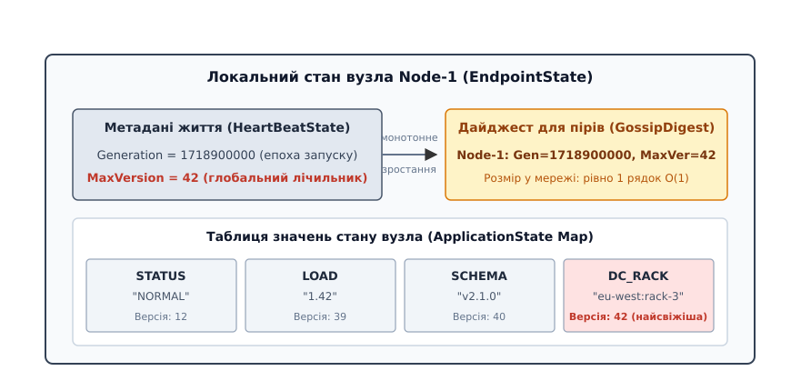
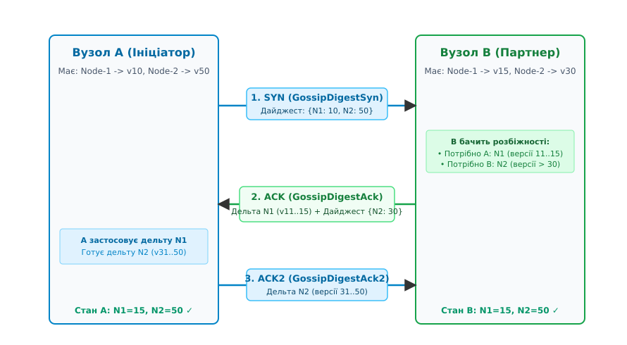
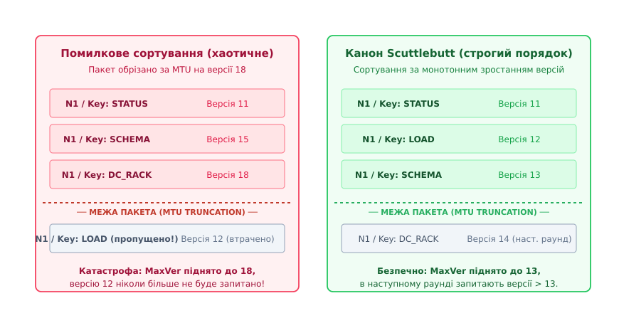
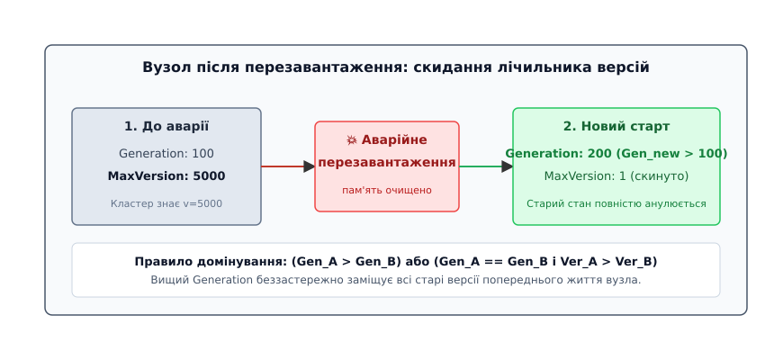

# Протокол реконсиляції Scuttlebutt

<preknowlist>
- [Gossip-протоколи](topic:programming/gossip-protocols) — базові принципи епідемічного розповсюдження інформації у великих кластерах.
- [Стратегії поширення пліток: Push, Pull та гібридний Push-Pull](topic:programming/gossip-pull-vs-push) — асиметрія фаз збіжності та переваги трифазного обміну.
- [Анти-ентропія](topic:programming/anti-entropy-repair) — фонова реконсиляція стану вузлів без блокувань.
- [Векторні годинники](topic:algorithms/vector-clocks) — відстеження причинно-наслідкових зв'язків між подіями в розподілених системах.
- [Кінцева узгодженість на практиці](topic:programming/eventual-consistency) — модель гарантій збіжності реплік у часі.
</preknowlist>

У розподіленому кластері з 2000 серверів під керуванням безлідерної бази даних кожен вузол безперервно генерує десятки динамічних метрик: поточний статус працездатності, показники навантаження процесора й пам'яті, призначення токенів кільця шардингу, версію схеми таблиць та щосекундний лічильник пульсу. Загальний простір стану налічує `2000 · 60 = 120 000` пар ключ-значення. Якщо для виявлення розбіжностей застосувати класичну анти-ентропію з поключовими векторними годинниками або версійними дайджестами, кожен сервер під час щосекундного раунду пліток змушений сформувати пакет із 120 000 трійок `(Вузол, Ключ, Версія)`. Такий дайджест займає понад 3.3 мегабайти, що в тисячі разів перевищує розмір стандартного мережевого кадру UDP (1500 байтів) і провокує шторм фрагментації, переповнення буферів мережевих карт та колапс каналів зв'язку між стійками дата-центру.

Якщо ж замість векторів версій використати дерева Меркла, система стикається з протилежною проблемою: динамічні атрибути змінюються щосекунди, що вимагає постійного перерахунку криптографічних хешів на всіх рівнях дерева та багаторазових раундів запит-відповідь для локалізації змінених листків. Кластер або тоне в обчислювальних витратах на підтримку дерев, або накопичує неприпустиме відставання в актуальності топологічних метаданих.

Цю фундаментальну проблему масштабування розв'язує протокол **Scuttlebutt** (розроблений Роббертом ван Ренессе у 2008 році). Поєднавши інваріант єдиного власника мутацій із монотонним локальним лічильником версій, Scuttlebutt скорочує розмір дайджесту для всього кластера з `O(N · K)` до строгого `O(N)` чисел, забезпечує повну симетричну реконсиляцію за 1.5 мережевих раунди (`SYN -> ACK -> ACK2`) і гарантує збереження цілісності даних при обриві дейтаграм за лімітом MTU.

---

## Ієрархія стану та монотонний локальний лічильник версій

Головна причина надлишковості класичних протоколів анти-ентропії полягає в тому, що вони розглядають простір стану як довільну пласку множину ключів, де будь-який вузол потенційно може перезаписати значення будь-якого іншого вузла. У реальних системах кластерної координації діє суворий інваріант: **атрибути конкретного вузла мутують виключно цим самим вузлом**. Сервер `Node-2` не може безпосередньо змінити завантаження процесора чи стан дисків сервера `Node-1`.

Scuttlebutt структурує глобальний стан кластера як дворівневу ієрархію:

1. **Верхній рівень (Вузли / Endpoints)**: Множина відомих учасників кластера.
2. **Нижній рівень (Атрибути / ApplicationState)**: Словник пар ключ-значення, що належать конкретному учаснику.

```
Кластерний стан:
├── Node-1 (Generation: 1718900000, MaxVersion: 42)
│   ├── STATUS   -> "NORMAL"        (Version: 12)
│   ├── LOAD     -> "1.42"          (Version: 39)
│   ├── SCHEMA   -> "v2.1.0"        (Version: 40)
│   └── DC_RACK  -> "eu-west:rack-3" (Version: 42)
├── Node-2 (Generation: 1718900050, MaxVersion: 18)
│   ├── STATUS   -> "JOINING"       (Version: 5)
│   └── LOAD     -> "0.20"          (Version: 18)
└── Node-N ...
```

Замість того щоб підтримувати окремий незалежний лічильник версій для кожного окремого атрибута (`STATUS`, `LOAD`, `SCHEMA`), вузол-джерело веде **єдиний локальний монотонний лічильник** цілих чисел `max_version` для всіх своїх атрибутів.

Коли на вузлі відбувається зміна будь-якого локального параметра (наприклад, фоновий таймер оновлює метрику завантаження), виконується атомарна послідовність дій:
1. Значення `max_version` збільшується на одиницю (`max_version = max_version + 1`);
2. Зміненому атрибуту призначається нове значення `max_version` як його персональний номер версії;
3. Нове значення записується в таблицю атрибутів вузла.


*Дворівнева модель стану Scuttlebutt: локальний монотонний лічильник MaxVersion зростає при кожній мутації будь-якого ключа, що дозволяє виразити повний стан вузла для віддалених пірів єдиним числом у дайджесті GossipDigest.*

Оскільки мутації генеруються строго послідовно без розривів (`1, 2, 3, 4, ...`), стан оновлень вузла формує лінійно впорядковану послідовність. Якщо віддалений партнер `Node-B` знає, що останнє отримане ним оновлення від `Node-A` має версію `v = 42`, то `Node-B` гарантовано володіє **всіма мутаціями** вузла `Node-A`, чий номер версії менший або дорівнює 42.

Звідси випливає фундаментальний висновок: для того щоб повідомити іншим вузлам про весь обсяг своїх знань про `Node-A`, серверу непотрібно перелічувати версії всіх його 60 ключів. Достатньо передати лише одне число — `max_version(Node-A)`.

Дайджест знань про весь кластер із `N` серверів перетворюється на компактний вектор із `N` пар `(NodeID, MaxVersion)`:

```
Дайджест знань = { Node-1: 42, Node-2: 18, ..., Node-N: 105 }
```

Розмір цього дайджесту строго дорівнює `O(N)` і не залежить від кількості внутрішніх ключів `K`. Детальний математичний аналіз складності та порівняння обсягів трафіку з традиційними векторними схемами викладено у вставці [Математика узгодження Scuttlebutt: складність дайджесту, трафік та час збіжності](topic:programming/scuttlebutt-protocol/math-scuttlebutt-convergence.md).

---

## Трифазний протокол узгодження: SYN, ACK та ACK2

Реконсиляція між двома випадково обраними вузлами `A` та `B` відбувається за три кроки (1.5 мережевих кругових затримки RTT), повністю синхронізуючи обидва вузли в обох напрямках.

```
Вузол A (Ініціатор)                                Вузол B (Партнер)
       │                                                  │
       │ 1. SYN: GossipDigestSyn(Дайджест A)             │
       │─────────────────────────────────────────────────>│
       │                                                  │ Обчислює розбіжності:
       │                                                  │ • Дельти для A (де Ver_B > Syn_A)
       │                                                  │ • Дайджест для B (де Syn_A > Ver_B)
       │ 2. ACK: GossipDigestAck(Дельти B->A, Дайджест B) │
       │<─────────────────────────────────────────────────│
Застосовує дельти B->A                                    │
Обчислює дельти для B (де Ver_A > Ack_B)                 │
       │ 3. ACK2: GossipDigestAck2(Дельти A->B)           │
       │─────────────────────────────────────────────────>│
       │                                                  │ Застосовує дельти A->B
       ▼                                                  ▼
[Узгоджено: стан A == стан B]                      [Узгоджено: стан A == стан B]
```


*Послідовність трифазного обміну Scuttlebutt: ініціатор надсилає дайджест своїх знань у SYN; партнер відповідає дельтою новіших даних та власним запитом у ACK; ініціатор завершує синхронізацію передачею залишкової дельти в ACK2.*

### Фаза 1: Повідомлення SYN (GossipDigestSyn)

Кожен вузол кластера раз на період `T_gossip` (зазвичай 1000 мс) обирає одного випадкового партнера зі списку живих серверів і надсилає йому повідомлення `SYN`. Повідомлення містить вектор дайджестів усіх відомих ініціатору вузлів:

```
GossipDigestSyn = [
    { node_id: "Node-1", generation: 1718900000, max_version: 10 },
    { node_id: "Node-2", generation: 1718900050, max_version: 50 }
]
```

### Фаза 2: Повідомлення ACK (GossipDigestAck)

Отримавши `SYN`, партнер `B` попарно порівнює кожен елемент отриманого дайджесту зі своїм локальним станом:

1. **Випадок 1 (`MaxVersion_B(X) > MaxVersion_SYN(X)`)**: Вузол `B` має свіжіші оновлення для вузла `X`, ніж знає ініціатор `A`. Вузол `B` збирає всі пари ключ-значення вузла `X`, чий персональний номер версії перевищує `MaxVersion_SYN(X)`, і пакує їх у список **дельт для ініціатора**.
2. **Випадок 2 (`MaxVersion_SYN(Y) > MaxVersion_B(Y)`)**: Ініціатор `A` має свіжіші оновлення для вузла `Y`, ніж є у `B`. Вузол `B` фіксує це відставання і додає запис `{ node_id: Y, generation: Gen_B(Y), max_version: MaxVersion_B(Y) }` до списку **дайджестів для партнера**.
3. **Випадок 3 (`MaxVersion_B(Z) == MaxVersion_SYN(Z)`)**: Знання про вузол `Z` повністю ідентичні, жодних дій не вимагається.

Сформоване повідомлення `ACK` містить два тіла: готові дельти для оновлення `A` та запитаний дайджест для отримання даних від `A`.

### Фаза 3: Повідомлення ACK2 (GossipDigestAck2)

Отримавши `ACK`, ініціатор `A`:
1. Безпосередньо застосовує отримані дельти до свого локального сховища, оновлюючи застарілі ключі та піднімаючи локальні `max_version` до свіжих значень.
2. Бере отриманий дайджест відставання вузла `B` і витягує зі свого сховища всі ключі, чиї версії новіші за вказані в дайджесті.
3. Формує повідомлення `ACK2`, що містить виключно результуючі дельти, і надсилає його вузлу `B`.

Отримавши `ACK2`, вузол `B` застосовує дельти. На цьому етапі обидва сервери мають абсолютно ідентичний зріз найсвіжіших даних для всіх перетнутих ключів. Повні структури бінарних заголовків, коди типів повідомлень та схеми серіалізації наведено у вставці [Бінарний протокол та програмний інтерфейс Scuttlebutt](topic:programming/scuttlebutt-protocol/api-scuttlebutt-wire.md).

---

## Керування потоком і фрагментація: пакування в межах MTU

У реальних мережах обсяг дельт, які вузол хоче передати у фазах `ACK` або `ACK2`, може суттєво перевищувати ліміт корисного навантаження одного UDP-пакета (наприклад, 1200–1400 байтів при стандартному Ethernet MTU 1500). Це типово під час підключення нового вузла до кластера або після відновлення зв'язку між стійками після мережевого розділення (*network partition*).

Якщо пакет буде обрізано довільним чином, виникає смертельна небезпека **дірок у версіях** (*version holes*).

```
Сценарій катастрофи при хаотичному пакуванні:
• Вузол B має для Node-1 версії ключів: v=11 (STATUS), v=12 (LOAD), v=13 (SCHEMA), v=14 (DC).
• Через ліміт MTU у пакет потрапляють лише два випадкові записи: v=11 та v=14.
• Вузол A отримує пакет, застосовує ключі STATUS та DC і бачить найвищу версію v=14.
• Вузол A піднімає свій MaxVersion(Node-1) до 14.
• У наступному раунді A запитує оновлення з версією > 14.
• Ключі LOAD (v=12) та SCHEMA (v=13) назавжди втрачені для вузла A!
```

Щоб унеможливити цю втрату, Scuttlebutt вимагає суворого дотримання інваріанта **монотонного неперервного префікса версій** (*Monotonic Prefix Invariance*):

1. **Впорядкування за зростанням**: Усі дельти, що стосуються одного вузла-джерела, перед серіалізацією обов'язково сортуються строго за зростанням їхніх номерів версій: `v₁ < v₂ < v₃ < ... < v_m`.
2. **Пакування без пропусків**: Якщо розмір буфера вичерпується, серіалізатор зупиняється на останній дельті `v_k`, яка повністю помістилася в пакет. Наступні версії `v_{k+1}, ...` залишаються на наступний раунд.
3. **Оновлення лічильника отримувачем**: Одержувач піднімає свій локальний лічильник `MaxVersion` не до абстрактного максимуму, а рівно до номера версії останньої успішно застосованої послідовної дельти `v_k`.
4. **Справедливий розподіл між вузлами (Round-Robin)**: Щоб один вузол із 5000 накопичених оновлень не заблокував передачу даних інших вузлів кластера, планувальник Scuttlebutt чергує додавання дельт від різних вузлів по колу (*Round-Robin*), зберігаючи монотонний порядок версій всередині кожного окремого вузла.


*Керування потоком при ліміті MTU: хаотичне пакування створює пропуски у версіях і призводить до втрати даних; строге сортування за зростанням версій гарантує безпечне оновлення лічильника MaxVersion до останнього неперервного елемента.*

У наступному раунді пліток одержувач надішле дайджест із запитом `MaxVersion = v_k`, і партнер продовжить відправку з версії `v_{k+1}`. Жоден байт інформації не втрачається.

Повну програмну реалізацію алгоритму пакування дельт та симуляції трифазного обміну мовами C та C++20 наведено у вставці [Реалізація рушія реконсиляції Scuttlebutt мовами C та C++](topic:programming/scuttlebutt-protocol/proj-scuttlebutt-reconciliation.md).

---

## Епохи перезавантаження: генерація та подолання втрати пам'яті

Монотонний лічильник `max_version` чудово працює, поки сервер безперервно функціонує в оперативній пам'яті. Проте що відбувається, коли сервер аварійно падає, перезавантажується і стартує з чистого листа, де його локальний лічильник версій скидається до початкового значення `1`?

Якщо решта кластера вже пам'ятає, що цей сервер до падіння мав `max_version = 5000`, жоден вузол не прийме його нові повідомлення з версіями `1, 2, 3`, оскільки вважатиме їх застарілим сміттям (`1 < 5000`). Сервер виявиться повністю заблокованим і не зможе оголосити про своє повернення до ладу.

Для розв'язання цієї проблеми Scuttlebutt вводить поняття **епохи генерації** (*Generation Epoch*):

- Кожен вузол зберігає кортеж `(Generation, MaxVersion)`;
- `Generation` — це 64-бітне монотонно зростаюче число, яке інкрементується або ініціалізується поточним системним часом у секундах (Unix Timestamp) **виключно в момент холодного старту процесу**;
- `MaxVersion` — локальний лічильник мутацій, який скидається до `0` або `1` при кожному новому старті.


*Механізм епох генерації: після аварійного перезавантаження вузол збільшує Generation, що дає право скинути MaxVersion до 1; кластер беззастережно заміщує всі застарілі дані попереднього життєвого циклу.*

### Правило домінування станів

При порівнянні записів для одного й того самого вузла діє строгий лексикографічний порядок:

```
Стан A домінує над станом B, якщо:
(Generation_A > Generation_B)
АБО
(Generation_A == Generation_B І MaxVersion_A > MaxVersion_B)
```

Якщо вузол `Node-1` перезавантажився й отримав `Generation = 1718900500`, будь-який інший сервер, побачивши це число, фіксує, що `1718900500 > 1718900000`. Старий стан вузла з попередньої епохи (разом з усіма його застарілими ключами та версією 5000) **повністю анулюється й очищується**, після чого записується новий стан із версією 1.

---

## Архітектура на практиці: підсистема Gossip в Apache Cassandra

Найвідомішим і найбільш перевіреним часом промисловим втіленням протоколу Scuttlebutt є підсистема пліток розподіленої СУБД Apache Cassandra (`org.apache.cassandra.gms`).

```
                              +---------------------------------------+
                              |         org.apache.cassandra          |
                              |              .gms.Gossiper            |
                              +---------------------------------------+
                                                  │
                         ┌────────────────────────┴────────────────────────┐
                         ▼                                                 ▼
        +---------------------------------+               +---------------------------------+
        |          EndpointState          |               |         FailureDetector         |
        +---------------------------------+               |         (Phi Accrual)           |
        | • HeartBeatState:               |               +---------------------------------+
        |     - Generation (boot time)    |               | Обчислює ймовірність відмови    |
        |     - Version (heartbeat tick)  |               | на основі міжпакетних інтервалів|
        | • ApplicationState Map:         |               | оновлення HeartBeatState.       |
        |     - STATUS (NORMAL, LEAVING)  |               +---------------------------------+
        |     - LOAD (дисковий простір)   |
        |     - TOKENS (діапазони ключів) |
        |     - SCHEMA (UUID версії)      |
        |     - RACK / DC (топологія)     |
        +---------------------------------+
```

У Cassandra кожна репліка підтримує такі ключові компоненти:
- `HeartBeatState`: містить `generation` (час старту JVM) та `version` (щосекундно інкрементується фоновим потоком `Gossiper`). Саме цей лічильник виступає пульсом вузла;
- `ApplicationState`: набір системних ключів (`STATUS`, `LOAD`, `SCHEMA`, `DC`, `RACK`, `TOKENS`, `SEVERITY`, `NET_VERSION`), кожен із яких отримує найвищий номер версії в момент зміни;
- `IFailureDetector` (на основі детектора Φ-Accrual): аналізує статистичний розподіл інтервалів прибуття нових версій `HeartBeatState` від кожного сервера. Якщо версія `HeartBeatState` вузла не зростає протягом розрахованого адаптивного вікна, вузол автоматично маркується як недоступний (*DOWN*).

Детальну історію створення протоколу та його шлях від академічних лабораторій Корнелльського університету до промислового коду Cassandra наведено у вставці [Історія створення Scuttlebutt: подолання бар'єра масштабування анти-ентропії](topic:programming/scuttlebutt-protocol/hist-scuttlebutt-origins.md).

> 🔧 **Навіщо це.**
> У практичній розробці розподілених систем (кластерних сховищ, служб виявлення сервісів, розподілених планувальників) протокол Scuttlebutt є золотим стандартом розповсюдження метаданих конфігурації.
> 
> Він звільняє архітектора від компромісу між трафіком і точністю: ви можете публікувати десятки динамічних метрик на кожному сервері без ризику перевантажити мережу дайджестами, а трифазний механізм `SYN-ACK-ACK2` гарантує, що будь-яка зміна конфігурації або виявлена аварія дійде до 100% учасників за строго передбачуваний логарифмічний час `O(log N)`.

---

## Підсумок архітектурних інваріантів

Протокол Scuttlebutt досягає максимальної ефективності за рахунок чотирьох взаємопов'язаних інженерних рішень:

| Проблема розподіленої анти-ентропії | Класичне наївне рішення | Рішення Scuttlebutt | Ефект для системи |
| :--- | :--- | :--- | :--- |
| **Розмір дайджесту версій** | Поключовий перелік `(Node, Key, Ver)`: складність `O(N · K)` | Єдиний монотонний лічильник на вузол: складність `O(N)` | Зменшення розміру пакетів у десятки разів (дайджест 1000 вузлів займає 24 КБ замість 1.4 МБ). |
| **Кількість кругових затримок (RTT)** | Односторонній Push або Pull (потрібно багато раундів) | Трифазний симетричний обмін `SYN -> ACK -> ACK2` | Повна двостороння синхронізація за 1.5 RTT без сліпих зон. |
| **Фрагментація та ліміт MTU** | Довільне пакування дельт (виникають дірки у версіях) | Строге сортування за версіями (Monotonic Prefix Invariance) | Гарантія цілісності: зафіксована версія означає отримання 100% попередніх оновлень. |
| **Холодний старт після падіння** | Ручне узгодження або блокування через старі версії | Дворівневий лічильник `(Generation, MaxVersion)` | Безпечне анулювання старого стану без ризику відхилення нових версій. |
