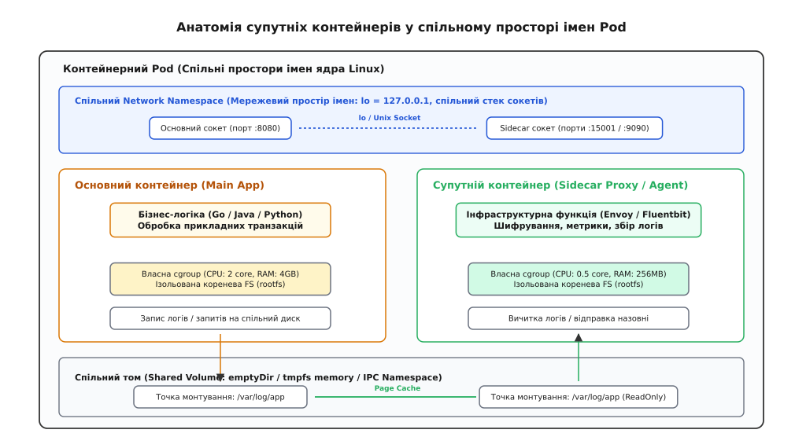
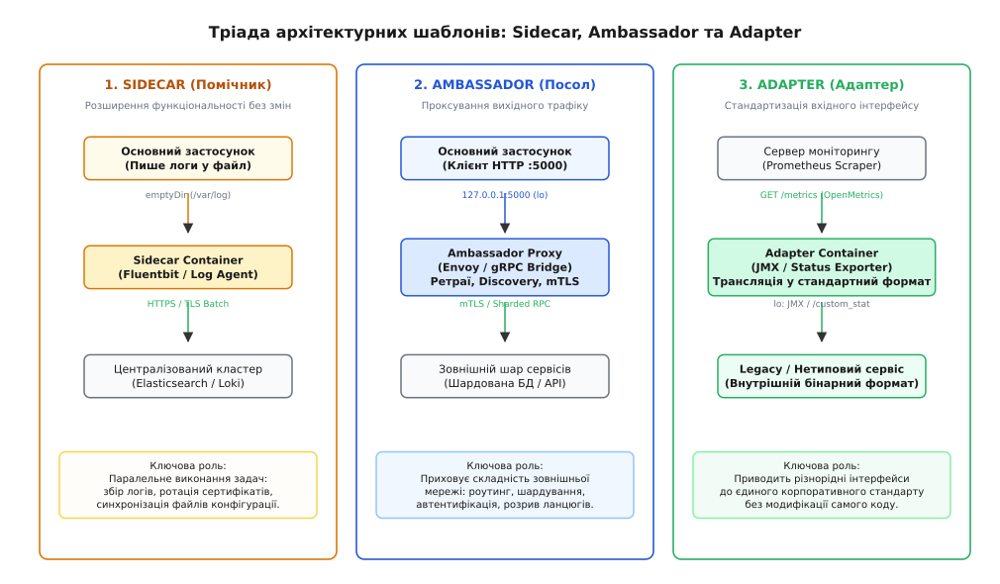
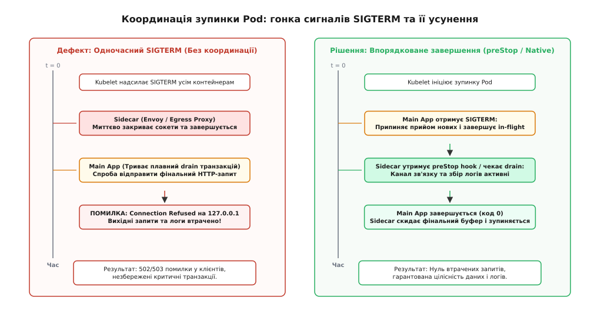
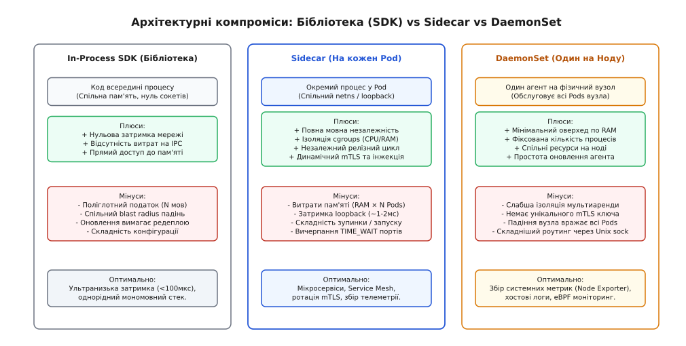

# Шаблони Sidecar, Ambassador та Adapter

<preknowlist>
- [Виявлення сервісів](book:programming/service-discovery) — динамічна реєстрація та пошук мережевих адрес інстансів у кластері.
- [Запобіжник](book:programming/circuit-breaker-pattern) — автоматичне розривання викликів до збійного вузла для запобігання каскадним аваріям.
- [Повтори і експоненційний відступ](book:programming/retries-backoff) — алгоритми повторних спроб із псевдовипадковим джитером для згладжування сплесків.
- [Таймаути і бюджет часу](book:programming/timeouts-deadlines) — обмеження тривалості викликів для запобігання вичерпанню пулів потоків.
- [Перевірки живості й готовності](book:programming/health-checks) — механізми перевірки працездатності контейнерів оркестратором.
</preknowlist>

У платіжному шлюзі великого маркетплейсу під час масштабної акції дев'яносто мікросервісів, написаних на п'яти різних мовах програмування (Java, Go, Python, Node.js та Rust), одночасно втрачають зв'язок із центральним кластером баз даних. Причиною стає планова ротація кореневого криптографічного сертифіката TLS: оновлений сертифікат було вчасно розгорнуто на серверах бази даних, але клієнтські застосунки не змогли його підхопити без повного перезапуску процесів. Java-сервіси, що використовували важку внутрішню бібліотеку взаємодії з базою, пішли в нескінченний цикл блокування пулу потоків через витік пам'яті в статичному кеші сертифікатів; сервіси на Node.js упали через переповнення черги мікротасків; а Python-сервіси почали надсилати запити з відключеною перевіркою валідності сертифікатів, порушивши вимоги банківського аудиту безпеки. Для усунення наслідків інженерам довелося в авральному режимі координувати випуск виправлень у сорока окремих репозиторіях, що затягнуло простій платіжного контуру на чотири години й призвело до мільйонних збитків.

Ця масштабна аварія висвітлює фундаментальне протиріччя традиційної мікросервісної архітектури: спробу реалізувати наскрізні інфраструктурні задачі — взаємну автентифікацію, шифрування трафіку, динамічне оновлення секретів, збір журналів подій, маршрутизацію запитів та захист від збоїв — за допомогою товстих клієнтських бібліотек (англ. *fat clients* / *SDK*), вбудованих безпосередньо в кодову базу кожного застосунку.

Коли кількість автономних мікросервісів перетинає позначку в кілька десятків, а технологічний стек стає поліглотним, такий підхід породжує так званий «поліглотний податок». Кожну інфраструктурну функцію доводиться реалізовувати та оптимізувати N разів для кожної мови програмування та кожного вебфреймворку окремо. Будь-яке виправлення критичної вразливості в протоколі шифрування вимагає масового перекомпілювання сотень застосунків десятками незалежних продуктових команд. Ба більше, помилка у допоміжній бібліотеці збору логів може призвести до падіння всього процесу бізнес-логіки через спільний простір пам'яті.

Рішенням цієї кризи став перехід від спільних бібліотек до архітектури супутніх процесів: винесення допоміжної інфраструктурної функціональності в окремі легковажні контейнери, що розгортаються на тому самому фізичному або віртуальному хості в єдиному операційному контексті. Цей підхід кристалізувався у тріаду взаємопов'язаних шаблонів проєктування: **Sidecar (англ. *sidecar* — мотоциклетний візок збоку)**, **Ambassador (англ. *ambassador*, від лат. *ambactus* — посол, службовець)** та **Adapter (англ. *adapter*, від лат. *adaptare* — пристосовувати)**.

Історичний шлях виникнення цих шаблонів — від перших суперсерверів BSD Unix та механізму алокацій у Google Borg до публікацій інженерів Google та стандартизації нативних сайдкарів KEP-753 у Kubernetes — детально викладено у вставці [📜 Від демонів Unix та Borg allocs до KEP-753: як виникли шаблони Sidecar і Pod](book:programming/sidecar/hist-pod-and-sidecar-origins.md).

## Операційний фундамент: анатомія спільного простору імен Pod

Щоб зрозуміти, чому супутні контейнери здатні ефективно взаємодіяти між собою без накладних витрат на передачу даних через фізичну мережу, необхідно розглянути низькорівневий механізм ізоляції ядра Linux — простори імен (**Namespaces**) та контрольні групи ресурсів (**Cgroups**).

В архітектурі сучасних контейнерних оркестраторів базовою одиницею планування та виконання є не окремий контейнер, а **Pod** (стручок). Pod являє собою групу з одного або кількох процесів, які запускаються на спільному хості ядра Linux і ділять між собою визначений набір просторів імен, зберігаючи при цьому ізоляцію інших системних ресурсів.


*Анатомія супутніх контейнерів у спільному просторі імен Pod: спільний мережевий інтерфейс зворотного зв'язку lo (127.0.0.1), спільний том даних у пам'яті emptyDir та незалежні обмеження cgroups за пам'яттю та процесором.*

### 1. Спільний мережевий простір імен (Network Namespace)
Усі контейнери всередині одного Pod ділять єдиний мережевий простір імен ядра Linux (`netns`). Це означає, що:
* Усі контейнери Pod мають однакову IP-адресу в мережі кластера.
* Усі контейнери бачать спільний інтерфейс зворотного зв'язку `lo` (петля зворотного зв'язку, англ. *loopback interface* з адресою `127.0.0.1`).
* Контейнери звертаються один до одного через звичайні TCP або UDP сокети за адресою `127.0.0.1:<порт>`.
* Простір номерів TCP-портів є спільним для всіх процесів Pod. Якщо основний контейнер слухає порт 8080, супутній контейнер не може відкрити цей самий порт і повинен обирати інший (наприклад, 9090 або 15001).

Передача пакетів через інтерфейс `lo` не виходить на рівень фізичного мережевого адаптера: ядро Linux копіює пакети безпосередньо з вихідного буфера сокета `sk_buff` відправника у вхідний буфер отримувача, оминаючи побудову Ethernet-фреймів та апаратні черги мережевої карти.

### 2. Механізми перехоплення трафіку: iptables проти eBPF
Для того щоб взаємодія через Ambassador або Sidecar залишалася прозорою для коду застосунку, використовується перехоплення пакетів на рівні ядра:

* **Перехоплення правилами iptables (таблиця `nat`):** Ініціалізуючий контейнер налаштовує правила Netfilter. Будь-який вихідний TCP-пакет від застосунку перенаправляється правилом `REDIRECT` у ланцюжку `OUTPUT` на локальний порт слухача сайдкара (наприклад, `15001`). Щоб запобігти нескінченному зацикленню, правило містить перевірку ідентифікатора власника процесу `-m owner --uid-owner 1337`: пакети, згенеровані самим проксі-процесом (UID 1337), пропускаються напряму у фізичний інтерфейс `eth0`. Проксі витягує початкову адресу призначення за допомогою виклику ядра `getsockopt(fd, SOL_IP, SO_ORIGINAL_DST, ...)`.
* **Перехоплення через eBPF (sockops та cgroup-bpf):** У сучасних ядрах Linux перехоплення здійснюється програмами eBPF на рівні сокетних подій `sock_ops`. eBPF переписує вказівники у сокетній карті ядра `sock_map`, перенаправляючи дані безпосередньо між чергами прийому та відправки двох сокетів у пам'яті ядра (`sk_msg`), повністю оминаючи стек маршрутизації TCP/IP та таблиці iptables.

### 3. Спільний простір міжпроцесної взаємодії (IPC Namespace) та Unix Domain Sockets
Контейнери можуть ділити спільний простір IPC ядра (`ipcns`), що уможливлює використання швидкої спільної пам'яті POSIX (`/dev/shm`), черг повідомлень та семафорів.

Альтернативою мережевому сокету `127.0.0.1` є використання сокетів домену Unix (**Unix Domain Sockets**, сімейство `AF_UNIX`). Коли основний застосунок і сайдкар монтують спільний том із файлом сокета (наприклад, `/var/run/app.sock`), передача даних відбувається повністю у просторі пам'яті ядра без виконання розрахунків контрольних сум TCP, перевірки номерів послідовностей (ACK/SEQ) та маршрутизації IP-пакетів. Ба більше, використовуючи системний виклик `splice()` або `vmsplice()`, ядро може передавати сторінки пам'яті між дескрипторами в режимі Zero-Copy. Це знижує затримку взаємодії до лічених мікросекунд і повністю усуває ризик вичерпання номерів портів.

### 4. Спільні файлові томи (Mount Namespace та emptyDir)
Хоча кожен контейнер запускається зі своїм власним ізольованим кореневим образом файлової системи (`rootfs`), оркестратор може змонтувати спільний том (наприклад, `emptyDir` у Kubernetes) в однакові або різні шляхи файлової структури обох контейнерів.

Якщо том сконфігуровано з директивою `medium: Memory`, ядро створює віртуальну файлову систему `tmpfs` в оперативній пам'яті. Основний застосунок записує файл логів або токен авторизації за адресою `/var/log/app.log`, а супутній контейнер миттєво зчитує ці байти безпосередньо зі сторінкового кешу ядра (**Page Cache**) без фізичного звернення до SSD-накопичувача.

### 5. Ізоляція ресурсів через Cgroups
На відміну від спільних мережі та дисків, розподіл обчислювальних ресурсів між контейнерами залишається строго ізольованим завдяки підсистемі контрольних груп ядра (**Cgroups v1/v2**).

Для кожного контейнера Pod інженер визначає індивідуальні ліміти процесорного часу (`cpu.max` / `cpu.weight`) та граничний обсяг оперативної пам'яті (`memory.max` / `memory.high`). Якщо в супутньому процесі збору телеметрії або парсингу логів виникне витік пам'яті, системний демон OOM-Killer ядра Linux знищить виключно контейнер сайдкара, не зачіпаючи процес основного застосунку, що гарантує збереження стабільності бізнес-логіки.

## Тріада архітектурних патернів супутніх процесів

Хоча з точки зору операційної системи всі супутні процеси є рівноправними контейнерами у спільному просторі імен, з точки зору архітектури розподілених систем вони чітко поділяються на три взаємодоповнюючі шаблони відповідно до напрямку руху даних та виконуваної задачі.


*Тріада шаблонів супутніх процесів: Sidecar (внутрішній помічник, збір логів та ротація секретів), Ambassador (вихідний проксі, захист мережі та маршрутизація) та Adapter (вхідний проксі, нормалізація метрик та уніфікація інтерфейсів).*

### 1. Шаблон Sidecar (Помічник)

Шаблон **Sidecar** призначений для розширення, доповнення або обслуговування основного застосунку без модифікації його коду та без безпосереднього перехоплення вхідного користувацького трафіку.

Він працює як невидимий асистент, що виконує паралельні фонові задачі:
* **Агент збору та потокової передачі журналів (Log Shipper):** Основний застосунок пише структуровані JSON-події у файл на спільному томі `/var/log/app.log` або у стандартний потік виводу. Супутній контейнер (наприклад, Fluentbit або Promtail) безперервно вичитує нові рядки з файлу (механізм `tail`), збагачує їх метаданими Pod (ідентифікатор ноди, неймспейс, версія образу), пакує в оптимізовані батчі, стискає алгоритмом zstd і передає через захищене TLS-з'єднання у централізоване сховище (Elasticsearch, Loki, Kafka). Якщо центральне сховище тимчасово недоступне, сайдкар буферизує байти на локальному диску, ізолюючи основну програму від затримок мережі.
* **Агент синхронізації секретів та ротації токенів:** Застосунку потрібен динамічний пароль до реляційної бази даних. Супутній контейнер Vault Agent самостійно автентифікується на сервері HashiCorp Vault за допомогою сертифіката сервісного акаунта Kubernetes, отримує короткоживучий токен із терміном дії 15 хвилин, записує його у спільний том у пам'яті `/vault/secrets/db-creds.json` і автоматично оновлює файл за дві хвилини до завершення терміну. Застосунок просто періодично вичитує локальний файл, не маючи в своєму коді жодного рядка логіки взаємодії з API Vault.
* **Агент динамічного оновлення конфігурацій (Config Reloader):** Сайдкар відстежує зміни в об'єктах Kubernetes ConfigMap. Коли інженер змінює конфігурацію, сайдкар виявляє оновлення файлу, валідує синтаксис і надсилає локальний сигнал `SIGHUP` або викликає HTTP ендпоінт `POST /-/reload` основного контейнера через `localhost`, змушуючи програму перезавантажити параметри на льоту без рестарту Pod.

> 🔧 **Навіщо це.** Шаблон Sidecar звільняє розробників бізнес-логіки від необхідності писати код інтеграції зі сховищами логів, системами управління секретами та серверами конфігурацій, гарантуючи єдиний корпоративний стандарт доставки телеметрії незалежно від мови програмування.

### 2. Шаблон Ambassador (Посол)

Шаблон **Ambassador** представляє зовнішній світ для основного застосунку. Він виступає як вихідний локальний L4/L7 проксі-сервер, що приховує від програми складність топології, протоколів, автентифікації та мережевої нестабільності зовнішніх сервісів.

У моделі Ambassador застосунок налаштовується на взаємодію з віддаленим сервісом так, ніби він запущений на локальному хості: програма відправляє простий незашифрований HTTP/1.1 або TCP-запит на адресу `127.0.0.1:<порт_посла>`. Усі подальші складні дії бере на себе контейнер-посол:
* **Динамічне виявлення сервісів (Client-Side Service Discovery):** Застосунок звертається до `127.0.0.1:5000`. Ambassador звертається до DNS або реєстру сервісів ([Виявлення сервісів](book:programming/service-discovery)), отримує актуальний список із 50 IP-адрес здорових екземплярів бекенду і самостійно балансує запити між ними (алгоритмами Round-Robin, Least Request, Maglev або Power of Two Choices P2C з урахуванням експоненційного зваженого середнього часу відповіді EWMA).
* **Стійкість до збоїв, ретраї та захист від перевантажень:** Якщо цільовий сервер повертає помилку `503 Service Unavailable` або скидає TCP-з'єднання, Ambassador автоматично здійснює повторну відправку запиту на інший вузол з дотриманням експоненційного відступу та джитеру ([Повтори і експоненційний відступ](book:programming/retries-backoff)). Якщо частка збоїв перевищує критичний поріг, Ambassador розриває ланцюг за допомогою патерна [Запобіжник](book:programming/circuit-breaker-pattern), запобігаючи перевантаженню збійного бекенда.
* **Шардування даних (Sharding / Partitioning Proxy):** Застосунок зберігає сесії у кластері з 16 серверів Redis. Замість вбудовування логіки консистентного хешування в код застосунку, програма підключається до Ambassador на порт 6379. Посол аналізує ключ команди (`GET user:1042`), обчислює хеш-функцію MurmurHash3 і прозоро направляє команду на потрібний шардовий сервер.
* **Трансляція протоколів та шифрування (mTLS / Protocol Upgrading):** Програма надсилає застарілий протокол HTTP/1.1, а посол перетворює його на високоефективний мультиплексований потік gRPC/HTTP/2, пакує у взаємно автентифіковану TLS-сесію (mTLS) та прокидає заголовки наскрізного розподіленого трейсингу (W3C Trace Context).

Повноцінну практичну реалізацію такого проксі мовами C, C++ та Go з пулом з'єднань, автоматом станів запобіжника та обробкою сигналів наведено у вставці [⚙️ Реалізація Ambassador-проксі з пулом з'єднань, ретраями та перемикачем (C, C++, Go)](book:programming/sidecar/proj-ambassador-proxy.md).

### 3. Шаблон Adapter (Адаптер)

Шаблон **Adapter** представляє основний застосунок для зовнішнього світу. Якщо Ambassador спрощує вихідний погляд застосунку назовні, то Adapter спрощує та стандартизує вхідний погляд зовнішніх систем управління на застосунок.

У гетерогенних корпоративних системах різні мікросервіси мають різнорідні інтерфейси моніторингу, діагностики та діагностичних зрізів. Adapter нормалізує ці інтерфейси до єдиного загальноприйнятого стандарту:
* **Стандартизація метрик (Prometheus Metrics Adapter):** Старий білінговий сервіс на Java експортує показники продуктивності виключно через протокол JMX (Java Management Extensions), сервіс на C++ має кастомний бінарний UDP-порт діагностики, а Node.js сервіс повертає вкладений JSON за адресою `/internal/status`. Контейнер-адаптер (наприклад, `jmx_exporter`) розміщується в одному Pod із відповідним сервісом, локально вичитує його специфічні метрики через `127.0.0.1` і відкриває назовні єдиний стандартизований HTTP-порт `9100/metrics` у форматі OpenMetrics. Зовнішній сервер Prometheus збирає метрики за єдиним шаблоном, не підозрюючи про внутрішні особливості застосунків.
* **Уніфікація перевірок здоров'я (Health Check Normalization):** Застосунок має складну логіку перевірки працездатності, що вимагає специфічних заголовків або виконання внутрішніх SQL-запитів. Адаптер надає простий ендпоінт `GET /healthz`, що повертає код `200 OK` або `503 Service Unavailable`, транслюючи запити оркестратора у внутрішні системні виклики програми ([Перевірки живості й готовності](book:programming/health-checks)).
* **Трансляція форматів подій (Logging Protocol Adapter):** Застосунок генерує неструктуровані текстові повідомлення у форматі BSD Syslog RFC 3164 або Common Event Format (CEF). Адаптер парсить регулярними виразами вхідний UDP-потік, перетворює кожний запис у структурований JSON за стандартом OpenTelemetry Semantic Conventions і публікує подію у форматі CloudEvents.

## Координація життєвого циклу: гонитва запусків і зупинок

Найбільш підступним джерелом виробничих аварій у мультиконтейнерних системах є некоординований життєвий цикл процесів усередині Pod.

В операційній системі Linux процеси запускаються та завершуються асинхронно. Якщо оркестратор не надає суворих детермінованих гарантій черговості стадій, система неминуче стикається з двома класичними станами гонитви (**Race Conditions**).


*Гонитва життєвого циклу під час зупинки Pod: аварійний сценарій при одночасному надсиланні SIGTERM (обрив активних транзакцій через передчасну смерть проксі) проти координованого завершення через механізм preStop або нативні сайдкари.*

### 1. Гонитва запуску (Startup Race Condition)
Коли Pod створюється, демон `kubelet` ініціює паралельний старт усіх контейнерів, зазначених у масиві `containers`.

Якщо основний контейнер платіжного застосунку стартує за 200 мілісекунд, а супутній контейнер Envoy Ambassador або Vault Agent потребує 1.5 секунди для завантаження сертифікатів і встановлення зв'язку з площиною управління, виникає збій:
1. Застосунок ініціалізує з'єднання з базою даних через локальний порт `127.0.0.1:8081`.
2. Оскільки проксі ще не відкрив слухаючий сокет, стек TCP/IP повертає прапорець `RST`, а операційна система генерує помилку `ECONNREFUSED` (Connection Refused).
3. Застосунок зазнає аварійного збою на етапі старту (`CrashLoopBackOff`), сповільнюючи процес розгортання всього кластера.

### 2. Гонитва зупинки (Shutdown / Termination Race Condition)
Під час планового оновлення версії сервісу або автомасштабування оркестратор видаляє старий Pod, надсилаючи системний сигнал `SIGTERM` одночасно всім контейнерам.

У цей момент розгортається катастрофічний сценарій:
1. Контейнер Envoy або збирач логів отримує `SIGTERM`, миттєво закриває локальні слухаючі сокети і починає процедуру завершення (триває 100 мс).
2. Одночасно основний контейнер отримує `SIGTERM` і переходить у режим плавного дренажу (**Graceful Drain**): він припиняє прийом нових викликів, але продовжує протягом 5–10 секунд обробляти активні in-flight замовлення клієнтів.
3. Коли основний процес під час завершення транзакції намагається відправити фінальний HTTP-запит до платіжного шлюзу або записати запис у журнал через `127.0.0.1`, він отримує помилку розриву сокета, оскільки Ambassador вже помер.
4. Результат: клієнти отримують помилки `502 Bad Gateway`, транзакції зависають у невизначеному стані, а критичні журнали аудиту втрачаються.

### 3. Архітектурне вирішення: Нативні сайдкари (KEP-753) та хуки preStop
Для усунення цієї проблеми в сучасній інфраструктурі застосовуються два обов'язкові механізми:

* **Нативні сайдкари Kubernetes (KEP-753):** Контейнери-помічники оголошуються у блоці `initContainers` із параметром `restartPolicy: Always`. Оркестратор гарантує, що основні контейнери почнуть виконання лише після того, як сайдкар повністю запуститься і пройде перевірку `startupProbe`. Під час видалення Pod порядок змінюється на зворотний: Kubelet зупиняє спочатку основні робочі контейнери, чекає їх повного завершення (код виходу 0), і лише потім надсилає сигнал `SIGTERM` сайдкарам.
* **Хуки життєвого циклу `preStop`:** Якщо нативні сайдкари недоступні, у конфігурацію проксі додається блокуючий скрипт затримки (наприклад, `lifecycle.preStop.exec.command: ["sleep", "15"]`). Коли оркестратор ініціює видалення Pod, Kubelet спочатку викликає хук `preStop`, що змушує сайдкар утримувати відкриті сокети рівно стільки часу, скільки потрібно основному застосунку для завершення всіх активних операцій.
* **Адміністративні ендпоінти дренажу Envoy:** Проксі-сервер Envoy надає локальний ендпоінт `POST /healthcheck/fail` або `POST /drain_listeners?graceful`. При виклику цього маршруту Envoy негайно починає відповідати помилкою 503 на вхідні перевірки здоров'я (що змушує балансувальник зняти трафік з Pod), але продовжує повноцінно обслуговувати вихідні запити основного застосунку до закінчення таймауту дренажу.

Повні схеми конфігурації маніфестів Pod, контракти перевірок готовності та правила налаштування `shareProcessNamespace` задокументовано у вставці [📋 Специфікація та контракт життєвого циклу Sidecar у Kubernetes](book:programming/sidecar/api-k8s-sidecar-lifecycle.md).

## Фізичні компроміси: накладні витрати, затримки та черги

Впровадження патернів Sidecar та Ambassador не є безкоштовним. Вилучення логіки з адресного простору процесу в супутній контейнер створює конкретні інженерні витрати, які необхідно враховувати під час проєктування високонавантажених систем.


*Порівняння трьох архітектурних моделей: In-Process Library (SDK), Sidecar (на кожен Pod) та DaemonSet (один агент на вузол) за критеріями поліглотності, затримок, надійності та витрат пам'яті.*

### 1. Ціна затримки (Latency Tax) та перемикання контексту
У разі прямого виклику з коду бібліотека формує мережевий запит безпосередньо в адресному просторі застосунку, виконуючи один системний виклик `write()` для запису в сокет фізичної мережі.

Коли між застосунком і мережею з'являється проксі-сайдкар:
1. Застосунок виконує системний виклик `write()` у локальний сокет `127.0.0.1`.
2. Ядро Linux перемикає контекст процесора (`Context Switch`) з користувацького простору в простір ядра, копіює дані в буфер `sk_buff` інтерфейсу `lo` і пробуджує процес сайдкара.
3. Сайдкар прокидається через механізм `epoll`, ядро перемикає контекст у користувацький простір сайдкара, де проксі виконує виклик `read()`.
4. Сайдкар парсить байти, застосовує правила маршрутизації та виконує системний виклик `write()` у вихідний сокет фізичного адаптера `eth0`.
5. Ядро знову перемикає контекст і передає пакет мережевому драйверу.

Цей подвійний прохід стека ядра та чотири додаткові перемикання контексту додають від `15 до 30 мікросекунд` чистої апаратної затримки на кожен запит. Якщо ж проксі виконує повний L7-аналіз протоколу HTTP/2 з розбором заголовків і перешифруванням TLS, затримка зростає на `0.5–2.0 мілісекунди`. У ланцюжках викликів із глибиною в 10 мікросервісів сумарна додаткова затримка може досягати 20–30 мілісекунд.

### 2. Мультиплікація оперативної пам'яті (Memory Overhead)
Кожен екземпляр сайдкара є повноцінним процесом операційної системи. Навіть високоефективний проксі-сервер на мові C++ або Rust (наприклад, Envoy або Linkerd-proxy) споживає базовий обсяг пам'яті:
* Від 20 до 60 МБ RAM на сам рантайм, кеш DNS, пули пам'яті та таблиці динамічної маршрутизації.
* Додаткові буфери пам'яті на кожне відкрите клієнтське з'єднання.

Якщо в кластері розгорнуто 2000 Pod, кожен із яких містить окремий сайдкар Envoy, сумарні нецільові витрати кластера виключно на підтримання інфраструктурного шару складуть:

```
2000 Pods · 50 МБ = 100 ГБ оперативної пам'яті
```

Для порівняння, вузловий агент (DaemonSet), запущений в одному екземплярі на кожному з 50 серверів, споживав би всього `50 · 50 МБ = 2.5 ГБ RAM`.

### 3. Небезпека вичерпання ефемерних портів (TIME_WAIT Starvation)
Якщо застосунок відкриває нове TCP-з'єднання з сайдкаром на кожен виклик замість підтримання постійного пулу сокетів (HTTP Keep-Alive), закриті сокети перерозподіляються в стан `TIME_WAIT` ядра Linux на тривалість 60 секунд.

Оскільки діапазон доступних ефемерних портів обмежений величиною близько 28 000 номерів, при навантаженні понад `470 запитів/сек` на одну пару IP-адрес локальні порти повністю вичерпуються, і виклик `connect()` починає відхилятися ядром з кодом помилки `EADDRNOTAVAIL`.

Повний математичний апарат розрахунку черг сокетів за моделлю M/M/1, динаміки зростання затримок при насиченні буферів та формули кластерної точки беззбитковості наведено у вставці [🧮 Математичний аналіз накладних витрат: затримка сокетів, черги M/M/1 та мультиплікація пам'яті](book:programming/sidecar/math-sidecar-resource-and-latency.md).

### 4. Низькорівневе налаштування ядра та діагностика під високим навантаженням
Для забезпечення надійної роботи тисяч супутніх сокетів на інтерфейсі `127.0.0.1` системні інженери застосовують специфічні параметри тюнінгу підсистеми `sysctl`:
* `net.core.somaxconn = 4096`: збільшення максимального розміру черги очікуючих з'єднань слухаючого сокета запобігає скиданню SYN-пакетів при різких сплесках трафіку.
* `net.ipv4.tcp_max_syn_backlog = 8192`: розширення черги непідтверджених напіввідкритих TCP-з'єднань.
* `net.ipv4.tcp_tw_reuse = 1`: дозволяє ядру безпечно перевикористовувати сокети в стані `TIME_WAIT` для нових вихідних з'єднань, якщо часові мітки TCP Timestamps зростають монотонно.

Діагностика зв'язку між контейнерами всередині спільного Pod здійснюється за допомогою системної утиліти `nsenter`: інженер підключається до мережевого простору імен Pod за його системним ідентифікатором процесу (`nsenter -t <PID> -n tcpdump -i lo -nnvv port 8081`) і безпосередньо аналізує сирий трафік між застосунком та сайдкаром, не вносячи змін у код працюючого сервісу.

## Критерії вибору архітектурної моделі

Вибір між бібліотекою (SDK), супутнім процесом (Sidecar/Ambassador/Adapter) та загальновузловим агентом (DaemonSet) визначається інженерними вимогами до системи:

| Критерій оцінки | In-Process SDK (Бібліотека) | Sidecar / Ambassador (На кожен Pod) | DaemonSet (Один агент на ноду) |
|---|---|---|---|
| **Мовна незалежність** | Повністю відсутня (N реалізацій під N мов) | Повна (будь-яка мова спілкується через 127.0.0.1) | Повна (будь-яка мова спілкується через вузловий сокет) |
| **Додаткова затримка** | Майже 0 (виклик функції у пам'яті) | Низька (+15..30 мкс IPC / +1..2 мс L7 проксі) | Середня (+30..60 мкс між просторами імен) |
| **Витрати пам'яті** | Мінімальні (кілька мегабайтів у процесі) | Високі (мультиплікація RAM × N Pods) | Мінімальні (фіксований обсяг на сервер) |
| **Ізоляція збоїв** | Відсутня (збій SDK вбиває процес програми) | Повна (ізольовані cgroups та окремий PID) | Часткова (падіння агента вражає всі Pods ноди) |
| **Оновлення без редеплою** | Неможливе (вимагає повної перезбірки застосунку) | Просте (оновлення образу контейнера або мутація Pod) | Централізоване (оновлення одного DaemonSet на ноду) |
| **Безпека та mTLS** | Ключі шифрування у пам'яті самого процесу | Унікальний криптографічний ідентифікатор на Pod | Спільний сертифікат або проксування з хоста |

### Практичне правило вибору:
1. Обирайте **In-Process SDK**, лише якщо критичною вимогою є ультранизька затримка виконання (наприклад, алгоритмічна біржова торгівля або обробка пакетів на рівні ядра із бюджетом затримки менше 100 мікросекунд) і система написана на єдиній мові програмування.
2. Обирайте **Sidecar / Ambassador / Adapter**, коли система є поліглотною, вимагає суворої криптографічної ідентифікації кожного робочого навантаження (mTLS SPIFFE/SPIRE), незалежного життєвого циклу релізів інфраструктури та надійної ізоляції збоїв допоміжних агентів.
3. Обирайте **DaemonSet**, коли допоміжна функція носить суто загальносистемний характер для всього фізичного сервера (збір апаратних метрик ноди через Node Exporter, низькорівневий моніторинг ядрових tracepoints через eBPF або хостовий збір системних журналів ядра `dmesg`).
