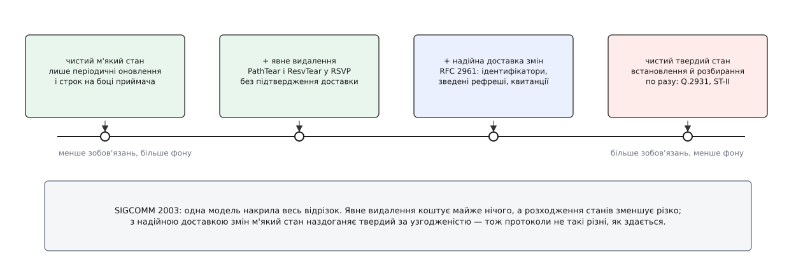

# 📜 Як народилася ідея м'якого стану

Назву «м'який стан» придумав одна людина в одному абзаці 1988 року — і майже одинадцять років ніхто не міг сказати, що саме вона означає й скільки коштує. Ця історія варта уваги не заради дат: у ній видно, як інженерний принцип проходить шлях від здогаду до виміряної величини, і чому на кожному кроці його штовхала конкретна поламана річ, а не смак архітектора.

## Мережа, яка пам'ятала більше, ніж мала

Наприкінці 1970-х панівним способом побудувати надійний зв'язок був **віртуальний канал**: перед обміном даними мережа проводить процедуру встановлення, і кожен проміжний вузол на шляху заводить у себе запис про це з'єднання — номери, буфери, черги, права. Далі пакети йдуть уже «по прокладеному»: вузол дивиться в свій запис і знає, куди й з яким пріоритетом штовхати. Наприкінці — процедура розбирання, яка ці записи прибирає. Так працювали X.25, згодом ATM зі своєю сигналізацією Q.2931, експериментальний потоковий протокол ST-II, дослідницький набір Tenet ([комутація каналів проти комутації пакетів](book:communications/circuit-vs-packet-switching)).

Схема гарна, доки нічого не зникає. Але DARPA-івська мережа будувалася під зовсім іншу вимогу: вціліти, коли частина мережі перестане існувати. І тут віртуальний канал показує своє дно. Стан розмови лежить у проміжних вузлах — отже, вузол, який до розмови не має жодного стосунку, крім того, що через нього йде маршрут, здатен цю розмову вбити самим фактом свого падіння. Гірше: після падіння в живих вузлах лишаються записи, які нікому вже не потрібні, і хтось мусить організувати їх прибирання — саме тоді, коли мережа й так у поганому стані.

## Кларкова примітка: fate-sharing і слово, що прижилося

Девід Кларк (David D. Clark) з MIT, один із головних архітекторів інтернет-протоколів, 1988 року виступив на SIGCOMM у Стенфорді з ретроспективою «The Design Philosophy of the DARPA Internet Protocols» — роботою, яка пояснювала не *що* зроблено в TCP/IP, а *чому* саме так. Там він сформулював принцип **спільної долі** (англ. *fate-sharing* — «поділ долі»): стан розмови треба тримати в тих самих вузлах, що є її учасниками, бо втратити цей стан прийнятно рівно тоді, коли втрачено й самого учасника. Проміжний вузол за такої побудови не тримає нічого, що комусь потрібне, — і його падіння перестає бути подією для чужих розмов. Це той самий хід думки, що й [наскрізний аргумент](book:programming/end-to-end-argument): функція має жити там, де є повне знання про неї.

Але Кларк пішов далі й поставив незручне питання: а що, як мережі все-таки *корисно* дещо знати про потік — скажімо, який тип обслуговування йому потрібен? Тримати такий запис у маршрутизаторах доведеться, а разом із ним повертається вся крихкість віртуального каналу. Кларкова відповідь і була інверсією: хай запис у мережі буде не критичним. Хай кінцеві точки періодично надсилають повідомлення, які підтверджують потрібний режим; тоді запис може згоріти разом із маршрутизатором і відновитися сам, без жодної процедури відновлення після збою і взагалі непомітно для кінцевих систем. Саме там стоїть речення, з якого все й почалося: «I call this concept "soft state"» (Clark, SIGCOMM 1988).

Статус свідчень тут варто назвати прямо. Авторство назви — усталене й документоване: Раман і Мак-Кенн 1999 року пишуть про Кларка як про автора терміна, а Джі з співавторами 2003-го наводять цей абзац дослівно. А от **винаходом механізму** це не було й не претендувало бути: таймаут на кеші й періодичне перевидання записів мережеві інженери вживали й до того. Кларкова заслуга інша — він витягнув прийом із розряду реалізаційних дрібниць у розряд архітектурного принципу й дав йому ім'я, яке можна вимовити на нараді. Ім'я, до речі, він дав прикладом, а не визначенням — і за це наступне десятиліття довелося заплатити.


*Три колонки — три спільноти, які майже не читали одна одну: мережева сигналізація, системи зберігання й архітектура служб. Ідея переходила між ними не як теорія, а як звичка, привезена людьми.*

## Ліза: та сама механіка з іншого боку й з іншої спільноти

За рік після Кларка, на SOSP 1989, Кері Ґрей і Девід Черітон (Cary G. Gray, David R. Cheriton) зі Стенфорду опублікували «Leases: An Efficient Fault-Tolerant Mechanism for Distributed File Cache Consistency». Задача в них була не мережева, а файлова: сервер віддає клієнтам копії файлу, потім хтось файл змінює — і сервер мусить бути певен, що жоден клієнт не читає застарілу копію.

Твердий розв'язок очевидний: сервер пам'ятає всіх, у кого є копія, і перед записом кожному надсилає відкликання. Ціна цього — сервер не може завершити запис, доки не достукається до всіх; один мертвий або недосяжний клієнт зупиняє роботу всім іншим. Ліза (англ. *lease* — «оренда») перевертає задачу: копія видається не назавжди, а на строк. Сервер, якому треба змінити файл, більше нікого не мусить наздоганяти — він **чекає, доки строки доспіють**, і аж тоді пише. Мертвий клієнт не заважає, бо його ліза догорить сама.

Механіка тут та сама, що в Кларка: строк, поновлення, автоматичне зникнення. Але лінія цілком окрема — інша спільнота, інша термінологія, інша задача, жодного посилання на мережеву роботу. Це паралельне відкриття, а не запозичення; спільним у них є не походження, а причина — обидві групи впиралися в те, що надійне сповіщення потребує живого адресата, а строк — ні. Сучасні [розподілені замки й лізи](book:programming/distributed-locks) ростуть саме з цієї гілки.

## RSVP: ідея стає працюючим протоколом

Нитка від Кларка до першого великого втілення виявилася на диво короткою. Ліксія Чжан (Lixia Zhang) захистила докторську в MIT 1989 року — науковим керівником був Кларк; на першу зустріч IETF 1986 року вона приїхала єдиною жінкою й єдиною студенткою серед двадцяти одного учасника. Далі — Xerox PARC, і 1993 року в IEEE Network виходить «RSVP: A New Resource ReSerVation Protocol» — Чжан, Стів Дірінг, Дебора Естрін, Скотт Шенкер і Деніел Заппала (Stephen E. Deering, Deborah Estrin, Scott Shenker, Daniel Zappala). Через дев'ять років цю статтю відберуть до десятки знакових публікацій журналу.

Чому саме резервування ресурсів стало полігоном для м'якого стану — видно з задачі. RSVP резервує смугу для [багатоадресних](book:programming/multicast-and-discovery) потоків, а багатоадресна група — це рухома річ: приймачі приєднуються й відпадають без попередження, склад групи змінюється щохвилини, а [маршрути](book:communications/ip-routing) під нею перераховуються самі по собі. Твердий підхід означав би, що система мусить *помітити* зміну маршруту, *розібрати* стару резервацію в кожному маршрутизаторі старого шляху й *встановити* нову вздовж нового — три складні узгоджені дії в момент, коли мережа щойно струснулася. З рефрешами не треба нічого з цього: чергове повідомлення просто піде новим шляхом і створить стан там, де опинилося, а покинутий відрізок догорить сам.

1997 року з'являється RFC 2205 — RSVP стає стандартом IETF (редактор Боб Брейден, у співавторах та сама Ліксія Чжан). Саме в цьому документі принцип «підказка, а не несуча конструкція» вперше записано нормативно: явні повідомлення розбирання `PathTear` і `ResvTear` специфікація **рекомендує** надсилати, щойно застосунок закінчив, — але коректність від них не залежить, бо невитертий стан однаково вичерпає строк.

## Спір: скільки коштує ніколи не замовкати

Далі почалося те, без чого історія була б неправдивою. М'який стан не всіх переконав, і заперечення було не філософське, а бухгалтерське: цей потік підтверджень не стихає ніколи, і його вартість росте разом із кількістю сесій. Раман і Мак-Кенн 1999 року відкривають статтю саме констатацією, що суперечка наростає — чи виправдовує накладна вартість рефрешів ту якісну «стійкість», заради якої все затівалося.

Відповіддю стала низка робіт про те, як зробити фон дешевшим: ступінчасті таймери рефрешу (Пан і Шульцрінне, 1997), масштабовані таймери для протоколів м'якого стану (Шарма, Естрін, Флойд і Джейкобсон, INFOCOM 1997). Крапку поставив RFC 2961 «RSVP Refresh Overhead Reduction Extensions» (квітень 2001): пакування кількох повідомлень в одне, ідентифікатори повідомлень, **зведений рефреш** — замість повного Path/Resv надсилати короткий список ідентифікаторів, які досі чинні, — і надійна доставка з експоненційним відступом для тих повідомлень, що несуть зміну.

Іронія цього документа варта того, щоб її помітити. Щоб урятувати м'який стан від його власної ціни, довелося повернути в нього рівно ту машинерію, від якої він тікав: підтвердження й повтори. Але повернути **вибірково** — надійність накинули на повідомлення, які несуть *зміну*, лишивши періодичний потік у ролі тонкого зведення, що зцілює розходження. Це вже не «м'який проти твердого», а перший свідомий гібрид.

## 1999: нарешті модель, а не приклад

Сучітра Раман і Стівен Мак-Кенн (Suchitra Raman, Steven McCanne) з Берклі на SIGCOMM 1999 узялися рівно за ту діру, що лишилася з 1988 року: усі кажуть «soft state», усі мають на увазі щось своє, а визначення немає. Їхня модель проста й тому корисна. У видавця є таблиця пар `{ключ, значення}`; планувальник періодично оголошує один із записів у канал зі втратами; підписники, отримавши оголошення, оновлюють свою копію, і кожен запис у них має строк. Цей взірець вони назвали `announce/listen` — оголошуй і слухай.

Головне, що вони додали, — **міра**. Замість якісного «система стійка» з'явилося число:

```
c(k, t) = Pr[ P.val(k) = Q.val(k) ]                    0 ≤ c(k, t) ≤ 1
c(t)    = ( Σ  c(k, t) ) / |L(t)|         k ∈ L(t) — живі записи в мить t
E[c]    = lim (1/T)·∫ c(t) dt             T → ∞
```

Перший рядок — узгодженість одного ключа: імовірність того, що в обох процесів для нього однакове значення. Другий — миттєва узгодженість усієї системи, середнє по живих записах. Третій — те саме, усереднене за часом; його можна не лише вивести, а й виміряти на живій системі. І тут же отримало точне формулювання те, що доти було гаслом: протокол **кінцево узгоджений**, якщо ця ймовірність прямує до одиниці з часом ([кінцева узгодженість на практиці](book:programming/eventual-consistency)).

Далі — черговий аналіз і симуляція: як узгодженість залежить від частки втрат, доступної смуги й характеру навантаження. Окремий результат: додавання зворотного зв'язку від приймача помітно піднімає узгодженість, не збільшуючи витрат смуги, — бо джерело перестає навмання повторювати те, що вже й так дійшло. На цьому вони збудували SSTP, транспорт із регульованим рівнем надійности: від чистого «оголошуй і слухай» до майже TCP, одним параметром.

## 2003: увесь відрізок між м'яким і твердим

Останній камінь поклали Пінг Джі, Зіхуей Ґе, Джим Куроуз і Дон Тауслі (Ping Ji, Zihui Ge, Jim Kurose, Don Towsley) з Массачусетського університету в Амгерсті на SIGCOMM 2003. Вони чесно записали в передмові те, про що всі знали: попри фундаментальність питання, розуміння двох підходів лишалося переважно анекдотичним, а подекуди й віросповідним. І замість чергової суперечки збудували одну параметризовану модель, яка накриває весь відрізок — від чистого м'якого стану через м'який із явним видаленням і м'який із надійною сигналізацією до чистого твердого.


*Виміряний результат 2003 року: більшість користи від «твердих» механізмів дає найдешевший із них — необов'язкове повідомлення про видалення.*

Висновок вийшов несподівано мирний. Явне видалення додає до трафіку майже нічого, а розходження станів зменшує різко; якщо ж додати ще й надійне встановлення-оновлення-видалення, м'який підхід наздоганяє твердий за узгодженістю, а часом і випереджає. Автори з цього роблять висновок, який варто тримати в голові щоразу, коли починається спір про «правильну» архітектуру: раз одна модель описує обидва кінці, то протоколи не такі різні, як здається на перший погляд.

## Літера S: ідея переїжджає з мережі в служби

Паралельно з RFC 2205, того самого 1997 року, на SOSP виступила берклійська команда — Армандо Фокс, Стівен Ґріббл, Ятін Чаватхе, Ерік Бревер і Пол Ґот'є (Armando Fox, Steven D. Gribble, Yatin Chawathe, Eric A. Brewer, Paul Gauthier) — зі статтею «Cluster-Based Scalable Network Services». Вони описували дві справжні служби на кластерах дешевих машин: проксі TranSend і пошуковик HotBot.

Перенесення ідеї в них не здогадне, а прямо задеклароване: прийом будувати стійкі системи на кешованому м'якому стані, який поновлюють періодичні повідомлення від сусідів, вони називають надзвичайно успішним у глобальних мережах TCP/IP і свідомо переносять у кластер. Виглядало це так: керівник періодично сповіщає про своє існування у групу багатоадресної розсилки, робітники самі реєструються в нього, таймаути слугують запасним способом виявити відмову. І ключове речення про наслідок: раз увесь стан м'який і його періодично розсилають, ніякого коду відновлення після збою й ніякого дзеркалювання стану не потрібно — перезапущений компонент відбудує свою таблицю з кількох наступних сповіщень.

Із цього народилася й абревіатура. Протиставивши свою модель даних класичному [ACID](book:programming/transactions-acid), автори склали **BASE** — *Basically Available, Soft state, Eventual consistency*: доступний у принципі, м'який стан, кінцева узгодженість. Літера S у ній означає рівно те, що описував Кларк, лише в новому оточенні: дані, які можна відтворити обчисленням або перечитуванням, і які тому не потребують ні довговічности, ні коміту. Сучасні [реєстри служб](book:programming/service-discovery) — прямі спадкоємці цієї конструкції.

І там же, у розділі про вимірювання, надрукований перший відомий опис найгіршого режиму м'якого стану. Повторюючи досліди на повільнішому 10-мегабітному Ethernet, автори підвели мережу до насичення — і побачили, що більшість їхнього ненадійного багатоадресного трафіку відкидається, чим паралізує і балансування навантаження, і моніторинг. Тобто службові повідомлення про життя загинули першими саме тоді, коли їхня правда потрібна найбільше. Запропоноване авторами лікування читається як інженерна класика: винести службовий трафік в окрему, хай і повільну, мережу, щоб він не конкурував із корисним.

## Що тут кому належить

Розділення заслуг у цій історії неочевидне, тож варто його зафіксувати:

```
запропонував ідею й дав назву      Кларк, SIGCOMM 1988 — прикладом, без визначення
винайшов ту саму механіку окремо   Ґрей і Черітон, SOSP 1989 — ліза у файловій системі
зробив працюючим протоколом        Чжан, Дірінг, Естрін, Шенкер, Заппала, 1993
зробив стандартом                  RFC 2205, вересень 1997
переніс в архітектуру служб        Фокс, Ґріббл, Чаватхе, Бревер, Ґот'є, SOSP 1997
описав формально й дав міру        Раман і Мак-Кенн, SIGCOMM 1999
знизив ціну фону                   RFC 2961, квітень 2001
виміряв увесь спектр               Джі, Ґе, Куроуз, Тауслі, SIGCOMM 2003
```

Одинадцять років між назвою і визначенням, п'ятнадцять — між назвою і числом. Усе це не тому, що ідея складна: механіка м'якого стану вміщається в один абзац і її щоразу винаходили заново. Складним виявилося інше — довести, що вигода від неї більша за постійну плату, і зробити це не переконанням, а мірянням. Так виглядає нормальний вік інженерного принципу: спершу ним користуються, бо працює, і лише потім з'ясовують, чому саме й за скільки.
