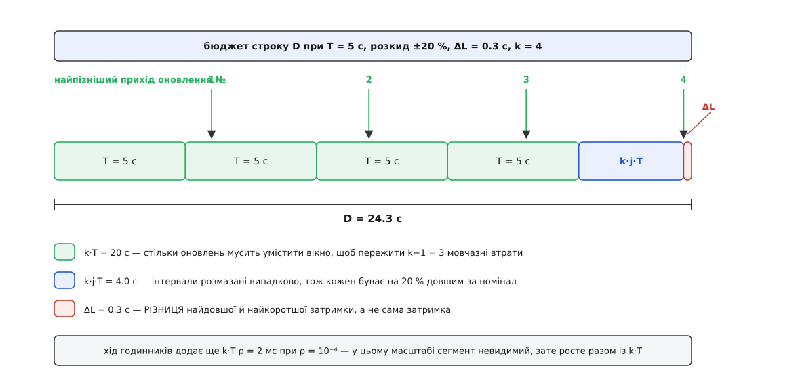
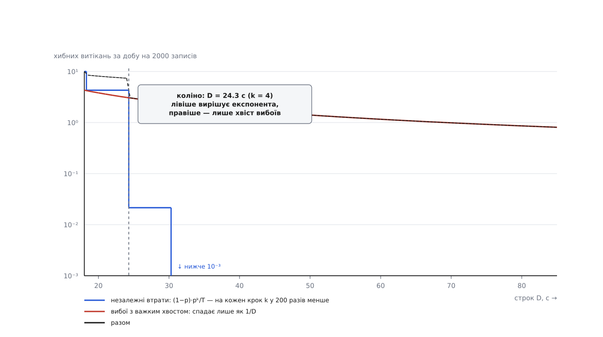
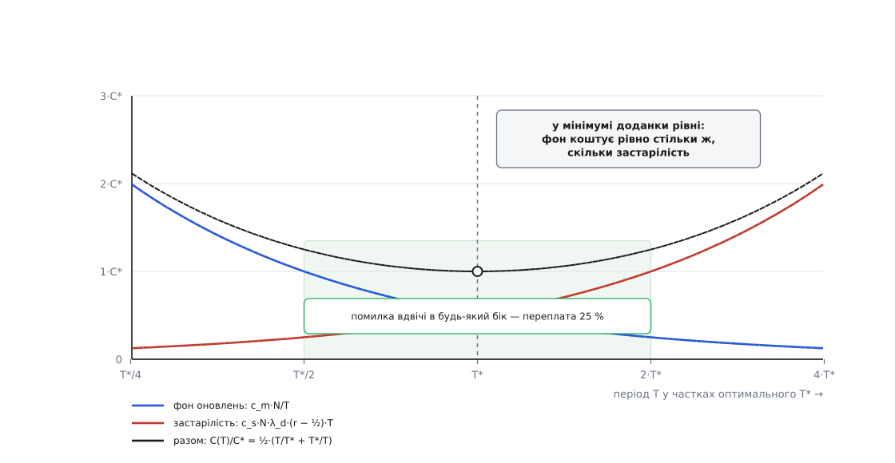

# 🧮 Арифметика періоду й строку

Період `T` і строк `D` не вибирають — їх рахують, і рахують із чотирьох незалежних боків: бюджет доставки, дозволена частота хибних витікань, прийнятний час виявлення смерті й ціна фонового трафіку. Нижче виведено всі чотири формули, показано, котра з них у якому режимі вирішує, і — головне — де кожна перестає бути правдою.

## Позначення

```
T    номінальний період оновлення, с
j    частка розкиду: інтервал рівномірний на [(1−j)·T, (1+j)·T]
ρ    відносна різниця ходу годинників відправника й приймача (10⁻⁴ = 100 ppm)
ΔL   різниця найдовшої й найкоротшої затримки доставки, с
D    строк: приймач стирає запис через D після останнього прийнятого оновлення
k    скільки оновлень гарантовано вміщується у вікні D
p    імовірність утратити одне оновлення
q    імовірність утратити наступне за умови, що це вже втрачено
N    кількість записів у реєстрі
r    відношення D/T
```

## Бюджет: що саме мусить умістити строк

Приймач звів таймер о `t₀` — мить, коли прийшло останнє оновлення. Те оновлення вийшло від відправника о `s₀` і летіло `ℓ₀`, отже `t₀ = s₀ + ℓ₀`. Дальші виходять через інтервали `I₁, I₂, …` і летять `ℓ₁, ℓ₂, …`. Оновлення з номером `i` встигає, якщо

```
s₀ + I₁ + … + Iᵢ + ℓᵢ  ≤  t₀ + D  =  s₀ + ℓ₀ + D

⟺   I₁ + … + Iᵢ  ≤  D − (ℓᵢ − ℓ₀)
```

`s₀` скоротилося — а разом із ним скоротилася **вся стала частина затримки**. Це перший неочевидний висновок: у бюджет входить не час доставки, а його **розкид**. Канал, що рівно й чесно тримає 300 мс, не з'їдає ні мілісекунди строку, бо однаково зсуває і мить зведення таймера, і мить наступного приходу. З'їдає лише те, наскільки `ℓᵢ` може перевищити `ℓ₀`, тобто `ΔL = ℓ_max − ℓ_min`.

Тепер ліва частина. Кожен інтервал не довший за `(1+j)·T` за годинником **відправника**; у секундах приймача це `(1+j)·T·(1+ρ)`. Тут теж скоротилося дещо важливе: абсолютний зсув годинників. Обидві сторони міряють **тривалості**, а не називають одна одній моменти, тож зсув шкал у різницю не входить — входить лише різниця **ходу**, і входить помножена на прожитий проміжок. Звідси й повний бюджет:

```
D  ≥  k·(1+j)·(1+ρ)·T + ΔL
k  =  ⌊ (D − ΔL) / ((1+j)·(1+ρ)·T) ⌋
```

`k` оновлень вміщується — отже, `k−1` можна втратити поспіль і вціліти: щоб запис помер, мовчазними мусять виявитися всі `k`.


*Строк — не «трохи більше за період», а сума чотирьох різних за природою доданків. Три з них ростуть разом із `k`, і лише `ΔL` не залежить від того, скільки втрат ви вирішили пробачити.*

Член із `ρ` майже завжди мізерний: при `k·T = 20` с і `ρ = 10⁻⁴` це 2 мс. Але він росте разом із вікном — для `k·T` порядку години це вже 0.36 с, — і головне: він мізерний **тільки доти, доки строк рахує приймач від миті отримання**. Візьміть позначку часу з тіла повідомлення й додайте `D` до неї — і замість `k·T·ρ` у бюджет увійде абсолютний зсув годинників, який нічим не обмежений і стрибає під час синхронізації ([монотонний проти настінного часу](topic:programming/monotonic-vs-wall-time) — тривалості міряють монотонним годинником саме тому, що він не стрибає й не порівнюється з чужим).

Одне уточнення про `(1+j)`. Це найгірший випадок: усі `k` інтервалів вийшли максимальними. Насправді сума `k` незалежних рівномірних інтервалів має середнє `k·T` і середньоквадратичне відхилення `j·T·√(k/3)`, тож найгірший випадок стоїть від середнього рівно за `√(3k)` відхилень — три при `k = 3`, шість при `k = 12`. Запас на розкид — м'який: якщо його бракує, запис не гине, а лише витрачає одну зі своїх `k` спроб.

### Перевірка формули на чинних стандартах

RSVP описує свій строк однією формулою (RFC 2205, §3.7): `L ≥ (K + 0.5)·1.5·R`, де інтервал оновлення беруть випадково з `[0.5·R, 1.5·R]`, а `K = 3` за замовчуванням. Розкладімо її нашими доданками:

```
j = 0.5                    інтервал із [0.5R, 1.5R]
ρ ≈ 0                      строк рахує приймач
ΔL = 0.5·1.5·R = 0.75·R    півперіоду з запасом на доставку
k = ⌊(K + 0.5)·1.5R / 1.5R⌋ = K = 3
```

Стандарт словами каже те саме, що дає формула: «у найгіршому випадку `K−1` послідовних повідомлень можуть загубитися без видалення стану». Два — при трьох спробах.

Ще цікавіше — те місце RFC, де період дозволено збільшувати на ходу, але не швидше ніж на 30 % за цикл. Строк уже пораховано зі старого `R₁`, а інтервали ростуть геометрично:

```
L = 5.25·R₁
1-ше оновлення, найпізніше: 1.5·1.30·R₁ = 1.95·R₁   разом 1.95·R₁  ≤ 5.25 ✔
2-ге:                        1.5·1.69·R₁ = 2.54·R₁   разом 4.49·R₁  ≤ 5.25 ✔
3-тє:                        1.5·2.20·R₁ = 3.30·R₁   разом 7.78·R₁  > 5.25 ✘
```

`k` упало з 3 до 2, дозволених втрат — з двох до однієї. Саме це стандарт і фіксує окремим реченням про Slew.Max. Урок ширший за RSVP: **при змінному періоді сума інтервалів росте геометрично, тож бюджет вичерпується не лінійно, і `k` треба перерахувати, а не успадкувати.**

Тепер решта. Відношення `r = D/T = k·(1+j) + ΔL/T` при `ΔL ≪ T` майже не залежить від `T` — воно тримається на добутку `k·(1+j)`. Ось звідки береться та вузька смуга, у якій живуть усі відомі системи:

```
система                             T        D         r      j     k   втрат поспіль  середнє виявлення
OSPF Hello (RFC 2328, C.3)          10 с     40 с      4.0    0     4        3              35 с
Kubernetes: ліза вузла              10 с     40 с      4.0    0     4        3              35 с
Kubernetes: NotReady (kcm)          10 с     50 с      5.0    0     5        4              45 с
RSVP (RFC 2205, §3.7)               30 с     157.5 с   5.25   0.5   3        2             141 с
OSPF: перевидання LSA (RFC 2328)    1800 с   3600 с    2.0    0     1        0            2700 с
```

RFC 2328 радить брати RouterDeadInterval «кратним HelloInterval, скажімо 4» — тобто `k = 4` при нульовому розкиді. Kubernetes цілиться туди ж: kubelet поновлює лізу кожні 10 с, а сама ліза оголошена на 40 с; контролер, щоправда, чекає ще довше — типовий `--node-monitor-grace-period` дорівнює 50 с, тож фактичний строк виявлення `r = 5`.

Останній рядок вибивається, і саме він найповчальніший. У перевиданні LSA вік їде **всередині запису**, а не рахується приймачем: кожен маршрутизатор додає до віку свій `InfTransDelay`. Тому з вікна треба відняти `MaxAgeDiff = 900` с — архітектурну константу «наскільки вік того самого LSA може розійтися по мережі». Лишається `3600 − 1800 − 900 = 900` с, тобто пів періоду: `k = 1`, жодної дозволеної втрати. І це не недогляд — просто повторне поширення LSA не є втратним каналом: RFC 2328 вимагає перепосилати LSA сусідові кожні `RxmtInterval`, доки той не підтвердить. Півгодинне перевидання тут — запобіжник проти тихого псування бази, а не бюджет на втрати. **Рахувати `k` має сенс лише там, де оновлення справді можуть мовчки зникати.**

## Ціна одного зайвого кроку `k`

Оновлення — послідовність випробувань із кроком `T`. Поки що припустімо, що вони [незалежні](topic:math/independent-trials): втрата одного не змінює шансів наступного. Позиція `i` починає пробіг із `k` втрат поспіль, якщо попереднє оновлення дійшло (ймовірність `1−p`), а наступні `k` — ні (`pᵏ`). Звідси частота хибних витікань і середнє очікування першого з них:

```
λ = (1−p)·pᵏ / T          хибних витікань за секунду на один запис
E  = T·(1 − pᵏ) / ((1−p)·pᵏ)    середній час до першого, с
```

Друга формула — класичне очікування пробігу з `k` невдач; при `k = 1` вона дає `T/p`, тобто звичайне [геометричне очікування](topic:math/geometric-distribution) першої втрати. Підставмо реєстр із 2000 записів, `T = 5` с і півпроцента втрат:

```
k   pᵏ           λ на запис, 1/с   на 2000 записів   один хибний раз на
2   2.5·10⁻⁵     4.98·10⁻⁶          860 за добу       100 с
3   1.25·10⁻⁷    2.49·10⁻⁸          4.3 за добу       5.6 год
4   6.25·10⁻¹⁰   1.24·10⁻¹⁰         0.021 за добу     46 діб
5   3.13·10⁻¹²   6.22·10⁻¹³         1.1·10⁻⁴ за добу  25 років
```

Кожен крок `k` ділить частоту на `1/p = 200`, а коштує рівно `(1+j)·T = 6` секунд строку. Якщо потрібна не таблиця, а число, розв'яжіть нерівність `N·(1−p)·pᵏ/T ≤ λ_ціль` відносно `k`:

```
k ≥ ln( λ_ціль·T / (N·(1−p)) ) / ln p

N = 2000, T = 5 с, p = 0.005, ціль — одне хибне витікання за добу:
k ≥ ln(2.91·10⁻⁸) / ln(0.005) = 17.35 / 5.30 = 3.28  →  k = 4
D ≥ 4·1.2·1.0001·5 + 0.3 = 24.31 с  →  беремо 25 с
```

Дільник `ln p` пояснює, чому важіль такий сильний: щоб зменшити частоту вдесятеро, потрібно `ln 10 / (−ln p) = 0.43` періоду, тобто **2.6 секунди строку за кожен порядок**. Ніде більше в цій арифметиці немає такого дешевого обміну.

## Як купити `k`, не платячи трафіком

`k` — це кількість **спроб** усередині вікна, і ніде не сказано, що спроби мусять бути рівномірними. Якщо їх згустити, коли вже стало зле, вікно вмістить набагато більше спроб за ту саму ціну в спокійному режимі. Так побудований DHCP: клієнт починає поновлювати оренду на половині строку, а далі щоразу чекає **половину того, що лишилося**, з підлогою 60 секунд (RFC 2131, §4.4.5).

```
L = 86400 с (доба), T1 = 0.5·L, T2 = 0.875·L

RENEWING:  запас W = T2 − T1 = 32400 с
паузи: 16200, 8100, 4050, 2025, 1012, 506, 253, 127, 63, далі підлога 60 с
спроб ≈ log₂(W / w_min) + 1 = log₂(540) + 1 ≈ 10

REBINDING: запас W = L − T2 = 10800 с   →   спроб ≈ 9
```

Разом близько дев'ятнадцяти спроб у вікні, у якого `r = D/T1 = 2`. Рівномірна схема з такою самою кількістю спроб вимагала б `T = 86400/19 ≈ 4550` с — і давала б у дев'ять із половиною разів більше фонового трафіку, бо в здоровому режимі шле всі 19 повідомлень, а не одне. Формально: рівномірна схема коштує `N·k/D` повідомлень за секунду, схема з половинним відступом — `N·2/D`, а `k` у неї виходить `≈ log₂(D/w_min)`. **Рівномірний період платить за спроби лінійно, геометричний — логарифмічно** ([повтори й відступ](topic:programming/retries-backoff) — та сама геометрія, з якої зроблено всі розумні розклади повторів).

## Де незалежність виявляється вигадкою

Уся таблиця вище стоїть на `pᵏ`, а `pᵏ` — на припущенні незалежности. Подивімося, чого варте це припущення. Якщо про залежність не відомо **нічого**, крім самої частки втрат `p`, елементарні межі (знизу — нерівність Буля, згори — очевидне «перетин не більший за найменшу подію») дають:

```
max(0, 1 − k·(1−p))  ≤  P(k втрат поспіль)  ≤  p

p = 0.005, k = 3:        0  ≤  P  ≤  0.005
незалежні втрати дали:            P  = 1.25·10⁻⁷
```

Верхня межа більша за «незалежну» відповідь у сорок тисяч разів — і вона досяжна: її дає канал, який або пропускає все, або не пропускає нічого. Тобто **сам по собі строк не гарантує анічогісінько**; усе, що він купує, куплене припущенням, що втрати встигають розчепитися за `T` секунд.

Між двома крайнощами лежить один параметр — `q`, імовірність утратити наступне оновлення за умови, що попереднє вже втрачено. Це найпростіший [ланцюг Маркова](topic:math/markov-chain) на два стани, і при `q = p` він вироджується в незалежність:

```
λ = p·(1−q)·qᵏ⁻¹ / T

q       хибних витікань за добу (k = 3, N = 2000)   у скільки разів більше
0.005   4.3                                            1
0.05    410                                           95
0.1     1555                                          362
0.5     21 600                                        5025
```

Множник між моделями — `((1−q)/(1−p))·(q/p)ᵏ⁻¹` — сам експоненційний за `k`. Це варто вимовити повільно: **той самий `k`, що дає експоненційний захист за незалежности, дає експоненційне підсилення помилки в моделі.** Чим глибший запас ви заклали, тим сильніше ваша оцінка залежить від числа, якого ви не міряли.

І перевірка, чи можна взагалі відкупитися строком. Потрібне `k` при відомому `q`:

```
k ≥ 1 + ln( λ_ціль·T / (N·p·(1−q)) ) / ln q

q = 0.1, ціль — одне витікання за добу:  k ≥ 6.2  →  k = 7
D = 7·1.2·5 + 0.3 = 42.3 с   →   r = 8.5
```

Це вже поза смугою, у якій живуть усі перелічені стандарти, і платити за нього довелося б сорока секундами вікна застарілости. Висновок арифметичний, а не риторичний: **кореляцію не лікують строком.** Її лікують там, де вона виникає, — окремою чергою для дешевих оновлень, окремим шляхом доставки, порогом недовіри до масового витікання.

> 🔧 **Навіщо це.** Міряйте не частку втрачених оновлень, а частку **втрачених одразу після втраченого**. Перше число видно в будь-якому лічильнику й воно майже нічого не важить; друге — це і є `q`, єдиний вхід, від якого залежить відповідь. Якщо `q` виявилося помітно більшим за `p`, число `k`, пораховане за `pᵏ`, завищене в `(q/p)ᵏ⁻¹` разів — і саме воно стоїть у вашому конфігу.

## Вибої: де строк перестає бути важелем

Друга причина хибних витікань має іншу природу й іншу математику. Це не окремі втрати, а суцільні проміжки мовчання: переконвергенція маршрутів, пауза збирача сміття, переповнена черга приймача, перезапуск самого реєстру.

Хай останнє оновлення прийнято в нуль, дальші йдуть о `T, 2T, …`, а вибій завдовжки `U` починається о `x` після нього, `x` рівномірне на `(0, T]`. Перше оновлення після вибою прийде о `⌈(x+U)/T⌉·T`, і запис помирає, якщо ця мить пізніша за строк:

```
⌈(x+U)/T⌉·T > D   ⟺   x + U > D

U ≤ D − T          запис не гине НІКОЛИ
U ≥ D              запис гине ЗАВЖДИ
між ними           P = (U − D + T) / T
```

Перехід завширшки рівно в один період — а поза ним тривалість вибою вирішує все, і `p` не входить у відповідь узагалі. Отже, частота цих витікань — це просто частота вибоїв, помножена на хвіст їхнього розподілу: `λ_вибій · P(U > D)`. А тривалості таких пауз мають [важкий хвіст](topic:math/heavy-tail-distributions): пауз на секунду багато, на хвилину помітно менше, але вони є, і спадає це степенево, а не експоненційно. Візьмімо найпростіший такий хвіст, `P(U > u) = 1 с / u`, і частоту одного вибою на запис за 30 діб:

```
D, с   k    незалежні/добу   вибої/добу   разом   середнє виявлення, с
20     3    4.30             3.8          8.1     17.5
25     4    0.021            3.0          3.0     22.5
30     4    0.021            2.4          2.4     27.5
40     6    5.4·10⁻⁷         1.8          1.8     37.5
60     9    ~0               1.2          1.2     57.5
80     13   ~0               0.9          0.9     77.5
```


*Ліворуч від коліна кожна зайва секунда строку окупається сторицею, праворуч — купує частки відсотка й коштує секунду часу виявлення. Місце коліна визначає не `p`, а те, де закінчується експонента.*

Одне порівняння підсумовує все: подвоєння строку з 20 до 40 секунд ділить частоту витікань від незалежних втрат на вісім мільйонів, а від вибоїв — на 2.2. **Проти незалежних втрат `D` — експоненційний важіль, проти вибоїв — степеневий, майже плаский.** Тому і є сенс дотягнути `k` до потрібного за формулою з `ln p` і зупинитися: далі ви платите лінійно за виграш, який спадає як `1/D`.

## Час виявлення

Плата за строк — вікно, у якому мертвого ще вважають живим. Хай вузол помирає о `x` після останнього прийнятого оновлення; за відсутности причин, що синхронізують смерть із розкладом, `x` рівномірне на `(0, T]`. Витікання настане о `D`, тож:

```
найгірше   D           (помер одразу після вдалого оновлення)
найкраще   D − T
середнє    D − T/2
```

Розкид трохи псує середнє, і псує повчальним чином. Смерть потрапляє в інтервал не навмання, а з імовірністю, пропорційною довжині інтервалу, — довгі інтервали ловлять більше смертей. Тому в середнє входить не `E[I]/2`, а `E[I²]/(2·E[I])`:

```
середнє = D − (T/2)·(1 + CV²),   CV² = j²/3 для рівномірного розкиду

j = 0.2, T = 5 с:    добавка 0.03 с
j = 0.5, T = 30 с:   добавка 1.25 с   (RSVP: 157.5 − 16.25 = 141.2 с)
```

Добавка мізерна — і це важливо саме тому, що розкид дорого коштує в іншому місці: у бюджеті строку він множить **увесь** доданок `k·T` на `1+j`. У RSVP це 15 зайвих секунд у `D` проти однієї в середньому часі виявлення. **Розкид платять строком, а не швидкістю.**

## Фон і оптимум за `T`

`N` записів із періодом `T` дають `N/T` повідомлень за секунду — назавжди. Це другий доданок вартости, і він тягне `T` у протилежний бік від часу виявлення. Хай `c_m` — ціна одного оновлення, `c_s` — ціна секунди застарілости, `λ_d` — частота смертей на один запис, `r = D/T` уже зафіксоване з бюджету. Тоді

```
C(T) = c_m·N/T  +  c_s·N·λ_d·(r − ½)·T

T*    = √( c_m / (c_s·λ_d·(r − ½)) )
C(T*) = 2·N·√( c_m·c_s·λ_d·(r − ½) )
C(T)/C(T*) = ½·(T/T* + T*/T)
```

Три наслідки читаються прямо з формул. У мінімумі обидва доданки рівні — витрати на фон рівно дорівнюють втратам від застарілости; якщо в системі це не так, `T` не оптимальне, і зрозуміло, у який бік його рухати. `T*` не залежить від `N`: обидва доданки пропорційні розміру парку, тож період, оптимальний для десяти вузлів, оптимальний і для десяти тисяч (доки приймач не близько до насичення — тоді ціна повідомлення перестає бути сталою й `T` доводиться піднімати). І `T*` спадає лише як `1/√λ_d`: щоб виправдати вдвічі частіші оновлення, потрібно вчетверо частіші смерті.


*Мінімум пологий: `½·(x + 1/x)` дорівнює 1.25 при `x = 2` і при `x = 0.5`. Помилитися вдвічі — переплатити чверть.*

Числа для реєстру служб, де оновлення коштує 50 мкс процесорного часу, а секунда застарілости — 100 запитів по 200 мкс змарнованої роботи:

```
c_m = 5·10⁻⁵ CPU·с,  c_s = 0.02 CPU·с/с,  r = 4

λ_d = раз на 30 діб   →  T* = 43 с
λ_d = раз на добу     →  T* = 7.9 с
λ_d = раз на 2 години →  T* = 2.3 с
```

Двохсоткратний розкид абсолютних `T` між реальними системами — не свавілля, а корінь із розкиду в частоті змін. Десять секунд у Kubernetes відповідають приблизно одній смерті на вузол за добу, і саме такий порядок дає парк, що живе під розгортаннями.

## Порядок дій

```
1.  T   = max( T*, N/μ )          оптимум вартости; μ — скільки оновлень
                                   за секунду приймач узагалі здатний з'їсти
2.  k   ≥ ln(λ_ціль·T / (N·(1−p))) / ln p     і перевірити за виміряним q
3.  D   = k·(1+j)·(1+ρ)·T + ΔL,   заокруглити вгору
4.  час виявлення: середній D − T/2, найгірший D.
    Не влаштовує — назад до кроку 1 з меншим T і більшим рахунком за трафік
```

Межі застосовности варто тримати поруч із формулами. Крок 2 правдивий рівно настільки, наскільки втрати незалежні, тож `q` вимірюють, а не припускають. Крок 3 передбачає, що строк рахує приймач від миті отримання, — інакше замість `k·T·ρ` у бюджеті виявиться необмежений зсув годинників. А обидва разом мовчать про вибої: проти пауз, довших за `D`, ця арифметика безсила, і вихід шукають не в більшому `D`, а в тому, щоб реєстр перестав вірити власним висновкам, коли зникає надто велика частка одразу.
