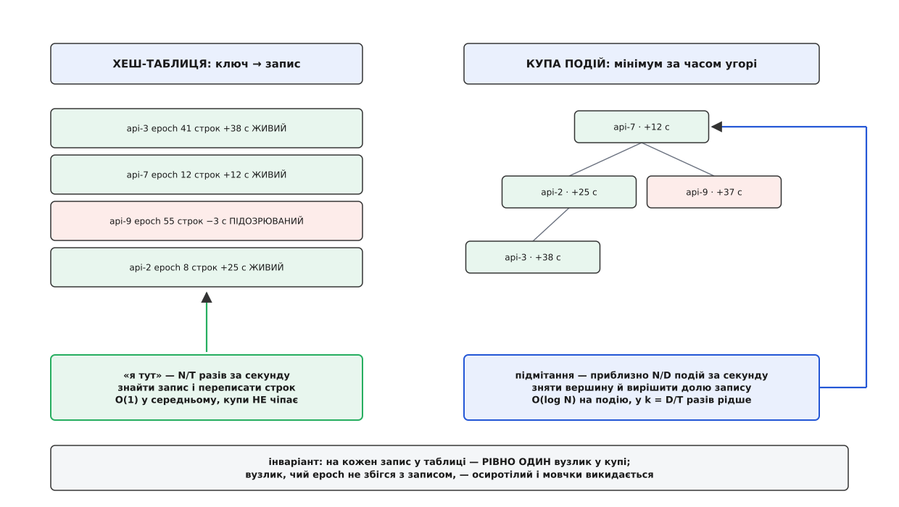

# ⚙️ Реєстр м'якого стану: робоча реалізація на C++

Ідея «запис живе, доки його оновлюють» уміщається в один рядок — переписати строк на `тепер + D`. Уся складність починається там, де цей рядок зустрічається з годинником, замком і структурою, яка мусить знайти протерміноване, не переглядаючи щоразу всю таблицю. Тут зібрано реєстр цілком: приймання «я тут» із номером покоління, витіснення без сканування, поріг недовіри до масового витікання і клієнт, що розмазує свій період. Кожне рішення підпирає число: скільки операцій за секунду, скільки байтів пам'яті, скільки мікросекунд під ексклюзивним замком.

<preknowlist>
- [Двійкова купа й черга за пріоритетом](book:algorithms/priority-queue) — структура, що віддає мінімум за `O(1)` і перебудовується за `O(log n)`; вилучити довільний елемент із середини вона не вміє, тому застарілі вузлики позначають і викидають на виході.
- [Монотонний проти настінного часу](book:programming/monotonic-vs-wall-time) — тривалості міряють годинником, який не стрибає й не синхронізується; настінний час придатний лише там, де значення треба порівнювати між різними процесами.
- [Багато читачів, один письменник](book:programming/readers-writer-lock) — замок, що пускає скільки завгодно читачів одночасно, але письменника лише самого; читання й запис у реєстрі різняться на два порядки за частотою, і це саме той випадок.
</preknowlist>

## Задача: числа, а не побажання

Реєстр обслуговує кластер зі ста тисяч вузлів: `N = 100 000`. Кожен вузол надсилає «я тут» кожні `T = 10` секунд, строк запису `D = 40` секунд. Звідси відразу випливає режим роботи, і він не симетричний:

```
приймання «я тут»      N / T = 100 000 / 10   = 10 000 разів за секунду
подій протермінування  порядку N / D          ≈ 2 500 разів за секунду
запити «хто живий»     від балансувальників   десятки тисяч за секунду
```

Гарячий шлях — приймання оновлень: він працює безперервно, і саме він визначає, скільки ядер з'їсть реєстр. Тому головний критерій для кожного рішення нижче формулюється однаково: **чи додає воно роботи на шляху, який виконується десять тисяч разів за секунду.**

До швидкості додаються три вимоги на поведінку. Строк мусить рахуватися так, щоб чужий зіпсований годинник не робив вузол безсмертним. Витіснення не має права раз на тик читати всі сто тисяч записів під замком. І реєстр мусить уміти не повірити самому собі, коли зі списку зникає забагато вузлів одразу — бо тоді ймовірніше зламався спостерігач, ніж усі спостережувані.

## Рішення перше: строк — це момент, а не тривалість

У записі зберігається не «скільки лишилося жити», а **момент смерті** — точка на монотонній осі приймача:

```
deadline = steady_clock::now() + D
```

Два наслідки, обидва важливі. По-перше, обробка «я тут» стає одним присвоєнням: не треба ні скидати таймер, ні перераховувати залишок. По-друге, момент рахує **приймач від миті отримання**, і жодне число з тіла повідомлення в цю арифметику не потрапляє — тож вузол, чий годинник поспішає на пів години, не дістає пів години безсмертя.

Годинник тут саме монотонний, і назвати його треба точно. У libstdc++ `std::chrono::steady_clock` реалізовано через `clock_gettime(CLOCK_MONOTONIC)` — джерело, яке ніколи не йде назад і не стрибає під час синхронізації часу. Настінний `system_clock` у цій ролі непридатний: один крок NTP назад на тридцять секунд подовжує життя всім записам одразу, крок уперед — ховає їх усіх.

## Рішення друге: прибирання не шукає, кого прибрати

Найпростіший варіант — раз на тик пройти таблицю й повикидати все, чий строк минув. Порахуймо його чесно, з тиком 100 мілісекунд і оптимістичною оцінкою 20 наносекунд на запис:

```
одне сканування   100 000 записів × 20 нс  = 2 мс
за секунду        10 сканувань × 2 мс      = 20 мс роботи
і всі 20 мс       — під ЕКСКЛЮЗИВНИМ замком: приймання «я тут» стоїть
```

Двадцять мілісекунд на секунду — це два відсотки ядра, витрачені на читання полів, що майже завжди не змінилися. Гірше інше: кожні дві мілісекунди повного простою прийому — це два десятки оновлень, які чекають, і кожне з них тим часом старішає. Механізм, що мав охороняти свіжість, сам стає джерелом затримки.

Тож замість шукати протерміноване перебором, тримаймо події в **черзі за пріоритетом** — двійковій купі, впорядкованій за моментом. Вершина завжди відповідає на питання «коли найближчий строк», і поки її момент попереду, робити нічого.

Лишається питання, що робить із купою оновлення. Наївно — штовхати новий вузлик щоразу: тоді купа росте як `N·D/T` вузликів, а на гарячий шлях лягає `O(log N)`. Замість цього тримаємо **рівно один вузлик на ключ** і не чіпаємо купу на оновленні взагалі. Вузлик спливає із застарілим моментом, дивиться в запис, бачить `deadline` у майбутньому — і штовхається назад із новим моментом. Виходить, що купу торкають не `N/T` разів за секунду, а `N/D`: у `k = D/T` разів рідше, тобто вчетверо в наших числах.


*Два шляхи розведено навмисно: частий і дешевий торкається однієї структури, рідкий і дорожчий — другої. Так вартість підмітання перестає залежати від того, скільки записів у таблиці, і починає залежати лише від того, скільки строків справді настало.*

Зв'язок між вузликом і записом тримається не вказівником, а парою «ключ + `epoch`». Вказівник спокушає: `std::unordered_map` — контейнер на вузлах, і посилання на елемент переживає перехешування. Але не переживає видалення, а видаляє тут саме підмітання. Тому вузлик несе `epoch` — номер вставки ключа в таблицю, — і якщо запис за цей час устиг зникнути й повернутися, номери розійдуться, і осиротілий вузлик мовчки викинеться.

## Рішення третє: протермінований — ще не стертий

Поріг недовіри звучить просто: не витісняти, якщо за вікно зникає понад половина записів. Реалізований у лоб, він **не спрацьовує жодного разу** — і причина варта окремої зупинки.

Хай реєстр стирає запис одразу, щойно строк минув. Тоді знаменник — розмір таблиці — зменшується разом із чисельником. Уся сотня тисяч вузлів замовкла одночасно? Їхні строки настають не разом, а розтягнуто приблизно на `T`, бо саме на `T` розкидані миті останніх оновлень. За кожен тик витікає малий відсоток, після стирання таблиця стає меншою рівно на цей відсоток, частка знову виглядає нормально — і так, тиками, реєстр спокійно ховає всіх. Поріг ні разу не зрушив.

Envoy не потрапляє в цю пастку, бо його знаменник приходить іззовні: перевірка здоров'я лише позначає вузли нездоровими, а вилучає їх зі складу кластера окремий механізм. Знаменник у нього не зникає разом із чисельником. У реєстрі, який сам собі і спостерігач, і склад, цю пам'ять треба зробити руками — і найдешевше це **третій стан запису**.

Протермінований запис не зникає з таблиці, а стає **підозрюваним**: він більше не «живий», його не віддають як робочу адресу, але в таблиці він лишається ще на пільговий строк. Тепер частка `живі / відомі` падає по-справжньому, бо знаменник пам'ятає нещодавно померлих. Пільга мусить бути довшою за розтяг витікання, тобто не меншою за `T`; брати її рівною `D` — простий і безпечний вибір.


*Підозрюваний стан — не ввічливість до мертвих, а технічна потреба: без нього поріг недовіри не має що ділити.*

Із цієї конструкції безкоштовно випливають дві приємні властивості. Явне «я йду» стирає запис навпростець і забирає одиницю **і з чисельника, і зі знаменника** — тому планова зупинка половини кластера не зрушує частку й не вводить реєстр у недовіру, тоді як мовчазне зникнення тієї самої половини вводить. І поки недовіра ввімкнена, реєстр може віддавати підозрюваних як адреси з позначкою «несвіжа»: у розбитому списку хоч якийсь адресат кращий за жодного.

## Реєстр: типи й гарячий шлях

```cpp
#include <atomic>
#include <chrono>
#include <cstdint>
#include <optional>
#include <queue>
#include <shared_mutex>
#include <string>
#include <unordered_map>
#include <vector>

using Clock     = std::chrono::steady_clock;
using TimePoint = Clock::time_point;
using Duration  = Clock::duration;
using Key       = std::string;

struct Payload {                 // те, заради чого запис існує
    std::string address;
    uint16_t    port = 0;
    uint32_t    load = 0;
};

struct Entry {
    Payload   payload;
    uint64_t  incarnation = 0;   // покоління відправника: зростає з кожним стартом процесу
    uint64_t  epoch       = 0;   // номер вставки в таблицю: відсіює осиротілі вузлики купи
    TimePoint deadline{};        // момент смерті, порахований ПРИЙМАЧЕМ
    TimePoint expired_at{};      // коли строк минув; має сенс лише для підозрюваних
    bool      live = true;
};

struct Event {                   // вузлик купи: рівно один на кожен запис
    TimePoint when;
    Key       key;
    uint64_t  epoch;
};

struct Later {                   // мінімум зверху
    bool operator()(const Event& a, const Event& b) const { return a.when > b.when; }
};

class Registry {
public:
    Registry(Duration lifetime, Duration grace, Duration hard_grace, unsigned panic_pct)
        : lifetime_(lifetime), grace_(grace), hard_grace_(hard_grace), panic_pct_(panic_pct) {}

    // ── ГАРЯЧИЙ ШЛЯХ: N/T разів за секунду. Купи не торкається.
    bool on_refresh(const Key& k, uint64_t incarnation, Payload p) {
        const TimePoint deadline = Clock::now() + lifetime_;   // строк рахує приймач

        std::unique_lock<std::shared_mutex> g(mu_);
        auto it = table_.find(k);
        if (it == table_.end()) {
            Entry e;
            e.payload     = std::move(p);
            e.incarnation = incarnation;
            e.epoch       = ++epoch_seq_;
            e.deadline    = deadline;
            table_.emplace(k, std::move(e));
            heap_.push(Event{deadline, k, epoch_seq_});        // єдиний дотик до купи
            ++live_;
            return true;
        }

        Entry& e = it->second;
        if (incarnation < e.incarnation) return false;         // луна минулого життя
        e.incarnation = incarnation;                           // нове втілення нічого не успадковує
        e.payload     = std::move(p);
        e.deadline    = deadline;                              // єдине, що робить оновлення
        if (!e.live) { e.live = true; ++live_; }               // підозрюваний повернувся
        return true;
    }

    struct View { Payload payload; bool fresh; };

    // ── Читання: під спільним замком, ЗАВЖДИ копією.
    std::optional<View> lookup(const Key& k) const {
        const TimePoint now = Clock::now();
        std::shared_lock<std::shared_mutex> g(mu_);
        auto it = table_.find(k);
        if (it == table_.end()) return std::nullopt;
        const bool fresh = it->second.deadline > now;
        if (!fresh && !panic_) return std::nullopt;            // строк минув, і ми собі віримо
        return View{it->second.payload, fresh};
    }

    // ── Явне «я йду»: підказка для швидкості, не несуча конструкція.
    void withdraw(const Key& k, uint64_t incarnation) {
        Entry corpse;                                          // оголошено ДО замка — див. sweep()
        std::unique_lock<std::shared_mutex> g(mu_);
        auto it = table_.find(k);
        if (it == table_.end() || incarnation < it->second.incarnation) return;
        if (it->second.live) --live_;
        corpse = std::move(it->second);
        table_.erase(it);
    }

private:
    mutable std::shared_mutex                              mu_;
    std::unordered_map<Key, Entry>                         table_;
    std::priority_queue<Event, std::vector<Event>, Later>  heap_;
    size_t   live_      = 0;      // скільки записів у таблиці зараз живі
    uint64_t epoch_seq_ = 0;
    bool     panic_     = false;
    const Duration lifetime_, grace_, hard_grace_;
    const unsigned panic_pct_;

    // ...sweep() нижче
};
```

Порядок оголошень у `withdraw` не випадковий: `corpse` створено **перед** `unique_lock`, тому руйнується вже після того, як замок відпущено. Це важить рівно тоді, коли вантаж великий або тягне за собою звільнення пам'яті: інакше кожне прощання тримає ексклюзивний замок ще й на час роботи деструктора.

## Підмітання і поріг недовіри

```cpp
    struct SweepStats { size_t expired = 0, reaped = 0, held = 0; bool panic = false; };

    SweepStats sweep(size_t budget = 4096) {
        const TimePoint now = Clock::now();
        std::vector<Entry> graveyard;      // ОГОЛОШЕНО ДО ЗАМКА: тіла руйнуються поза ним
        std::vector<Key>   reapable;
        SweepStats st;

        std::unique_lock<std::shared_mutex> g(mu_);

        // ── Фаза 1: розібрати всі події, чий час настав (не більше за бюджет).
        size_t handled = 0;
        while (!heap_.empty() && heap_.top().when <= now && handled < budget) {
            const Event ev = heap_.top();
            heap_.pop();
            ++handled;

            auto it = table_.find(ev.key);
            if (it == table_.end() || it->second.epoch != ev.epoch) continue;  // осиротілий вузлик
            Entry& e = it->second;

            if (e.deadline > now) {                       // запис оновили, поки вузлик чекав
                heap_.push(Event{e.deadline, ev.key, ev.epoch});
                continue;
            }
            if (e.live) {                                 // живий → підозрюваний
                e.live       = false;
                e.expired_at = now;
                --live_;
                ++st.expired;
                heap_.push(Event{now + grace_, ev.key, ev.epoch});
                continue;
            }
            reapable.push_back(ev.key);                   // підозрюваний, чия пільга минула
        }

        // ── Фаза 2: рішення ухвалюємо, побачивши весь тик цілком.
        panic_   = !table_.empty() &&
                   live_ * 100 < static_cast<size_t>(panic_pct_) * table_.size();
        st.panic = panic_;

        for (const Key& k : reapable) {
            auto it = table_.find(k);
            if (it == table_.end()) continue;
            const bool overdue = now - it->second.expired_at >= hard_grace_;
            if (panic_ && !overdue) {                     // не віримо масовому витіканню
                heap_.push(Event{now + grace_, k, it->second.epoch});
                ++st.held;
                continue;
            }
            graveyard.push_back(std::move(it->second));   // вантаж поїде з-під замка
            table_.erase(it);
            ++st.reaped;
        }
        return st;
    }
```

Дві фази тут не прикраса. Поріг рахують **після** того, як усі протермінування цього тика вже враховані в `live_`: інакше рішення ухвалювалося б за картиною попереднього тика й запізнювалося б рівно на найгіршому місці. А `hard_grace_` — запобіжник від протилежної біди: якщо кластер справді зменшився вдвічі назавжди, недовіра залишилася б увімкненою вічно, і реєстр вічно віддавав би мертві адреси. Підозрюваний, старший за `hard_grace_`, іде під ніж попри недовіру: брехня лишається обмеженою згори, як і має бути в м'якому стані.

Виклик `sweep()` ставлять на тик у секунду. Бюджет обмежує час під ексклюзивним замком: чотири тисячі подій із `O(log N)` кожна — це кількасот мікросекунд, і те, що не встигло, розбереться наступного тика.

## Клієнт: як не піти строєм

Клієнтська частина — три рядки логіки й одна пастка. Логіка: спати випадковий інтервал із `[0.5·T, 1.5·T]`, надсилати «я тут», повторювати. Середнє лишається рівним `T`, тож сумарний фон не змінюється — змінюється лише те, що вузли перестають синхронізуватися в пачку.

Пастка — у зерні генератора. Сотня контейнерів, яку оркестратор підняв в одну секунду, дістане з годинника однакове зерно, породить однакову послідовність «випадкових» пауз і піде строєм так само рівно, як без розкиду взагалі. Зерно має походити від **ідентичності** вузла, а не від моменту старту.

:::tabs
```cpp
#include <chrono>
#include <cstdint>
#include <functional>
#include <random>
#include <string>
#include <thread>

// Зерно — від імені вузла, а не від годинника.
uint64_t seed_from(const std::string& node_id) {
    uint64_t h = 1469598103934665603ull;                       // FNV-1a, 64 біти
    for (unsigned char c : node_id) { h ^= c; h *= 1099511628211ull; }
    return h;
}

class Heartbeat {
public:
    Heartbeat(std::chrono::milliseconds period, uint64_t seed)
        : period_(period), rng_(seed), spread_(0.5, 1.5) {}

    // Кожен інтервал тягнеться заново: сталий зсув фази теж рознесе вузли,
    // але не врятує від збігу з іншим періодичним процесом у системі.
    std::chrono::milliseconds next_interval() {
        const double f = spread_(rng_);
        return std::chrono::milliseconds(
            static_cast<long long>(period_.count() * f));
    }

    void run(const std::function<void()>& send) {
        std::this_thread::sleep_for(next_interval());          // перший інтервал теж випадковий
        for (;;) {
            send();
            std::this_thread::sleep_for(next_interval());
        }
    }

private:
    std::chrono::milliseconds             period_;
    std::mt19937_64                       rng_;
    std::uniform_real_distribution<double> spread_;
};
```
```go
package heartbeat

import (
	"context"
	"hash/fnv"
	"math/rand"
	"time"
)

// Зерно — від імені вузла, а не від годинника.
func seedFrom(nodeID string) int64 {
	h := fnv.New64a()
	_, _ = h.Write([]byte(nodeID))
	return int64(h.Sum64())
}

func nextInterval(period time.Duration, rng *rand.Rand) time.Duration {
	return time.Duration(float64(period) * (0.5 + rng.Float64())) // [0.5·T, 1.5·T]
}

// Ticker тут не годиться принципово: у нього період сталий, а нам потрібен
// новий випадковий інтервал щоразу. Тому Timer із явним Reset.
func Run(ctx context.Context, period time.Duration, nodeID string, send func()) {
	rng := rand.New(rand.NewSource(seedFrom(nodeID)))
	timer := time.NewTimer(nextInterval(period, rng)) // перший інтервал теж випадковий
	defer timer.Stop()

	for {
		select {
		case <-ctx.Done():
			return
		case <-timer.C:
			send()
			timer.Reset(nextInterval(period, rng))
		}
	}
}
```
:::

Номер покоління клієнт бере окремо — і саме тут доречний той годинник, який для строку не годився:

```cpp
// Покоління мусить строго зростати між стартами ОДНОГО вузла й порівнюватися
// в чужому процесі. Монотонний годинник тут безсилий: його нуль у кожного свій.
// Надійно — лічильник у власному сховищі; за його відсутности — мить старту
// за настінним годинником, із розумінням, що крок часу назад на завантаженні
// зламає монотонність.
uint64_t incarnation_at_start() {
    using namespace std::chrono;
    return static_cast<uint64_t>(
        duration_cast<nanoseconds>(system_clock::now().time_since_epoch()).count());
}
```

## Складність і скільки це коштує

```
операція              частота          вартість
«я тут»               10 000 / с       O(1) хеш + запис моменту; купа не зачеплена
пошук за ключем       скільки завгодно O(1) під СПІЛЬНИМ замком, читачі не заважають одне одному
подія в купі          ≈ 2 500 / с      O(log N) ≈ 17 порівнянь для N = 10⁵
підмітання за тик     1 / с            ≈ 2 500 подій × 17 ≈ 42 500 порівнянь — шум
пам'ять купи          —                рівно N вузликів; TimePoint 8 + std::string 32 + epoch 8 = 48 Б
                                       48 Б × 10⁵ ≈ 4.8 МБ (розмір рядка — libstdc++)
```

Поруч із лінійним скануванням різниця стає наочною: 42 500 порівнянь за секунду проти двох мільйонів прочитаних полів, і кількасот мікросекунд під ексклюзивним замком замість двадцяти мілісекунд.

Замок один — і саме він колись стане стелею, але не на цих числах. Десять тисяч письменників за секунду по кількасот наносекунд дають частку відсотка зайнятості, тож один `shared_mutex` тримає такий кластер із великим запасом. Коли частота підходить до мільйона за секунду, реєстр [шардять](book:programming/partitioning-sharding): `hash(key) % S` вибирає одну з `S` незалежних секцій зі своєю таблицею, купою й замком. Але поріг недовіри лишається глобальним — його чисельник і знаменник треба звести з усіх секцій. Два атомарні лічильники, які смикають усі потоки, мусять лежати в різних лініях кешу, інакше кожен інкремент відбиратиме лінію в сусіда ([хибне спільне використання](book:programming/false-sharing)).

Якщо `N` виростає так, що `O(log N)` на подію починає муляти, наступний крок — замінити купу на [колесо таймерів](book:algorithms/timer-wheel): строки й так квантовані тиком, тож замість упорядкування достатньо розкласти події по відрах за моментом і брати відро цілком за `O(1)`.

## Пастки

**Строк від позначки часу відправника.** Спокуса взяти `deadline` із тіла повідомлення виглядає ощадливою — відправник же знає, коли надіслав. Але тоді годинник кожного вузла стає частиною ваших гарантій: той, чий годинник поспішає на годину, дістає годину безсмертя, той, чий відстає, помирає одразу після реєстрації. Позначка часу відправника корисна лише для діагностики затримок, і саме так її й треба класти в повідомлення — окремим полем, яке ні на що не впливає.

**Не той монотонний годинник.** `CLOCK_MONOTONIC`, а з ним і `steady_clock` у libstdc++, [не рахує часу, поки система приспана](https://man7.org/linux/man-pages/man2/clock_gettime.2.html). Віртуалка, що простояла приспаною годину, прокинеться з усіма записами живими, хоча жодного оновлення за цю годину не надійшло. Чесна поведінка тут — витікання, і дає її `CLOCK_BOOTTIME`, який відрізняється від `CLOCK_MONOTONIC` рівно тим, що додає час приспання. Для реєстру, який може їхати у віртуалці або на ноутбуці розробника, варто загорнути `clock_gettime(CLOCK_BOOTTIME, …)` у власний тип годинника й підставити його замість `steady_clock`.

**Знаменник, що зникає разом із чисельником.** Головна пастка порога недовіри, розібрана вище: якщо стирати протерміноване одразу, частка живих ніколи не падає й поріг не спрацьовує жодного разу. Перевірка проста — напиши тест, у якому всі клієнти замовкають одночасно, і подивись, чи ввімкнулася недовіра. Якщо ні, знаменник у тебе фальшивий.

**Підмітання, що обходить увесь простір ключів під замком.** Навіть із купою легко повернутися до сканування: наприклад, порахувати `live_` не лічильником, а перебором таблиці на кожному тику. Лічильник дешевий, але вимагає дисципліни — його зсувають у чотирьох місцях: вставка, повернення підозрюваного, протермінування, явне прощання. Пропущене одне — і частка поїде назавжди в один бік: або недовіра ввімкнеться назавжди, або не ввімкнеться ніколи. У зневаджувальній збірці варто раз на хвилину перераховувати `live_` перебором і порівнювати з лічильником.

**Посилання, що переживає замок.** `lookup`, який повертає `const Payload&` або вказівник на елемент таблиці, компілюється й навіть працює — доки підмітання не зітре цей самий запис через наносекунду після виходу з-під замка. Стандарт дає спокусливу гарантію: посилання на елемент `unordered_map` переживає перехешування. Видалення воно не переживає, а видаляє тут фоновий потік. Тому назовні — тільки копія.

**Робота під ексклюзивним замком, яка там бути не мусить.** Деструктори вантажу, сповіщення підписників, запис у журнал — усе це легко опиняється всередині критичної секції. З деструкторами рятує `graveyard`, оголошений перед замком. Зі сповіщеннями — те саме правило: зібрати список подій під замком, розіслати після виходу. Виклик підписника з-під замка ще й дає готовий дедлок, щойно підписник у відповідь спробує зробити `lookup`: `shared_mutex` не рекурсивний, а письменник, що чекає, блокує нових читачів.

**Пачка клієнтів після перезапуску реєстру.** Реєстр піднявся з порожньою таблицею — і всі сто тисяч вузлів, помітивши це, реєструються майже одночасно. Далі вони йдуть строєм: пік `N` запитів раз на `T` замість рівних `N/T` за секунду. Лікує це розкид, але тільки якщо він накладений і на **перший** інтервал теж, а зерно взяте з ідентичності вузла. Симетричний бік — не влаштовувати сплеску й на боці клієнта: невдале «я тут» повторюють не негайно, а на наступному звичайному інтервалі, бо повторити його все одно доведеться ([гримуча отара](book:programming/thundering-herd)).

**Список для балансувальника, зібраний на кожен запит.** Обійти таблицю й скласти вектор живих адрес — `O(N)` під спільним замком; на десятках тисяч запитів за секунду це з'їдає більше, ніж уся решта реєстру. Список перебудовує підмітання, коли склад справді змінився, і кладе його як незмінний знімок; читач бере його одним атомарним читанням:

```cpp
// C++20. Читач не блокується взагалі, а знімок живе, доки на нього є посилання.
std::atomic<std::shared_ptr<const std::vector<Payload>>> snapshot_;

std::shared_ptr<const std::vector<Payload>> live_set() const { return snapshot_.load(); }
```
</content>
