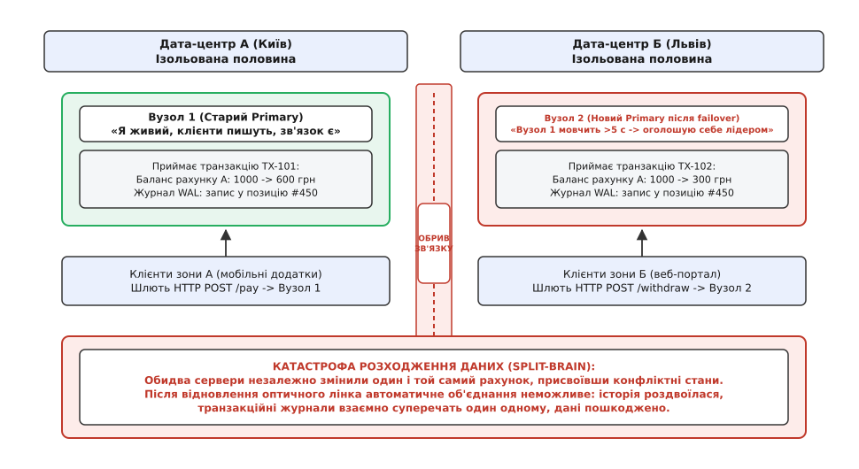
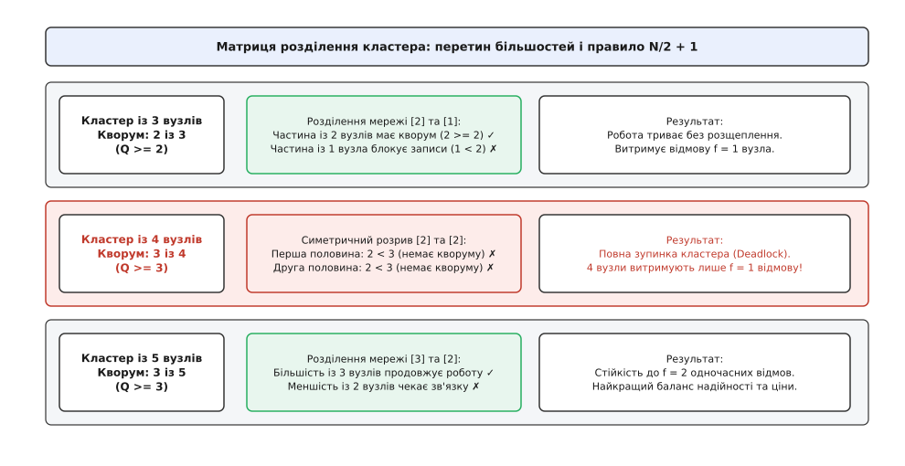
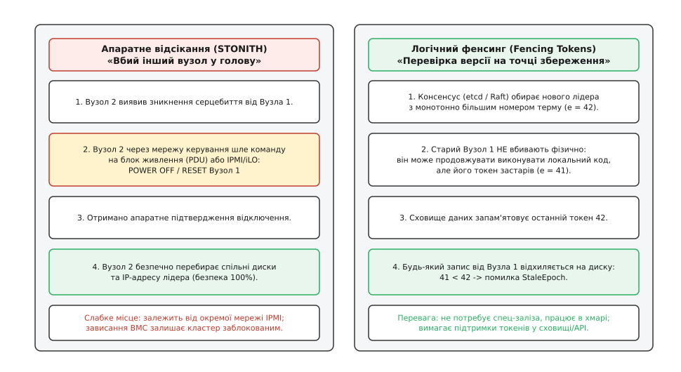
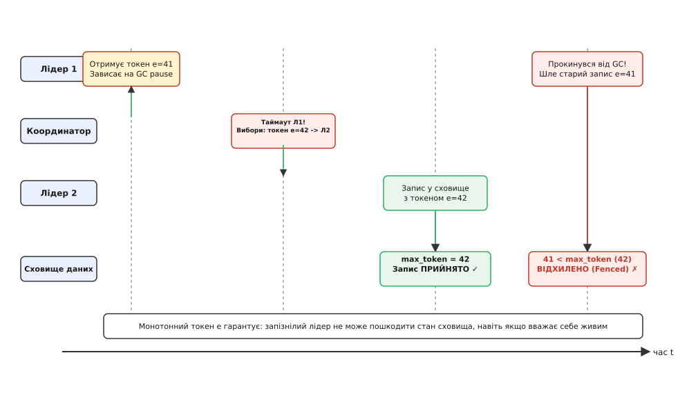
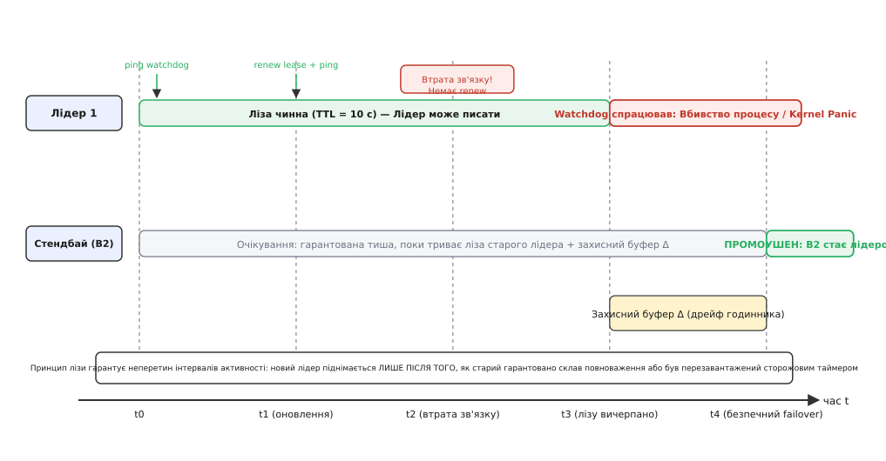

# Failover і розщеплення мозку

<preknowlist>
- [Омани розподілених обчислень](topic:programming/distributed-fallacies) — мережа затримує й губить пакети, а мовчання вузла не означає його фізичну смерть.
- [Лідер-фоловер реплікація](topic:programming/replication-leader-follower) — один вузол приймає записи і транслює журнал реплікам, які тримають копію стану.
- [Таймаути й бюджет часу](topic:programming/timeouts-deadlines) — чекання завжди обмежене строком, і завершення таймауту — це рішення, ухвалене за відсутності інформації.
- [Кворуми](topic:programming/quorum-and-leaderless) — перетин більшостей гарантує, що два несумісні рішення не зможуть одночасно зібрати необхідну кількість голосів.
</preknowlist>

Оптоволоконний кабель між дата-центрами в Києві та Львові розриває ківш екскаватора під час дорожніх робіт. У київському дата-центрі працює основний сервер бази даних (Primary), який щосекунди фіксує сотні платежів. У львівському дата-центрі стоїть резервний сервер (Standby), який щойно перестав отримувати контрольні пакети серцебиття від свого партнера.

Резервний сервер чекає п'ять секунд, фіксує таймаут і робить висновок: «Київський сервер загинув під час аварії; я зобов'язаний негайно перебрати роль лідера, щоб врятувати доступність системи». Він запускає процедуру автоматичного перемикання (англ. *failover*), оголошує себе новим господарем і відкриває локальний порт для прийому запитів від західноукраїнських клієнтів.

Тим часом київський сервер залишається повністю неушкодженим. Його процесор справний, диски працюють, а клієнти з центральних і східних регіонів продовжують надсилати йому грошові перекази. Від цієї секунди в системі діють два незалежні лідери, кожен із яких вважає себе єдиним законним джерелом правди.


*Розрив мережевого зв'язку перетворює два сервери на незалежні центри ухвалення рішень: обидва вузли приймають суперечливі модифікації стану, роблячи автоматичне об'єднання неможливим.*

Цей стан називають **розщепленням мозку** (англ. *split-brain*, від грец. *σχίζειν* — розколювати та англ. *brain* — мозок). Він є найнебезпечнішою формою аварії в розподілених системах, оскільки призводить не до простою, а до непомітного, тихого та незворотного руйнування цілісності даних.

## Анатомія омани: чому неможливо відрізнити повільність від смерті

Корінь проблеми розщеплення мозку лежить у фундаментальній властивості асинхронних комп'ютерних мереж: між відправником і отримувачем не існує верхньої гарантованої межі затримки доставки повідомлень.

Коли вузол `B` перестає отримувати повідомлення від вузла `A`, у нього є рівно чотири фізичні гіпотези щодо того, що сталося:
1. Вузол `A` справді знеструмлений або зазнав паніки ядра операційної системи (фізична смерть).
2. Вузол `A` живий, але заблокований тривалою паузою збирання сміття (англ. *Garbage Collection Stop-The-World*), очікуванням дискового введення-виведення або зависанням гіпервізора (глибокий сон).
3. Вузол `A` живий і активний, але мережевий комутатор між `A` та `B` скидає 100% пакетів через переповнення черг або обрив кабелю (мережева ізоляція).
4. Зв'язок розірвався асиметрично: вузол `A` чує вузол `B`, але `B` не чує `A`.

З погляду коду вузла `B` усі чотири ситуації проявляються абсолютно однаково: мовчанням сокета. Жоден протокол, заснований виключно на пасивному очікуванні повідомлень через мережу, не здатен математично довести фізичну смерть сусіда. Завершення таймауту — це не доказ відмови партнера, а суб'єктивне рішення спостерігача припинити очікування в умовах повної невизначеності.

Якщо на основі цього суб'єктивного рішення резервний вузол автоматично підвищує свій статус до лідера (англ. *promotion*), система створює умови для одночасного існування двох центрів координації.

## Різновиди мережевих розділень та їхня підступність

Мережеві збої рідко бувають простим і чистим розривом навпіл. У промислових мережах розділення проявляються у складніших і підступніших формах:

### 1. Повне симетричне розділення (Total Partition)
Кластер чітко розпадається на дві або більше ізольованих груп. Жоден пакет не проходить між групами, хоча всередині кожної групи зв'язок є ідеальним. Це класичний випадок обриву міжрегіонального магістрального каналу.

### 2. Асиметричне розділення (Asymmetric Partition)
Вузол `A` може надсилати пакети до вузла `B`, але зворотні пакети від `B` до `A` губляться (наприклад, через односпрямований збій оптоволоконного трансивера або помилку у правилах міжмережевого екрана iptables). У результаті вузол `A` вважає вузол `B` мертвим, тоді як `B` вважає `A` живим і справним.

### 3. Транзитивне розділення (Transitive / Non-Transitive Partition)
Вузол `A` бачить вузол `B`, вузол `B` бачить вузол `C`, але прямий зв'язок між `A` та `C` відсутній. Якщо протокол вимагає прямого повнозв'язного опитування (англ. *full mesh*), система потрапляє в стан хаосу, коли різні вузли формують несумісні картини доступності кластера.

### 4. Мерехтіння зв'язку (Flapping Link)
Канал зв'язку не вмирає остаточно, а періодично вмикається і вимикається кожні кілька секунд. Це спричиняє лавину постійних переобрань лідера (англ. *election storm*): сервери безперервно скидають кеші, передають ролі та перезапускають реплікацію, що призводить до повного колапсу пропускної здатності.

## Як руйнуються дані в різних архітектурах

Масштаб руйнувань під час розщеплення мозку залежить від типу архітектури зберігання:

### 1. Спільне дискове сховище (Shared-Disk / SAN)
У класичних кластерах високої доступності кілька серверів підключені до одного дискового масиву через інтерфейси Fibre Channel або iSCSI. На диску розгорнуто звичайну файлову систему (наприклад, Ext4 або XFS), яка розрахована на те, що кеш блоків у оперативній пам'яті контролюється єдиним ядром ОС.

Коли обидва сервери монтують файлову систему на запис одночасно, вони починають паралельно виділяти одні й ті самі дискові блоки під різні файли та перезаписувати таблиці інодів (англ. *inodes*). За лічені секунди файлова система перетворюється на кашу з переплутаних блоків, яку неможливо відновити жодною утилітою відновлення.

### 2. Реплікація зі спільним нічим (Shared-Nothing Databases)
У реляційних СУБД (PostgreSQL, MySQL) кожен вузол має власний локальний SSD і веде власний журнал випереджального запису (англ. *Write-Ahead Log, WAL*). Під час розщеплення обидва сервери приймають транзакції від різних клієнтів і присвоюють їм однакові порядкові номери LSN (англ. *Log Sequence Number*) та однакові автоінкрементні первинні ключі `id = 1042`.

Коли мережа відновлюється, бінарні журнали серверів виявляються несумісними: на сервері `A` запис `1042` відповідає замовленню на ноутбук, а на сервері `B` — замовленню на телефон. Автоматичне злиття таких журналів неможливе: будь-яка спроба накатити реплікацію викличе або відхилення транзакцій, або затирання одного замовлення іншим.

### 3. Оркестратори та розподілені планувальники (Kubernetes, Nomad)
Якщо розщеплюється шар керування (англ. *control plane*), два планувальники одночасно призначають робочі контейнери на одні й ті самі ресурси, видають однакові віртуальні IP-адреси різним сервісам і конкурують за монтування мережевих томів Ceph або EBS.

Ці катастрофи супроводжували індустрію впродовж десятиліть, спричиняючи багатогодинні збої світових платформ, детальний розбір яких наведено в [історії інцидентів розщеплення мозку](topic:programming/split-brain/hist-split-brain-disasters.md).

## Небезпека евристики «Останній запис перемагає» (Last-Write-Wins)

Спроба розв'язати розходження даних за допомогою простого порівняння міток часу (англ. *Last-Write-Wins, LWW*) є однією з найнебезпечніших архітектурних ілюзій.

Здавалося б, після відновлення зв'язку можна порівняти час транзакцій `timestamp` на обох серверах і залишити пізніший запис. Проте в розподіленій системі фізичні годинники серверів ніколи не йдуть ідеально синхронно. Навіть за використання демонів NTP або PTP дрейф годинників між дата-центрами становить від кількох мілісекунд до сотень мілісекунд під час стрибків навантаження.

Якщо сервер `A` відстає від сервера `B` на 50 мс, то правило LWW автоматично і беззастережно видалить усі операції, здійснені на сервері `A`, навіть якщо вони відбулися фізично пізніше. Ба більше, під час бізнес-операцій (наприклад, списання коштів з балансу або зміна пароля) перемога останнього запису знищує транзакційну цілісність, спричиняючи втрату оновлень (англ. *lost updates*) та порушення зовнішніх ключів.

## Застаріле читання: проблема фантомного лідера

Розщеплення мозку загрожує не лише операціям запису, а й операціям читання. Якщо ізольований старий лідер більше не може здійснювати записи, чи може він безпечно відповідати на запити читання з локальної пам'яті?

Відповідь — категоричне **ні**, якщо система вимагає лінеаризовності (англ. *linearizability*).

Припустімо, користувач змінив пароль на новому лідері у Львові. За секунду той самий користувач або зловмисник намагається увійти в систему через київський шлюз, який підключений до старого київського лідера. Якщо київський лідер поверне дані зі свого локального стану, він віддасть застарілий хеш пароля, дозволивши несанкціонований доступ.

Щоб запобігти застарілим читанням (англ. *stale reads*), сучасні протоколи консенсусу застосовують спеціальні техніки:
- **Підтвердження кворумом (ReadIndex у Raft):** перш ніж відповісти на запит читання, лідер зобов'язаний надіслати легковажний раунд серцебиття більшості вузлів і переконатися, що він досі є чинним лідером і не був зміщений новим термом.
- **Лізи на читання (Leader Lease Reads):** лідер обслуговує читання локально лише в межах гарантованого часового вікна лізи, узгодженого з більшістю учасників кластера.

## Перший захист: кворум і неподільна більшість

Найпростіший математичний спосіб запобігти розщепленню — заборонити вузлам ухвалювати будь-які рішення самостійно і вимагати згоди суворої більшості учасників кластера.

Нехай кластер складається з `N` вузлів. **Кворумом** називають мінімальну кількість голосів `Q`, необхідну для обрання нового лідера або фіксації транзакції. Кворум визначається правилом суворої більшості:

```
Q = ⌊N / 2⌋ + 1
```

Математична гарантія кворуму спирається на принцип Діріхле (перетин більшостей): будь-які дві підмножини розміром `Q` у множині з `N` елементів обов'язково мають щонайменше один спільний вузол:

```
Q₁ + Q₂ = (⌊N / 2⌋ + 1) + (⌊N / 2⌋ + 1) > N
```

Це означає, що як би мережевий розрив не розділив кластер на ізольовані частини, сувору більшість голосів може зібрати **щонайбільше одна** частина. Усі інші частини отримають менше ніж `Q` голосів і зобов'язані заблокувати операції запису.


*Перетин більшостей у кластерах різного розміру: кластери з непарною кількістю вузлів завжди зберігають дієздатну половину, тоді як парні кластери ризикують потрапити в симетричний тупик.*

### Пастка парної кількості вузлів
Поширена помилка проєктування — додавання четвертого сервера до тривузлового кластера «для підвищення надійності». Погляньмо на формулу:
- Для `N = 3`: кворум `Q = ⌊3/2⌋ + 1 = 2`. Кластер витримує відмову `f = 1` вузла (2 вузли, що залишилися, утворюють кворум).
- Для `N = 4`: кворум `Q = ⌊4/2⌋ + 1 = 3`. Кластер також витримує відмову лише `f = 1` вузла (якщо впадуть 2 вузли, залишок `2 < 3` не набере кворуму).

Ба більше, кластер із 4 вузлів має критичну вразливість: якщо мережа розірветься симетрично навпіл (2 вузли зліва і 2 вузли справа), жодна з половин не набере необхідних 3 голосів. Кластер повністю заморозить роботу. Четвертий вузол збільшив витрати на інфраструктуру, не додавши жодного відсотка до відмовостійкості, але створив умови для повного блокування системи.

Саме тому всі системи консенсусу (Raft, Paxos, etcd, ZooKeeper) вимагають **непарної кількості вузлів**: `2f + 1`, що дозволяє системі пережити відмову рівно `f` учасників.

### Вузол-свідок (Witness / Arbiter)
Якщо бізнес не має бюджету на три повноцінні сервери баз даних із дорогими дисковими масивами, третім учасником призначають легковажний вузол-арбітр (англ. *witness* або *arbiter*).

Свідок не зберігає копію бази даних і не обробляє запити користувачів. Його єдина функція — голосувати під час виборів лідера. Якщо зв'язок між двома основними дата-центрами розривається, арбітр, розміщений у третьому незалежному дата-центрі (або в хмарі), віддає свій голос тій половині, з якою зберіг зв'язок, дозволяючи їй набрати кворум 2 з 3.

## Другий захист: фізичне відсікання вузла (STONITH)

Кворум захищає від вибору двох лідерів усередині протоколу консенсусу, але він не захищає від старого лідера, який нічого не знає про нові вибори і продовжує писати на спільний диск.

Щоб запобігти цьому, у системній інженерії застосовують принцип активного відсікання (англ. *node fencing*), найрадикальнішою формою якого є **STONITH** (англ. *Shoot The Other Node In The Head* — «вистріли іншому вузлу в голову»).

Правило STONITH є категоричним: **новий лідер не має права виконати жодної операції запису або змонтувати диск доти, доки не отримає апаратного підтвердження того, що старий лідер фізично мертвий.**


*Два принципи безпеки: апаратний STONITH фізично знищує старий сервер через мережу живлення, тоді як логічний фенсинг блокує запізнілі операції на рівні сховища.*

### Реалізації апаратного відсікання:
1. **Керування живленням (Power Fencing):** резервний сервер через виділену мережу надсилає команду на інтелектуальний блок розподілу живлення стійки (PDU) або апаратний мікроконтролер материнської плати (IPMI, iLO, iDRAC) із вимогою розімкнути реле живлення старого сервера.
2. **Стійкі резервації SCSI-3 (Persistent Reservations):** на рівні дискового масиву SAN новий вузол реєструє свій ключ і виконує команду `PREEMPT_AND_ABORT`. Контролер сховища анулює реєстрацію старого вузла і скидає всі його незавершені транзакції в черзі. Будь-який наступний запис від старого сервера відхиляється апаратурою контролера диска.
3. **Мережевий фенсинг (Port Fencing):** відключення фізичного порту комутатора через запит по протоколу SNMP або блокування трафіку правилами трансляції BGP.

Детальне зіставлення цих технологій, їхніх затримок та вразливостей проведено в [порівнянні способів відсікання вузлів](topic:programming/split-brain/comp-fencing-mechanisms.md).

## Третій захист: логічний фенсинг і монотонні токени епохи

В умовах публічних хмар (AWS, Azure, Google Cloud) інженери не мають доступу до апаратного IPMI або розеткових блоків PDU. У віртуалізованому середовищі фізичне відсікання замінюють логічним захистом через **монотонні токени епохи** (англ. *fencing tokens*, *generation numbers* або *Raft terms*).

Механізм працює за принципом інверсії перевірки: замість того, щоб намагатися заглушити старого лідера, ми навчаємо кінцеве сховище відхиляти застарілі запити.


*Таймлайн фенсингового токена: стара епоха e=41 відкидається сховищем одразу після того, як новий лідер зафіксував вищу епоху e=42.*

### Покроковий алгоритм логічного фенсингу:
1. **Генерація токена:** Щоразу, коли сервіс консенсусу (наприклад, etcd або координатор ZooKeeper) обирає нового лідера, він видає йому унікальний числовий токен, який строго більший за всі попередні токени:
```
Token_{новий} = Token_{старий} + 1
```
2. **Супровід запитів:** Кожен запит на запис, який лідер надсилає до бази даних чи файлового сховища, обов'язково містить його поточний токен епохи: `WRITE(key, value, epoch)`.
3. **Атомарний бар'єр сховища:** Сховище даних запам'ятовує найвищий номер токена, який воно коли-небудь бачило (`max_seen_epoch`).
4. **Правило фільтрації:**
```
Якщо epoch < max_seen_epoch:
    ВІДХИЛИТИ запит з помилкою ERR_STALE_EPOCH
Інакше:
    max_seen_epoch = epoch
    ЗАСТОСУВАТИ запис у пам'ять/диск
```

Припустімо, лідер 1 отримав токен `epoch = 41` і завис на тривалій паузі збирання сміття. Кластер зафіксував таймаут і обрав лідера 2 з токеном `epoch = 42`. Лідер 2 успішно записав новий баланс у сховище, піднявши `max_seen_epoch` до `42`.

Коли лідер 1 прокидається після паузи, він нічого не знає про перевибори і намагається виконати свій відкладений запис із токеном `41`. Сховище порівнює `41 < 42` і миттєво повертає відмову. Жодного пошкодження даних не відбувається, що детально розібрано в [практичній реалізації сервера з фенсинговими токенами](topic:programming/split-brain/proj-fencing-tokens.md).

## Четвертий захист: лізи та сторожовий таймер ядра (Watchdog)

Якщо система не може супроводжувати кожен запис окремим токеном (наприклад, під час роботи зі звичайною файловою системою), розмежування обов'язків реалізують через обмежені в часі повноваження — **лізи** (англ. *leases*) у поєднанні зі сторожовим таймером операційної системи (англ. *watchdog*).

### Математика часової лізи
Лідер не обирається назавжди. Він отримує право керування лише на обмежений проміжок часу `T_lease` (наприклад, 10 секунд).

Щоб залишатися лідером, процес зобов'язаний періодично оновлювати лізу в координаторі кожні `T_renew` секунд (наприклад, кожні 3 секунди):

```
T_renew < T_lease
```

Якщо через мережевий обрив лідер не зміг оновити лізу до моменту вичерпання `T_lease`, він зобов'язаний **самостійно добровільно скласти повноваження** і зупинити будь-яке обслуговування клієнтів.

Резервний вузол починає процедуру виборів лише після того, як мине час:

```
t_failover ≥ t_last_heartbeat + T_lease + Δ_drift
```

де `Δ_drift` — максимальний можливий дрейф годинників між двома серверами. Завдяки цій затримці гарантується, що інтервали активності старого та нового лідерів ніколи не перетинаються в часі.


*Інтервали безпеки лізи: резервний вузол чекає повного вичерпання часу лізи старого лідера плюс захисний буфер дрейфу годинника, унеможливлюючи одночасну роботу двох господарів.*

### Запобігання зависанню процесу через `/dev/watchdog`
Але що робити, якщо процес лідера завис на системному виклику всередині ядра і не може виконати код складання повноважень?

Для цього застосовують сторожовий таймер операційної системи Linux: символьний пристрій `/dev/watchdog` (модуль ядра `softdog` або апаратний чип на серверній платі).

Процес лідера відкриває пристрій і зобов'язується щосекунди надсилати в нього сигнал (англ. *petting the dog*). Якщо процес зависає або втрачає зв'язок із координатором, оновлення припиняється. Через чітко визначений інтервал сторожовий таймер ядра апаратно генерує Kernel Panic або скидає живлення процесора (RESET). Сервер гарантовано вбиває сам себе до того, як закінчиться термін дії його лізи в координаторі.

## Реальні архітектурні втілення у промислових системах

Погляньмо, як описані принципи поєднуються в сучасних відмовостійких сховищах:

### 1. PostgreSQL Patroni
Менеджер високої доступності Patroni запускається поруч із кожним екземпляром PostgreSQL. Patroni обирає лідера шляхом створення тимчасового ключа-лізи в розподіленому сховищі etcd або Consul (наприклад, із TTL 10 секунд).
- Поки лідер живий, Patroni кожні 2 секунди оновлює ключ в etcd і записує сигнал у пристрій `/dev/watchdog`.
- Якщо зв'язок з etcd втрачається, Patroni не може оновити ключ. Він припиняє пінгувати watchdog і викликає функцію демоушену `pg_ctl demote`, переводячи базу в `READ ONLY`.
- Якщо процес Patroni завис у пам'яті, таймер `/dev/watchdog` вичерпується через 5 секунд і ядро Linux миттєво перезавантажує сервер, гарантуючи звільнення ресурсів до того, як стендбай в etcd підніме новий екземпляр PostgreSQL.

### 2. Ceph OSD Peering та Epoch Maps
У розподіленому сховищі Ceph стан кластера описується монотонно зростаючою картою епох `OSDMap`.
- Коли вузол-демон OSD втрачає зв'язок із моніторами Ceph, монітори випускають нову епоху `epoch = e + 1`, у якій цей OSD позначається як відключений (`down / out`).
- Кожен клієнтський запит на читання чи запис несе номер поточної епохи клієнта.
- Якщо старий OSD намагається обробити запис із застарілою епохою, інші OSD у групі розміщення (англ. *Placement Group, PG*) негайно відкидають його повідомлення під час пірінгу (`peering`), унеможливлюючи пошкодження реплікованих об'єктів.

### 3. MongoDB Replica Sets
У MongoDB реплікаційна група спирається на протокол консенсусу, подібний до Raft.
- Щоб запобігти запису на старому первинному вузлі, клієнти використовують рівень гарантії запису `w: majority`.
- Запис вважається підтвердженим клієнту лише після того, як його зберегла більшість реплік.
- Якщо мережеве розділення ізолює первинний вузол у меншості, він може приймати локальні записи, але ніколи не зможе підтвердити їх клієнту, оскільки не набере більшості підтверджень. Коли зв'язок відновлюється і вузол бачить нового лідера, він відкочує всі непідтверджені операції в окремі файли відкату (англ. *rollback files*).

## Асиметричні розриви та фаза Pre-Vote

Класичні алгоритми виборів передбачають, що коли вузол втрачає зв'язок із лідером, він збільшує свій лічильник терму (`term = term + 1`) і розсилає всім сусідам повідомлення `RequestVote`.

Проте в реальних мережах часто виникають **асиметричні розділення**: наприклад, мережевий кабель відійшов так, що вузол `C` не отримує пакетів від лідера `A`, але інші вузли чудово бачать і `A`, і `C`.

У такій ситуації ізольований вузол `C` кожні кілька секунд фіксуватиме таймаут, нескінченно збільшуватиме свій номер терму (`term = 50, 51, 52...`) і спамитиме кластер запитами на голосування. Коли зв'язок відновлюється, пакет від вузла `C` із гігантським номером терму змушує легітимного лідера `A` миттєво скласти повноваження, викликаючи непотрібні каскадні вибори та зупинку обробки запитів.

Для захисту від цієї аномалії в алгоритм Raft було введено фазу **попереднього голосування** (англ. *Pre-Vote phase*):
1. Перш ніж збільшити свій терм і почати офіційні вибори, вузол розсилає легковажний запит `PreVote(term + 1)`.
2. Сусідні вузли погоджуються підтримати кандидата лише за двох умов:
   - журнал кандидата є достатньо свіжим;
   - самі вони дійсно зафіксували втрату серцебиття від чинного лідера за власним таймаутом.
3. Якщо більшість вузлів відповіла «Лідер живий, ми його чуємо», вузол `C` розуміє, що проблема локальна на його боці, і не збільшує номер терму, зберігаючи стабільність кластера.

## Що робити, якщо розщеплення вже сталося

Якщо через помилку конфігурації або відсутність фенсингу розщеплення мозку все ж відбулося, і обидва сервери вели паралельний запис у базу даних протягом години, автоматичного виходу з цієї ситуації не існує.

Процедура ліквідації наслідків розщеплення вимагає ручного втручання чергового адміністратора баз даних (DBA):
1. **Негайна ізоляція:** Один із серверів (зазвичай той, де було здійснено менше транзакцій або зафіксовано пізніші помилки) негайно переводиться в режим `READ ONLY` або вимикається.
2. **Аналіз розбіжностей журналів (Split Diff):** Спеціалізовані утиліти вичитують бінарні логи обох серверів від точки розходження (англ. *fork point*), знаходячи всі транзакції, зафіксовані в ізольованих гілках.
3. **Компенсаційні транзакції:** Бізнес-логіка поштучно розбирає кожен конфліктний рядок. Якщо один користувач встиг двічі зняти залишок на різних вузлах, створюється коригувальне списання та генерується сповіщення для фінансового відділу.
4. **Повна реініціалізація репліки:** Скомпрометований вузол повністю очищається, створюється свіжий знімок (англ. *snapshot*) із обраного основного сервера, і реплікація налаштовується наново з нуля.

Ціна відновлення після розщеплення вимірюється не хвилинами простою, а днями ручної праці та репутаційними збитками, що підкреслює критичну важливість автоматичних превентивних бар'єрів.

> 🔧 **Навіщо це.** Автоматичний failover без кворуму та фенсингу створює ілюзію надійності, яка розбивається під час першої ж нештатної мережевої затримки. Якщо ваша система не має третього вузла-арбітра або механізму відсікання старих епох, безпечніше взагалі відмовитися від автоматичного перемикання і вимагати підтвердження від чергового інженера, ніж ризикувати тихим пошкодженням бази даних.

## Чотири оборонні стіни проти розщеплення

Стійкість розподіленої системи досягається багаторівневою обороною (англ. *defense-in-depth*), де кожен наступний шар страхує попередній:

```
[ Кворум більшості (N/2 + 1) ] 
       ↓ (захищає процес обрання лідера)
[ Часова ліза + Watchdog ядра ] 
       ↓ (змушує старого лідера самознищитися під час тиші)
[ Апаратний STONITH / SCSI-3 PR ] 
       ↓ (фізично блокує доступ до накопичувачів перед failover)
[ Монотонні фенсингові токени (Epoch) ]
         (відхиляє запізнілі пакети на точці збереження даних)
```

1. **Кворум `N/2 + 1`** унеможливлює вибір двох лідерів у межах протоколу.
2. **Лізи та сторожовий таймер `/dev/watchdog`** змушують завислий сервер гарантовано перезавантажитися до моменту передачі повноважень.
3. **Апаратний STONITH або SCSI-3 PR** фізично блокує дискові шини старого сервера перед початком роботи нового господаря.
4. **Монотонні токени епохи** захищають сховище від запізнілих пакетів у мережі, перетворюючи відсікання на математично доведений інваріант.
