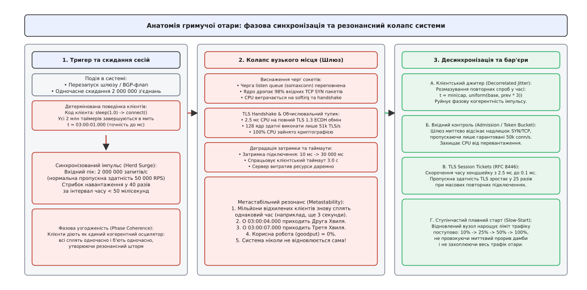
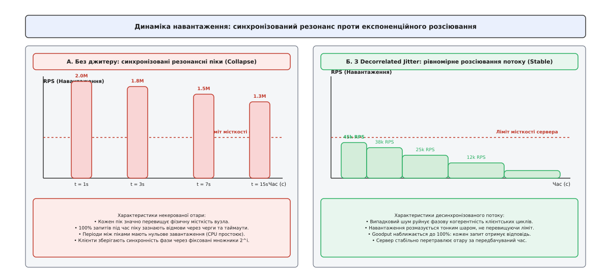
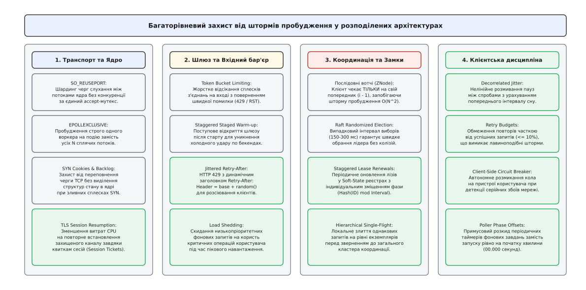

# Гримуча отара на масштабі: анатомія синхронізації, шторми пробудження та десинхронізація систем

<preknowlist>
- [Розподілені замки й лізи](topic:programming/distributed-locks) — протоколи взаємного виключення, оренда та стан гонитви.
- [Повтори та відступання](topic:programming/retries-backoff) — експоненційне затримання, джитер та уникнення резонансу.
- [Запобіжник (Circuit Breaker)](topic:programming/circuit-breaker-pattern) — розмикання контурів при деградації залежностей.
- [Таймаути і бюджет часу](topic:programming/timeouts-deadlines) — каскадні затримки та запобігання вичерпанню черг.
- [Вхідний контроль (Admission Control)](topic:programming/admission-control) — обмеження швидкості та відсікання надлишкового вхідного потоку.
- [Метастабільні відмови](topic:programming/metastable-failures) — стійкі режими перевантаження та замкнені петлі самопідсилення відмов.
</preknowlist>

Рівно о 03:00:00 UTC хмарний балансувальник навантаження завершує плановий перезапуск пулу з п'ятдесяти екземплярів вхідного API-шлюзу. До моменту перезапуску ці шлюзи утримували два мільйони постійних TLS-з'єднань від мобільних клієнтів та пристроїв інтернету речей. Під час перезапуску всі два мільйони TCP-сесій обриваються протягом ста мілісекунд.

Клієнтські застосунки, запрограмовані на детерміновану реакцію при втраті зв'язку, запускають стандартний таймер очікування: рівно одна секунда паузи перед повторною спробою підключення. 

Рівно о 03:00:01.000 два мільйони пристроїв одночасно ініціюють TCP-рукостискання та запит на встановлення криптографічної сесії TLS 1.3.

Кожен повний обмін ключами TLS з ефемерним алгоритмом Діффі — Геллмана (ECDHE) та перевіркою сертифікатів вимагає в середньому 2.5 мілісекунди чистого процесорного часу одного ядра. Сумарна обчислювальна потужність усього кластера шлюзів зі ста двадцяти восьми ядер здатна виконати не більше ніж:

```
RPS_max = 128 / 0.0025 = 51 200 хендшейків/с
```

Миттєвий вхідний потік у два мільйони з'єднань перевищує пікову місткість кластера у сорок разів. Системна черга очікування нових з'єднань у ядрі (`somaxconn = 4096`) переповнюється за дві мілісекунди. Ядро операційної системи починає масово відкидати вхідні пакети TCP SYN. 

У мобільних застосунках спрацьовує клієнтський таймаут очікування відповіді (три секунди), і вони автоматично планують наступну спробу рівно через три секунди. О 03:00:04.000 на кластер накочується друга синхронізована хвиля з двох мільйонів запитів, за нею о 03:00:07.000 — третя. 

Система потрапляє у стан метастабільної відмови: процесори завантажені на 100%, корисна пропускна здатність наближається до нуля, а мільйони клієнтів діють як єдиний когерентний осцилятор, методично руйнуючи будь-яку спробу сервісу відновити нормальну роботу.

Ця фундаментальна катастрофа координації у розподілених обчисленнях має назву **гримуча отара** (англ. *thundering herd problem*, від образу зляканого стада бізонів, чий одночасний тупіт стрясає землю), або **шторм пробудження**.


*Анатомія гримучої отари: фазова синхронізація мільйонів клієнтів створює імпульсне перевантаження шлюзу, виснажуючи черги сокетів та приводячи систему до метастабільної відмови.*

Шлях подолання цієї проблеми — від оптимізації сокетів у монолітних ядрах BSD UNIX 1980-х років до глобальних хмарних штормів — детально розкрито в нарисі про [історію еволюції проблеми гримучої отари від сокетів BSD до хмарного масштабу](topic:programming/thundering-herd/hist-thundering-herd-evolution.md).

## Фізика та таксономія явища: чому виникає резонанс

Гримуча отара виникає там, де виконуються чотири фундаментальні умови:

1. **Спільна точка спостереження або подія-тригер:** Велика кількість незалежних агентів (потоків, процесів, мікросервісів, клієнтських додатків) одночасно фіксують зміну глобального стану системи (обрив з'єднання, вивільнення блокування, настання часової мітки на годиннику, скидання кешу).
2. **Детермінована функція затримки:** Усі агенти використовують однакові статичні часові інтервали або передбачувані формули реакції (`sleep(T)`, `2ᵏ`), що призводить до збереження однакового фазового зсуву між ними.
3. **Висока точність синхронізації часу:** Завдяки протоколам синхронізації годинників (NTP, PTP) розкид фізичного часу між вузлами становить мілісекунди або мікросекунди, що перетворює незалежні дії на єдиний зливний фронт навантаження.
4. **Асиметрія між здатністю обробки та кількістю претендентів:** Ресурс, за який змагаються агенти (процесор для TLS, пул з'єднань СУБД, лідерство в кластері, черга ядра), може одночасно задовольнити лише одного або незначну частку претендентів (`K ≪ N`).

У сучасних хмарних та розподілених архітектурах гримуча отара проявляється у чотирьох виразних формах:

### 1. Шторми масового перепідключення (Reconnect Storms)
Коли централізований компонент зв'язку (API-шлюз, брокер повідомлень, сервер WebPush, кластер VPN) перезапускається або відновлюється після короткочасного мережевого розриву (BGP-флап), мільйони клієнтів одночасно намагаються відновити транспортний рівень. 

Основний удар припадає на механізми автентифікації, перевірку OAuth/JWT-токенів у базах даних сесій та криптографічні обчислення TLS, що призводить до виснаження ресурсів ще до передачі першого корисного байту бізнес-даних.

### 2. Синхронізація періодичних процесів та Cron-шторми (Timer Alignment)
Фонові завдання, мікросервіси та агенти збору метрик традиційно налаштовуються на виконання з фіксованими інтервалами: «кожні шістдесят секунд» або «на початку кожної години» (`00 * * * *`).

Оскільки тисячі серверів о 12:00:00.000 одночасно запускають важкі аналітичні запити, вивантаження звітів або пінг реєстру сервісів ([soft-state](topic:programming/soft-state)), навантаження на мережу та бази даних набуває вигляду регулярного поїзда дельта-імпульсів величезної амплітуди, між якими ресурси простоюють.

### 3. Шторм виборів лідера та вивільнення замків (Consensus & Lock Storms)
У розподілених системах координації (ZooKeeper, etcd, Consul) наївна реалізація блокувань полягає в тому, що всі претенденти підписуються на подію видалення єдиного ключа блокування.

Коли поточний лідер втрачає ліз або відпускає замок ([розподілені замки](topic:programming/distributed-locks)), система координації надсилає сповіщення (Watch Event) усім тисячам вузлів-претендентів. 

Усі тисячі кандидатів одночасно посилають запити на створення нового вузла або оновлення запису, генеруючи квадратичний обсяг мережевого трафіку `O(N²)`, перевантажуючи кворум консенсусу (Raft або Paxos) та сповільнюючи сам процес виборів нового лідера.

### 4. Холодний старт та шторм промахів (Cold-Start Storms)
Після повного відключення дата-центру або скидання шарду кешу первинні сервіси піднімаються з «холодним» станом (порожні оперативні буфери, відсутність скомпільованого JIT-коду, порожні пули підключень). 

Якщо в цей момент відкрити шлюз для клієнтського трафіку, перший же сплеск запитів миттєво доведе час відгуку до таймаутів, сервіси захлинуться, а клієнти розпочнуть шторм повторів, не давши бекенду жодного шансу прогрітися.

## Математичний механізм фазової когерентності

Спонтанна синхронізація розподілених повторних спроб описується математичною моделлю фазових осциляторів (аналог моделі Курамото). Коли незалежні агенти проходять через спільний бар'єр помилки, їхні внутрішні фази скидаються до спільної точки відліку `t = 0`.

Нехай:
- `N` — загальна кількість клієнтів, що намагаються виконати дію;
- `C` — гарантована пропускна здатність цільового сервісу (запитів/с);
- `Δt` — часове вікно розсіювання запитів, зумовлене природним джитером мережевої затримки (зазвичай `Δt ∈ [0.01, 0.05]` с);
- `t[k]` — інтервал очікування перед `k`-ю спробою.

При застосуванні детермінованого експоненційного затримання без випадкового шуму час `k`-ї спроби для всіх клієнтів дорівнює:

```
t[k] = base · 2ᵏ
```

Миттєва швидкість надходження запитів під час `k`-го піку становить:

```
λ_peak = N / Δt
```

Якщо `N = 500 000`, а `Δt = 0.02 с`, то:

```
λ_peak
= 500 000 / 0.02
= 25 000 000 запитів/с      [перевищення пропускної здатності у сотні разів]
```

Оскільки черги можуть вмістити лише `C · Δt` запитів, частка клієнтів `P_fail`, які гарантовано зазнають невдачі, виражається співвідношенням:

```
P_fail
= (N - (C · Δt)) / N    [частка відхилених запитів від загальної кількості]
= 1 - (C · Δt / N)      [почленне ділення на N]
```

При великому `N` величина `(C · Δt / N) → 0`, отже `P_fail → 1`. Майже всі клієнти одночасно фіксують помилку і синхронно переходять до наступного кроку `k + 1`, зберігаючи фазову когерентність.

Строге математичне виведення взаємозв'язку між шириною вікна, ймовірністю колізій та числовими характеристиками дисперсії наведено у вставці про [математичне виведення імовірності колізій, теорії фазової синхронізації та порівняння дисперсії джитерів](topic:programming/thundering-herd/math-jitter-and-synchronization.md).

## Десинхронізація: таксономія та вибір алгоритмів джитеру

Єдиним фундаментальним засобом руйнування фазової когерентності є штучне внесення ентропії (випадкового шуму) у часові інтервали. Цей підхід зветься **джитером** (англ. *jitter*, «тремтіння, розкид»).


*Динаміка навантаження: детерміновані повтори утворюють руйнівні періодичні сплески, тоді як Decorrelated Jitter розмазує запити тонким шаром, утримуючи трафік нижче ліміту місткості.*

Існує три основні інженерні стратегії формування джитеру:

### 1. Повний джитер (Full Jitter)
Обчислює класичну експоненційну межу `T_max[k] = min(Cap, Base · 2ᵏ)` і обирає випадкову точку рівномірно на всьому інтервалі від нуля до цієї стелі:

```
t_sleep = uniform(0, min(Cap, Base · 2ᵏ))
```

- **Переваги:** Забезпечує максимальне розсіювання запитів у часі та мінімізує пікове навантаження на сервер.
- **Сфера застосування:** Стандарт для прикладних HTTP/gRPC викликів та повторів ідемпотентних транзакцій.

### 2. Рівний джитер (Equal Jitter)
Зберігає половину часу затримки фіксованою, а випадковий шум додає до другої половини:

```
half = min(Cap, Base · 2ᵏ) / 2
t_sleep = half + uniform(0, half)
```

- **Переваги:** Гарантує, що клієнт ніколи не виконає спробу надто рано, зберігаючи монотонне зростання мінімального часу очікування.
- **Сфера застосування:** Сценарії, де надто ранній повтор гарантовано безглуздий (наприклад, тривале оновлення глобального сертифіката).

### 3. Декорельований джитер (Decorrelated Jitter)
Повністю відмовляється від прив'язки до номера спроби `k` та початкового моменту аварії. Кожна наступна пауза обчислюється на основі попередньої фактичної паузи:

```
t_sleep = min(Cap, uniform(Base, prev_sleep · 3))
```

- **Переваги:** Руйнує будь-які внутрішні кореляції між групами клієнтів. Навіть якщо тисяча пристроїв випадково обрали однаковий інтервал на першому кроці, на другому кроці їхні шляхи розходяться експоненційно.
- **Сфера застосування:** Протоколи довготривалого перепідключення (MQTT, WebSocket, мобільні пуш-клієнти).

### Джитер для періодичних фонових завдань (Cron & Polling Jitter)
Для ліквідації штормів «початку хвилини» застосовують детермінований фазовий зсув на основі стабільного ідентифікатора вузла:

```
phase_offset = hash(node_id) mod interval
next_run_time = round_to_interval(now) + phase_offset + uniform(-jitter, +jitter)
```

Це рівномірно розмазує виконання періодичних операцій по всій ширині часового вікна, перетворюючи пікові імпульси на плоский стабільний потік.

## Багаторівневий архітектурний захист (Defense in Depth)

Надійний захист від гримучої отари неможливо побудувати на одному рівні: система повинна містити захисні бар'єри на кожному етапі проходження сигналу.


*Багаторівнева матриця захисту: від сокет-шардингу в ядрі до вхідного контролю шлюзу, протоколів консенсусу та клієнтського джитеру.*

### Рівень 1: Транспортний стек та Ядро ОС
- **`SO_REUSEPORT`:** Розподіл вхідних черг сокетів між незалежними потоками обробки з апаратно-хешованою маршрутизацією пакетів на рівні ядра, що ліквідує конкуренцію за єдиний accept-мутекс.
- **`EPOLLEXCLUSIVE`:** Примушує ядро будити строго один воркер у `epoll_wait()` під час надходження події нового підключення.
- **TLS Session Tickets (RFC 8446):** Збереження зашифрованого стану сесії на боці клієнта дозволяє відновити захищене з'єднання (Abbreviated Handshake) за один RTT без виконання важких асиметричних криптографічних розрахунків, знижуючи навантаження на CPU шлюзу у 25 разів.

### Рівень 2: Вхідний шлюз та Admission Control
- **Швидке скидання з'єднань (Connection Token Bucket):** Якщо інтенсивність відкриття нових сокетів перевищує допустимий поріг, шлюз миттєво відкидає надлишок на рівні TCP RST або повертає HTTP 429 з динамічним рандомізованим заголовком `Retry-After: 5 + rand(5)`.
- **Плавний ступінчастий старт (Slow-Start / Warm-Up):** Після перезапуску екземпляра сервісу балансувальник трафіку підключає його поступово (пропускаючи спочатку 5% трафіку, через хвилину — 20%, потім 50% і лише після повного прогріву кешів — 100%).

### Рівень 3: Розподілена координація та Консенсус
- **Послідовні вотчі (Predecessor-only Watches):** У ZooKeeper та etcd клієнти створюють послідовні ефемерні вузли (`lock-0001`, `lock-0002`, `lock-0003`). Вузол `lock-0003` ставить підписку (Watch) **виключно на `lock-0002`**, а не на спільну кореневу директорію. При звільненні замка прокидається рівно один наступний кандидат: складність перемикання становить `O(1)` замість `O(N)`.
- **Рандомізовані таймаути виборів (Raft Election Jitter):** Протокол Raft призначає кожному кандидату випадковий таймаут очікування серцебиття (наприклад, у діапазоні 150–300 мс). Це гарантує, що лише один вузол першим заявить права на лідерство, унеможливлюючи розкол голосів ([вибори лідера](topic:programming/leader-election)).

### Рівень 4: Клієнтська дисципліна та Бюджети
- **Бюджет повторів (Retry Budget):** Клієнтська бібліотека веде кільцевий буфер успішних операцій. Повторні запити дозволені лише за умови, що їхня загальна кількість не перевищує 10% від загального потоку успішних викликів. Якщо бекенд упав, бюджет повторів миттєво вичерпується, і клієнт припиняє штурмувати систему.
- **Клієнтський запобіжник (Client-side Circuit Breaker):** При серії послідовних невдач мобільний застосунок локально розмикає ланцюг і повністю припиняє мережеві спроби на кілька хвилин, відображаючи користувачеві кешований або офлайн-стан.

Повний комплект робочого коду клієнтського пулу з алгоритмом Decorrelated Jitter та багатопотокового сервера на базі `SO_REUSEPORT` наведено у вставці з [інженерною реалізацією клієнтського пулу з Decorrelated Jitter та серверного шлюзу на базі SO_REUSEPORT](topic:programming/thundering-herd/proj-herd-defense.md).

Специфікації конфігураційних параметрів для Envoy, Nginx та системних змінних ядра Linux викладено в [довіднику конфігурацій та параметрів захисту від штормів у ядрі, проксі Envoy та клієнтських протоколах](topic:programming/thundering-herd/api-herd-mitigation.md).

> 🔧 **Навіщо це.**
> У реальній практиці експлуатації хмарних систем 80% випадків «загадкових» падінь після швидкого відновлення спричинені саме некерованою гримучою отарою. Без впровадження джитеру та сокет-шардингу система після будь-якого секундного збою автоматично переходить у самопідтримувану метастабільну кому, вимагаючи примусового ручного відключення всього вхідного трафіку для «холодного» перезапуску.

## Антипатерни та діагностика

Під час проектування та аудиту систем слід уникати трьох поширених помилок:

1. **Статичний заголовок `Retry-After`:** Повернення фіксованого значення (наприклад, `Retry-After: 10`) у відповідях HTTP 429 перетворює вхідний контроль на фазовий синхронізатор: рівно через 10 секунд відхилена тисяча клієнтів вдарить по системі одночасно. Заголовок `Retry-After` обов'язково повинен містити випадковий джитер на боці сервера.
2. **Тотальне скидання кешу під час релізу (Global Flush):** Очищення всього шару кешування під час розгортання нової версії коду миттєво спрямовує 100% клієнтського навантаження на первинні бази даних. Замість цього слід застосовувати версіонування ключів або поступову інвалідацію.
3. **Синхронні перевірки працездатності (Health Checks):** Якщо оркестратор (Kubernetes) опитує тисячу подів з фіксованим інтервалом `periodSeconds: 5`, зонди перевірки готовності синхронізуються, створюючи періодичні сплески навантаження на внутрішню мережу кластера.

### Метрики та спостережуваність

Для раннього виявлення гримучої отари використовують такі діагностичні показники:

- **Коефіцієнт піковості (Crest Factor):** Співвідношення між 99-м перцентилем навантаження та середнім значенням: `Crest = P99_RPS / Mean_RPS`. Якщо значення перевищує `5.0`, у системі присутня виражена фазова синхронізація запитів.
- **Спектральний аналіз частот трафіку (FFT):** Перетворення Фур'є над часовим рядом RPS виявляє чіткі гармонійні піки на частотах повторів (наприклад, сплески на періодах 1 с, 2 с, 4 с, 8 с).
- **Скидання черг слухання ядра:** Зростання лічильників `TCPExtListenOverflows` та `TCPExtListenDrops` у системній утиліті `netstat -s`, що сигналізує про вибуховий характер заповнення сокетних черг.
