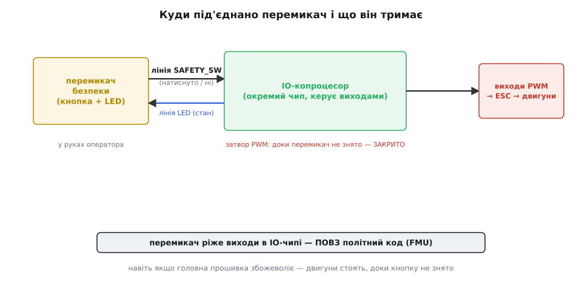
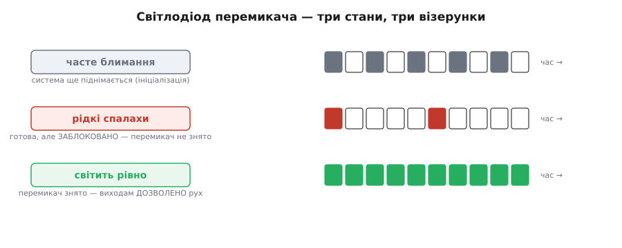
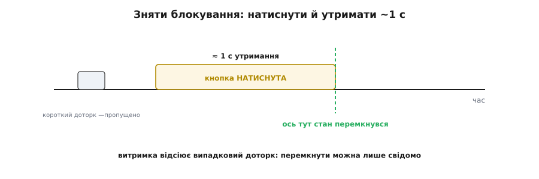

# 🔌 Апаратний перемикач безпеки: кнопка, що тримає двигуни мертвими

## Що це за деталь

Уявіть, що ви несете апарат із гвинтами до місця зльоту. У прошивці — сотні кілобайтів коду, будь-який рядок якого теоретично може подати на двигуни тягу. Питання, від якого залежить ваша рука: **чи є між тим кодом і лезами хоч один заслін, який сам код перемкнути не може**. Апаратний **перемикач безпеки** (англ. *safety switch* — «перемикач безпеки») — і є цей заслін у металі.

Фізично це проста річ: **кнопка з умонтованим світлодіодом**, винесена на короткому шлейфі туди, де до неї легко дотягтися рукою (часто вона сидить прямо в корпусі GPS-модуля, поряд із антеною, бо той однаково стирчить назовні). Кнопка під'єднана до контролера **окремою лінією** — не по шині даних, не через головний процесор, а прямим сигнальним проводом. І ось головне: **доки цю кнопку не натиснуто у стан «дозволено», виходи PWM на двигуни тримаються заглушеними — на найнижчому апаратному рівні, повз усю програмну логіку**. Політна прошивка може вважати апарат зведеним (armed), може рахувати повну тягу, може навіть мати баг, що жене газ угору — леза все одно стоять, бо між розрахунком і регулятором стоїть залізо, яке чекає на дозвіл від людини, а не від коду.

> 🔧 **Навіщо це.** Найкритичніший запобіжник має жити якнайдалі від складного коду, який він страхує, — бо саме той код і може відмовити. Перемикач безпеки виносить дозвіл на обертання за межу прошивки взагалі: щоб гвинти закрутилися, замало, щоб так вирішила програма, — цього має **фізично** захотіти людина, натиснувши кнопку. Це той рівень захисту, який не пробити помилкою в жодному рядку прошивки, бо він її не виконує.

Це не вимикач живлення й не «режим». Живлення на плату подано, процесор працює, датчики опитуються, оцінка стану рахується — усе живе. Мертві лише **виходи на двигуни**, і саме вони, доки перемикач не знято. Розрізняти ці речі важливо: перемикач безпеки не знеструмлює апарат, а вибірково затискає **один** небезпечний вихід, лишаючи решту системи повністю робочою для налаштування, калібрування, перевірок.

## Блок-схема: де він стоїть у ланцюгу

Щоб зрозуміти, чому перемикач такий надійний заслін, треба побачити, **де саме** він врізаний. На багатьох серйозних контролерах на борту не один процесор, а два: головний (**FMU**, *flight management unit* — «вузол керування польотом»), де крутиться вся політна логіка, і окремий маленький **IO-копроцесор** (*input/output* — «ввід-вивід»), що відповідає за частину фізичних виходів, зокрема за PWM на основні канали двигунів. Ці два чипи — різні шматки кремнію з різними прошивками.

Перемикач безпеки заходить **у IO-копроцесор** (а там, де окремого IO-чипа немає, — прямо в апаратний блок формування PWM). І саме IO-чип тримає «затвор» перед виходами: доки лінія перемикача каже «заблоковано», IO-чип **не випускає** жоден сигнал на регулятори, хоч би що надіслав йому по внутрішньому зв'язку головний процесор. Головна прошивка може наказувати що завгодно — вона фізично не дотягується повз IO-чип до ніжок PWM.


*Кнопка з'єднана з IO-копроцесором окремою лінією, а зворотна лінія веде на її ж світлодіод — показати стан. IO-чип керує затвором перед PWM-виходами: доки перемикач у «заблоковано», затвор закрито, і навіть якщо головна прошивка (FMU) збожеволіє, до регуляторів нічого не дійде. Заслін живе поза кодом, який він страхує.*

Ось чому це **незалежний** від коду бар'єр, а не ще одна перевірка в програмі. Звичайна arming-перевірка — це `if` десь у прошивці: якщо в тій самій прошивці є баг, він може обійти й той `if`. Перемикач безпеки натомість фізично розриває шлях сигналу в **іншому** чипі, який про політну логіку нічого не знає й знати не хоче. Щоб його «обійти», мало помилки в коді — треба зняти саму кнопку рукою. Це та сама ідея багатошаровості, що й у [сторожового таймера](topic:programming/watchdog): критичний запобіжник виносять із-під влади того, кого він стереже.

## Типова розпіновка

Назовні перемикач — це кілька проводів у невеликому роз'ємі. Склад майже завжди той самий, незалежно від виробника:

```
SW / SAFETY_SW   — сигнал кнопки: натиснуто / не натиснуто (вхід у контролер)
LED / SAFETY_LED — керування світлодіодом стану (вихід із контролера)
VCC (+3.3 В)     — живлення підсвітки й підтяжки
GND              — спільна земля
```

Логіка розкладена на **дві незалежні лінії**, і це навмисно. Одна лінія — **вхід** у контролер: вона несе стан самої кнопки (замкнена / розімкнена). Друга — **вихід** із контролера на **світлодіод**: нею контролер сам керує підсвіткою, показуючи людині поточний стан системи. Кнопка й лампочка сидять в одному корпусі, але електрично це два різні кола: одне контролер **слухає**, друге — **керує**. Плутати їх — класична помилка (про неї нижче).

Сама кнопка — звичайна **тактова** (*momentary* — «на мить»): натиснута, поки її тримаєш, і сама відпускає контакт. Вона не фіксується в положенні, як тумблер. «Пам'ять» про те, дозволено вихід чи ні, тримає не механіка кнопки, а **стан у контролері**, який кнопка лише перемикає натисканням. Це важлива деталь: перемикач безпеки — не тумблер, що механічно розриває силове коло, а **кнопка-команда**, яку контролер інтерпретує.

## Підключення

Електрично все зводиться до кількох правил, спільних для класу. Вхідну лінію кнопки контролер читає як звичайний **цифровий вхід із підтяжкою**: у спокої лінія притягнута до одного рівня, натискання кнопки замикає її на інший. Через це лінія не «плаває» [між рівнями](topic:electronics/floating-pullups), коли кнопку не чіпають, — інакше контролер ловив би випадкові натискання від наводок.

Вихідну лінію світлодіода контролер веде як звичайний вихід, що вмикає й вимикає підсвітку. Керує ним **сам контролер**, формуючи потрібний візерунок блимання (про візерунки — далі): це не просто «лампочка живлення», а індикатор стану, яким система розмовляє з людиною.

Найважливіше в підключенні — розуміти, що **обидві лінії йдуть у той чип, який керує виходами** (IO-копроцесор або блок PWM), а не десь у бік. Саме тому заслін і незалежний: сигнал кнопки потрапляє прямо туди, де народжується дозвіл на PWM, а не проходить спершу крізь усю політну логіку. Якщо розвести кнопку «кудись у головний процесор, а той уже скаже IO-чипу» — втрачається весь сенс: тоді між кнопкою й виходами знову опиняється той код, від помилок якого перемикач мав захистити.

## Перший байт: три стани світлодіода

Найперше, що бачить людина, узявши апарат, — **як блимає світлодіод перемикача**. Це не прикраса: візерунок блимання — головний спосіб, яким система за півсекунди каже, у якому вона стані. Патернів рівно три, і їх варто знати напам'ять, бо вони спільні для всього класу:


*Часте рівномірне блимання — система ще піднімається (ініціалізація), чіпати рано. Рідкі поодинокі спалахи — система готова, але у стані «безпека»: виходи заблоковано, треба зняти перемикач. Рівне немиготливе світло — перемикач знято, виходам дозволено рух (двигуни закрутяться, щойно апарат буде armed). Один погляд на лампочку — і зрозуміло, на якому кроці ти застряг.*

Логіка патернів природна. **Часте блимання** — «зачекай, я ще прокидаюся»: контролер піднімає периферію, і поки ініціалізація не скінчилась, натискати кнопку марно (а якщо ти саме тримаєш її натиснутою під час старту — на багатьох контролерах це окремий службовий сигнал, наприклад перепрошити IO-чип, тож випадково затиснута на старті кнопка може дати несподіванку). **Рідкі спалахи** — «я готова, але замкнена»: усе піднялося, проте вихід заблоковано, і система чекає, поки людина свідомо дасть дозвіл. **Рівне світло** — «дозвіл є»: перемикач знято, і тепер обертання гвинтів стримує вже тільки програмна логіка зведення в прошивці.

Щоб перейти з «рідких спалахів» у «рівне світло», кнопку треба **натиснути й утримати десь із секунду** — не клацнути, а притиснути й порахувати «раз». Це навмисна витримка:


*Стан перемикається не від дотику, а від утримання близько секунди: контролер відлічує час натискання й міняє стан лише наприкінці. Короткий випадковий доторк — зачепили кнопку рукавом, штовхнули в сумці — не дотягує до порога й пропускається. Витримка перетворює «випадково торкнувся» на «свідомо тримав».*

Причина витримки та сама, що й скрізь у цій темі: перехід у небезпечніший стан має бути **важким для випадковості**. Якби вихід розблоковувався від найлегшого дотику, кнопка спрацьовувала б від поштовху при перенесенні, від гілки, від пальця, що ковзнув по корпусу. Вимога тримати ≈1 c відсіює все випадкове: так довго й свідомо натискають лише навмисне. Це той самий принцип, за яким і сам дозвіл на зліт роблять воротами, а не вимикачем, — тільки тут він утілений у механіку однієї кнопки.

## Як це виглядає в коді

Погляньмо на кістяк логіки з боку контролера — навмисно спрощений, але з правильною суттю. Стан безпеки — одна змінна, і найважливіше в ній те, що **вихід PWM звіряється з нею першим, до будь-якого газу**:

:::tabs
```cpp
// Стан «безпека»: за замовчуванням TRUE — виходи заблоковано.
// Прокидаємося в безпечному стані самі собою, а не сподіваємось,
// що хтось нас заблокує.
static volatile bool safety_on = true;

// Найнижча ланка виводу: сигнал на кожен двигун формує IO-чип.
// Хоч би що прислав головний процесор — доки safety_on, виходить нуль.
void io_pwm_output(const uint16_t pwm[NUM_MOTORS]) {
    if (safety_on) {
        for (int i = 0; i < NUM_MOTORS; i++)
            pwm_write(i, PWM_DISABLED);   // виходи мертві, крапка
        return;
    }
    for (int i = 0; i < NUM_MOTORS; i++)
        pwm_write(i, pwm[i]);             // сюди доходимо ЛИШЕ коли знято
}
```
```python
# Стан «безпека»: за замовчуванням True — виходи заблоковано.
# Прокидаємося в безпечному стані самі собою, а не сподіваємось,
# що хтось нас заблокує.
safety_on = True

# Найнижча ланка виводу: сигнал на кожен двигун формує IO-чип.
# Хоч би що прислав головний процесор — доки safety_on, виходить нуль.
def io_pwm_output(pwm):
    if safety_on:
        for i in range(NUM_MOTORS):
            pwm_write(i, PWM_DISABLED)    # виходи мертві, крапка
        return
    for i in range(NUM_MOTORS):
        pwm_write(i, pwm[i])              # сюди доходимо ЛИШЕ коли знято
```
:::

Порядок тут не випадковий: перевірка `safety_on` стоїть **перед** циклом виводу, тож у стані безпеки жоден шлях виконання не подасть на двигун ненульове значення. Це апаратно-близька половина заслону: код, який фізично формує імпульси, сам відмовляється їх формувати, поки кнопку не знято. І це живе в IO-чипі — окремо від політної прошивки, що просто надсилає сюди бажані числа.

Тепер сама кнопка. Контролер відлічує, **скільки** її тримають, і перемикає стан лише після витримки:

:::tabs
```cpp
#define HOLD_MS   1000       // тримати ≈1 c, щоб перемкнути

// Викликається періодично (напр., кожні 10 мс) з відомим dt_ms.
void safety_button_poll(uint32_t dt_ms) {
    static uint32_t held_ms = 0;

    if (safety_button_pressed()) {       // кнопку зараз натиснуто?
        held_ms += dt_ms;
        if (held_ms >= HOLD_MS) {        // дотримали до порога —
            safety_on = !safety_on;      // перемкнути стан безпеки
            held_ms = 0;
            while (safety_button_pressed())   // дочекатись відпускання,
                ;                             // щоб не перемкнути знову
        }
    } else {
        held_ms = 0;                     // відпустили рано — лічильник з нуля
    }
}
```
```python
HOLD_MS = 1000                           # тримати ≈1 c, щоб перемкнути

# Викликається періодично (напр., кожні 10 мс) з відомим dt_ms.
def safety_button_poll(dt_ms):
    global safety_on
    if safety_button_pressed():          # кнопку зараз натиснуто?
        safety_button_poll.held_ms += dt_ms
        if safety_button_poll.held_ms >= HOLD_MS:   # дотримали до порога —
            safety_on = not safety_on    # перемкнути стан безпеки
            safety_button_poll.held_ms = 0
            while safety_button_pressed():  # дочекатись відпускання,
                pass                        # щоб не перемкнути знову
    else:
        safety_button_poll.held_ms = 0   # відпустили рано — лічильник з нуля

safety_button_poll.held_ms = 0           # статичний лічильник між викликами
```
:::

Ключове рішення тут — лічильник `held_ms` скидається в нуль, **щойно кнопку відпустили**. Через це короткий доторк ніколи не дотягує до порога: щоб `held_ms` дорівняло `HOLD_MS`, кнопку треба тримати **безперервно** цілу секунду. Випадкове торкання накопичить кілька десятків мілісекунд і обнулиться — стан не зміниться.

А світлодіод контролер веде окремо, малюючи потрібний візерунок за поточним станом:

:::tabs
```cpp
// Викликається періодично; сам формує візерунок блимання за станом.
void safety_led_update(bool system_initialising) {
    if (system_initialising)
        led_pattern(FAST_BLINK);         // ще піднімаємось
    else if (safety_on)
        led_pattern(SLOW_BLINK);         // готово, але ЗАБЛОКОВАНО
    else
        led_pattern(SOLID);              // знято — виходам дозволено
}
```
```python
# Викликається періодично; сам формує візерунок блимання за станом.
def safety_led_update(system_initialising):
    if system_initialising:
        led_pattern(FAST_BLINK)          # ще піднімаємось
    elif safety_on:
        led_pattern(SLOW_BLINK)          # готово, але ЗАБЛОКОВАНО
    else:
        led_pattern(SOLID)               # знято — виходам дозволено
```
:::

**Умова: система піднялася, оператор притиснув кнопку й тримає; опитування йде кожні 10 мс.**

```
safety_button_poll(dt=10) × N:
  t=0..990 мс   натиснуто → held_ms росте: 10, 20, … , 990
                safety_on досі true → рідкі спалахи, виходи мертві
  t=1000 мс     held_ms = 1000 ≥ HOLD_MS
                → safety_on = false        (перемкнули: заблоковано → дозволено)
                → held_ms = 0
                → ждемо відпускання кнопки
  далі          safety_led_update(): safety_on=false → SOLID (рівне світло)
                io_pwm_output(): safety_on=false → газ доходить до PWM
```

Апарат перейшов зі стану «рідкі спалахи, виходи мертві» у «рівне світло, виходи дозволено» — але **тільки** тому, що кнопку тримали повну секунду. Зверніть увагу на два рішення, що роблять цей код безпечним: `safety_on` **стартує як `true`** (система прокидається заблокованою сама, без чиєїсь допомоги), а перемикання стається **лише** після витриманого порога, а не від першого торкання. Разом це означає: щоб гвинти дістали дозвіл, потрібна навмисна, важка для випадковості дія людини — рівно те, чого ми хотіли від апаратного заслону.

## Типові граблі класу

- **Немає перемикача, а прошивка на нього чекає.** Найчастіша річ: контролер за замовчуванням **вимагає** зняти перемикач, а на апараті його не встановили. Тоді виходи вічно заблоковано, arming дає перед-помилку «safety switch», і незрозуміло, чому «нічого не заводиться». Лік — сказати прошивці, що перемикача немає (окремим параметром), і вона перестає вимагати його зняття. Але робити це треба свідомо, розуміючи, що ви **прибрали цілий фізичний заслін**, а не просто «полагодили» помилку.

- **Переплутані лінії кнопки й світлодіода.** Оскільки кнопка й лампа сидять в одному роз'ємі, а лінії дві (вхід і вихід), їх легко поміняти місцями в саморобному кабелі. Тоді контролер «натискає» на світлодіодну лінію й «читає» кнопку як вихід — перемикач або мертвий, або поводиться дико. Звіряйте, яка ніжка вхід, а яка вихід.

- **Кнопку затиснуто на старті — і почалося службове.** На багатьох контролерах утримання кнопки **під час подачі живлення** — це окремий сигнал (наприклад, перепрошити IO-чип). Якщо кнопка випадково притиснута корпусом чи рукою в мить увімкнення, можна ненароком запустити службову дію замість звичайного старту. Вмикайте живлення, не тримаючи кнопку.

- **Забули, що це вибірковий заслін, а не живлення.** Люди дивуються: «перемикач у «безпеці», а сервоприводи/світло/телеметрія працюють — хіба не мало все стояти?». Ні: перемикач затискає **лише** виходи на двигуни (а часом — і на кермові поверхні), решта системи жива навмисно, щоб можна було налаштовувати апарат. Це не збій, а задум.

- **«Плаваюча» лінія кнопки без підтяжки.** Якщо саморобний кабель загубив підтяжку на вхідній лінії, вона [висне між рівнями](topic:electronics/floating-pullups) й ловить наводки — контролер бачить фантомні натискання. Вхід кнопки завжди має бути підтягнутий.

- **Розвели дозвіл через головний процесор.** Якщо переробити схему так, щоб кнопку читав головний чип, а той уже «просив» IO-чип відкрити вихід, — заслін перестає бути незалежним: між кнопкою й виходами знову опиняється політний код. Уся цінність перемикача в тім, що він врізаний **у чип виходів**, повз головну прошивку.

## Варіації класу

Суть класу одна, але втілення різняться. **Кнопка в GPS чи окремо.** Дуже часто перемикач умонтований у корпус GPS/компас-модуля разом зі світлодіодом — бо той однаково винесений на щоглу назовні, і туди зручно покласти й кнопку. Але буває й **окремий** модуль-перемикач на своєму шлейфі. Електрично це те саме коло, лише в іншому корпусі.

**Куди врізано.** На контролерах із окремим IO-копроцесором перемикач заходить у нього, і саме IO-чип тримає затвор. На простіших контролерах **без** окремого IO-чипа функцію бере на себе апаратний блок PWM головного процесора чи проміжна логіка — заслін лишається, просто «поверхом вище». Що менше коду між кнопкою й ніжкою PWM, то надійніший заслін.

**Скільки виходів затискає.** Класично перемикач глушить основні виходи на двигуни. На апаратах із кермовими поверхнями частина виходів (наприклад, сервоприводи керма) може бути **навмисно виведена з-під блокування** окремим налаштуванням — щоб можна було рухати поверхні на землі для перевірки, поки двигуни ще заблоковано. Це вже тонше налаштування, але клас той самий: вибіркове затискання небезпечних виходів.

**Чи можна вимкнути.** Прошивки дають змогу оголосити, що перемикача **немає** (для апаратів, де його свідомо не ставлять), — тоді дозвіл на вихід визначає сама логіка arming без апаратного заслону. Це законний варіант для певних збірок, але кожен такий вибір прибирає один незалежний рівень захисту, і робити його слід, чітко розуміючи, чим саме розплачуєшся за зручність.

Хоч би яка варіація — незмінна серцевина класу лишається та сама: **фізична кнопка, доки її свідомо не знято, тримає найнебезпечніший вихід мертвим на рівні заліза, повз увесь код**. Це найнижчий, найтупіший і саме тому найнадійніший заслін між наміром летіти й обертанням гвинтів — той, що не вміє мати багів, бо не виконує програми.
