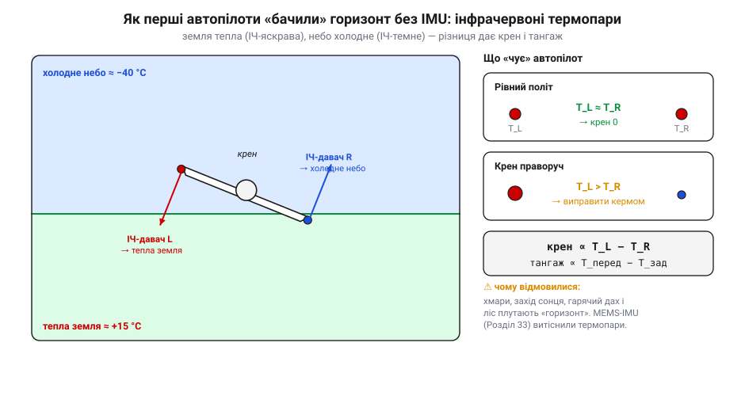
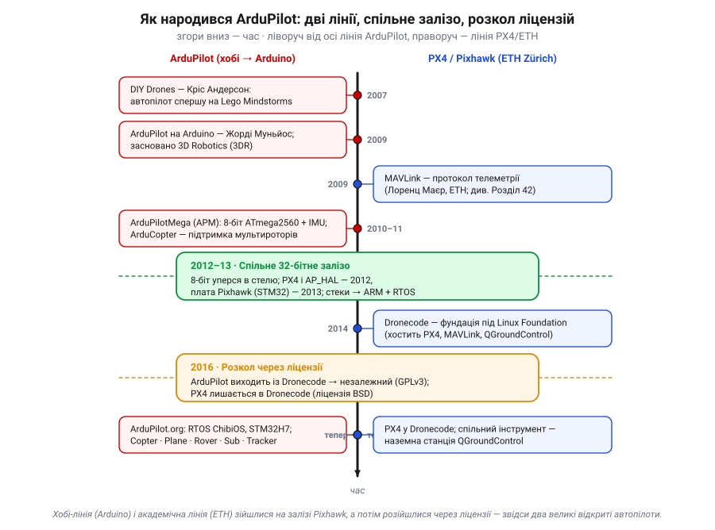
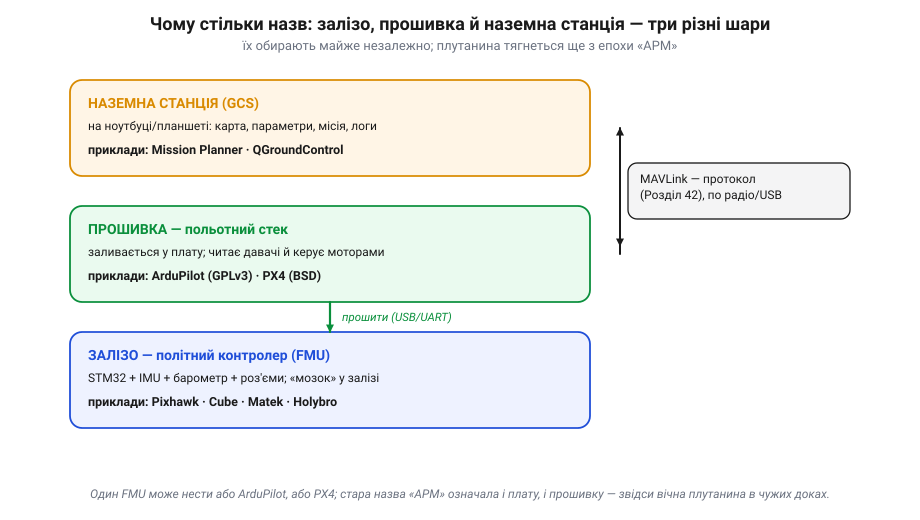

# Історія: ArduPilot — як спільнота аматорів зробила автопілот

Перш ніж розбирати, **з чого** складається автономний апарат і **навіщо** йому виділений політний контролер, варто спитати інакше: а звідки взагалі взявся той «зрілий відкритий стек», на який сьогодні спираються тисячі дронів, літаків, роверів і навіть підводних апаратів? Бо це не вийшло з лабораторії оборонного концерну й не впало згори стандартом. Це історія про редактора журналу, який зібрав автопілот з дитячого конструктора; про мексиканського підлітка, що чекав на грін-карту й від нудьги навчив іграшкову плату літати; про швейцарського аспіранта, чий протокол і досі возять усі дрони світу; і про сварку через ліцензії, через яку відкритих автопілотів стало **два**.

Це не довідник «хто що зробив». Це ланцюг **рішень** — бо саме вони, а не дати, показують, **чому** сучасний автопілот улаштований так, а не інакше. А заразом — звідки взялися назви, які ти першими побачиш, відкривши чужу плату або чужу документацію.

---

## Передумови: навіщо знадобився аматорський автопілот

На початку 2000-х автопілот для безпілотника був синонімом слова «дорого». Військові апарати на кшталт Predator коштували мільйони, а їхня електроніка була засекречена. Сама ідея, що людина в гаражі може зібрати літальний апарат, який **сам** тримає курс і висоту, виконує маршрут за точками й повертається додому, звучала несерйозно.

Але дещо тихо змінилося. По-перше, подешевшали й поменшали **давачі**: те, що раніше було механічним гіроскопом завбільшки з кулак, ставало [мікросхемою на кілька доларів](book:electronics/mems) завдяки MEMS-революції. По-друге, з'явилися дешеві програмовані плати, на яких **будь-хто** міг писати код, не маючи диплома з електроніки. По-третє — і це головне — з'явилося місце, де такі люди могли знайти одне одного.

> 🔧 **Навіщо це.** Уся архітектура сучасного автопілота виросла з обмеження «зробити дешево й з доступних деталей». Тому сучасний автопілот — це не монолітна закрита коробка, а **шари** з відкритим кодом, які можна читати, міняти й переносити на інше залізо. Саме ця відкритість і робить його придатним для навчання: чужу плату й чужу прошивку можна **прочитати**, а не лише купити.

---

## Мозок літального робота — з доступних деталей

Перший герой цієї історії — **Кріс Андерсон** (*Chris Anderson*), на той час головний редактор журналу *Wired*, людина, яка писала про технології, а не паяла їх. Якось на вихідних він спробував зацікавити дітей одразу двома речами: конструктором Lego Mindstorms і радіокерованим літачком. Діти швидко занудьгували. А от сам Андерсон — ні. Він з'єднав дві іграшки в одну: поставив керований контролер Lego на літак і змусив його робити щось схоже на автономний політ. Вийшов, як він сам це назвав, чи не **найдешевший у світі автопілот** — буквально з деталей дитячого конструктора.

Із цього напівжартівливого експерименту 2007 року народилося дещо серйозне: сайт-спільнота **DIY Drones** («Зроби дрон сам»). Це була не компанія й не продукт, а **майданчик**: форум, блог, місце, де ентузіасти з усього світу викладали свої спроби, ділилися кодом і платами, сперечалися й допомагали одне одному. Андерсон зробив те, що вмів найкраще, — зібрав навколо ідеї людей.

І тут спрацював ефект, заради якого варто запам'ятати цю історію: щойно з'явилося **спільне місце**, у нього почали стікатися таланти, яких ніхто не наймав і не шукав. Один із них незабаром усе й перевернув.

---

## Як дешево визначити «верх»: термопарні давачі

Найважче в автопілоті — не керувати кермами, а **знати поточну орієнтацію**: де небо, де земля, наскільки апарат завалений у крен і тангаж. Сьогодні відповідь очевидна — інерціальний давач (IMU) на MEMS. Але близько 2008 року дешеві MEMS-гіроскопи **дрейфували** так сильно, що довіряти їм кут нахилу надовго було не можна, а складні алгоритми злиття давачів ще не вміщалися в копійчані мікроконтролери.

Тому ранні аматорські автопілоти користувалися дивовижно простим і красивим трюком — **інфрачервоними термопарними давачами горизонту** (*thermopile / IR horizon sensors*; класичний приклад — модуль FMA Co-Pilot). Ідея фізична й елегантна: **земля у тепловому (інфрачервоному) діапазоні тепліша за небо**. Постав на апарат пари ІЧ-давачів, що дивляться у протилежні боки — вперед/назад і ліворуч/праворуч, — і виміряй **різницю** температур у кожній парі.


*Рис. Доба до дешевих IMU: автопілот «бачив» горизонт по теплу. Лівий давач дивиться на теплу землю, правий — на холодне небо; різниця сигналів дає крен. Те саме для пари «перед/зад» дає тангаж. Просто, без дрейфу — але плутається на хмарах, заході сонця й над гарячим дахом, тож із приходом MEMS-IMU термопари відійшли в історію.*

Коли апарат летить рівно, давачі в парі бачать однакову суміш неба й землі — різниця близька до нуля. Щойно апарат завалюється в крен, один давач починає «бачити» більше теплої землі, інший — більше холодного неба, і різниця температур одразу підказує напрям і величину нахилу:

```
крен   ∝ T_лівий  − T_правий
тангаж ∝ T_перед  − T_зад
```

Краса методу — у тому, що він дає **абсолютний** орієнтир (горизонт нікуди не дрейфує), і йому не потрібні складні обчислення. Слабкість — фізична: «горизонт» по теплу плутають хмари, захід сонця, нагрітий дах будинку чи стіна лісу. Саме тому, щойно MEMS-давачі й алгоритми злиття дозріли, термопари тихо зникли. Але як **перший крок** вони зробили автономний політ доступним — і це чудовий приклад інженерного принципу: **спершу — те, що працює з наявних деталей, а ідеальне рішення — потім.**

> 🔧 **Навіщо це.** Цей сюжет — у мініатюрі вся логіка автономної системи: автономність зводиться до питання «звідки система знає свій стан?». Термопари відповідали на нього по-своєму; сучасний оцінювач стану — по-іншому. Але **ланцюг** «давач → оцінка стану → керування → виконавчий механізм» той самий, незалежно від епохи.

---

## Arduino керує літаком — і народжується назва ArduPilot

У 2007–2008 роках у Каліфорнії жив молодий мексиканець **Жорді Муньйос** (*Jordi Muñoz*). Йому було близько двадцяти, він щойно переїхав до США, чекав на грін-карту й **не мав права легально працювати**. Часу було багато, грошей мало, а руки свербіли. Він узяв дешеву плату **Arduino** — ту саму, що для більшості була «іграшкою, щоб помигати світлодіодом», — і вирішив зробити з неї автопілот для радіокерованого гелікоптера.

І зробив. Він зняв відео, де його апарат тримається в повітрі **сам**, і виклав це на DIY Drones. Кріс Андерсон побачив рівень роботи самоука й зробив несподіване: надіслав незнайомому хлопцеві чек на кілька сотень доларів — фактично перші «інвестиції» в розробку. Невдовзі, у 2009 році, вони заснували разом компанію **3D Robotics (3DR)**, а Муньйос став її технічним мотором.

Та головне — назва, і тут варто бути точним. Ще 2007-го Муньйос написав для Arduino програму стабілізації гелікоптера (її він назвав *ArduCopter*), а у вересні 2008-го його автономний гелікоптер виграв перші перегони безпілотників **SparkFun AVC**. Уже 2009 року вони з Андерсоном випустили **ArduPilot 1.0** — програму й плату, що на той час уміли керувати лише **літаком** (*fixed-wing*) і спиралися на ті самі **термопарні** давачі горизонту. Звідси й ім'я: *Ardu* (від Arduino) + *Pilot*. У цьому імені — уся ДНК проєкту: **відкритий код на дешевій 8-бітній платі для всіх**, а не закрита розробка.

> 🔧 **Навіщо це.** Коли в чужій документації чи на старому форумі ти побачиш загадкове «APM» або «ArduPilot Mega» — тепер зрозуміло, **звідки** ця назва й чому вона пов'язана з Arduino. Це не маркетинг: це буквальна історія заліза. Розпізнавати такі «скам'янілості» в назвах — частина вміння читати чужі системи.

Дуже швидко стало ясно, що проста плата Arduino замала. У 2010-му з'явився **ArduPilotMega (APM)** — автопілот на основі Arduino Mega, тобто на 8-бітному мікроконтролері **ATmega2560**, до якого вже доклали справжній інерціальний давач ([IMU](book:electronics/imu-barometer)). «Mega» — це і про плату, і про амбіції. APM розрісся в сімейство офіційних плат (**APM 1, 2.5, 2.6**) і став **де-факто стандартом** аматорського автопілота на кілька років. (Поширене в продажу «**APM 2.8**» — це вже пізніший **клон**/ринкова назва, а не окрема офіційна ревізія; саму лінію APM2.x давно знято з підтримки.) А ще за рік, близько 2011-го, з'явився **ArduCopter** — гілка прошивки для мультироторів. Саме вона збіглася в часі з бумом квадрокоптерів і винесла ArduPilot у широкий світ.

---

## Стеля 8 біт — і хто чекав на іншому боці

APM був чудовий, але його мозок — 8-бітний ATmega2560 — мав жорсткі межі. Порівняймо в лоб:

```
                 APM (ATmega2560)        Pixhawk-клас (STM32F4)
розрядність      8 біт                   32 біти
такт             16 МГц                  168 МГц
Flash (код)      256 КБ                  1–2 МБ
RAM              8 КБ                     192–256 КБ
число з комою    програмно (повільно)    апаратний FPU
```

Що більше функцій додавали — складніше злиття давачів, журналювання, більше режимів польоту, — то очевидніше код **переставав вміщатися** і не встигав рахувати вчасно. 8 біт уперлися в стелю. Потрібен був стрибок на **32-бітний** процесор (архітектура ARM Cortex-M, мікросхеми STM32) і на повноцінну операційну систему реального часу (RTOS), щоб давати раду багатьом задачам одночасно.

І тут історія робить поворот. Бо паралельно з каліфорнійськими аматорами над тією ж проблемою працювали зовсім інші люди — **академічна** команда у Швейцарії. В **ETH Zürich** (Швейцарська вища технічна школа Цюриха) аспірант **Лоренц Маєр** (*Lorenz Meier*) вів проєкт **PIXHAWK** — спершу це був апарат із комп'ютерним зором (звідси й назва: *pixel* + *hawk*, «піксельний яструб»). Команді Маєра потрібні були дві речі, яких ще не існувало у відкритому вигляді: **спосіб надійно зв'язати** борт із землею і **гідне залізо** для польотного контролера.

Так із цієї лінії народилися три речі, які пережили все інше:

- **MAVLink** (близько 2009) — [компактний протокол телеметрії й команд](book:communications/mavlink-packet). Сьогодні ним «розмовляють» практично всі відкриті автопілоти й наземні станції.
- **PX4** — власний польотний стек (друга велика відкрита прошивка, поряд з ArduPilot).
- **Pixhawk** — апаратна плата політного контролера на 32-бітному STM32, спроєктована спільнотою разом із 3DR.

І ось ключовий момент: **обидві** лінії — хобі-лінія ArduPilot і академічна лінія PX4 — зійшлися на **спільному 32-бітному залізі**. Це сталося не за день: 2012 року вийшов стек **PX4** і з'явився шар абстракції **AP_HAL**, що дав ArduPilot вихід на 32-біт, а вже в **листопаді 2013-го** — і сама плата **Pixhawk** (спільний проєкт ETH і 3DR), яку можна було прошити або ArduPilot, або PX4. ArduPilot, щоб жити на новому залізі, перебрався на RTOS (спершу **NuttX**, згодом власний порт на **ChibiOS**). 8-бітна епоха закінчилася.


*Рис. Дві незалежні лінії — аматорська (Arduino → APM → ArduPilot) і академічна (ETH → MAVLink → PX4) — зійшлися на спільному 32-бітному залізі на зламі 2012–2013 (PX4 і AP_HAL — 2012, плата Pixhawk — листопад 2013), коли 8-біт уперся в стелю, а потім розійшлися 2016-го через несумісні ліцензії. Звідси й беруться сьогодні **два** великі відкриті автопілоти.*

> 🔧 **Навіщо це.** Запам'ятай розрізнення «8-біт → 32-біт»: воно пояснює, чому сучасний політний контролер — це фактично маленький комп'ютер з RTOS, а не проста плата з циклом `loop()`. Саме вимоги реального часу й надійності диктують усю його будову.

---

## Коли відкрите залізо стає бізнесом

Поки це був хобі-проєкт, усе було просте: код відкритий, плати дешеві, спільнота дружня. Але ArduPilot і Pixhawk стали **успішними** — а успіх притягує гроші, компанії й суперечки про те, **кому це належить**.

3DR із гаражної компанії перетворилася на помітного гравця. У 2015-му вона випустила споживчий дрон **Solo** — і це виявилося комерційним провалом: ринок саме захоплювала китайська DJI, Solo не злетів у продажах, і 3DR ледь не збанкрутувала, після чого розвернулася від «заліза» до корпоративного програмного забезпечення. А довкола відкритого коду назрів інший, глибший конфлікт.

У 2014 році під крилом **Linux Foundation** створили фундацію **Dronecode** — щоб дати відкритим дроновим проєктам спільний «дім», управління й гроші великих спонсорів (Intel, Qualcomm та інші). Туди увійшли PX4, MAVLink, наземна станція QGroundControl — і ArduPilot.

Але між двома лініями була **принципова відмінність у ліцензіях**, і саме вона все вирішила:

- **ArduPilot** ліцензований під **GPLv3**. Це «вірусна» відкритість: будь-хто може брати й міняти код, **але** мусить так само відкривати свої зміни. Комерційні виробники, які хотіли зашити прошивку у закритий продукт, цього не любили.
- **PX4** ліцензований під **BSD** — дозвільна ліцензія: бери, міняй, **закривай** і продавай, нічого не відкриваючи назад.

Для компаній, що будували закриті продукти, BSD-лінія PX4 була зручнішою, і всередині Dronecode виник тиск у її бік. У 2016 році дійшло до розриву: **ArduPilot вийшов із Dronecode** (за деякими описами — його фактично попросили піти) і став **незалежним** проєктом під власною неприбутковою парасолькою (ArduPilot.org / Software in the Public Interest). PX4 лишився в Dronecode.

Так несумісність двох рядків у ліцензійному файлі **розколола** колись спільну екосистему на два табори, що існують і досі. Це не «хороші проти поганих» — це два різні відкриті автопілоти з різними філософіями: GPLv3-спільнота ArduPilot і BSD-екосистема PX4.

> 🔧 **Навіщо це.** Ліцензія — не формальність, а інженерне рішення. Те, що ArduPilot під GPLv3, означає, що **весь його код відкритий і ти можеш його читати** — а це прямо збігається з метою нашого курсу: розуміти чужі системи зсередини, а не лише користуватися «чорними скриньками». Коли обиратимеш стек для власного проєкту, ліцензія визначатиме, що ти зобов'язаний відкрити, а що — ні.

---

## Звідки стільки заплутаних назв

Якщо вперше відкрити документацію або форум, легко потонути: Pixhawk, Cube, ArduPilot, PX4, Mission Planner, QGroundControl, APM, MAVLink... Здається, що це синоніми або конкуренти впереміш. Насправді ця плутанина — пряма **спадщина** історії, яку ми щойно пройшли, і вона розплутується, щойно розкласти все на **три шари**.


*Рис. Три різні речі, які новачок плутає. **Залізо** — це плата політного контролера (FMU). **Прошивка** — польотний стек, який на неї заливають. **Наземна станція (GCS)** — програма на ноутбуці. Зв'язує прошивку з GCS протокол MAVLink. Шари обирають майже незалежно — а стара назва «APM», що означала і плату, і прошивку, досі плутає всіх.*

- **Залізо — політний контролер (FMU, *flight management unit*).** Це фізична плата: 32-бітний процесор STM32, інерціальний давач, барометр, роз'єми. Приклади назв: **Pixhawk**, **Cube**, **Matek**, **Holybro**. Це «мозок» у залізі.
- **Прошивка — польотний стек.** Це код, який **заливають** у плату; він читає давачі й керує моторами. Тут і живуть наші два герої: **ArduPilot (GPLv3)** і **PX4 (BSD)**. Одну й ту саму плату Pixhawk можна прошити будь-яким із них.
- **Наземна станція (GCS, *ground control station*).** Програма на ноутбуці чи планшеті: карта, маршрут, параметри, журнали. Приклади: **Mission Planner** (давнє творіння Майкла Оборна / *Michael Oborne*, рідне для ArduPilot) і **QGroundControl** (кросплатформна, спільна з PX4). Із прошивкою GCS спілкується по **MAVLink** — тому й важливо, що цей протокол колись зробили універсальним.

Три шари обирають майже незалежно: береш плату (залізо), вирішуєш, який стек на неї залити (прошивка), і дивишся апарат із землі через GCS (станція). А головне джерело вічної плутанини — те саме «APM»: колись так називали **і** стару 8-бітну плату, **і** прошивку для неї, тож у різних текстах одне слово означає різні речі.

> 🔧 **Навіщо це.** Це найпрактичніший підсумок усієї історії. Узявши до рук незнайому плату дрона, перше, що треба зробити, — **рознести три шари**: яке тут залізо, яка прошивка на ньому стоїть і якою наземною станцією його налаштовують. Сплутати «Pixhawk» (залізо) з «ArduPilot» (прошивка) — типова помилка новачка, і вона веде до неправильних висновків про систему.

---

## Що з цього лишилося в сучасному стеку

Сьогодні ArduPilot — зрілий, перевірений роками стек: він працює на RTOS ChibiOS, на потужних 32-бітних STM32 (аж до серії H7), і керує не лише коптерами та літаками, а й роверами, човнами, підводними апаратами й антенними трекерами. Усе це виросло з тижневого експерименту з Lego, із підлітка, що від нудьги навчив Arduino літати, і зі швейцарського протоколу, який пережив усіх.

Але важливіша за факти — **логіка**, яку ця історія в собі несе:

- **Ланцюг «давач → оцінка стану → керування → виконавчий механізм»** однаковий від термопар до сучасного оцінювача — змінюється лише техніка на кожній ланці.
- **Виділений політний контролер** з'явився не з примхи, а тому, що 8 біт уперлися в стелю: реальний час і надійність вимагають окремого, передбачуваного «мозку».
- **Шари** (залізо / HAL / оцінювач / керування / навігація / наземна станція) — це не академічна краса, а спосіб, яким спільнота змогла переносити код між платами й ділити роботу.
- **Відкритість** (і конкретна ліцензія) — це те, що дозволяє нам цей стек **читати й розуміти**, а не лише купувати.

Саме ця історія пояснює, чому автономний апарат улаштований так, а не інакше: не примха інженера, а ланцюг рішень, у якому кожне диктувалося доступним залізом, потребою реального часу й відкритістю коду.
