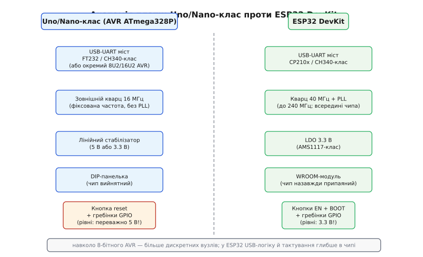
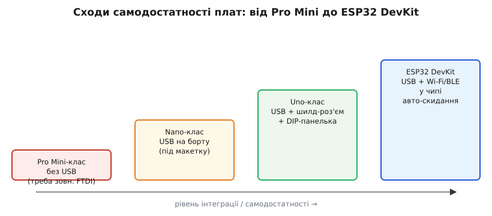

# 🔌 Плата Uno/Nano-класу: анатомія 8-бітної класики поруч із ESP32

Сам чип AVR — передбачуваний, з тактами, що рахуються, і простою периферією без PLL; подивімося, як він живе на платі. Навколо ATmega328P (8-біт AVR) існує два канонічних формати носія: **Uno-клас** — повнорозмірна плата, де чип сидить у DIP-панельці і «дивиться» вгору, та **Nano-клас** — та сама електроніка, стиснена до розміру стіка для макетки. Обидва — той самий жанр носія (англ. *carrier board* — «плата-носій»), що й [DevKit-плата ESP32](topic:programming/esp32-architecture/comp-devkit.md), але навколо 8-бітного ядра, і саме порівняння з DevKit найкраще проявляє характер класу.

## Що це за клас

Голий ATmega328P сам по собі зручний хіба що в руках досвідченого схемотехніка з паяльником: потрібне зовнішнє тактування, стабілізоване живлення, USB для зв'язку з комп'ютером, кнопка скидання і гребінки для під'єднання периферії. **Плата-носій** — це все перелічене, зібране довкола чипа на одній платі, щоб він просто вмикався в USB і прошивався. Те саме, що DevKit дає ESP32 — з однією принциповою відмінністю в рівнях.

> 🔧 **Навіщо це**
> Навіщо взагалі тримати поруч 8-бітну плату, коли є ESP32? По-перше, **ціна**: Uno- і Nano-клони коштують $2–4, а ремонт зводиться до заміни чипа за 50 центів — ATmega328P у DIP-панельці буквально виймається пальцями. По-друге, **5 В «з коробки»**: стара периферія (реле-модулі, давачі з 5-вольтовою логікою) підключається без зсувачів рівнів. По-третє, **передбачувані такти**: 16 МГц без PLL, без ядерного помножувача — саме те, що потрібно для bit-bang-протоколів і точного часування. ESP32 із двома ядрами, кешем і динамічною частотою — потужніший, але й менш детермінований.

## Блок-схема плати: ті самі вузли, але 8-бітні



*Анатомія плати Uno/Nano-класу проти ESP32 DevKit: ті самі ролі вузлів (міст, стабілізатор, тактування, reset, гребінки), але навколо 8-бітного AVR їх більше — окремими деталями. Ключова відмінність для практики — рівні: зазвичай 5 В проти 3.3 В на ESP32.*

Якщо поставити обидві плати поруч і порівняти функційні блоки, список ролей збігається — але реалізація кожного відрізняється, і саме ці відмінності визначають практичне застосування.

**USB-UART міст** на Nano-клоні — найчастіше CH340-клас; на оригінальному Uno — FT232-клас або навіть окремий дрібний AVR (8U2/16U2-клас), який виконує роль моста як повноцінна мікросхема. На ESP32 DevKit функція та сама (CP210x або CH340), але міст тут — єдиний «посередник»: у класичного ESP32 USB-логіки у самому чипі немає (тільки у S2/S3). Результат однаковий — у системі з'являється COM-порт, але на Uno USB «прикручений збоку» більшою кількістю компонентів.

**Тактування** — найголовніша різниця в архітектурі. На платі AVR стоїть **зовнішній кварцовий резонатор 16 МГц** — той самий бляшаний циліндрик чи прямокутник, якого видно неозброєним оком. Частота фіксована, без PLL, без помножувача. Саме тому [такти AVR «рахуються»](topic:programming/avr): одна інструкція — один або два такти, і жодних сюрпризів від планувальника частоти. На ESP32 кварц — 40 МГц, але він живить PLL, яка розкручує ядра до 160–240 МГц. Потужніше, але менш передбачувано для тонкого часування.

**Лінійний стабілізатор**: на Uno-класі — AMS1117-клас або аналог із виходом 5 В (саме тому логіка плати — 5-вольтова); на деяких Nano-клонах і новіших варіантах — 3.3 В. На ESP32 DevKit стабілізатор завжди дає 3.3 В. Ця відмінність — **перша річ, яка б'є** під час спільного використання плат.

**DIP-панелька** — виключно AVR-особливість: ATmega328P у корпусі DIP-28 вставляється у дворядну панельку з нульовим зусиллям. Спалив чип — вийняв, вставив новий. ESP32-модуль припаяний назавжди: заміна вимагає паяльної станції і BGA-пінцета. Для навчального середовища або прототипу, де ризик помилки великий, панелька — неоціненна.

**Кнопка reset**: на обох платах виконує одну роль — апаратне скидання. На DevKit є ще BOOT, яка вводить у режим завантаження; на AVR-платі аналогічного «strapping-пінового» механізму немає — про це в розділі «Перший байт» нижче.

Підсумок фігури: навколо простого 8-бітного ядра AVR більше дискретних компонентів, кожен з яких виконує окрему функцію; на ESP32 DevKit частину функцій (радіо, внутрішнє тактування через PLL) інтегровано у сам чип, тому плата виглядає «чистіше», але прихований рівень складності просто переміщено у кремній.

## Розпіновка й рівні

Гребінки Uno- і Nano-класу — стандартний набір ніжок ATmega328P, виведених у зручний для підключення формат:

```
5V / 3V3 / VIN / GND   — живлення (часто і 5 В, і 3.3 В на платі)
D0..D13                — цифрові GPIO (D0/D1 зайняті UART)
A0..A5                 — аналогові входи (ще й I²C: A4=SDA, A5=SCL)
~D3 D5 D6 D9 D10 D11   — піни з апаратним ШІМ (позначені ~)
ICSP                   — 6 контактів внутрішньосхемного програмування
```

Головний практичний акцент — **рівні сигналів**. На Uno-класі логіка 5-вольтова: вихід HIGH — 5 В. Якщо подати цей сигнал безпосередньо на вхід ESP32 або 3.3-вольтового давача, вхідний пін зазнає напруги вище VDD і може вийти з ладу — без видимих симптомів або одразу. Вихід: дільник напруги (два резистори) чи двонаправлений [level-shifter](topic:electronics/level-shifter) (BSS138-клас). Це найважливіша практична думка для тих, хто поєднує обидва класи плат в одному проєкті.

ICSP-гребінка — шість контактів для внутрішньосхемного програмування (MOSI, MISO, SCK, RESET, VCC, GND): це вхід для зовнішнього програматора, який дає змогу прошити чип в обхід завантажувача і UART. Про це — нижче.

## Перший байт: як плата прошивається

Логіка «прошивки з коробки» та сама, що на DevKit: USB-кабель → COM-порт у системі → утиліта пише у Flash. Але механіка відрізняється — і відрізняється в простіший бік.

Прошивальник для AVR — **`avrdude`** (аналог `esptool` для ESP32), протокол **STK500** через UART-міст. Перед записом плата має отримати сигнал скидання: лінія **DTR** USB-UART-моста через RC-ланку на платі короткочасно смикає пін RESET AVR. Чип стартує, і перші кілька сотень мілісекунд заводський **bootloader** (записаний у старший кінець Flash) слухає UART на швидкості 115 200 бод — якщо надходить пакет STK500, bootloader приймає прошивку і записує її в Flash. Потім він передає керування за вектором reset, і запускається ваш код.

Принциповий контраст із ESP32: **у AVR немає strapping-пінів вибору завантаження**. Не потрібно тримати IO0 у нулі, не потрібна двотранзисторна схема авто-скидання. Заводський bootloader сам вирішує, що робити після скидання: є пакет від `avrdude` — прошивай, немає — запускай програму. Простіша логіка, відповідна до простішого чипа.

```
avrdude -p atmega328p -c arduino -P COM5 -b 115200 -U flash:w:firmware.hex:i
```

Альтернатива — прошивка **напряму через ICSP** зовнішнім програматором (USBasp-клас, STK500-клас). Програматор підключається до шестипінової ICSP-гребінки, використовує протокол ISP по SPI — і пише Flash без жодного bootloader, без UART-моста, навіть якщо плата повністю «цегла» через зіпсований bootloader. Те, чого в типовому ESP32 DevKit не роблять взагалі, тут — штатна операція.

## Типові граблі

- **5 В проти 3.3 В.** Найчастіша поломка при переході між платами: вихід Uno-класу (5 В HIGH) у вхід ESP32 або 3.3-вольтового давача — спалює вхідний ESD-захист без жодного диму і попередження. Пам'ятати: Nano-клас буває і 5-вольтовим (дивіться маркування плати), і 3.3-вольтовим. Завжди перевіряйте рівні перед підключенням.

- **CH340 на клонах** — потрібен окремий драйвер, як і CP210x/CH340 на ESP32-платах; без нього система не бачить COM-порту і прошити неможливо.

- **Мало RAM.** 2 КБ SRAM на ATmega328P проти сотень КБ у ESP32: великий масив або рядок типу `String` тихо переповнює стек або купу, і плата «зависає» без жодного повідомлення про помилку. Це пряма ціна мінімалізму [AVR-класу](topic:programming/avr).

- **D13 уже навантажений.** На більшості Uno- і Nano-плат до піна D13 підключений бортовий світлодіод через резистор 1 кОм. Якщо підключати до D13 вхідний сигнал чи підтяжку — ця підтяжка діє разом із резистором світлодіода, і поведінка відрізняється від інших пінів.

- **Підробний FTDI** — окремий розділ в історії Arduino-клонів: компанія FTDI одного разу випустила драйвер, що «цеглив» підробні чипи FT232R. Звідси масовий перехід виробників клонів на CH340G — дешевший і без таких юридичних казусів.

- **Автоскидання при відкритті порту.** Відкриття COM-порту на більшості плат автоматично перезапускає скетч через DTR-лінію — зручно для прошивки, але несподівано при налагодженні через Serial: відкрив монітор — і плата рестартувала.

## Варіації класу



*Сходи самодостатності плат: від Pro Mini (прошивають зовнішнім перехідником) до ESP32 DevKit (усе на борту). Та сама логіка «носія», різний рівень інтеграції.*

**Uno-клас** — навчальний еталон: повний розмір (68 × 53 мм), DIP-чип у панельці (вийняв-вставив), роз'єм для шилдів зверху (сумісні модулі-розширення), 5-вольтова логіка.

**Nano-клас** — та сама ATmega328P, та сама електроніка, але вдесятеро менша плата (45 × 18 мм), з ніжками для безпосереднього вставляння в макетку. USB на борту, але без роз'єму шилдів і без DIP-панельки.

**Pro Mini-клас** — найдрібніший варіант: ще менша плата **без** USB-моста взагалі. Прошивають зовнішнім FTDI-перехідником, підключеним до шести контактів UART + DTR. Це разючий контраст із самодостатнім ESP32 DevKit: щоб прошити Pro Mini, потрібен додатковий адаптер — зате плата коштує менше долара і влазить у найтісніший корпус. Існують версії Pro Mini на 5 В і 3.3 В / 8 МГц — і ця відмінність версій є ще однією пасткою сумісності.

Підсумок простий: 8-бітна плата — про простоту й передбачуваність, про 5-вольтовий стандарт і вийнятний чип. Коли в проєкті потрібні радіо, велика обчислювальна потужність або розвинена периферія — вибір зміщується [до ESP32](root:embedded/esp32-vs-8bit).
