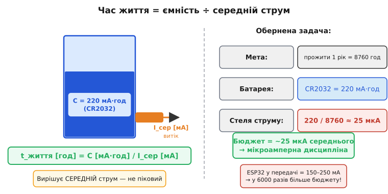

# Бюджет батареї: мА·год ÷ середній струм

Кожна батарея — резервуар заряду. Ємність вимірюють у міліампер-годинах: якщо щось споживає 1 мА і батарейка може живити його 100 годин, ємність — 100 мА·год. Чому не в кулонах, хоча 1 мА·год = 3.6 Кл? Суто практично: коли в знаменнику стоїть споживання в мА, ділиш ємність на нього і одразу отримуєш час у годинах без переведення одиниць. Уявіть резервуар із водою: ємність — об'єм, струм споживання — швидкість витоку внизу. Час, поки вода не скінчиться, — об'єм поділений на швидкість витоку. Проста аналогія, що працює щоразу, коли потрібно прикинути бюджет.

Звідси **головна формула бюджету**:

```
t_життя [год] ≈ C [мА·год] / I_сер [мА]
```

> 🔧 **Навіщо це.** Бюджет рахують ДО проєктування, не після. Перше питання, яке ставить досвідчений інженер, — «скільки маю мА·год і скільки годин потрібно прожити» → отримує стелю середнього струму → і вже під цю стелю обирає режим сну та частоту прокидань. Пристрій, що «добре працює на столі», але у полі здихає за тиждень, — результат пропущеного бюджету.

Підкреслимо головне: у цій формулі вирішує **середній** струм, а не піковий. Це не очевидно з першого погляду, але саме на цьому тримається вся мікроамперна дисципліна автономного живлення. Навіть якщо чип раз на хвилину на дві секунди виходить у радіо при 80 мА, а решту часу лежить у глибокому [сні](book:programming/sleep-modes) при 10 мкА — не обманюйтеся малим струмом сну. Ці дві секунди тягнуть середнє вгору набагато дужче, ніж 10 мкА.

Щоб відчути масштаб, зробімо обернену задачу. Типові ємності: CR2032 (кнопкова таблетка) — близько 220 мА·год, лужна АА — 2000–3000 мА·год, літій-іонний 18650 — 2500–3500 мА·год. Ціль часу — рік: 8760 годин. Ділимо 220 на 8760 і отримуємо **25 мкА**. Це і є стеля середнього струму, щоб прожити рік від CR2032. Двадцять п'ять мікроампер — у шість тисяч разів менше, ніж ESP32 при передачі. Це і є «шок» бюджету: не просто «треба спати», а треба тримати середнє в межах мікроампер, поки пікові потреби залишаються в міліамперах.



*Рис. Час життя = ємність ÷ середній струм. Ліворуч — аналогія резервуару: ємність C [мА·год] — об'єм, I_сер — витік, час = об'єм ÷ витік. Праворуч — обернена задача: щоб CR2032 прожила рік (8760 год), середній струм не може перевищити ~25 мкА. Звідси мікроамперна дисципліна автономного живлення.*

Ідеальна формула — лише відправна точка. Реальний час життя завжди менший через три поправки. **Саморозряд**: батарея повільно витрачає заряд сама, навіть без підключеного кола — це еквівалентний постійний внутрішній струм витоку. Для якісних літієвих елементів він становить близько 1–3% на рік, для лужних — більше. Якщо пристрій споживає 10 мкА, а батарея сама губить еквівалент 3–5 мкА, саморозряд стає відчутним доданком. **Температура**: на холоді хімічні реакції уповільнюються, внутрішній опір зростає, і доступна ємність помітно зменшується — [літій-іонний акумулятор](book:electronics/battery-chemistries) при -20°C може дати вдвічі менше, ніж при +20°C. **Недосяжний «хвіст»**: кожна схема має нижню напругу відсічки, нижче якої вона перестає правильно працювати — останні відсотки ємності батарея тримає, але при занадто низькій напрузі. Детальна математика цих поправок — у вставці [🧮 r13-s1-m-battery-math.md](math-battery-math.md).


*Рис. Профіль струму пристрою в часі: довгий низький сон (синій) і рідкісні піки передачі (червоні). Пунктир — I_сер: він стоїть значно вище плато сну, бо площа під піками (заряд) домінує над площею під плато, навіть коли піки вузькі. Вирішує не висота і не тривалість окремо — вирішує добуток: заряд за цикл.*

**Worked-приклад. Скільки проживе давач від CR2032?**

```
Дано:   CR2032 = 220 мА·год
        сон:    I_sleep = 10 мкА
        активність: 1 раз на хвилину, тривалість 2 с, струм 80 мА

Крок 1. Частка активного часу (duty cycle):
        D = t_act / T = 2 с / 60 с = 0.0333

Крок 2. Середній струм:
        I_сер = I_sleep × (1 - D) + I_act × D
              = 0.010 мА × 0.9667 + 80 мА × 0.0333
              = 0.010 + 2.667 мА
              ≈ 2.677 мА

Крок 3. Час життя:
        t = 220 / 2.677 ≈ 82 год ≈ 3.4 доби
```

Три дні замість очікуваних місяців — і це при «рідкісному» прокиданні раз на хвилину. Причина: 80 мА × 2 с = 160 мА·с заряду щохвилини; 10 мкА × 58 с = лише 0.58 мА·с за весь сон. Радіо з'їло у 275 разів більше за сон, хоч і тривало у 29 разів менше. Це і є ключова теза: **домінує заряд активної фази, а не струм сну**. Керувати бюджетом — означає керувати саме цим зарядом: рідше прокидатися, коротше передавати, тримати [частку активного часу](book:programming/duty-cycle-current) якомога меншою.

---
