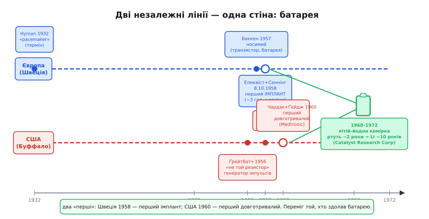
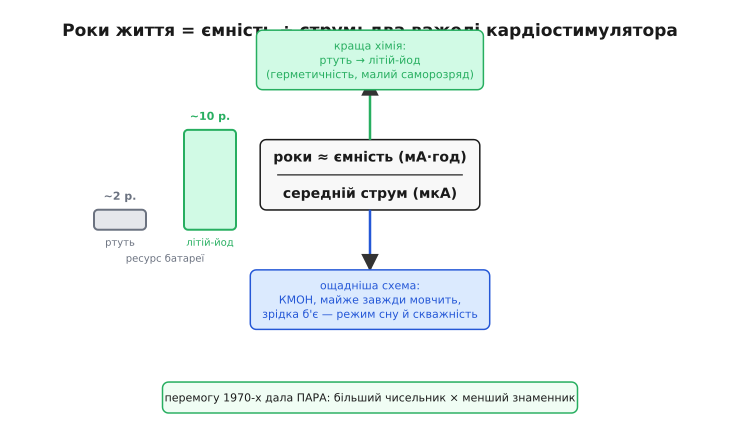

# 📜 Кардіостимулятор і батарейка: як примусити одну комірку жити роками

> Ця історія веде наскрізною ниткою навколо одного питання: коли пристрій мусить роками жити від однієї маленької батарейки, кожен мікроампер стає питанням виживання — буквально, бо йдеться про прилад у грудях людини. Тут зійшлись дві незалежні лінії — шведська і американська — й обидві вперлись у ту саму стіну. Об'єднала їх не геніальна ідея, а хімія однієї маленької батарейки. А почалося все зі звичайного «не того резистора».

Уявімо мікроконтролер, що вміє рахувати час у глибокому сні від [годинника реального часу](topic:programming/rtc), прокидатися на переривання, реагувати за мілісекунди. Постає інше питання: а скільки він проживе від батарейки? Формула проста: ємність у мА·год поділити на середній споживаний струм у мА, і отримати години. Але ця проста формула набуває зовсім іншої ваги, коли система, яку ти проєктуєш, не може зупинитись і підзарядитись. Є клас пристроїв, де «розрядилась батарея» означає смерть пацієнта. Кардіостимулятор — найчистіший такий приклад в усій історії техніки, і його інженери першими змушені були прожити в режимі «кожен мікроампер коштує тижнів або місяців чийогось життя».

Чому ця історія цікава саме інженеру автономних систем, а не лише медику чи хіміку? Тому що все, на чому тримається автономне живлення — режими сну, пробудження за таймером, скважність, струм спокою, математика ємності — все це інженери кардіостимулятора 1950–70-х років відкрили під іншими іменами і з незрівнянно вищими ставками. У них не було вибору: або прилад спить майже весь час і лише зрідка б'є імпульс — або батарея вмирає раніше за пацієнта.

*Дві незалежні лінії — Швеція і США — і спільна стіна: батарея. Перемогу дала не гонка «хто перший», а хімія нової комірки.*

---

## Серце як електрична машина: чому збій ритму вбиває

Серце — це не насос, що б'ється «сам по собі». Це насос, яким керує власна вбудована електрика. У правому передсерді є синусовий вузол — скупчення клітин, що самостійно генерують слабкий електричний імпульс близько 70 разів на хвилину. Цей імпульс проходить провідною системою серця — спеціалізованими волокнами — і змушує шлуночки синхронно скорочуватись і штовхати кров. Синусовий вузол — це природний генератор; провідна система — «дроти» до насоса. Поки дроти цілі, насос б'ється рівно.

Але ця провідна система може зламатися. Одна з найпоширеніших і найнебезпечніших поломок — AV-блокада (atrioventricular block): передсердний генератор продовжує відраховувати свої 70 ударів, але сигнал не доходить до шлуночків. Шлуночки тоді переходять на власний, аварійний ритм — близько 20–30 ударів на хвилину. Цього катастрофічно мало для нормального кровопостачання мозку. Людина непритомніє від раптового падіння тиску — і якщо ритм не відновлюється, помирає. Цей стан ще в XIX столітті описали лікарі Адамс і Стокс — і він зберіг їхнє ім'я: синдром Адамса–Стокса.

Чому ця задача для електроніки, а не для ліків? Тому що серцю бракує не «стимулятора» у хімічному сенсі, а рівних, ритмічних електричних поштовхів — точно таких, які не можуть дійти через пошкоджені провідні шляхи. Ліки можуть прискорити або сповільнити серце загалом, але не можуть замінити провідну систему. А от схема — може. По суті потрібен звичайний таймер із виходом: рівні імпульси через рівні проміжки часу, нескінченно.

> 🔧 **Навіщо це.** «Давати рівний імпульс щосекунди роками, не зупиняючись» — це і є екстремальний випадок енергетичного бюджету. Якщо ти можеш розв'язати цю задачу для пристрою, що живить серце від однієї батарейки, ти розумієш про автономне живлення майже все. А інженери це зробили — через помилки, глухі кути і одне несподіване відкриття.

Але спочатку машини, що вирішували цю проблему, були величезні й тягнулись дротом до розетки — і це вбивало по-іншому.

---

## Перші стимулятори: ящик на коліщатах і смерть від розетки

Сам термін «pacemaker» (водій ритму) з'явився ще 1932 року, коли американський лікар Альберт Гайман (Albert Hyman) назвав так свій громіздкий апарат — металевий ящик із двигуном, що заводився вручну, як газонокосарка. Гайман не вигадав ні електричної стимуляції (австралієць Марк Лідвілл і Едгар Бут продемонстрували перший прилад ще у 1926–28 роках), ні транзисторного підсилювача — але слово «pacemaker» залишилось. Так у технічну лексику потрапив термін із легкоатлетики, де «pacemaker» — це той, хто задає темп бігу іншим.

До середини 1950-х усі зовнішні стимулятори живились від мережі 220 або 110 В. Це означало: прилад постійно прив'язаний до розетки; пацієнт не може встати з ліжка; а найголовніше — будь-який збій у мережі означає зупинку приладу. Саме таке сталося в американській лікарні: під час аварійного відключення електрики дитина на мережевому стимуляторі загинула. Цей випадок, як розповідав пізніше Ерл Баккен (Earl Bakken, засновник Medtronic), перевернув його уявлення про те, яким повинен бути прилад.

У 1957 році Баккен зробив перший носимий транзисторний стимулятор: невеличка коробочка, що живилась від батарейок і кріпилась на тілі пацієнта. Дроти все ще йшли крізь шкіру до серця — через них могла потрапити інфекція — але прилад більше не залежав від розетки.

> 🔧 **Навіщо це.** «Живлення від мережі» проти «від батареї» — той самий вибір, через який [плата з USB-живленням](root:embedded/board-consumption) не годиться для автономних пристроїв: мережа дає необмежену потужність, але прив'язує; батарея звільняє, але вводить бюджет. Решта цієї історії — про ціну тієї свободи.

Наступний крок: сховати все під шкіру, прибрати зовнішні дроти і зробити пристрій дійсно автономним. І тут, незалежно один від одного, в один і той самий рік до мети підійшли дві команди на двох континентах.

---

## Стокгольм, 1958: Елмквіст, Сеннінг і прилад у пластиковій чашці

Руне Елмквіст (Rune Elmqvist, 1906–1996) — людина незвичайної долі: за освітою лікар, за покликанням — інженер. Ще в 1940-х роках він винайшов портативний струменевий ЕКГ-самописець, що фіксував удари серця прямо на паперовій стрічці — замість попередніх громіздких гальванометрів. Коли в середині 1950-х Елмквіст розпочав роботу зі шведською компанією Elema-Schönander, його запросив до співпраці кардіохірург Оке Сеннінг (Åke Senning, 1915–2000) — один із найвидатніших хірургів Каролінської лікарні у Сольні під Стокгольмом.

Пацієнт, якому потрібна була ця операція, — Арне Ларссон (Arne Larsson). Йому було 43 роки, і через повну AV-блокаду його серце билося близько 28 разів на хвилину — вдвічі менше за норму. Він кілька разів на день непритомнів. Дружина Арне, Ельзе, наполягла: треба спробувати. Вона чула про досліди Елмквіста і ходила до нього особисто.

8 жовтня 1958 року — таємно, вночі, щоб уникнути бюрократичних заборон — Сеннінг імплантував перший у світі повністю вбудований кардіостимулятор. Сам пристрій Елмквіст виготовив буквально вручну: два транзистори, кілька конденсаторів і резисторів, залиті епоксидною смолою в пластикову чашку від кухонного начиння. Розміром із сигаретну пачку.

Живлення — нікель-кадмієві акумулятори. Але вже на самому початку інженери зрозуміли, що батарея є головною проблемою: вона замала, щоб прослужити роки. Тому Елмквіст закладив у конструкцію зарядну котушку: зовнішній трансформатор прикладали до шкіри над приладом, і той заряджався індуктивно, без дротів і проколів. Ідея була геніальна — але, як виявилось, передчасна.

Перший прилад пропрацював близько трьох годин. Схема дала збій. Другий — шість тижнів. Потім знову збій, нова операція, новий пристрій. І так далі. За своє життя Арне Ларссон переніс від 26 до 30 замін приладу — точна кількість залежить від джерела. Він прожив до 2001 року — пережив і Руне Елмквіста, який помер у 1996-му, і Оке Сеннінга, який помер у 2000-му. Пацієнт пережив обох своїх лікарів.

Треба бути точними щодо «першості»: Стокгольм-1958 — це перший повністю імплантований пристрій. Але не довговічний і не тиражований. Він довів, що концепція можлива — і показав з усією ясністю, де знаходиться головна перешкода. За океаном до тієї ж стіни підійшли іншою дорогою — і через помилку.

---

## Буффало, 1956: «не той резистор» — як помилка заспівала ритмом серця

Вілсон Ґрейтбатч (Wilson Greatbatch, 1919–2011) — радіотехнік, що прийшов у медицину збоку. Він служив у флоті радистом, потім вивчав електроніку в Корнеллі і на початку 1950-х почав працювати в психіатричній лікарні — де вперше почув від кардіологів про проблему AV-блокади. Захопившись, він вирішив сконструювати прилад, що записував би звуки серця для клінічного аналізу — по суті, вдосконалений мікрофонний підсилювач.

Восени 1956 року Ґрейтбатч збирав черговий варіант схеми. Потягнувся до ящика з радіодеталями по резистор — і, не дивлячись, узяв не ту деталь: близько 1 МΩ замість потрібних 10 кΩ. Кольорові смуги на малих резисторах тоді нерідко плутали — особливо коли поспішали. Схема замість того, щоб підсилювати сигнал, почала самостійно генерувати імпульси: поштовх близько 1,8 мілісекунди — і потім майже секунда тиші. І знову. Ритмічно, рівно, невпинно.

Ґрейтбатч завмер. Він одразу впізнав цей ритм — той самий, що кардіологи шукали роками: частота близька до нормального серцевого ритму, короткий поштовх достатньої амплітуди, довга пауза між імпульсами. Збоку це виглядало як казкова вдача, але насправді тут є своя логіка: великий резистор у поєднанні з конденсатором дав велику сталу часу RC — а це означає рідкісні, але чіткі розряди-сплески. Більший опір → довша стала часу → рідші імпульси → менше енергії між ударами. Та сама інтуїція, що лежить в основі [скважності циклу](root:embedded/duty-cycle-current): рідкість подій — це ощадність.

Варто назвати статус цієї оповіді чесно: «не той резистор» — це власна розповідь самого Ґрейтбатча, задокументована в його мемуарах і численних інтерв'ю, що він давав протягом десятиліть. Вона добре підтверджена і не оскаржується серйозними дослідниками — але це все одно оповідь від першої особи, а не лабораторний протокол. Вона цілком достовірна і красива — і саме тому вона так міцно увійшла в легенду інженерної помилки, що стала відкриттям.

Ґрейтбатч пригадав, що кардіологи давно шукали пристрій з такими характеристиками. Він відклав попередній проєкт і взявся за новий. Закладений будинок, дві тисячі доларів позики, робота в сараї на задньому дворі — людський масштаб початку великої справи. Але сам імпульс — це лише половина справи. Щоб прилад надовго ліг у груди людини, потрібне було живлення, що не вимагає хірурга для заміни кожні кілька місяців.

---

## Буффало, 1960: Ґрейтбатч, Чардак і Ґейдж — перший, що прижився надовго в США

У 1958 році Ґрейтбатч показав свій прилад хірургу Вільяму Чардаку (William Chardack) у госпіталі ветеранів у Буффало. Чардак погодився співпрацювати — спочатку скептично, потім дедалі ентузіастичніше. До команди приєднався анестезіолог Ендрю Ґейдж (Andrew Gage).

Перші досліди були на собаках: у 1958 році команді вдалось повністю контролювати серцевий ритм тварини за допомогою імплантованого пристрою — і тримати цей контроль стабільно. Це була перша тривала демонстрація того, що ідея працює не лише в схемі, а й у живому організмі. До 1960 року команда провела серію імплантацій на людях. Перший дорослий пацієнт — 77-річний чоловік з повною AV-блокадою — прожив ще 18 місяців.

Відмінність від шведського досвіду була принциповою для майбутнього галузі. Елмквіст і Сеннінг довели, що імплант можливий — «диво один раз». Ґрейтбатч, Чардак і Ґейдж рухались у бік масштабування: самодостатній прилад із передбачуваним ресурсом, що його можна ставити тисячам пацієнтів. У 1960 році Medtronic придбала ліцензію на пристрій Ґрейтбатча — і він пішов у серійне виробництво. Від «диво один раз» до «продукт, що живе в мільйонах людей» — перший крок.

Але тут уся індустрія, і шведська, і американська, вперлась у ту саму стіну. Не в схему, не в хірургічну техніку — у батарею.

---

## Стіна, в яку вперлися всі: ртутна батарея, що зраджувала

Близько 1960 року найкращим доступним джерелом живлення для медичних імплантів були цинк-ртутні елементи — так звані елементи Рубена-Меллорі (Ruben-Mallory). Порівняно з іншими батарейками того часу вони мали непогану питому ємність і достатньо стабільну напругу. Але для імплантованого кардіостимулятора «непогано» означало «замало».

Перша проблема — ресурс. Ртутна комірка в реальних умовах слугувала від півтора до двох років. Це означало: кожні 18–24 місяці пацієнт мусив іти на операцію заміни приладу. Кожна операція — ризик анестезії, ризик інфекції, психологічний стрес. Не катастрофа, але й не рішення.

Друга проблема виявилась несподіванішою і технічно цікавішою. Цинк-ртутна комірка під час розряду виділяє водневий газ. Якщо зварити корпус стимулятора наглухо — газ накопичиться і розірве оболонку. Якщо залишити невеличкий дренажний отвір — крізь нього потрапляє волога тіла і повільно руйнує електроніку. Будь-який вибір — компроміс між двома способами загибелі. До того ж ртутна батарея мала схильність до раптових відмов наприкінці ресурсу: напруга трималась майже до останнього, а потім різко падала — без попередження. Для лікарів це було найгіршим: вони не могли заздалегідь знати, коли настане час операції.

Інженери шукали обхідні шляхи. Один із найекзотичніших — ядерні стимулятори на основі плутонію-238: вони справді з'явились у клінічній практиці в 1970-х і справді могли слугувати десятиліттями без заміни. Але радіоактивний імплант у живій людині — це регуляторний і логістичний кошмар: особливий паспорт для пацієнта, обмеження під час авіаперельотів, спеціальна утилізація після смерті. Глухий кут. Перезарядні системи — як у Елмквіста — теж виявились незручними на практиці: пацієнт мав щодня або щотижня носити із собою зарядну котушку і регулярно прикладати її до грудей. Надто обтяжливо для щоденного побуту.

> 🔧 **Навіщо це.** Ось тут народжується вся мова енергобюджету. «Скільки років проживе прилад» — це рівно та сама формула: ємність у мА·год поділити на середній споживаний струм у мА. Щоб додати роки до числника цього дробу — треба краща хімія. Щоб зменшити знаменник — ощадніша схема. Інженери кардіостимулятора в 1960-х вперше почали свідомо і систематично тиснути на обидва важелі одночасно. Точну математику часу служби розгортає сусідня вставка [«Математика батарейного бюджету»](topic:programming/battery-budget/math-battery-math.md).

Розв'язок чисельника прийшов від нової хімії — і по неї Ґрейтбатч пішов сам.

---

## Літій-йодна комірка: батарея, що подарувала роки

На початку 1970-х Вілсон Ґрейтбатч, вже не пов'язаний контрактом із Medtronic, заснував власну компанію і почав системно шукати хімію батарейки, що задовольнить медичні вимоги. Ще у 1968 році він вийшов на балтиморську компанію Catalyst Research Corporation, де дослідники Мозер і Шнайдер (Moser and Schneider) розробили літій-йод-PVP елемент — полівінілпіридин як матрицю для йоду. Ґрейтбатч ліцензував технологію і протягом кількох років довів її до стандарту, придатного для застосування в кардіологічних імплантах.

Важливо зробити тут точну атрибуцію, якої ця галузь часто потребує: Ґрейтбатч не винайшов літій-йодну хімію — він узяв готову розробку, відшліфував і впровадив її в медичний продукт. Це колективне відкриття: фундаментальна хімія — одна команда, інженерна реалізація — інша. Обидва внески реальні і обидва необхідні.

Чому ж літій-йодна комірка виявилась настільки ідеальною для імплантів — і лишається стандартом досі? У неї є кілька властивостей, що прямо вирішують проблеми, які нас переслідували.

По-перше, твердий електроліт. Між катодом (йод) і анодом (літій) під час роботи сам наростає тонкий шар йодиду літію (LiI) — він і є електролітом. Жодної рідини, жодних розчинів. Немає рідини — немає газовиділення. Немає газовиділення — можна зварити корпус наглухо, в титан, герметично, назавжди. Жодного дренажного отвору, жодного шляху для вологи.

По-друге, надзвичайно малий саморозряд. Комірка майже не розряджається в стані спокою. Практично вся накопичена ємність іде на корисну роботу, а не «випаровується» в очікуванні. Для тривалого імпланту це означає: паспортна ємність і реальна майже збігаються.

По-третє, і це найважливіше для клінічного застосування: напруга і внутрішній опір змінюються під час розряду плавно і передбачувано. Стимулятор може постійно вимірювати ці параметри і за кілька місяців до кінця ресурсу сигналізувати лікарю: «пора на планову заміну». Раптових відмов приладу більше немає. Кінець батареї перестав бути небезпекою — він став керованою подією.

Результат у числах: якщо ртутна комірка давала приладу близько двох років, то літій-йодна — близько десяти. До 1972–1973 року такі стимулятори вийшли на ринок і почали масово імплантуватись. Рівняння з дробом нарешті почало давати прийнятні відповіді.

Але була ще й друга частина перемоги — та, що зменшувала знаменник. Паралельно з новою хімією розробники переходили на КМОН-логіку (CMOS) — схемотехніку, де транзистори у статичному стані споживають надзвичайно мало. Стимулятор тепер більшість часу просто мовчав — і лише зрідка, раз на секунду, давав короткий поштовх. Це та сама ідея [скважності](root:embedded/duty-cycle-current) і [режимів глибокого сну](topic:programming/sleep-modes): прилад «спить» 99,8% часу і «прокидається» лише на мить імпульсу. Перемогу 1970-х дала пара: краща батарея разом з ощаднішою схемою — обидва важелі одночасно.

Літій-йодна комірка донині залишається стандартом у кардіостимуляторах — це рідкісний приклад хімії, що залишилась незмінною пів століття саме завдяки своїй передбачуваності. В електроніці — де технології змінюються щороку — таке постійство говорить само за себе.

*Додати роки — це або більший чисельник (краща хімія), або менший знаменник (ощадніша схема). Перемога 1970-х — обидва разом.*

---

## Що з цього лишилось нам: мова енергобюджету

Що саме ці люди — зі своїми чашками з епоксидом, сараями і переплутаними резисторами — лишили інженерії як інструментарій?

Інженери кардіостимулятора першими в історії техніки справді жили в режимі «кожен мікроампер коштує тижнів чийогось життя». Їм не можна було округлювати з запасом і не можна було додати резервний блок живлення. І вони відкрили — кожен по-своєму, через різні глухі кути — ті самі прийоми, що сьогодні мають сучасні імена:

- «батарея — головне обмеження» → бюджет мА·год ÷ середній струм;
- «схема має майже завжди мовчати і лише зрідка діяти» → [режими глибокого сну](topic:programming/sleep-modes) і [скважність циклу](root:embedded/duty-cycle-current);
- «герметизація, струм спокою, саморозряд» → чому [стабілізатор і плата теж «їдять»](root:embedded/board-consumption) і чому струм спокою — це вирок для автономного пристрою;
- «передбачуваний кінець ресурсу» → чесне [вимірювання профілю струму](root:embedded/measure-consumption) і моніторинг батареї;
- «два важелі: ємність × ощадність» → повна математика часу служби в сусідній вставці [«Математика батарейного бюджету»](topic:programming/battery-budget/math-battery-math.md).

Той самий мотив «бюджету, що невпинно тане», звучить і в сусідній історії [про «Вояджерів»](topic:programming/current-paths/hist-voyager.md): там джерело не літій-йодна комірка, а тепло від розпаду плутонію, і рахунок не на роки під шкірою, а на десятиліття в міжзоряному просторі. Дві крайнощі одного й того самого питання.

Арне Ларссон дожив до 2001 року, переживши близько тридцяти приладів і обох своїх лікарів. Вілсон Ґрейтбатч помер у 2011-му, вважаючи кардіостимулятор лише одним із своїх більш як 150 патентів. Прилад, що починався з «не того резистора» і чашки епоксиду в буффальському сараї, нині щомиті б'ється в мільйонах грудей по всьому світу — і кожен удар, хоч і непомітно, утілює те, заради чого взагалі існує енергобюджет: як змусити крихітну батарейку жити роками, коли іншого вибору немає.
