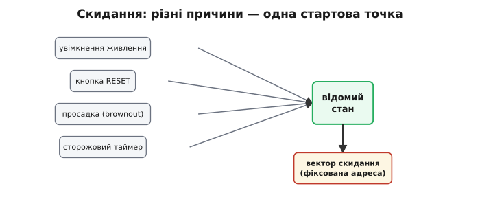
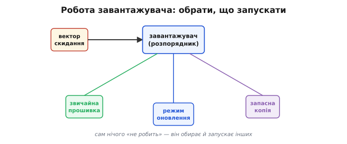
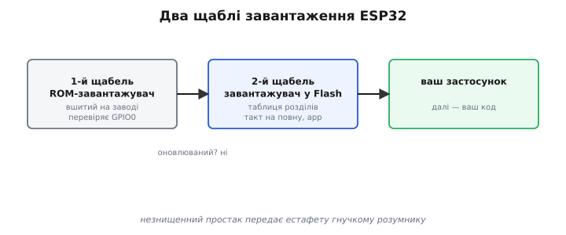
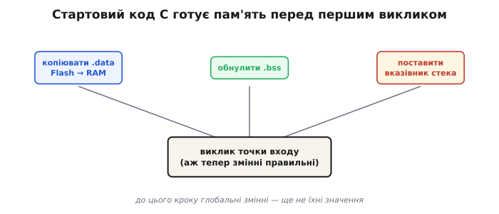
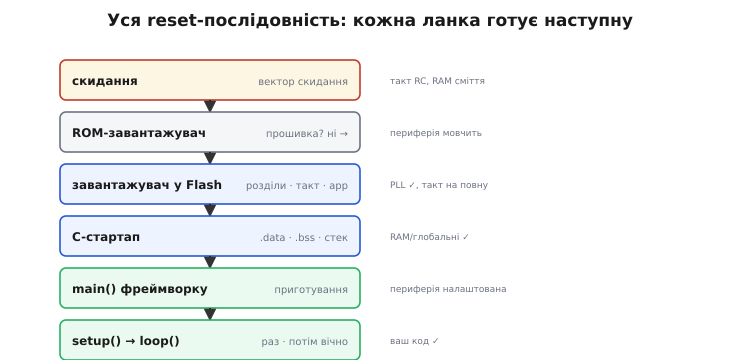
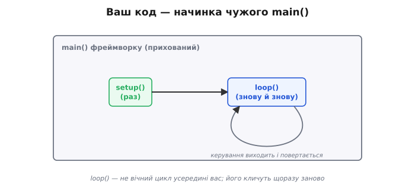

# Bootloader

Між миттю, коли на чіп подали живлення, і першим рядком вашого коду пролягає ціла невидима дорога. Всупереч наївному уявленню, процесор після ввімкнення **не стрибає** одразу у вашу програму. Спершу відпрацьовує **завантажувач** (*bootloader*, від *bootstrap loader* — «програма, що піднімає систему за власні шнурки», з англійського ідіоматичного *to pull oneself up by one's bootstraps*): маленька програма, чия єдина робота — вирішити, що запускати, підготувати ґрунт і передати керування далі. А за нею — ще кілька непомітних помічників, аж доки керування дійде до вашого `setup()`.

Розуміючи, хто й коли передає керування, ви впевнено даєте раду цілому класу збоїв, що інакше скидаються на чорну магію: чому плата «крутиться» в перезапуску, чому щось працює лише з другого ввімкнення, чому до `setup()` нічого не варто чіпати. Ця тема розкладає «оживання» чипа на прості, передбачувані кроки — і заразом показує, **на що можна (і не можна) покладатися** у різні моменти старту.

> 🔧 **Навіщо це.** Найчастіша користь — діагностика **завантажувального циклу** (*boot loop*), коли плата раз за разом перезапускається. Це майже завжди означає збій на ранньому кроці (у вашому `setup()` чи навіть раніше): чіп скидається, і все починається спочатку, по колу. Хто бачить ланцюг старту наскрізь, той шукає винного від початку — чи не звертаєтесь до периферії, яку ще не ввімкнули, чи не покладаєтесь на щось, не готове на цьому кроці.

### Скидання (reset): з чого все починається

Дорога починається зі **скидання** (*reset*, від англійського *to set again* — «наставити заново») — універсального «почати з чистого, відомого стану». Воно стається при ввімкненні живлення, а ще — від кнопки RESET чи особливих подій. У мить скидання ядро **примусово** приводять до відомого стану й змушують почати виконання з однієї наперед визначеної адреси — її звуть **вектором скидання** (*reset vector*). Тоді ж заводиться й [такт](topic:programming/clock-power). Чіп у цю мить **не знає** ані вашої програми, ані що йому робити — він знає лише **одне**: звідки почати. За тією адресою хтось завбачливо поклав першу сходинку.

Скидання буває з різних причин, і знати їх корисно. Найзвичніше — **ввімкнення живлення** (*power-on reset*). Але чіп скидається й тоді, коли напруга живлення **просіла** нижче безпечної (*brownout*) — щоб не «з'їхати з глузду» на голодному пайку; коли спрацював [**сторожовий таймер**](topic:programming/watchdog), бо програма зависла; або коли скидання попросив сам код. Хай яка причина, наслідок один: усе починається **з тієї самої відомої точки**. У цьому й сенс «відомого стану»: байдуже, що було до скидання — після нього чіп завжди в тому самому, передбачуваному вихідному положенні, звідки можна впевнено стартувати.


*Скидання — стартовий постріл. Хай що його викликало (живлення, кнопка, просадка, сторожовий таймер), ядро примусово стає у відомий стан і починає виконувати код із однієї фіксованої адреси — вектора скидання. Чіп не «знає» вашої програми; він знає лише, звідки почати.*

### Завантажувач: хто вирішує, що запускати

За вектором скидання сидить не ваша програма, а завантажувач — той розпорядник, що зустрічає чіп одразу після пробудження й каже: «так, цього разу запускаємо ось цю програму — я її зараз і підготую». Сам по собі він нічого корисного не «робить»: його ремесло — **обрати** й **запустити** інших.


*Робота завантажувача. За вектором скидання — не ваш код, а маленький розпорядник: він вирішує, що цього разу запускати, готує найнеобхідніше й передає естафету обраній програмі.*

А навіщо взагалі цей зайвий посередник — чому б ядру після скидання не стрибнути прямо у вашу програму? Бо завантажувач дає дорогоцінну **гнучкість**. Це він вирішує, що цього разу запускати: звичайну прошивку — чи режим **оновлення**, коли треба прийняти й записати [новий образ «по повітрю»](topic:programming/ota-update). Це він може мати **запасний** план, якщо основна прошивка зіпсована, і відкотитися до робочої версії. Зашити цей вибір намертво у вашу програму було б і незручно, і небезпечно: тоді одна крива прошивка — і чіп уже не оживити. Окремий розпорядник, що стоїть **перед** вашим кодом і завжди надійний, рятує від цього.

> 🔌 **А як завантажувач дізнається, що цього разу — прошивка?** За рівнем піна **IO0** у мить скидання (strapping). Як це влаштовано й як плата вводить чіп у режим завантаження сама — двома транзисторами на DTR/RTS — у вставці [Strapping-піни і схема авто-прошивки](topic:programming/bootloader/comp-strapping.md).

### Два щаблі завантаження на ESP32

На ESP32 цей розпорядник — насправді **двоступеневий**.

- **Перший щабель — ROM-завантажувач** (заводський, вшитий у ROM — той, що [приймає прошивку через USB](topic:programming/flashing)). Прокинувшись, він першим ділом дивиться на завантажувальну ніжку (GPIO0): затиснута — лізти в режим прошивки й слухати ПК; ні — звичайний запуск. У звичайному разі він читає з фіксованого місця Flash **заголовок** наступного помічника, з нього дізнається, скільки й куди вантажити, і піднімає той код у пам'ять. Якщо штатний шлях завантаження зірветься, ROM-код може спробувати запасний (recovery) розділ за адресою, заданою в eFuse.
- **Другий щабель — завантажувач у Flash** (його туди залив тулчейн одним зі [шматків образу](topic:programming/flashing)). Він уже розумніший: читає [**таблицю розділів**](topic:programming/partition-table) (де у Flash що лежить; її цілість стереже контрольна сума MD5), знаходить ваш застосунок, остаточно налаштовує [такт](topic:programming/clock-power) (виводить PLL на робочі мегагерци) і **передає керування** вашому образу. Тонкощі флешу (частоту, режим) він бере вже із заголовка **обраного застосунку**, а не зі свого власного — саме тому оновлення може ці параметри змінювати.


*Двоступеневе завантаження ESP32. Перший щабель — ROM-завантажувач: перевіряє GPIO0 і, якщо запуск, дістає з Flash наступного. Другий щабель — завантажувач у Flash: читає таблицю розділів, знаходить застосунок, виводить такт на робочу частоту й передає керування образу.*

Чому ж аж **два** щаблі, а не один? Тому що в них різні чесноти, і потрібні обидва. Перший, ROM-завантажувач, незмінний і вшитий на заводі — він **завжди є** й ніколи не псується (його головний козир), але саме через незмінність він простий і небагато вміє. Другий лежить у **Flash** — тож його, навпаки, можна **оновлювати** й робити скільки завгодно розумним: розуміти таблицю розділів, обирати з кількох прошивок, тонко налаштовувати такт і пам'ять. Виходить найкраще з двох світів: незнищенний простак, що завжди підхопить чіп, передає естафету гнучкому розумнику, якого не страшно вдосконалювати.

> 🔧 **Навіщо це.** Саме гнучкий другий щабель робить можливим **безпечне оновлення з відкотом**. Прошивка живе не в одному, а у двох рівноправних розділах — `ota_0` і `ota_1` (банки). Новий образ завжди пишуть у **незадіяну** банку, а діючу не чіпають; коли запис перевірено, маленький розділ `otadata` (службовий, подвоєний заради стійкості до зникнення живлення) перемикають на нову банку — і наступне завантаження піде вже з неї. Зірвалось оновлення посеред запису — діюча банка ціла, чіп просто стартує по-старому. Цей вибір банки робить за вас другий щабель завантажувача, читаючи `otadata`.

### C-стартап: підготувати пам'ять перед main()

Та навіть діставши керування, ваш образ ще **не** одразу біжить вашим кодом. Першим у ньому відпрацьовує крихітний [**стартовий код мови C**](topic:programming/c-runtime) (*C runtime startup*; історично його звуть `crt0`, від *C run-time zero* — «нульовий», бо біжить найпершим). Він робить службові приготування, без яких змінні були б сміттям:

- **копіює `.data`** з Flash у RAM (початкові значення займають свій «дім»);
- **обнуляє `.bss`** (нульові змінні й буфери);
- ставить **вказівник стека** на місце (готує стек до викликів);
- довершує дрібні апаратні приготування.

І лише **тоді**, коли пам'ять у порядку, він викликає **точку входу** вашої програми.


*Останній помічник перед вашим кодом — стартовий код мови C. Він копіює `.data` з Flash у RAM, обнуляє `.bss`, ставить вказівник стека — і лише коли всі змінні мають правильний початок, викликає точку входу програми. Ось чому до цього кроку покладатися на значення глобальних змінних не можна.*

Чому **стек** ставлять одним із найперших? Бо без нього неможливий жоден виклик функції: [стек](topic:programming/stack-lifo) — це місце, де зберігаються адреси повернення й локальні змінні. Поки вказівник стека не вказує на справжню вільну RAM, навіть простий виклик підпрограми звалив би машину. Тому стартовий код спершу готує саме його — і лише потім дозволяє собі викликати щось серйозне, зокрема точку входу.

Щоб це не лишалось абстракцією, ось як та сама робота виглядає в коді. Майже завжди її пише за вас тулчейн, але вона коротка, і її варто побачити очима.

**Стартовий код, що готує пам'ять і кличе точку входу (спрощено, для Cortex-M).**

```c
// Символи з лінкер-скрипта: межі секцій у RAM та джерело .data у Flash.
extern unsigned _sdata, _edata, _sidata;   // .data: куди, докуди, звідки (Flash)
extern unsigned _sbss,  _ebss;             // .bss:  нулі від _sbss до _ebss
extern int main(void);                     // точка входу застосунку

void Reset_Handler(void) {                 // сидить за вектором скидання
    // 1) копіюємо ініціалізовані глобальні змінні з Flash у RAM
    unsigned *src = &_sidata, *dst = &_sdata;
    while (dst < &_edata) *dst++ = *src++;

    // 2) обнуляємо .bss (усе, що має початок 0)
    for (dst = &_sbss; dst < &_ebss; ) *dst++ = 0;

    // 3) вказівник стека на цій архітектурі вже виставив сам процесор
    //    із першого слова таблиці векторів — тому далі можна викликати функції

    main();                                // 4) аж тепер змінні правильні — у застосунок
    for (;;) { }                           // main() не повертається; страхувальний цикл
}
```

Розгляньмо, що тут стається крок за кроком. Цикл (1) переносить у RAM початкові значення глобальних змінних — їхній «зразок» лежить у Flash за міткою `_sidata`. Цикл (2) забиває нулями область `.bss` — туди потрапили змінні без явного початку, які стандарт C зобов'язує бачити нульовими. Крок (3) на цій архітектурі вже зроблено апаратно: процесор узяв вершину стека з першого слова таблиці векторів ще до входу сюди. І тільки крок (4) — виклик `main()` — запускає вашу програму, коли пам'ять уже в порядку. Висновок прямий: усе, що звертається до глобальних змінних, мусить чекати **після** цих циклів — раніше там сміття, що лишилося від попереднього вмикання.

### Уся reset-послідовність

Зведені в одну картину, всі ланки від скидання до вашого `loop()` шикуються в чіткий ланцюг.


*Уся reset-послідовність. Скидання → вектор скидання → ROM-завантажувач → завантажувач у Flash (таблиця розділів, такт, застосунок) → C-стартап (`.data`/`.bss`, стек) → `main()` фреймворку → `setup()` (раз) → `loop()` (вічно). Кожна ланка готує наступну; жодна не «диво».*

Жодна ланка не творить чуда: одна приводить чіп до відомого стану, друга вирішує, що запускати, третя готує такт і знаходить ваш код, четверта лагодить пам'ять, п'ята загортає все у звичний `setup()`/`loop()`. Розкладене на ці прості кроки, «оживання» чипа стає прозорим — і тому не лякає, коли щось іде не так на котромусь із них.

### Де насправді ваші setup() і loop()

І остання, дуже корисна несподіванка. У світі Arduino ви пишете `setup()` і `loop()` — і звикли думати, що це і є початок програми. Насправді **ні**. Справжню точку входу — `main()` — надає сам **фреймворк** (ядро Arduino), і вона від вас прихована. Той `main()` робить трохи власних приготувань, **один раз** кличе ваш `setup()`, а тоді **вічно** в циклі кличе ваш `loop()`. Тобто ваш код сидить **усередині** фреймворкового `main()`, як начинка.


*Ваш код — начинка чужого `main()`. Фреймворк надає справжню точку входу `main()`: вона робить свої приготування, раз кличе ваш `setup()`, а тоді вічно крутить ваш `loop()`. Навіть «початок програми» — на щабель вищий, ніж здається.*

Тут ховається тонкість, важлива для всього, що ви писатимете. Ваш `loop()` — це **не** вічний цикл усередині вашої функції; навпаки, фреймворк кличе `loop()` знову й знову, **щоразу заново**. Керування раз у раз **виходить** із вашого `loop()` і повертається до фреймворку (який тим часом устигає зробити свої службові справи — обслужити радіо, скинути сторожовий таймер), а тоді знову заходить. Звідси й залізне правило: ніколи не «зависайте» в `loop()` назавжди — віддавайте керування назад. Цей вічний цикл «зайшов — вийшов» — найпростіша [модель виконання](topic:programming/super-loop), у якої є й [свої межі](root:embedded/super-loop-limits).

### Що готове, коли?

Найкорисніше, що дає це знання, — точна відповідь на питання «що готове, коли?». Кожна ланка вмикає свій шматок машини, тож на ранньому кроці працює ще не все:

```
КРОК                                  такт     RAM/глобальні   периферія   ваш код
──────────────────────────────────────────────────────────────────────────────────
1. скидання (вектор скидання)         RC       сміття          —           ні
2. ROM-завантажувач (1-й щабель)      RC       —               мінімум     ні
3. завантажувач у Flash (PLL, app)    PLL ✓    —               базова      ні
4. C-стартап (.data/.bss, стек)       PLL ✓    готові ✓        —           ні
5. main() фреймворку → setup()        PLL ✓    готові ✓        налаштов.   ТАК ✓
```

Згори вниз видно, як чіп **поступово оживає**. Спершу він тактується від грубого внутрішнього RC-генератора, у RAM сміття, периферія мовчить. Аж на третьому кроці такт виходить на повну (PLL). На четвертому нарешті стають правильними глобальні змінні. І лише на п'ятому — коли все готове — керування доходить до **вашого** `setup()`, де вже можна спокійно працювати. Звідси просте правило безпеки: чим **раніше** ви хочете щось зробити, тим менше можете на що покладатися. Дочекайтеся `setup()` — і весь чіп уже до ваших послуг. На щастя, у звичному коді ви й так починаєте з `setup()`, тож ця осторога спрацьовує сама собою.

> 🔧 **Навіщо це.** Чіп не лише скидається з різних причин — він **пам'ятає**, [чому скинувся](topic:programming/reset-causes), і вміє про це повідомити. Це безцінно для діагностики: плата перезапустилась через **brownout** — лагодьте живлення; через **сторожовий таймер** — шукайте, де програма зависла; просто «power-on» — отже, було чесне вимкнення. Тому, ловлячи примхливі перезапуски, першим ділом питають у самого чипа: а чому ти, власне, скинувся?

Уся ця послідовність триває лічені **мілісекунди**, яких ніхто й не помічає: натиснули RESET — і за мить уже блимає світлодіод, ніби нічого складного й не сталося. А сталося чимало: чіп привели до тями, обрали й знайшли прошивку, налагодили такт і пам'ять, загорнули код у звичну обгортку. Те, що все це **невидиме й майже миттєве**, — заслуга цілого ланцюга помічників, кожен із яких робить свою справу швидко й мовчки. У цьому ланцюгу зринув «фреймворк», що тихо надає `main()` і робить за вас купу приготувань; чи завжди потрібен цей посередник і скільки коштує його зручність — окреме питання [роботи з «голим залізом» проти фреймворку](root:embedded/baremetal-vs-framework).
