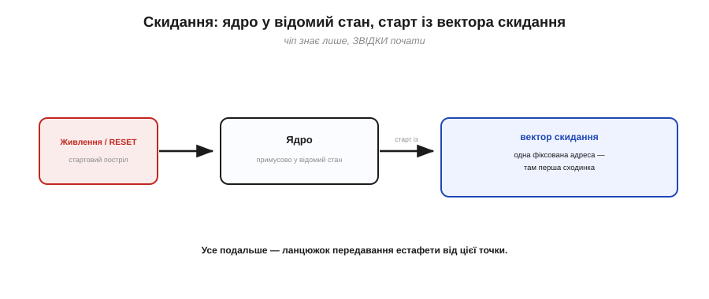
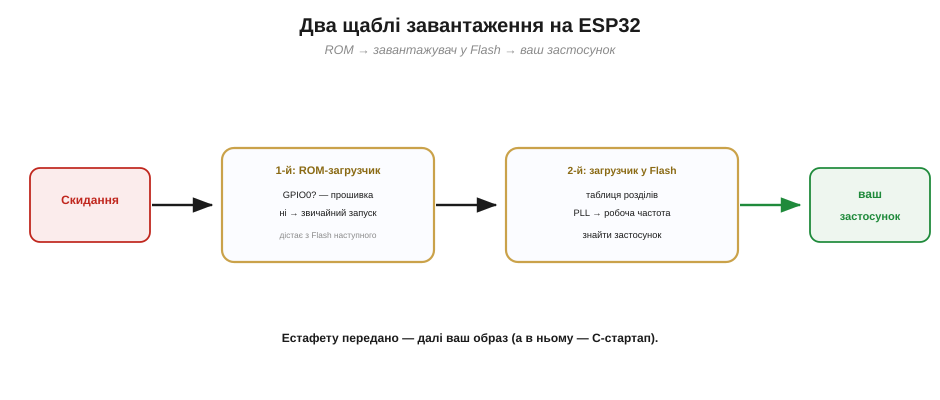

# Завантажувач (bootloader) і reset-послідовність (що виконується до main())

Готовий образ [лягає у Flash](book:programming/flashing), і в ньому є якийсь [«стартовий код, що відпрацьовує до `main()`»](book:programming/firmware-image). Час побачити повну картину тієї дивовижної миті — між **скиданням** і першим рядком вашого `setup()`. Бо, всупереч наївному уявленню, чіп після ввімкнення **не стрибає** одразу у ваш код. Спершу пробігає цілий **ланцюжок** помічників: кожен робить свій крок підготовки й передає естафету далі. Хто вони й навіщо — і є предмет цієї теми. А заодно ми зрозуміємо, **на що можна (і не можна) покладатися** у різні моменти старту.

Це не самі лише цікавинки «під капотом». Розуміючи, хто й коли передає керування, ви впевнено даєте раду цілому класу збоїв, що інакше здаються чорною магією: чому плата «крутиться» в перезапуску, чому щось працює лише з другого ввімкнення, чому до `setup()` нічого не варто чіпати. Тож пройдімо цей ланцюг по ланці.

### Скидання (reset): з чого все починається

Усе починається зі **скидання** (*reset*) — універсального «почати з чистого, відомого стану». Воно стається при ввімкненні живлення (а ще — від кнопки RESET чи особливих подій). У мить скидання ядро **примусово** приводять до відомого стану й змушують почати виконання з однієї наперед визначеної адреси — її звуть **вектором скидання** (*reset vector*). Тоді ж заводиться й [такт](book:programming/clock-power). Важливо: чіп у цю мить **не знає** ані вашої програми, ані що йому робити, — він знає лише **одне**: звідки почати. За тією адресою хтось завбачливо поклав першу сходинку.

Скидання, до речі, буває з різних причин, і знати їх корисно. Найзвичніше — **ввімкнення живлення** (*power-on reset*). Але чіп скидається й тоді, коли напруга живлення **просіла** нижче безпечної (*brownout*) — щоб не «з'їхати з глузду» на голодному пайку; коли спрацював [**сторожовий таймер**](book:programming/watchdog), бо програма зависла; або коли скидання попросив сам код. Хай яка причина, наслідок один: усе починається **з тієї самої відомої точки**. У цьому й сенс «відомого стану»: байдуже, що було до скидання, — після нього чіп завжди в тому самому, передбачуваному вихідному положенні, звідки можна впевнено стартувати.


*Рис. Скидання — стартовий постріл. При ввімкненні (чи від RESET) ядро примусово стає у відомий стан і починає виконувати код із однієї фіксованої адреси — **вектора скидання**. Чіп не «знає» вашої програми; він знає лише, **звідки почати**. Усе подальше — ланцюжок передавання естафети від цієї точки.*

### Завантажувач: хто вирішує, що запускати

За вектором скидання сидить не ваша програма, а **завантажувач** (*bootloader*) — невелика програма, чия єдина робота: **вирішити, що запускати**, підготувати ґрунт і **передати керування** далі. Це той розпорядник, що зустрічає чіп одразу після пробудження й каже: «так, цього разу запускаємо ось цю програму — ось вона, я її зараз і підготую».


*Рис. Робота завантажувача. За вектором скидання — не ваш код, а маленький **розпорядник**: він вирішує, що цього разу запускати (звичайну прошивку? режим оновлення?), готує найнеобхідніше й **передає естафету** обраній програмі. Сам по собі він нічого корисного не «робить» — він **запускає** інших.*

А навіщо взагалі цей зайвий посередник — чому б ядру після скидання не стрибнути прямо у вашу програму? Бо завантажувач дає дорогоцінну **гнучкість**. Це він вирішує, що цього разу запускати: звичайну прошивку — чи, скажімо, режим **оновлення**, коли треба прийняти й записати [новий образ «по повітрю»](book:programming/ota-update). Це він може мати **запасний** план, якщо основна прошивка зіпсована, — і відкотитися до робочої версії. Зашити цей вибір намертво у вашу програму було б і незручно, і небезпечно: тоді одна крива прошивка — і чіп уже не оживити. Окремий розпорядник, що стоїть **перед** вашим кодом і завжди надійний, рятує від цього.

> 🔌 **А як завантажувач дізнається, що цього разу — прошивка?** За рівнем піна **IO0** у мить скидання (strapping). Як це влаштовано й як плата вводить чіп у режим завантаження сама — двома транзисторами на DTR/RTS — у вставці [Strapping-піни і схема авто-прошивки](comp-strapping.md).

### Два щаблі завантаження на ESP32

На ESP32 цей розпорядник — насправді **двоступеневий**.

- **Перший щабель — ROM-завантажувач** (заводський, вшитий у ROM — той, що [приймає прошивку через USB](book:programming/flashing)). Прокинувшись, він першим ділом дивиться на завантажувальну ніжку (GPIO0): затиснута — лізти в режим прошивки й слухати ПК; ні — **звичайний запуск**. У звичайному разі він зчитує з Flash наступного помічника.
- **Другий щабель — завантажувач у Flash** (його туди залив тулчейн одним зі [шматків образу](book:programming/flashing)). Він уже розумніший: читає [**таблицю розділів**](book:programming/partition-table) (де у Flash що лежить), знаходить ваш застосунок, остаточно налаштовує [такт](book:programming/clock-power) (виводить PLL на робочі мегагерци) і **передає керування** вашому образу.


*Рис. Двоступеневе завантаження ESP32. **1-й щабель** — ROM-завантажувач: перевіряє GPIO0 (прошивка чи запуск) і, якщо запуск, дістає з Flash наступного. **2-й щабель** — завантажувач у Flash: читає таблицю розділів, знаходить ваш застосунок, виводить такт на робочу частоту й передає керування образу. Естафету передано — далі вже ваш код.*

Чому ж аж **два** щаблі, а не один? Тому що в них різні чесноти, і потрібні обидва. Перший, **ROM**-завантажувач, незмінний і вшитий на заводі — він **завжди є** й ніколи не псується (його головний козир), але саме через незмінність він простий і небагато вміє. Другий завантажувач лежить у **Flash** — тож його, навпаки, можна **оновлювати** й робити скільки завгодно розумним: розуміти таблицю розділів, обирати з кількох прошивок, тонко налаштовувати такт і пам'ять. Виходить найкраще з двох світів: незнищенний простак, що завжди підхопить чіп, передає естафету гнучкому розумнику, якого не страшно вдосконалювати.

### C-стартап: підготувати пам'ять перед main()

Та навіть діставши керування, ваш образ ще **не** одразу біжить вашим кодом. Першим у ньому відпрацьовує крихітний [**стартовий код мови C**](book:programming/c-runtime) (*C runtime startup*; історично його звуть `crt0`). Він робить службові приготування, без яких змінні були б сміттям:

- **копіює `.data`** з Flash у RAM (початкові значення займають свій «дім»);
- **обнуляє `.bss`** (нульові змінні й буфери);
- ставить **вказівник стека** на місце (готує стек до викликів);
- довершує дрібні апаратні приготування.

І лише **тоді**, коли пам'ять у порядку, він викликає **точку входу** вашої програми.


*Рис. Останній помічник перед вашим кодом — стартовий код мови C. Він копіює `.data` з Flash у RAM, обнуляє `.bss`, ставить вказівник стека — і лише коли всі змінні мають правильний початок, **викликає точку входу** програми. Ось чому до цього кроку покладатися на значення глобальних змінних не можна.*

Чому **стек** ставлять одним із найперших? Бо без нього неможливий жоден виклик функції: [стек](book:programming/stack-lifo) — це місце, де зберігаються адреси повернення й локальні змінні. Поки вказівник стека не вказує на справжню вільну RAM, навіть простий виклик підпрограми звалив би машину. Тому стартовий код спершу готує саме його — і лише потім дозволяє собі викликати щось серйозне, зокрема точку входу вашої програми.

### Повна reset-послідовність

Зведімо весь ланцюжок в одну картину — від скидання до вашого `loop()`.


*Рис. Уся reset-послідовність. **Скидання** → вектор скидання → **ROM-завантажувач** (прошивка? ні →) → **завантажувач у Flash** (таблиця розділів, такт, знайти застосунок) → **C-стартап** (`.data`/`.bss`, стек) → **main() фреймворку** → ваш **setup()** (раз) → **loop()** (вічно). Кожна ланка готує наступну; жодна не «диво».*

Озирніться на цей ланцюг — і зникне відчуття «дива». Жодна ланка не творить чуда: одна приводить чіп до відомого стану, друга вирішує, що запускати, третя готує такт і знаходить ваш код, четверта лагодить пам'ять, п'ята загортає все у звичний `setup()`/`loop()`. Розклавши «оживання» чипа на ці прості кроки, ви бачите його **наскрізь** — і тому не губитеся, коли щось іде не так на котромусь із них.

> 🔧 **Навіщо це.** Розуміючи цей ланцюг, ви не лякаєтесь однієї з найнеприємніших картин — **завантажувального циклу** (*boot loop*), коли плата раз за разом перезапускається. Це означає, що десь **на ранньому** кроці (у вашому `setup()` чи навіть раніше) стається збій, чіп скидається — і все починається спочатку, по колу. Знаючи послідовність, ви шукаєте винного від початку: чи не звертаєтесь до периферії, яку ще не ввімкнули; чи не покладаєтесь на щось, не готове на цьому кроці. Найперші рядки після старту мають бути **найнадійнішими** — бо помилка там валить усе ще до того, як ви встигнете щось побачити.

### Де насправді ваші setup() і loop()

І остання, дуже корисна несподіванка. У світі Arduino ви пишете `setup()` і `loop()` — і звикли думати, що це і є початок програми. Насправді **ні**. Справжню точку входу — `main()` — надає сам **фреймворк** (ядро Arduino), і вона від вас прихована. Той `main()` робить трохи власних приготувань, **один раз** кличе ваш `setup()`, а тоді **вічно** в циклі кличе ваш `loop()`. Тобто ваш код сидить **усередині** фреймворкового `main()`, як начинка.


*Рис. Ваш код — начинка чужого `main()`. Фреймворк (ядро Arduino) надає справжню точку входу `main()`: вона робить свої приготування, **раз** кличе ваш `setup()`, а тоді **вічно** крутить ваш `loop()`. Тому навіть «початок програми» — на щабель вищий, ніж здається.*

Тут ховається тонкість, важлива для всього, що ви писатимете далі. Ваш `loop()` — це **не** вічний цикл усередині вашої функції; навпаки, фреймворк кличе `loop()` знову й знову, **щоразу заново**. Тобто керування раз у раз **виходить** із вашого `loop()` і повертається до фреймворку (який тим часом устигає зробити свої службові справи — обслужити радіо, скинути сторожовий таймер), а тоді знову заходить. Звідси й залізне правило: ніколи не «зависайте» в `loop()` назавжди — віддавайте керування назад. Цей вічний цикл «зайшов — вийшов» — найпростіша [модель виконання](book:programming/super-loop), у якої є і [свої межі](book:programming/super-loop-limits).

### Простежмо готовність крізь старт

Найкорисніше, що дає це знання, — точна відповідь на питання «**що готове, коли?**». Простежмо ланцюг ще раз, дивлячись, що на кожному кроці вже працює, а на що покладатися ще зарано.

**Приклад (що готове на кожному кроці старту).**

```
КРОК                                  такт     RAM/глобальні   периферія   ваш код
──────────────────────────────────────────────────────────────────────────────────
1. скидання (вектор скидання)         RC       сміття          —           ні
2. ROM-завантажувач (1-й щабель)      RC       —               мінімум     ні
3. завантажувач у Flash (PLL, app)    PLL ✓    —               базова      ні
4. C-стартап (.data/.bss, стек)       PLL ✓    готові ✓        —           ні
5. main() фреймворку → setup()        PLL ✓    готові ✓        налаштов.   ТАК ✓
```

Прочитайте таблицю згори вниз — і побачите, як чіп **поступово оживає**. Спершу він тактується від грубого внутрішнього RC, у RAM сміття, периферія мовчить. Аж на третьому кроці такт виходить на повну (PLL). На четвертому нарешті стають правильними глобальні змінні. І лише на п'ятому — коли все готове — керування доходить до **вашого** `setup()`, де вже можна спокійно працювати. Ось чому будь-яка ваша дія належить саме сюди: раніше частина машини ще не прокинулась.

З цієї таблиці випливає й просте правило безпеки: чим **раніше** ви хочете щось зробити, тим менше можете на що покладатися. Дочекайтеся `setup()` — і весь чіп уже до ваших послуг; полізете раніше — ризикуєте звернутись до того, чого ще нема. На щастя, у звичному коді ви й так починаєте з `setup()`, тож ця осторога спрацьовує сама собою, без жодних зусиль із вашого боку.

> 🔧 **Навіщо це.** Чіп не лише скидається з різних причин — він **пам'ятає**, [чому скинувся](book:programming/reset-causes), і вміє про це повідомити. Це безцінно для діагностики: побачили, що плата перезапустилась через **brownout** — лагодьте живлення; через **сторожовий таймер** — шукайте, де програма зависла; просто «power-on» — отже, було чесне вимкнення. Тому, ловлячи примхливі перезапуски, першим ділом питають у самого чипа: а чому ти, власне, скинувся?

Уся ця послідовність триває лічені **мілісекунди**, яких ви ніколи й не помічаєте: натиснули RESET — і за мить уже блимає світлодіод, ніби нічого складного й не сталося. А сталося чимало: чіп привели до тями, обрали й знайшли прошивку, налагодили такт і пам'ять, загорнули ваш код у звичну обгортку. Те, що все це **невидиме й майже миттєве**, — заслуга цілого ланцюга помічників, кожен із яких робить свою справу швидко й мовчки.

Отже, між скиданням і вашим кодом пролягає чіткий ланцюг: вектор скидання → ROM-завантажувач → завантажувач у Flash → C-стартап → `main()` фреймворку → ваш `setup()`. Кожна ланка готує наступну, і жодна не чарівна. У цьому ланцюгу зринув «фреймворк», що тихо надає `main()` і робить за вас купу приготувань. Чи завжди потрібен цей посередник і скільки коштує його зручність — окреме питання [роботи з «голим залізом» проти фреймворку](book:programming/baremetal-vs-framework).

---
