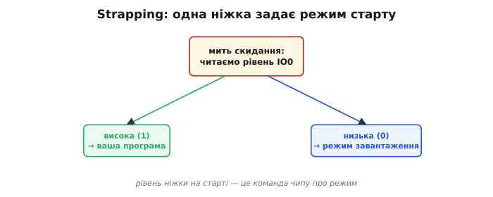
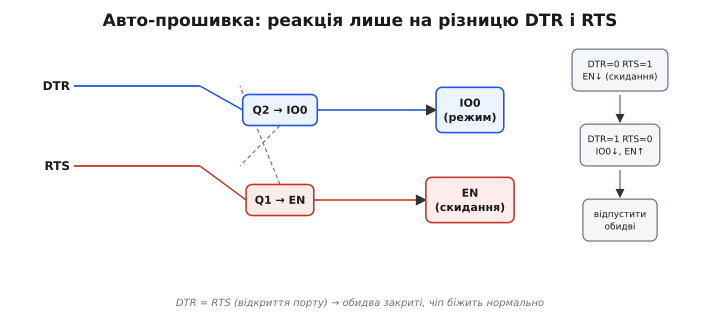

# 🔌 Strapping-піни і схема авто-прошивки

Чіп ESP32 уміє стартувати не лише у свою програму, а й у **режим завантаження** — коли він не біжить кодом, а чекає прошивку ззовні. Питання в тому, **як** він обирає цей режим і як плата вмикає його **сама**, без ручних маніпуляцій. Відповідь — у кількох особливих ніжках, які чіп опитує рівно в мить пробудження, і в маленькій, але дотепній схемі на двох транзисторах.

## Strapping-піни: рівень як команда на старті

Звідки чіп знає, що цього разу треба не бігти своєю програмою, а слухати прошивку? Він **підглядає** за кількома ніжками в **мить скидання**. Ці ніжки звуть **strapping-пінами** (англ. *strapping* — «пристібання», від *strap* — «ремінець, стяжка»: рівень на них наче «прив'язує» чіп до певного режиму). Їхній стан саме на старті чіп зчитує **один раз** і запам'ятовує як **команду** про режим; далі вони знову стають звичайними виводами.

Головна з них на ESP32 — **IO0** (GPIO0): якщо в момент reset вона **висока** (підтягнута вгору) — чіп запускає вашу прошивку; якщо її хтось **тримає низько** — чіп іде в режим завантаження. Низький рівень читається завдяки внутрішньому підтягуванню та зовнішній кнопці чи транзистору, що садить пін на землю.

*У мить скидання чіп читає IO0. Висока (1) → нормальний хід, ваша програма. Низька (0) → режим завантаження, чіп чекає прошивку. Є й інші strapping-піни (наприклад, що задають напругу живлення Flash), тому смикати їх на старті небезпечно.*

IO0 — не єдиний такий пін. Інші strapping-виводи задають дрібніші, але критичні речі: напругу, з якою чіп звертається до Flash (3.3 В чи 1.8 В), та джерело такту на самому початку. Помилитися тут дорого: якщо в мить скидання strapping-пін стоїть «не туди», чіп може взятися до Flash із неправильною напругою й не стартувати взагалі. Тому ці ніжки на платі або лишають вільними, або чіпляють до них лише те, що **не тягне** їх у хибний бік під час reset.

> 🔧 **Навіщо це.** Це найчастіша причина загадкового «плата не прошивається» або «не стартує після того, як я повісив давач на цей пін». Strapping-пін — звичайний GPIO **після** старту, але **на старті** його рівень важить особливо. Перш ніж зайняти IO0 (а надто інші strapping-виводи) під свою периферію, перевірте: чи не тягне ваше навантаження ніжку вниз у мить скидання? Світлодіод із підтяжкою на землю, давач, що активний одразу, дільник напруги — усе це може щоразу заводити чіп не в той режим. Правило просте: на strapping-піни вішають те, що в мить reset лишає їх у потрібному стані, або не вішають нічого.

## Проблема: як увійти в режим завантаження

Щоб залити прошивку, треба зробити дві речі **в потрібному порядку**: притиснути **IO0** до нуля — і **тоді** скинути чіп, смикнувши **EN** (вивід дозволу живлення ядра, *enable*; його ще звуть CHIP_PU). Уручну це й роблять двома кнопками: тримаєш **BOOT** (садить IO0 у 0), тиснеш і відпускаєш **EN** (скидання), відпускаєш BOOT. Чіп виходить зі скидання, бачить IO0 = 0 — і лишається в завантажувачі, готовий приймати образ.

Працює, але робити так перед кожним заливанням — морока. Хочеться, щоб плата вводила чіп у режим завантаження **сама**, на команду з комп'ютера. Тут і з'являється схема авто-прошивки.

## Схема авто-прошивки: два транзистори на DTR/RTS

Рішення елегантне. У USB-UART моста, через який плата спілкується з комп'ютером, є дві службові лінії — **DTR** (*Data Terminal Ready*) і **RTS** (*Request To Send*). Історично це сигнали керування модемом; у платі вони вільні для іншого вжитку. Їх заводять на **два транзистори** (зазвичай прості NPN, як-от S8050), що керують EN та IO0.

Та якщо з'єднати «в лоб» (DTR→IO0, RTS→EN), виходить халепа: щойно програма **відкриває порт**, операційна система зазвичай вмикає **обидві** лінії разом — і чіп випадково то скидається, то лізе в завантажувач. Будь-який монітор порту мимоволі викидав би плату в режим прошивки.

*Хитрість — у перехресті. Кожен транзистор спрацьовує лише тоді, коли DTR і RTS різні: один (на EN) — за одного співвідношення рівнів, другий (на IO0) — за протилежного. Якщо ж DTR = RTS (саме так буває при відкритті порту), обидва закриті, і чіп біжить нормально. Праворуч — послідовність, якою інструмент уводить чіп у завантажувач.*

Уся краса — у **перехресному** з'єднанні: емітер кожного транзистора йде не на землю, а на **другу** лінію. Тому транзистор реагує лише на **різницю** DTR і RTS, а не на їхній спільний рівень. Це найпростіше побачити як невелику таблицю істинності: коли DTR = RTS (обидві низькі або обидві високі) — обидва транзистори закриті, EN та IO0 вільні, чіп біжить нормально; коли DTR ≠ RTS — спрацьовує **рівно один** транзистор, садячи донизу або EN, або IO0. Із чотирьох можливих комбінацій двох ліній лише дві «робочі», і саме між ними інструмент і перемикається. Коли лінії однакові (а так і буває, щойно відкрили порт) — обидва мовчать, чіп працює. Варто пам'ятати, що DTR і RTS — сигнали **активно-низькі**: програма, виставляючи лінію в «істину», садить її на 0 В. Тому в коді інструмента логіка «навпаки» від того, що бачать ніжки чипа, — і схему рахують саме в напругах на EN та IO0, а не в логічних значеннях драйвера.

А далі `esptool` робить точну послідовність у часі. Спершу `DTR=0, RTS=1` — на схемі це садить **EN** донизу, чіп у скиданні. Тоді `DTR=1, RTS=0` — тепер донизу йде **IO0**, а EN відпущено, тож чіп виходить зі скидання **вже** з нулем на IO0 і лишається в завантажувачі. Наприкінці інструмент відпускає обидві лінії. Жодних кнопок.

Тонкість, через яку схема буває примхлива: EN має піднятися **трохи пізніше**, ніж IO0 встигне сісти в нуль, інакше чіп вискочить зі скидання раніше, ніж побачить команду. Тому майже завжди між EN і землею ставлять **конденсатор** (1–10 мкФ): він трохи **затримує** наростання EN — рівно настільки, щоб IO0 уже був низьким у мить виходу зі скидання. Без цієї ємності авто-прошивка на частині плат працює через раз — класичний симптом «то прошивається, то ні».

## Типові граблі

- **Strapping-пін зайнятий під «звичайне» навантаження**, що тягне його на старті, — чіп іде не в той режим (найчастіше саме IO0).
- **Немає (чи замалий) конденсатор на EN** — авто-скидання спрацьовує ненадійно: іноді чіп не встигає побачити IO0 = 0.
- **Авто-скидання взагалі не спрацювало** (буває на деяких платах чи з певними USB-мостами) — тоді в гру вертаються кнопки: тримай **BOOT**, клацни **EN**.
- **Зайнятий IO0 як вихід**, активний одразу по старту, заважає заливанню навіть із робочою схемою.

## Варіації

Не кожна плата має цю схему. На «голому» модулі прошивають кнопками або зовнішнім адаптером із виведеними DTR/RTS. А чипи з **власним USB** (ESP32-S3, ESP32-C3) уміють входити в завантажувач **без** цих транзисторів: убудований у чіп USB сам розпізнає команду й перемикає режим, тож два транзистори й конденсатор їм просто не потрібні. Тому на нових платах із прямим USB ви часто не знайдете цієї схеми взагалі — її роботу взяв на себе сам кремній.
