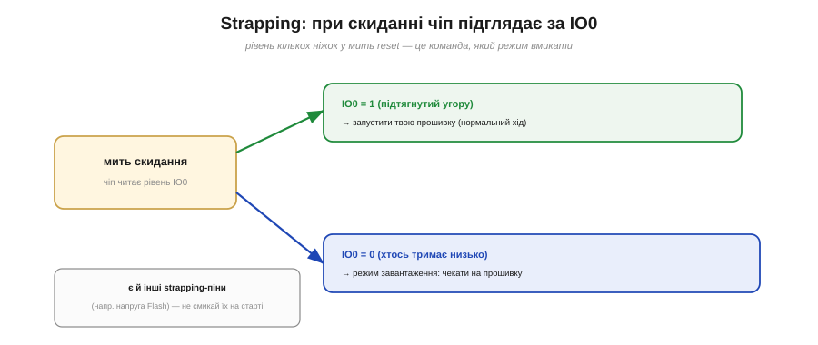
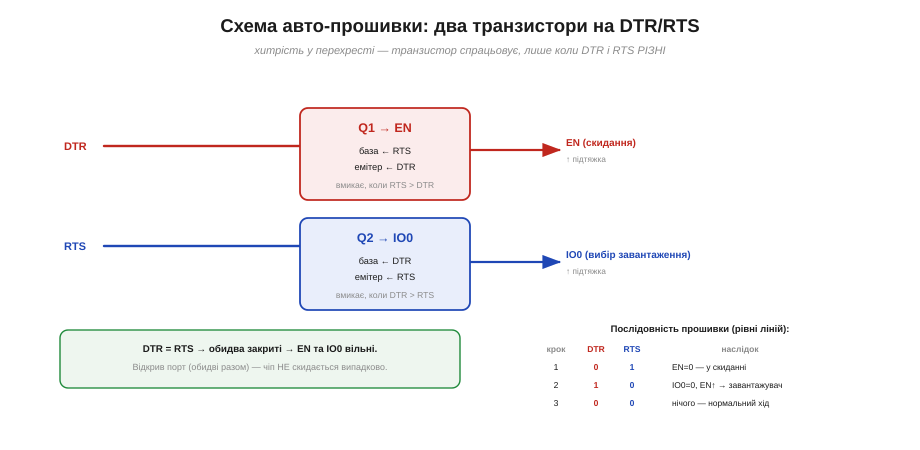

# 🔌 Strapping-піни і схема авто-прошивки: GPIO0, EN і два транзистори

> Чіп ESP32 уміє стартувати не лише у свою програму, а й у **режим завантаження** — коли він чекає прошивку ззовні. Тут — **як** він обирає цей режим (strapping-піни) і як плата вмикає його **сама**, без ручних маніпуляцій.

## Strapping-піни: рівень як команда на старті

Звідки чіп знає, що цього разу треба не бігти своєю програмою, а слухати прошивку? Він **підглядає** за кількома ніжками в **мить скидання**. Ці ніжки звуть **strapping-пінами**: їхній рівень саме на старті — це **команда** чипу про режим. Головна з них на ESP32 — **IO0** (GPIO0): якщо в момент reset вона **висока** (підтягнута вгору) — чіп запускає вашу прошивку; якщо її хтось **тримає низько** — чіп іде в режим завантаження.

*Рис. У мить скидання чіп читає IO0. Висока (1) → нормальний хід, ваша програма. Низька (0) → режим завантаження, чіп чекає прошивку. Є й інші strapping-піни (наприклад, що задають напругу Flash), тому їх не варто смикати на старті.*

Практичний наслідок: strapping-піни — звичайні GPIO, але **на старті** їхній рівень важить особливо. Якщо повісити на таку ніжку щось, що тягне її в «неправильний» бік під час reset, чіп може щоразу йти не в той режим — класичне «чомусь не стартує».

## Проблема: як увійти в режим завантаження

Щоб залити прошивку, треба зробити дві речі **в потрібному порядку**: притиснути **IO0** до нуля — і тоді **скинути** чіп (смикнути EN). Уручну це й роблять двома кнопками: тримаєш **BOOT** (IO0→0), тиснеш і відпускаєш **EN** (reset), відпускаєш BOOT. Працює, але робити так перед кожним заливанням — морока. Хочеться, щоб плата вводила чіп у режим завантаження **сама**, на команду з комп'ютера.

## Схема авто-прошивки: два транзистори на DTR/RTS

Рішення елегантне. У USB-UART моста, через який плата спілкується з комп'ютером, є дві службові лінії — **DTR** і **RTS** (історично — сигнали керування модемом, тут вільні для іншого вжитку). Їх заводять на **два транзистори**, що керують EN та IO0. Та якщо з'єднати «в лоб» (DTR→IO0, RTS→EN), виходить халепа: щойно програма **відкриває порт**, ОС зазвичай вмикає **обидві** лінії разом — і чіп випадково то скидається, то лізе в завантажувач.

*Рис. Хитрість — у перехресті. Кожен транзистор спрацьовує лише тоді, коли DTR і RTS **різні**: Q1 (на EN) — коли RTS вища за DTR, Q2 (на IO0) — навпаки. Якщо ж DTR = RTS (саме так буває при відкритті порту), обидва закриті, і чіп біжить нормально. Праворуч — послідовність, якою інструмент вводить чіп у завантажувач.*

Уся краса — у **перехресному** з'єднанні: емітер кожного транзистора йде не на землю, а на **другу** лінію. Тому транзистор реагує лише на **різницю** DTR і RTS, а не на їхній спільний рівень. Коли вони однакові (відкрили порт) — обидва мовчать, чіп працює. А `esptool` робить точну послідовність: спершу `DTR=0, RTS=1` (EN донизу — чіп у скиданні), тоді `DTR=1, RTS=0` (IO0 донизу, EN відпущено — чіп виходить зі скидання вже в завантажувачі), а тоді відпускає обидві. Жодних кнопок.

## Типові граблі

- **Strapping-пін зайнятий під «звичайне» навантаження**, що тягне його на старті, — чіп іде не в той режим.
- **Авто-скидання не спрацювало** (буває на деяких платах) — тоді в гру вертаються кнопки: тримай **BOOT**, клацни **EN**.
- **Зайнятий IO0** як вихід, що активний одразу по старту, заважає заливанню.

## Варіації

Не кожна плата має цю схему — на «голому» модулі прошивають кнопками чи зовнішнім адаптером із DTR/RTS. А чипи з **власним USB** (ESP32-S3, C3) уміють входити в завантажувач **без** цих транзисторів — там USB сам керує режимом.
