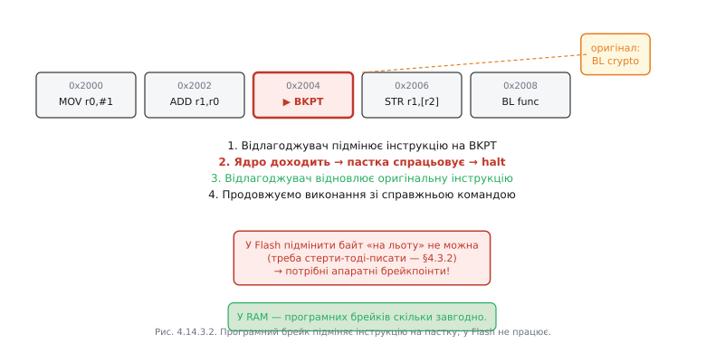

# Брейкпоінти й вотчпоінти: апаратні проти програмних і чому їх лічена кількість

Відлагоджувальний [зонд уміє зупиняти ядро](book:programming/swd-jtag-internals). Але зупинити «в довільний момент» — не те, що потрібно. Нам треба зупинитись **саме там, де щось відбувається**: на конкретному рядку коду або в ту мить, коли хтось торкнеться певної змінної в пам'яті. Для цього існують дві різні «пастки»: брейкпоінт і вотчпоінт.

### Апаратний брейкпоінт: компаратор адрес у залізі

Усередині відлагоджувального блока ядра є невелика кількість **компараторів адрес** — спеціальних апаратних схем. На кожній вибірці команди ядро порівнює значення програмного лічильника PC із завантаженими адресами у цих компараторах. Якщо збіг — ядро само зупиняється, ще до виконання інструкції.

Ця схема абсолютно прозора для коду прошивки: жодної зміни у Flash не відбувається. Саме тому апаратні брейкпоінти **працюють у Flash-пам'яті** — там, де зберігається звичайний код прошивки. Проте компараторів **лічена кількість**: у Cortex-M3/M4 зазвичай 6–8 FPB-компараторів, у Xtensa ESP32 — 2. Це не архітектурна дивацтво, а пряме відображення фізичних транзисторів у кремнії: кожен компаратор займає площу кристала і коштує чипу продуктивності й струму.


*Рис. Апаратний брейк працює навіть у Flash, але компараторів лічена кількість.*

### Програмний брейкпоінт: підміна команди пасткою

Програмний брейкпоінт працює зовсім інакше. Відлагоджувач читає оригінальну інструкцію за вказаною адресою, зберігає її, а на її місце **записує спеціальну команду-пастку** — `BKPT` у ARM Thumb або `BREAK` в Xtensa. Ядро, дійшовши до пастки, зупиняється; відлагоджувач відновлює оригінальну інструкцію, виконує її і знову ставить пастку назад.

Таких брейкпоінтів може бути скільки завгодно — обмежується лише пам'яттю хоста. Але є критичне обмеження: вони **не працюють у Flash**. Щоб змінити байт у [Flash](book:programming/flash-internals), треба стерти весь сектор і записати заново — операція тривалістю мілісекунди з обмеженим ресурсом стирань. «Підмінити байт на льоту» технічно неможливо.



*Рис. Програмних брейків скільки завгодно, але не у Flash.*

### Вотчпоінт: пастка на доступ до даних

Вотчпоінт — це компаратор не на адресу **коду**, а на адресу **даних** разом із умовою (читання, запис або обидва). Ядро відстежує кожне звернення до шини даних; коли адреса збігається з умовою вотчпоінта — halt.

Це найпотужніший інструмент проти загадкового псування пам'яті. Уявіть: глобальна змінна `g_config.rate` набуває хибного значення, але ти не знаєш, хто і де її змінює. Тисячі рядків коду, три [задачі RTOS](book:programming/tasks), кілька [ISR](book:programming/isr) — кожен потенційний підозрюваний. Ставиш `watch g_config.rate` — і наступного разу, коли **будь-який** рядок будь-якої задачі або ISR запише у цю змінну, ядро зупиниться. Винуватця буде показано: рядок коду, ім'я функції, стек викликів.


*Рис. Вотчпоінт ловить псування пам'яті незалежно від того, хто винен.*

### Стратегія: як економити обмежений ресурс

Апаратних брейкпоінтів і вотчпоінтів мало — і вони спільні: ті самі компаратори обслуговують обидва типи пасток. Звідси правило економії: **апаратні** компаратори берегти для Flash-коду і вотчпоінтів; у RAM-коді завжди доступні **програмні** брейкпоінти — їх ставте скільки потрібно.

Кілька тонкощів. Брейкпоінт усередині [ISR](book:programming/isr) технічно спрацює, але ядро зупиняється з активним рівнем пріоритету переривання — деякі дії після halt стають небезпечними. **Умовні** брейкпоінти (GDB перевіряє умову, відновлює виконання, якщо вона хибна) реалізовані програмно на хості: ядро все одно зупиняється на кожному спрацюванні, GDB перевіряє умову і може одразу відновити виконання — але при частих спрацюваннях це дуже повільно. Вотчпоінт на **діапазон** адрес можливий, але апаратно компаратор маскує молодші біти адреси — покритий діапазон має бути степенем двійки і вирівняним.

**Worked-приклад. Бюджет пасток на Xtensa ESP32 і як вкластись.**

| Тип | Ресурс | Де працює |
|---|---|---|
| Апаратний брейкпоінт | 2 компаратори | Flash + RAM |
| Програмний брейкпоінт | необмежено | тільки RAM |
| Вотчпоінт | 2 компаратори (спільні) | RAM (дані) |

Сценарій: треба відлагодити код у Flash — 2 місця інтересу — плюс стежити за `g_queue_len`. Маємо лише 2 апаратні компаратори. Рішення:

```
# GDB-команди
hbreak flash_handler    # апаратний — у Flash, використовує CMP0
watch  g_queue_len      # вотчпоінт — CMP1 (залишився)
# Третій брейк — у RAM-коді або на буфері, програмний:
break  ram_buffer_fill  # програмний — не витрачає апаратних
```

> 🔧 **Навіщо це:** знати межу «лічена кількість» треба, щоб не витрачати дорогі апаратні брейкпоінти даремно і щоб розуміти, чому у Flash звичайний `break` іноді мовчки не спрацьовує.

---
