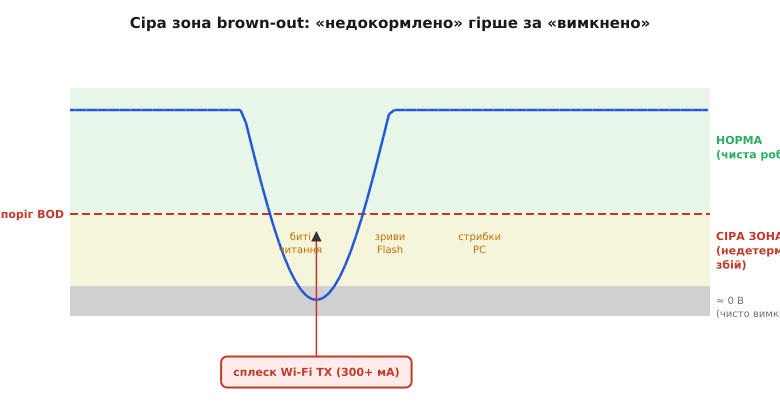
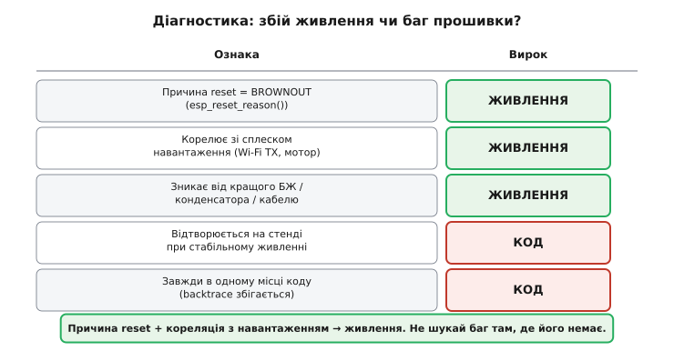

# Brown-out

Найпідступніший «баг прошивки» — той, якого в прошивці немає. Пристрій глючить, зависає, перезавантажується, а код бездоганний. Інженер тижнями копається в software, де помилки нема, бо справжня причина — просіле живлення. Англійський термін *brown-out* («brown» — бурий, потьмянілий; за кольором ламп розжарювання, що тьмяніють від зниженої напруги в мережі, на відміну від повного *black-out*, темряви) описує саме це: не вимкнення, а **недодача** напруги.

**Що таке brown-out фізично.** Коли напруга живлення просідає нижче порога коректної роботи, але **не до нуля**, чіп потрапляє у сіру зону: логіка ще намагається щось робити, але результати напівправильні. Транзистори перемикаються повільніше, ніж розраховано на номінальну напругу, тож фронти сигналів «не встигають» — і там, де схема очікує усталений рівень, вона зчитує проміжний. Через це RAM віддає при читанні биті дані. Flash-контролер, якому для запису потрібен стабільний рівень, може перервати транзакцію посередині й лишити пів-записану клітинку. Program Counter, зчитаний з хибним бітом, стрибає на випадкову адресу — і процесор починає виконувати «сміття» як інструкції. Це не «вимкнено», де все чисто зупиняється; це **недокормлено**, і саме цей стан найгірший з усіх можливих: чисте вимкнення лишає систему у відомому нульовому стані, а сіра зона лишає її у стані, якого не передбачав ніхто.



*Між нормою і нулем лежить сіра зона, де чіп ще живий, але рахує хибно. Просадка від сплеску струму затягує живлення саме туди — гірше, ніж чистий нуль.*

**Чому маскується під баг прошивки.** Симптоми brown-out — зависання, перезавантаження, псування даних — один до одного збігаються із симптомами поганого коду. Однакові наслідки, різні причини: і розіменування хибного покажчика, і стрибок PC від просілої напруги дають той самий крах. Тому очі інженера за звичкою повертаються до коду, хоча там чисто. Розв'язує цю плутанину не здогад, а три об'єктивні ознаки. По-перше, причина останнього reset: `esp_reset_reason()` повертає `ESP_RST_BROWNOUT`, коли скидання спричинив саме детектор просідання. По-друге, **кореляція з навантаженням**: збій вистрілює рівно тоді, коли вмикається щось ненажерливе — піднявся Wi-Fi, смикнув мотор, спрацював соленоїд. По-третє, реакція на залізо: проблема зникає від кращого блока живлення, товщого кабелю чи конденсатора поруч із чіпом, хоча код не змінився ні на байт. Звідси проста розв'язка: баг, що стабільно відтворюється на столі при певному живленні, — це код; збій, що живе лише «в полі» й тягнеться за навантаженням, — це живлення.



*П'ять ознак і вирок кожної. Причина reset плюс кореляція з навантаженням разом майже однозначно вказують на живлення.*

**Типові джерела просідання на ESP32.** Найбільший винуватець — піковий струм радіо. Під час Wi-Fi/BLE передачі споживання вистрілює короткими імпульсами до 300–500 мА (стартовий сплеск при підйомі радіо — теж у цьому діапазоні), тоді як у паузах чіп бере десятки міліампер. Якщо джерело чи проводка не встигають віддати цей імпульс, напруга на виводі чіпа просідає рівно в момент передачі. Підсилюють біду слабкий USB-порт або дешевий кабель: на опорі кабелю в десяті частки ома імпульс струму дає відчутне падіння за законом Ома (наприклад, 0.3 Ом × 0.4 А ≈ 0.12 В лише на кабелі, і це додається до просідання на самому порту). Тонкі довгі проводи живлення працюють так само — як небажаний резистор послідовно з чіпом. Сюди ж спільне живлення з мотором чи соленоїдом, які при пуску й зупинці кидають у спільну шину сплески й зворотні викиди, та розряджений Li-Ion, чий внутрішній опір під навантаженням просідає напругу сам собою. Усі ці джерела — частина [бюджету живлення](book:electronics/energy-budget); тут важить лише причинний зв'язок «сплеск струму на ненульовому опорі → провал напруги».

**Апаратна оборона.** Лінія першого захисту — конденсатори поруч із чіпом, і працюють вони на різних масштабах часу. Маленький керамічний конденсатор 0.1 мкФ біля кожного виводу живлення гасить найшвидші високочастотні стрибки. Бак-резервуар — низькоомний електролітичний чи танталовий конденсатор сотень мікрофарад (на практиці для радіоплат беруть 470–1000 мкФ) — тримає напругу під час довшого радіоімпульсу, бо встигає віддати локальний заряд швидше, ніж зреагує далеке джерело. Саме тому конденсатор лікує: у перші мікросекунди сплеску струм бере він, поки регулятор «не помітив» провалу і не підняв віддачу. Друга лінія — адекватний [LDO](book:electronics/ldo-internals) або DC-DC перетворювач із запасом по струму (орієнтир — щонайменше вдвічі більше за піковий, а не за середній). Далі — товщі доріжки й проводи, щоб зменшити той самий послідовний опір, і **окреме живлення силових вузлів** із власним резервуаром, аби сплеск мотора не доходив до шини чіпа.

> 🔧 **Навіщо це.** Найдорожче налагодження — те, де баг шукають не там. Уміння з причини reset і кореляції з навантаженням сказати «це живлення, не код» економить тижні марного полювання в software і одразу вказує, куди дивитися: конденсатор, блок живлення, кабель.

**Brown-out детектор як внутрішня оборона.** Коли зовнішні заходи не врятували й напруга все ж просіла, останнім рубежем стає вбудований brown-out detector (BOD). Це аналоговий компаратор усередині чіпа: щойно VDD падає нижче налаштованого порога, BOD **сам тримає чіп у reset**, аби той не виконував код на ненадійному живленні. Керований reset із відомою причиною кращий за випадкове псування даних — у `esp_reset_reason()` лишається чіткий `ESP_RST_BROWNOUT` замість загадкового краху. Поріг програмований: консервативніше (вищий поріг) налаштування рятує раніше, але частіше спрацьовує на коротких безпечних просіданнях; нижчий поріг терпиміший, та лишає вужчий запас. Анатомію детектора, регістр налаштування й супервізор-мікросхеми як зовнішній аналог BOD розбирає окрема вставка. Це апаратне втілення того ж принципу, що й [безпечний режим](book:programming/safe-mode): не роби гірше на ненадійному живленні.

> 🔌 Як влаштований brownout-детектор зсередини, як виставити поріг BOD і коли потрібен зовнішній супервізор живлення — [супервізор живлення і brownout-детектор](book:programming/reset-causes/comp-brownout.md).

**Реакція прошивки.** Brown-out — не баг логіки, тому в [лічильнику перезавантажень](book:programming/reboot-counter) його треба **відокремити** від програмних збоїв: вести окремий лічильник просідань, бо ліки різні. Серія panic-reset означає хворий код — відкочуємо конфіг або прошивку. Серія brownout-reset означає хворе живлення — знижуємо споживання (вимикаємо радіо або зменшуємо потужність передачі, знижуємо такт), попереджаємо користувача «перевір живлення», але прошивку **не** чіпаємо: вона ні до чого. Сплутати ці два сценарії — означає лікувати здорове й лишати хворе.

**Worked-приклад: розрізнити просідання й panic на старті.** На кожному старті читаємо причину reset і розводимо реакцію по двох лічильниках у RTC-пам'яті, що переживає скидання:

```c
RTC_NOINIT_ATTR static uint32_t s_brownout_cnt;   // окремий лічильник просідань
RTC_NOINIT_ATTR static uint32_t s_panic_cnt;      // окремий лічильник panic

void startup_analyze_reset(void) {
    esp_reset_reason_t reason = esp_reset_reason();

    switch (reason) {
    case ESP_RST_POWERON:
        // Справжній холодний старт — обидва лічильники в нуль
        s_brownout_cnt = 0;
        s_panic_cnt    = 0;
        break;

    case ESP_RST_BROWNOUT:
        s_brownout_cnt++;
        ESP_LOGW(TAG, "brownout reset #%lu — check power supply!", s_brownout_cnt);
        if (s_brownout_cnt >= 3) {              // серія просідань поспіль
            ESP_LOGW(TAG, "repeated brownout — reducing WiFi TX power");
            wifi_tx_power_reduce();             // знизити струм радіо, не чіпати прошивку
        }
        nvs_set_u32(nvs_h, "brownout_cnt", s_brownout_cnt);  // для звіту користувачу
        nvs_commit(nvs_h);
        break;

    case ESP_RST_TASK_WDT:
    case ESP_RST_INT_WDT:
    case ESP_RST_PANIC:
        s_panic_cnt++;
        ESP_LOGE(TAG, "watchdog/panic reset #%lu", s_panic_cnt);
        if (s_panic_cnt >= FAULT_THRESHOLD) {  // серія крахів коду
            config_rollback_if_available();    // відкат конфіга/прошивки
        }
        break;

    default:
        break;
    }
}
```

Окремий `s_brownout_cnt` дає зробити правильний висновок із правильної причини: три просідання поспіль — знизити потужність радіо й попередити про живлення; три panic — відкочувати прошивку. Якби обидва випадки текли в один лічильник, система реагувала б навмання — глушила б радіо при хворому коді або відкочувала справну прошивку при хворому живленні.

Brown-out лишається класичним прикладом, де правильний діагноз дорожчий за саме виправлення: щойно з причини reset і кореляції з навантаженням сказано «це живлення, не код», ремонт зводиться до конденсатора, кращого блока живлення чи товщого кабелю. А коли просіле живлення не можна ні полагодити, ні безпечно зупинити, лишається крайній варіант — [працювати частково](book:programming/graceful-degradation), з гідністю.

---
