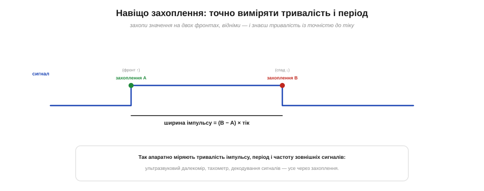
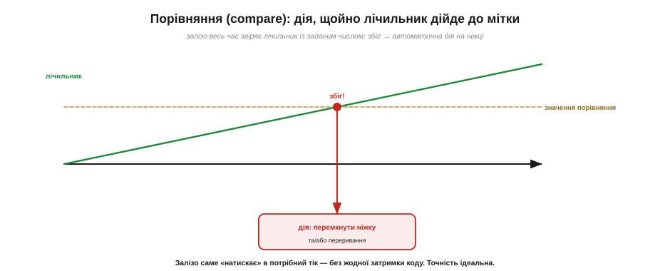
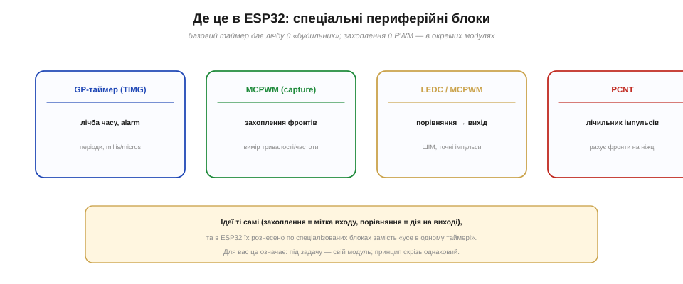

# Режими захоплення й порівняння (input capture / output compare)

[Таймер](book:programming/timer-counter) уміє не лише **рахувати час** і бити перериванням за періодом. Він уміє куди більше: апаратно зв'язувати свій лічильник із **ніжками** GPIO — і то з точністю, недосяжною для коду. Для цього є два дзеркальні режими. **Захоплення** (*input capture*) працює на **вхід**: воно миттєво «фотографує» лічильник, коли на ніжці стається подія, — даючи точну апаратну мітку часу. **Порівняння** (*output compare*) працює на **вихід**: воно саме виконує дію на ніжці, щойно лічильник дійде до заданого числа. Обидва — про точність, якої коду не дано. Розберімо їх.

### Захоплення: апаратна мітка часу для входу

Уявімо, що треба точно знати **мить**, коли на ніжці стався фронт (наприклад, прийшов імпульс від давача). Можна було б ловити його перериванням і читати `micros()` в обробнику — але між фронтом і читанням мине якийсь час: затримка [входу в переривання](book:programming/interrupt-vector), джитер. Захоплення усуває цю ваду повністю. Воно прив'язує лічильник до ніжки **апаратно**: щойно на ніжці стається обраний фронт, залізо тієї ж наносекунди копіює поточне значення лічильника в особливий **регістр захоплення**. Жодного коду, жодної затримки — точний знімок часу події.


*Лічильник вільно рахує. Щойно на ніжці стається фронт, апаратура **тієї ж миті** копіює поточне значення лічильника в регістр захоплення. Знімок робить залізо, без участі коду, тож він точний до тіку — це бездоганна апаратна «мітка часу» зовнішньої події.*

Ключове слово — **апаратно**. Програма дізнається про захоплення згодом (зазвичай те саме захоплення піднімає й переривання, щоб сповістити «я зловив фронт, значення вже в регістрі»), та **значення** записано в точну мить події, а не тоді, коли код доплентався його прочитати. Це різниця між «приблизно тоді» й «рівно тоді» — і для вимірювання часу вона вирішальна.

Кілька тонкощів додають захопленню сили. По-перше, для кожного входу можна вибрати, який саме **фронт** ловити — наростання, спад або обидва. По-друге, деякі таймери вміють на захопленні ще й **скинути** лічильник, тож наступне захоплення відразу покаже період, без віднімання. По-третє, якщо вимірюваний інтервал довший за діапазон лічильника, захоплення поєднують із підрахунком [**переповнень**](book:programming/timer-overflow): повний час складають із цілих циклів плюс залишок. Так апаратно міряють і дуже короткі, і досить довгі проміжки.

Аналогія до захоплення — **фотофініш** на перегонах: камера сама клацає точну мить, коли бігун перетнув лінію, і байдуже, де в той час був суддя й чи встиг він глянути. Так само захоплення фіксує точний «час на табло» (значення лічильника) у мить події на ніжці — а код прочитає це табло вже потім, не втративши ані тіку точності. Залізо ловить мить, код її осмислює.

### Навіщо це: виміряти тривалість, період, частоту

Сама по собі мітка одного фронту мало що дає — сила захоплення в **парах**. Захопивши значення на **двох** фронтах і віднявши їх, дістаємо точний інтервал між ними. Захопили фронт наростання й спаду того самого імпульсу — знаємо його **ширину**. Захопили два сусідні фронти наростання — знаємо **період**, а отже, й **частоту** сигналу.


*Захоплення A на фронті наростання, захоплення B на спаді: ширина імпульсу = (B − A) × тривалість тіку, з точністю до тіку. Так апаратно вимірюють тривалість імпульсів, період і частоту зовнішніх сигналів — від ультразвукового далекоміра до тахометра.*

Це робоча конячка для багатьох задач. Ультразвуковий далекомір вимірює час повернення луни — захопленням. Тахометр рахує частоту імпульсів від колеса — захопленням. Декодування інфрачервоного пульта, вимір ширини сигналів — усе спирається на той самий прийом: апаратно відмітити фронти, відняти, дістати час. І все це — **без джитера**, бо мітки ставило залізо.

**Порахуймо: ширина імпульсу й частота через захоплення.**

```
Тік таймера = 1 мкс.

Ширина імпульсу (фронт ↑, потім спад ↓):
   захоплення A (↑) = 1250
   захоплення B (↓) = 1780
   ширина = (B − A) × тік = (1780 − 1250) × 1 мкс = 530 мкс

Період і частота (два фронти ↑ поспіль):
   A1 = 1250, A2 = 3250
   період  = (3250 − 1250) × 1 мкс = 2000 мкс = 2 мс
   частота = 1 / 2 мс = 500 Гц
```

Конкретний приклад — популярний [ультразвуковий далекомір HC-SR04](book:electronics/ultrasonic-rangefinder). Він тримає ніжку «луни» високою рівно стільки, скільки звук летить до перешкоди й назад; захопивши фронт і спад цього імпульсу, дістаємо час польоту, а з нього — відстань (звук витрачає ~58 мкс на кожен сантиметр туди-назад). Із мікросекундним тіком захоплення це дає сантиметрову точність. А частоту міряють двома способами: для високої — ловлять період одного циклу (швидко й часто), для низької — рахують фронти за фіксований проміжок (точніше).

> ⚙️ **На практиці.** Як саме написати вимірювання — обробник, що віднімає мітки, як **не помилитися на переповненні** таймера між фронтами й де ховається межа роздільності та діапазону — крок за кроком у вставці [Виміряти імпульс і частоту](book:programming/capture-compare/proj-input-capture.md).

### Порівняння: апаратна дія на виході

Тепер дзеркальний режим — **порівняння**, що працює на вихід. Тут залізо безперервно **звіряє** лічильник із наперед заданим числом (значенням порівняння), і коли вони збігаються, **само** виконує дію: перемикає ніжку (ставить, скидає чи інвертує її рівень) та/або піднімає переривання. Знову ж — без коду й без затримки: дія стається рівно в той тік, коли лічильник дорівняв мітці.


*Залізо весь час порівнює лічильник із заданим числом. У тік, коли вони збігаються, воно автоматично виконує дію — перемикає ніжку та/або піднімає переривання. Жодної участі коду: «натискання» стається точно в потрібну мить.*

Порівняння — це спосіб **запланувати** точну дію в часі. «Підніми ніжку, коли лічильник дорівняє 500» — і вона підніметься рівно тоді, хоч би чим був зайнятий процесор. Канали порівняння часто є по кілька на таймер, тож можна запланувати кілька дій на різні моменти. Це протилежність захопленню: захоплення **читає** час події з входу, порівняння **задає** час дії на виході.

До речі, порівняння знайоме й під іншим ім'ям. [«Будильник»](book:programming/timer-overflow) (alarm), на якому таймер перезавантажується й б'є перериванням, — це і є порівняння лічильника із заданим числом; просто там дія «скинутись і сповістити». Загалом же канали порівняння роблять що завгодно в потрібний тік: підняти ніжку, опустити, інвертувати, покликати обробник. А коли каналів кілька, на одному періоді можна розставити **кілька** точних подій — звідси й складніші форми сигналів, і керування фазами.

А аналогія до порівняння — **будильник**: ви наперед називаєте час, і дзвоник спрацює рівно тоді, хоч би чим ви були зайняті. Порівняння — це «постав будильник на показання N»: лічильник дорахує до N, і залізо саме зробить призначену дію. Різниця лише в тому, що замість дзвінка ніжка перемикається чи спрацьовує переривання, а замість годин — тіки таймера. Точний апаратний будильник для ваших сигналів.

### Перемикання на збіг → точна хвиля

Найефектніше порівняння розкривається, коли його поєднати з [періодом](book:programming/timer-overflow). Якщо на **кожен** збіг перемикати ніжку на протилежний рівень, а лічильник раз за разом проходить свій період, — на ніжці з'явиться бездоганно рівна **прямокутна хвиля** точно заданої частоти, і все це **без жодної участі процесора**.


*Якщо на кожен збіг лічильника з порогом перемикати ніжку, виходить рівний меандр (прямокутна хвиля) точної частоти — і генерує його залізо само. Це і є фундамент **ШІМ** (PWM): апаратні імпульси без навантаження на процесор.*

Саме на цьому стоїть [**широтно-імпульсна модуляція**](book:programming/pwm-on-mcu) (PWM): рухаючи значення порівняння, керують тим, **яку частку** періоду ніжка тримає високий рівень, — а це дозволяє «вдавати» аналог цифровою ніжкою (яскравість, швидкість). Та поки що нам важлива сама ідея: порівняння перетворює таймер на апаратний генератор сигналів, точний до тіку.

Помітьте красиву симетрію двох режимів. Захоплення йде від **світу до лічильника**: подія на ніжці записує час. Порівняння — від **лічильника до світу**: заданий час породжує дію на ніжці. Один читає момент входу, другий призначає момент виходу; разом вони замикають таймер на зовнішні сигнали в обидва боки. Майже все, що пов'язане з точним таймінгом ніжок, — вимір, генерація, ШІМ, протоколи — зводиться до цих двох дзеркальних дій.

### Чому апаратно, а не в коді

Може виникнути думка: навіщо ці складнощі, якщо виміряти час чи смикнути ніжку можна й у коді — перериванням? Можна, але **неточно**. Між подією і реакцією коду завжди є затримка й [джитер](book:programming/interrupt-vector): поки процесор увійде в обробник, поки виконає рядки — миті спливають, і то щоразу трохи по-різному. Захоплення й порівняння цього позбавлені, бо прив'язані прямо до **значення лічильника**, а не до того, коли код устигне.


*Ліворуч — апаратно: подія чи дія прив'язана просто до значення лічильника, тож інтервали рівні, точність до тіку, незалежно від зайнятості коду. Праворуч — програмно: код міряє чи смикає ніжку сам, із затримкою й джитером, що «пливе» і збивається, коли процесор зайнятий.*

> 🔧 **Навіщо це.** Правило просте: **точний час — залізу, приблизний — коду**. Якщо треба зміряти короткий імпульс, точно зловити мить фронту чи видати рівний сигнал — беріть захоплення/порівняння, а не «`micros()` в обробнику». Програмний спосіб годиться для грубих міток (десятки мікросекунд і більше), та для точних вимірів і генерації він безнадійно «пливе». Це той самий урок, що з [таймером проти лічби в циклі](book:programming/timer-counter): дрібну точну роботу віддають спеціальному залізу.

Щоб відчути масштаб: вхід у переривання й виконання кількох рядків коду коштують **мікросекунди**, і ця затримка ще й «плаває» від такту до такту. А апаратне захоплення чи порівняння точне до **одного тіку** — наносекунди на ESP32. Для вимірювання звукової частоти чи генерації радіосигналу різниця в тисячу разів критична. Та коли вам досить грубої мітки — «приблизно через 10 мс» — програмний спосіб цілком годиться й простіший. Як завжди, інструмент обирають під потрібну точність, а не «про всяк випадок по максимуму».

### Де це в ESP32

Тут — важлива практична поправка. У класичних мікроконтролерах (AVR, STM32) захоплення й порівняння вбудовано **в той самий** таймер — як його канали. ESP32 влаштований інакше: його базові таймери (TIMG) дають лічбу часу й «будильник», а захоплення фронтів і генерацію сигналів винесено в **окремі спеціалізовані блоки**.


*Розподіл в ESP32: **GP-таймер (TIMG)** — лічба часу й alarm (періоди, `millis`/`micros`); **MCPWM** має блок **захоплення** (вимір тривалості/частоти); **LEDC/MCPWM** роблять **порівняння → вихід** (ШІМ, точні імпульси); **PCNT** — апаратний лічильник імпульсів на ніжці. Ідеї ті самі, лише рознесені по модулях.*

Для вас це означає просту річ: **ідеї універсальні, а блок — під задачу**. Треба зміряти тривалість чи частоту — береться блок захоплення MCPWM. Треба видати ШІМ чи точні імпульси — LEDC або MCPWM. Треба просто **порахувати** фронти на ніжці (скільки обертів, скільки крапель) — є окремий лічильник імпульсів PCNT. А базовий таймер лишається для відліку часу. Принцип «захоплення = мітка входу, порівняння = дія на виході» скрізь однаковий — змінюється лише, у якому модулі його шукати.

> 🔧 **Навіщо це.** Не лякайтеся «зоопарку» блоків ESP32 — за назвами (MCPWM, LEDC, PCNT) ховаються рівно ті дві ідеї, що ми розібрали. У повсякденній практиці ви рідко налаштовуєте їх вручну: для ШІМ є прості функції (`ledcWrite` тощо), для лічби імпульсів — готові бібліотеки. Та знати, що під ними працює апаратне захоплення/порівняння, корисно: це пояснює, **чому** вони точні й не вантажать процесор, і куди дивитися, коли треба вичавити максимум точності.

Два блоки ESP32 варті окремої згадки, бо дуже корисні. **PCNT** (*pulse counter*) — апаратний лічильник фронтів на ніжці: він рахує імпульси сам, не турбуючи процесора, та ще й уміє декодувати квадратурний сигнал поворотного енкодера — тепер без жодного [переривання на кожен імпульс](root:embedded/polling-vs-interrupts). А **RMT** (*remote control*) — блок для точних послідовностей імпульсів: він народився для інфрачервоних пультів, але ним керують і світлодіодними стрічками, і будь-якими сигналами зі строгим таймінгом. Обидва — приклади того, як ESP32 віддає точну роботу з часом спеціальному залізу.

Отже, таймер уміє не лише рахувати час, а й апаратно зв'язувати лічильник із ніжками. **Захоплення** робить точну мітку часу зовнішньої події (вимір тривалості, періоду, частоти), **порівняння** — точну дію на виході в заданий момент (аж до генерації рівних хвиль — основи ШІМ). Обидва б'ють програмний спосіб точністю, бо прив'язані прямо до лічильника, а не до того, коли код устигне; у ESP32 вони живуть у спеціалізованих блоках (MCPWM, LEDC, PCNT). Запам'ятайте дзеркальну пару одним рядком: **захоплення фотографує час входу, порівняння призначає час виходу** — і обидва точні до тіку, без жодної участі коду. А звичні функції `millis()` і `micros()`, на які спирається стільки коду, — це теж надбудова над апаратним лічильником: [як саме з тіків роблять мілі- й мікросекунди](book:programming/millis-micros) — окрема історія.
