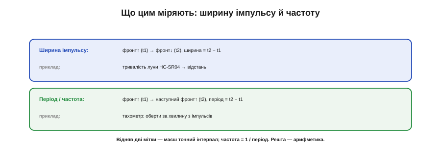

# ⚙️ Виміряти імпульс і частоту: input capture на практиці

## Задача

Треба **точно** зміряти інтервал на ніжці: тривалість імпульсу (луна далекоміра), період чи частоту сигналу (тахометр, витратомір). Робити це опитуванням у коді — означає ловити фронт із затримкою циклу, і вимір **тремтить** на мікросекунди. Як зміряти інтервал так, щоб джитера програми не було зовсім?

## Ідея

Скористатися **захопленням** (input capture): таймерне залізо **саме** фіксує значення лічильника **в мить фронту** на ніжці — без участі коду. Ви потім читаєте захоплене число. Різниця двох захоплень — це інтервал **у тіках** таймера; помножите на тривалість тіка — матимете час. Оскільки мітку ставить залізо, джитер по суті нульовий.


*На фронті сигналу залізо миттєво знімає значення лічильника (t1, t2). Інтервал = t2 − t1 у тіках → переводимо в час за [темпом таймера](book:programming/timer-counter). Програма не «ловить» фронт із затримкою — мітку ставить залізо, тож джитера немає.*

Звідси два виміри: **ширина імпульсу** — захопити фронт↑ і фронт↓, відняти; **період** — захопити два фронти↑ поспіль, відняти, а частота = 1/період.


*Ширина імпульсу — між фронтом↑ і фронтом↓ (приклад: тривалість луни HC-SR04 → відстань). Період — між двома фронтами↑ поспіль, частота = 1/період (приклад: тахометр, оберти за хвилину). Відняв дві мітки — маєш інтервал.*

## Код

Реалізуймо це на класичному таймері із захопленням — тут Timer1 на AVR: у ньому захоплення вбудоване окремим каналом, а регістр `ICR1` — те саме «табло», куди залізо кладе знімок лічильника в мить фронту.

```c
#include <avr/io.h>
#include <avr/interrupt.h>
#include <util/atomic.h>

// Timer1 — 16-біт. Тік = clk/8 = 16 МГц / 8 = 2 МГц → 0.5 мкс.
// Захоплення знімає лічильник TCNT1 у регістр ICR1 у мить фронту
// на ніжці ICP1 (на Arduino Uno це «пін 8»).
#define TICK_NS 500u

volatile uint16_t g_ticks = 0;   // останній інтервал у тіках
volatile uint8_t  g_ready = 0;   // прапорець «є свіжий вимір»

void capture_init(void) {
    TCCR1A = 0;                    // нормальний режим, без ШІМ
    TCCR1B = (1 << ICNC1)          // вхідний фільтр проти коротких сплесків
           | (1 << ICES1)          // ловити фронт наростання
           | (1 << CS11);          // тік clk/8
    TIMSK1 = (1 << ICIE1);         // дозволити переривання захоплення
    sei();
}

// Фронт на ніжці → залізо вже поклало TCNT1 в ICR1. Обробник лише знімає різницю.
ISR(TIMER1_CAPT_vect) {
    static uint16_t last = 0;
    static uint8_t  have_last = 0;
    uint16_t now = ICR1;                 // читаємо регістр захоплення
    if (have_last) {
        g_ticks = now - last;            // беззнакове: один оберт таймера розсмоктується сам
        g_ready = 1;
    }
    last = now;
    have_last = 1;
}

// Головний цикл: переведення в час і частоту — уже поза обробником.
void poll_measurement(void) {
    if (!g_ready) return;

    uint16_t ticks;
    ATOMIC_BLOCK(ATOMIC_RESTORESTATE) {  // 16-біт читаємо цілим, щоб нове захоплення не розірвало його навпіл
        ticks   = g_ticks;
        g_ready = 0;
    }

    uint32_t period_ns = (uint32_t)ticks * TICK_NS;   // тіки → наносекунди
    if (period_ns == 0) return;                       // захист від ділення на нуль
    uint32_t freq_hz = 1000000000UL / period_ns;      // період → частота
    // ... відправити period_ns / freq_hz далі
}
```

Обробник робить **мінімум** — лише читає захоплене й рахує різницю; переведення в час і частоту лишають на потім, поза [обробником переривання](book:programming/isr). Саму захоплену мітку часу залізо вже поклало в регістр — ловити фронт «вчасно» коду не треба.

Ключовий рядок — `g_ticks = now - last` на **беззнакових** числах: якщо таймер між двома фронтами один раз перескочив через нуль (`now` стало меншим за `last`), віднімання за модулем 2¹⁶ **само** дає правильний інтервал — та сама модульна арифметика, що згадана в пастці про переповнення нижче. Тому для звичного випадку (інтервал коротший за повний оберт таймера) окремо лічити переповнення не треба.

Щоб міряти **ширину** імпульсу замість періоду, перемикайте фронт після кожного захоплення (`TCCR1B ^= (1 << ICES1);`) — тоді сусідні інтервали стануть тривалістю високого й низького рівнів. На ESP32 та сама логіка живе в блоці захоплення **MCPWM**: замість регістра `ICR1` залізо передає знімок лічильника полем `cap_value` у зворотний виклик, а «зняти захоплене, відняти попереднє» лишається незмінним.

## Складність і пастки на МК

- **Переповнення між фронтами — головна пастка.** Якщо таймер встиг **обернутися** (дійти до максимуму й піти з нуля) між двома захопленнями, проста різниця `t − last` дасть **дурницю**. Рятунок: рахувати **переповнення** (таймер теж б'є перериванням на overflow) і додавати їх; або скористатися тим, що **беззнакове** віднімання саме дає правильний результат, якщо обертань було не більш як одне (та сама [модульна арифметика, що рятує `millis`](book:programming/timer-overflow)). За довгих інтервалів — ширший таймер або повільніший тік.
- **Роздільність проти діапазону.** [Темп тіка](book:programming/timer-counter) (передільник) задає одразу **дві** речі: як **дрібно** ви міряєте (роздільність) і як **довго** до переповнення (діапазон). Швидкий тік — точно, та обертається скоро; повільний — грубо, зате надовго. Підбирайте під свій інтервал.
- **Зашвидко — захлинеться.** Дуже висока частота дає захоплення частіше, ніж встигає обробник: тоді або ловіть не кожен фронт, або рахуйте імпульси за вікно замість періоду ([бюджет ISR](root:embedded/polling-vs-interrupts)).
- **Шум — фальшиві фронти.** Брязкіт чи наводки на лінії дають зайві захоплення; декотрі таймери мають вхідний **фільтр** проти коротких сплесків, а для кнопок — [антибрязкіт](book:electronics/contact-debounce).

## Підсумок

Захоплення перетворює «коли стався фронт» на точне число **в тіках**, що його ставить **залізо**, а не код. Відняли дві мітки — маєте інтервал; звідси ширина, період, частота. Лишається пильнувати **переповнення** між фронтами й добирати **темп тіка** під потрібні роздільність і діапазон — і вимір буде таким точним, яким коду не зробити ніколи.
