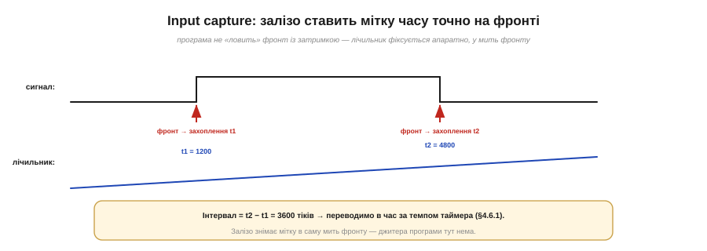

# ⚙️ Виміряти імпульс і частоту: input capture на практиці

> Алгоритмічна вставка до теми [«Режими захоплення й порівняння»](book:programming/capture-compare). Захоплення дає точну мітку фронту — а тут показано, як із цього зібрати робоче вимірювання: код, переповнення й межі.

## Задача

Треба **точно** зміряти інтервал на ніжці: тривалість імпульсу (луна далекоміра), період чи частоту сигналу (тахометр, витратомір). Робити це опитуванням у коді — означає ловити фронт із затримкою циклу, і вимір **тремтить** на мікросекунди. Як зміряти інтервал так, щоб джитера програми не було зовсім?

## Ідея

Скористатися **захопленням** (input capture): таймерне залізо **саме** фіксує значення лічильника **в мить фронту** на ніжці — без участі коду. Ви потім читаєте захоплене число. Різниця двох захоплень — це інтервал **у тіках** таймера; помножите на тривалість тіка — матимете час. Оскільки мітку ставить залізо, джитер по суті нульовий.


*Рис. На фронті сигналу залізо миттєво знімає значення лічильника (t1, t2). Інтервал = t2 − t1 у тіках → переводимо в час за [темпом таймера](book:programming/timer-counter). Програма не «ловить» фронт із затримкою — мітку ставить залізо, тож джитера немає.*

Звідси два виміри: **ширина імпульсу** — захопити фронт↑ і фронт↓, відняти; **період** — захопити два фронти↑ поспіль, відняти, а частота = 1/період.


*Рис. Ширина імпульсу — між фронтом↑ і фронтом↓ (приклад: тривалість луни HC-SR04 → відстань). Період — між двома фронтами↑ поспіль, частота = 1/період (приклад: тахометр, оберти за хвилину). Відняв дві мітки — маєш інтервал.*

## Псевдокод

```
на кожне захоплення (фронт):
    t = захоплене_значення         # залізо вже його записало
    інтервал = t − last            # у тіках
    last = t
    # позначити, що є новий вимір (прапорець / черга)

у main:
    час = інтервал * тривалість_тіка
    частота = 1 / час
```

Обробник робить **мінімум** — лише читає захоплене й рахує різницю; переведення в час і частоту лишають на потім, поза [обробником переривання](book:programming/isr). Сам захоплений timestamp залізо вже поклало в регістр — ловити фронт «вчасно» коду не треба.

## Складність і пастки на МК

- **Переповнення між фронтами — головна пастка.** Якщо таймер встиг **обернутися** (дійти до максимуму й піти з нуля) між двома захопленнями, проста різниця `t − last` дасть **дурницю**. Рятунок: рахувати **переповнення** (таймер теж б'є перериванням на overflow) і додавати їх; або скористатися тим, що **беззнакове** віднімання саме дає правильний результат, якщо обертань було не більш як одне (та сама [модульна арифметика, що рятує `millis`](book:programming/timer-overflow)). За довгих інтервалів — ширший таймер або повільніший тік.
- **Роздільність проти діапазону.** [Темп тіка](book:programming/timer-counter) (прескалер) задає одразу **дві** речі: як **дрібно** ви міряєте (роздільність) і як **довго** до переповнення (діапазон). Швидкий тік — точно, та обертається скоро; повільний — грубо, зате надовго. Підбирайте під свій інтервал.
- **Зашвидко — захлинеться.** Дуже висока частота дає захоплення частіше, ніж встигає обробник: тоді або ловіть не кожен фронт, або рахуйте імпульси за вікно замість періоду ([бюджет ISR](book:programming/polling-vs-interrupts)).
- **Шум — фальшиві фронти.** Брязкіт чи наводки на лінії дають зайві захоплення; декотрі таймери мають вхідний **фільтр** проти коротких сплесків, а для кнопок — [антидребезг](book:electronics/contact-debounce).

## Підсумок

Захоплення перетворює «коли стався фронт» на точне число **в тіках**, що його ставить **залізо**, а не код. Відняли дві мітки — маєте інтервал; звідси ширина, період, частота. Лишається пильнувати **переповнення** між фронтами й добирати **темп тіка** під потрібні роздільність і діапазон — і вимір буде таким точним, яким коду не зробити ніколи.
