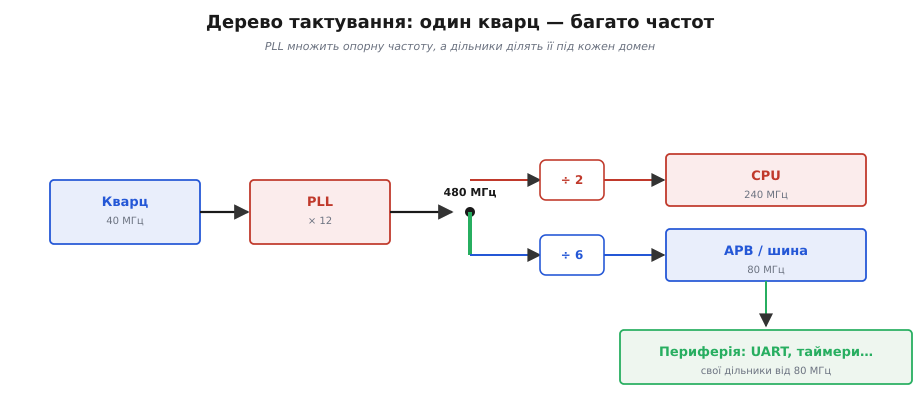
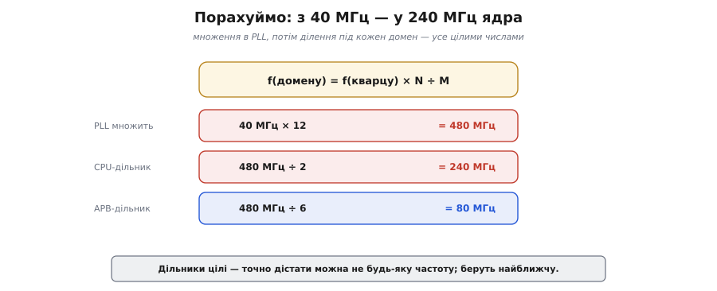

# 🧮 Дерево тактування: PLL і дільники — з 40 МГц у 240 МГц

У чипа один кварц, але багато ритмів. Розберемо, як саме арифметика перетворює **40 МГц** кварцу на **240 МГц** ядра й решту тактів.

## Означення

**PLL** (англ. *phase-locked loop* — «петля фазового автопідстроювання») — схема, що **множить** опорну частоту на ціле число: з 40 МГц робить, скажімо, 480 МГц. **Дільник** (англ. *divider*) — навпаки, **ділить** частоту на ціле. А **дерево тактування** (англ. *clock tree*) — це мережа, що розводить похідні такти кожному вузлу: ядру, шині, периферії.

## Інтуїція: чому множать, а не беруть кварц одразу на 240 МГц

Здавалося б, простіше поставити кварц на потрібну частоту. Але високочастотні кварці незручні й менш стабільні, а головне — опорну частоту тут **диктує радіо**: йому потрібні саме 40 МГц (про це — вставка [Кварц на платі](topic:programming/clock-power/comp-crystal.md)). Тож роблять розумніше: беруть один **чистий і точний** опорний такт і **множать** його вгору до «майстра», а тоді **ділять** під кожен домен. Одне стабільне джерело — багато похідних частот. Це той самий прийом, що й у «дорослому» комп'ютері: там базовий такт у сотню мегагерц так само множать до гігагерців ядра — інженерія всюди однакова.


*Від кварцу до доменів. PLL множить 40 МГц на 12 → 480 МГц «майстер». Звідти дільники: ÷2 дає 240 МГц ядру, ÷6 — 80 МГц шині APB, а вже від неї периферія робить свої такти власними дільниками.*

## Формальний апарат

Уся арифметика зводиться до множення в PLL і ділення дільником:

```
f(PLL)    = f(кварцу) × N           ← множення в PLL
f(домену) = f(PLL)    ÷ M           ← дільник домену
```

Підставмо числа ESP32:

```
PLL:   40 МГц × 12 = 480 МГц        ← «майстер»
CPU:   480 МГц ÷ 2  = 240 МГц       ← ядро на повній швидкості
APB:   480 МГц ÷ 6  = 80  МГц       ← шина периферії
```


*Та сама формула в числах. Спершу PLL підіймає 40 до 480, а тоді цілі дільники роздають 240 ядру і 80 шині.*

Тут ховається важлива тонкість: **дільники цілі**. Тому з даної опорної частоти точно дістати можна **не будь-яку** частоту, а лише ту, що ділиться націло. На практиці беруть **найближчу можливу** й живуть із невеликою похибкою — про це варто пам'ятати, коли потрібна якась конкретна частота (швидкість UART, крок таймера). Деякі чипи додають ще й **дробові** дільники (англ. *fractional-N* PLL), щоб дотягтися до незручних частот точніше, — але ціною трохи більшого тремтіння такту (джитера, англ. *jitter*).

## Worked-приклад: похибка швидкості UART

Подивимося, як ця «цілість» дільника кусається на практиці. UART бере свій такт від шини APB (80 МГц) і ділить його цілим числом, щоб дістати потрібну швидкість передавання. Хочемо класичні **115200 бод**. Який дільник і яка вийде реальна швидкість?

```
ідеальний дільник = 80 000 000 / 115200 = 694.44…   ← не ціле!
```

Дільник мусить бути цілим, тож округлюємо до **694** і дивимося, що насправді вийде:

```
реальна швидкість = 80 000 000 / 694 = 115273 бод
похибка = (115273 − 115200) / 115200 ≈ +0.063 %
```

Похибка близько **0.06 %** — мізерна. UART терпить розбіжність такту між передавачем і приймачем приблизно до **±2–3 %** (бо синхронізується на старт-біті кожного байта й семплює біт посередині), тож 0.06 % губиться в шумі. А якби ми округлили в інший бік, до 695:

```
80 000 000 / 695 = 115108 бод   →   похибка ≈ −0.08 %
```

теж добре. Тому для UART на 80 МГц цілий дільник практично не болить. Але візьміть екзотичну швидкість на повільній гілці — і похибка зросте, бо великий крок між сусідніми цілими дільниками означає великий стрибок частоти. Саме тут і рятують **дробові** дільники: вони дають проміжні значення між 694 і 695, підтягуючи реальну швидкість майже впритул до ідеалу.

> 🔧 **Навіщо це.** Коли зв'язок «майже працює» — більшість байтів проходить, але зрідка трапляється сміття — перша підозра саме сюди: чи влучив дільник у потрібну швидкість на обох кінцях. Якщо в одного пристрою такт від кварцу, а в іншого від RC, їхні похибки складаються — і те, що поодинці терпиме, разом може перевалити за межу.

## Чому множать високо, а потім ділять

Може здатися марнотратним підняти частоту аж до 480 МГц, щоб потім більшу її частину знову поділити вниз. Але в цьому й логіка. Кварц дає одну-єдину **чисту й точну** частоту — це його сильна сторона й водночас обмеження: сам по собі він не вміє видати ні 240, ні 80 МГц. PLL же — це керована «гойдалка» (генератор, замкнений у петлю зворотного зв'язку), яку електроніка тримає **синхронно** з опорним кварцом: вона коливається швидко, але кожен її період звірено з повільним точним еталоном. Тому 480 МГц на виході PLL успадковують точність 40-мегагерцового кварцу — дрейф у ppm лишається той самий, просто пульсів за секунду стало в дванадцять разів більше.

А далі поділ цілим числом — операція **ідеально точна й майже безкоштовна**: лічильник, що пропускає кожен другий (чи шостий) фронт. Він не додає ні похибки частоти, ні дрейфу — 240 МГц, отримані як 480 ÷ 2, такі ж точні, як і їхнє джерело. Виходить найвигідніший розподіл праці: **один** дорогий точний вузол (кварц + PLL) задає еталон, а дешеві лічильники-дільники роздають із нього скільки завгодно похідних частот кожному домену. Саме тому вся ця конструкція й називається деревом: один корінь-еталон, багато гілок-дільників.

## Два «майстри»: 480 і 320 МГц

PLL в ESP32 не довільний — він видає одну з **двох** фіксованих частот: 480 МГц або 320 МГц (тобто 40 × 12 або 40 × 8). Який саме «майстер» увімкнеться, залежить від того, на яку швидкість ви просите ядро. По 480 МГц зручно лягають 240 і 160 МГц (÷2, ÷3); по 320 МГц — 80 МГц (÷4), коли ядро навмисне тримають повільним заради економії. Тобто система сама добирає опорний «майстер» так, щоб **цілий** дільник дав потрібну частоту ядра, а не навпаки. Для нас, хто рахує дерево, це означає просту річ: не всяке число можна отримати, але ходові частоти (240, 160, 80) лягають рівно — інженери чипа підібрали множники PLL саме під них.

Шина APB заслуговує окремого слова. Її 80 МГц — не випадкова поступка, а навмисно стала величина: переважна більшість периферії розрахована саме на 80 МГц і відлічує від них свої такти. Тому, коли ядро переходить на нижчу частоту заради економії, APB у багатьох режимах **лишають** на 80 МГц — інакше «попливли» б усі швидкості UART, кроки таймерів і частоти ШІМ, прив'язані до неї. Дерево свідомо розв'язує темп ядра й темп периферії, щоб одне можна було гальмувати, не ламаючи інше.

## Дільник як важіль живлення

Те саме дерево, що роздає частоти, є й головним важелем енергоощадності в активному режимі. Динамічне споживання чипа зростає з частотою такту (P ∝ f · V²), тож зменшити дільник CPU удвічі — це буквально вполовинити число перемикань за секунду, а отже й динамічний струм ядра. Числовий бік простий:

```
ядро на 240 МГц:  дільник ÷2 від 480 МГц
ядро на 120 МГц:  дільник ÷4 від 480 МГц  → удвічі менше перемикань
```

Ось чому «масштабування частоти» й «вимкнення такту зайвим гілкам» — не окремі трюки, а просто гра тими самими дільниками дерева: одну гілку пригальмувати, іншу зовсім перекрити. Сон вимикає такти геть; ці два важелі діють тонше, не зупиняючи роботу.

## Де це працює в курсі

Дерево тактування — не абстракція, а основа щоденних розрахунків:

- **Швидкість CPU ↔ споживання.** Зменшив дільник або частоту PLL — ядро повільніше, зате гріється й їсть менше. Це той самий важіль енергоощадності, що й режими сну, тільки плавніший.
- **Такти периферії.** UART, таймери, ШІМ, АЦП беруть свій такт **від APB (80 МГц)** і ділять його далі власними дільниками. Тому й швидкість порту, і крок таймера — це знову «80 МГц ÷ щось».
- **Похибка частоти.** Цілі дільники означають, що рівно потрібну швидкість UART чи частоту ШІМ можна не влучити; тоді рахують похибку кожного цілого дільника й беруть той, що дає найближчу частоту.
