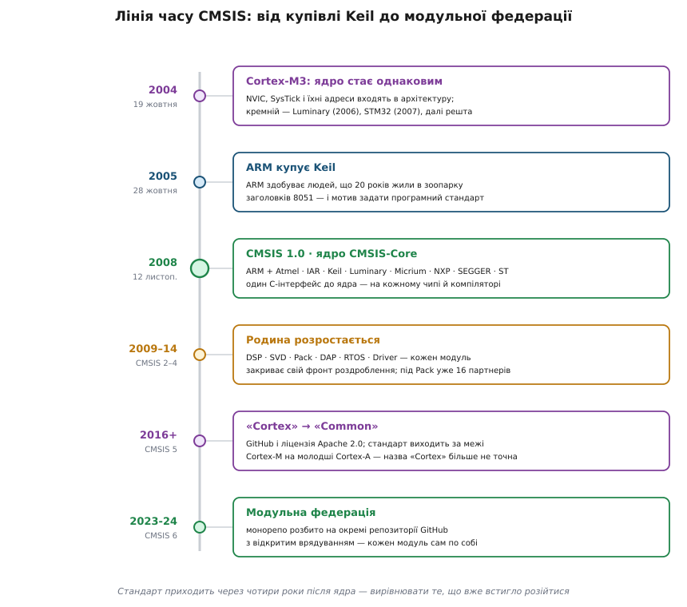

# 📜 Як народився CMSIS: угода восьми компаній проти зоопарку заголовків

12 листопада 2008 року ARM оголосив у Кембриджі перший CMSIS — а ядро Cortex-M3, заради якого стандарт узагалі має сенс, на той час уже чотири роки як було представлене, понад два роки як продавалося в кремнії й устигло обрости власними заголовками в кожного виробника. Ця затримка не випадкова, і саме вона пояснює дві риси стандарту, які інакше виглядають довільними: чому він з'явився аж тоді — і чому в ньому немає периферії.

## Ядро без нутрощів: за часів ARM7 стандартизувати не було чого

Щоб зрозуміти, чому 2008-й, треба спершу побачити, чому не 1998-й. До Cortex-M основним 32-бітним ядром у мікроконтролерах був ARM7TDMI, і в нього назовні є рівно два входи переривання — nIRQ і nFIQ. Усе, що перетворює десятки подій від периферії на ці два дроти — пріоритети, маски, вибір вектора, — до ядра **не входить**. Це окремий блок, який виробник добудовує сам: NXP брала готовий блок ARM PrimeCell VIC (PL190), Atmel робила власний AIC, решта — ще щось своє.

Наслідок для програміста був не косметичний. Код, який вмикає лінію переривання, відрізнявся між чипами не тому, що хтось назвав функцію інакше, а тому, що **під нею було інше залізо**: інші регістри, інша логіка пріоритетів, інший спосіб дізнатися, хто саме перервав. Спільний заголовок тут був би обманом — під ним не було нічого спільного. Про переносність коду, що [керує перериваннями](topic:programming/interrupts) — тобто вирішує, яка подія має право перебити поточну роботу, — на рівні C тоді навіть не питали; питали лише, чи знайдеться під цей чип бібліотека від виробника.

Звідси перше правило, яке потім визначить форму CMSIS: **програмний стандарт може закріпити лише те, що залізо вже зробило однаковим.** Спершу має з'явитися спільне залізо — і аж тоді має сенс сперечатися про імена.

## 19 жовтня 2004: ядро, у якому нарешті є що стандартизувати

Спільне залізо з'явилося 19 жовтня 2004 року: на першій конференції розробників ARM у Санта-Кларі компанія представила Cortex-M3 — перше ядро профілю ARMv7-M (статус: усталено, дата з тодішнього релізу ARM). Головна новина була не в продуктивності, а в тому, що контролер переривань **утягнули всередину архітектури**. [NVIC](topic:programming/nvic-cortex-m) — вкладений контролер із пріоритетами, який сам зберігає контекст і сам знаходить вектор, — тепер частина ядра, як і системний таймер SysTick, блок системного керування SCB і фіксовані адреси, за якими вони лежать. Виробник їх не проєктує й не може переставити: він отримує їх разом із ліцензією на ядро.

А ліцензію на це ядро ARM продає всім охочим — бізнес компанії саме в тому, щоб [ліцензувати IP-ядра](topic:electronics/ip-licensing), тобто продавати не чипи, а право вбудувати чуже ядро у свій чип. Тому з 2004 року склалася ситуація, якої в мікроконтролерах доти не було: у прямих конкурентів усередині стоїть **байт-у-байт той самий блок**. [Ядро Cortex-M](topic:programming/cortex-m) в чипі ST і в чипі NXP — не «схожі», а тотожні.

От тепер сперечатися про імена є сенс. І тут починається найцікавіше: наступні чотири роки цим не займався ніхто.

## Чотири роки, за які кожен написав своє

Перший кремній із Cortex-M3 випустила не котрась із великих компаній, а стартап із Остіна: 8 травня 2006 року Luminary Micro показала LM3S101 і LM3S102 — 20 МГц, 8 КБ флеш, 2 КБ ОЗП, ціна — долар за штуку (статус: усталено, за галузевою пресою тих днів). У червні 2007-го ST вивела на ринок родину STM32 F1 — і вона стала масовою. Далі підтяглися NXP, Atmel, Toshiba й інші.

Кожен приходив зі своїм комплектом заголовків. Той самий NVIC в одного звався одним набором структур, в іншого — іншим; номер лінії таймера в одного був макросом, в іншого — елементом переліку з іншою назвою; функція, що налаштовує тактування до `main`, у кожного мала свою сигнатуру; стартовий файл писався за власними домовленостями. Друга вісь розбіжності йшла впоперек першої: під ті самі чипи працювали три різні [тулчейни](topic:programming/toolchain) — набори компілятора, асемблера й лінкера, — і кожен пропонував свій спосіб записати машинну команду, якої в мові C немає.

Тобто коли ARM нарешті взявся за стандарт, розбіжність уже була **фактом**, а не ризиком: існував написаний код, випущені прилади, надрукована документація. Стандарт міг бути тільки латкою поверх наявного — і головною його чеснотою мусила стати дешевизна переходу. Звідси характерна обіцянка першого релізу, винесена просто в текст оголошення: увесь шар доступу до ядра коштує менше ніж 1 КБ коду й менше ніж 10 байтів ОЗП. Виробникові пропонували не переписувати свою бібліотеку, а **додати тонкий шар імен** поверх того, що в нього вже є, — і навіть найощадливіший чип від цього нічого не втрачав.

## 12 листопада 2008: вісім підписів під однією домовленістю

У релізі того дня ARM описав CMSIS формулою «vendor-independent hardware abstraction layer» — незалежний від виробника шар абстракції заліза (ARM, прес-реліз від 12 листопада 2008). Розшифровувалася абревіатура тоді як *Cortex Microcontroller Software Interface Standard*, і в переліку партнерів стояли вісім компаній: Atmel, IAR, Keil, Luminary Micro, Micrium, NXP, SEGGER, STMicroelectronics.

Цей склад варто читати як карту фронтів роздроблення — кожен учасник представляв свій:

- **Виробники кремнію** — Atmel, Luminary Micro, NXP, STMicroelectronics. Це вони пишуть заголовки під свої чипи, і без їхньої згоди стандарт лишився б папером.
- **Розробники компіляторів** — IAR і Keil. Це вони вирішують, як мовою C записати те, чого в C немає: заборону переривань, бар'єри, сон до переривання.
- **SEGGER** — виробник налагоджувальних пробників J-Link. Відлагоджувачеві потрібно знати, де в пам'яті лежать регістри ядра й за якими іменами шукати структури, інакше він не покаже нічого, крім голих адрес.
- **Micrium** — компанія Жана Лабросса (*Jean J. Labrosse*), автора ядра реального часу µC/OS. Ядро [системи реального часу](topic:algorithms/real-time-systems) — тобто планувальник, який зобов'язаний укластися в заданий строк, — це якраз той код, який при кожному перенесенні на новий чип чіпає SysTick, PendSV і регістри пріоритетів. Для нього різнобій імен коштував найдорожче: свій порт доводилося робити наново під кожного виробника й кожен компілятор.

Поширювали перший CMSIS безкоштовно, через тодішній мікроконтролерний портал ARM onARM.com. У самому релізі ARM обіцяв продовження: шар доступу до проміжного програмного забезпечення — для Ethernet і SD/MMC — та інтерфейси для відлагодження RTOS. У тій формі ці плани не збулися; ті самі фронти повернулися пізніше під іншими назвами — CMSIS-Driver і CMSIS-RTOS (статус: моє зіставлення обіцяного в релізі з тим, що реально вийшло).

## Чому стандарт вийшов зі столу інструментальників, а не архітекторів

Логічно було б чекати, що інтерфейс до ядра напишуть ті, хто ядро проєктував. Насправді голосом ARM у цьому оголошенні був **Райнгард Кайль** (нім. *Reinhard Keil*), директор напряму інструментів для мікроконтролерів в ARM. А потрапив він в ARM за три роки до того: 28 жовтня 2005 року ARM оголосив про купівлю обох підрозділів Keil — Keil Elektronik GmbH у Мюнхені та Keil Software Inc. у Плейно (Техас). Тодішній керівник ARM Воррен Іст (англ. *Warren East*) пояснював покупку прямо: ринок мікроконтролерів компанія бачила зоною свого зростання, і їй бракувало готового набору інструментів.

Що це були за люди. Keil заснували 1982 року Ґюнтер Кайль (нім. *Günter Keil*) і той самий Райнгард, 1985-го фірма стала Keil Elektronik GmbH, а 1988-го випустила перший C-компілятор для 8051 (статус: усталено, за корпоративною історією Keil). Далі двадцять років вони жили тим, що вели базу пристроїв — сотні різновидів 8051 від десятків виробників, у кожного свій набір спеціальних регістрів і свій заголовок. Тобто це була компанія, для якої роздроблення екосистеми — не абстрактна незручність, а щоденна собівартість: кожен новий різновид чипа означав ще один файл, який треба скласти, перевірити й підтримувати роками.

Причинний зв'язок тут — уже моя інтерпретація, не цитата з документа, але вона добре тримається на фактах: **CMSIS має форму відповіді інструментальника, а не архітектора.** Це не бібліотека, яку лінкуєш, і не новий рівень заліза — це заголовки, імена й домовленості, тобто найдешевше, на що можна вмовити вісьмох конкурентів одразу. Компанія, що живе з компіляторів, міряє роздроблення в тікетах підтримки й у файлах, які треба вести вручну, — і розв'язок пропонує в тій самій валюті.

## Чого в стандарті свідомо немає

Той самий реліз 2008 року містить фразу, яку легко проминути очима, а вона — ключ до всієї конструкції: стандартизація програмних інтерфейсів дає виробникам змогу зосередити ресурси на **відмітних рисах своєї периферії**. Тобто периферію лишили поза стандартом не тому, що не встигли, і не тому, що це технічно важко. Її лишили поза стандартом **навмисно, як умову угоди**.

Інакше й бути не могло. Домовленість між конкурентами може закріпити лише те, чим ніхто не жертвує. Ядро — чужа для них усіх власність ARM, воно однакове хай там що: погодитися на спільні імена для NVIC не коштує виробникові нічого, бо ніякої переваги над сусідом він у цих іменах не має. А периферія — це і є продукт: саме таймерами, аналоговими блоками, контролерами інтерфейсів і зручністю власної бібліотеки виробник відрізняється від сусіда, у якого всередині те саме ядро. Спільний API до периферії стер би цю відмінність — і жоден із чотирьох виробників за тим столом його б не підписав.

Тому [шар абстрагування заліза](topic:programming/hardware-abstraction-layer) — той, що ховає регістри за узагальненими викликами на кшталт «надіслати байт», — лишився приватною справою кожного: ST HAL, NXP SDK, і так далі. CMSIS натомість домовився не про **зміст** периферії, а лише про її **форму запису**: типовані структури в заголовках, а згодом єдиний машинний опис регістрів і єдине пакування.

> 🔧 **Навіщо це.** Це історичне спостереження працює як робочий фільтр щоразу, коли тобі пропонують черговий «стандарт» в [екосистемі мікроконтролерів](topic:programming/mcu-ecosystem). Подивися не на технічну красу специфікації, а на те, хто її підписав і що кожен утратить, якщо вона переможе. Там, де інтереси збігаються, стандарт справді стає всюдисущим — CMSIS-Core за вісімнадцять років опинився практично в кожному пакеті підтримки чипа. Там, де учасники конкурують саме цим, специфікація лишається переважно на папері — CMSIS-Driver так і не витіснив бібліотеки виробників, хоч технічно з ним усе гаразд.

## Як стандарт учився на власних помилках

Перша редакція вийшла надто рано, щоб бути правильною, — і це видно з її ж історії версій. У CMSIS 1.00–1.20 глобальна змінна з тактовою частотою звалася `SystemFrequency`, а функцію початкового налаштування `SystemInit()` кликали з `main()`. У версії 1.30 обидва рішення переграли:

```c
/* CMSIS 1.00 – 1.20 */
extern uint32_t SystemFrequency;    /* «частота» — чого саме? */
void SystemInit(void);              /* кликали з main() */

/* CMSIS 1.30 і далі */
extern uint32_t SystemCoreClock;    /* саме частота ЯДРА, у герцах */
void SystemInit(void);              /* кличе стартовий код, ще до C-рантайму */
void SystemCoreClockUpdate(void);   /* перерахувати з регістрів тактування */
```

Причина переносу виклику дуже конкретна. На чипах із зовнішньою пам'яттю контролер цієї пам'яті треба налаштувати ще до того, як [стартовий код](topic:programming/bootloader) — послідовність від скидання до `main()` — почне переносити ініціалізовані дані на місце, бо частина цих даних може лежати саме в зовнішній пам'яті. А сам контролер пам'яті не запрацює, поки не заведене тактування. Отже, `SystemInit()` мусить викликатися раніше, з самого стартового файлу, і не має права спиратися на глобальні змінні, яких на той момент ще ніхто не проініціалізував. Перейменування ж `SystemFrequency` → `SystemCoreClock` прибрало двозначність: у чипа частот багато, а ця — саме ядра.

Дрібниця, але показова: перший контракт написали, маючи під рукою одне ядро й кілька чипів, а виправили тоді, коли чипів стало досить, щоб контракт зламався об реальність.

## Як «Cortex» став «Common»

Далі стандарт розростався разом із родиною ядер і з амбіціями ARM. Версія 1.01 додала підтримку Cortex-M0, представленого 25 лютого 2009 року; 2.0 — Cortex-M4; 2.10 додала бібліотеку CMSIS-DSP; 3.0 — API до RTOS і офіційну підтримку GCC. Реліз 4.0 від 24 лютого 2014 року приніс CMSIS-Pack і CMSIS-Driver, і за ним стояло вже не вісім компаній, а шістнадцять — серед них Cypress, Freescale, Infineon, Nordic, Nuvoton, Silicon Labs, Texas Instruments, Toshiba. За шість років домовленість із вузького кола перетворилася на галузеву норму.


*Спільне залізо з'явилося 2004-го, спільний інтерфейс — аж наприкінці 2008-го. У цьому проміжку й видно головну рису стандарту: він не проєктував майбутнє, а вирівнював те, що вже встигло розійтися.*

Перелом стався у версії 5. Розробку перенесли на GitHub і відкрили під ліцензією Apache 2.0 — щоб приймати внески збоку, а не лише від партнерів за столом. Тоді ж додали підтримку архітектури ARMv8-M, а невдовзі — CMSIS-Core для молодших ядер Cortex-A (A5, A7, A9), тобто вже не для мікроконтролерів, а для прикладних процесорів.

Ось на цьому кроці назва перестала бути правдою: «C» в абревіатурі означала *Cortex* у сенсі «Cortex-M». Реліз ARM від лютого 2014 року ще розшифровує CMSIS як *Cortex Microcontroller Software Interface Standard*; документація версій 5 і 6 розшифровує вже як *Common Microcontroller Software Interface Standard* — «спільний». Окремого оголошення про перейменування я не знайшов: воно сталося тихо, десь між 2014-м і виходом п'ятої версії, разом із виходом стандарту за межі Cortex-M (статус: датування за самими документами, не за заявою про зміну назви).

Останній поворот — розділення. У червні 2021 року ARM виніс пакетну частину в окремий проєкт Open-CMSIS-Pack, який ведуть під врядуванням Linaro разом із NXP і ST. А CMSIS 6 (реліз 6.0.0 — 18 грудня 2023-го, 6.1 — травень 2024-го) розбив єдиний репозиторій на окремі, по одному на модуль, кожен зі своїм темпом випусків.

Так стандарт, що народився як угода вісьмох компаній про імена, за півтора десятиліття став федерацією окремих проєктів — і продовжує триматися на тому самому принципі, з якого починався: жорстко фіксувати те, що в усіх однакове, і не зазіхати на те, чим учасники між собою конкурують.
