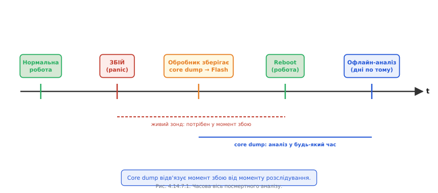
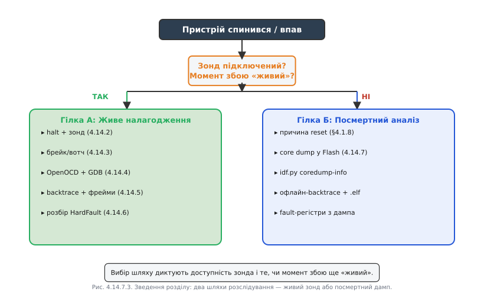

# Посмертний аналіз: core dump і відновлення картини після того, як пристрій уже впав

Розбір [HardFault під живим відлагоджувачем](book:programming/hardfault) передбачає, що ти **сидиш поруч із зондом**, підключеним у мить збою. Але реальний світ рідко буває таким зручним. Пристрій встановлено у клієнта за тисячу кілометрів. Збій стався о третій ночі. Пристрій уже перезавантажився і знову «нормально» працює — або, навпаки, впав остаточно. Як розслідувати смерть, якої ти не бачив? Відповідь — заздалегідь підготовлена «чорна скринька»: **core dump**.

### Ідея: зберегти кадр смерті

У мить збою, перш ніж перезавантажитись, спеціальний **панічний обробник** ESP-IDF встигає виконати кілька сотень мілісекунд корисної роботи: він обходить усі задачі FreeRTOS, зчитує їхні регістри й стеки та зберігає цей знімок у надійне місце — окремий розділ Flash або виводить у UART.

Пізніше — можливо, через тижні — цей знімок «оживляють» на хості за допомогою GDB і того самого .elf: відкривається звичайна GDB-сесія, де видно стан системи рівно в момент збою. Жодних запитань «чому не підключив відлагоджувач» — момент смерті зафіксовано.

Образ: якщо [журнал подій](book:programming/why-persist) — це «чорна скринька» як лог того, що **передувало** збою, то core dump — це повний кадр **самого моменту смерті**.



*Рис. Core dump відв'язує момент збою від моменту розслідування.*

### Механіка на ESP32: куди писати і як читати

ESP-IDF має вбудовану підтримку core dump. Головне рішення — **куди зберігати**:

- **У Flash**: потрібен окремий розділ у [таблиці розділів](book:programming/partition-table) з типом `coredump`. Зазвичай 64–256 КБ. Після перезавантаження дані залишаються до явного очищення.
- **У UART**: знімок виводиться у консоль при збої у форматі Base64. Зручно для лабораторії, непрактично у полі.

Конфігурація у `sdkconfig`:
```
CONFIG_ESP_COREDUMP_ENABLE_TO_FLASH=y
CONFIG_ESP_COREDUMP_DATA_FORMAT_ELF=y
```

Таблиця розділів (`partitions.csv`):
```
# Name,   Type, SubType,  Offset,  Size
nvs,      data, nvs,      0x9000,  0x6000
coredump, data, coredump, 0xF000,  0x40000
factory,  app,  factory,  0x10000, 0x300000
```

Після збою і перезавантаження зчитуємо та аналізуємо:
```bash
# Спосіб 1: через idf.py (зчитує з пристрою і відразу аналізує)
idf.py coredump-info

# Спосіб 2: зберегти у файл, аналізувати пізніше
idf.py coredump-info -o coredump.bin
python $IDF_PATH/components/espcoredump/espcoredump.py \
    info_corefile -c coredump.bin build/myapp.elf
```


*Рис. Дамп — компактний кадр моменту смерті, читаний лише разом зі своїм .elf.*

### Що видобуваємо з дампа

Офлайн-аналіз дає майже те саме, що і живий відлагоджувач, — з одним винятком: ти не можеш «крокнути далі».

- **Backtrace кожної задачі** — де саме перебувала кожна задача у момент збою. Яка задача впала, яка чекала на семафор, яка виконувала мережевий виклик.
- **Стан регістрів** для кожної задачі — PC, SP, LR та всі загальні регістри.
- **Значення глобальних змінних** — якщо вони потрапили у збережену ділянку пам'яті.
- **Fault-розбір** як [при HardFault](book:programming/hardfault) — якщо збій був HardFault, CFSR/BFAR збережені в дампі.

```
======== Backtrace for task 'sensor_task' ========
#0  sensor_read (dev=0x3FFB1234, buf=0x0) at sensor.c:88
#1  update_sensors () at tasks/sensors.c:45
#2  sensor_task (arg=0x0) at tasks/sensors.c:120

======== Backtrace for task 'wifi_task' ========
#0  xQueueReceive () at queue.c:112
#1  wifi_handler () at wifi.c:67

Crash reason: StoreProhibited (write to address 0x0)
```

### Межі і чесні компроміси

Core dump не всесильний. Обробник збою виконується в момент паніки, коли RTOS зупинена, — він мусить бути максимально надійним і не спричиняти нових збоїв, як того вимагає [реєнтерабельність і безпека обробника](book:programming/isr). Запис у Flash займає час і потребує нормальної роботи Flash-драйвера — якщо збій стався у Flash-драйвері, дамп не збережеться.

Не вся пам'ять потрапляє у дамп: зберігають стеки задач і критичні ділянки. Купа (heap) зазвичай не включається — занадто велика. Якщо збій пошкодив сам стек, наприклад [переповненням стека задачі](book:programming/task-stacks), backtrace може бути неповним або хибним.

### Стратегія поля: дамп плюс причина reset

Core dump розповідає «де і як впало». Але для повної картини він поєднується з ще одним інструментом — [причиною скидання](book:programming/reset-causes). Причина скидання зберігається в регістрі `RTC_CNTL_RESET_CAUSE` і доступна після будь-якого перезавантаження:

```c
esp_reset_reason_t reason = esp_reset_reason();
// ESP_RST_PANIC    — впав у паніку (core dump може бути доступний)
// ESP_RST_BROWNOUT — просадка живлення
// ESP_RST_WDT      — watchdog
// ESP_RST_DEEPSLEEP — прокинувся з глибокого сну
```

Причина скидання каже **ЩО** (паніка, brownout, WDT), core dump каже **ДЕ і ЧОМУ**. Разом вони дають повне посмертне розслідування без жодного інженера на місці.



*Рис. Вибір шляху диктують доступність зонда і те, чи момент збою ще «живий».*

**Worked-приклад. Видобути core dump і отримати backtrace.**

```bash
# Пристрій перезавантажився, підключаємо USB, читаємо дамп
$ idf.py coredump-info
Loading core dump from device...

==================== CURRENT THREAD REGISTERS =====================
pc             0x400d1f88   0x400d1f88 <sensor_read+12>
sp             0x3ffb6e80
...

==================== BACKTRACE =======================
#0  sensor_read (dev=0x3ffb1234, buf=0x0) at main/sensor.c:88
    buf = 0x0
#1  0x400d2abc in update_sensors () at main/tasks.c:45
#2  0x400d2f10 in sensor_task (arg=0x0) at main/tasks.c:120

==================== ALL THREADS =======================
Task 'sensor_task' (current, panicked):
  → sensor_read, sensor.c:88
Task 'wifi_task' (blocked on queue):
  → xQueueReceive, queue.c:112
Task 'app_task' (blocked on semaphore):
  → xSemaphoreTake, semphr.h:340

PANIC REASON: StoreProhibited
EXCEPTION ADDR: 0x00000000 (NULL pointer write)
```

Результат: той самий ланцюг, що його дав би [розбір HardFault під зондом](book:programming/hardfault), але без жодного підключеного зонда в мить збою. `sensor_read` спробував записати через `buf = NULL`.

> 🔧 **Навіщо це:** core dump перетворює «загадково перезавантажується раз на тиждень у клієнта» на конкретний стек і рядок — без відрядження, без відлагоджувача на місці, з одного збереженого файлу.

---

Core dump закриває інструментальний бік налагодження: від фізичних дротів [JTAG/SWD](book:programming/swd-jtag-internals) через [читання живого HardFault](book:programming/hardfault) до посмертного знімка тут. Усі ці методи дають змогу зупинити час, пройтися між завмерлими задачами й розслідувати смерть, якої ніхто не бачив. Але знайти причину і вміти на неї реагувати — різні речі: як прошивка має поводитись, отримавши паніку, як відновитись безпечно, не зашкодивши даним і апаратурі, і як зробити систему стійкою до несподіваного, належить уже до [відмовостійкої обробки помилок](book:programming/error-handling).
