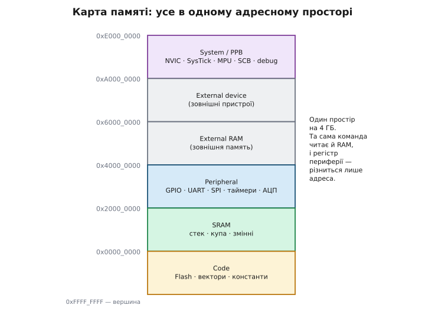
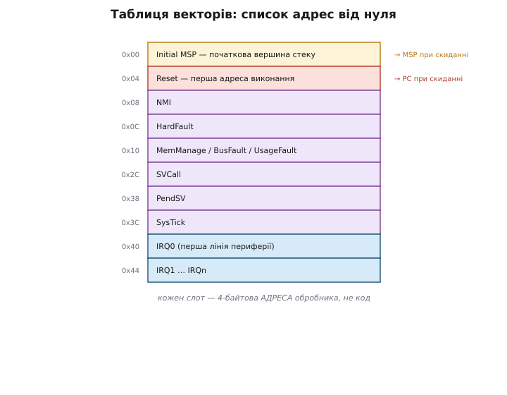
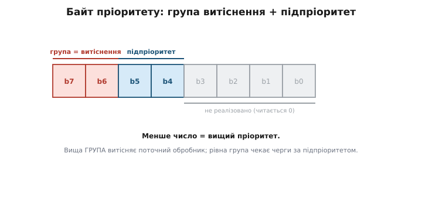
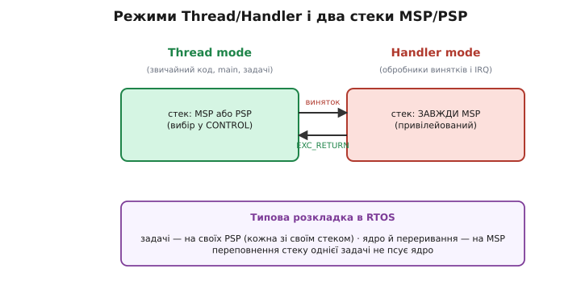
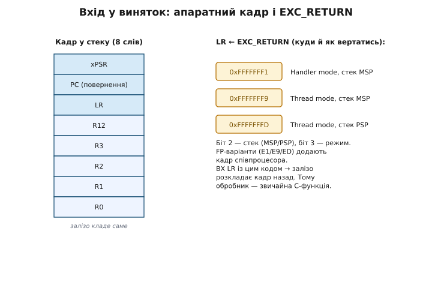
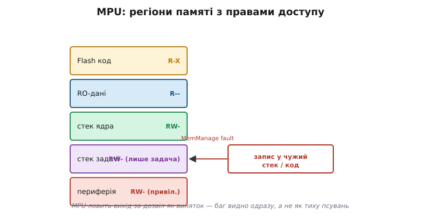
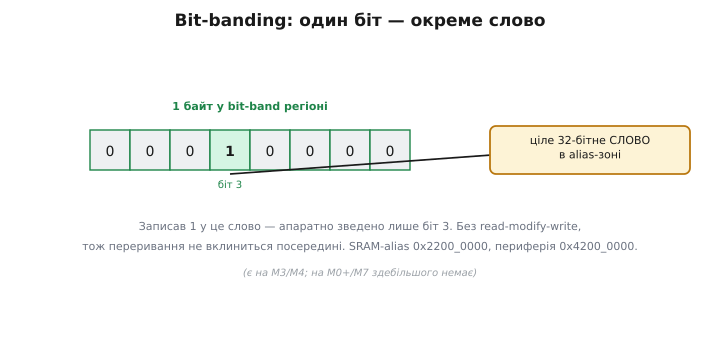

# ARM Cortex-M: архітектура зсередини

Знати, що STM32 і nRF мають «однакове ядро», — корисно, але поверхово. Справжня сила приходить, коли розумієш, *як* це ядро влаштоване: де в пам'яті лежать вектори переривань, що саме залізо робить за ті наносекунди між подією й твоїм обробником, чому RTOS може дати кожній задачі окремий стек, і чому звернення за чужою адресою інколи валить чип у HardFault, а інколи тихо псує сусідні дані. Усе це — не магія SDK, а кілька строго визначених механізмів ядра. Розберемо їх по черзі, від адресного простору до входу й виходу з винятку, бо саме ці деталі відрізняють інженера, який *користується* мікроконтролером, від того, хто його *розуміє*.

## Адресний простір: усе в одній карті

Перше, що задає характер Cortex-M, — єдиний 32-бітний адресний простір на 4 ГБ (2³² байтів). У ньому немає окремих «портів вводу-виводу», як у 8086 чи AVR; геть усе — флеш із кодом, оперативна пам'ять, регістри периферії, навіть регістри самого ядра — має свою адресу в одному просторі. Та сама команда читання `LDR` дістає і змінну зі стеку, і байт стану UART — різниться лише число-адреса. Архітектуру з таким підходом називають *memory-mapped I/O* (відображений у пам'ять ввід-вивід): периферія «вмонтована» в карту пам'яті.

ARM не лишає розкладку на відкуп виробникові — вона фіксована на рівні архітектури, грубо півгігабайтовими смугами:

```
0x0000_0000  ┐ Code        — флеш, вектори, константи (звідси виконується код)
0x2000_0000  ┐ SRAM        — стек, купа, змінні
0x4000_0000  ┐ Peripheral  — регістри GPIO, UART, SPI, таймерів, АЦП
0x6000_0000  ┐ External RAM — зовнішня пам'ять (FSMC/FMC)
0xA000_0000  ┐ External device
0xE000_0000  ┐ System/PPB  — регістри ядра: NVIC, SysTick, MPU, SCB, відлагодження
0xFFFF_FFFF  ┘ вершина
```


*Увесь простір на 4 ГБ поділено на фіксовані смуги. Код стартує від нуля, оперативна пам'ять — від 0x2000_0000, регістри периферії — від 0x4000_0000, а регістри самого ядра зведено вгорі, за 0xE000_0000. Та сама команда читає й комірку RAM, і регістр периферії — змінюється лише адреса.*

Найважливіша для розуміння ядра смуга — остання, **PPB** (*Private Peripheral Bus* — приватна шина периферії ядра) за адресою 0xE000_0000. Тут живуть не зовнішні пристрої, а сам мозок Cortex-M: блок керування винятками й NVIC, таймер SysTick, MPU, регістри стану. Ця ділянка — частина архітектури, тож вона **однакова** на STM32, nRF і RP2040. Її серце — **SCS** (*System Control Space* — простір системного керування) від 0xE000_E000, і всередині нього: SysTick (від 0xE000_E010), NVIC (від 0xE000_E100), SCB (*System Control Block* — блок системного керування, від 0xE000_ED00). Коли CMSIS пише `SysTick->LOAD = ...`, за макросом ховається просто запис за фіксованою адресою в цій смузі.

> 🔧 **Навіщо це.** Розуміючи карту, читаєш будь-який datasheet швидше: побачив адресу `0x4002_0000` — це периферія (десь GPIO/таймер), `0x2000_xxxx` — твоя RAM, `0xE000_Exxx` — ядро. А HardFault із адресою доступу одразу підказує клас помилки: вихід за межі флешу, нульовий покажчик (адреса близько до 0) чи звернення до неіснуючої периферії.

## Регістри ядра й Thumb

Усередині ядро має шістнадцять 32-бітних регістрів загального вжитку, r0–r15, де три старші мають спеціальну роль: r13 — покажчик стеку SP (*stack pointer*), r14 — регістр зв'язку LR (*link register*, куди кладеться адреса повернення з виклику), r15 — лічильник команд PC (*program counter*). Окремо стоїть **xPSR** (*Program Status Register* — регістр стану програми): у ньому прапорці результату (нуль, перенос, знак), номер активного винятку й біт стану.

Команди ядро виконує в системі команд **Thumb** (назва образна: «thumb» — великий палець, тобто компактний набір, «менший за повну руку» ARM). Класичний ARM мав 32-бітні команди; Thumb стиснув найчастіші з них до 16 бітів, щоб код займав удвічі менше флешу — критично для мікроконтролера. **Thumb-2** (із 2003 року) додав ще й 32-бітні команди в той самий потік, тож зник старий компроміс «компактно або потужно»: одна система команд змішує 16- і 32-бітні слова й дає і щільність, і повноту. Cortex-M виконує **лише** Thumb — переходу в старий 32-бітний режим ARM тут просто немає, тому біт T у xPSR завжди стоїть, а спроба його скинути валить чип у фолт.

Тут і пролягає перша межа між профілями. **M0/M0+/M1** реалізують Thumb-1 плюс невелику підмножину Thumb-2 (лише кілька системних команд), без апаратного ділення. **M3/M4/M7/M33** мають **повний** Thumb-2: апаратне цілочислове ділення, насичувальну арифметику, бітові маніпуляції. Тому код, зібраний під M4, не обов'язково піде на M0+ — але код під M0+ піде всюди вгору.

## Таблиця векторів: список адрес від нуля

Що лежить за адресою 0x0000_0000, з якої ядро стартує? Не перша команда, як можна було б подумати, а **таблиця векторів** — масив 32-бітних адрес-покажчиків на обробники. Це елегантне рішення: замість того щоб у фіксованих місцях пам'яті тримати самі обробники, ядро тримає там лише *адреси*, куди стрибнути.

Дві перші клітинки особливі й задають увесь старт чипа:

```
зміщення 0x00  →  початкове значення MSP (вершина стеку)
зміщення 0x04  →  адреса Reset_Handler (перша команда виконання)
```

Послідовність скидання звідси випливає буквально механічно: щойно знято скидання, залізо читає 4 байти за адресою 0, кладе їх у MSP — і стек уже робочий, *ще до першої команди*. Потім читає 4 байти за адресою 4, кладе в PC — і виконання стрибає на `Reset_Handler`, який налаштує тактування, скопіює ініціалізовані дані з флешу в RAM, обнулить `.bss` і викличе `main`. Жодного «магічного» завантажувача — лише дві адреси в таблиці.

Далі в таблиці йдуть **системні винятки** ядра (однакові скрізь), а вже за зміщенням 0x40 — **лінії переривань периферії** (IRQ), кількість і призначення яких задає вже виробник:


*За нульовою адресою лежить не код, а таблиця 4-байтових адрес-обробників. Слот 0 — початкова вершина стеку, слот 1 — Reset, далі фіксовані системні винятки (NMI, HardFault, SVCall, PendSV, SysTick), а від зміщення 0x40 — лінії переривань периферії, які визначає виробник чипа.*

Системні винятки мають усталений порядок і власні номери: NMI (*non-maskable interrupt* — немаскований виняток), HardFault (загальний фолт), MemManage/BusFault/UsageFault (детальні фолти на M3+), SVCall (*supervisor call* — виклик супервізора, для входу в ядро ОС), PendSV (*pendable service* — відкладена службова дія, основа перемикання задач у RTOS), SysTick. Розуміти цей порядок критично для двох речей: написання стартового файлу й розбору [HardFault](book:programming/hardfault), коли треба за адресою у векторі впізнати, який саме обробник спрацював.

Таблицю можна **перенести** з нуля кудись інше — регістр VTOR (*Vector Table Offset Register*) у SCB задає її базу. Це потрібно завантажувачам (*bootloader*): вони стартують зі своєї таблиці на нулі, а перед стрибком у застосунок переставляють VTOR на таблицю застосунку десь усередині флешу.

> 🔧 **Навіщо це.** Коли пишеш завантажувач або кладеш застосунок не на початок флешу, ти **зобов'язаний** виставити VTOR на нову таблицю — інакше переривання стрибатимуть у вектори завантажувача, і поведінка стане незрозумілою. А якщо чип валиться в HardFault одразу після стрибка в застосунок — перше, що перевіряють, чи правильно виставлено VTOR і чи перший слот нової таблиці містить чинну вершину стеку.

## NVIC: пріоритети, витіснення, підпріоритет

NVIC — це апаратний диспетчер переривань, *вбудований у ядро* (а не окрема периферія), тому й однаковий усюди. Його завдання: коли спрацьовує одразу кілька джерел, вирішити, кого обслужити першим, і — головна родзинка — дозволити терміновому перериванню **витіснити** (*preempt*) той обробник, що вже виконується.

Кожному джерелу NVIC дає **пріоритет** — число у спеціальному регістрі. Тут перша пастка для інтуїції: **менше число означає вищий пріоритет**. Пріоритет 0 — найтерміновіший, він переб'є все. Це не примха: пріоритети ядра — знакові цілі, і найвищі зарезервовано за від'ємними (Reset = −3, NMI = −2, HardFault = −1), тож звичайні переривання з їхніми невід'ємними числами природно стоять нижче за фатальні події.

Друга тонкість — скільки бітів пріоритету насправді працює. Архітектура дозволяє до 8 бітів (256 рівнів), але виробник реалізує лише старші: STM32 — зазвичай 4 біти (16 рівнів), деякі M0+ — лише 2 (4 рівні). Реалізовано *старші* біти, тож молодші завжди читаються нулем. Звідси типова помилка: записати пріоритет 1 і 2 на чипі з 4 значущими бітами — і отримати, що вони *обидва* лягають в той самий апаратний рівень, бо різниця ховається в незначущих молодших бітах. Правильно — рознести значення на крок реалізованого поля.

Найцікавіше — байт пріоритету ділиться на **дві частини** полем PRIGROUP у регістрі AIRCR (*Application Interrupt and Reset Control Register*):


*Байт пріоритету ділиться полем PRIGROUP на дві частини. Старші біти — група витіснення: вищу групу пускають перервати обробник, що вже виконується. Молодші — підпріоритет: він лише впорядковує переривання однакової групи, що чекають разом, але витіснити одне одного вони не можуть. Праворуч — біти, які виробник не реалізував; вони завжди читаються нулем.*

Різниця між цими частинами — суть моделі витіснення:
- **Група (preemption priority)** вирішує право **перервати**: переривання вищої групи входить *поверх* обробника нижчої, утворюючи вкладеність (звідси *Nested* у назві NVIC). Глибина вкладеності обмежена лише кількістю рівнів і стеком.
- **Підпріоритет (subpriority)** діє лише тоді, коли два переривання *однакової* групи чекають одночасно: він каже, кого взяти першим, але перервати один одного вони **не можуть** — другий чекає, поки перший добіжить.

Це дає тонке керування. Наприклад, термінову обробку аварійного стопу ставлять у найвищу групу, щоб вона рвала будь-що; кілька рутинних переривань зв'язку лишають в одній групі з різними підпріоритетами — щоб вони не перебивали одне одного (і не плодили вкладеність та стрибки стеку), але обслуговувались у потрібному порядку.

> 🔧 **Навіщо це.** Розподіл пріоритетів — типове джерело хитрих багів. Якщо короткий, але частий обробник (наприклад, таймер) поставити вищою групою за критичну секцію зв'язку — він її витіснятиме й рватиме тайминги. А ще для RTOS: ядро (FreeRTOS) вимагає, щоб переривання, які кличуть його API, мали групу **не вищу** за поріг `configMAX_SYSCALL_INTERRUPT_PRIORITY` — інакше вони втручаються в момент, коли ядро тримає власну критичну секцію, і система валиться.

## Маскування пріоритетів

Іноді треба не розставити пріоритети, а тимчасово **заглушити** переривання — на час критичної секції, коли структуру даних не можна лишати в півзміненому стані. Cortex-M дає для цього три спеціальні регістри замість грубого «вимкнути все»:

- **PRIMASK** — однобітний рубильник: піднятий, він блокує **усі** переривання, крім NMI й HardFault. Це і є те, що ховається за CMSIS-функціями `__disable_irq()`/`__enable_irq()`.
- **BASEPRI** — тонший: блокує лише переривання, чия група **не вища** за заданий поріг, а терміновіші пускає. Саме ним RTOS реалізує короткі критичні секції, не глушачи аварійні переривання.
- **FAULTMASK** — як PRIMASK, але глушить ще й HardFault; використовується рідко, у спеціальній обробці фолтів.

Різниця між PRIMASK і BASEPRI практична: грубий `__disable_irq()` на час критичної секції підвищує затримку *найтерміновіших* переривань, а BASEPRI дозволяє захистити дані від рутинних переривань, лишивши «двері» для аварійних.

## Режими Thread/Handler і два стеки

Cortex-M завжди перебуває в одному з двох режимів. **Thread mode** — звичайний код: `main`, фонова петля, задачі RTOS. **Handler mode** — виконання обробника винятку чи переривання. Перехід туди-сюди автоматичний: будь-який виняток заводить ядро в Handler, а вихід повертає в Thread.

Ключова деталь — ядро має **два** покажчики стеку, фізично різні регістри, які по черзі грають роль r13/SP:
- **MSP** (*Main Stack Pointer*) — головний стек; з нього стартує чип, і його **завжди** використовує Handler mode.
- **PSP** (*Process Stack Pointer*) — стек процесу; Thread mode може користуватися ним замість MSP (вибір — бітом у регістрі CONTROL).


*Thread mode виконує звичайний код і може стояти або на MSP, або на PSP. Handler mode (обробники винятків) завжди привілейований і завжди на MSP. Виняток заводить ядро в Handler, EXC_RETURN повертає назад. RTOS використовує це так: кожна задача живе на власному PSP, а ядро й переривання — на спільному MSP, тож переповнення стеку однієї задачі не псує ядро.*

Навіщо два стеки? Це фундамент будь-якої RTOS. Кожна задача дістає **власний** стек на PSP; ядро операційної системи й усі переривання працюють на MSP. Розділення дає дві важливі властивості. По-перше, перемикання задач зводиться до підміни PSP — ядро просто перемикає покажчик на стек іншої задачі. По-друге, ізоляція: якщо одна задача переповнить свій стек, вона зіпсує (у гіршому разі) свій сусідній регіон, але **не** стек ядра й не стеки переривань — система має шанс це помітити (особливо з MPU, про який — нижче) і відреагувати, а не тихо впасти. Із цим повязаний і регістр **CONTROL**: він вибирає не лише стек (MSP/PSP) у Thread mode, а й рівень привілеїв (привілейований/непривілейований) — на чому будують захист ядра ОС від коду задач.

## Вхід у виняток і вихід: апаратний кадр і EXC_RETURN

Тепер найкрасивіше місце архітектури — те, що дає змогу писати обробники переривань як **звичайні C-функції**, без жодного асемблерного «обрамлення». На інших архітектурах обробник мусить вручну зберегти регістри на вході й відновити на виході; Cortex-M робить це **апаратно**.

Коли NVIC ухвалює переривання, ядро *само*, ще до першої команди обробника, кладе у стек вісім регістрів — рівно ті, які за угодою про виклики C компілятор вважає за «летючі» (їх вільно псує будь-яка функція). Це називають **stacking**, а вісім слів — **кадром винятку** (*exception stack frame*):

```
вершина → R0
          R1
          R2
          R3
          R12
          LR
          PC    ← адреса, на яку повернутись
          xPSR  ← прапорці й стан
```


*На вході в виняток залізо саме кладе у стек вісім регістрів (R0–R3, R12, LR, PC, xPSR) — рівно ті, які C вважає летючими. Тому обробник зберігати їх не мусить і пишеться як звичайна функція. У LR при цьому вантажиться спеціальний код EXC_RETURN, що кодує, куди повертатись: біт 2 вибирає стек (MSP чи PSP), біт 3 — режим (Handler чи Thread). На команді BX LR залізо за цим кодом саме відновлює кадр.*

Оскільки залізо зберегло саме летючі регістри, тіло обробника може вільно ними користуватись — компілятор знає, що інші (r4–r11) треба зберегти за звичайними правилами, і він це зробить як у будь-якій функції. Тому ISR на Cortex-M — це просто `void TIM2_IRQHandler(void) { ... }`, без атрибутів і асемблера.

Але як ядро розрізнить «повернутись у звичайний код на PSP» від «повернутись у перерваний обробник на MSP» при вкладених перериваннях? Тут вступає **EXC_RETURN**. На вході в виняток ядро вантажить у LR не звичайну адресу повернення, а спеціальне магічне значення, у якого старші 27 бітів — одиниці (0xFFFFFFEx/Fx), а молодші кодують режим і стек повернення:

```
0xFFFFFFF1  →  повернутись у Handler mode, стек MSP   (виняток перервав виняток)
0xFFFFFFF9  →  повернутись у Thread mode,  стек MSP   (перервано код на MSP)
0xFFFFFFFD  →  повернутись у Thread mode,  стек PSP   (перервано задачу на PSP)
```

Біт 2 цього коду вибирає стек (MSP чи PSP), біт 3 — режим (Handler чи Thread). Коли обробник доходить до звичайного `BX LR` (повернення з функції), процесор бачить у LR не адресу, а EXC_RETURN — і замість простого стрибка запускає **unstacking**: дістає вісім слів кадру з потрібного стеку назад у регістри, відновлює PC, xPSR і режим. Виконання продовжується точно з місця перерви, наче нічого й не було. (Якщо задіяний FPU, кадр більший — додаються регістри співпроцесора, і EXC_RETURN має варіанти 0xFFFFFFE1/E9/ED, де біт 4 каже про наявність FP-частини.)

Маленька, але вагома оптимізація: **tail-chaining**. Якщо одразу за одним перериванням чекає інше, ядро **не** робить unstacking-і-знову-stacking між ними — кадр уже в стеку, тож воно просто переходить до другого обробника, заощаджуючи десятки тактів. А ще є **late-arriving**: якщо під час stacking надходить терміновіше переривання, ядро обслужить спершу його, не починаючи stacking наново.

> 🔧 **Навіщо це.** Розуміння кадру — ключ до розбору [HardFault](book:programming/hardfault). Коли чип падає, у стеку лежить кадр із PC — адресою команди, що спричинила фолт. Знаючи розкладку кадру (PC — сьоме слово згори, xPSR — восьме) і те, на якому стеку він лежить (підказує біт 2 EXC_RETURN у LR), можна дістати точну адресу падіння й знайти винний рядок коду. Саме так працюють автоматичні розбирачі фолтів.

## SysTick: годинник ядра

Серед периферії ядра окремо стоїть **SysTick** — простий 24-бітний лічильник, що рахує **вниз** від завантаженого значення до нуля, а на нулі генерує виняток і перезавантажується. Він навмисне примітивний і — головне — **частина ядра**, тож є на кожному Cortex-M незалежно від виробника. Саме тому будь-яка RTOS і будь-яка реалізація `delay()`/`millis()` будують свій відлік часу на SysTick: код таймінгу стає переносним між чипами.

Налаштувати його — це задати період і ввімкнути:

```c
// Тік щомілісекунди при тактовій 48 МГц:
SysTick->LOAD = 48000u - 1u;          // рахуємо 48000 тактів = 1 мс
SysTick->VAL  = 0u;                    // обнулити поточний лічильник
SysTick->CTRL = SysTick_CTRL_CLKSOURCE_Msk   // джерело — тактова ядра
              | SysTick_CTRL_TICKINT_Msk     // дозволити виняток на нулі
              | SysTick_CTRL_ENABLE_Msk;     // пуск

// Далі лишається лічильник тіків:
volatile uint32_t g_ms = 0;
void SysTick_Handler(void) { g_ms++; }       // викликається рівно щомс
```

Чому `LOAD = 48000 − 1`, а не `48000`? Бо лічильник проходить значення *включно* з нулем: відлік від N−1 до 0 — це рівно N тактів. Класична помилка «на одиницю» дає період, зсунутий на такт.

## MPU: захищені регіони пам'яті

**MPU** (*Memory Protection Unit* — блок захисту пам'яті) — опційний (є на M0+, M3, M4, M7, M23/M33; немає на голому M0) сторож доступу. Він **не** транслює адреси (це не повноцінний MMU з віртуальною пам'яттю, як у процесорів під Linux) — він лише накладає на наявну фізичну пам'ять кілька **регіонів** із правами: читання, запис, виконання, привілейований/непривілейований доступ. Звернення, що порушує право регіону, ядро перетворює на виняток **MemManage fault** — і помилку видно *в момент* її скоєння, а не як таємниче псування даних згодом.


*MPU накладає на лінійну пам'ять кілька регіонів, кожен зі своїми правами доступу. Код — лише читання й виконання, дані — без виконання, стек задачі — запис лише для самої задачі. Спроба записати у чужий стек чи у флеш із кодом перетворюється на MemManage fault — баг ловиться одразу, а не псує сусідню пам'ять непомітно.*

Кількість регіонів залежить від профілю: M3/M4 дають 8, M7 — 8 або 16, M33 (на новій архітектурі захисту PMSAv8) — до 16 на кожен світ безпеки. Типове застосування: позначити флеш як «лише читання й виконання» (запис → фолт ловить дику деструкцію коду), регіон периферії — «без виконання» (захист від виконання даних), а в RTOS — обгорнути стек кожної задачі регіоном «доступний лише цій задачі», щоб переповнення чи дикий покажчик однієї задачі не мовчки трощив сусідню.

> 🔧 **Навіщо це.** Без MPU дикий покажчик (`*p = x` за зіпсованою адресою) часто **тихо** псує випадкову пам'ять, і збій спливає за хвилини в зовсім іншому місці — найгірший сорт багів. З MPU те саме звернення миттєво дає MemManage fault із точною адресою. У серйозних і сертифікованих системах (медицина, авто, авіоніка) MPU обов'язковий саме тому: він перетворює невидиму псувань пам'яті на чітку, локалізовану подію.

## Bit-banding: атомарний доступ до біта

На частині профілів (класично M3 і M4; на M0+ і M7 переважно немає) є хитра зручність — **bit-banding**. Проблема, яку вона розв'язує: змінити **один** біт у регістрі — це насправді три дії, *read-modify-write* (прочитати слово, змінити біт, записати назад). А між «прочитати» й «записати» може вклинитися переривання, яке теж чіпає це слово, — і його зміна загубиться. Класичне джерело гонок із периферією.

Bit-banding прибирає проблему елегантно: кожному біту перших 1 МБ SRAM і перших 1 МБ периферії апаратно зіставлено **окреме 32-бітне слово** в спеціальній alias-зоні. Записав 0 чи 1 у це слово-аліас — апаратура атомарно (однією операцією) звела лише *той* біт у справжньому регістрі, без read-modify-write, тож переривання вклинитися ніяк:


*Кожному біту перших 1 МБ SRAM і периферії відповідає окреме 32-бітне слово в alias-зоні (SRAM — від 0x2200_0000, периферія — від 0x4200_0000). Запис у це слово апаратно зводить лише один біт у справжньому регістрі — однією операцією, без послідовності read-modify-write, тож переривання не може вклинитися посередині.*

Адреса слова-аліаса рахується лінійно від адреси байта й номера біта:

```
alias = alias_base + (byte_offset × 32) + (bit_number × 4)
```

Чому це не стандарт на всіх профілях? Бо коштує апаратної складності, а сучасні ядра й компілятори дають інші, переносніші способи атомарності (команди ексклюзивного доступу LDREX/STREX). Тож на M0+ і M7 bit-banding здебільшого прибрали. Покладатися на нього варто лише там, де точно знаєш, що чип його має, — інакше код не перенесеться.

## Профілі від M0 до M33: що насправді відрізняється

Тепер, маючи механізми перед очима, можна точно сказати, *чим* профілі різняться — не «потужніший/слабший», а конкретними блоками:

```
профіль  Thumb-2     ділення  FPU            DSP   MPU        особливе
M0       підмножина  нема      нема           нема  нема       найменше ядро
M0+      підмножина  нема      нема           нема  опц.       + швидкий GPIO, MPU
M3       повний      є         нема           нема  8 рег.     перший «дорослий»
M4       повний      є         опц. одинарна  є     8 рег.     DSP + float
M7       повний      є         опц. подвійна  є     8/16 рег.  кеш L1, TCM, 2× конвеєр
M23      підмножина  опц.      нема           нема  опц.       TrustZone (ощадний)
M33      повний      є         опц.           опц.  опц.       TrustZone (повний)
```

Кілька висновків, що випливають із таблиці. **FPU всюди опційний** — навіть «M4 з FPU» (часто пишуть M4F) існує і без нього; перевіряти треба конкретний партномер, а не профіль. FPU на M4 — *одинарної* точності (float, 32 біти), на M7 буває й *подвійної* (double, 64 біти); якщо код активно рахує `double` на M4, він однаково падає в повільну програмну емуляцію, бо апаратний блок там лише для float. **DSP-розширення** (швидке множення-з-накопиченням, SIMD над упакованими 16-бітними значеннями) додаються з M4 — це те, що робить Cortex-M придатним для цифрових [фільтрів](root:embedded/choosing-a-filter) і обробки звуку без зовнішнього DSP-чипа. **TrustZone** на M23/M33 — апаратний поділ на «безпечний» і «небезпечний» світи з окремими стеками й навіть окремими MPU; це інша лінія розвитку, орієнтована на захищений інтернет речей, а не просто «ще швидше».

Спільне ж — і це головна цінність — лишається незмінним на **кожному** з них: карта пам'яті, таблиця векторів, NVIC із його моделлю пріоритетів і витіснення, режими Thread/Handler, обидва стеки, апаратний вхід-вихід із винятку, SysTick. Вивчивши ці механізми один раз на будь-якому чипі — від найдешевшого [STM32](book:programming/stm32) на M0+ до потужного на M7, — далі лише дочитуєш, *яку саме* периферію навісив конкретний виробник.

> 🔧 **Навіщо це.** Вибираючи чип, дивись не на маркетингову назву профілю, а на конкретні блоки під задачу: рахуєш float у керуванні мотором — потрібен M4**F** саме з FPU; робиш цифрову фільтрацію звуку — потрібні DSP-команди M4/M7; будуєш захищений пристрій із секретами — дивишся на TrustZone M33; робиш простий і дешевий датчик — досить M0+. А переносний код тримай на спільному ядрі (CMSIS, NVIC, SysTick) — тоді міграція між профілями коштуватиме переписування лише драйверів периферії, а не логіки.
