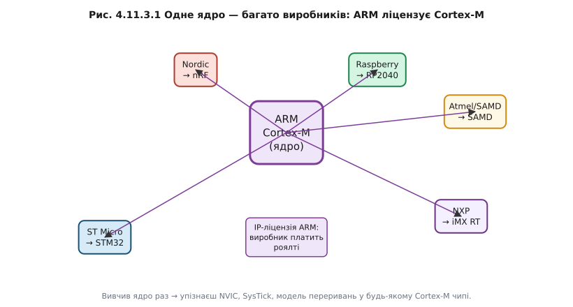
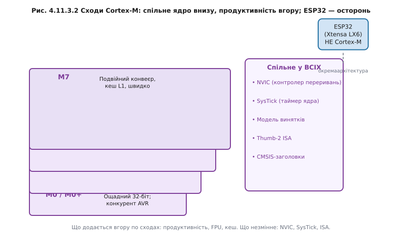

# ARM Cortex-M

У світі 8-бітників кожен виробник мав власне ядро: AVR, 8051, PIC. Вивчив одне — знаєш одне. ARM перевернув цю модель. Компанія ARM Holdings не виробляє жодного мікроконтролера — вона продає інтелектуальну власність: специфікацію і верифіковані IP-блоки ядра Cortex-M (32-bit MCU core family). ST Microelectronics купує ліцензію і додає до ядра свою периферію — отримуємо STM32. Nordic Semiconductor купує ту саму ліцензію і додає BLE-радіо — отримуємо nRF52. Raspberry Pi Foundation — додає PIO — отримуємо RP2040. Результат: одне ядро живе в тисячах чіпів від десятків виробників.

Інженерний наслідок цієї моделі: вивчив ядро раз — упізнаєш його в будь-якому Cortex-M чіпі. NVIC (Nested Vectored Interrupt Controller) — однаковий. SysTick — однаковий. Модель винятків (порядок входу/виходу, пріоритети) — однакова. Набір регістрів ядра (r0–r15, xPSR) — однаковий. CMSIS-заголовки від ARM дають стандартні макроси для роботи з ядром — і вони однаково компілюються для STM32, nRF і RP2040. Саме в цьому — головна цінність ARM: переносний навик замість прив'язки до одного SDK.

Ієрархія Cortex-M не є маркетинговою шкалою «дешево–дорого». Це реальна технічна прогресія:

- **M0 / M0+** — мінімальне ядро, менше 12 тисяч вентилів, виграє у AVR-класу за тим, що дає 32-бітну арифметику майже за ту саму ціну й споживання. Конкурент 8-бітника, але 32-бітний.
- **M3** — робоча конячка з апаратним дільником і підтримкою складніших режимів адресації. Саме на M3 побудовано перші масові STM32.
- **M4** — додає DSP-інструкції (SIMD, MAC за один такт) і опціональний апаратний FPU. Float тепер обчислюється апаратно — на противагу [8-бітному AVR-класу](book:programming/avr), де float — це програмний емулятор і десятки тактів.
- **M7** — подвійний конвеєр із результатом за один такт у більшості інструкцій, кеш L1 інструкцій і даних, TCM (Tightly Coupled Memory) для детермінованого доступу до критичних ділянок. Продуктивність порівнянна з процесорами загального призначення попереднього покоління.

Що **однакове** у всіх M0–M7: NVIC, SysTick, модель виходу зі стеку при винятках, Thumb-2 ISA (підмножина). Що **додається** з кожним рівнем: продуктивність, FPU, DSP-розширення, кеш. Це важливо розуміти при читанні чужого коду: якщо в прикладі на STM32 викликається `NVIC_EnableIRQ()` — ця функція CMSIS буде працювати на будь-якому Cortex-M, бо NVIC стандартизований.

**Worked-приклад «Та сама ідея, інший регістр»**

```c
// ── Cortex-M (будь-який) ─────────────────────────────────────────────────
// Дозволити переривання від таймера (NVIC — §4.5 у STM32-реалізації):
NVIC_EnableIRQ(TIM2_IRQn);       // CMSIS: стандарт для ВСІХ Cortex-M
NVIC_SetPriority(TIM2_IRQn, 3); // той самий NVIC API

// ── ESP32 (ESP-IDF) ──────────────────────────────────────────────────────
// Та сама ідея — дозволити переривання від апаратного таймера (§4.5):
esp_intr_alloc(ETS_TIM1_INTR_SOURCE,
               ESP_INTR_FLAG_LEVEL3,
               timer_isr, NULL, &handle);

// Логіка: «додати джерело переривань, дати пріоритет» — ідентична §4.5.2.
// Ім'я регістру/функції — різне. ESP32 не Cortex-M (Xtensa/RISC-V, §4.1.7).
```

Окремий випадок — Xtensa і RISC-V: [ESP32 і його родина](book:programming/esp32-family) (LX6/LX7, а в ESP32-C3/C6 — RISC-V) не є Cortex-M. Вони не ліцензують ядро ARM — у них власна архітектура. Тому досвід роботи з ESP32 переноситься концептуально (ідея NVIC, ідея DMA, ідея таймера), але регістри ядра інші. Це і є причина, чому вивчати ядро Cortex-M окремо — цінна інвестиція.

> 🔧 **Навіщо це**
>
> Знання Cortex-M — це переносний навик. STM32, nRF, RP2040, NXP iMX RT — усі вони на Cortex-M. Вивчив NVIC раз — читаєш datasheet будь-якого з них без «де тут дозволити переривання?».



*Рис. Одне ядро — багато виробників: ARM ліцензує Cortex-M, кожен обростає його власною периферією.*



*Рис. Сходи Cortex-M: спільне ядро внизу, продуктивність і FPU/кеш додаються вгору; ESP32 стоїть осторонь.*

Абстрактне ядро Cortex-M стає відчутним, коли обростає периферією. Найбагатший і найпоширеніший приклад «дорослого» Cortex-M у вбудованих системах — STM32.

---
