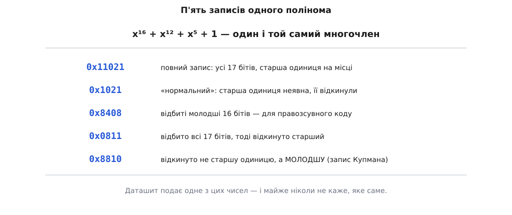
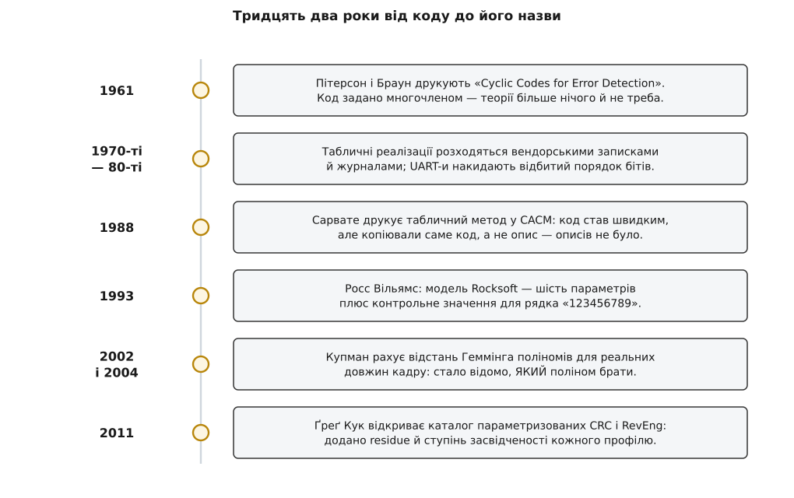

# 📜 Шість чисел проти вавилонського стовпотворіння: звідки взялася модель Rocksoft

19 серпня 1993 року австралієць Росс Ніл Вільямс (Ross N. Williams) дописав звичайний текстовий файл під назвою «A Painless Guide to CRC Error Detection Algorithms» — і закрив проблему, з якою інженери жили тридцять два роки: як записати конкретний CRC так, щоб дві незалежно написані програми гарантовано зійшлися до останнього біта. Далі — звідки взялися несумісні діалекти одного алгоритму, чому їх не розвела ні теорія кодів, ні жоден стандарт, і чому ліком виявилася не математика, а номенклатура.

### «CRC-16» — три слова, з десяток різних функцій

Уявіть 1992 рік і два прилади на одній шині, зроблені двома різними людьми. В обох даташитах чорним по білому: «CRC-16, поліном 0x1021». Обидва інженери взяли той самий многочлен. Числа не сходяться.

Так виходило не тому, що хтось схибив. Ось профілі, які всі до одного стоять на 0x1021 і всі до одного законні:

```
поліном 0x1021 — шість живих профілів, шість різних відповідей
                    старт   відбиття  фін. XOR   CRC("123456789")
CRC-16/XMODEM       0x0000  ні        0x0000     0x31C3
CRC-16/KERMIT       0x0000  так       0x0000     0x2189
CRC-16/IBM-3740     0xFFFF  ні        0x0000     0x29B1
CRC-16/GENIBUS      0xFFFF  ні        0xFFFF     0xD64E
CRC-16/MCRF4XX      0xFFFF  так       0x0000     0x6F91
CRC-16/IBM-SDLC     0xFFFF  так       0xFFFF     0x906E

поліном 0x8005 — та сама історія ще раз
CRC-16/ARC          0x0000  так       0x0000     0xBB3D
CRC-16/MODBUS       0xFFFF  так       0x0000     0x4B37
CRC-16/UMTS         0x0000  ні        0x0000     0xFEE8
CRC-16/MAXIM-DOW    0x0000  так       0xFFFF     0x44C2
CRC-16/USB          0xFFFF  так       0xFFFF     0xB4C8
```

Одинадцять різних функцій, два многочлени — і одне слово в побуті. Причому більшість цих імен з'явилася **вже після** Вільямса й завдяки йому: до 1993-го розрізняти їх було просто нічим.

### Чому теорія назвала лише многочлен

Спокуса сказати «стандарти були неохайні» велика, але вона хибна. Мовчання про решту параметрів має точну причину, і причина ця — у самому питанні, яке ставила теорія.

CRC як ідея народився 1961 року: Вільям Веслі Пітерсон (W. Wesley Peterson) і Деніел Т. Браун (Daniel T. Brown) надрукували в *Proceedings of the IRE* статтю «Cyclic Codes for Error Detection». Їхнє питання звучало так: маємо циклічний код, породжений многочленом G, — що він гарантовано ловить? Відповідь виявилася повністю визначеною самим G: усі одиничні перекидання, всі пакети помилок до певної довжини, така-то [відстань Геммінга](topic:communications/hamming-distance) для такого-то розміру блоку.

А тепер найважливіше. Стартове значення регістра, порядок бітів усередині байта й фінальний XOR **не змінюють жодної з цих гарантій**. Вони зсувають усю множину дозволених кодових слів як ціле; відстані між словами лишаються ті самі. Тож для теорії назвати многочлен означало сказати про код **усе**. Це не недбалість — це повнота відповіді на її власне питання.

Тільки програміст питає інше. Він питає не «наскільки добрий цей код», а «яке саме число має вийти з оцих байтів». Йому потрібна функція з рядка байтів у число — а функція многочленом не визначається. Специфікація, повна для теорії, виявилася діркою для інженера, і саме в цій дірці — між **кодом** і **функцією над байтами** — розплодилися діалекти. Стандарти успадкували це мовчання чесно: стандарт зв'язку називає многочлен, даташит мікросхеми друкує многочлен і шматок коду, кожен жанр каже те, що йому належить казати.

Далеко ходити не треба: те, що звично називають CRC-CCITT за рекомендацією ITU-T V.41, у світі побутує у двох прочитаннях — молодшим бітом уперед (сьогодні це CRC-16/KERMIT) і старшим бітом уперед (CRC-16/XMODEM). Один документ, два несумісні звичаї.

### Дріт, який диктував порядок бітів

Друге джерело розбіжностей прийшло не з паперу, а з заліза.

UART висуває в лінію кожен байт молодшим бітом уперед — так влаштований [асинхронний послідовний обмін](topic:communications/async-serial). Отже, бітовий апаратний лічильник CRC природно бачить байт із **дзеркальним** порядком бітів проти того, як ми пишемо число на папері ([біти й порядок байтів](topic:programming/bits-bytes-endianness)). Поки все лишалося в залізі, це нікого не боліло. Заболіло, коли ці CRC довелося рахувати ще й у програмі, щоб вона зійшлася з апаратурою.

Здоровий глузд підказує: відбивай кожен вхідний байт і рахуй далі як завжди. Вільямс описує, що зробили натомість: замість перевернути байт, перевернули **світ** — і таблицю, і регістр, і стартове значення. Він же чесно додає, що суворим тут бути не варто: апаратура й на виході віддавала відбите значення, тож дзеркалити все навколо було, ймовірно, доброю інженерією — хай і заплутаною.

Заплутаною надовго. Наслідок, за його ж підрахунком, такий: приблизно половина реалізацій, що валялися по світових FTP-серверах, відбиті, а половина — ні. І тут спрацював механізм, який добив справу: світом мандрував **код, а не опис**. Ви качали `crc32.c`, він працював, ви вкладали його у свій виріб. А відбитий правозсувний табличний цикл із байтами, що заходять «не з того кінця», не схожий на ділення в стовпчик узагалі ніяк — Вільямс зауважує, що випадковий читач такого коду не має шансів упізнати в ньому ділення за модулем 2 (він каже це австралійською ідіомою про цілковиту безнадію). Не впізнав механізму — не витягнув із коду й параметрів. Копіювання поширювало алгоритм і водночас робило його невимовним.

### Один многочлен — п'ять різних чисел

Третє джерело — суто письмове, і воно найпідступніше, бо вся розбіжність тут у тому, як записати одне й те саме.

Многочлен CRC-CCITT — це x¹⁶ + x¹² + x⁵ + 1, сімнадцять бітів. Старший біт завжди одиниця, тож його не пишуть — виходить звичне 0x1021. Правозсувна (відбита) реалізація потребує дзеркала молодших шістнадцяти бітів — виходить 0x8408. А якщо відбити **весь** сімнадцятибітовий многочлен і аж тоді відкинути старший — виходить 0x0811, і це вже інша операція з іншим результатом. Вільямс окремо застерігає: обернути поліном — не те саме, що відбити його молодші 16 бітів, бо повний многочлен містить неявну старшу одиницю. Пізніше Філіп Купман (Philip Koopman) популяризував іще один запис, у якому відкидають не старшу одиницю, а молодшу.

```
многочлен    x¹⁶ + x¹² + x⁵ + 1
повний       1 0001 0000 0010 0001  = 0x11021   усі 17 бітів
нормальний     0001 0000 0010 0001  = 0x1021    відкинуто старший
відбитий       1000 0100 0000 1000  = 0x8408    дзеркало молодших 16
обернений      0000 1000 0001 0001  = 0x0811    дзеркало всіх 17, тоді −старший
Купманів       1000 1000 0001 0000  = 0x8810    відкинуто МОЛОДШИЙ
```


*П'ять чисел, один код. Різняться вони лише тим, який кінець запису відкинуто й чи дзеркалили біти перед відкиданням. Даташит подає одне з цих чисел — і майже ніколи не каже, яке саме, бо для його автора інших не існує.*

Складіть три джерела докупи: теорія називала многочлен і мала рацію, залізо накидало відбиття, а сам многочлен мав п'ять правописів. Тепер зрозуміло, чому дві сумлінні людини з одним і тим самим даташитом розходилися в результаті.

### Хто такий Росс Вільямс і чому саме він

Вузол розв'язав не комітет і не інститут стандартів.

Вільямс захистив 1991 року в Аделаїдському університеті докторат зі стиснення даних (дисертацію видали книжкою «Adaptive Data Compression»), заснував новинні групи Usenet `comp.compression` і `comp.compression.research` і зробив родину швидких компресорів LZRW. Тобто до CRC він прийшов не з боку теорії кодування, а з боку форматів файлів — людиною, яка щодня питала саме інженерське питання: **яке число має вийти з оцих байтів**. Це видно з усього тексту: він жодного разу не намагається поліпшити код, він намагається його **назвати**.

Титульна сторінка документа промовиста сама по собі: версія 3, дата, адреса пошти в Аделаїдському університеті, FTP-каталог `pub/rocksoft` на університетському сервері, фірма Rocksoft Pty Ltd із домашньою адресою в Гейзелвуд-Парку (передмістя Аделаїди), факс «через» місцевого провайдера й телефон із приймальними годинами «з 10:00 до 22:00 за аделаїдським часом». Дозвіл — вільно копіювати дослівно; код на C у тексті прямо оголошено суспільним надбанням. Саму модель Вільямс назвав «Rocksoft™ Model CRC Algorithm» і одразу пожартував у дужках, що безкоштовна реклама його фірмі не завадить — так назва власної маленької компанії стала світовою номенклатурою CRC.

Найближче до офіційного благословення документ підійшов у рядку подяк: текст вичитали Жан-лу Ґайї (Jean-loup Gailly) і Марк Адлер (Mark Adler) — автори gzip, тобто ті самі двоє, чия CRC-32 щойно розходилася по всій планеті. Донині цей файл лежить, зокрема, на сайті zlib.

### Хід, що розв'язав вузол: функцію відділили від реалізації

Ключова думка Вільямса проста, і саме вона робить модель живучою: описувати треба **поведінку**, а не влаштування. Мета, за його власним формулюванням, — посилатися на конкретний алгоритм CRC «regardless of how confusingly they are implemented», хоч би як заплутано його було реалізовано.

Далі йде хід, який легко проґавити. Вільямс **не** взявся каталогізувати реалізації — цей шлях веде в нескінченність, бо перекручувати код можна без кінця. Він зафіксував **одну** канонічну реалізацію (пряму табличну) і виштовхав усю решту різноманіття на її краї:

- **відбиття перестало бути іншим алгоритмом** і стало перетворенням на вході й на виході — двома прапорцями, а не двома різними кодами; тепер не треба подумки перекладати параметри відбитої реалізації у невідбиту;
- **правопис полінома скасовано указом**: у моделі POLY — завжди невідбитий запис, і крапка. Для 0x8408 чи 0x0811 у ній просто немає місця, тож війна правописів закінчується за визначенням;
- **лишаються дві константи** — з чим регістр стартує і з чим його результат XOR-иться наприкінці.

Порахуйте ступені вільності, що вціліли: ширина, поліном, старт, відбиття входу, відбиття виходу, фінальний XOR. Шість. Це не класифікація алгоритмів — це система координат, у якій кожна реалізація, хоч би як покручена, є точкою. Тому модель і пережила своїх сучасників: вона описує не ті алгоритми, що існували 1993 року, а простір, у якому вони живуть.

### CHECK — поле, яке не є частиною визначення

До шести чисел Вільямс додав сьоме поле — і сам-таки написав, що воно **не** входить до визначення: якщо воно суперечить решті, решта має перевагу. Його роль інша: бути слабким валідатором реалізації. Це CRC дев'яти ASCII-байтів рядка `123456789`.

Ось у чому тут сила. Шість чисел **описують** функцію; сьоме робить опис **запускним**. Прозовий опис треба прочитати правильно — і два сумлінні читачі прочитають його по-різному, що, власне, й було хворобою. А контрольне значення або збігається, або ні; третього стану немає. Специфікація, що приходить із власним тестом, виграє в будь-якої, що приходить без нього, — і виграла.

Навіть вибір рядка тут не випадковий: дев'ять друкованих ASCII-символів. Немає кінця рядка, отже, немає питання «CR чи CRLF»; немає кодування, отже, немає питання «UTF-8 чи щось інше»; немає багатобайтових чисел, отже, немає питання про порядок байтів. Ці дев'ять байтів набирає будь-яка клавіатура світу й однаково розуміє будь-яка система.

> 🔧 **Навіщо це.** Практичний наслідок історії простий: коли в даташиті написано «CRC-16, поліном 0x1021» і більше нічого — вам **не сказали нічого**, і сперечатися з підтримкою вендора марно, бо в його жанрі це повний опис. Дійте інакше: зніміть із приладу бодай один справжній кадр разом із його CRC — і переберіть решту параметрів. Перебір крихітний: два ходові старти (`0x0000` і `0xFFFF`) × відбиття входу × відбиття виходу × два фінальні XOR — шістнадцять комбінацій на кожен поліном-кандидат. Саме цей перебір автоматизує вільний інструмент CRC RevEng, і можливий він лише тому, що простір параметрів скінченний і поіменований. До 1993-го такого перебору не існувало як думки — не було чого перебирати.

### Сторінка, яку автор не зміг заповнити

Найповчальніше в цій історії — розділ 16 самого документа. Він мав стати каталогом: ось модель, а ось у ній усі ходові алгоритми. Вільямс його не заповнив і чесно написав чому: більшість алгоритмів, з якими він стикався, задано так туманно, що витягти повний набір параметрів не вийшло. Тому в розділі стоїть жалюгідний за мірками задуму список самих лише многочленів — X25, CRC16, CRC32 — і прохання до читачів: обізвіться, хто може дотягти хоч один із них до повного набору.

Далі йдуть три блоки параметрів із застереженням, що їх «начебто передбачає одна програма, яка десь тут крутилася», і питанням, чи може хтось це підтвердити або спростувати. Контрольні значення в цих блоках порожні: автор зізнається, що не завдав собі клопоту їх обчислити. І ось що з цього вийшло:

- Блок із назвою **«CRC-16/CITT»** — уже в самій назві одне «C» загубилося. Його параметри (старт 0xFFFF, без відбиття) — це **не** те, як звично читають ITU-T V.41, бо там ідеться про форму з молодшим бітом уперед. Сьогоднішній каталог параметризованих CRC називає цей профіль CRC-16/IBM-3740 і подає серед його синонімів **CRC-16/CCITT-FALSE**, зазначаючи, що алгоритм часто хибно ототожнюють із CRC-CCITT. Слово FALSE у назві, яку ви й досі вписуєте в конфіги, — шрам саме від цього ототожнення. *(Хто першим ужив саму назву «CCITT-FALSE», за первинними джерелами простежити не вдалося. Документально засвідчено інше: і формулювання Вільямса, і те, що каталог прямо називає це ототожнення помилковим.)*
- Блок із назвою **«XMODEM»** — поліном 0x8408 із відбиттям входу й виходу. Прочитаний буквально за власним правилом моделі (POLY — завжди невідбитий запис), цей набір дає для `123456789` значення 0x0C73, тобто не збігається ні зі справжнім XMODEM (0x31C3), ні з Kermit (0x2189). Прочитаний поблажливо — мовляв, автор записав тут дзеркало 0x1021 — він дає Kermit. Обидва прочитання не є XMODEM: протокол XMODEM Ворда Крістенсена (Ward Christensen, 1977, CRC-варіант додано пізніше) шле біти старшим уперед, а Kermit Колумбійського університету (1981) — молодшим, і вся різниця між їхніми CRC саме в цьому.
- А блок **«ARC»** із каталогу й приклад **«CRC-16»** із попереднього розділу — це буквально ті самі шість чисел під двома іменами (контрольне значення в обох 0xBB3D).

Мораль тут не в тому, що Вільямс був неуважний. Навпаки: він був найуважнішою людиною в кімнаті, він щойно власноруч зробив прилад, який робить такі помилки видимими, — і все одно не зміг заповнити одну сторінку, бо потрібних даних просто не було в світі. Модель змінила ось що: відтоді помилка стала **неправильним числом у поіменованому полі**, яке кожен може виправити. Доти вона була неправильним відчуттям.

### Хто доробив те, що лишилося порожнім

Показово, куди йшли зусилля до 1993 року: вони йшли в **швидкість**. 1987-го в *Communications of the ACM* друкують табличний метод із примхливою назвою «алгоритм читача чайного листя», 1988-го там-таки Діліп Сарвате (Dilip V. Sarwate) друкує кращий — той самий підхід із [таблицею замін](topic:programming/lookup-table), яким CRC рахують і донині. Алгоритм зробили дешевим; описати його все ще не було чим.


*Шлях від коду до його назви. Теорія 1961 року дала многочлен і мала рацію: для питання «наскільки надійний код» більше нічого й не треба. Наступні три десятиліття швидшали реалізації, але описувати алгоритм і далі не було чим. 1993-й додав спосіб назвати, 2000-ні — спосіб обирати поліном, 2010-ті — засвідчений каталог того, що реально вживається.*

Порожню сторінку Вільямса заповнили — і то не одразу, а через вісімнадцять років.

**Ґреґ Кук (Greg Cook)** веде «Catalogue of parametrised CRC algorithms» і пише інструмент CRC RevEng (перший випуск — 5 січня 2011 року, як розвиток його ж перлового скрипта 2007-го). Станом на оновлення від 11 грудня 2024 року каталог містить 113 профілів завширшки від 3 до 82 бітів. Два його додатки до моделі важать найбільше:

- **`residue`** — те, що лишається в регістрі після проганяння цілого неушкодженого блоку разом із його CRC. Перевірка «за сталою остачею» з розмитого звичаю стала числом, яке можна виписати в специфікацію.
- **ступінь засвідченості** кожного запису: підтверджено первинним джерелом, підтверджено практикою, з академічної праці, з третіх рук. Це і є буквальна відповідь на Вільямсове «чи може хтось це підтвердити або спростувати» — тільки вже як дисципліна, а не як прохання.

RevEng уміє ще й обернене: дайте йому кілька повідомлень з їхніми CRC — і він **знайде** профіль перебором простору параметрів. Це можливо винятково тому, що простір скінченний і поіменований: модель перетворила «вгадай алгоритм» на «перебери шість чисел».

**Філіп Купман** з Університету Карнегі — Меллона закрив інше питання, яке Вільямс лишив відкритим: не «як назвати», а «який поліном брати». Доповідь «32-Bit Cyclic Redundancy Codes for Internet Applications» на конференції DSN 2002 і праця з Трідібом Чакраварті (Tridib Chakravarty) «Cyclic Redundancy Code (CRC) Polynomial Selection for Embedded Networks» на DSN 2004 дали таблиці відстані Геммінга залежно від довжини блоку — для тридцятидвобітових кодів в інтернет-застосуваннях і для CRC завширшки від 3 до 16 бітів у вбудованих мережах. Висновок для вбудованих систем невтішний і корисний: кілька широко вживаних поліномів не є найкращим вибором для тих довжин кадру, на яких їх реально вживають.

І коло замикається в промисловості. Бібліотека CRC у стандарті AUTOSAR задає свої підпрограми повними наборами параметрів, а її основна шістнадцятибітова підпрограма — це рівно поліном 0x1021, старт 0xFFFF, без відбиття. Той самий профіль, що його каталог Кука подає під синонімами **CRC-16/AUTOSAR** і **CRC-16/CCITT-FALSE**. Запис із помилковою назвою, який 1993 року списали з програми, «що десь тут крутилася», став іменованою підпрограмою автомобільного стандарту.

### Специфікація живе на шві

Тридцять два роки ця дірка трималася не через складність — усі шість чисел були відомі кожному, хто писав хоч одну реалізацію. Вона трималася тому, що ніхто нею не володів. Опис Пітерсона й Брауна був повний для питання про надійність коду. Посібник до мікросхеми був повний для цієї мікросхеми. Файл `crc32.c` був повний для того формату, задля якого його написали. Неповнота проступає **лише на шві** між двома незалежно написаними реалізаціями — а в шва немає автора, і в жодному з двох таборів він нікому не болить, доки прилади не поставлять поруч.

Шість чисел і дев'ять байтів тестового рядка — це те, як виглядає шов, коли хтось нарешті бере його собі за роботу.
