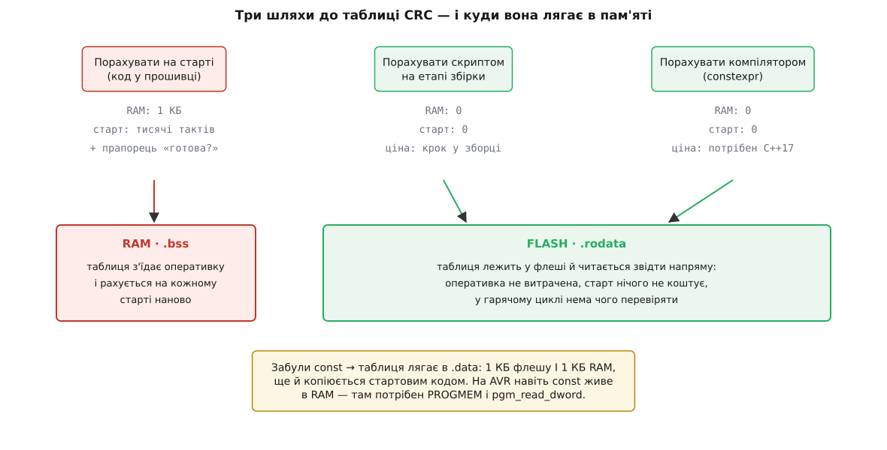
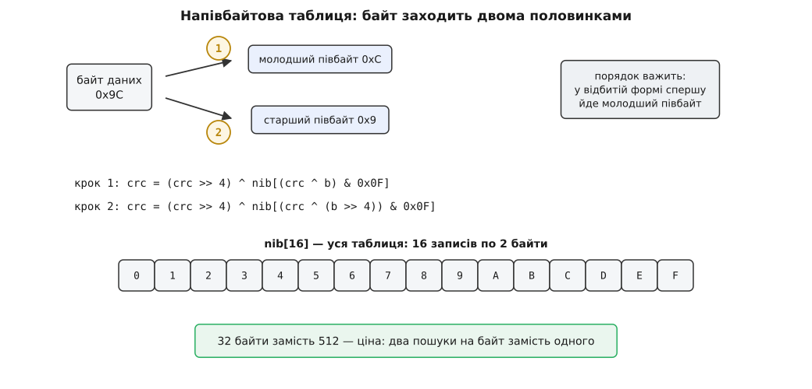

# ⚙️ CRC у прошивці: таблиця у флеші, потік і перевірка образу

Тут зібрано робочий код CRC для мікроконтролера — у тих варіантах, які справді ставлять у прошивку: таблиця, порахована ще до першого такту процесора й покладена у флеш; ядро, що приймає дані частинами; і перевірка образу, який в оперативку не влазить. Усе можна взяти й скомпілювати як є, і кожен шматок доведено контрольним значенням профілю.

### Умови задачі

Візьмімо конкретний пристрій, щоб цифри були справжні: Cortex-M0+ на 48 МГц, 32 КБ RAM, 256 КБ флешу. У прошивці два споживачі CRC, і вимоги в них протилежні.

Перший — обмін по [Modbus RTU](book:communications/modbus): ведучий шле кадр, ведений відповідає, у хвості кожного кадру два байти CRC-16, а весь кадр не довший за 256 байтів. Байти приходять з UART по одному, в перериванні, і CRC треба дорахувати рівно тоді, коли прийшов останній. Даних тут мало, зате код працює в перериванні й не має жодного зайвого байта RAM.

Другий — [завантажувач](book:programming/bootloader), який перед стрибком у застосунок мусить перевірити образ на 192 КБ. Даних багато, лежать вони у флеші, і в оперативці їх ніколи не буде цілком.

З цих двох випадків і виростають чотири вимоги: таблиця не має жити в RAM; одне ядро має обслуговувати і вісім байтів, і сто дев'яносто два кілобайти; довгий образ рахується частинами; а сумісність із профілем має бути доведена, а не обіцяна.

### Ідея: таблиця — це стала, питання лише в тому, хто її порахує

Таблиця CRC — це 256 чисел, повністю визначених поліномом. Вони не залежать ні від даних, ні від часу, ні від того, скільки разів пристрій вмикали. Отже, порахувати їх можна будь-коли, і єдине справжнє питання таке: **хто платить за ці 256 маленьких циклів і в який момент**.

Відповідей три. Може заплатити сам мікроконтролер на кожному ввімкненні — тоді таблиця народжується в RAM. Може заплатити машина, що збирає прошивку, — раз, скриптом. Може заплатити компілятор — теж раз, під час трансляції. Результат у всіх трьох випадках побайтово однаковий, тож перший варіант не купує нічого: він лише витрачає оперативку, час старту й ще змушує гарячий цикл питати «а таблиця вже готова?».

Куди лягають байти сталої, вирішує не бажання, а кваліфікатор `const` і скрипт лінкера. На Cortex-M флеш і RAM живуть в одному адресному просторі, тож `const`-масив компілятор кладе в секцію `.rodata`, лінкер відводить їй місце у флеші, і процесор читає таблицю прямо звідти — без жодного копіювання. Уся розкладка прошивки стоїть на цій різниці: [флеш і RAM](book:programming/flash-vs-ram) відрізняються не швидкістю, а тим, що одна пам'ять тримає вміст без живлення й переписується важко, а друга забуває все при вимкненні; а яка секція в яку з них потрапить, розписано у [скрипті лінкера](book:programming/linker-script).


*Три способи дістати ті самі 256 чисел і три різні наслідки для пам'яті. Рахунок на старті платить оперативкою й тактами при кожному ввімкненні; скрипт збірки та `constexpr` платять один раз на машині розробника, а в пристрій потрапляє готова таблиця у флеші. Найгірший результат дає не помилка в алгоритмі, а забутий `const`: таблиця тоді лягає в `.data`, займає і флеш, і RAM, та ще й копіюється стартовим кодом.*

### Таблицю рахує скрипт збірки — або компілятор

Обидва шляхи роблять те саме: перемелюють 256 значень тим самим бітовим циклом, який згодом уже не потрібен у прошивці. Різниця в тому, **де** цей цикл крутиться. Скрипт запускається як крок збірки й лишає по собі звичайний `.c`-файл, який можна відкрити й прочитати; `constexpr` прибирає крок збірки взагалі — таблицю рахує компілятор, а в об'єктний файл потрапляє вже готовий масив.

:::tabs
```py
#!/usr/bin/env python3
"""gen_crc_table.py — рахує таблицю CRC-32 на машині розробника й пише готовий .c
Запуск:  python3 gen_crc_table.py crc32_table.c"""
import sys

POLY = 0xEDB88320          # CRC-32/ISO-HDLC у відбитому записі
MASK = 0xFFFFFFFF

def build():
    t = []
    for i in range(256):
        c = i
        for _ in range(8):                      # ті самі вісім кроків зсув-XOR
            c = (c >> 1) ^ POLY if c & 1 else c >> 1
        t.append(c & MASK)
    return t

def crc32(data, t):
    crc = MASK
    for b in data:
        crc = (crc >> 8) ^ t[(crc ^ b) & 0xFF]
    return crc ^ MASK

tab = build()
check = crc32(b"123456789", tab)
assert check == 0xCBF43926, "профіль розійшовся: %08X" % check   # ← запобіжник збірки

with open(sys.argv[1], "w") as f:
    f.write("/* ЗГЕНЕРОВАНО gen_crc_table.py — руками не правити. */\n")
    f.write("#include <stdint.h>\n\n")
    f.write("const uint32_t crc32_table[256] = {\n")
    for i in range(0, 256, 4):
        f.write("    " + " ".join("0x%08XU," % v for v in tab[i:i + 4]) + "\n")
    f.write("};\n")
```
```cpp
// crc32_table.hpp — ту саму таблицю рахує компілятор; скрипт збірки не потрібен (C++17)
#include <array>
#include <cstdint>

inline constexpr std::uint32_t kPoly = 0xEDB88320U;   // CRC-32/ISO-HDLC, відбитий запис

constexpr std::array<std::uint32_t, 256> make_table() {
    std::array<std::uint32_t, 256> t{};
    for (std::uint32_t i = 0; i < 256; ++i) {
        std::uint32_t c = i;
        for (int k = 0; k < 8; ++k)               // ті самі вісім кроків зсув-XOR
            c = (c & 1U) ? (c >> 1) ^ kPoly : (c >> 1);
        t[i] = c;
    }
    return t;
}

inline constexpr auto kCrc32Table = make_table();  // ← лягає в .rodata, а не в RAM

constexpr std::uint32_t crc32(const char* s) {     // той самий запобіжник, але в компіляторі
    std::uint32_t crc = 0xFFFFFFFFU;
    for (; *s; ++s)
        crc = (crc >> 8) ^ kCrc32Table[(crc ^ static_cast<std::uint8_t>(*s)) & 0xFFU];
    return crc ^ 0xFFFFFFFFU;
}

static_assert(crc32("123456789") == 0xCBF43926U, "профіль CRC-32 розійшовся");
```
:::

Скрипт треба ще вписати в збірку, інакше згенерований файл рано чи пізно розійдеться з генератором. Правило коротке — файл оголошують похідним від скрипта, і тоді правка полінома сама тягне за собою перегенерацію:

```make
crc32_table.c: tools/gen_crc_table.py
	python3 $< $@

fw.elf: main.o crc.o crc32_table.o
	$(CC) $(LDFLAGS) -o $@ $^
```

Обидва варіанти закінчуються однаково: 1 КБ у `.rodata`. Але зверніть увагу на рядок з перевіркою — у скрипті це `assert`, у C++ це `static_assert`, і в обох випадках це **запобіжник збірки**. Якщо хтось поправить поліном чи переплутає його запис, збірка впаде на машині розробника. Без цього рядка та сама помилка доїхала б до пристрою й показалася б уже як «щось не сходиться з давачем». У версії з `constexpr` перевірка коштує рівно нуль тактів пристрою: увесь рахунок — і таблиці, і контрольного значення — робить компілятор, бо `constexpr` вимагає обчислити вираз під час трансляції, а не в рантаймі ([обчислення на етапі компіляції](book:programming/constexpr)).

### Куди насправді лягла таблиця — і як це перевірити

Написати `const` мало; варто переконатися, що лінкер справді відніс масив у флеш. Це видно за одну команду. У типовій розкладці для Cortex-M `.rodata` іде в область FLASH і потрапляє у стовпчик `text` звіту про розміри, а `data` й `bss` — це RAM:

```
$ arm-none-eabi-nm -S --size-sort build/fw.elf | grep crc32_table
0800a1c4 00000400 R crc32_table          ← R = read-only data, тобто .rodata → флеш
                                            D було б .data (RAM + копія у флеші)
                                            B було б .bss  (RAM, заповнена в рантаймі)
```

Три літери — три різні долі. `R` означає, що все зроблено правильно. `B` — що таблицю рахують на старті, тобто перший шлях із трьох. А `D` — найдорожча помилка: масив ініціалізований, але не `const`, тож лінкер кладе його **і** у флеш (щоб було звідки взяти початкові значення), **і** в RAM, а стартовий код ще й копіює кілобайт між ними. Одне забуте слово — і платите обома пам'ятями одразу.

І окреме застереження для тих, хто носить код на AVR: там гарвардська архітектура, програмна пам'ять і пам'ять даних мають різні адресні простори, тож `const` сам собою нічого не змінює — стала однаково опиниться в RAM. Щоб лишити таблицю у флеші, її позначають `PROGMEM` і читають через `pgm_read_dword()`; звичайне розіменування покажчика прочитає не той простір.

> 🔧 **Навіщо це.** Перевірка через `nm` займає секунду й ловить цілий клас мовчазних втрат: код працює, тести проходять, а прошивка непомітно з'їла кілобайт оперативки з тридцяти двох. На мікроконтролері RAM закінчується раніше за флеш — і закінчується вона зазвичай не однією великою структурою, а десятком таких випадково зроблених копій. Візьміть за звичку після кожної нової таблиці чи рядкової сталої питати `nm`, у якій вона секції.

### Ядро: дві форми на всі профілі

Сама по собі таблиця ще нічого не рахує — вона [таблиця замін](book:programming/lookup-table): наперед пораховані відповіді, з яких код бере готову за індексом замість того, щоб виводити її щоразу. Індекс тут — той байт даних, що зустрівся з краєм регістра. І форм цієї зустрічі рівно дві, залежно від того, відбитий профіль чи ні.

У **невідбитій** формі регістр зсувається ліворуч, і з даними зустрічається його **старший** байт. У **відбитій** — зсув праворуч, і зустрічається **молодший**. Обидві функції беруть біжуче значення регістра й повертають його ж, тому вони одразу придатні для потоку:

```c
#include <stdint.h>
#include <stddef.h>

extern const uint16_t crc16_table[256];   /* CRC-16/CCITT-FALSE, поліном 0x1021 */
extern const uint32_t crc32_table[256];   /* CRC-32/ISO-HDLC, поліном 0xEDB88320 */

/* Невідбита форма: зсув ліворуч, з даними зустрічається СТАРШИЙ байт регістра. */
uint16_t crc16_update(uint16_t crc, const uint8_t *p, size_t n) {
    while (n--) {
        uint8_t idx = (uint8_t)((crc >> 8) ^ *p++);
        crc = (uint16_t)(crc << 8) ^ crc16_table[idx];
    }
    return crc;
}

/* Відбита форма: зсув праворуч, з даними зустрічається МОЛОДШИЙ байт регістра. */
uint32_t crc32_update(uint32_t crc, const uint8_t *p, size_t n) {
    while (n--) {
        uint8_t idx = (uint8_t)(crc ^ *p++);
        crc = (crc >> 8) ^ crc32_table[idx];
    }
    return crc;
}
```

Приведення до `uint8_t` — не косметика. У відбитій формі `crc ^ *p` — це 32-бітне число, і без обрізання індекс полізе далеко за межі масиву на 256 елементів; читання за випадковою адресою дасть сміття, а на межі області — відмову шини. У невідбитій формі `crc >> 8` для 16-бітного регістра й так не перевищує 255, тож обрізання там зайве, — але хай воно буде, щоб дві функції виглядали однаково й ніхто не переніс «спрощений» рядок не туди.

Далі — дев'ять байтів, які вирішують, сумісний ваш код чи ні. Кожен стандартний профіль має контрольне значення, CRC від рядка `"123456789"`, і збіг із ним доводить сумісність до останнього біта:

```c
#include <stdbool.h>

bool crc_selftest(void) {
    static const uint8_t s[] = { '1','2','3','4','5','6','7','8','9' };
    bool ok16 = crc16_update(0xFFFFU, s, sizeof s) == 0x29B1U;
    bool ok32 = (crc32_update(0xFFFFFFFFU, s, sizeof s) ^ 0xFFFFFFFFU) == 0xCBF43926U;
    return ok16 && ok32;
}
```

Зверніть увагу на асиметрію: CRC-16/CCITT-FALSE не має фінального XOR, тож значення регістра — уже готова CRC, а CRC-32 інвертують наприкінці. Саме тому потокові функції повертають **сирий регістр**, а не результат: інвертувати можна лише один раз, після останнього байта.

### Коли й 512 байтів забагато: напівбайтова таблиця

На восьмибітному мікроконтролері з двома кілобайтами флешу під усе на світі 512 байтів таблиці — це четвертина програми. Вихід простий: індексувати не цілим байтом, а половинкою. Таблиця тоді має 16 записів замість 256, а байт заходить у регістр двома порціями.

```c
/* CRC-16/Modbus, напівбайтова таблиця: 16 записів × 2 Б = 32 байти у флеші.
   Профіль: поліном 0x8005 (відбитий — 0xA001), старт 0xFFFF, відбиття входу й виходу. */
static const uint16_t nib[16] = {
    0x0000, 0xCC01, 0xD801, 0x1400, 0xF001, 0x3C00, 0x2800, 0xE401,
    0xA001, 0x6C00, 0x7800, 0xB401, 0x5000, 0x9C01, 0x8801, 0x4400,
};

uint16_t crc16_modbus_update(uint16_t crc, const uint8_t *p, size_t n) {
    while (n--) {
        uint8_t b = *p++;
        crc = (uint16_t)(crc >> 4) ^ nib[(crc ^ b) & 0x0F];         /* спершу молодший півбайт */
        crc = (uint16_t)(crc >> 4) ^ nib[(crc ^ (b >> 4)) & 0x0F];  /* тоді старший */
    }
    return crc;
}
```

Порядок половинок не довільний: у відбитій формі дані входять молодшим бітом уперед, тож першим має зайти молодший півбайт. Переставите рядки місцями — код працюватиме, видаватиме стабільні числа й не збігатиметься ні з чим у світі. Ловиться це тими самими дев'ятьма байтами: прогнавши крізь цю функцію `"123456789"` зі старту `0xFFFF`, мусите дістати `0x4B37`.


*Байт заходить у регістр двома половинками, і кожна коштує один пошук у крихітній таблиці на 16 записів. Порядок половинок задає форма профілю: у відбитій — спершу молодший півбайт. Ціна компромісу чесна й видима: таблиця схудла в шістнадцять разів, робота на байт подвоїлася.*

### Коли треба гнати мегабайти: slice-by-4

Протилежний кінець шкали розмінів. Якщо ядро 32-бітне, флешу вдосталь, а перевіряти доводиться не кадр, а мегабайти з картки, байт за байтом стає повільно. Прийом простий: завантажити одразу ціле слово, вкинути його в регістр і розібрати чотирма таблицями — по одній на кожну байтову позицію слова. Таблиці рахує той самий генератор, лише кожна наступна виводиться з попередньої:

```py
# продовження gen_crc_table.py: slice-таблиці для завантаження словом
def slices(base, k=4):
    tabs = [base]
    for _ in range(1, k):
        prev = tabs[-1]
        tabs.append([(prev[i] >> 8) ^ base[prev[i] & 0xFF] for i in range(256)])
    return tabs                      # tabs[0] — звичайна байтова таблиця
```

```c
#include <string.h>

extern const uint32_t crc32_slice[4][256];   /* 4 КБ у флеші; crc32_slice[0] — байтова таблиця */

uint32_t crc32_update_fast(uint32_t crc, const uint8_t *p, size_t n) {
    while (n >= 4) {
        uint32_t w;
        memcpy(&w, p, 4);                    /* безпечне завантаження слова */
        crc ^= w;                            /* little-endian: молодший байт слова — перший */
        crc = crc32_slice[3][ crc        & 0xFF]
            ^ crc32_slice[2][(crc >>  8) & 0xFF]
            ^ crc32_slice[1][(crc >> 16) & 0xFF]
            ^ crc32_slice[0][(crc >> 24) & 0xFF];
        p += 4;
        n -= 4;
    }
    while (n--) {                            /* хвіст — звичайним байтовим ядром */
        uint8_t idx = (uint8_t)(crc ^ *p++);
        crc = (crc >> 8) ^ crc32_slice[0][idx];
    }
    return crc;
}
```

Два місця тут капосні, і обидва мовчазні. Перше: `crc ^= w` припускає, що байти в слові лягли **молодшим уперед**; на big-endian платформі те саме джерело дасть інше число, тож або платформа фіксована, або слово треба перевертати — це той самий [порядок байтів](book:programming/endianness), що псує життя в кожному бінарному форматі. Друге: `*(const uint32_t *)p` замість `memcpy` виглядає швидше, але падає на невирівняній адресі — і на Cortex-M0+ це не «повільніше», а відмова процесора; чому саме так, розписано у [вирівнюванні даних](book:programming/memory-alignment). Компілятор бачить `memcpy` довжиною 4 наскрізь і перетворює його на одне завантаження там, де це дозволено, тож безпечний варіант нічого не коштує.

### Потокове ядро: init, feed, final

Тепер зберімо все у форму, придатну і для восьми байтів, і для двохсот кілобайтів. Уся хитрість у тому, що між порціями переносять **сирий регістр**, а не готову CRC:

```c
typedef struct { uint32_t reg; } crc32_ctx;

static inline void crc32_init(crc32_ctx *c) {
    c->reg = 0xFFFFFFFFU;                       /* старт профілю — РАЗ на весь потік */
}
static inline void crc32_feed(crc32_ctx *c, const uint8_t *p, size_t n) {
    c->reg = crc32_update(c->reg, p, n);        /* скільки завгодно разів, порціями будь-якого розміру */
}
static inline uint32_t crc32_final(const crc32_ctx *c) {
    return c->reg ^ 0xFFFFFFFFU;                /* фінальний XOR — РАЗ, після останнього байта */
}
```

Розбити дані на порції можна як завгодно — по 1 байту, по 37, по сторінці флешу: результат той самий, що й від одного виклику на весь блок. Помилка, яку роблять майже всі, зворотна: беруть готову одноразову `crc32(buf, len)`, кличуть її на кожну сторінку й складають результати. Кожен такий виклик починає з `0xFFFFFFFF` і закінчує фінальним XOR, тож виходить не CRC образу, а мішанина.

Для кадру з UART регістр живе між перериваннями. Тут з'являється не алгоритмічна, а системна пастка: те саме поле бачать і обробник переривання, і головний цикл. Правило просте — обробник **тільки пише**, головний цикл читає результат лише після прапорця «кадр закінчився», а не паралельно з рахунком. Інакше головний цикл прочитає значення посеред того, як обробник його оновлює, — а від таких перегонів і бороняться [критичними секціями](book:programming/critical-sections). У Modbus RTU межу кадру задає тиша в лінії, тож обробників два:

```c
static volatile bool frame_done;     /* виставляє таймер, скидає головний цикл */
static uint16_t      rx_crc;         /* чіпає ТІЛЬКИ обробник UART */
static uint16_t      rx_len;

void USART1_IRQHandler(void) {                       /* прийшов байт */
    uint8_t b = (uint8_t)USART1->RDR;
    if (rx_len == 0U)
        rx_crc = 0xFFFFU;                            /* старт кадру — рівно один раз */
    ring_put(b);
    rx_crc = crc16_modbus_update(rx_crc, &b, 1);     /* ~16 інструкцій на байт */
    rx_len++;
    timer_restart(T35);                              /* кожен байт відсуває межу кадру */
}

void TIM6_IRQHandler(void) {                         /* тиша 3.5 символу — кадр скінчився */
    frame_done = true;                               /* лише тепер rx_crc можна читати ззовні */
}
```

Головний цикл забирає готове й повертає лічильник у нуль — і саме прапорець, а не блокування, робить обмін безпечним: поки `frame_done` не виставлено, до `rx_crc` не торкається ніхто, крім обробника.

### Перевірка образу в завантажувачі

Тепер найбільший споживач із двох. Образ лежить у флеші, попереду нього заголовок із довжиною й CRC, і завантажувач мусить сказати «цілий» або «битий», не тримаючи в RAM більше кількох сотень байтів.

```c
#define SLOT_BASE  0x08010000U                  /* початок слоту застосунку */
#define SLOT_SIZE  (192U * 1024U)
#define IMG_MAGIC  0x474D4946U                  /* довільна мітка «тут образ» */

typedef struct {
    uint32_t magic;
    uint32_t length;      /* байтів вантажу ПІСЛЯ заголовка */
    uint32_t crc;         /* CRC-32 того самого вантажу */
    uint32_t entry;       /* адреса точки входу */
} img_header;

bool image_is_valid(void) {
    const img_header *h = (const img_header *)SLOT_BASE;

    if (h->magic != IMG_MAGIC)                  /* стертий слот — самі 0xFF, а не образ */
        return false;
    if (h->length == 0U || h->length > SLOT_SIZE - sizeof(img_header))
        return false;                           /* довжині з заголовка ЩЕ не вірять */

    crc32_ctx c;
    crc32_init(&c);
    const uint8_t *p = (const uint8_t *)(SLOT_BASE + sizeof(img_header));
    uint32_t left = h->length;
    while (left) {
        uint32_t chunk = left > 1024U ? 1024U : left;
        crc32_feed(&c, p, chunk);               /* внутрішній флеш адресується напряму */
        p    += chunk;
        left -= chunk;
        watchdog_kick();                        /* 192 КБ довші за вікно сторожа */
    }
    return crc32_final(&c) == h->crc;
}
```

Чотири рішення в цьому коді варті пояснення, бо кожне закриває реальну аварію.

**Поле CRC лежить поза ділянкою, яку воно захищає.** Заголовок іде першим, вантаж — після нього, і рахуємо лише вантаж. Так знімається спокуса рахувати CRC по області, у якій уже лежить сама CRC: тоді результат залежав би від попереднього результату, і зійтися це може хіба випадково. Якщо заголовок теж треба захистити, поле `crc` перед рахунком обнуляють у копії заголовка й ганяють через регістр уже її.

**Довжині не вірять, доки CRC не зійшлася.** Це найтонше місце. `h->length` прочитано з тієї самої пам'яті, цілість якої ми ще не довели: якщо завантаження обірвалося, там може лежати `0xFFFFFFFF`. Прогодувати таку довжину циклу означає піти читати за межі слоту — у найкращому разі жорсткий збій, у гіршому — тихе зависання ще до першої перевірки. Тому спершу межі, тоді рахунок.

**Сторожа годують усередині циклу.** Сто дев'яносто два кілобайти на 48 МГц — це десятки мілісекунд суцільного рахунку, і [сторожовий таймер](book:programming/watchdog) цілком може прокинутися посеред них та перезавантажити пристрій. Виходить нескінченне коло: пристрій вічно стартує й вічно не встигає перевірити образ.

**Порцію задає оперативка, а не зручність.** У цьому коді копіювати взагалі нічого не треба: внутрішній флеш Cortex-M адресується напряму, тож `p` — це справжня адреса у флеші, і `crc32_feed` читає прямо звідти. Для зовнішньої SPI-флеші той самий цикл стає таким:

```c
    uint8_t  buf[256];                          /* єдина плата оперативкою на весь образ */
    uint32_t off = SLOT_BASE + sizeof(img_header);   /* зміщення у зовнішній флеші */
    while (left) {
        uint32_t chunk = left > sizeof buf ? (uint32_t)sizeof buf : left;
        spi_flash_read(off, buf, chunk);
        crc32_feed(&c, buf, chunk);
        off  += chunk;
        left -= chunk;
        watchdog_kick();
    }
```

І ще одна пастка, властива щойно записаному флешу: якщо перевіряєте образ одразу після запису, потрібні байти можуть ще лежати в кеші або буфері передвибірки, і процесор прочитає звідти старе. Тому кеш перед перевіркою скидають. Особливо це стосується платформ із [XIP](book:programming/xip-memory-mapped-flash), де код виконується просто із зовнішньої флеші, відображеної в адресний простір: там кожне читання йде через кеш контролера, і скидання його — окрема явна операція.

Останній варіант перевірки — без порівняння взагалі. Замість того, щоб діставати поле CRC й звіряти, крізь регістр женуть вантаж **разом** із полем CRC і дивляться, чи вийшла наперед відома стала:

```c
/* blob = вантаж РАЗОМ із чотирма байтами CRC у хвості (молодшим байтом уперед),
   n — довжина вантажу плюс ці чотири байти. Поле CRC витягати не треба взагалі. */
bool blob_is_intact(const uint8_t *blob, size_t n) {
    return crc32_update(0xFFFFFFFFU, blob, n) == 0xDEBB20E3U;
}
```

`0xDEBB20E3` — це остача CRC-32/ISO-HDLC у тому вигляді, як її подає каталог профілів: значення **сирого регістра**, до фінального XOR. Якщо ж прогнати ті самі байти через звичайну функцію, що інвертує результат наприкінці, вийде `0x2144DF1C` — те саме число з іншого боку XOR-маски. Звідси й плутанина: у книжках і форумах гуляють обидві «магічні сталі» для одного профілю, і котра ваша, залежить від того, де ви дивитеся на регістр. Для профілів без фінального XOR — скажімо, CRC-16/CCITT-FALSE — остача просто нульова.

### Скільки це коштує

Таблиця чи біти — вибір не смаковий, він рахується. Ось порядки величин для того самого Cortex-M0+; це підрахунок інструкцій ядра, а не заміри, і справжні числа ще залежать від тактів очікування флешу:

```
варіант              таблиця   тактів/байт  192 КБ на 48 МГц
побітовий                0 Б           ~40           ~164 мс
напівбайтовий           32 Б           ~16            ~66 мс
байтовий        512 Б … 1 КБ            ~8            ~33 мс
slice-by-4              4 КБ            ~5            ~20 мс
```

**Умова: образ 192 КБ, ядро 48 МГц, байтова таблиця у флеші.**

```
байтів у образі:   192 · 1024 = 196608
тактів (байтова):  196608 · 8 ≈ 1.57·10⁶
час:               1.57·10⁶ / 48·10⁶ ≈ 0.033 с = 33 мс

те саме побітово:  196608 · 40 ≈ 7.9·10⁶ тактів → 164 мс
```

Півкілобайта флешу купує 130 мілісекунд на кожному ввімкненні — і на пристрої, який має ожити «одразу», це різниця між непомітною паузою й помітною.

А тепер той самий рахунок для кадру Modbus — і висновок перевертається. Дванадцять байтів побітовим циклом — це близько 480 тактів, себто десять мікросекунд, тоді як один байт на швидкості 9600 бод летить лінією понад мілісекунду. На кадрі таблиця не купує **нічого**: процесор однаково стоїть і чекає на дріт. Там беруть напівбайтовий варіант — і флеш зекономлено, і запас за часом лишається стократний.

> 🔧 **Навіщо це.** Правило виходить одне, і воно протилежне звичному «візьму найшвидше»: варіант обирають за **обсягом даних**, а не за красою. Дрібні кадри, що приходять зі швидкістю дроту, не вимагають нічого, крім найменшої таблиці; довгі образи, які людина чекає під час старту, — вимагають найбільшої, яку не шкода. Одна прошивка спокійно тримає обидва ядра: 32 байти під кадри й кілобайт під образ разом займуть менше, ніж один необережно забутий `const`.

### Пастки, що не видно з коду

Наостанок — те, об що спотикаються найчастіше, зібране за місцем, де воно кусає.

**У ядрі.** Покажчик на дані має бути `const uint8_t *`, а не `const char *`: на ARM `char` за замовчуванням беззнаковий, а на x86 — знаковий, тож код, який справно рахує на мікроконтролері, на настільній машині — там, де його зазвичай і перевіряють тестами, — дасть від'ємний індекс на кожному байті понад `0x7F`. Індекс завжди обрізають до восьми бітів. І якщо тримаєте 16-бітну CRC у 32-бітній змінній заради швидкості — маскуйте регістр `& 0xFFFF` після кожного кроку, інакше сміття зі старших бітів поїде в наступний індекс.

**На дроті.** Правильно порахована CRC ще нічого не гарантує, якщо її не так поклали в кадр. Modbus RTU дописує CRC **молодшим байтом уперед**, і це прямо суперечить решті полів того самого протоколу, які йдуть старшим байтом уперед; так і записано в офіційному «Modbus over serial line specification and implementation guide» (v1.02, с. 14). Кадри з профілями CCITT, навпаки, зазвичай несуть CRC старшим байтом уперед. Симптом в обох випадках однаковий і оманливий: усе сходиться у власних тестах і нічого не сходиться з чужим пристроєм, а винен не поліном, а два переставлені байти.

**У потоці.** Стартове значення ставлять один раз, фінальний XOR — теж один раз; усе між ними працює із сирим регістром. І контекст не має бути спільною змінною, яку одночасно чіпають переривання й головний цикл.

**У завантажувачі.** Довжина з заголовка небезпечна, доки CRC не зійшлася. Стерта область флешу читається як суцільні `0xFF`, тож перевірка мітки має йти перед усім іншим. Сторожа треба годувати. А кеш — скидати, якщо флеш щойно писали.

І поверх усього — один рядок самоперевірки на дев'яти байтах `"123456789"`. Він не ловить логіку вашого протоколу, зате ловить геть усе, що стосується самої CRC: переплутаний запис полінома, пропущене відбиття, забутий фінальний XOR, не той старт. Тримайте його як тест збірки — і жодна з цих пасток не доїде до пристрою мовчки.
