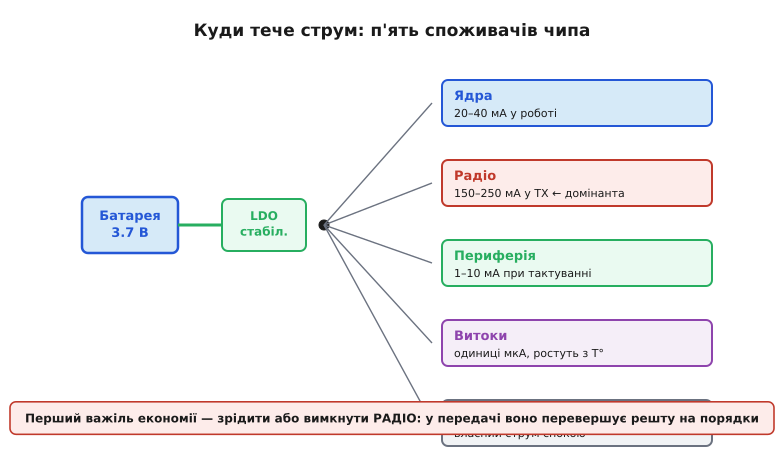
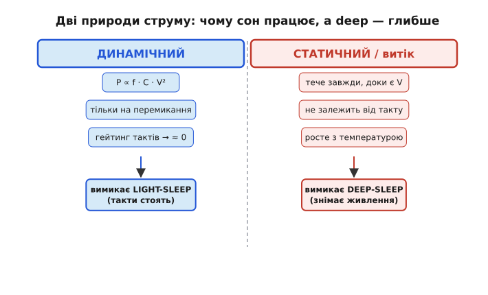
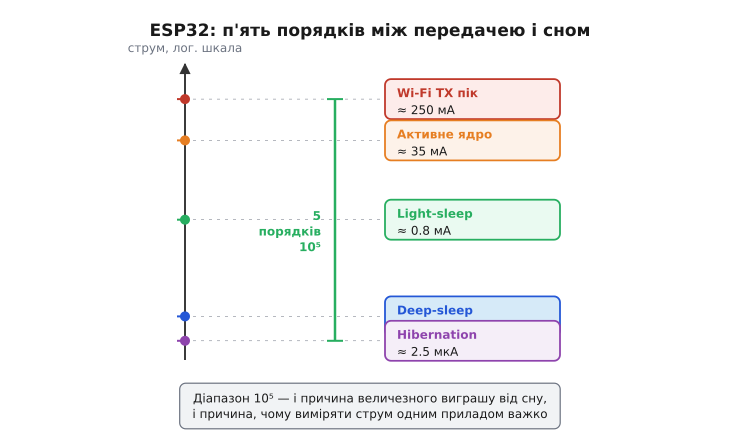

# Куди тече струм

Доки не бачиш, куди тече струм, — не зменшиш його. Можна скільки завгодно перемикати режими, та якщо не знаєш, який саме блок чипа з'їдає заряд, оптимізація перетворюється на гру наосліп: борешся з ядром, коли винне радіо. Тому перший крок будь-якої економії енергії — розкласти повний струм чипа на складові й побачити, де він справді тече. [Бюджет батареї](topic:programming/battery-budget) дає одне число — середній струм; ця стаття показує, з чого воно складене.

У чипі на кшталт ESP32 струм споживають п'ять головних груп. Розгляньмо кожну — з механізмом, а не просто з числом.

**Ядро або ядра** — обчислювальне серце чипа. На ESP32 їх два, Xtensa LX6, кожне до 240 МГц. Їхній струм динамічний: він пропорційний тактовій частоті, ємності транзисторних перемикачів і квадрату напруги живлення. Звідси прямий [зв'язок такту й живлення](topic:programming/clock-power): менший такт → менший динамічний струм. Чип, що «думає» на 80 МГц замість 240, споживає ядром приблизно втричі менше. Та навіть на мінімальній частоті активне ядро — це одиниці-десятки міліампер.

**Радіо (Wi-Fi / BLE)** — найбільший пожирач у момент передачі. Підсилювач потужності (PA, від power amplifier — «підсилювач потужності») мусить гнати радіочастотний сигнал в антену з потужністю, достатньою для доставки пакета крізь ефір. У Wi-Fi-передачі ESP32 тягне 150–250 мА залежно від модуляції і відстані — це два-три порядки більше, ніж сплячий чип. Навіть фонова підтримка з'єднання, без активного обміну, коштує десятки міліампер: радіо періодично прокидається слухати ефір.

**Периферія** — таймери, АЦП, контролери I²C, SPI, UART і подібні модулі. Кожному, хто отримує тактовий сигнал, він коштує струму: модуль перемикає внутрішні регістри, перевіряє стани, здіймає переривання. Вимкнути тактування окремого модуля (clock gating, «відсікання такту») — спосіб знизити споживання без повного сну: непотрібний блок просто перестає тактуватися й замовкає.

**Витоки (leakage, від англ. *to leak* — «протікати»)** — статичний струм крізь запірні переходи транзисторів. Він невеликий за кімнатної температури — одиниці мікроампер — але помітно зростає при нагріванні: у теплих промислових умовах витік може бути вдесятеро більшим. Витоки течуть завжди, навіть коли блок «нічого не робить», і прибрати їх можна лише фізично знявши живлення з домену.

**Стабілізатор живлення (LDO)** — у реальній схемі між батареєю і чипом стоїть [лінійний стабілізатор](topic:electronics/ldo), що тримає стабільну напругу. Він сам тягне власний струм спокою (quiescent current, Iq; від латин. *quiescere* — «спочивати») навіть за нульового навантаження. На сплячому пристрої цей струм легко стає головним, і його розкриває окрема стаття про [споживання всієї плати](root:embedded/board-consumption).



*Карта п'яти споживачів струму: стрілки від батареї через стабілізатор до кожного домену з типовими частками. Радіо виділено як домінанту при передачі — саме там лежить найбільший важіль економії.*

> 🔧 **Навіщо це.** Перш ніж «оптимізувати», виміряй розклад — інакше борешся з ядром (одиниці відсотків заряду), коли винне радіо (дев'яносто з гаком). Профіль струму в часі — це карта, що каже, де копати; без неї зусилля йдуть туди, де виграш мізерний.

## Дві природи струму

За п'ятьма споживачами ховається принциповий поділ, який і пояснює, чому сон узагалі працює. Увесь струм чипа має одну з двох природ — динамічну або статичну, — і кожна вимикається по-своєму.

**Динамічний струм** виникає від перемикання транзисторів. Щоразу, коли транзистор переходить між станами, він перезаряджає паразитні ємності затворів і провідників. Потужність на це перемикання описується формулою:

```
P = C · V² · f
   C — сумарна ємність, що перезаряджається
   V — напруга живлення
   f — частота перемикань (такт)
```

Потужність пропорційна частоті та **квадрату** напруги — тому зниження напруги дає виграш сильніший за зниження такту. А якщо тактовий сигнал зупинити зовсім (clock gating), транзистори перестають перемикатися, і динамічний струм падає майже до нуля. Саме це робить light-sleep: спиняє такти більшості блоків — і динамічна складова зникає, хоча живлення з чипа не знято.

**Статичний струм (витоки)** тече незалежно від такту: це просочування крізь запірні переходи транзисторів, доки на них є ненульова напруга. Зупинка такту його не чіпає. Прибрати статичний струм можна лише фізично знявши живлення з домену — і саме це робить deep-sleep, знеструмлюючи більшість чипа й лишаючи живим тільки RTC-домен. Звідси випливає ієрархія глибини сну: light-sleep б'є по динамічному струмі, deep-sleep — і по статичному.



*Дві природи струму поруч: динамічний вимикається відсіканням такту — це light-sleep; статичний потребує зняти живлення з домену — це deep-sleep. Звідси й ієрархія режимів сну.*

## П'ять порядків розмаху

Порядки величин на ESP32 — найважливіше число, яке варто запам'ятати. Від Wi-Fi-передачі (~250 мА) до режиму hibernation (~2.5 мкА) лежить **п'ять порядків** — динамічний діапазон 10⁵.



*Логарифмічна шкала струму ESP32: кожна позначка — стан від передачі до глибокого сну. Розмах у 10⁵ разів — і причина, чому сон дає такий виграш, і причина, чому виміряти струм одним приладом важко.*

Цей розмах важливий в обидва боки. З одного — сон дає колосальний виграш: різниця між активним радіо і сплячим чипом не у відсотках, а в десятках тисяч разів. З іншого — [виміряти такий розкид](root:embedded/measure-consumption) одним приладом надзвичайно важко: те, що добре показує міліампери передачі, на мікроамперах сну тоне в шумі, і навпаки. Звідси й окремі прийоми вимірювання, що перемикають діапазон на льоту.

З карти споживання одразу видно стратегію економії. Більшість споживачів — динамічні: зупинити їм такти або зняти живлення з домену, і струм падає на порядки. Саме на цьому стоять [режими сну](topic:programming/sleep-modes) ESP32 — вони системно гасять то динамічну, то й статичну складову.

## Струм, що тече повз чип

Карта п'яти доменів описує сам кристал. Але в реальній схемі струм тече ще й назовні, і два шляхи тут особливо підступні, бо їх легко не помітити.

Перший — давачі та інша обв'язка на шині. Поки на їхньому живленні є напруга, вони споживають згідно зі своїм режимом, і сон мікроконтролера цього не змінює: [забутий у безперервному режимі давач](topic:programming/current-paths/comp-sensor-standby.md) додає до бюджету постійний доданок, що легко перевершує мікроамперний сон самого чипа. Тому давачі треба явно присипляти перед сном, а не покладатися на те, що «все одно все спить».

Другий шлях тонший — **паразитне живлення крізь ніжки**. На кожному виводі мікроконтролера стоять захисні діоди (ESD-діоди), що відводять перенапругу на шину живлення або на землю. Якщо мікроконтролер заснув і зняв напругу зі свого живлення, а на шині I²C ще висить активний давач або підтяжка до іншого, живого рядка, — струм потече крізь ці захисні діоди *всередину* чипа і почне його паразитно живити. Чип опиняється в напівживому стані: формально «вимкнений», а насправді отримує живлення обхідним шляхом і тягне струм, якого немає в жодному даташиті режимів сну.

Сюди ж додається витік крізь підтяжку (pull-up). Лінія I²C тримається у високому стані резистором-підтяжкою до живлення; коли пристрій притискає лінію в низький стан, крізь цей резистор постійно тече струм. Підтяжка 10 кОм до 3.3 В дає близько 330 мкА на кожній притиснутій лінії — на сплячому пристрої це помітний доданок, часто більший за сам сон чипа.

```
I_підтяжки = V / R = 3.3 В / 10 кОм = 0.33 мА = 330 мкА
```

> 🔧 **Навіщо це.** Перед глибоким сном виводи, з'єднані з пристроями на іншому живленні, треба перевести в стан LOW або у високий імпеданс (відключити підтяжки, де можна), інакше чип живиться крізь захисні діоди й тягне «невидимий» струм. Класична причина, коли пристрій за розрахунком мав жити місяці, а сідає за тижні, — саме цей паразитний шлях, а не похибка в арифметиці бюджету.

## Worked-приклад. Розклад струму за один цикл вимірювання

**Умова.** Рідкісний сенсор прокидається раз на десять хвилин (T = 600 с): завантажується, міряє АЦП, передає по Wi-Fi і знову засинає в deep-sleep. Скільки заряду з'їдає кожна фаза і де лежить головний важіль?

```cpp
// Фази одного циклу (T = 10 хв = 600 с):
//   boot + ініт:     40 мА,  100 мс  → 40  × 0.1 /3600 = 1.11 мкА·год
//   вимір АЦП:       20 мА,   50 мс  → 20  × 0.05/3600 = 0.28 мкА·год
//   Wi-Fi передача: 180 мА, 1500 мс  → 180 × 1.5 /3600 = 75.0 мкА·год
//   deep-sleep:    0.008 мА, ~598 с  → 0.008 × 598/3600 = 1.33 мкА·год

// Разом за цикл: 1.11 + 0.28 + 75.0 + 1.33 = 77.7 мкА·год
// Частка радіо:  75.0 / 77.7 ≈ 96.5 %

// I_сер = 77.7 мкА·год / (600 с / 3600) год = 77.7 / 0.1667 ≈ 466 мкА
```

Радіо з'їдає 96.5 % заряду активної частини. Оптимізувати треба передусім **передачу**: рідше, коротше, з меншою потужністю — а не ядро чи глибину сну, що разом дають 3.5 %. Числа самі ведуть інженера до правильного важеля: спершу побач, де тече струм, тоді й копай саме там.

Той самий рахунок працює на будь-якому масштабі — від мікроконтролера до апарата за межами Сонячної системи. Як [«Вояджери» п'ятдесят років ведуть свій бюджет ват](topic:programming/current-paths/hist-voyager.md), знаючи кожного споживача поіменно, так і розробник вбудованої системи спершу складає повну карту струму, а вже потім ріже зайве. Те, як [скважність і режими сну](root:embedded/duty-cycle-current) зменшують середній струм, — окрема тема, але стоїть вона на цій-таки карті.
