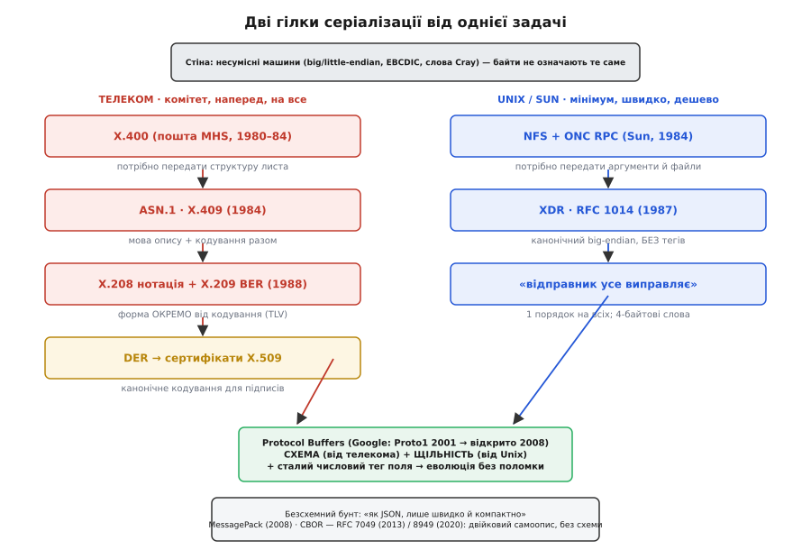

# 📜 Дві цивілізації серіалізації: як телеком і Unix розв'язали одну задачу з різних боків

Задача, яку розв'язує будь-який серіалізатор, звучить просто до банальності: **зроби так, щоб байти означали те саме на двох різних машинах**. Але наприкінці 1970-х це «просто» вперлося в стіну, якої сьогодні майже не видно. Машини були **несумісні аж до кісток**. IBM-мейнфрейм рахував у порядку байтів big-endian і в кодуванні EBCDIC замість ASCII; VAX від DEC був little-endian; PDP-11 мав власний химерний порядок half-байтів; Cray взагалі оперував 60- і 64-бітними словами й не мав звичного 8-бітного байта на рівні заліза. Число «сто» на одній машині й на іншій — це буквально різні набори бітів у різних коробочках. Поки програма й дані жили на одній машині, це нікого не бентежило: усі всередині говорили однією говіркою. Щойно дві **різні** машини мусили обмінятися структурою — фінансовою транзакцією, листом, вмістом файлу — виявлялося, що спільної мови немає взагалі.

І тут історія роздвоюється. Дві геть різні спільноти, майже не знаючи одна про одну, узялися за ту саму стіну — і побудували два зовсім різні мости. Одна спільнота — **міжнародні телекомові комітети**, поважні, повільні, з протоколами засідань і томами стандартів; вони будували Всесвітню мережу-з-великої-літери, де все має бути описано наперед і формально. Друга — **Unix-хакери із Sun Microsystems**, які просто хотіли, щоб робочі станції в лабораторії бачили спільні диски по мережі, і хотіли цього **до п'ятниці**. Перші породили ASN.1. Другі — XDR. Обидва досі живі, обидва спорядили сучасні формати, і найцікавіше в цій історії — **чому їхні розв'язки вийшли протилежними**, хоча задача була одна.

## Телекомовий шлях: усе треба описати наперед

Почнімо з поважної гілки. На межі 1970–80-х телефонні монополії всього світу — через свій координаційний орган CCITT (фр. *Comité Consultatif International Téléphonique et Télégraphique* — «Міжнародний консультативний комітет з телефонії та телеграфії», згодом він став сектором ITU-T) — будували амбітну річ: **міжнародну електронну пошту**. Не «email» у нашому нинішньому розумінні, а формальну систему передавання повідомлень між різними країнами й різними виробниками обладнання, названу **X.400** (Message Handling Systems, MHS). Розробляли її з 1980 по 1984 рік, і задум був грандіозний: лист із Японії від апаратури NEC мав дійти до Німеччини на апаратуру Siemens і бути прочитаним **однаково**, попри те, що всередині це були геть різні машини.

Ось де вперлися в стіну. Лист — це не просто текст. Це **структура**: відправник, отримувачі, тема, час, пріоритет, вкладення, і все це з полів різних типів — рядки, числа, дати, прапорці, вкладені підструктури. Як передати **структуру** з полями між японським NEC і німецьким Siemens так, щоб обидва розуміли, де закінчується одне поле й починається інше, ціле це число чи рядок, є пріоритет чи його пропущено?

Тут народилася ключова ідея, яка й зробила ASN.1 тим, чим вона є. Розробники розділили **дві речі, які доти зливалися в одне**: *як структура виглядає* (які в неї є поля, якого типу, які обов'язкові) і *як вона перетворюється на конкретні байти на конкретному дроті*. Перше вони назвали **абстрактним синтаксисом** — це опис форми, незалежний від будь-якої машини. Друге — **транспортним синтаксисом** (*transfer syntax*) — це вже правила, як з абстрактної форми зробити рівний потік октетів.

> 🔧 **Навіщо це.** Розділення «форма окремо — байти окремо» здається бюрократичною абстракцією, але це фундамент усієї схемної серіалізації, аж до сьогоднішнього Protobuf. Ти описуєш структуру **раз**, у нейтральному вигляді, а потім її можна кодувати кількома різними способами — компактно, канонічно для підпису, у зручному для налагодження вигляді — не переписуючи опис. Той самий поділ живе в кожному `.proto`-файлі: схема — це абстрактний синтаксис, а те, як `nanopb` укладає байти на дроті, — транспортний.

Мову для абстрактного синтаксису — щоб взагалі мати чим **записати** форму листа — назвали **ASN.1**: *Abstract Syntax Notation One*, «Нотація абстрактного синтаксису номер один». «Номер один» — не жарт і не скромність: це офіційна назва, наголос на тому, що це **перша** така нотація, задумана як універсальна на всі майбутні протоколи, а не лише на пошту. Уперше вона вийшла 1984 року як **рекомендація CCITT X.409** під назвою «Presentation Transfer Syntax and Notation» — тобто ще склеєна докупи: і мова опису, і правила кодування в одному документі, усередині поштового стандарту X.400. *(Статус: усталено — X.409:1984 задокументовано в архівах ITU-T і в оглядовому RFC 971 тих років.)*

Швидко з'ясувалося, що річ вийшла **ширшою за пошту**. Мова опису структур і правила їхнього кодування виявилися корисними скрізь, де взаємодіють різні системи, — а весь стек OSI (велика семирівнева модель мереж, яку CCITT та ISO будували як конкурента майбутньому TCP/IP) саме такого й потребував. Тож 1988 року ASN.1 **від'єднали** від пошти й видали окремо, розчепивши той склеєний документ надвоє:

```
X.208 (1988) — сама мова ASN.1: як ОПИСАТИ структуру (абстрактний синтаксис)
X.209 (1988) — BER: як ЗАКОДУВАТИ описану структуру в байти (транспортний синтаксис)
```

Оце розчеплення — важливе. Воно остаточно закріпило: **опис** живе окремо від **кодування**, і те саме кодування (BER) можна застосувати до будь-якої структури, описаної мовою ASN.1. *(Статус: усталено.)*

### BER, а за ним CER і DER: одна структура — багато однакових байтів, і чому це проблема

Придивімося до правил кодування — **BER** (*Basic Encoding Rules*, «базові правила кодування»), — бо в них закладено рису, що визначає весь характер ASN.1 і водночас її головну ваду.

BER кодує кожне значення трійкою **тег–довжина–значення** (*Tag–Length–Value*, звідси знамените скорочення **TLV**): спершу байт(и) тега — «що це за штука» (ціле, рядок, послідовність…), потім довжина в байтах, потім самі байти значення. Це **самоописний** формат у чистому вигляді: потік сам розповідає свою структуру, тег за тегом, і читач може розібрати його, нічого не знаючи наперед про конкретне повідомлення. Саме ця самоописність дала ASN.1 довге життя: структуру можна нарощувати, старі читачі переступають незнайомі теги. Тим самим шляхом «тег перед значенням» через десятиліття підуть двійковий JSON, CBOR і MessagePack — це та сама фамільна риса.

Але BER має рису, що стала фатальною для одного дуже важливого застосування. **Одну й ту саму структуру BER дозволяє закодувати кількома різними, однаково правильними способами.** Довжину можна записати коротко або в «розлогій» формі; булеве значення `true` — будь-яким ненульовим байтом; порядок необов'язкових полів подекуди вільний. Для звичайного передавання це байдуже — читач усе одно все розбере. А тепер уяви, що структуру треба **підписати** цифровим підписом.

Підпис рахується **з байтів**. Якщо ту саму структуру можна закодувати двома різними наборами байтів, то один і той самий сертифікат дасть **два різні підписи** — і перевірка зламається на порожньому місці: дані ті самі, а байти інші, отже й хеш інший. Криптографії потрібне **єдине, однозначне** кодування: одна структура — рівно один набір байтів, завжди.

Саме через це поверх BER надбудували два звужені набори правил, які **прибирають свободу вибору**:

```
BER — базові правила: одну структуру можна закодувати по-різному (є свобода)
CER — Canonical Encoding Rules:     звужує BER до однієї форми (для довгих даних, потокове)
DER — Distinguished Encoding Rules: звужує BER до однієї форми (для коротких, у пам'яті)
```

**DER** (*Distinguished Encoding Rules*, «розрізнювальні правила кодування») — це той самий BER, з якого викинули **всі** варіанти, лишивши по одному-єдиному дозволеному способу для кожного значення. Одна структура → рівно один набір байтів → рівно один підпис. Тому саме DER лежить в основі **X.509** — сертифікатів, на яких стоїть уся HTTPS-безпека інтернету: кожен сертифікат, який твій браузер перевіряє тисячу разів на день, закодований у DER, нащадку тих поштових правил 1984 року. *(Статус: усталено; DER як формат сертифікатів X.509 — чинна практика TLS.)*

Ще одне велике переписування ASN.1 сталося 1995 року, коли мову зробили набагато багатшою й розчепили ще дрібніше — на серію **X.680–X.683** (сама нотація) та **X.690** (правила BER/CER/DER, перше видання 1994-го). Паралельно ті самі документи вийшли під егідою ISO/IEC як **8824-x** (нотація) та **8825-x** (кодування) — стандарт має **два номери**, бо його спільно ведуть дві організації. *(Статус: усталено; подвійна нумерація ITU-T/ISO — звична практика для стандартів OSI.)*

Головне, що варто винести з телекомової гілки: вона будувалася **комітетом, наперед, на все майбутнє одразу**. Звідси її сила — строгий поділ форми й кодування, самоописність, канонічний DER для підписів. І звідси ж її слабкість — важкість. Повний BER-кодер великий, TLV-обгортка навколо кожного дрібного поля роздуває потік, а мова ASN.1 така багата, що написати для неї коректний повний парсер — окрема інженерна епопея. На дешевому мікроконтролері повний ASN.1 майже не побачиш саме тому. А тим часом на іншому кінці інженерного світу ту саму задачу розв'язували геть інакше.

## Unix-шлях: зроби мінімум, і хай усі рахують під один стандарт

Перенесімося в середину 1980-х, у Sun Microsystems — молоду тоді компанію, що продавала мережеві робочі станції на Unix. У Sun мали цілком приземлену мету: щоб робоча станція бачила диск іншої станції по мережі так, ніби це власний диск, — і щоб програма могла викликати функцію, яка насправді виконається на **іншій** машині. Це дві їхні знамениті технології: **NFS** (Network File System — мережева файлова система, вийшла 1984 року) і **ONC RPC** (Sun RPC — віддалений виклик процедур).

Обидві впираються в ту саму стіну, що й пошта CCITT: аргументи виклику й вміст файлу треба передати між машинами різної архітектури — а в лабораторії Sun стояли Sun-станції на Motorola (big-endian), VAX від DEC (little-endian), а по мережі мали дотягуватися й IBM-PC, і навіть Cray. Число, записане на одній, на іншій читалося задом наперед. Потрібен був спільний **формат на дроті**.

І тут — ключова відмінність темпераменту. Sun **не збиралися** описувати всі майбутні структури світу нейтральною мовою й будувати самоописний потік із тегами. Їм треба було швидко й дешево. Тож вони зробили рівно протилежний вибір за кожним пунктом, де телеком обрав гнучкість, — і виклали результат у **RFC 1014** (червень 1987 року) під назвою **XDR: External Data Representation Standard**, «Стандарт зовнішнього подання даних». *(Статус: усталено; RFC 1014, автор — Sun Microsystems, червень 1987.)*

Три рішення XDR — і кожне протилежне телекомовому:

**Перше: жодних тегів у потоці.** XDR — **не** самоописний. Байти на дроті — це голі значення впритул, без жодного «що це». Читач знає структуру наперед, зі згенерованого коду (Sun постачали компілятор `rpcgen`, що робив пакувальники з опису). Це різко зменшує розмір і спрощує кодер до кількох зсувів — ціною тієї самої крихкості, що й у будь-якого формату з фіксованою розкладкою: помінялася структура — стороні треба перезгенерувати код.

**Друге: один-єдиний канонічний порядок — big-endian.** Ось де XDR виявив свою філософію найяскравіше. Замість того щоб домовлятися про порядок для кожної пари машин, XDR **продиктував один**: усе на дроті — big-endian, і крапка. Цю стратегію називають **«відправник усе виправляє»** (*sender makes it right*): хто відправляє, той і зобов'язаний привести свої числа до канонічного big-endian; хто приймає — привести з нього назад до своєї рідної розкладки. Дріб — тільки IEEE-754. Базова одиниця — **4 байти**: навіть один байт при кодуванні займає всі чотири, вирівняні на межу слова, а рядки добиваються нулями до кратності чотирьом.

Ця остання деталь — вирівнювання все на 4 байти — красномовна. Sun **свідомо змарнували** місце (навіщо роздувати `bool` до чотирьох байтів?), щоб виграти в **швидкості**: 4-байтові вирівняні поля процесор тих років читав найшвидше, без вовтузні з невирівняним доступом. Телеком економив біти обгорткою TLV; Sun економив **такти процесора**, жертвуючи бітами. Різні дефіцити — різні розв'язки.

> 🔧 **Навіщо це.** «Відправник усе виправляє» проти «приймач усе виправляє» — це не історичний курйоз, а рішення, яке ти й досі приймаєш, проєктуючи протокол на мікроконтролері. Канонічний порядок (як у XDR: усі шлють у big-endian) простіший і безпечніший — обидві сторони знають єдиний формат, менше плутанини, — але завжди хтось конвертує, навіть коли обидві машини однакові. Альтернатива — «приймач усе виправляє»: відправник шле у своєму рідному порядку, ліпить попереду мітку архітектури, а приймач конвертує лише як треба; так дві однакові машини не витрачають нічого, але формат складніший. Мережевий (big-endian) порядок у твоїх фіксованих кадрах телеметрії — прямий спадок канонічного підходу XDR.

**Третє: ніякої окремої мови на все майбутнє.** XDR описує лише **скінченний набір** типів, потрібних для RPC і файлів: цілі, дроби, масиви, рядки, структури, об'єднання. Ніякої всеосяжної нотації «номер один», ніяких претензій на універсальність. Досить, щоб NFS запрацював.

Результат промовистий сам за себе: XDR **вижив і поширився** саме тому, що був малий і практичний, а NFS став стандартом де-факто для мережевих файлів на десятиліття й тягнув XDR за собою. Пізніше IETF формалізував XDR як інтернет-стандарт (RFC 1832 у 1995-му, потім RFC 4506 у 2006-му), але суть не змінилася від 1987 року. *(Статус: усталено.)*

Варто чесно сказати й про суперника XDR, щоб «канонічний» не здавався єдино можливим. Коли консорціум OSF будував свою систему віддалених викликів DCE/RPC, він обрав **протилежну** стратегію — **NDR** (Network Data Representation) із філософією **«приймач усе виправляє»** (*receiver makes it right*): відправник шле дані у **своєму** рідному порядку байтів, чіпляє попереду мітку-ярлик архітектури, а приймач читає ярлик і конвертує лише коли справді треба. Дві однакові машини не конвертують **нічого**. Ту саму ідею використовує й CDR у CORBA. Історія не оголосила тут переможця: XDR-підхід простіший і передбачуваніший, NDR-підхід ощадливіший у поширеному випадку «обидві сторони схожі». Це знову той самий компроміс, лише повернутий іншим боком. *(Статус: усталено; NDR у DCE/RPC — «receiver makes it right», задокументовано в специфікації DCE 1.1.)*


*Одна стіна — несумісні машини кінця 1970-х — і два мости через неї. Ліворуч телекомова гілка: із поштового X.400 народжується ASN.1 (X.409, 1984), розчеплюється на нотацію й кодування BER (1988), звужується до канонічного DER для підписів X.509. Праворуч Unix-гілка: заради NFS і RPC у Sun постає XDR (RFC 1014, 1987) — канонічний big-endian, без тегів. Обидві сходяться в ідеї сучасних схемних форматів, вершина яких — Protocol Buffers, а збоку виростає безсхемна мінімалістична гілка CBOR і MessagePack.*

## Google перевинаходить, бо старе не масштабується

Перенесімося ще на десятиліття вперед, у ранні 2000-ні, у Google. Компанія росла так, що всередині все спілкувалося з усім по мережі — тисячі різних програм, безперервно, величезними обсягами. Постала точнісінько та сама задача передавання структур між машинами — але з новою, третьою вимогою, якої не було ні в пошти CCITT, ні в файлів Sun: **система живе й змінюється щодня**. Формат мав переживати те, що одна служба вже оновилася й шле нове поле, а сотня інших ще старі й того поля не знають, — і **ніщо не мало впасти**.

Ні ASN.1, ні XDR тут не пасували ідеально. ASN.1 з повним BER — важка й повільна для внутрішнього трафіку такого масштабу. XDR — надто крихкий: зміни структуру, і треба узгоджено перезбирати всіх, а «всіх» у Google — це неможливо синхронізувати. Тож 2001 року інженери Google почали робити своє — те, що всередині назвали **Proto1**. Назва «Protocol Buffer» цілком приземлена: був клас `ProtocolBuffer`, що слугував **буфером** для складання одного повідомлення — у нього по одному докидали пари «тег–значення» викликами на кшталт `AddValue(tag, value)`. Ця робоча назва й приросла. *(Статус: усталено; Proto1 — з початку 2001-го, за офіційною історією Protocol Buffers.)*

Головна ідея Protobuf — це, по суті, **синтез двох гілок**, і саме тому вона така вдала. Від телекома вона взяла **схему**: структура описується наперед, окремим файлом (`.proto`), опис живе окремо від байтів — точно той поділ «форма/кодування» з X.208. Від Unix-гілки вона взяла **щільність і практичність**: на дроті — жодних розлогих TLV-обгорток, а компактне кодування зі змінною довжиною, де мале число займає один байт.

Але справжня новація Protobuf — у тому, як вона розв'язала **третю вимогу**, еволюцію. Ключ — **сталий числовий тег на кожне поле** прямо в схемі:

```proto
message Reading {
  uint32 temperature = 1;   // число 1 — це НЕ значення, а НАВІЧНИЙ номер поля
  uint32 status      = 2;
}
```

У байти їде не назва поля (як мусив би рядок-ключ у JSON чи MessagePack) і не позиція (як у голому XDR), а **цей номер**. Старий читач, спіткавши в потоці незнайомий номер, переступає поле й читає далі; новий, не діставши знайомого поля, підставляє домовлене значення. Це дало саме те, що потрібно живій системі, — сумісність уперед і назад, — і трималося на одному залізному правилі: **номер поля, раз виданий, закріплений навічно, його не міняють і не перевикористовують**. Механіку самих тегів і кодування чисел змінної довжини детально розібрано в статті-власниці цієї вставки; тут важлива **історична суть**: Protobuf узяв схему в телекома, щільність — в Unix-гілки, а тегову еволюцію додав своє, під масштаб Google.

Сім років Proto1 жив лише всередині компанії. 2008 року Google переписав його начисто, прибрав внутрішні залежності й **відкрив** світові як **Proto2** — і саме звідти Protobuf розійшовся всюди, аж до крихітних прошивок, де його носить ощадлива реалізація `nanopb`. *(Статус: усталено; відкриття — 2008.)*

## Безсхемний бунт: коли схема — зайвий тягар

Здавалося б, історія дійшла вершини: схема дає строгість, компактність і еволюцію — бери й користуйся. Але схема має ціну, яку не всі готові платити. Треба вести окремий файл-опис. Треба ганяти генератор коду й перезбирати при кожній зміні. Обидві сторони мусять **мати ту саму схему** — інакше не порозуміються. Для великої дисциплінованої системи як Google це вигідний обмін. А для маленького скрипту, швидкого прототипу, обміну між двома командами, що не хочуть узгоджувати `.proto`, — це важкувато.

І тут маятник хитнувся назад. Спільнота, вихована на **JSON** — текстовому форматі, який нічого не вимагає наперед («просто шлеш об'єкт, і його читають»), — захотіла тієї самої безтурботності, але **компактно й швидко**, у двійковому вигляді. Так з'явилася окрема гілка — **безсхемні двійкові** формати, «двійковий JSON»: структура (мапи, масиви, типи) їде **прямо в потоці тегами**, без жодної окремої схеми.

Першим гучним був **MessagePack**, який 2008 року зробив японський інженер **Садаюкі Фурухаші** (Sadayuki Furuhashi, яп. 古橋貞之). Гасло било прямо в ціль: *«It's like JSON. but fast and small»* — «як JSON, тільки швидко й компактно». Ідея гранично проста: візьми модель даних JSON (об'єкти, масиви, числа, рядки, булеві), але кодуй її щільними двійковими тегами замість тексту. Жодної схеми, жодного генератора — просто пакуєш об'єкт і розпаковуєш назад, як JSON, лише байти замість символів. Ця простота й зробила MessagePack популярним: він розійшовся десятками мов і осів у Redis, Fluentd та безлічі систем реального часу. *(Статус: усталено; MessagePack — Садаюкі Фурухаші, 2008.)*

За кілька років ту саму нішу зайняв стандартизований наступник — **CBOR** (*Concise Binary Object Representation*, «стисле двійкове подання об'єктів»). Його виклали **Карстен Борман** (Carsten Bormann) і **Пол Гоффман** (Paul Hoffman) як **RFC 7049** у жовтні 2013-го, а 2020 року оновили як **RFC 8949**. CBOR виріс саме з досвіду MessagePack, але свідомо переслідував інші цілі: **надзвичайно малий обсяг коду декодера** (щоб влізти в найкрихітніший пристрій), розширюваність без переговорів про версію й точна специфікація кожного байта — те, чого проєкту-одинаку бракувало. Саме через прицільну ощадливість коду CBOR став улюбленцем світу вбудованих систем і ліг в основу низки стандартів інтернету речей (зокрема формату токенів і безпекових протоколів для обмежених пристроїв). *(Статус: усталено; RFC 7049 — жовтень 2013, автори Борман і Гоффман; RFC 8949 — грудень 2020.)*

Ось де замикається коло. Безсхемні формати платять за свою легкість **рядком-ключем**: щоб потік лишався самоописним без окремої схеми, назву поля доводиться нести **в самих байтах** — щоразу, повним рядком. Це рівно та ціна, яку Protobuf свого часу прибрав, замінивши рядок-назву на короткий числовий тег зі схеми. Тобто гілка не «краща» й не «гірша» за схемну — вона **знову той самий компроміс осі самоопису**, лише пересунутий у бік гнучкості: більше структури в байтах (зручно, нічого не узгоджуєш), менше — у домовленості (товще, менш строго).

## Що насправді розповідає ця історія

Якщо відступити на крок, уся ця родоводова плутанина складається в одну ясну думку. **Одну задачу — «зроби, щоб байти означали те саме на двох різних машинах» — жодного разу не розв'язали «правильно раз і назавжди».** Її розв'язували знову й знову, і щоразу відповідь визначав не абстрактний ідеал, а **конкретний дефіцит конкретної епохи**:

- CCITT будував **міжнародний стандарт на все майбутнє** — і отримав ASN.1: строгий поділ форми й кодування, самоопис, канонічний DER для підписів; ціна — важкість.
- Sun хотіли, **щоб NFS запрацював швидко й дешево** — і отримали XDR: канонічний big-endian без тегів; ціна — крихкість до змін.
- Google **не могли синхронно оновлювати тисячі служб** — і отримали Protobuf: схема плюс тегова еволюція; ціна — окремий файл-схема й генератор.
- Спільнота JSON **не хотіла узгоджувати схему взагалі** — і отримала CBOR та MessagePack: двійковий самоопис; ціна — рядок-ключ у кожному повідомленні.

За кожним із цих розв'язків стоїть та сама вісь напруги, з якою й досі починається будь-яке проєктування формату: **скільки знання винести в наперед узгоджену домовленість, а скільки лишити в самих байтах**. Комітет 1984-го, хакер Sun 1987-го, інженер Google 2001-го й автор MessagePack 2008-го крутили той самий важіль — просто кожен зупиняв його в тому місці, куди тиснув **його** дефіцит: чи то біти каналу, чи то такти процесора, чи то неможливість синхронного оновлення, чи то небажання вести схему. Знаючи цю історію, дивишся на власний вибір формату на мікроконтролері вже без розгубленості: питаєш не «який формат найкращий», а «який **мій** дефіцит **сьогодні**» — і історія підказує, у який бік хитнути важіль.
