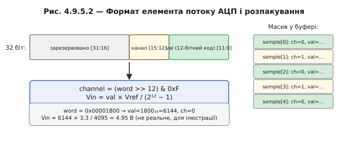

# DMA + АЦП: безперервний потік вимірів

Прочитати [АЦП одним викликом](book:electronics/adc) просто — `analogRead` повертає число, і ядро щось із ним робить. Але «справжній» сигнал треба міряти швидко й рівномірно: [частота дискретизації і теорема Найквіста](book:communications/nyquist-aliasing) вимагають, щоб для сигналу з частотою f вибірки йшли з частотою ≥ 2f. Для звуку стандарту телефонії (4 кГц) потрібно 8000 вимірів/с, для CD-якості — 44100/с, для вібродіагностики підшипників — нерідко 100000/с і більше.

Жодне з цих чисел не досяжне з `analogRead` у циклі — надто великий overhead на кожен виклик, надто нестабільний час між вимірами. Потрібне інше рішення: АЦП сам крокує по семплах з апаратною точністю, а результати складає в пам'ять через DMA.

### Як три речі зчіплюються в конвеєр

Конвеєр складають три блоки. [АЦП](book:electronics/adc) перетворює напругу в код. [Таймер](book:programming/timer-counter) або вбудований лічильник темпу всередині АЦП задає рівний ритм вибірок. [DMA-контролер](book:programming/dma-controller) переносить дані без ядра. Зчепіть їх:

1. Таймер тікає з частотою f_s (частота дискретизації).
2. На кожен тік АЦП робить вимір і поміщає результат у регістр даних; одночасно піднімає лінію DMA-запиту.
3. DMA реагує апаратно, забирає слово з регістра АЦП і кладе в черговий слот кільцевого буфера в SRAM.
4. Коли половина буфера заповнена — half-transfer ISR будить задачу RTOS.
5. Задача обробляє готову половину, поки DMA заповнює другу.

Ядро не торкнулося жодного окремого виміру. Воно прокидається раз на кілька десятків мілісекунд, бере блок і йде рахувати.


*Рис. Ланцюг безперервного АЦП: таймер → АЦП (DMA-запит на кожен семпл) → DMA → кільцевий буфер → completion ISR → задача RTOS.*

### Режим безперервного перетворення

На ESP32 безперервне оцифровування АЦП реалізовано через драйвер `adc_continuous` (у ESP-IDF 5.x він вбудований і підтримує DMA нативно). Концептуально: драйвер налаштовує АЦП у **scan mode** (сам проходить по заданих каналах) і прив'язує його до DMA. Деталі регістрів від вас приховані за API; принципово важливо, що оцифровування і транспортування даних відбуваються повністю апаратно.

### Формат елемента потоку

Кожен семпл у потоці — це не просте 12-бітне число. Це слово, де закодовані й код вимірювання, і номер каналу:

```c
/* Спрощена структура елемента потоку АЦП (ESP-IDF-подібний формат) */
typedef union {
    struct {
        uint16_t val     : 12;  /* 12-бітний код (0..4095) */
        uint16_t channel :  4;  /* номер каналу ADC1 (0..7) */
    };
    uint16_t raw;
} adc_sample_t;

/* Розпакування блоку */
void process_block(const uint8_t *buf, size_t len) {
    const adc_sample_t *samples = (const adc_sample_t *)buf;
    size_t count = len / sizeof(adc_sample_t);
    for (size_t i = 0; i < count; ++i) {
        int ch  = samples[i].channel;
        float v = samples[i].val * 3.3f / 4095.0f;  /* Vin = code × Vref / (2¹² − 1) */
        /* далі — аналіз, фільтрація, буферизація тощо */
    }
}
```



*Рис. 16/32-бітне слово розкладено на бітові поля «код» + «канал». Ядро розпаковує масив таких слів у пари (канал, вольти) формулою Vin = code × Vref / (2¹² − 1).*

### Калібрування в потоці

Формула `val × 3.3 / 4095` — перше наближення. Справжнє перетворення враховує [нелінійність і зсув нуля АЦП](book:electronics/adc-errors): коефіцієнти калібрування застосовуються до кожного семпла вже після вивантаження блоку, в задачі обробки. Це не на гарячому шляху DMA — не заважає потоку.

### Числовий приклад: потік 20 кГц

```
Потік: 20 000 семплів/с × 2 байти = 40 000 байт/с = 40 кБ/с

Розмір буфера (half = 2048 байт):
  Семплів у половині: 2048 / 2 = 1024

Інтервал між completion ISR:
  t = 1024 семпли / 20 000 семпл/с = 51.2 мс

Порівняння:
  analogRead: 20 000 ISR/с
  АЦП + DMA:  ≈ 20 ISR/с  (через half і full → ~40 разів/с при 2 half-interrupt)
  Зменшення: ~500 разів
```

Ядро прокидається 40 разів на секунду замість 20000. На решту 99,9% часу воно може рахувати FFT, керувати задачами або спати.


*Рис. Вгорі — analogRead: 20000 ISR/с (густа гребінка). Внизу — АЦП+DMA: одне пробудження раз на 25 мс (рідкі мітки). Той самий потік 20 кГц — у 500 разів менше переривань.*

> 🔧 **Навіщо це:** будь-яке «справжнє» вимірювання сигналу (звук, вібрація, ЕКГ, осцилограф) означає АЦП у режимі DMA. [Одиничний `analogRead`](book:electronics/adc) підходить лише для повільних величин — батарея, освітленість, температура. Щойно потрібна частота вище кількох сотень Гц — DMA обов'язковий.

**Пастка ESP32.** [ADC2 конфліктує з Wi-Fi](book:electronics/adc) — апаратне обмеження чіпа. Для безперервного DMA-потоку використовуйте ADC1.

Коли буфер заповнений семплами, він стає входом для подальшого аналізу — наприклад, [частотного розкладання сигналу](book:algorithms/fft).

---
