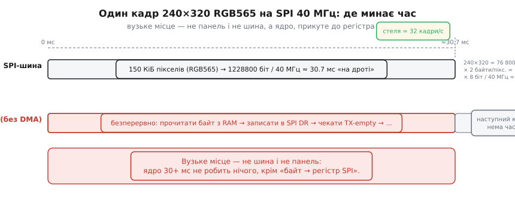
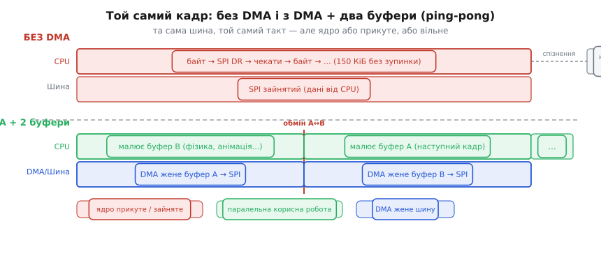

# 🔌 SPI-дисплей ILI9341-класу: чому кадр без DMA «смикається»

DMA особливо виправдовує себе на великих блоках даних — там, де цикл «прочитай-запиши» захлинається від обсягу. Найнаочніший такий блок у типовому проєкті на ESP32 — це кольоровий кадр дисплея: кілька сотень кілобайтів, що мусять вилетіти в SPI раз по раз, кадр за кадром. Тут і виникає дилема: хто жене ці байти — ядро чи DMA? Відповідь вирішує все: від плавності анімації до реакції всього інтерфейсу. Розгляньмо клас пристрою, порахуймо байти, з'ясуймо, що саме видно оком, і розберімо лік — DMA з двома буферами та робочим кодом.

---

### Що це за клас

ILI9341 — контролер кольорового TFT-LCD-дисплея, найпоширеніший у своєму ціновому сегменті; до тієї самої родини належать ST7789 (240×240 або 240×320), менший ST7735 (128×160) та інші. Типовий модуль — 2.2–3.2 дюйма, роздільність 240×320 пікселів, і найважливіше: контролер має власну відеопам'ять (GRAM). Панель розумна: вона сама освіжає скло з GRAM зі своєю частотою, приблизно 60 разів на секунду, — хост лише підкидає нові пікселі, коли хоче оновити картинку.

Підключення стисло: 3.3 В живлення, чотири лінії SPI (SCK, MOSI, CS, плюс MISO якщо потрібне читання), і два керувальні сигнали — DC (Data/Command, відрізняє команду від пікселів) і RST (скидання). Підсвітку вмикають окремим виводом або через транзистор. Глибша розпіновка і ініціалізаційна послідовність — не тут; нас цікавить швидкість і хто платить ціну.

Функційно малювання виглядає так: встановити вікно адрес (address window) командами встановлення адрес стовпців і рядків, потім командою «записати в GRAM» полити потік пікселів RGB565. DC=0 перед байтом означає команду, DC=1 — піксель. Деталі команд побачимо в коді нижче; прозу не роздуваємо.

---

### Скільки це байтів і чому це багато

Перейдемо від «полити потік пікселів» до числа. RGB565 — це два байти на піксель: 5 бітів на червоний канал, 6 на зелений, 5 на синій. Тому повний кадр 240×320 важить рівно стільки:

**Арифметика одного кадру 240×320 RGB565 на SPI 40 МГц**

```
240 × 320            = 76 800 пікселів
76 800 × 2 байти     = 153 600 байтів ≈ 150 КіБ/кадр

Час на лінії (SPI 40 МГц):
  153 600 × 8 біт    = 1 228 800 біт
  1 228 800 / 40·10⁶ ≈ 0.0307 с = 30.7 мс/кадр

Стеля кадрів (шина зайнята весь час):
  1000 мс / 30.7 мс  ≈ 32 кадри/с
```

30 мілісекунд «на дроті» — це ще терпимо. Але це лише час, доки сигнал летить по шині. Головна біда — не шина, а той, хто штовхає ці байти в SPI-регістр. Штовхнути вручну один-два байти — дрібниця. Тут таких штовхань 153 600 за кадр: саме на такому потоці [цикл «прочитай-запиши» захлинається](book:programming/dma-problem) — ось його найгучніший приклад.


*Рис. Горизонтальна вісь часу одного кадру. Верхня доріжка — SPI-шина: 150 КіБ пікселів за ≈ 30.7 мс. Нижня доріжка — ядро без DMA: суцільний блок «байт → регістр SPI → чекати», поруч порожня зона «обчислення наступного кадру — нема часу». Вузьке місце — не панель і не шина, а прикуте ядро.*

---

### Чому це видно оком: повільне «протирання» і розрив

Тепер числа стають симптомами. 30+ мс ядро тримає байти SPI-регістра, і поки воно це робить — воно не рахує наступний кадр. Реальна частота оновлення падає вдвічі-втричі: ядро спершу штовхає кадр (30 мс), тоді рахує нову картинку і штовхає знову. Звідси перший видимий симптом: пікселі лягають у GRAM послідовно, рядок за рядком, і оновлення «протирає» екран помітною хвилею зверху донизу — ніби хтось поволі проводив пензлем. На статичних картинках це ще терпимо, але на анімації воно ріже очі.

Другий симптом — розрив кадру (tearing): помітний горизонтальний «шов», що повзе по екрану. Причина — неузгодженість запису в GRAM із циклом освіження панелі. Дисплей освіжає скло зверху донизу з власною частотою (≈60 Гц), незалежно від того, що відбувається на SPI. Якщо хост почав вливати нові пікселі, поки контролер саме читає GRAM для освіження, — верх екрана вже відображає новий кадр, а низ ще старий. Виникає «шов». Контролери ILI9341 і його родичі можуть відправляти сигнал TE (tearing effect), що повідомляє, коли панель закінчила освіження і момент безпечний — але відстежувати і використовувати TE — це деталь вищого рівня, яку тут лише назвемо.

Третій наслідок менш помітний, але зрадливий: поки ядро 30 мс «висить» над SPI, воно не обробляє нічого іншого — ні кнопок, ні сенсорів, ні логіки анімації. Інтерфейс стає «в'язким»: натискаєш кнопку, а реакція приходить з помітною затримкою. Усі три біди мають один корінь — ядро прикуте до шини, — і саме цей корінь прибирає DMA.

---

### Лік: DMA жене пікселі, ядро рахує наступний кадр

Рецепт той самий, що й для будь-якого великого блоку: ядро задає вікно адрес (address window), дає команду «писати в GRAM», передає [DMA](book:programming/dma-controller) вказівник на буфер пікселів — і DMA сам виливає 150 КіБ у SPI-регістр, поки ядро рахує наступний кадр. На допомогу стає прийом ping-pong: [два буфери](book:programming/double-buffering) (double buffering). Поки DMA жене буфер A у шину, ядро малює буфер B; коли передача завершена — буфери міняють місцями. Це усуває і «протирання» (ядро більше не чекає шину), і дає природний момент для синхронізації з освіженням панелі, що зменшує tearing.

Практичний бонус: вікно адрес дозволяє слати DMA лише змінений прямокутник екрана. Якщо оновилась лише невелика область — шлемо її, а не весь кадр. Менше байтів — менше часу, вище частота оновлення.

**Робочий фрагмент: ESP-IDF spi_master, DMA + ping-pong**

```c
#include "driver/spi_master.h"
#include "driver/gpio.h"
#include "esp_heap_caps.h"

#define LCD_W   240
#define LCD_H   320
#define CHUNK_H  16          /* рядків в одному DMA-блоці */
#define PIN_DC   GPIO_NUM_2
#define PIN_RST  GPIO_NUM_4

spi_device_handle_t dev;

/* Буфери DMA-придатні (пам'ять для DMA особлива — MALLOC_CAP_DMA) */
static uint16_t *fb[2];

/* Допоміжна функція: послати команду (DC=0) або дані (DC=1) */
static void lcd_cmd(uint8_t cmd, const uint8_t *data, int len)
{
    spi_transaction_t t = { .length = 8, .tx_buffer = &cmd };
    gpio_set_level(PIN_DC, 0);           /* DC=0 → байт-команда */
    spi_device_polling_transmit(dev, &t);
    if (data && len > 0) {
        spi_transaction_t td = { .length = len * 8, .tx_buffer = data };
        gpio_set_level(PIN_DC, 1);       /* DC=1 → дані команди */
        spi_device_polling_transmit(dev, &td);
    }
}

/* Встановити вікно адрес (колонки і рядки) */
static void lcd_set_window(uint16_t x0, uint16_t y0,
                           uint16_t x1, uint16_t y1)
{
    uint8_t p[4];
    p[0]=x0>>8; p[1]=x0&0xFF; p[2]=x1>>8; p[3]=x1&0xFF;
    lcd_cmd(0x2A, p, 4);                 /* Column Address Set */
    p[0]=y0>>8; p[1]=y0&0xFF; p[2]=y1>>8; p[3]=y1&0xFF;
    lcd_cmd(0x2B, p, 4);                 /* Row Address Set */
    lcd_cmd(0x2C, NULL, 0);             /* Memory Write — далі пікселі */
    gpio_set_level(PIN_DC, 1);           /* DC=1 → пікселі */
}

/* Надіслати один DMA-chunk (неблокуючи) */
static spi_transaction_t trx;
static void lcd_send_chunk(uint16_t *buf, int pixels)
{
    trx = (spi_transaction_t){
        .length    = pixels * 16,        /* біти */
        .tx_buffer = buf,
    };
    spi_device_queue_trans(dev, &trx, portMAX_DELAY);
}

/* Чекати завершення попередньої DMA-транзакції */
static void lcd_wait()
{
    spi_transaction_t *res;
    spi_device_get_trans_result(dev, &res, portMAX_DELAY);
}

/* --- Ініціалізація шини --- */
void lcd_init_bus(void)
{
    spi_bus_config_t bus = {
        .mosi_io_num = GPIO_NUM_13,
        .sclk_io_num = GPIO_NUM_14,
        .miso_io_num = -1,
        .max_transfer_sz = LCD_W * CHUNK_H * 2, /* байтів на chunk */
    };
    spi_bus_initialize(SPI2_HOST, &bus, SPI_DMA_CH_AUTO);

    spi_device_interface_config_t dcfg = {
        .clock_speed_hz = 40 * 1000 * 1000,
        .mode           = 0,
        .spics_io_num   = GPIO_NUM_15,
        .queue_size     = 1,
    };
    spi_bus_add_device(SPI2_HOST, &dcfg, &dev);

    /* DMA-придатні буфери (звичайний malloc тут не годиться) */
    fb[0] = heap_caps_malloc(LCD_W * CHUNK_H * 2, MALLOC_CAP_DMA);
    fb[1] = heap_caps_malloc(LCD_W * CHUNK_H * 2, MALLOC_CAP_DMA);

    /* Після RST шлють ініт-послідовність контролера (≥120 команд ILI9341) */
    /* ... gpio RST low/high, sleep-out, display-on, color-mode RGB565 ... */
}

/* --- Головний цикл ping-pong: оновити весь кадр chunk-ами --- */
void lcd_flush_frame(void (*render_chunk)(uint16_t *buf, int y, int h))
{
    int cur = 0;
    lcd_set_window(0, 0, LCD_W - 1, LCD_H - 1);

    /* Заповнити перший буфер, поки DMA ще не стартував */
    render_chunk(fb[cur], 0, CHUNK_H);

    for (int y = 0; y < LCD_H; y += CHUNK_H) {
        lcd_send_chunk(fb[cur], LCD_W * CHUNK_H);   /* DMA жене fb[cur] */
        int next = cur ^ 1;
        int ny   = y + CHUNK_H;
        if (ny < LCD_H)
            render_chunk(fb[next], ny, CHUNK_H);    /* ядро малює fb[next] */
        lcd_wait();                                 /* чекати ЦЕЙ chunk */
        cur = next;
    }
}
```

Той самий 40-МГц такт, те саме скло, ті самі 150 КіБ — але тепер ядро вільне весь цей час. Шина зайнята, ядро рахує. Картинка лягає рівно, інтерфейс живий.


*Рис. Дві пари доріжок (CPU і шина). Зверху «без DMA»: CPU суцільно зайнятий «байт → SPI DR», наступний кадр спізнюється. Знизу «DMA + 2 буфери»: DMA жене буфер A у шину, CPU паралельно малює буфер B; на вертикальній лінії — обмін A↔B, кадри впритул.*

---

### Типові граблі

- **Буфер не DMA-придатний.** Звичайний `malloc` дає пам'ять із DRAM, але не всі її ділянки доступні DMA-контролеру: передача може мовчки повернути порожній екран або впасти. Буфер беруть із `MALLOC_CAP_DMA` — і він мусить бути вирівняним по 4 байти. Докладніше про [вирівнювання і DMA-придатну пам'ять](book:programming/dma-cache-races) — окрема тема.

- **Завеликий transfer за раз.** `max_transfer_sz` у конфігурації шини обмежує один блок. Якщо намагатись послати весь кадр (150 КіБ) одним викликом, а апаратна межа менша — транзакція рветься. Великий кадр шлють chunk-ами, як показано вище: по CHUNK_H рядків за раз.

- **Чіпаєш буфер, поки DMA його читає.** Почав малювати в fb[0], поки DMA ще жене fb[0] — на екрані каша. Саме тому потрібні два буфери і `spi_device_get_trans_result()` перед тим, як перевикористати буфер.

- **Розрив без синхронізації.** Якщо стартувати новий кадр, не синхронізуючись із циклом освіження панелі (сигнал TE), горизонтальний шов нікуди не дівається — DMA лише пришвидшує заливку, але не усуває неузгодженість із скануванням. Для ідеальної картинки новий кадр стартують у такт із TE.

- **DC перемкнули не в той момент.** Рівень DC мусить бути виставлений до старту DMA-транзакції й не змінюватись під час неї. Якщо DC перемкнути посеред потоку пікселів, контролер прийме наступний байт за команду — і реагуватиме непередбачувано.

---

### Варіації класу

Той самий DMA-підхід без жодних принципових змін працює на всій родині: ST7789 (240×240 або 240×320), менший ST7735 (128×160), більший ILI9488 (320×480 — йому для прийнятної частоти часто потрібен паралельний 16-бітний інтерфейс або вищий такт SPI). Ширший огляд [типів панелей](book:electronics/display-classes), інтерфейсів і особливостей кожного — окрема тема. Тут важливо одне: чим більший екран, тим гостріша потреба в DMA — і тим яскравіші симптоми, коли його нема.

---

> 🔧 **Навіщо це.** Кольоровий кадр — це ~150 КіБ за раз; якщо ядро штовхає їх у SPI байт за байтом, воно 30+ мс не робить нічого іншого — звідси «протирання», розрив кадру (tearing) і в'язкий інтерфейс. Лік той самий, що й для будь-якого великого блоку: віддати потік DMA з DMA-придатного буфера (MALLOC_CAP_DMA), тримати два буфери (ping-pong) і слати вікнами лише те, що змінилось. Те саме залізо, але ядро вільне — а картинка плавна.
