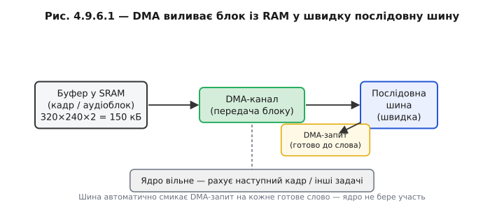
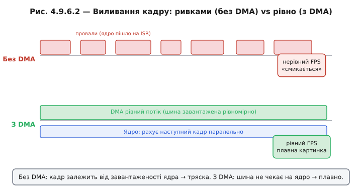

# DMA + SPI/I2S: великі блоки без переривань

Коли [DMA вичитує потік із АЦП](book:programming/dma-adc), дані течуть із периферії **у** пам'ять (АЦП → SRAM). Існує і дзеркальний напрям: великий блок треба вилити з пам'яті **у** швидку послідовну шину. Класичні приклади — кадр пікселів на дисплей і буфер звукових семплів у цифровий підсилювач.

Такі шини — [SPI](book:communications/spi-bus), I2S та подібні — цікавлять нас тут лише як «послідовний канал, що бере по слову за раз на високій тактовій частоті». Фізичний рівень і формат кадрів залишимо осторонь — важливий сам факт «шина чекає слова дуже часто».

### Проблема без DMA

Кадр дисплея 320×240 пікселів у форматі RGB565 — це 153 600 байтів. Якщо ядро саме годує шину байт за байтом через поллінг або кожне переривання «поклади наступне слово»:

```
Шина 40 Мбіт/с:  1 байт ≈ 0.2 мкс
Кадр 150 кБ:     150 000 × 0.2 мкс ≈ 30 мс
```

Тридцять мілісекунд ядро заблоковане. При 30 FPS (33 мс/кадр) воно взагалі не встигає робити нічого іншого — весь час виливає пікселі. Результат: кадр виводиться нерівно, бо ядро відволікається на інші переривання; FPS нестабільний, картинка «смикається».

Якщо замість поллінгу використати переривання-на-слово — для 16-бітного слова це 150 000 / 2 = 75 000 ISR на кадр, або при 30 FPS — 2,25 мільйона ISR/с. На такій частоті сам вхід-вихід в [обробник переривання](book:programming/isr) з'їдає більшість тактів — ядру майже нічого не лишається на корисну роботу.

### З DMA

Ядро готує буфер кадру, пише в регістр DMA «джерело = буфер, призначення = FIFO шини, довжина = 150 000», ставить «старт». Далі шина сама смикає DMA-запит на кожне готове слово, DMA посилає слово, шина надсилає наступний запит. Ядро вільне.

```c
/* Узагальнений патерн: відправити блок через DMA (деталі шини — Модуль 6) */

static volatile bool tx_done = false;

/* Колбек завершення передачі (викликається з ISR) */
static void on_tx_done(void *arg) {
    tx_done = true;
    /* Або: xSemaphoreGiveFromISR(sem_tx, &woken); */
}

/* Відправити буфер кадру (block = 150 кБ, деталі шини абстраговані) */
void display_flush(const uint8_t *frame_buf, size_t len) {
    tx_done = false;
    dma_send(frame_buf, len, on_tx_done, NULL);  /* один виклик — весь блок без ядра */
    while (!tx_done) { /* очікувати або yield задачу */ }
}
```

Ключова ідея — **один виклик → весь блок**. Що відбувається всередині шини — деталі протоколу самої [SPI](book:communications/spi-bus); тут важливо, що ядро не береться за кожне слово окремо.

### Два класи навантаження

**Дисплей.** Буфер кадру виливається порціями при кожному оновленні. З DMA кадр тече рівним потоком, ядро паралельно будує наступний. Без DMA — кадр виходить ривками, бо ядро відволікається.

**Аудіо і мікрофон.** Тут потік симетричний і безперервний: [цифровий мікрофон](book:electronics/microphone-speaker) постійно генерує семпли (мікрофон → шина → DMA → SRAM), і одночасно підсилювач очікує семплів (SRAM → DMA → шина → підсилювач). Обидва напрями працюють через [подвійні (кільцеві) буфери](book:programming/double-buffering): поки DMA читає чи пише одну половину, ядро обробляє іншу. Про підключення цифрового мікрофона детальніше — 🔌 r09-s6-c-i2s-mic.

**Числовий приклад: кадр дисплея**

```
Кадр 320×240×2 байти = 153 600 байт
Шина 40 Мбіт/с = 5 МБ/с

Час передачі: 153 600 / 5 000 000 = 30.7 мс

Без DMA: ядро стоїть усі 30 мс, нічого іншого.
З DMA:   ядро вільне 30 мс → будує наступний кадр, керує RTOS-задачами.
         Реальний FPS: без DMA ≈ 16, з DMA → 30+ (ядро встигає і кадр, і логіку).
```

> 🔧 **Навіщо це:** щойно блок ≥ кількох сотень байтів і шина швидка — DMA обов'язковий. Саме так дисплеї дають плавну картинку, а аудіо — без клацань.



*Рис. Великий буфер у RAM виливається через DMA у послідовну шину словом за словом; шина смикає DMA-запит на кожне готове слово, ядро вільне.*



*Рис. Без DMA: кадр виходить ривками із провалами (ядро відволікається). З DMA: рівний потік, ядро паралельно рахує наступний кадр.*

Є приємна культурна довідка: 📜-вставка r09-s6-history-soundblaster розповідає, звідки геймери 1990-х знали слово «DMA» — Sound Blaster мав власний DMA-канал і вимагав вказувати його номер при встановленні. Це була перша точка контакту мільйонів людей із цим поняттям.

Дивіться також: 🔌 r09-s6-c-spi-display — чому дисплей «смикається» без DMA (покроковий розбір), 🔌 r09-s6-c-i2s-mic — цифровий мікрофон через шину.

---
