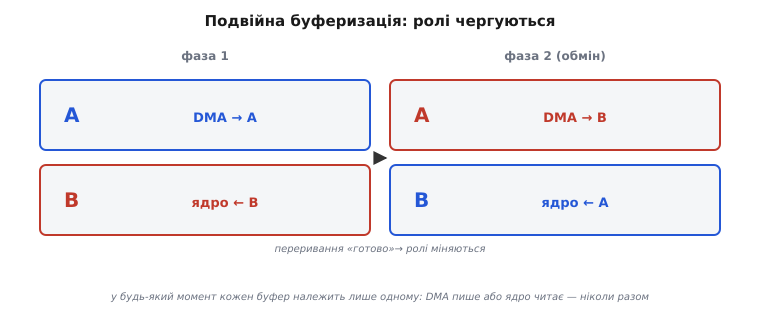
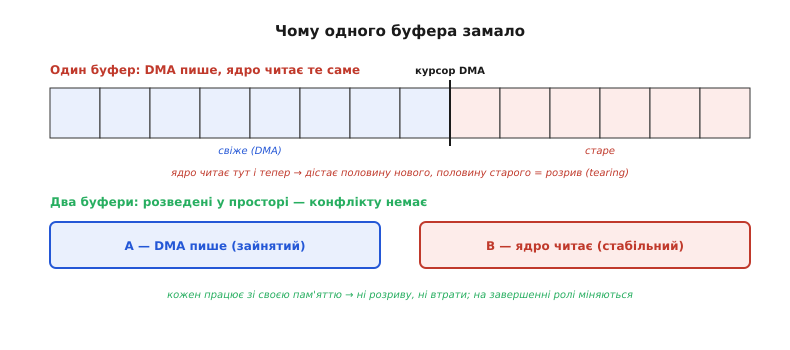
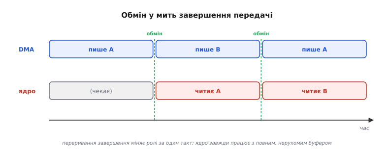

# Подвійна буферизація

Уяви безперервний потік даних, що сам тече в пам'ять: [DMA-контролер](book:programming/dma-controller) переносить відліки з мікрофона чи камери в буфер, байт за байтом, не питаючи ядро. Зручно — ядро вільне для роботи. Та щойно потік стає безперервним, виринає підступне питання: коли ядру читати цей буфер? Якщо просто зараз, поки DMA ще пише в нього, ядро дістане суміш — частину свіжих відліків і частину старих, які DMA ще не встиг затерти. Наполовину заповнений аудіокадр. Кадр зображення, склеєний із двох різних моментів зйомки.

Цей дефект має точну назву — **розрив** (англ. *tearing*, «розривання»; термін прийшов із графіки, де на екрані видно злам між двома напівнамальованими кадрами). За ним стоїть та сама [гонка читання-запису](book:programming/atomicity-races), що й між перериванням і головним кодом: один пише, другий читає те саме місце без узгодження. Тільки тут конфлікт не на рівні однієї змінної, а на рівні цілого блоку, і в реальному часі.

Конфлікт чіткий: DMA пише безперервно, ядро обробляє пачками. М'ютекс тут не допоможе — DMA не задача операційної системи, його не «приспати» на час обробки. Але два процеси, що не можна синхронізувати в часі замком, можна **розвести у просторі**: дати кожному власну пам'ять.

## Дві коробки замість однієї

Найпростіше робоче рішення — два буфери замість одного. Цей прийом і називають **подвійною буферизацією** (англ. *double buffering*, «подвійне буферування»), а через характерний ритм роботи — **пінг-понг** (англ. *ping-pong*, за грою в настільний теніс: поки одна сторона б'є, інша готується).

Поки DMA наповнює буфер A, ядро спокійно обробляє буфер B. Коли DMA закінчує A, він піднімає переривання завершення — ядро дізнається, що A готовий, бере його в обробку, а DMA тієї ж миті перемикається на B і починає наповнювати вже його. Два стани чергуються, як м'ячик між гравцями: поки один летить в один бік, інший летить у зворотний.

Розрив зникає не тому, що десь з'явилося блокування, а тому що кожен буфер у будь-який момент **належить** комусь одному: або DMA (наповнює), або ядру (читає). Ніколи обом разом. Конфлікт фізично неможливий, бо сторони не торкаються однієї пам'яті.



*Ролі чергуються: у кожній фазі один буфер заповнює DMA, інший читає ядро; переривання завершення міняє їх місцями.*

Контраст із єдиним буфером показує, чому розведення у просторі взагалі працює:



*Один буфер дає розрив, бо читач і писар ділять ту саму пам'ять; два буфери розводять їх — конфлікту немає, а на завершенні передачі ролі міняються.*

> 🔧 **Навіщо це.** Будь-який безперервний потік у прошивку — звук з [I2S-мікрофона](root:embedded/dma-spi-i2s), кадри з камери, відліки [швидкого АЦП](root:embedded/dma-adc) — без подвійного буфера або губить дані під час обробки, або віддає ядру напівзаповнений блок. Пінг-понг — стандартний кістяк такого тракту: одне обробляй, інше заповнюй.

## Обмін у мить завершення

Уся точність прийому — в одному моменті: коли DMA дописав буфер, ролі мають помінятися **атомарно**, за один крок, поки ніхто нічого не читає й не пише на стику. Саме це робить переривання завершення передачі. Воно спрацьовує рівно тоді, коли активний буфер повний, перемикає вказівник на інший і будить ядро.



*Обмін відбувається в мить завершення передачі: ядро завжди дістає повний, уже нерухомий буфер, а DMA одразу пише в інший.*

Ось мінімальний, але робочий кістяк на ESP32 з FreeRTOS. Два статичні буфери; прапорець каже, котрий зараз «ядра»; переривання завершення міняє ролі й роздає семафор, а задача прокидається й обробляє готовий буфер:

```c
#include <stdint.h>
#include <stdbool.h>
#include "freertos/FreeRTOS.h"
#include "freertos/semphr.h"

#define BUF_SIZE 1024
static uint8_t buf_a[BUF_SIZE] __attribute__((aligned(32)));
static uint8_t buf_b[BUF_SIZE] __attribute__((aligned(32)));

static volatile bool use_buf_a = false;   /* який буфер ЗАРАЗ читає ядро */
static SemaphoreHandle_t sem_ready;

/* Переривання завершення DMA: активний буфер дописано */
void IRAM_ATTR dma_completion_isr(void *arg) {
    BaseType_t woken = pdFALSE;
    use_buf_a = !use_buf_a;                /* атомарний обмін ролей */
    xSemaphoreGiveFromISR(sem_ready, &woken);
    portYIELD_FROM_ISR(woken);            /* прокинути задачу негайно */
}

/* Задача, що обробляє готовий буфер */
void process_task(void *pv) {
    while (1) {
        xSemaphoreTake(sem_ready, portMAX_DELAY);   /* чекати «готово» */
        uint8_t *ready = use_buf_a ? buf_a : buf_b; /* свіжо дописаний */
        /* DMA саме зараз пише в ІНШИЙ буфер — ready недоторканний */
        process_block(ready, BUF_SIZE);
    }
}
```

Розберімо ключові місця. `use_buf_a` помічений `volatile`, бо його змінює переривання, а читає задача — компілятор не має права закешувати його в регістрі (чому саме — у темі про [`volatile`](book:programming/volatile)). Перемикання `use_buf_a = !use_buf_a` — це один запис машинного слова, тож сторони ніколи не бачать «напівобміняний» стан. А головне — ядро ніколи не опитує прапорець у циклі: переривання роздає семафор, задача спить на `xSemaphoreTake`, доки блок не готовий. Так сходяться [переривання](book:programming/interrupts) і [передача даних між задачами](book:programming/task-ipc): переривання рідкісне й корисне, ядро не марнує тактів на очікування.

Один тонкий момент: вирівнювання `aligned(32)`. DMA часто вимагає, щоб буфер починався на межі рядка кешу, інакше очищення й інвалідація кешу зачеплять сусідні дані — окрема [пастка DMA й кешу](book:programming/dma-cache-races). Тому буфери оголошено вирівняними з самого початку.

> 🔧 **Навіщо це.** Зв'язка «переривання завершення → семафор → задача» — типовий шаблон збору даних у реальному часі: апаратура сама будить обробник рівно тоді, коли є що обробляти. Ядро решту часу або спить (економлячи [батарею](book:programming/sleep-modes)), або робить інше. Опитування прапорця в циклі замість семафора з'їдало б CPU і ламало детермінованість.

## Скільки пам'яті потрібно

Подвійний буфер працює лише за однієї умови: ядро встигає обробити свій блок раніше, ніж DMA допише сусідній. Інакше DMA, закінчивши, перемкнеться назад на буфер, який ядро ще читає, — і почне затирати непрочитане. Це **переповнення** (англ. *overrun*, «перебіг»): тиха втрата даних без жодного повідомлення про помилку.

Звідси стрижневе правило розміру: **час заповнення одного буфера ≥ часу обробки попереднього**. Якщо обробка довша — буфер замалий. Грубий розрахунок прямий:

```
Потік (стерео-звук): 96000 семплів/с × 2 канали × 2 байти = 384000 байт/с
Час обробки блоку ядром:  t_proc = 4 мс = 0.004 с

Байтів, що прилітають за час обробки:
  384000 × 0.004 = 1536 байт

Отже буфер ≥ 1536 байт; із запасом 2× → 4096 байт.
Перевірка часу заповнення:
  4096 / 384000 ≈ 10.7 мс  >  4 мс (t_proc)  → ОК, є запас
```

Запас потрібен не для краси: планувальник може на мить витіснити задачу, шина пам'яті — конкурувати з DMA, кеш — промахнутися. Усе це подовжує `t_proc` від випадку до випадку. Розмір «упритул» на папері в реальній системі переповнюється від першого ж збурення. Повний апарат розрахунку з коефіцієнтом запасу й переведенням у байти — у вставці 🧮 [розмір ping-pong буфера](book:programming/double-buffering/math-buffer-sizing.md).

> 🔧 **Навіщо це.** Перш ніж заводити DMA-потік, полічи розмір буфера від найгіршого `t_proc` із запасом 1.5…2× і округли вгору до степеня двійки (зручно для DMA-передач і вирівнювання). Замало — DMA дожене ядро й загубить дані; забагато — змарнуєш дефіцитну SRAM і додаси затримки.

## Коли пінг-понг не підходить

Дві коробки чудові, поки блоки чітко розмежовані, а час обробки передбачуваний. Та буває, що ядро хоче читати дані рівним струмком, не чекаючи кінця цілого буфера, або обробляти їх шматками довільного розміру. Тоді природніший родич — **кільцевий буфер** (англ. *ring buffer* / *circular buffer*, «кільцевий»): один масив, замкнений по колу, де вказівник запису DMA біжить попереду, а ядро наздоганяє позаду з безпечним відставанням. Половинне й повне переривання дають ядру дві точки входу замість однієї.

Кільцевий буфер — це той самий принцип «писар і читач не торкаються однієї комірки», але виражений через рух двох вказівників по спільному масиву, а не через дві окремі коробки. Його арифметика (обернення індексу, неоднозначність «повно проти порожньо», блок через фізичний край масиву) і робочий код — у вставці ⚙️ [кільцевий буфер з нуля](book:programming/double-buffering/proj-ring-buffer.md).

Є і крок далі — **потрійна буферизація** (англ. *triple buffering*): три буфери замість двох. Третій дає писареві куди писати навіть тоді, коли один буфер показується/обробляється, а другий саме в обміні, — тож DMA (чи відеокарта в графіці) ніколи не стоїть і не чекає звільнення. Платня за це — більша затримка: показаний кадр може бути на один-два кроки «старіший». Для прошивки на дефіцитній SRAM подвійного буфера зазвичай досить; потрійний беруть там, де простій писаря дорожчий за зайву пам'ять і лаг.

Вибір між трьома схемами зводиться до одного питання: чи є чітка межа між блоками й чи передбачуваний час їх обробки. Є — пінг-понг; ні, потрібен рівний потік — кільце; писар не сміє чекати ніколи — потрійний буфер.
