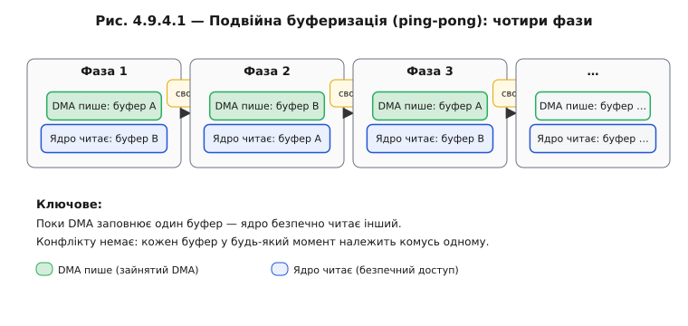
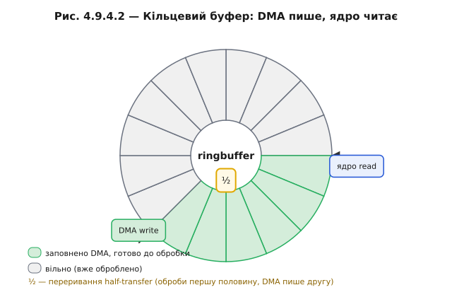
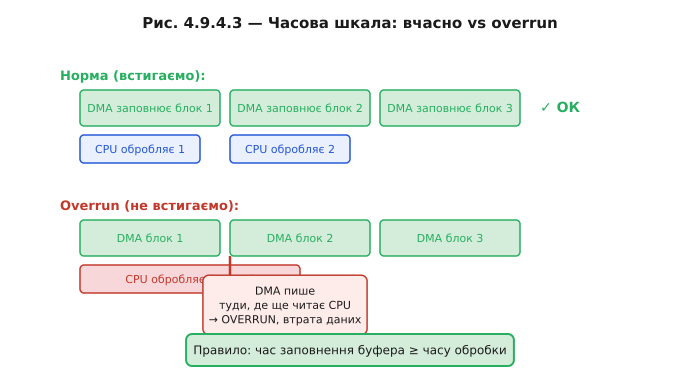

# Кільцевий буфер і подвійна буферизація (ping-pong)

Замкнутий ланцюг дескрипторів дає DMA нескінченний потік. Але щойно DMA починає писати в пам'ять безперервно, виникає нова проблема: ядро хоче читати той самий буфер. Якщо воно зробить це просто зараз, поки DMA ще пише, — дістане суміш нового й старого. Наполовину заповнений аудіофрейм, надірваний кадр із пікселями двох різних моментів. Це та сама [гонка читання-запису](book:programming/atomicity-races) (ISR пише — main читає), але тепер на рівні блоків у реальному часі.

Конфлікт чіткий: DMA пише безперервно, ядро обробляє пачками. Ці два процеси не можна синхронізувати м'ютексом (DMA — не задача), але можна розвести у просторі або в часі.

### Подвійна буферизація (ping-pong)

Найінтуїтивніше рішення — два буфери. Поки DMA наповнює буфер A, ядро обробляє буфер B. Коли DMA закінчує A, він піднімає переривання — ядро одержує «свіжий» A і починає обробляти його, тоді як DMA тут же перемикається на B і починає наповнювати його. Два стани чергуються, як у пінг-понгу: поки один летить в один бік, інший летить у зворотний.

Конфлікту немає не тому, що є блокування, а тому що кожен буфер у будь-який момент **належить** комусь одному: або DMA (заповнює), або ядру (читає). Поле `owner` у дескрипторі якраз це й кодує.



*Рис. Чотири фази ping-pong: DMA пише A — ядро читає B, потім навпаки. Обидва буфери в будь-який момент у різних руках.*

```c
/* Мінімальний каркас ping-pong */
#define BUF_SIZE 1024
static uint8_t buf_a[BUF_SIZE] __attribute__((aligned(32)));
static uint8_t buf_b[BUF_SIZE] __attribute__((aligned(32)));

static volatile bool use_buf_a = false;  /* який буфер зараз «ядра» */
static SemaphoreHandle_t sem_ready;

/* DMA completion ISR — викликається, коли DMA завершив черговий буфер */
void IRAM_ATTR dma_completion_isr(void *arg) {
    BaseType_t woken = pdFALSE;
    use_buf_a = !use_buf_a;              /* поміняти ролі */
    xSemaphoreGiveFromISR(sem_ready, &woken);
    portYIELD_FROM_ISR(woken);
}

/* Задача RTOS, що обробляє готовий буфер */
void process_task(void *pvParam) {
    while (1) {
        xSemaphoreTake(sem_ready, portMAX_DELAY);
        uint8_t *my_buf = use_buf_a ? buf_a : buf_b;
        /* DMA зараз пише в ІНШИЙ буфер — my_buf безпечний */
        process_block(my_buf, BUF_SIZE);
    }
}
```

Зверніть увагу: тут сходяться [переривання](book:programming/interrupts) і [передача даних між задачами](book:programming/task-ipc). Замість того щоб ядро опитувало прапорець, ISR роздає семафор — задача RTOS прокидається і забирає готовий буфер. Переривання рідкісне й корисне.

### Кільцевий буфер

Ping-pong чудово підходить, якщо блоки чітко розмежовані й час обробки передбачуваний. Але є ситуації, де ядро хоче читати дані рівним потоком, не чекаючи кінця цілого буфера. Тут допомагає **кільцевий буфер** (*ring buffer, circular buffer*).

Один великий масив, дескриптори замкнені в кільце. DMA іде вперед, заповнюючи чергові ділянки. Ядро слідує позаду з відставанням, читаючи вже готові ділянки. Доки ядро читає швидше, ніж DMA заповнює, між двома вказівниками завжди є «буфер безпеки».

Два переривання дають ядру точки входу:
- **Half-transfer interrupt**: DMA заповнив половину кільця → ядро може обробляти першу половину, поки DMA пише другу.
- **Transfer-complete interrupt**: DMA заповнив другу половину → ядро обробляє другу, поки DMA починає перший прохід знову.



*Рис. Кільцевий буфер: вказівник запису DMA біжить попереду, ядро наздоганяє позаду. Позначено half-transfer і transfer-complete. Між вказівниками — безпечна дуга для обробки.*

### Який розмір буфера потрібен

Ключове правило: **час заповнення одного half-буфера ≥ часу обробки попереднього half-буфера**. Якщо обробка займає більше, ніж DMA встигає заповнити буфер, — вказівник DMA наздоганяє ядро, дані перезаписуються прямо під час читання. Це **overrun** — втрата даних без будь-якого повідомлення про помилку.

**Розрахунок мінімального розміру**

```
Потік: 96 000 семплів/с × 2 канали × 2 байти = 384 000 байт/с
Час обробки блоку ядром: T_proc = 4 мс = 0.004 с

Байтів за 4 мс = 384 000 × 0.004 = 1536 байт

Half-буфер ≥ 1536 байт → повний буфер ≥ 3072 байт
З запасом 2× → взяти 4096 байт (кожна половина 2048)

Перевірка:
  Час заповнення half-буфера (2048 байт):
    t_fill = 2048 / 384 000 ≈ 5.3 мс > 4 мс (T_proc) → ОК
```



*Рис. Вище (ОК): обробка ядром коротша за заповнення блоку DMA. Нижче (overrun): обробка довша, читання наповзає на ще-не-готові дані — втрата.*

> 🔧 **Навіщо це:** правило вибору — час заповнення ≥ часу обробки. Ping-pong = «обробляй одне, заповнюй інше»; кільцевий буфер = «йди слідом із відставанням». Вибір між ними залежить від того, чи є чітка межа між блоками.

Розгорнутий розрахунок розміру буфера — у 🧮 r09-s4-m-buffer-sizing. Побудова кільцевого буфера з нуля — у ⚙️ r09-s4-a-ring-buffer.

---
