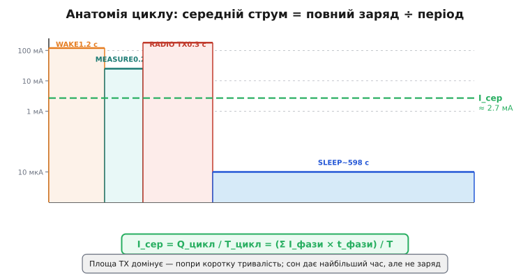
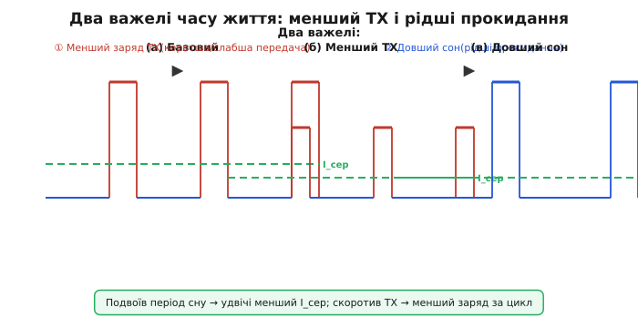

# Цикл «прокинувся → виміряв → передав → заснув»: середній струм

Пристрій на батареї живе циклами: він прокидається, бере вимір, передає його по радіо й знову западає в [глибокий сон](book:programming/sleep-modes), де споживає одиниці мікроампер. [Звідки в схемі береться струм](book:programming/current-paths), [що його будить](book:programming/wakeup-sources) і як дрібну роботу між пробудженнями бере на себе [маломіцний співпроцесор (ULP)](book:programming/ulp-coprocessor) — окремі питання; тут же постає головна навичка інженера з енергоощадності: звести цей рваний профіль струму в часі до одного числа — **середнього струму** — і від нього отримати час життя батареї. Це арифметика скважності (*duty cycle*).

Уявімо, як виглядає профіль струму типового IoT-давача в часі. Спочатку коротке пробудження і boot: чип стартує, ядра на повній швидкості, ємності заряджаються — сплеск до 40–80 мА протягом кількох сотень мілісекунд. Потім вимір: активний АЦП або шина даних, помірний струм 15–25 мА на десятки мілісекунд. Далі — Wi-Fi передача: найвищий пік 150–200 мА, що може тривати кілька секунд. І нарешті більша частина циклу — глибокий сон: 8–10 мкА на хвилини чи години. Намалюємо цей профіль.



*Рис. Профіль струму в часі з підписаними фазами і заштрихованими площами (зарядами). Площа TX домінує попри короткість — бо висота × ширина найбільша. Пунктир — I_сер, що стоїть далеко вище плато сну.*

**Формула середнього струму:**

```
I_сер = Q_цикл / T_цикл = (Σ I_фази_k × t_фази_k) / T_цикл
```

Або простіше: середній струм — це **повний заряд за цикл, поділений на тривалість циклу**. Еквівалентно — зважене за часом середнє струмів фаз. Якщо інтуїтивніше: загальна площа під кривою струму в часі, поділена на весь відрізок часу.

Чому саме сон є таким важливим важелем? Якщо заряд активної частини фіксований (змінити його важко), єдиний спосіб знизити I_сер — **розтягнути T_цикл**: спати довше, прокидатися рідше. Подвоїв T — удвічі менший I_сер при тому ж заряді активної фази. Звідси проєктне питання: «а чи можна цей давач прокидати не раз на хвилину, а раз на п'ять?».

Є два важелі оптимізації, і в реальному проєктуванні треба балансувати обидва.



*Рис. Графіки трьох сценаріїв: (а) базовий, (б) скорочена передача — нижчий пік, (в) рідші прокидання — довший сон. Обидва важелі знижують I_сер, але по-різному: (б) зменшує заряд за цикл, (в) збільшує T_цикл.*

**Перший важіль — зменшити заряд активної частини**: коротша Wi-Fi передача (батчинг кількох вимірів в одному пакеті), нижча тактова частота під час обчислень, [ULP замість великого ядра](book:programming/ulp-coprocessor) для частих вимірів, кешування Wi-Fi-сесії, щоб не перепідключатися щоразу.

**Другий важіль — збільшити T_цикл**: прокидатися рідше. Це компроміс зі свіжістю даних — якщо бізнес-логіка вимагає оновлення раз на хвилину, фізично не можна спати годину.

Є ще одна пастка, пов'язана саме з deep-sleep: **boot-вартість**. Щоразу після прокидання витрачається 100–500 мс на ініціалізацію, і якщо до того потрібне Wi-Fi підключення — ще 0.5–2 секунди при 120–150 мА. Цей заряд є завжди, незалежно від того, наскільки рідко прокидаєшся. При занадто частих прокиданнях boot-вартість домінує — тоді краще або легший [light-sleep](book:programming/sleep-modes), де чип не перевантажується з нуля, або батчити кілька вимірів на одну передачу.

> 🔧 **Навіщо це.** Цей розрахунок — **головний артефакт проєкту на батареї**. Перш ніж паяти, складаєш профіль фаз у табличку, рахуєш I_сер, ділиш ємність — і знаєш, місяць чи рік прослужить пристрій. Якщо мало — видно з таблиці, який важіль тягнути.

**Worked-приклад. Середній струм метеостанції — три сценарії.**

```
Дано фази (сценарій А: прокидання раз на 10 хв):
  deep-sleep:       0.008 мА   весь час між прокиданнями
  boot + Wi-Fi конект: 120 мА,  1.2 с
  вимір:             25 мА,   0.2 с
  TX:               180 мА,   0.3 с
  T_цикл = 600 с

Заряд активної частини:
  boot:  120 × 1.2  = 144 мА·с
  вимір:  25 × 0.2  =   5 мА·с
  TX:    180 × 0.3  =  54 мА·с
  Разом:             203 мА·с

Заряд сну: 0.008 мА × (600 - 1.7) с = 4.79 мА·с

Q_цикл = 207.8 мА·с
I_сер = 207.8 / 600 = 0.346 мА = 346 мкА

Час від AA 2000 мА·год:
  t = 2000 / 0.346 ≈ 5780 год ≈ 241 доба ≈ 8 місяців


Сценарій Б: прокидання раз на 30 хв (T = 1800 с):
  активна частина незмінна: 203 мА·с
  сон: 0.008 × 1798.3 = 14.4 мА·с
  Q = 217.4 мА·с
  I_сер = 217.4 / 1800 = 0.121 мА = 121 мкА
  t ≈ 2000 / 0.121 ≈ 16500 год ≈ 688 днів ≈ 23 місяці

  Виграш: 23 міс проти 8 міс — у 2.85 рази, прокидаємося втричі рідше.


Сценарій В: прокидання раз на 10 хв, але Wi-Fi конект 0.3 с (кешована сесія):
  boot+конект:  120 × 0.3  =  36 мА·с
  вимір:         25 × 0.2  =   5 мА·с
  TX:           180 × 0.3  =  54 мА·с
  Разом:                       95 мА·с
  + сон:                       4.8 мА·с
  Q = 99.8 мА·с
  I_сер = 99.8 / 600 = 0.166 мА
  t ≈ 2000 / 0.166 ≈ 12050 год ≈ 502 дні ≈ 16.7 місяців

Висновок: скорочення Wi-Fi конекту з 1.2 до 0.3 с дало більше, ніж
подвоєння інтервалу прокидань. Заряд boot-фази домінує — там і копати.
```

> 🧮 Уточнення з урахуванням саморозряду, температури і ефекту Пейкерта — у вставці [r13-s1-m-battery-math.md](book:programming/battery-budget/math-battery-math.md).

---
