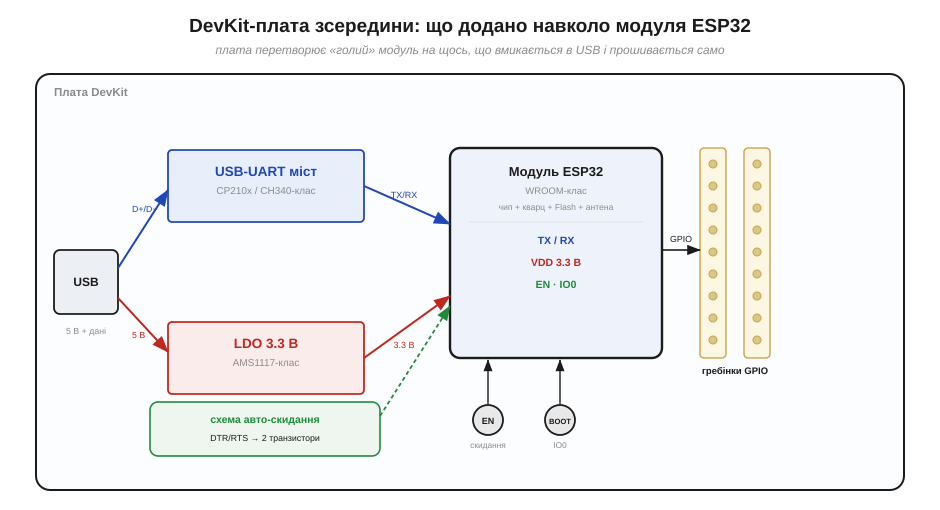
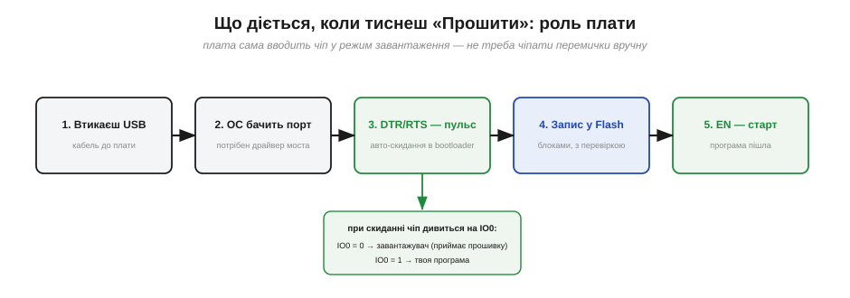

# 🔌 DevKit-плата ESP32 зсередини

> Є три рівні: **чіп → модуль → плата**. Чіп ESP32 — це кремній; модуль (WROOM-клас) додає до нього кварц, Flash і антену; а **плата розробника (*dev board*, DevKit)** обростає навколо модуля всім, що треба, аби пристрій просто вмикався в комп'ютер. Тут розбираємо саме плату — що на ній додано й навіщо.

## Що це за клас

Голий модуль ESP32 (WROOM-клас: чіп, кварц, Flash і антена на одній маленькій платі) сам по собі незручний: у нього виводи з кроком, який не встромиш у макетку, немає ні USB, ні стабілізатора живлення, ні кнопок. **DevKit-плата** — це *носій* (*carrier board*), що додає навколо модуля все потрібне, аби пристрій просто вмикався в комп'ютер і прошивався. Поширені сімейства — **DevKitC-клас** і дрібніший **DevKitM-клас**; усі вони влаштовані за однією схемою.

*Рис. Анатомія DevKit. Дані з USB ідуть через **USB-UART міст** на TX/RX модуля; живлення 5 В — через **LDO-стабілізатор** на 3.3 В. Кнопки **EN** (скидання) та **BOOT** (вибір завантаження) і схема **авто-скидання** дають прошивати без перемичок; усі вільні виводи модуля виведені на **гребінки GPIO**.*

## Чотири додані вузли

- **USB-UART міст** (*bridge*, **CP210x / CH340-клас**) — перекладач між USB комп'ютера й простим послідовним портом (UART), яким говорить модуль. Саме він робить так, що в системі з'являється COM-порт.
- [**LDO-стабілізатор**](book:pcb-board/ldo-regulator) (*low-dropout regulator*, **AMS1117-клас**) — знижує 5 В із USB до 3.3 В, якими живиться ESP32. Уся логіка плати — **3.3-вольтова**.
- **Кнопки EN і BOOT.** **EN** (*enable*) — апаратне скидання (притискає однойменний пін до землі). **BOOT** тримає **IO0** на нулі, щоб увійти в режим завантаження.
- **Схема авто-скидання** — пара транзисторів, кермована лініями **DTR/RTS** моста: вона сама смикає EN та IO0, тож прошивати можна, не торкаючись кнопок.

## Живлення й виводи

Живити плату можна трьома шляхами: від **USB** (звичний випадок), подавши **5 В на пін VIN/5V** (тоді працює бортовий LDO) або вже готові **3.3 В на пін 3V3** (в обхід LDO). Решта виводів модуля винесена на бічні **гребінки**: GPIO, шини (SPI/I2C/UART), входи ADC, а також GND. Не всі ніжки рівноцінні — частина зайнята Flash, частина лише для входу, а кілька (strapping-піни) керують завантаженням, тож на старті їх не можна довільно навантажувати. Головне, що варто пам'ятати про виводи: **рівні скрізь 3.3 В**, а не 5 В.

## «Перший байт»: як плата прошивається

Найкорисніше, що дає DevKit, — прошивка «з коробки» без ручних маніпуляцій. Утикаєш USB → система бачить послідовний порт (потрібен драйвер моста) → утиліта `esptool` коротким пульсом DTR/RTS вводить чіп у завантажувач → пише образ у Flash блоками з перевіркою → відпускає EN, і стартує вже твоя програма.

*Рис. Що робить плата, коли тиснеш «Прошити». Ключовий крок — авто-скидання: під час reset чіп дивиться на IO0 і обирає, кого слухати — завантажувач (IO0=0) чи власну програму (IO0=1).*

## Типові граблі

- **Brownout під час Wi-Fi.** Дешевий LDO AMS1117-класу плюс тонкий USB-кабель не тягнуть кидок струму, коли вмикається радіо, — напруга просідає, і плата перезавантажується (причина reset = [`BROWNOUT`](book:programming/reset-causes)). Лік: добрий кабель, живлення від міцного порту, конденсатор побільше.
- **Немає порту в системі** — найчастіше бракує драйвера моста (CP210x чи CH340 — різні драйвери).
- **Авто-скидання не спрацювало** — на деяких платах прошивку доводиться починати, **притримавши BOOT** і клацнувши EN вручну.
- **Кнопка EN = скидання**, яке прошивка побачить як [`POWERON`](book:programming/reset-causes) (чіп не відрізняє його від увімкнення живлення).

## Варіації класу

Плати різняться **модулем** (WROOM проти WROVER з додатковою PSRAM), **мостом** (CP210x проти CH340), **роз'ємом** (micro-USB проти USB-C) і розміром (DevKitC проти вузької DevKitM). Окремий випадок — плати на ESP32-**S2/S3**: у них чіп має **власний USB** на кристалі, тож з'являється другий USB-роз'єм, який прошиває **без жодного моста** — комп'ютер говорить із чипом напряму.
