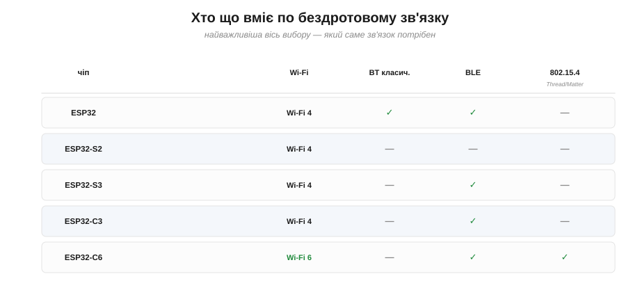

# Сімейство ESP32 (S2/S3/C3/C6): що обирати

Коли [вибір мікроконтролера](book:programming/esp32-vs-8bit) приводить до ESP32, на порозі купівлі новачка чекає несподіванка: «ESP32» сьогодні — **не один чіп**, а ціла родина варіантів із загадковими суфіксами S2, S3, C3, C6 і далі. Espressif, побачивши, наскільки різні задачі люди розв'язують її чипами, наробила під різні потреби окремих **різновидів** — дешевших, потужніших, із різним набором зв'язку. Вибір **усередині** родини — це та сама [мірка від задачі](book:programming/esp32-vs-8bit), лише на один щабель дрібніша: знову зважуємо, що важить задачі. Гарна новина: попри страшні назви, члени родини різняться лише **кількома** ясними осями, і розібратися в них — справа кількох хвилин.

І родина ця не випадкова. Espressif побачила, що її чипами розв'язують **геть різні** задачі — від копійчаного вимикача до камери з розпізнаванням — і зробила під кожен ринок свій варіант: один гранично дешевий, інший потужніший із прискоренням обчислень, третій заточений під новітні протоколи розумного дому. Тобто варіанти — це та сама мірка від задачі, лише втілена наперед самим виробником: він уже нарізав родину під типові потреби, а вам лишається тільки впізнати серед них **свою**.

### Не один чіп, а родина

Почнімо зі знайомства. Корінь родини — **оригінальний ESP32** (2016): два ядра Xtensa, Wi-Fi і Bluetooth (класичний та BLE). Від нього Espressif відгалузила різновиди, кожен зі своїм характером.

Назви спершу збивають із пантелику — S2, S3, C3, C6, ще й WROOM із WROVER на додачу, — але за цією абеткою ховається проста система: **літера** натякає на характер чипа (S — потужніший, на Xtensa; C — дешевший і новіший, на RISC-V), а **цифра** — на покоління всередині лінійки. Розгадавши цей шифр один раз, ви читатимете назви легко й без таблиці під рукою.


*Рис. Родина одним поглядом. Корінь — оригінальний **ESP32** (2× Xtensa, Wi-Fi+Bluetooth). Від нього — гілки: **S2** (один Xtensa, Wi-Fi+USB, без BT), **S3** (два Xtensa, +AI-прискорення, для камер і звуку), **C3** і **C6** на **відкритому ядрі RISC-V** (дешеві сучасні, причому C6 несе ще й Wi-Fi 6 і Thread). Колір розрізняє фірмове ядро Xtensa й відкрите RISC-V.*

### По яких осях вони різняться

Щоб не загубитися серед суфіксів, треба знати, **на що взагалі дивитися**. А осей, по яких члени родини відрізняються одна від одної, лише кілька:


*Рис. Дивитися треба лише на кілька речей: **архітектура ядра** (фірмове Xtensa чи відкрите RISC-V), **кількість ядер** (одне чи два), **покоління Wi-Fi** (4 чи 6), наявність і тип **Bluetooth**, наявність **вбудованого USB** і **особливі здатності** (AI-прискорення в S3, Thread/Matter у C6). Решта (пам'ять, ніжки) — другорядні відмінності.*

Розгляньмо два найважливіші з цих вододілів окремо — архітектуру ядра й набір зв'язку, бо саме вони найчастіше вирішують вибір.

### Великий зсув: від Xtensa до відкритого RISC-V

Перша глибока відмінність — у самому **ядрі**. Оригінальний ESP32 та серія S (S2, S3) збудовані на ядрі **Xtensa** — це фірмова, ліцензована архітектура. А новіша серія C (C3, C6) перейшла на **RISC-V** — **відкриту** архітектуру набору команд, яку може використовувати будь-хто без ліцензійних відрахувань.


*Рис. Дві «школи» ядер у родині. Ліворуч — **Xtensa** (ESP32, S2, S3): перевірене фірмове ядро, ліцензоване в стороннього розробника. Праворуч — **RISC-V** (C3, C6…): відкритий стандарт без ліцензійних відрахувань, що дає змогу робити чипи **дешевшими** й вільнішими. Новіші, ощадливіші члени родини йдуть саме цим, відкритим шляхом.*

> 🔧 **Навіщо це.** У повсякденній роботі вам **майже байдуже**, яке ядро всередині: і Arduino, і ESP-IDF ховають цю різницю, тож той самий код переважно збирається під обидва. Але знати про зсув корисно: серія C на RISC-V — це **дешевий сучасний** напрям родини, і саме звідти Espressif черпає найдоступніші чипи для простих задач. Коли побачите в назві «C» — думайте «недорогий, новий, RISC-V».

Чи варто цим перейматися на практиці? Майже ні — і це найкраща новина. Який саме набір команд у ядрі, ховають від вас і Arduino, і ESP-IDF: ви пишете звичний код, а інструментарій сам збирає його під потрібну архітектуру. Тому перехід Espressif на RISC-V — це переважно **внутрішня** зміна, що стосується вас хіба що ціною: чипи серії C виходять дешевшими й сучаснішими. Запам'ятати варто одне правило-підказку: суфікс **«C» у назві означає «дешевий, новий, на RISC-V»**, а серія **S** і оригінал — потужніше, на Xtensa.

> 📜 **Чому ціла галузь іде на RISC-V.** Зсув Espressif — частина великої міграції виробників від ліцензованих ядер до відкритої архітектури. Що таке «податок на ARM», чому копійки на чип вирішують на мільярдних тиражах і чим за свободу доводиться платити — в історичній вставці [Чому виробники МК мігрують на RISC-V](hist-riscv.md).

### Хто що вміє по зв'язку

Друга — і часто найважливіша на практиці — вісь це **набір бездротового зв'язку**. Тут члени родини помітно різняться, і саме це нерідко й вирішує вибір.

Власне, ця вісь часто й розрубує вузол одним махом. Потрібен **класичний** Bluetooth (скажімо, для бездротового аудіо старого зразка) — і коло миттєво звужується до **оригінального ESP32**, єдиного, хто його має. Потрібен **802.15.4** для Matter чи Zigbee — лишається тільки **C6**. Не треба Bluetooth узагалі, зате кортить USB і дешевизни — дивіться на **S2**. Тому, перш ніж порівнювати ядра й кілобайти, спитайте найперше: **який зв'язок вимагає задача?** — і половина варіантів часто відпадає сама собою.


*Рис. Зв'язок по членах родини. Оригінальний ESP32 — єдиний із **класичним** Bluetooth. Більшість новіших мають Wi-Fi 4 та BLE, а S2 — лише Wi-Fi (без BT зовсім). Особняком стоїть **C6**: він несе сучасніший **Wi-Fi 6** і додає **802.15.4** — основу для Thread, Zigbee й Matter, протоколів «розумного дому». Потрібен конкретний зв'язок — і вибір часто звужується до одного-двох чипів.*

### Хто на що заточений

Зведімо характери членів родини докупи — цю табличку зручно тримати під рукою при доборі:

| Чіп | Ядро | Зв'язок | USB | Чим вирізняється |
|---|---|---|---|---|
| **ESP32** (оригінал) | 2× Xtensa | Wi-Fi 4 + BT класичний + BLE | немає | універсал, **найбільше прикладів і підтримки** |
| **ESP32-S2** | 1× Xtensa | Wi-Fi 4 (без BT) | є | дешевий, вбудований USB, без Bluetooth |
| **ESP32-S3** | 2× Xtensa | Wi-Fi 4 + BLE | є | **AI-прискорення**, більше RAM — камери, звук, ML |
| **ESP32-C3** | 1× RISC-V | Wi-Fi 4 + BLE | є | **дешевий сучасний**, проста заміна базовому |
| **ESP32-C6** | 1× RISC-V | Wi-Fi 6 + BLE + 802.15.4 | є | **Thread/Zigbee/Matter** — розумний дім |

Коротко про кожного. **Оригінальний ESP32** лишається безпрограшним «робочим конем»: дешевий, з двома ядрами, єдиний із класичним Bluetooth і — найцінніше для новачка — з **горою готових прикладів** та найбільшою спільнотою (пряме відлуння того, як [ця платформа здобула популярність](book:programming/esp32-architecture)). **S2** — скромний і дешевий, з USB, але без Bluetooth. **S3** — «силач» родини: два ядра, спеціальні **AI-інструкції** й більше пам'яті, тож саме його беруть під камери, обробку звуку й легке машинне навчання. **C3** — дешевий сучасний мінімум (Wi-Fi + BLE на RISC-V), чудовий для простих під'єднаних дрібниць. **C6** дивиться в майбутнє розумного дому: Wi-Fi 6 і підтримка Thread/Zigbee/Matter.

А родина на цих п'ятьох не закінчується: є ще дешевший за C3 варіант для зовсім простих задач, чип лише з 802.15.4 (геть **без** Wi-Fi) для суто-Zigbee/Thread пристроїв, і навіть потужний застосунковий чип **без жодного радіо** — для важких обчислень, де зв'язок не потрібен. Усіх запам'ятовувати ні до чого; досить тримати в голові **кістяк** — оригінал, серію S (потужність) і серію C (дешевизна + новий зв'язок), — а екзотику дивитися за потреби.

### Що спільне для всієї родини

Перш ніж лякатися розмаїття, заспокоймося головним: **уся родина — це той самий ESP32 за духом**, і спільного в них куди більше, ніж відмінного. У кожного — та сама [анатомія мікроконтролера](book:programming/mcu-blocks) (ядро, пам'ять, периферія, регістри), той самий підхід [memory-mapped IO](book:programming/memory-mapped-io), ті самі [режими сну](book:programming/clock-power). А найважливіше для практика: усі вони програмуються **тим самим інструментарієм** — і Arduino, і ESP-IDF підтримують усю родину, тож ваш код переважно **переноситься** з чипа на чіп майже без змін.

Це знімає головний страх новачка перед вибором. Обрати «не той» варіант — рідко катастрофа: здебільшого досить **перезібрати** проєкт під інший чіп, а не переписувати його. Тобто ви вчите **мікроконтролер ESP32 загалом**, а конкретний суфікс — лише деталь, яку легко поміняти, коли задача проясниться. Тому й не варто впадати в параліч вибору на самому початку: візьміть розумне «за замовчуванням» і рушайте.

### Чіп, модуль, плата

І остання, дуже практична засторога — про різницю між [чіпом, модулем і платою](book:programming/esp32-architecture). Купуєте ви, як правило, **не голий чіп**, а **модуль** (з відомих імен — WROOM, WROVER, MINI) чи готову **плату** на його основі. А модуль додає до чипа свої важливі властивості: **скільки на ньому флеш-пам'яті**, чи є додаткова **PSRAM**, яка антена. Той самий чіп S3 у модулі з 2 МБ флеш і без PSRAM — і в модулі з 16 МБ флеш та 8 МБ PSRAM — це, по суті, **різні можливості** під вашу задачу.

Тому, обравши **чіп** (скажімо, S3 під камеру), не забудьте дочитати специфікацію до кінця й вибрати **модуль** із достатньою пам'яттю. Вибір усередині родини — це завжди два кроки: спершу чіп (за архітектурою й зв'язком), потім модуль на ньому (за пам'яттю й корпусом).

### Що обирати: короткий порадник

Зведімо все до простих відповідностей «потреба → чіп»:


*Рис. Швидкий порадник. **Найдешевший простий Wi-Fi+BLE** → C3. **Потужність, камера, звук, ML** → S3. **USB і Wi-Fi без Bluetooth, дешево** → S2. **Matter / Thread / Zigbee** → C6. **Загальне навчання й максимум прикладів** → оригінальний ESP32. У більшості випадків вибір очевидний, щойно ви чесно сформулюєте, що задачі справді потрібно.*

> 🔧 **Навіщо це.** Для **навчання** й більшості перших проєктів сміливо беріть **оригінальний ESP32** або **C3**: вони дешеві, добре підтримані, і на них є відповідь чи не на будь-яке питання. До спеціальних чипів (S3 під камеру, C6 під розумний дім) переходьте, коли задача **конкретно** того вимагає. Не женіться за найновішим суфіксом «про запас» — це той самий [перебір потужності](book:programming/esp32-vs-8bit), лише в межах родини.

Звідси й розумна стратегія новачка: **починай із типового, ускладнюй за потреби**. Зберіть і налагодьте задум на звичному ESP32 чи C3 — швидко, дешево, з горою прикладів напохваті, — і лише коли впретеся в **конкретну** стіну (забракне пам'яті під камеру, знадобиться Thread), переходьте на спеціальний чіп. Так ви не платите за можливості наперед і не вгадуєте потреб, яких ще навіть не маєте.

### Порахуймо: добір під проєкт

Застосуймо все на конкретних задачах — той самий метод [мірки від задачі](book:programming/esp32-vs-8bit), тільки тепер обираємо всередині родини.


*Рис. Три задачі — три відповіді. **Розумна розетка** масовим тиражем (простий Wi-Fi, кожен цент важить) → **C3**, найдешевший. **Камера з розпізнаванням** (потрібні RAM, два ядра, прискорення) → **S3**. **Давач для розумного дому** на Matter/Thread → **C6** з його 802.15.4. Кожен вибір диктує одна-дві ключові вимоги.*

```
ПРОЄКТ 1 — розумна розетка, масовий тираж
  вирішальне: проста справа + ціна × мільйони
  → ESP32-C3  (найдешевший сучасний Wi-Fi+BLE, RISC-V)

ПРОЄКТ 2 — камера з розпізнаванням на пристрої
  вирішальне: пам'ять, два ядра, прискорення обчислень
  → ESP32-S3  (AI-інструкції, більше RAM)

ПРОЄКТ 3 — давач для розумного дому (Matter/Thread)
  вирішальне: протокол 802.15.4
  → ESP32-C6  (єдиний із 802.15.4 + Wi-Fi 6)
```

Зверніть увагу: у кожному випадку вибір диктувала **одна-дві ключові вимоги**, а не «загальна крутість». Саме так і працює добір усередині родини — знаходиш ту вимогу, що звужує коло, і вона майже сама вказує на чіп. А якщо жодна вимога не звужує коло до одного чипа — це **гарна новина**, а не проблема: бери найдешевший і найкраще підтриманий з тих, що проходять (часто це оригінальний ESP32 або C3), і спокійно працюй. Адже [невикористаний «запас» оплачувати не варто](book:programming/esp32-vs-8bit), а зайвий клопіт із рідкісним чипом — то вже борг, який нічим не окупиться.

---
