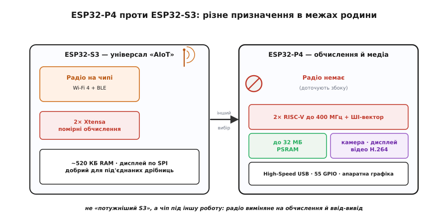
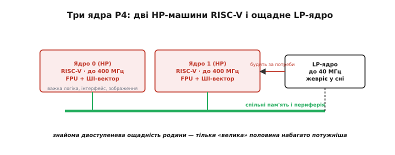
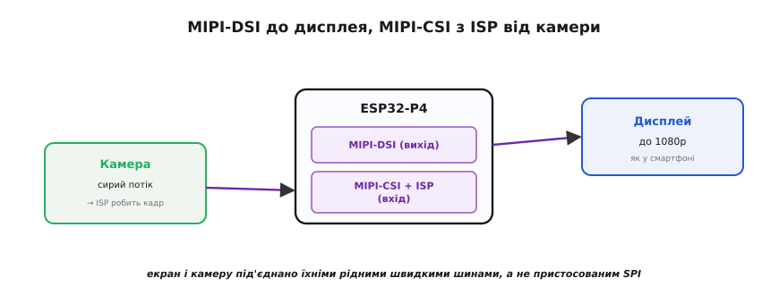
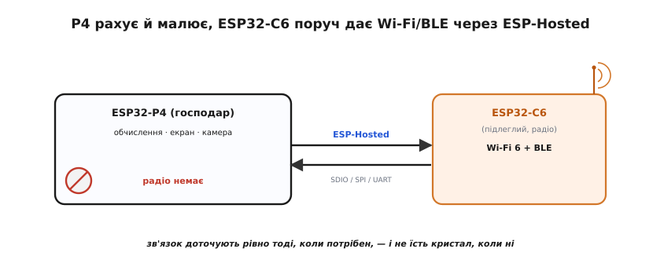
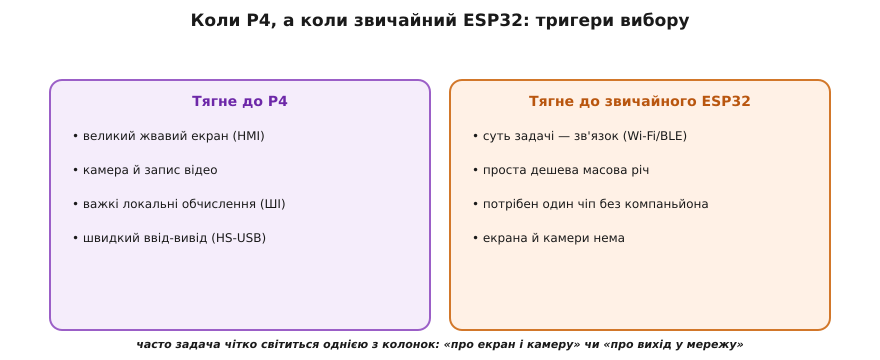

# ESP32-P4

У назві майже кожного [ESP32 з родини](root:embedded/esp32-family) ховається радіо — Wi-Fi, Bluetooth або те й те разом; саме [вбудоване радіо](topic:programming/esp32-architecture) колись і зробило ці чипи знаменитими. ESP32-P4 ламає це правило демонстративно: це **перший** мікроконтролер Espressif **без жодного бездротового зв'язку всередині**. На перший погляд — крок назад: навіщо ESP32, який не вміє того, заради чого ESP32 і беруть? Та варто спитати, **на що** виміняли радіо, і картина перевертається. Усю площу кристала, що в інших чипах їла антена з радіо-стеком, тут віддали обчисленням і вводу-виводу: швидкі ядра, гори пам'яті, інтерфейси камери й дисплея, апаратне відео. P4 — це ESP32, заточений не балакати, а **рахувати й малювати**.

### Інша спеціалізація: обчислювальний застосунковий чіп

Щоб зрозуміти P4, корисно поставити його поряд із [ESP32-S3](root:embedded/esp32-family) — донедавна найпотужнішим у родині. S3 — універсал «AIoT»: він і в мережу виходить сам, і легке машинне навчання тягне, і дисплеєм керує — але всього потроху, бо ділить кристал між радіо й обчисленнями. P4 робить інакший вибір: **викинути радіо** й на звільненому місці зробити решту по-справжньому потужною. Тому P4 — не «наступний, кращий S3», а чіп **іншого призначення**: застосунковий процесор (*application processor* — той, на якому крутиться важка прикладна логіка, а не лише дрібне керування), що бере на себе важкий інтерфейс, камеру й відео там, де S3 уже задихається.

Espressif прямо називає ніші P4: **HMI** (*human-machine interface* — людино-машинний інтерфейс, тобто пристрої з екраном і дотиком), камерні пристрої з обробкою зображення на місці й обчислення на краю мережі (*edge computing*) — ближче до давача, без відсилання сирих даних у хмару. Спільне в усіх трьох — потрібно багато **рахувати локально**, а зв'язок або вторинний, або його доточують окремо.


*Два різні призначення в межах родини. **S3** — універсал: ділить кристал між радіо (Wi-Fi + BLE) і помірними обчисленнями, добрий для під'єднаних дрібниць. **P4** робить протилежний вибір — **жодного радіо**, зате швидші ядра, у рази більше пам'яті, інтерфейси камери й дисплея та апаратне відео. Це не «потужніший S3», а чіп під іншу роботу: важкий інтерфейс і медіа замість зв'язку.*

> 🔧 **Навіщо це.** Перше, що варто засвоїти про P4: він **не заміняє** звичні ESP32, а доповнює їх з іншого боку. Якщо задача — давач, що раз на хвилину шле показання по Wi-Fi, P4 тут зайвий і незручний (радіо все одно доведеться чіпляти збоку). А от якщо задача — кольоровий сенсорний екран із плавним інтерфейсом або камера, що сама розпізнає об'єкт, — то саме тут P4 робить можливим те, що на S3 ледь повзе.

### Два швидкі ядра RISC-V плюс ощадне

Обчислювальне серце P4 — **двоядерний** процесор на [відкритій архітектурі RISC-V](root:embedded/esp32-family) (саме той напрям, куди Espressif перевела всю нову лінійку замість ліцензованого Xtensa). Обидва ядра — високопродуктивні (HP, *high-performance*) і беруть до **400 МГц**: помітно вище за 240 МГц класичного ESP32, та ще й з апаратною [одинарною плаваючою комою](topic:programming/floating-point) (FPU) і **векторними розширеннями під ШІ**, що пришвидшують типові обчислення нейромереж.

А поряд із двома «великими» ядрами сидить третє — крихітне **LP-ядро** (*low-power*, низькоспоживальне, до 40 МГц). Логіка та сама, що з [ULP-співпроцесором](topic:programming/esp32-architecture) у класичному ESP32: поки важка пара спить, дрібне ядро тихо стереже давачі майже задарма й будить «велику машину» лише за потреби. Тобто навіть обчислювальний монстр зберіг звичну для родини двоступеневу ощадність.


*Обчислювальна частина P4: два високопродуктивні ядра RISC-V (до 400 МГц, з FPU і векторними ШІ-розширеннями) — на них крутиться важка логіка, інтерфейс і обробка зображень. Окремо — крихітне LP-ядро (до 40 МГц), що жевріє, коли велика пара спить, і будить її лише за потреби. Знайома двоступенева схема родини, тільки «велика» половина набагато потужніша.*

### Багато швидкої пам'яті

Важкий інтерфейс і кадри з камери треба десь тримати — і тут P4 теж щедрий. На кристалі — **768 КБ** швидкої SRAM (проти ~520 КБ у класичного ESP32), а головне — підтримка **до 32 МБ зовнішньої PSRAM** і **до 128 МБ флеш**. Це вже не «кілобайти на буфер», а мегабайти, яких вистачає на повноекранні буфери кадрів і об'ємні моделі.

Цікава деталь у тому, як влаштована внутрішня пам'ять. Ті 768 КБ — це спільна пам'ять другого рівня (L2), і коли під'єднано зовнішню PSRAM, частина внутрішньої SRAM працює **кешем** до неї. Виходить знайомий за «великими» процесорами хід: повільнішу зовнішню пам'ять прикриває швидкий внутрішній [кеш](topic:programming/cache), і для коду це майже непомітно — як у класичному ESP32 [зовнішня флеш «бачиться» звичайною пам'яттю](topic:programming/esp32-architecture) крізь кеш, так тут крізь кеш пришвидшується доступ до зовнішньої PSRAM.

> 🔧 **Навіщо це.** Пам'ять — головний обмежувач графіки. Один повноколірний кадр 800×480 точок (типовий екран HMI) — це майже **0.75 МБ**, а для плавної анімації хочеться двох таких буферів ([подвійна буферизація](topic:programming/double-buffering)). На класичному ESP32 із його сотнями кілобайтів це просто не вміщується — доводиться малювати дрібними шматками й миритися з рваною картинкою. 32 МБ PSRAM у P4 знімають це обмеження: кадрові буфери, шрифти, картинки — усе тримається в пам'яті одночасно.

### Інтерфейси камери й дисплея просто в чипі

Ось де P4 видно «звідки родом» його ніша. Класичний ESP32 під дисплей чи камеру задіює загальні шини ([SPI](topic:programming/esp32-architecture), I2S) і впирається в їхню пропускну здатність: для маленького екрана годиться, для великого швидкого — ні. P4 несе **спеціалізовані швидкі інтерфейси** під саме ці задачі.

Перший — **MIPI-DSI** (*Display Serial Interface*, послідовний інтерфейс дисплея; MIPI — галузевий альянс, що його стандартизував): швидка послідовна шина саме під дисплеї, та сама, що живить екрани смартфонів. По ній P4 тягне екран аж **до 1080p**. Другий — **MIPI-CSI** (*Camera Serial Interface*, відповідний інтерфейс камери) зі вбудованим **ISP** (*image signal processor* — процесор обробки сигналу зображення, що перетворює сирий потік із матриці на придатний кадр: баланс білого, експозиція, зменшення шуму). Тобто до P4 камеру й екран під'єднують **їхніми рідними** швидкими шинами, а не пристосованими загальними, — звідси й здатність до повноцінного відео, а не дрібних кадриків.


*P4 під'єднує екран і камеру їхніми галузевими швидкими інтерфейсами. **MIPI-DSI** жене картинку на дисплей (до 1080p) — та сама шина, що в смартфонах. **MIPI-CSI** приймає потік із камери, а вбудований **ISP** одразу перетворює сирий сенсорний кадр на придатне зображення (баланс білого, експозиція, шумозаглушення). Там, де класичний ESP32 тулив дисплей на загальний SPI, P4 має рідні канали — звідси повноцінне відео.*

### Апаратна графіка й відео

Самих швидких інтерфейсів мало — кадри ще треба **обробляти**, і робити це програмно на ядрах надто дорого. Тому P4 несе апаратні прискорювачі, що знімають цю роботу з ядер.

Для інтерфейсу — **PPA** (*Pixel-Processing Accelerator*, прискорювач обробки пікселів) і **2D-DMA**: апаратно повертають, масштабують і віддзеркалюють зображення, перекидають прямокутні блоки пікселів без участі ядра. Це те, з чого складається [плавний GUI](topic:programming/double-buffering) — і робиться воно «залізом», поки ядра зайняті логікою. Для відео — апаратний **кодек H.264** (стиснення відео) із продуктивністю до 1080p@30 кадрів, плюс JPEG-кодек для окремих знімків. Стискати відео програмно на МК було б немислимо; апаратний кодек робить це майже задарма.

> 🔧 **Навіщо це.** Тут проходить чіткий вододіл «P4 чи S3». Намалювати плавний інтерфейс або стиснути відеопотік **без** апаратної графіки означає завантажити цим самі ядра — і їх не лишиться на корисну роботу, а картинка все одно смикатиметься. PPA, 2D-DMA й кодек H.264 виконують це паралельно й на порядок швидше. Тому пристрій із великим жвавим екраном або камерою, що пише відео, — це **тригер на P4**; S3 тут упирається в стелю.

### Багатий ввід-вивід для складних пристроїв

Поза графікою P4 — найщедріший у родині й на звичайну периферію. Ніжок аж **55** (рекорд серед ESP32), і серед інтерфейсів — повний джентльменський набір складного пристрою.

Найважливіший — **High-Speed USB 2.0** (швидкісний, до 480 Мбіт/с). Це інша ліга порівняно зі звичайним [USB в ESP32](topic:programming/esp32-usb): класичні чипи несуть лише Full-Speed (12 Мбіт/с), якого досить для клавіатури чи [послідовного порту](topic:programming/esp32-usb/detail), але мало для камери чи швидкого накопичувача. На P4 USB нарешті тягне справді об'ємний потік даних, а класи пристрою (флешка, мережева карта, звук) на ньому піднімає той самий [стек TinyUSB](topic:programming/tinyusb-device). Поряд — **SDIO Host 3.0** (швидка шина до карт пам'яті й, що важливо, до зовнішніх модулів), **Ethernet** (дротова мережа), а також усе звичне: SPI, I2C, I2S, UART, [ШІМ](topic:programming/pwm-on-mcu), АЦП, контролер CAN (TWAI) та апаратна криптографія із захищеним завантаженням.

### Зв'язку немає в чипі — його доточують збоку

Лишається головне питання: якщо радіо в P4 немає, а в мережу пристроєві таки треба, — що робити? Відповідь Espressif: **поставити поряд маленький ESP32 із родини C/S** як радіо-компаньйона. P4 бере на себе обчислення й інтерфейс, а дешевий [ESP32-C6](root:embedded/esp32-family) поруч — увесь Wi-Fi і Bluetooth; з'єднують їх швидкою шиною (SDIO, SPI чи UART).

Працює це через [**ESP-Hosted**](topic:programming/esp-hosted) — готову технологію, де один чіп (господар, *host*) користується радіо іншого (підлеглого, *slave*) так, ніби воно своє. P4 каже компаньйонові «під'єднайся до цієї мережі, надішли цей пакет», а той виконує й повертає відповідь. Для коду на P4 це виглядає майже як звичайний мережевий стек — радіо просто фізично живе в сусідньому чипі.


*Зв'язок у P4 — зовнішній. Потужний P4 веде обчислення, екран і камеру, але радіо не має. Поряд ставлять дешевий ESP32-C6 (Wi-Fi 6 + BLE) як радіо-компаньйона; з'єднує їх швидка шина (SDIO/SPI/UART). Технологія ESP-Hosted робить так, що P4 (господар) користується радіо C6 (підлеглого), наче власним. Зв'язок доточується рівно тоді, коли потрібен, — і не їсть кристал, коли ні.*

> 🔧 **Навіщо це.** Така схема пояснює всю філософію P4. Розробник [платить лише за те, що потрібно](root:embedded/esp32-vs-8bit): треба зв'язок — додав копійчаний C6; не треба — заощадив і місце, і гроші, і [клопіт із сертифікацією радіо](root:embedded/esp32-vs-8bit). На офіційній платі-девкіті ESP32-P4-Function-EV-Board саме так і зроблено: поряд із P4 стоїть модуль ESP32-C6, уже прошитий під ESP-Hosted, тож Wi-Fi працює «з коробки». Розв'язавши обчислення й радіо на два чипи, Espressif дала кожному робити своє якнайкраще.

### Коли P4, а коли звичайний ESP32

Зведімо чуття вибору. P4 — вузький спеціаліст, і брати його «бо потужніший» — та сама [помилка перебору](root:embedded/esp32-vs-8bit), що й тягти ESP32 туди, де досить [8-бітного МК](root:embedded/esp32-vs-8bit). Питання не «котрий сильніший», а «що важить задачі».

**P4 виправданий**, коли на перший план виходять інтерфейс і медіа:
- великий **жвавий екран** із плавним інтерфейсом (HMI), якому треба буфери кадрів і апаратна графіка;
- **камера** з обробкою зображення чи запис відео на місці;
- важкі **локальні обчислення** (зокрема ШІ на краю), де радіо вторинне;
- потрібен справді **швидкий ввід-вивід** — High-Speed USB, об'ємні дані.

**Звичайний ESP32 (S3/C3/C6) кращий**, коли суть задачі — **зв'язок**, а не обчислення:
- під'єднаний давач чи вимикач, що головно **спілкується** по Wi-Fi/BLE, — радіо в чипі тут безцінне, а графіки й камери нема;
- проста, дешева, масова річ, де P4 — дороге надмірне залізо;
- потрібен єдиний самодостатній чіп **без** зовнішнього радіо-компаньйона й зайвої плати.


*Дві колонки тригерів. Ліворуч — ознаки P4: великий жвавий екран, камера й відео, важкі локальні обчислення, швидкий ввід-вивід. Праворуч — ознаки звичайного ESP32: суть задачі в зв'язку по Wi-Fi/BLE, проста масова дешева річ, потрібен один чіп без зовнішнього радіо. Часто задача чітко світиться однією з колонок: «це про екран і камеру» або «це про вихід у мережу».*

**Приклад (та сама «розумна панель» у двох контекстах).** Порівняймо, як одне формулювання дає різні відповіді залежно від того, що важить.

```
СЦЕНАРІЙ A — кімнатна панель керування: 7" сенсорний екран,
             плавний інтерфейс, перегляд відео з домофону
  вирішальне: великий жвавий екран + відеопотік
  S3:   ✗  пам'яті на буфери бракує, графіку тягнуть ядра — смикається
  P4:   ✓  MIPI-DSI + PSRAM під буфери + кодек H.264 + PPA
  Wi-Fi треба → доточуємо ESP32-C6 компаньйоном (ESP-Hosted)
  → ВИСНОВОК: P4 (інтерфейс і відео — його стихія)

СЦЕНАРІЙ B — датчик температури з маленьким OLED,
             раз на хвилину шле показання у хмару
  вирішальне: Wi-Fi у мережу; екран дрібний, відео нема
  P4:   ✗  радіо нема — довелося б чіпляти C6, зайва плата й гроші
  S3:   ✓  Wi-Fi у чипі, дрібний дисплей по SPI тягне легко
  → ВИСНОВОК: звичайний ESP32 (тут уся суть — зв'язок)
```

Та сама на вигляд «панель» — і дві протилежні правильні відповіді. У сценарії A важить **картинка**, і P4 робить можливим те, що S3 ледь повзе; у сценарії B важить **зв'язок**, і відсутність радіо в P4 обертає його на незручний тягар. Тому й P4 — не «вершина родини, яку беруть, коли можуть собі дозволити», а **інструмент під конкретний клас задач**: екран, камера, важкі обчислення. Як завжди в доборі, [мірку знімають із задачі, а не з чипа](root:embedded/esp32-vs-8bit) — а P4 просто додав до родини ще одну, доти відсутню, мірку: чистий обчислювальний застосунковий чіп без радіо на борту.

---
