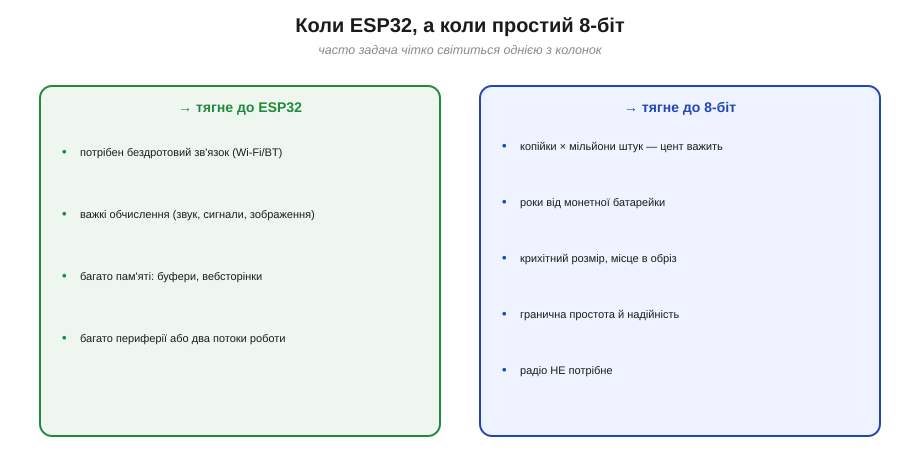

# ESP32 проти простого 8-біт МК (коли більша потужність важлива)

Якщо дивитися лише на [архітектуру ESP32](book:programming/esp32-architecture), він може здатися очевидним вибором на будь-що: стільки сили, радіо на борту, та ще й копійки. Спокуса завжди брати найпотужніше — велика й оманлива. Зрілий інженер питає не «що найкрутіше?», а «що **потрібно саме цій задачі**?» — і дуже часто правильною відповіддю виявляється скромний **8-бітний мікроконтролер**, дешевший, простіший, ощадніший і надійніший за ESP32. Ця тема — про **інженерне чуття вибору**: коли потужність ESP32 справді потрібна, а коли вона лише зайвий тягар.

### Інший кінець шкали: простий 8-біт МК

Уявімо шкалу «обчислювальної ваги», на якій усі [мікроконтролери](book:programming/microcontroller) шикуються від найскромніших до найпотужніших. ESP32 сидить на її потужному краю. А на **протилежному** — класичний **8-бітний МК** (родини на кшталт **AVR**, **PIC**, **8051**; саме AVR стоїть у класичних платах Arduino). Це той самий мікроконтролер за [внутрішньою анатомією](book:programming/mcu-blocks) — ядро, пам'ять, периферія, — лише **навмисне скромний**: 8-бітне ядро на 8–20 МГц, кілька кілобайтів флеш, сотні байтів — кілька кілобайтів SRAM, **жодного радіо**, проста периферія. Зате — копійки за штуку, мізерне споживання, крихітний корпус (інколи 6–8 ніжок) і **гранична простота**.

І не варто думати, що це «застарілий» клас, який ось-ось витіснять потужні SoC. Навпаки: прості 8-бітні МК — **мовчазні робочі конячки** всієї електроніки, їх випускають **мільярдами** штук на рік. Вони сидять у пультах, зарядках, іграшках, побутовій техніці, автомобільних дрібницях — усюди, де треба надійно й дешево робити невелику справу. Гучні новинки потрапляють у заголовки, а ці скромники тихо керують половиною речей навколо вас. Тож питання не в тому, котрий чіп «новіший», а в тому, котрий **пасує задачі**.

> 📜 **Архетип цього класу — Intel 8051.** Архітектура 1980 року, яку досі тиражують десятками мільярдів і ховають усередині Bluetooth- та USB-чипів. Її історія — найдовший доказ тези цього розділу, що «потужніший» ≠ «кращий»: [Intel 8051 — архітектура, яка досі всюди](hist-8051.md).


*Рис. Обидва — мікроконтролери (та сама внутрішня анатомія), але на **протилежних кінцях** шкали. Ліворуч — простий 8-біт: одне 8-бітне ядро, кілобайти пам'яті, без радіо, копійки, мікровати. Праворуч — ESP32: два 32-бітні ядра, сотні КБ, радіо, багата периферія. «Потужніший» — не означає «кращий»; означає лише «правіше на шкалі».*

### По яких осях вони різняться

Щоб вибирати свідомо, треба знати, **де саме** проходить різниця. А вона — по багатьох осях одразу, і не всі вони на користь потужнішого:

| Вісь | Простий 8-біт МК | ESP32 |
|---|---|---|
| Ядро | 8-біт, 8–20 МГц | 2× 32-біт, до 240 МГц |
| Пам'ять | сотні Б – кілька КБ RAM | ~520 КБ RAM, мегабайти флеш |
| Радіо | немає | Wi-Fi + Bluetooth |
| Периферія | скромна | дуже багата |
| Ціна (орієнтовно) | копійки ($0.3–1) | кілька доларів за модуль |
| Споживання уві сні | одиниці мкА | трохи більше (складніший) |
| Складність, надійність | гранично проста, передбачувана | складний SoC (RTOS, радіо-стек) |
| Корпус, розмір | крихітний (6–8 ніжок) | модуль помітно більший |


*Рис. Порівняння по осях. По обчисленнях, пам'яті, радіо й периферії ESP32 переважає в рази й порядки. Але зверніть увагу на **нижні** осі — ціна, простота, розмір, а почасти й ощадність: тут уже **8-біт попереду**. Тому вибір — не «хто сильніший», а «що важить саме в цій задачі».*

Найважливіше тут — сам **перехрест**: жоден чіп не виграє по **всіх** осях. ESP32 платить за свою силу ціною, складністю, розміром і апетитом; 8-біт платить за дешевизну й простоту браком потужності та зв'язку. Тому й немає «загалом кращого» — є лише кращий **під конкретний набір вимог**. Уся майстерність вибору зводиться до того, щоб чесно визначити, які осі важать **саме у вашій** задачі, а на які можна заплющити очі.

> 🧮 **Обережно з рядком «МГц».** У таблиці частоти стоять поряд, та порівнювати ядра за самими мегагерцами — пастка: ядро може робити більше або менше за такт. Як міряти продуктивність чесно (DMIPS/МГц, бенчмарки, замір власного коду) — у вставці [Мегагерци проти DMIPS](math-benchmarks.md).

### Коли ESP32 виправданий, а коли кращий 8-біт

Звідси й два списки — коли яка чаша терезів переважує.

**ESP32 справді потрібен**, коли задача вимагає його сили:
- потрібен **бездротовий зв'язок** (Wi-Fi чи Bluetooth) — це його коронна риса, і 8-біт тут просто безсилий;
- **важкі обчислення**: обробка звуку, сигналів, зображень, легке машинне навчання, керування дисплеєм;
- треба **багато пам'яті**: буфери, вебсторінки, великі таблиці;
- багато **периферії** або **два потоки** роботи водночас (наприклад, зв'язок + логіка).

**Простий 8-біт кращий**, коли задача скромна й затиснута:
- **гранична дешевизна на масштабі**: коли виробів **мільйони**, кожен цент на чипі — це купа грошей;
- **роки від батарейки**: простий чіп уві сні споживає менше й має менше що живити;
- **крихітний розмір** і місце на платі в обріз;
- потрібні **максимальна простота й надійність**, миттєвий старт, передбачуваність — і **нема** потреби в радіо.

Помітьте логіку обох списків: вони описують не «гарне» й «погане», а **відповідність вимогам**. Ліва колонка — це задачі, що **впираються** в стелю простого чипа (йому бракне сили, пам'яті чи радіо); права — задачі, де сила ESP32 **не потрібна**, зате на перший план виходять ціна, простота й автономність. Зрілий добір — це не «взяти найкраще», а **зняти мірку** з задачі й підібрати чіп точно по ній, без надлишку й без нестачі.


*Рис. Дві колонки тригерів. Ліворуч — ознаки, що **тягнуть до ESP32** (зв'язок, важкі обчислення, багато пам'яті/периферії). Праворуч — ознаки, що **тягнуть до 8-біт** (копійки × мільйони, роки від батарейки, гранична простота, радіо не треба). Часто задача чітко світиться однією з колонок.*

> 🔧 **Навіщо це.** Народна мудрість інженерії: **не пали з гармати по горобцях**. Поставити могутній ESP32 туди, де треба лише блимнути світлодіодом за таймером, — це як возити пошту літаком: дорожче, складніше й, як не дивно, ненадійніше. Уміння **не** взяти найпотужніше — така сама ознака майстерності, як і вміння взяти його, коли воно справді потрібне.

### Контрінтуїтивне: потужніший чіп може бути гіршим

Тут варто зруйнувати інтуїцію новачка «більше — завжди краще». Узяти ESP32 на тривіальну задачу — це не «із запасом», а часто **програш** за кількома статтями одразу. Він **більше споживає** (зайва батарея чи коротше життя), **дорожчий** (на масштабі — суттєво), **складніший** (повноцінна операційна система й радіо-стек усередині — більше того, що може піти не так), **повільніше стартує** й узагалі дає більше «поверхні» для збоїв. Простий 8-біт, навпаки, стартує миттєво, поводиться передбачувано до такту й рідко чимось дивує. Для багатьох задач саме **простота — це і є якість**, а не компроміс.

Простий приклад: автоматичний нічник, що вмикає світло в темряві. Усе, що йому треба, — зчитати фотодавач і смикнути ключ; це робота для копійчаного 8-біт, що спить майже весь час і прокидається на мить. Поставити сюди ESP32 — означає додати вартість, складнішу прошивку, гірший сон і цілий радіо-вузол, яким нічник ніколи не скористається. «Запас потужності» тут обертається суцільними мінусами, не давши **жодного** плюса, — ось вам і «гірше від потужнішого» в чистому вигляді.

### Прихована ціна потужності: складність і дозволи

Є й менш очевидні витрати «крутого» чипа, про які новачок не здогадується, доки не вколеться. Перша — **складність розробки**. ESP32 несе всередині повноцінну операційну систему й радіо-стек; це означає більше шарів, більше налаштувань, більше місць, де щось іде не так, і важче відлагодження. Простий 8-біт ви тримаєте «у голові» цілком — кожен такт передбачуваний; великий SoC такої прозорості не дає.

Друга, геть невидима новачкам, — **радіо тягне за собою дозволи**. Щойно у виробі є передавач, на нього лягають вимоги регуляторів (на кшталт FCC чи CE), випробування, погодження антени — час і гроші, яких пристрій **без** радіо просто не знає. Тому навіть там, де ESP32 «потягнув би», виробники масової немережевої речі часто свідомо лишаються на простому МК — щоб **не відчиняти** цю скриньку складності й сертифікації. Потужність, яка не потрібна, — це не запас, а **борг**, який доведеться обслуговувати.

> 🔧 **Навіщо це.** Оцінюючи чіп, рахуйте не лише його ціну й швидкість, а й **повну вартість володіння**: час на освоєння й відлагодження, складність прошивки, дозволи на радіо, ризик нових збоїв. Часто простий 8-біт виграє саме тут — не на папері специфікації, а в реальних тижнях розробки й спокої експлуатації. «Дешевший і простіший» нерідко означає ще й «швидше випущений і менше клопоту потім».

### Як вирішувати: коротке дерево рішень

На практиці вибір зводиться до кількох питань, поставлених по черзі. Порядок не випадковий: спершу відсіюємо **категоричні** вимоги — радіо чи важкі обчислення, яких простий чіп не подужає в принципі, — і лише коли вони відпали, зважуємо **економічні**: ціну, сон, простоту, де зазвичай виграє скромний МК. А якщо жодне питання не дало твердого «так» убік потужності — беріть простіше: невикористану силу ви оплатите грошима, струмом і складністю, а невикористана простота не коштує **нічого**.


*Рис. Просте дерево рішень. Спитайте по черзі: чи треба **бездротовий зв'язок**? чи **важкі обчислення / багато пам'яті**? Якщо хоч на одне «так» — це по ESP32. Якщо на всі «ні», а натомість важать **ціна × масштаб**, **роки від батарейки** чи **гранична простота** — беріть **простий 8-біт**. Сумнівів немає лише там, де потрібне радіо: 8-біт його не має зовсім.*

### Чому копійки й мікроампери вирішують на масштабі

Двом аргументам на користь 8-біт — **ціні** та **ощадності** — варто дати числа, бо саме вони часто переважують усю «крутість» ESP32, коли виробів багато.

Спрацьовує проста, але немилосердна арифметика **масштабу**. На одному пристрої зайвий долар-два на чипі — дрібниця, її й не помітиш. Та коли виробів **мільйон**, ця дрібниця стає **мільйонами** — статтею, заради якої інженери б'ються за кожен цент специфікації. Те саме з енергією: зайвий мікроампер на одному автономному давачі непомітний, а на тисячах таких давачів у полі він обертається на купи передчасно розряджених батарейок і виїздів на заміну. Тому те, що в одиничному аматорському проєкті — «байдуже», у серійному виробі стає **головним** аргументом. Великий тираж та автономність — це саме той контекст, де простий, дешевий і ощадний 8-біт упевнено бере гору, щойно радіо й сила ESP32 виявляються зайвими.


*Рис. Дві осі, де переважує простий чіп. **Ціна × масштаб:** різниця у пару доларів на штуці, помножена на мільйон виробів, — це мільйони доларів. **Споживання:** простіший чіп уві сні бере менше й має менше що живити, тож від тієї самої батарейки тягне відчутно довше. Коли радіо не потрібне, ці дві осі часто й вирішують справу.*

**Приклад (два сценарії — і протилежні відповіді).** Порівняймо ту саму «розумну річ» у двох контекстах.

```
СЦЕНАРІЙ A — метеостанція, що сама шле погоду в інтернет
  вимога: Wi-Fi (бездротовий зв'язок у мережу)
  8-біт:  ✗  радіо немає взагалі — задача неможлива
  ESP32:  ✓  Wi-Fi на борту — єдиний розумний вибір
  → ВИСНОВОК: ESP32 (тут потужність справді потрібна)

СЦЕНАРІЙ B — реєстратор температури на монетній батарейці,
             1 000 000 штук, має жити 2 роки, без зв'язку
  ціна:   8-біт ~$0.40   проти   ESP32-модуль ~$2.50
  на 1 млн штук: різниця = (2.50 − 0.40) × 1 000 000 = $2 100 000
  сон:    8-біт ~3 мкА (живити майже нічого)
          ESP32 більше + зайвий радіо-вузол, якого не треба
  → ВИСНОВОК: простий 8-біт (дешевше на $2 млн і довше живе)
```

Та сама на вигляд річ — і дві протилежні правильні відповіді. У сценарії A потужність ESP32 **необхідна** (без радіо ніяк), у сценарії B вона — **тягар**, що коштує мільйони зайвих доларів і зайвий струм. Ось чому питання «ESP32 чи 8-біт?» не має універсальної відповіді: вона завжди криється не в чипі, а в **задачі**.

Звідси й практичний рецепт: добір чипа починають **не** з каталогу ефектних чипів, а зі списку **вимог задачі** — що вона мусить уміти, скільки коштувати, як довго жити від батареї, чи виходити в мережу, в якому корпусі вміститися. Лише склавши таку мірку, прикладають до неї кандидатів і дивляться, хто проходить. Хто робить навпаки — спершу закохується в гарний чіп, а тоді підганяє під нього задачу — раз у раз або переплачує потужністю там, де її ніхто не просив, або впирається в стелю там, де поскупився. **Мірку знімають із задачі, а не з чипа.**


*Рис. Той самий клас пристрою, два контексти. **A — потрібен Wi-Fi:** 8-біт безсилий, ESP32 — єдиний вибір. **B — копійчаний автономний логер мільйонним тиражем:** ESP32 коштував би на $2 млн дорожче й жив би менше, тож переможець — простий 8-біт. Правильний чіп визначає задача, а не амбіція.*

Підсумуймо чуття, яке варто винести: ESP32 — чудовий, але **не універсальний** молоток. Беріть його, коли потрібні його зв'язок, сила чи пам'ять; беріть скромний 8-біт, коли важать ціна, простота й роки від батарейки. І ще одне, що приходить лише з досвідом: страх «а раптом не вистачить потужності?» лякає сильніше, ніж заслуговує, бо **недобір** видно одразу й він легко лікується, а **перебір** тихо коштує грошей, струму й складності всю дорогу — і його ніхто не помічає. Тому свідомо обрати **менше**, ніж здається безпечним, — частіше правильно, ніж навпаки. А якщо ESP32 таки ваш вибір — лишається ще одне питання: ESP32 нині не один, а ціла [**родина** (S2, S3, C3, C6…)](book:programming/esp32-family), і всередині неї теж треба вибирати з розумом.

---
