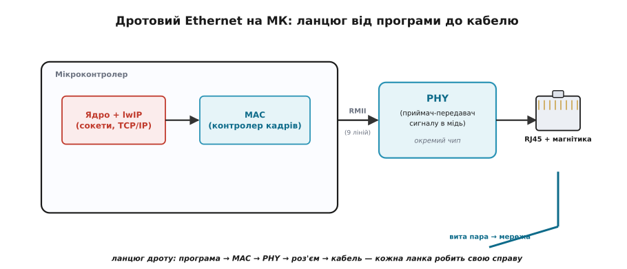
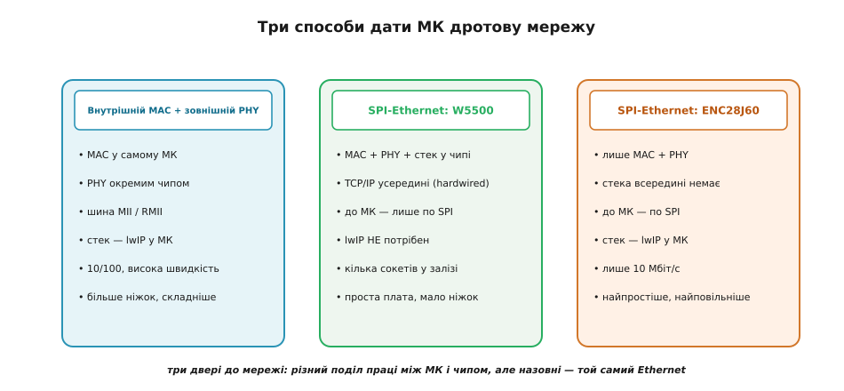
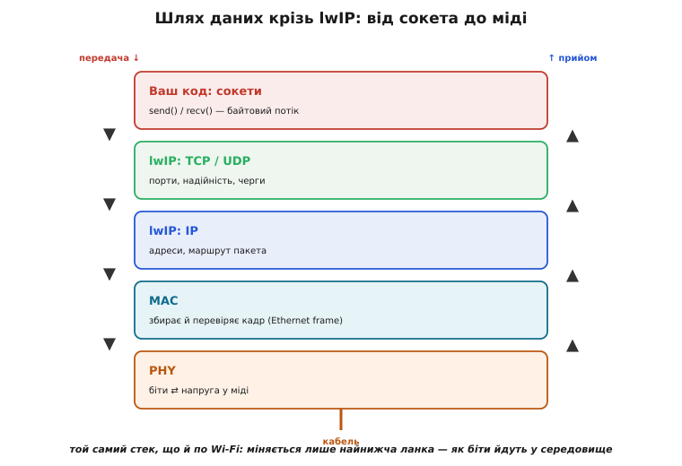
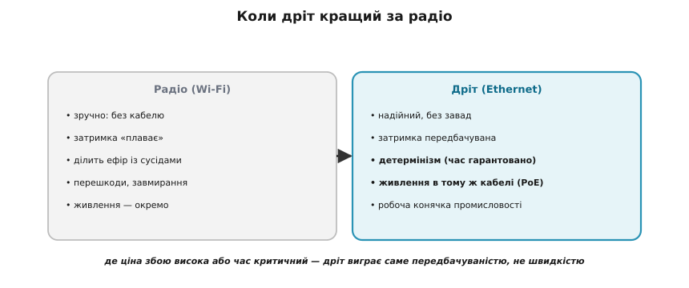
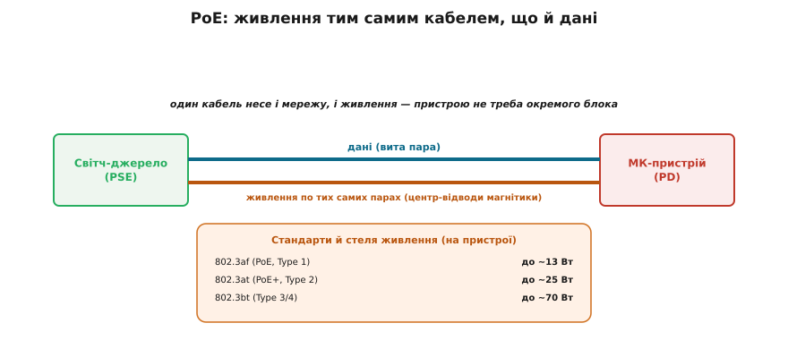

# Ethernet на МК

Коли кажуть «під'єднати пристрій до мережі», думка одразу біжить до радіо — Wi-Fi, бо це модно й без дротів. Та поряд тихо й надійно живе старша технологія: **Ethernet** (від англ. *ether*, «ефір» — світоносне середовище зі старої фізики, через яке нібито йшло світло; назву жартома взяли для «середовища, яким біжать дані»). Це той самий дріт із прямокутним роз'ємом, що йде до роутера від комп'ютера. І мікроконтролер теж уміє говорити цим дротом — часто навіть тоді, коли радіо було б гіршим вибором. Розберімо, **що** треба покласти в пристрій, щоб у нього з'явилося гніздо мережі, і **чому** дріт інколи б'є радіо вщент.

Головна теза проста: для вашої програми мережа по дроту виглядає **точно так само**, як по Wi-Fi. Ті самі [сокети TCP/UDP](topic:programming/sockets-tcp-udp), той самий стек протоколів. Уся різниця ховається на самому дні — у тому, **як біти потрапляють у фізичне середовище**: у радіо це антена й хвиля, у дроті це мідь і напруга. Усе, що вище, не помічає підміни.

## Дві мікросхеми, яких бракує: MAC і PHY

Голий мікроконтролер сам по собі не має звідки взяти мережевий роз'єм. Щоб дріт запрацював, потрібні дві різні за роллю речі, і їх корисно розрізняти від початку.

Перша — **MAC** (*Media Access Controller*, «керувальник доступу до середовища»). Це **цифровий** вузол: він збирає вихідні дані у **кадри** (англ. *frame* — стандартний пакет Ethernet із адресами відправника й отримувача та контрольною сумою), стежить за чергою, перевіряє цілість того, що прийшло, відкидає чужі або биті кадри. MAC мислить байтами й бітами — це його стихія, і саме тому він **часто вже вбудований у сам МК**: для цифрової логіки місце на кристалі знайти легко.

Друга — **PHY** (скорочення від англ. *physical layer*, «фізичний шар»). Це вже **аналоговий** приймач-передавач: він бере біти від MAC і перетворює їх на власне **електричні сигнали у мідному кабелі** — потрібної форми, напруги, з потрібною синхронізацією, — а у зворотний бік ловить кволий сигнал із дроту й відновлює з нього чисті біти. Така тонка аналогова робота на кристалі цифрового МК виходить погано, тож PHY майже завжди **окрема мікросхема** поряд.

Поділ праці чіткий: **MAC — це «що сказати», PHY — це «як це прокричати в дріт»**. Між ними проста цифрова шина, якою біти кадру перебігають туди-сюди.


*Ланцюг дроту зліва направо: програма зі стеком готує дані → MAC пакує їх у кадри → по шині RMII віддає зовнішньому PHY → той жене сигнал у роз'єм RJ45 і вита пара несе його в мережу. Кожна ланка робить рівно одну справу, і всі вони змінні незалежно.*

> 🔧 **Навіщо це.** Розрізняти MAC і PHY треба вже на етапі вибору чипа й розведення плати. Якщо у вашому МК **є** вбудований MAC — ви докуповуєте лише дешевий PHY і ставите роз'єм. Якщо MAC у чипі **немає** — або берете інший МК, або кладете готовий «усе в одному» модуль, що під'єднується по простій шині. Тобто перше питання до даташита МК завжди: «а MAC тут є?».

## Як з'єднати MAC і PHY: MII, RMII чи просто SPI

Коли MAC сидить у самому МК, до зовнішнього PHY його тягнуть спеціальною шиною. Історично це **MII** (*Media Independent Interface*, «незалежний від середовища інтерфейс» — бо MAC спілкується з PHY однаково, байдуже, мідь там чи оптика на іншому боці PHY). MII чесна, але **прожерлива на ніжки**: близько 18 ліній лише на дані. Для МК, де кожна ніжка на рахунку, це багато.

Тому майже всюди використовують **RMII** (*Reduced MII*, «скорочений MII»): та сама ідея, але ліній лише дев'ять — удвічі менше. Платою за економію стає **спільний тактовий сигнал 50 МГц**, який треба підвести до обох боків і добре розвести по платі; інакше синхронізація розсиплеться. На ESP32, наприклад, доступний саме RMII, а не повний MII.

Та є й геть інший шлях, дуже популярний серед аматорів і там, де ніжок обмаль: **SPI-Ethernet**. Це окрема мікросхема, що несе в собі **і MAC, і PHY одразу**, а до МК під'єднується звичайною шиною [SPI](topic:communications/spi-bus) — усього кілька проводів. Жодних 50 МГц і складного розведення: чотири лінії SPI, і мережа готова. За цю простоту платиш швидкістю — SPI вужча за RMII, — але для давача, що раз на секунду шле показання, це не має значення.

> 🔧 **Навіщо це.** Вибір зводиться до торгу «ніжки й складність плати ↔ швидкість». Береш МК із вбудованим MAC і зовнішнім PHY по RMII, якщо потрібна повна швидкість 100 Мбіт/с і не шкода ніжок та зусиль на розведення. Береш SPI-Ethernet, якщо ніжок мало, плата має бути простою, а потоку небагато. Для більшості «розумних речей» SPI-варіант — найкоротший шлях до дроту.

### Дві популярні SPI-мікросхеми — і важлива різниця між ними

Серед SPI-Ethernet чипів два імені трапляються найчастіше, і вони **не однакові за суттю**, хоч обидва чіпляються по SPI.

**ENC28J60** — це чесний MAC+PHY і **більше нічого**. Стека протоколів усередині немає: усю роботу з [IP, TCP та UDP](topic:programming/sockets-tcp-udp) виконує **програмний стек на самому МК**. Чип лише жене кадри в дріт і з дроту. Він простий і дешевий, але обмежений швидкістю **10 Мбіт/с** і має давню славу вередливого в тонких місцях.

**W5500** влаштований інакше: крім MAC і PHY, у нього **вшитий апаратно цілий стек TCP/IP**. Тобто чип сам розуміє з'єднання, сам тримає кілька сокетів, сам рахує контрольні суми. МК не запускає програмний стек узагалі — він просто пише в регістри чипа «надішли ці байти на таку адресу» й читає, що прийшло. Це знімає з МК і навантаження, і пам'ять, і дає стабільні ~90 Мбіт/с. Ціна — інша модель роботи: ти говориш не зі стеком у себе, а з чужим стеком у чипі.


*Три двері до мережі поряд. Ліворуч: внутрішній MAC + зовнішній PHY по RMII — швидко, але ніжок і клопоту більше, стек (lwIP) живе в МК. Посередині: W5500 — MAC, PHY і весь TCP/IP у чипі, до МК лише SPI, програмний стек не потрібен. Праворуч: ENC28J60 — лише MAC+PHY по SPI, 10 Мбіт/с, стек знову в МК. Назовні в усіх трьох — той самий Ethernet.*

Звідси й тонкість, яку легко проґавити: фраза «той самий стек, що й по Wi-Fi» правдива для **внутрішнього MAC** і для **ENC28J60** — там програмний стек у МК один на всі види зв'язку. А от **W5500** — виняток: він приносить **власний** стек, тож сокети там «не зовсім ті». Для багатьох простих задач це навіть зручніше, але знати про відмінність варто.

## Роз'єм, у який усе впирається: RJ45 з магнітикою

Останньою ланкою стоїть гніздо — той самий восьмиконтактний роз'єм **RJ45** (*Registered Jack 45* — «зареєстроване гніздо № 45» з телефонної номенклатури США). Але між PHY і контактами роз'єму ховається деталь, без якої нічого не запрацює надійно: **магнітика** (англ. *magnetics*, набір крихітних трансформаторів).

Навіщо вона? Кабель може тягтися на десятки метрів між пристроями з **різними «землями»** й різними потенціалами; пряме з'єднання ловило б завади й могло б спалити вхід. Трансформатор **гальванічно розв'язує** два боки — сигнал проходить через магнітне поле, а небезпечна різниця потенціалів і завади лишаються за бортом. Часто цю магнітику ставлять прямо всередину роз'єму («MagJack»), щоб не розводити окремо. Дрібниця, але саме вона робить дротову мережу такою стійкою.

## Швидкість: чому на МК це майже завжди 10/100

У великому світі Ethernet давно буває гігабітним і швидшим. На мікроконтролерах же типова стеля — **10/100**, тобто 10 або 100 Мбіт/с. Причина тверезо практична: гігабіт вимагає геть іншого MAC, іншого PHY, чотирьох пар у роботі та значно більшої обчислювальної потужності, щоб той потік **узагалі було чим переварити**. Маленький МК стільки даних не подужав би обробити, навіть якби дріт їх приніс. А для його задач — телеметрія, керування, показання давачів, навіть невеликий [веб-сервер](topic:programming/web-server-mcu) — 100 Мбіт/с із колосальним запасом вистачає. Тож 10/100 на МК не бідність, а влучна відповідність.

## Той самий стек: дріт замість радіо, сокети ті самі

Тепер головне для програміста. Над MAC і PHY стоїть **стек протоколів** — на МК це майже завжди **lwIP** (*lightweight IP*, «полегшений IP» — компактна реалізація TCP/IP саме для малих систем). Він бере на себе IP-адреси, маршрут пакетів, надійність TCP, порти UDP — і виставляє назовні знайомий інтерфейс [сокетів](topic:programming/sockets-tcp-udp).

Ключова думка: lwIP **байдуже, що під ним**. Дасте йому кадри від Ethernet-MAC — він працюватиме по дроту. Дасте від Wi-Fi — по радіо. Згори, з боку вашого коду, **код мережі ідентичний**: ви відкриваєте сокет, шлете й читаєте байти, і не знаєте (та й не маєте знати), мідь там чи ефір.


*Шари знизу вгору: PHY (біти ⇄ напруга) → MAC (кадр) → IP → TCP/UDP → ваші сокети. На передачі дані спускаються вниз і обростають заголовками, на прийомі піднімаються вгору й роздягаються. Підмінюємо лише найнижчу пару — і той самий стек поверх неї говорить хоч по дроту, хоч по радіо.*

> 🔧 **Навіщо це.** Звідси дуже практичний наслідок: код, написаний для Wi-Fi-пристрою, переноситься на дротовий майже **без змін у логіці мережі**. Міняється тільки **ініціалізація** заліза внизу — підняти Ethernet замість Wi-Fi. Уся ваша робота з сокетами, увесь обмін даними лишаються ті самі. Це означає, що навчившись мережі один раз, ви володієте нею для обох середовищ.

## Коли дріт кращий за радіо

Якщо радіо зручніше — навіщо тягти кабель? Бо в дроту є переваги, які в певних задачах вирішальні.

**Надійність.** Дріт не ділить середовище з сусідами й не ловить радіозавад. У цеху, де гудуть двигуни й зварювання плює перешкодами, Wi-Fi захлинається, а вита пара везе дані спокійно. Сигнал у замкненій міді просто стійкіший за хвилю у відкритому ефірі.

**Детермінізм** (від латин. *determinare*, «визначати» — тут: гарантована, передбачувана затримка). Радіо інколи доводиться **перепосилати** пакет, що завмер чи зіткнувся з чужим, — і затримка «плаває». Там, де керування вимагає, щоб команда **гарантовано** дійшла за відомий короткий час (верстат, робот, конвеєр), ця непередбачуваність неприпустима. Дріт дає сталу, розраховувану затримку — і це часто важливіше за саму швидкість.

**Живлення по кабелю.** Один кабель може нести **і дані, і живлення** — про це нижче. Радіо так не вміє: пристрою все одно потрібне окреме живлення.

**Без радіодозволів і радіоборотьби.** Там, де ефір перевантажений або радіо просто заборонене, дріт працює без питань.


*Чесне порівняння. Радіо виграє зручністю — жодного кабелю. Дріт виграє надійністю, передбачуваною затримкою, детермінізмом, живленням у тому ж кабелі та імунітетом до завад. Тому промисловість і досі тримається дроту: там ціна збою висока, а час критичний.*

Саме тому **промисловість** масово лишається на дроті: на заводі, у будівлі, у серверній надійність і передбачуваність коштують дорожче за зручність бездротового зв'язку.

## PoE: мережа й живлення одним кабелем

Окрема сильна риса дроту — **PoE** (*Power over Ethernet*, «живлення через Ethernet»). Той самий кабель витої пари несе не лише дані, а й **постійний струм для живлення пристрою** на іншому кінці. Камеру під стелею, давач у дальньому кутку цеху, точку доступу не треба тягнути до розетки — досить одного мережевого кабелю від світча, що вміє PoE.

Як це вкладається в дріт, не псуючи даних? Живлення подають як **спільний (common-mode) сигнал** поверх пар, заводячи його в **центральні відводи** тих самих трансформаторів магнітики. Дані йдуть **різницею** напруг у парі, а живлення — однаковим зсувом обох проводів пари; ці дві речі не заважають одна одній і чисто розділяються на кінцях. Елегантно: один кабель — дві служби.

Скільки потужності можна так передати, задають стандарти. **802.3af** (перший PoE, Type 1) дає пристрою близько **13 Вт**. **802.3at** (PoE+, Type 2) — близько **25 Вт**. Новіший **802.3bt** (Type 3/4) тягне вже до кількох десятків ват. Пристрої й джерела ще й узгоджують **клас** живлення — щоб джерело знало, скільки потужності резервувати для пристрою, і не подавало наосліп.


*Світч-джерело (PSE) подає в кабель і дані, і живлення; пристрій (PD) на іншому кінці бере звідти й мережу, і струм. Живлення їде по тих самих парах через центр-відводи магнітики, не заважаючи даним. Унизу — стеля потужності за стандартами: af ≈ 13 Вт, at ≈ 25 Вт, bt — до кількох десятків.*

> 🔧 **Навіщо це.** PoE прибирає половину монтажу. Пристрій ставлять туди, де **немає розетки**, — і живлять його по тому самому кабелю, що несе дані. Для давачів і камер у важкодоступних місцях це часто головна причина обрати дріт, а не радіо: одне підключення замість двох, і жодного блока живлення на місці.

## Worked-приклад: піднімаємо Ethernet на ESP32 (ESP-IDF)

Покажімо, що «той самий стек» — не теорія. Ось як на ESP32 із зовнішнім PHY по RMII підняти дротову мережу засобами ESP-IDF. Звертай увагу на фінал: щойно прийшов IP, **далі йдуть звичайні сокети** — рівно ті, що й по Wi-Fi.

**Ініціалізуємо Ethernet (внутрішній MAC + зовнішній PHY), отримуємо IP по DHCP, далі — звичні сокети.**

```c
#include "esp_eth.h"
#include "esp_netif.h"
#include "esp_event.h"

// Викликається, коли DHCP видав адресу — мережа готова до сокетів
static void on_got_ip(void *arg, esp_event_base_t base,
                      int32_t id, void *data) {
    ip_event_got_ip_t *e = (ip_event_got_ip_t *)data;
    printf("Ethernet піднявся, IP: " IPSTR "\n", IP2STR(&e->ip_info.ip));
    // ── ТУТ далі — той самий socket()/connect()/send(), що й по Wi-Fi ──
}

void ethernet_start(void) {
    // 1. Базова інфраструктура мережі та подій
    esp_netif_init();
    esp_event_loop_create_default();
    esp_netif_config_t netif_cfg = ESP_NETIF_DEFAULT_ETH();
    esp_netif_t *eth_netif = esp_netif_new(&netif_cfg);

    // 2. MAC — він у самому ESP32; задаємо ніжки керування PHY (MDC/MDIO)
    eth_mac_config_t mac_cfg = ETH_MAC_DEFAULT_CONFIG();
    eth_esp32_emac_config_t emac_cfg = ETH_ESP32_EMAC_DEFAULT_CONFIG();
    emac_cfg.smi_gpio.mdc_num  = 23;
    emac_cfg.smi_gpio.mdio_num = 18;
    esp_eth_mac_t *mac = esp_eth_mac_new_esp32(&emac_cfg, &mac_cfg);

    // 3. PHY — зовнішній чип (тут LAN87xx); скидання через окрему ніжку
    eth_phy_config_t phy_cfg = ETH_PHY_DEFAULT_CONFIG();
    phy_cfg.phy_addr       = 1;
    phy_cfg.reset_gpio_num = 5;
    esp_eth_phy_t *phy = esp_eth_phy_new_lan87xx(&phy_cfg);

    // 4. Зводимо MAC+PHY у драйвер і чіпляємо його до мережевого стеку
    esp_eth_config_t eth_cfg = ETH_DEFAULT_CONFIG(mac, phy);
    esp_eth_handle_t eth = NULL;
    esp_eth_driver_install(&eth_cfg, &eth);
    esp_netif_attach(eth_netif, esp_eth_new_netif_glue(eth));

    // 5. Ловимо подію «отримано IP» і запускаємо Ethernet
    esp_event_handler_register(IP_EVENT, IP_EVENT_ETH_GOT_IP,
                               &on_got_ip, NULL);
    esp_eth_start(eth);   // піднімає лінк; esp_netif сам веде DHCP-клієнт
}
```

Розкладімо, що тут діє. Спершу піднімаємо мережеву інфраструктуру й створюємо для Ethernet окремий мережевий інтерфейс. Далі описуємо **MAC** (він у самому ESP32 — кажемо лише, якими ніжками керувати PHY) і **PHY** (зовнішній чип, тут із родини `lan87xx`). Зводимо їх у драйвер і **чіпляємо до стеку** через «glue» (англ. «клей» — перехідник між драйвером Ethernet і lwIP). Реєструємо обробник події `IP_EVENT_ETH_GOT_IP` і викликаємо `esp_eth_start`. Адресу просити вручну не треба: `esp_netif` **сам веде DHCP-клієнт** (*Dynamic Host Configuration Protocol* — протокол, яким пристрій просить у мережі адресу автоматично), і щойно адреса прийшла, спрацьовує наш обробник.

А з цієї миті — жодної екзотики: усередині `on_got_ip` починається той самий код [сокетів](topic:programming/sockets-tcp-udp/detail), що й для Wi-Fi. Зміна середовища звелася до п'яти кроків ініціалізації заліза; уся мережева логіка вище лишилася незмінною. Це і є практичне підтвердження головної тези статті.

Дріт не застарів і нікуди не зник — він просто **тихий і надійний**. Там, де радіо зручне, беруть [Wi-Fi на ESP32](topic:programming/esp32-architecture); там, де важливі надійність, детермінізм і живлення по кабелю, тягнуть Ethernet. А якщо потрібен Wi-Fi на МК, що його не має, інколи ставлять окремий чип-помічник на кшталт [ESP-Hosted](topic:programming/esp-hosted) — дзеркальна ситуація, де вже радіо приходить ззовні. Інженерний вибір тут не про моду, а про те, що задача справді вимагає.
