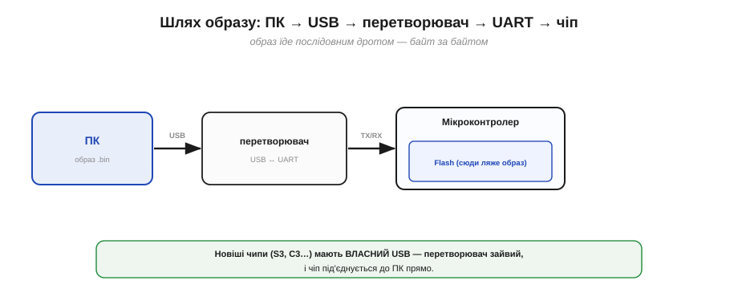
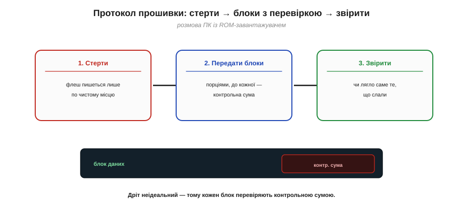
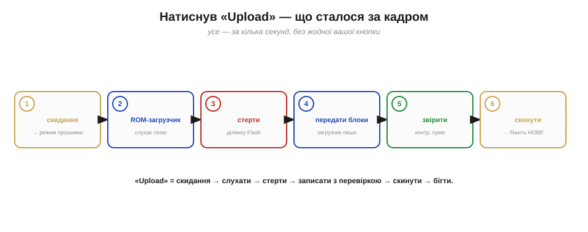
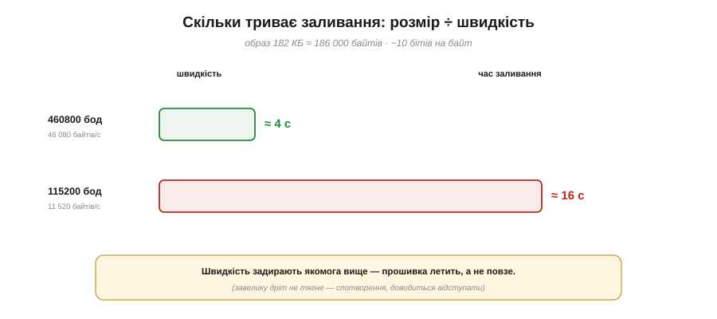

# Прошивка у Flash: як код потрапляє в чіп (по USB/UART)

Готовий **образ прошивки** ([*firmware image*](book:programming/firmware-image)) — це файл байтів, що має лягти у Flash чипа. Лишається найбуденніше й водночас найзагадковіше: як ці байти **фізично** перебираються з вашого ПК у мікросхему пам'яті на платі? Ви ж просто тиснете «Upload» — а за мить чіп уже біжить новим кодом. Розкриймо й цей фокус. У ньому три дійові особи: **дріт** (послідовний канал), **режим прошивки** (коли чіп слухає, а не виконує) і — найелегантніше — сам чіп, що **прошиває себе** за вказівками з ПК.

Варто наперед розвіяти один острах новачка: «а раптом заллю щось зламане — і чіп перетвориться на цеглину?» Майже завжди **ні**, і саме завдяки тому, як усе влаштовано: помічник усередині чипа, що приймає прошивку, **незнищенний**, тож новий, виправлений образ можна залити будь-коли. Тримаймо цю заспокійливу думку в голові, поки розбиратимемо механізм.

### Дріт між ПК і чипом: послідовний канал

Спершу — чим узагалі з'єднані ПК і чіп. Образ мандрує **послідовним каналом** (*serial*): по дроту, яким байти біжать **один за одним**, біт за бітом. Класично це [**UART**](book:communications/async-serial) — простий двопровідний інтерфейс (лінія передачі TX і приймання RX); тут досить уявляти його як «дротяну стрічку, що несе байти по черзі». А оскільки сучасний ПК має не UART, а USB, на платі ставлять маленький **перетворювач USB↔UART**, що й зводить ці два світи. (Новіші чипи на кшталт ESP32-S3 чи C3 мають **власний** USB — тоді перетворювач не потрібен, і чіп під'єднується до ПК прямо.)


*Рис. Дорога, якою їде образ. З ПК він виходить по **USB**, на платі **перетворювач USB↔UART** обертає його на простий послідовний потік, і той дротами TX/RX тече у чіп — байт за байтом. У новіших чипів є власний USB, тож перетворювач зайвий. Сам UART тут просто «дріт, що несе байти».*

Завважте: цей канал **двосторонній**. Образ тече з ПК у чіп, але чіп **відповідає** назад — підтверджує отримане, звітує про збій; без зворотного слова ПК не знав би, чи дійшло. І ще приємна дрібниця: **той самий** послідовний канал ви потім використовуєте, щоб читати, що чіп друкує в `Serial` під час роботи (знаменитий «монітор порту»). Один і той самий дріт служить і для заливання прошивки, і для розмови з нею — лише в різні моменти. Тому, до речі, монітор порту й заливання не можна тримати ввімкненими водночас: вони б'ються за ту саму лінію, і середовище зазвичай саме закриває монітор на час Upload.

### Режим прошивки: чіп слухає, а не біжить

Тепер головна заковика. Зазвичай чіп, тільки-но ввімкнувся, **виконує** вашу програму — йому ніколи слухати, що там шле ПК. Щоб його прошити, він має перейти в особливий **режим прошивки** (*flash / download mode*): не бігти, а **завмерти й слухати** послідовну лінію, чекаючи команд «запиши ось це у Flash».

Як його туди загнати? Скиданням (*reset*) із одночасно затиснутою особливою «завантажувальною» ніжкою (на ESP32 це GPIO0, притиснутий до землі — одна з [«вередливих» strapping-ніжок](book:programming/esp32-architecture), що при ввімкненні задають режим старту). Звучить як ручна морока — але насправді **за вас це робить плата**: той самий перетворювач USB↔UART має пару керувальних ліній, якими автоматично смикає скидання й GPIO0 у потрібний момент. Тому ви нічого не тиснете — інструмент із ПК сам перемикає чіп у режим прошивки, заливає й повертає назад.


*Рис. Чіп має два режими. У **звичайному** він після ввімкнення виконує вашу програму. У **режимі прошивки** він натомість **слухає** послідовну лінію, чекаючи команд запису Flash. Перемикає його туди скидання із затиснутою завантажувальною ніжкою (GPIO0) — і робить це автоматично плата, а не ваші руки.*

Як саме плата «сама смикає» скидання й GPIO0? У перетворювача USB↔UART є дві службові лінії (історично названі DTR і RTS), і на платі їх хитро зведено так, щоб у потрібну мить одна притиснула скидання, а друга — GPIO0. Інструмент із ПК лише шарпає ці лінії за домовленою послідовністю — і чіп слухняно падає в режим прошивки, а тоді так само з нього виходить. Щоправда, на деяких дешевих чи саморобних платах цього автомата нема — тоді режим прошивки вмикають **руками**: затискають кнопку **BOOT** (вона тримає GPIO0) і коротко тиснуть **RESET**. Звідси й поширена порада з форумів «притримайте BOOT під час заливання» — це ручна заміна тієї автоматики.

### Хто пише у Flash: завантажувач у ROM

А тепер найхитріше питання: **хто саме** вписує байти у Flash? Адже ПК не дотягується до мікросхеми пам'яті напряму — він лише шле байти по дроту. Отже, щось **усередині** чипа мусить ці байти прийняти й запрограмувати ними Flash. І це «щось» — крихітний **завантажувач у ROM** (*ROM bootloader*): незмінна програмка, **вшита на заводі** в [постійну пам'ять чипа](book:programming/esp32-architecture) (той самий ROM). У режимі прошивки керування дістає саме він: приймає образ із послідовної лінії й власноруч пише його у Flash.

Ось у чому елегантність: чіп, по суті, **прошиває сам себе**. ПК не «записує в чіп» — він **диктує**, а внутрішній ROM-завантажувач слухняно виконує: «зітри отут», «запиши ці байти», «звітуй». Заводський завантажувач — той надійний помічник, що завжди на місці (його не можна стерти чи зіпсувати прошивкою), тож чіп ніколи не «закам'яніє» остаточно: хай би що ви залили, ROM-завантажувач знову прийме новий образ.

Тут ховається й елегантне розв'язання курячо-яєчної загадки. Подумайте: щоб залити **першу** в житті прошивку в новісінький, порожній чіп, у ньому вже має бути **щось**, що прийме байти, — але ж він порожній! Вихід — саме ROM-завантажувач: він лежить **не у Flash**, а в окремій незмінній пам'яті, вшитій на заводі, тож існує **завжди**, навіть коли Flash абсолютно чистий. Першу прошивку приймає він; усі наступні — теж він. Без цього заводського «зернятка» чіп справді був би мертвим каменем, який нічим оживити, — і саме воно ж є вашою страховкою від «цеглини».


*Рис. Чіп прошиває сам себе. ПК лише **диктує** байти по дроту; усередині чипа їх приймає **ROM-завантажувач** — незмінна заводська програмка — і власноруч пише образ у Flash. Оскільки цей завантажувач у ROM незнищенний, чіп ніколи не «закам'яніє»: новий образ можна залити завжди.*

### Протокол прошивки: стерти, записати, перевірити

ПК і ROM-завантажувач спілкуються за домовленим **протоколом** (для ESP32 інструмент зветься *esptool*). Розмова має три дії:

- **стерти** ділянку Flash. Це не примха: флеш-пам'ять улаштована так, що писати в неї можна лише по **попередньо стертому** місцю — спершу «очистити», тоді «записати», не навпаки;
- **передати образ блоками**: ПК шле байти не суцільним потоком, а порціями, до кожної додаючи **контрольну суму** — щоб ROM-завантажувач упевнився, що блок дійшов без спотворень (дріт неідеальний);
- **перевірити** результат: наприкінці часто звіряють контрольну суму всього записаного — чи лягло у Flash саме те, що слали.

> ⚙️ **Як цей протокол улаштований зсередини.** Кадрування SLIP (байт-роздільник 0xC0), хитрість зі «stub»-прошивачем у RAM заради швидкості й покрокова перевірка запису — у вставці [Як esptool розмовляє з ROM-завантажувачем](proj-flash-protocol.md).

Чому ж флеш узагалі вимагає «спершу стерти»? Бо [фізично стирання](book:programming/flash-internals) переводить усі біти комірки в **одиниці**, а запис уміє лише **гасити** окремі біти в нулі — назад в одиницю один біт не повернеш, тільки стерши цілий блок. Звідси й непорушний порядок «очистити → записати». І ще одна важлива риса: кожне стирання потроху **зношує** флеш — комірка витримує десятки-сотні тисяч циклів перезапису, не більше.

> 🔧 **Навіщо це.** Для **розробки** цей знос — нескінченність: хоч прошивай тисячу разів на день роками, ресурсу флеш вистачить. А от у самій **програмі** писати у флеш **щосекунди** (наприклад, безперервно вести там лічильник) — погана ідея: так комірку справді можна «затерти до дірки» за місяці. Тому налаштування, калібрування й лічильники у флеш оновлюють **ощадливо** — лише коли справді змінилися, а не безперервно. Знаючи фізику флеш, ви самі уникнете цієї пастки.


*Рис. Розмова ПК із ROM-завантажувачем. Спершу **стерти** ділянку (флеш пишеться лише по чистому). Тоді **передати образ блоками**, до кожного — контрольна сума (раптом дріт спотворив). Наприкінці — **звірити** записане. Лише так байти надійно опиняються у Flash.*

> 🔧 **Навіщо це.** Дві найчастіші причини, чому «не заливається». Перша: чіп **не зайшов у режим прошивки** — плата не змогла сама смикнути скидання й GPIO0 (тоді інструмент скаржиться, що не «бачить» чипа, і на деяких платах доводиться вручну притримати кнопку BOOT). Друга: ви вказали **не той порт** чи неузгоджену **швидкість** (baud). Знаючи, що заливання — це послідовна розмова в особливому режимі, ви шукатимете причину саме там: режим, порт, швидкість, кабель, — а не в самому коді.

Ще одна деталь пояснює, чому заливання — це часом **кілька** записів, а не один. Образ вашої програми — не єдине, що має лягти у Flash: поряд із нею у пам'ять кладуть ще [завантажувач](book:programming/bootloader) і [таблицю розділів](book:programming/partition-table). Тому інструмент пише у Flash кілька шматків, кожен — за своїм **зсувом** (адресою): маленький завантажувач на початок, таблицю розділів слідом, а вашу програму — далі, на відведене їй місце. Через це у звіті заливання ви й бачите **кілька** рядків «`Writing at 0x…`» з різними адресами: це не один файл, а кілька частин прошивки, що займають свої місця у Flash.

### Весь цикл: натиснув Upload — що сталося

Зведімо всіх трьох дійових осіб в одну послідовність. Ви тиснете «Upload» — і за лаштунками інструмент із ПК робить ось що:


*Рис. Що криється за кнопкою «Upload». (1) Інструмент **скиданням** заганяє чіп у режим прошивки; (2) прокидається **ROM-завантажувач** і слухає лінію; (3) інструмент **стирає** потрібну ділянку Flash; (4) **передає образ блоками** з контрольними сумами, а завантажувач їх **пише**; (5) наприкінці — **звірка**; (6) інструмент ще раз **скидає** чіп — уже у звичайний режим, і той запускає **нову** прошивку. Усе — за кілька секунд, без жодної вашої кнопки.*

Цікаво, що весь цей балет ви бачите лише як скромний рядок поступу в інструменті — крапки чи відсотки, що повзуть до ста. А за ними — і скидання, і перемикання режимів, і стирання, і потік блоків із перевірками. Тому, коли наступного разу спостерігатимете, як повзе «`Writing at 0x… (45 %)`», ви впізнаватимете в ньому кожен крок цього танцю.

Чому ж чіп після скидання починає виконувати **саме** вашу програму, а не лишається сидіти в завантажувачі, — це вже окреме питання [reset-послідовності й передачі керування](book:programming/bootloader). Тут важлива сама картина: «Upload» — це **скидання → слухати → стерти → записати з перевіркою → скинути → бігти**.

### Порахуймо: скільки триває заливання

Чому заливання то швидке, то млосно довге? Бо весь образ їде тонким послідовним дротом, і час залежить від **швидкості** цього дроту — числа в **бодах** (бітах за секунду), яке ви, певно, бачили в налаштуваннях. Прикиньмо.

**Приклад (час передачі образу).** Візьмімо типовий [образ прошивки](book:programming/firmware-image) — **182 КБ**. Заливаємо на швидкості **460800 бод**.

```
образ = 182 КБ = 182 × 1024 ≈ 186 000 байтів

на кожен байт у UART іде ~10 бітів  (8 даних + старт + стоп)
отже пропускна здатність ≈ 460800 / 10 = 46 080 байтів/с

час передачі ≈ 186 000 / 46 080 ≈ 4 секунди

а на 115200 бод (вчетверо повільніше):
   46 080 / 4 ≈ 11 520 байтів/с
   186 000 / 11 520 ≈ 16 секунд
```


*Рис. Час заливання = розмір ÷ швидкість. Той самий образ на 460800 бод летить за ~4 с, а на вчетверо повільнішій 115200 — повзе ~16 с. Тому швидкість і задирають якомога вище; та безмежно її не підняти — завеликий темп дріт уже не тягне.*

Ось чому в налаштуваннях заливання є вибір швидкості, і чому її задирають якомога вище: на 460800 бод прошивка летить за чотири секунди, а на старій 115200 — повзе всі шістнадцять. (Вище безмежно не підняти: завеликий темп дріт уже не тягне — спотворення, і доводиться відступати.) А ще звідси видно, чому **малий розмір образу** — це не лише про економію Flash, а й про швидший цикл «змінив → залив → перевірив»: менше байтів — менше чекати. Звідси й проста звичка доброго ритму розробки: тримати швидкість заливання високою, а образ — компактним; тоді ланцюжок «правка → Upload → перевірка» стискається до кількох секунд, і працювати стає легко, а не нудно-млосно.

Отже, заливання — це послідовна розмова ПК із вшитим у чіп ROM-завантажувачем: чіп переводять у режим прошивки, стирають Flash, передають образ блоками з перевіркою — і чіп, по суті, пише свій Flash сам, а заводський завантажувач у ROM водночас і помічник у цьому, і страховка від «цеглини». Образ уже в пам'яті — а те, що відбувається в ту мить, коли чіп скидають і він **оживає**, як керування переходить від заводського завантажувача до вашого `setup()`, — це вже окрема історія [старту й передачі керування](book:programming/bootloader).

---
