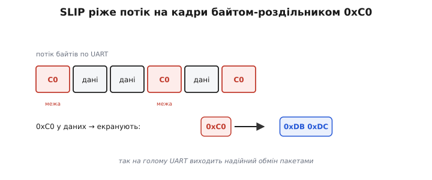
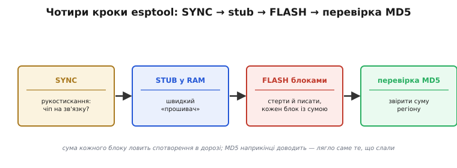

# ⚙️ Як esptool розмовляє з ROM-завантажувачем: SLIP-кадри, stub, перевірка

> Алгоритмічна вставка про те, як [прошивка образу у Flash](topic:programming/flashing) доходить до чіпа надійно. Образ тече в чіп по UART, а приймає його **завантажувач у ROM**. Тут — як саме `esptool` із ним домовляється, щоб байти дійшли **надійно**, навіть якщо лінія шумить.

## Задача

Чіп у режимі завантаження виконує крихітну незмінну програму — **ROM-завантажувач**. `esptool` на ПК мусить, спілкуючись із ним по простому послідовному дроту, надійно записати мегабайти у Flash. Проблем одразу три: як **розрізати** суцільний потік байтів на пакети, як зробити це **швидко** (ROM-завантажувач повільний) і як **переконатися**, що записане справді записалося правильно.

## Ідея: кадрування, stub і перевірка

ROM-завантажувач розуміє невеликий набір **команд** (SYNC, FLASH_BEGIN, FLASH_DATA, FLASH_END…). Але по UART іде суцільний потік байтів — де в ньому межі команди? Тут і потрібне **кадрування SLIP** (*Serial Line IP*): спеціальний байт **0xC0** позначає **межу кадру**. А щоб цей байт можна було передати й усередині даних, його **екранують**: 0xC0 → 0xDB 0xDC. Простий і надійний спосіб знайти пакети в потоці.


*SLIP ріже потік на кадри байтом-роздільником 0xC0. Якщо 0xC0 трапляється в даних — його екранують (0xC0 → 0xDB 0xDC), щоб не сплутати з межею. Так на голому UART виходить надійний обмін пакетами.*

Друга хитрість — **stub**. ROM-завантажувач малий і повільний, тож `esptool` спершу заливає в **RAM** свій маленький «прошивач» — **stub-loader** — і запускає його. Далі вся справжня прошивка йде вже **через stub**: швидше, з підтримкою стиснення й більших можливостей. Ось чому в логах ви бачите «*Uploading stub… Running stub…*» **перед** самим записом.

## Повна послідовність — і два прийоми надійності

Уся розмова вкладається в чотири кроки. Спершу **SYNC** — рукостискання з ROM-завантажувачем (чи він на зв'язку?). Тоді залити **stub** у RAM і запустити — швидкий «прошивач». Далі для кожної ділянки образу: **FLASH_BEGIN** стирає потрібний регіон, **FLASH_DATA** шле в нього дані блоками (кожен — із контрольною сумою), **FLASH_END** завершує. Наостанок **перевірка**: порахувати MD5 залитого регіону просто на чипі й звірити з очікуваним — збіглося, значить готово.


*Чотири кроки. SYNC — переконатися, що чіп на зв'язку. Stub — залити в RAM швидкий прошивач. FLASH — стерти й писати блоками, кожен із контрольною сумою. Перевірка MD5 — звірити суму залитого з очікуваною, щоб гарантувати: записалося саме те, що слали.*

За цим переліком стоять два прийоми, на яких і тримається надійність, — і обидва варто побачити в живому коді. Перший — **кадрування SLIP**: перед відправкою кожен пакет обрамлюють байтом-роздільником 0xC0, а щоб той самий байт усередині даних не сплутали з межею, його екранують. Ось як обгортає пакет бік ПК:

```c
#include <stdint.h>
#include <stddef.h>

#define SLIP_END     0xC0   // межа кадру
#define SLIP_ESC     0xDB   // початок екран-послідовності
#define SLIP_ESC_END 0xDC   // пара 0xDB 0xDC означає байт даних 0xC0
#define SLIP_ESC_ESC 0xDD   // пара 0xDB 0xDD означає байт даних 0xDB

// Обгорнути payload у SLIP-кадр. Буфер out мусить мати запас на 2*len + 2
// байти (кожен байт у гіршому разі подвоюється, плюс дві межі).
// Повертає фактичну довжину готового кадру.
size_t slip_encode(const uint8_t *payload, size_t len, uint8_t *out) {
    uint8_t *p = out;
    *p++ = SLIP_END;                     // відкриваємо кадр
    for (size_t i = 0; i < len; i++) {
        switch (payload[i]) {
            case SLIP_END:               // 0xC0 у даних →
                *p++ = SLIP_ESC;         //   0xDB
                *p++ = SLIP_ESC_END;     //   0xDC
                break;
            case SLIP_ESC:               // 0xDB у даних →
                *p++ = SLIP_ESC;         //   0xDB
                *p++ = SLIP_ESC_ESC;     //   0xDD
                break;
            default:
                *p++ = payload[i];       // звичайний байт — як є
        }
    }
    *p++ = SLIP_END;                     // закриваємо кадр
    return (size_t)(p - out);
}
```

Приймач на тому кінці робить дзеркальне: ловить 0xC0 як межу пакета, а пару 0xDB 0xDC знову згортає в 0xC0 (і 0xDB 0xDD — у 0xDB). Тому будь-який набір байтів — навіть із 0xC0 всередині — безпечно проходить крізь UART одним цілим пакетом.

Другий прийом — **контрольна сума кожного блоку**. Кадр SLIP лише окреслює межі; спотворений на шумній лінії байт він не виправить і навіть не помітить. Тож у команду FLASH_DATA поряд із даними кладуть їхню контрольну суму — простий XOR усіх байтів блоку, засіяний магічним числом 0xEF:

```c
// Контрольна сума блоку даних для ROM-завантажувача ESP:
// XOR усіх байтів, засіяний 0xEF. Результат — один байт.
uint8_t esp_checksum(const uint8_t *data, size_t len) {
    uint8_t sum = 0xEF;                  // магічний засів протоколу
    for (size_t i = 0; i < len; i++)
        sum ^= data[i];                  // кожен байт підмішуємо через XOR
    return sum;                          // змінився бодай байт → інша сума
}
```

ROM-завантажувач лічить те саме над отриманими байтами; не збіглося — блок відкидають і шлють наново. А наприкінці, поверх цих поблокових сум, іде ще й **MD5** усього регіону: він доводить, що в чипі лежить рівно те, що ви слали. Самі [контрольні суми](topic:communications/checksums) — це короткий «відбиток» даних: змінився бодай байт — змінюється сума.

## Складність і пастки

- **«Failed to connect»** — це майже завжди провал **кроку 1 (SYNC)**: чіп не ввійшов у режим завантаження. Причина зазвичай не в протоколі, а в **залізі** — не спрацювало [авто-скидання чи strapping](topic:programming/bootloader); рятує ручний BOOT+EN.
- **Швидкість (baud).** Вища швидкість заливає швидше, але на поганому кабелі **частіше збоїть**; SLIP і контрольні суми це ловлять, та надійніше знизити baud.
- **Шум лінії** SLIP сам по собі не лікує — він лише кадрує; від спотворень рятують **контрольні суми** блоків.
- **Без stub** (режим сумісності) теж можна, але повільніше й з меншими можливостями.
