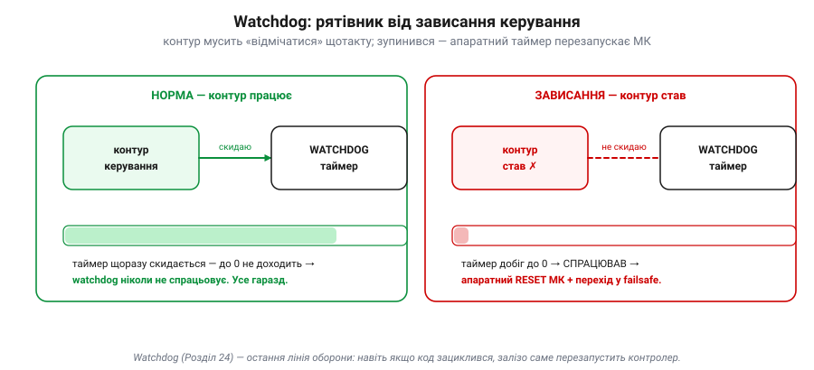
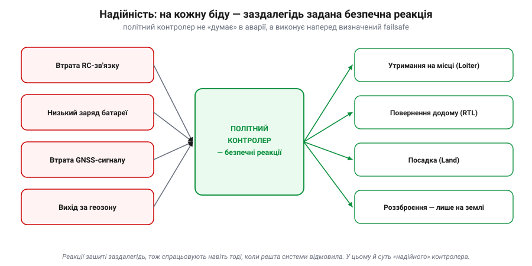

# Навіщо виділений політний контролер

Здавалося б, навіщо городити окрему скромну плату, коли на борту нерідко вже є потужний комп'ютер — одноплатний Linux, а то й смартфон, що в сотні разів швидший за дешевий мікроконтролер? Чому б не крутити контур керування **там**? Відповідь — у трьох вимогах, яких потужність сама по собі **не** задовольняє: **реальний час**, **надійність** і **резервування**. Саме вони, а не «гігагерци», вирішують, чи втримається апарат у повітрі. Розгляньмо їх по черзі — і стане ясно, чому критичне керування віддають окремому, навмисно простому контролеру.

### Реальний час: вчасно — важливіше, ніж швидко

Внутрішній контур орієнтації [автономної системи](root:embedded/autonomous-system) мусить оновлюватися сотні разів на секунду. «Реальний час» (*real-time*) — це **не** «швидко». Це **вчасно, ГАРАНТОВАНО, кожного разу**. Система реального часу — та, що встигає до **строку** (*deadline*) не в середньому, а **завжди**, навіть у найгіршому випадку. Бо у польоті запізнення на один такт — це не «трохи лаг», а кут, який встиг вирости, поки контур мовчав.

Порахуймо строк у числах:

```
такт контуру орієнтації:   400 Гц   →   T = 1 / 400 = 2.5 мс
обчислення за такт:        ~1.2 мс              1.2 < 2.5  ✓ вкладаємось
пауза універсальної ОС:    до ~20 мс            (планувальник зайнявся іншим)
   20 мс / 2.5 мс  ≈  8 пропущених тактів   →   стабілізацію може зірвати
```

Ось де ховається диявол. Виділений мікроконтролер з невеликою [операційною системою реального часу](topic:programming/freertos) (RTOS) або взагалі на «голому залізі» дає **обмежену, передбачувану** затримку: ти знаєш найгірший час відгуку й гарантуєш, що такт устигне. А **звичайна, не налаштована** універсальна ОС — Linux на одноплатнику чи Android у телефоні — оптимізована під **середню пропускну здатність**, а не під строки. Вона будь-якої миті може на десятки мілісекунд призупинити твою задачу заради своїх справ: перемикання процесів, робота з пам'яттю, мережа, фонові служби. У середньому — блискавично; але **гарантії немає**, а саме гарантія тут — питання життя апарата. (Це не вирок самому Linux: із ядром реального часу **PREEMPT_RT** і потоками з реальним пріоритетом затримку утискають до десятків мікросекунд — і ArduPilot саме так працює на Linux-платах. Та навіть тоді строки треба **рахувати** й перевіряти, а не вважати, що «RTOS = магічна гарантія».)


*Той самий контур, два «мозки». На виділеному МК такти йдуть рівно, кожен укладається у свої 2.5 мс. На універсальній ОС більшість тактів теж устигає — але варто планувальнику відволіктися, і один такт перескакує дедлайн. У відеоплеєрі це непомітне підвисання; у польоті — апарат хитнуло, бо контур не оновився вчасно.*

Чому універсальна ОС узагалі дозволяє собі такі паузи? Бо її будували для **справедливості й пропускної здатності**, а не для строків: планувальник чесно ділить процесор між десятками задач, перемикає їх, обробляє переривання від мережі й диска, підвантажує сторінки пам'яті. Кожна з цих дрібниць корисна — і кожна може на мить «вкрасти» процесор у твого контуру. Інженер реального часу мислить не середнім, а **найгіршим** часом виконання (*worst-case execution time*): питання не «як швидко зазвичай», а «який найбільший час відгуку я можу **гарантувати**». Виділений контролер на те й виділений, щоб цю гарантію взагалі можна було дати.

Розрізняють **жорсткий** і **м'який** реальний час (*hard / soft real-time*). Пропустити строк внутрішнього контуру — **жорсткий**: наслідок катастрофічний, апарат падає. Спізнитися з пакетом телеметрії — **м'який**: прикро, але не смертельно. Виділений контролер існує саме заради **жорсткої** частини: він робить мало, але робить це з гарантією за часом.

> 🔧 **Навіщо це.** Коли побачиш у даташиті чи описі автопілота слова *real-time*, *RTOS*, *deterministic*, *jitter*, *loop rate 400 Hz* — це не маркетинг, а обіцянка **строків**. І це пояснює, чому контур керування не варто вішати на завантажену універсальну ОС: вона швидка, але непередбачувана, а керуванню потрібна саме передбачуваність.

#### Коли «майже вчасно» ледь не згубило місію

У 1997 році на Марс сів апарат **Mars Pathfinder** із ровером Sojourner. За кілька днів його бортовий комп'ютер почав раз по раз **сам себе перезавантажувати**, втрачаючи дані. Причина виявилася підступною: **інверсія пріоритетів** (*priority inversion*) у системі реального часу. Високопріоритетна задача керування шиною даних чекала на ресурс, зайнятий низькопріоритетною задачею; а та ніяк не могла його звільнити, бо її саму витісняла задача середнього пріоритету. Високопріоритетна задача не вкладалась у строк — і **watchdog** (сторожовий таймер), помітивши це, перезапускав усю систему.

Інженери відтворили збій на земній копії, поставили діагноз і **дистанційно** залили виправлення — увімкнули «успадкування пріоритету» на тому ресурсі. Мораль подвійна. По-перше, реальний час — це про **строки**, і навіть на ідеальному залізі тонка взаємодія задач може їх зірвати. По-друге — апарат **вижив** лише тому, що watchdog зловив зависання й перезапустив систему в безпечний стан. Саме тому виділений контролер навмисно простий: що менше в ньому всього, то менше місць, де така інверсія може зачаїтися.

#### Watchdog: остання лінія оборони

А що, як код не просто спізнився, а **завис** зовсім — зациклився чи застряг у блокуванні? Тоді нема кому навіть помітити проблему. Рятує апаратний [**сторожовий таймер**](topic:programming/watchdog) (*watchdog timer*): окремий лічильник у залізі, який контур керування мусить **скидати щотакту** («я живий»). Якщо контур перестав скидати таймер, той за визначений час добігає нуля й **апаратно перезавантажує** мікроконтролер — а той піднімається у заздалегідь безпечному стані.


*Watchdog як «вимикач мертвої руки». Поки контур живий, він раз за разом скидає таймер, і той ніколи не доходить до нуля. Щойно контур завис і перестав «відмічатися» — таймер спрацьовує й перезапускає контролер. Це залізо, незалежне від коду, тож воно діє навіть тоді, коли сам код зламався.*

> 🔧 **Навіщо це.** Watchdog — причина, чому виділений контролер уміє **оговтатися** від власної помилки за частку секунди, а зависання застосунку на універсальній ОС може тривати скільки завгодно. Налаштовуючи чужий автопілот, не вимикай watchdog «щоб не заважав»: це буквально та страховка, що піднімає апарат після збою.

### Надійність: одна робота, зроблена без відволікань

Друга вимога — **надійність**. І тут головна перевага виділеної плати парадоксальна: вона в тому, що плата робить **мало**. Контролер, який лише читає давачі й крутить мотори, має **маленький, доступний для перевірки** код і небагато режимів збою. Універсальний же комп'ютер тягне цілу ОС, мережевий стек, драйвери, застосунки — і кожна з цих частин може зависнути, з'їсти всю пам'ять чи впасти. Ти ж не хочеш, щоб код «не дай впасти» ділив процесор із відеокодеком, який одної миті вирішить підвиснути.

Тому критичне керування **ізолюють**: виділений контролер не відволікається ні на що, окрім польоту. До цього додаються апаратні запобіжники — той самий watchdog, контроль просідання живлення (*brown-out detection*), скидання у відомий стан. А головне — [**failsafe**](topic:programming/failsafe): на кожну ймовірну біду в контролер **заздалегідь** зашито безпечну реакцію, яка спрацює навіть тоді, коли все інше відмовило.


*Надійність — це не «нічого не ламається», а «коли ламається, поведінка передбачувана». Втрата RC-зв'язку, низький заряд, зникнення GNSS, вихід за дозволену зону — на кожне контролер має наперед визначену відповідь: утримання, повернення додому, посадка чи роззброєння. Рішення зашите заздалегідь, тож не потребує ні пілота, ні «розумного» комп'ютера в момент аварії.*

Зверни увагу: failsafe тому й працює, що він **простий і автономний**. Самій його логіці не треба ні зв'язку із землею, ні бортового комп'ютера — лише контролер, який і так крутиться. (Щоправда, яку саме **дію** він обере, залежить від наявних давачів: «повернутися додому» (RTL) потребує придатної оцінки позиції — а як GNSS не годен, безпечнішим вибором стає **посадка на місці**.) Якби ці реакції жили в застосунку на Linux, вони б відмовили рівно тоді, коли найпотрібніші, — разом із рештою системи.

Тут варто розрізняти два рівні відповіді на відмову. **Безпечна відмова** (*fail-safe*) — перейти у завідомо безпечний стан: зависнути на місці, сісти, повернутися додому. **Працездатна відмова** (*fail-operational*) — продовжити виконувати завдання навіть із вадою, спираючись на резерв. Простий апарат зазвичай тягне на fail-safe: щось пішло не так — акуратно сядь. Відповідальний — на fail-operational: відмовив давач, перемкнися на резервний і лети далі. Виділений контролер — основа обох: він і є тим простим ядром, якому можна довірити рішення «що робити, коли зламалося».

> 🔧 **Навіщо це.** Розбираючи чужий апарат, шукай, **де живе failsafe-логіка**. Якщо вона у виділеному контролері — система переживе зависання «розумної» частини. Якщо її повісили на бортовий комп'ютер чи мобільний застосунок — це червоний прапорець: у найгірший момент вона відмовить разом із ними.

### Резервування: пережити відмову, а не сподіватися на безвідмовність

Третя вимога — **резервування** (*redundancy*). Жодна деталь не безвідмовна, тож критичні дублюють: на серйозних платах ставлять **кілька IMU**, буває два барометри, кілька приймачів GNSS, подвійне живлення. Сенс не в точності, а в тому, щоб **відмова однієї деталі не стала відмовою системи**. Якщо один давач «збожеволів», контролер має це **помітити** й перемкнутися на справний. (Найпростіша модель для інтуїції — «голосування» трьох IMU. Реальний ArduPilot робить тонше: веде кілька оцінювачів-**«ланів»** EKF на різних наборах давачів, дає кожному «бал помилки» за узгодженістю й перемикається на лан із найкращим балом — це *EKF lane switching*.)


*Три IMU не для краси. Коли один видає −47° замість реальних ~+12°, голосування виявляє «викид», відкидає його й передає оцінювачу узгоджене значення двох справних. Так апарат переживає відмову окремого давача замість того, щоб сліпо повірити брехливому й перекинутися.*

Таке перемикання називають **плавною деградацією** (*graceful degradation*): система не падає від першої відмови, а втрачає по трохи — спершу віддає резерв, а вже якщо біда не минула, переходить у failsafe. Добрий контролер ще й **повідомляє** у лог і на землю, який саме давач відмовив, щоб після польоту було ясно, що сталося, а не лишалася загадка.

Але резервування має пастку, про яку варто знати кожному, хто будує надійні системи. Просто **подвоїти** щось — мало, якщо обидві копії ламаються **однаково**.

#### Дві історії резервування: Ariane 5 і шатл

4 червня 1996 року перший політ європейської ракети **Ariane 5** (рейс 501) завершився вибухом приблизно на 37-й секунді. Причина — у блоці інерціальної навігації (*SRI*), чий код переносили зі старішої Ariane 4. Одне зі значень швидкості не вмістилося під час перетворення 64-бітного числа з комою у 16-бітне ціле — сталося [**переповнення**](topic:programming/overflow-wraparound). Блок аварійно зупинився й видав на шину діагностику, яку головний комп'ютер прийняв за дані польоту й різко відхилив сопла — ракету зламало аеродинамікою, спрацював самопідрив.

Найважливіше для нас: блоків SRI було **два**, резервних, — і обидва крутили **однаковий** код. Резервний відмовив тим самим переповненням за мілісекунди до основного. Це **спільна за причиною відмова** (*common-mode failure*): дублювання з ідентичним програмним забезпеченням **не рятує** від програмної вади, бо обидві копії падають однаково.

Для контрасту — космічний шатл. У ньому було **чотири** однакові керівні комп'ютери, що працювали як резервна група з голосуванням, **плюс п'ятий** — резервний, із **незалежно написаним** програмним забезпеченням. Логіка прямо протилежна Ariane: якщо в основному коді ховається спільна вада, її не повторить код, написаний іншою командою з нуля. Це **різнорідне** (диверсифіковане) резервування. Урок обох історій один: дублюй не лише залізо, а й **способи відмови** — інакше дві однакові копії впадуть в один і той самий момент.

> 🔧 **Навіщо це.** Побачивши на платі «аж три IMU», не думай, що це про точність, — це про **виживання за відмови**. І пам'ятай межу: резервування захищає від випадкових поломок заліза, але не від вади у спільному коді. Тому failsafe (проста, окремо написана логіка) і резервні давачі доповнюють одне одного.

### Чому саме ВИДІЛЕНА плата: складімо докупи

Три вимоги — реальний час, надійність, резервування — і ведуть до однієї відповіді: критичне керування заслуговує на **власний, навмисно простий** контролер, а не кутик на завантаженому універсальному комп'ютері.


*Чому не «просто на потужному комп'ютері». За кожною ознакою, що важить для виживання — гарантований таймінг, миттєве завантаження, мало режимів збою, вбудовані watchdog і failsafe, справжній реальний час — виграє виділена плата. Універсальний комп'ютер сильний в іншому: важкі, «розумні» задачі. Тому їх і розділяють.*

Зверни увагу: це **не** означає, що універсальний комп'ютер поганий — він чудовий там, де треба багато обчислень і гнучкості (обробка відео, бачення, планування). Просто це **інша** робота з іншими вимогами. Мудра архітектура не вибирає одне з двох, а **розділяє** ролі: виживання — виділеному контролеру реального часу, «розум» — потужному комп'ютеру.

> 🔧 **Навіщо це.** Це відповідь на питання теми одним рядком: виділений політний контролер існує тому, що **гарантії за часом, простота й резервування коштовніші за гігагерци**, коли на кону — не впасти. Універсальний комп'ютер додають **поряд**, а не **замість**.

### Підсумок теми

Виділений політний контролер потрібен через три вимоги, яких сама потужність не дає. **Реальний час**: внутрішній контур мусить устигати кожен такт із гарантією, а універсальна ОС цього не обіцяє; страхує watchdog. **Надійність**: проста плата з однією роботою має мало режимів збою й несе автономний failsafe, що спрацьовує навіть тоді, коли все інше відмовило. **Резервування**: критичні давачі дублюють і голосуванням відкидають відмовлені — пам'ятаючи, що проти спільної програмної вади допомагає лише різнорідність. Разом це й робить «мозок» апарата окремою, навмисно скромною платою. А те, як ця скромна плата оживає всередині, видно на [шарах прошивки ArduPilot](topic:programming/ardupilot-layers).

---
